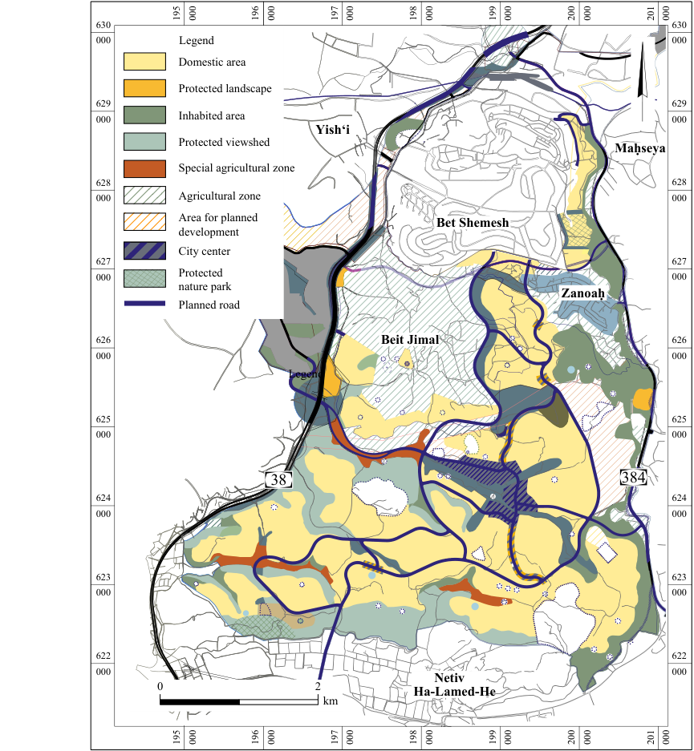
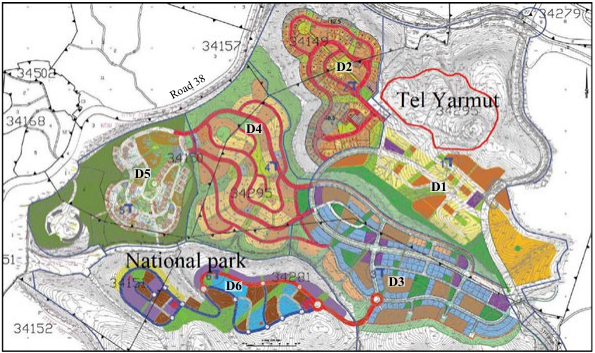
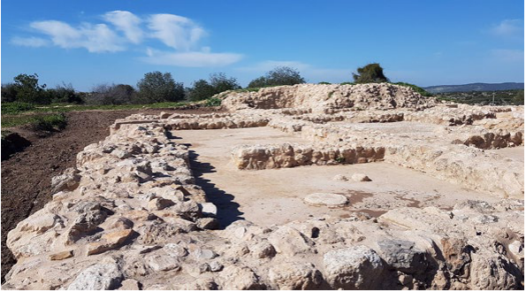
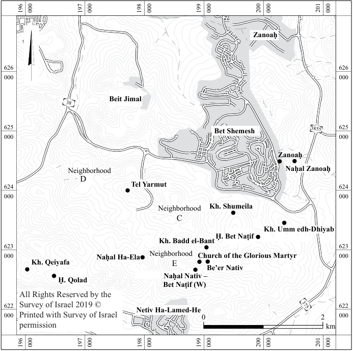

**“Along the Road to Bet Shemesh” (I Samuel 6:12) Archaeological Studies of the Ramat Bet Shemesh Region** 

**Editors: Ofer Sion Omer Shalev Benyamin Storchan Yehiel Zelinger** 

i 

**“** Along the Road to Bet Shemesh **”** (I Samuel 6:12) 

Archaeological Studies of the Ramat Bet Shemesh Region 

Editors: Ofer Sion Omer Shalev Benyamin Storchan Yehiel Zelinger 

Jerusalem 2023 

ii 

#### **Editors** 

Ofer Sion Omer Shalev Benyamin Storchan Yehiel Zelinger 

#### **Language Editors** 

Inbal Samet Zvi Gal 

#### **Translation from Hebrew** 

Miriam Feinberg Vamosh 

#### **Production Editor** 

Ayelet Hashahar Malka Dafnah Strauss-Doron 

#### **Typesetting, Layout and Production** 

Ann Buchnick-Abuhav 

**Front and Back Cover:** Aerial view of excavations at Ḥorbat Bet Naṭif, looking southeast (photography: Asaf Peretz); insert—a watercolor impression of the landscape near the Church of the Glorious Martyr, on the outskirts of Ḥorbat Bet Naṭif (drawing: Michelle Lyszyk) 

© 2023, The Israel Antiquities Authority ISBN 978-965-406-778-2 EISBN 978-965-406-779-9 

Printed at Digiprint Zahav Ltd. 2023 

iii 

### **Contents** 

- v **List of Abbreviations** 

- vii **List of Contributors** 

- ix **Editorial** 

- 1 **Ramat Bet Shemesh—Statutory Intervention in the Service of Archaeology in an Urban Environment** 

   - A. Shadman 

### **RAMAT BET SHEMESH FROM PREHISTORIC TO BIBLICAL TIMES** 

- 19 **Late Prehistoric Settlement Patterns in Ramat Bet Shemesh and its Surroundings** 

   - N. Ben-Ari and A. Eirikh-Rose 

- 49 **Subterranean Spaces outside Tel Yarmut—Evidence of Early EB IB Burials, EB III Dwellings and Agricultural Activities** 

   - Y. Paz and A.S. Mizrahi 

- 87 **Telling the Story of the Early Bronze Age—Developing the Archaeological Park at Tel Yarmut** 

   - O. Shalev, A. Golani, G. Haklay and A. Mashiah 

- 109 **The Intermediate Bronze Age Cemetery at Khirbat el-ʻAlya North—Some Cultural, Social and Phenomenological Aspects** 

   - Y. Paz, I. Radashkovsky, S. Gendler and N. Ben-Ari 

- 131 **The Planning of the Iron Age IIA Domestic Buildings at Khirbat Qeiyafa** 

   - A. Wiegmann 

### **RAMAT BET SHEMESH FROM CLASSICAL TO MODERN TIMES** 

- 163 **A Second Temple-Era Structure and a Luxurious Dwelling from the Fourth– Early Fifth Centuries CE at Ḥorbat Bet Naṭif** 

   - O. Sion, N. Benenstein, M. Balila and O. Shalev 

- 189 **Ramat Bet Shemesh from the Hasmonean Period through the Bar-Kokhba Revolt—Some Aspect of Jewish Life** 

   - O. Shalev, N. Benenstein and S. Tal 

- 213 **The Bet Naṭif Hills during the Late Roman Period** 

   - E. Klein and A. Levy-Reifer 

- 245 **Umm edh-Dhyiab—Two Roman Mausolea at Ramat Bet Shemesh East** 

   - P. Betzer, Y. Radashkovsky and R. Albag 

iv 

- 277 **Two Lamps with Pagan Iconography from the Ḥorbat Bet Naṭif Lamp Workshop** 

   - B. Storchan 

- 287 **Olive Oil Production in the Ottoman-Period Village of ʻEin Shems (Beth Shemesh)** 

   - E. Ayalon and B. Gross 

v 

### **List of Abbreviations** 

|_AA_|_Archäologischer Anzeiger_|
|---|---|
|ACOR|American Center of Oriental Research|
|_ADAJ_|_Annual of the Department of Antiquities of Jordan_|
|_AJA_|_American Journal of Archaeology_|
|ASOR|American Schools of Oriental Research|
|_‘Atiqot (ES)_|English Series|
|_BA_|_Biblical Archaeologist_|
|_BAIAS_|_Bulletin of the Anglo-Israel Archaeological Society (Strata BAIAS_ from 2009_)_|
|_BAR_|_Biblical Archaeology Review_|
|BAR Int. S.|British Archaeological Reports (International Series)|
|_BASOR_|_Bulletin of the American Schools of Oriental Research_|
|_BMB_|_Bulletin du Musée de Beyrouth_|
|CAENL|Contributions to the Archaeology of Egypt, Nubia and the Levant|
|_ESI_|_Excavations and Surveys in Israel_|
|_HA–ESI_|_Hadashot Arkheologiyot–Excavations and Surveys in Israel_ (from 1999)|
|IAA Reports|Israel Antiquities Authority Reports|
|_IEJ_|_Israel Exploration Journal_|
|_INR_|_Israel Numismatic Research_|
|_JAS_|_Journal of Archaeological Science_|
|_JEMAHS_|_Journal of Eastern Mediterranean Archaeology and Heritage Studies_|
|_JFA_|_Journal of Field Archaeology_|
|_JIPS_|_Journal of the Israel Prehistoric Society (Mitekufat Haeven)_|
|_JJS_|_Journal of Jewish Studies_|
|_JRA_|_Journal of Roman Archaeology_|
|_JRS_|_Journal of Roman Studies_|
|_JSJ_|_Journal for the Study of Judaism_|
|_JSOT_|_Journal for the Study of the Old Testament_|
|JSP|Judea & Samaria Publications|
|_JWP_|_Journal of World Prehistory_|
|_LA_|_Liber Annuus_|
|_LIMC_|_Lexicon iconographicum mythologiae classicae_|
|_NEA_|_Near Eastern Archaeology_|
|_NEAEHL_|_E. Stern and A. Lewinson-Gilboa eds. The New Encyclopedia of_|
||_Archaeoogical Excavations in the Holy Land_1–4_._Jerusalem 1993|

vi 

_NEAEHL 5 E. Stern ed. The New Encyclopedia of Archaeological Excavations in the Holy Land 5: Supplementary Volume. Jerusalem 2008_ PEFA Palestine Exploration Fund Annual _PEQ Palestine Exploration Quarterly QDAP Quarterly of the Department of Antiquities of Palestine RA Revue archéologique RB Revue Biblique_ SAOC Studies in Ancient Oriental Civilization SBF Studium Biblicum Franciscanum _ZDPV Zeitschrift des deutschen Palästina-Vereins_ 

vii 

### **List of Contributors** 

Amit Shadman, Israel Antiquities Authority Nathan Ben-Ari, Israel Antiquities Authority, Ben-Gurion University of the Negev Anna Eirikh-Rose, Israel Antiquities Authority Yitzhak Paz, Israel Antiquities Authority Ahuva Sivan Mizrahi, Israel Antiquities Authority Omer Shalev, Israel Antiquities Authority Amir Golani, Israel Antiquities Authority Gil Haklay, Israel Antiquities Authority Avi Mashiah, Israel Antiquities Authority Igal Radashkovsky, Israel Antiquities Authority Semyon Gendler, Israel Antiquities Authority Alexander Wiegmann, Israel Antiquities Authority Ofer Sion, Israel Antiquities Authority Nicolas Benenstein, Israel Antiquities Authority Moran Balila, Israel Antiquities Authority Sarah Tal, Israel Antiquities Authority Eitan Klein, Israel Antiquities Authority, Ashkelon Academic College 

Ayelet Levy-Reifer, Ashkelon Academic College Pablo Betzer, Israel Antiquities Authority 

Roy Albag, Tel-Aviv University, Osnabrück University 

Benyamin Storchan, Israel Antiquities Authority, Ben-Gurion University of the Negev 

Etan Ayalon, independent researcher 

Boaz Gross, Israeli Institute of Archaeology, Tel Aviv University 

shadman@israntique.org.il nathanba@israntique.org.il 

anna@israntique.org.il yitzhakp@israntique.org.il sivanmi@israntique.org.il omersh@israntique.org.il golani@israntique.org.il gilh@israntique.org.il avi@israntique.org.il igalrad@israntique.org.il semyon@israntique.org.il alexw@israntique.org.il sion@israntique.org.il nicolasb@israntique.org.il moranba@israntique.org.il sarahh@israntique.org.il eitank@israntique.org.il 

ayeletlevi@biu.013.net.il pablo@israntique.org.il royalbag@gmail.com 

dans@israntique.org.il 

ayalonetan@gmail.com boaz@israeliarchaeology.org 

### Editors 

Ofer Sion, Israel Antiquities Authority Omer Shalev, Israel Antiquities Authority Benyamin Storchan, Israel Antiquities Authority Yehiel Zelinger, Israel Antiquities Authority 

sion@israntique.org.il omersh@israntique.org.il dans@israntique.org.il yehiel@israntique.org.il 

viii 

ix 

### **Editorial** 

The early nineteenth century explorers of the Land of Israel, Edward Robinson and Eli Smith, documented their impressions of the Bet Shemesh region in _Biblical Researches in Palestine, Mount Sinai and Arabia Petraea_ , published in 1841: 

This may be called the hill-country, in distinction from the higher mountains on the East. It is the middle region between the mountains and the plain, stretching as we have seen far to the North and South, except where interrupted north of the mouth of Wady es-Sŭrâr [Soreq]. This region is for the most part a beautiful open country, consisting of low hills usually rocky, separated by broad arable valleys mostly sown with grain, as are also many of the swelling hills. The whole tract is full of villages and deserted sites and ruins; and many olive-groves appear around the former (p. 341). 

Since their visit, and especially over the last decades, the landscape of Bet Shemesh has changed dramatically. The once green hills have now been replaced with modern buildings, and the open valleys—with paved roads. As a product of intensive development works, the Bet Shemesh region has become an archaeological microcosm, with constant archeaological monitoring of the extensive development work, leading to numerous salvage excavations. These excavations have uncovered a rich tapestry of remains representing many aspects of ancient life, including settlements, farmsteads, stone quarries, agricultural terrace walls, winepresses, limekilns, columbaria, cisterns and burial caves. While most of the excavations have been undertaken by the Israel Antiquities Authority (IAA), university institutions and private archaeology companies have played a vital role in the fieldwork and scholarly impact of these excavations. Additional IAA projects in the region have been undertaken for conservation, restoration, community education and tourism development purposes. 

The huge volume of research emanating from the Bet Shemesh region could not have been accomplished without the Ramat Bet Shemesh Regional Project, spearheaded by Y. Dagan. The cumulation of the project was published as a twovolume report (IAA Reports 46 and 47) comprising a gazetteer compiled from 

x 

surveys and excavations and a volume dedicated to thematic studies. In many ways, the field methodologies developed during this project and its database serve as the backbone for all subsequent research, including the studies presented in this book. 

The fieldwork conducted over the last several decades in Ramat Bet Shemesh has uncovered a plethora of finds from prehistoric times to the British Mandate period. While most of the research is still ongoing, some excavations have already been published as final reports, articles and dissertations. 

Ramat Bet Shemesh has clearly defined geographical boundaries, with Naḥal Soreq on the north, Naḥal Zanoaḥ and Judean Hills on the east, and the Naḥal Ha-Ela on the south. The western border of this region extends along Naḥal Yarmut and Naḥal Yishʻi, both of which flow alongside Road 38, the main thoroughfare that traverses the Judean Shephelah from north to south. Ramat Bet Shemesh, as a modern city, can also be defined by the municipal boundaries of the city of Bet Shemesh, including areas zoned for new neighborhoods. These conditions have made the archaeology of Ramat Bet Shemesh a unique test case, in which extensive archaeological research has been conducted within a relatively small geographical unit and has provided an abundance of data, which is still unclear in other areas in the Judean Shephelah. 

The articles in this book are presented chronologically, painting a comprehensive and diverse archaeological picture. Some articles offer expansive overviews of the region during specific periods, while others focus on individual sites, finds or on a distinctive phenomenon. In the opening article, Shadman presents the complex relationship between the archaeological and developmental agencies. He elucidates the planning and development processes for Ramat Bet Shemesh and the considerations for preserving archaeological sites and the region’s cultural heritage. He further describes the creative solutions implemented on-site to preserve archaeological remains despite modern development. 

The article by Ben-Ari and Eirikh-Rose opens the first section of the book, which covers prehistoric through biblical times. The article focuses on the late prehistoric, Neolithic and Chalcolithic periods. It places a central emphasis on the sites recently uncovered around Ramat Bet Shemesh, but also examines other sites in the surrounding area. The authors summarize the finds, classifying them into sub-periods during which permanent settlements first appeared in the region and when the ‘agricultural revolution’ took place. Alongside a review of material culture from each period, the authors highlight changes in settlement distribution that occured over time. 

During the Early Bronze Age, one of the largest and most significant city-states in the Land of Israel was established at Tel Yarmut. Two articles focus on this 

xi 

site through different prisms. The article by Paz and Mizrahi discusses caves and subterranean complexes excavated outside the city walls. These served as dwellings and burial sites, shedding new light on the relationship between the urban center on the tell and its agricultural periphery. The article by Shalev et al. explores Tel Yarmut from the present to the past. It describes the process of developing public access to the site and within it by overviewing the challenges and dilemmas related to the preservation and presentation of the archaeological remains. 

The article by Paz et al. focuses on the Intermediate Bronze Age remains in the Bet Shemesh region, after Tel Yarmut declined from its prominence. It discusses the cemetery at the foot of Khirbat el-‘Alya, one of the largest cemeteries in the Land of Israel during this period, where approximately 200 shaft tombs were discovered. By illuminating the archaeological finds, the spatial distribution of the tombs, their orientations and the burial offerings they contained, the authors seek to glean information on the social relationships of the people of this era. 

Wiegmann’s article explores the domestic architecture of Khirbat Qeiyafa during the Iron Age IIA. The article explores possible environmental factors that influenced the planning of the structures at the site and compares them with other known Iron Age dwelling types, thus shedding light on the family structure of Khirbat Qeiyafa’s inhabitants. 

The article by Sion et al. opens the second section of the book, which covers Classical through Modern times. During this time span, the settlement at the site of Bet Naṭif was the central settlement in the region, serving as a district town ( _toparchy_ ) in the Roman period. The article is the initial publication of the recent excavations conducted at the site and of the re-exposure of the famed water cisterns originally excavated by Baramki almost a century ago. Based on the renewed excavations, the authors seek to establish the site’s chronological sequence and outline the characteristics of the settlement in each period. 

Two articles provide a comprehensive overview of the periods during which Bet Naṭif was at its zenith. The first of the two, by Shalev, Benenstein and Tal, examines the settlements surrounding Ramat Bet Shemesh from the Hasmonean period up to the Bar-Kokhba Revolt, when a Jewish population inhabited the area. By examining a series of sites and focusing on features such as _miqva’ot_ (ritual baths), hiding complexes and burial caves, the authors shed light on various aspects of Jewish life in the region. They further explore the chronology of the settlement pattern under the influence of two major historical events—the Great Revolt and the Bar-Kokhba Revolt. The second article, by Klein and Levy-Reifer, examines the demographic changes and the actions of the Roman administration in Ramat 

xii 

Bet Shemesh during the late Roman period, following the Bar-Kokhba Revolt. According to their research, this period saw the settlement of a diverse foreign population, characterized by Roman cultural and material influences, in the Ramat Bet Shemesh region. 

Two additional articles delve into the Roman period with a more focused perspective. The article of Betzer, Radashkovsky and Albag presents two mausolea— impressive burial structures—that were uncovered at Khirbat Umm edh-Dhiyab. Using advanced three-dimensional modeling and archaeological parallels from across the Roman world, the researchers present plausible reconstructions for these structures. These reconstructions rank the mausolea among the most splendid burial sites in the southern part of the Land of Israel during the Roman period. 

While Betzer, Radashkovsky and Albag remain uncertain about the ethnic identity of the interred—Jewish or pagan—Storchan’s article takes a decisive stance. Storchan presents two Beit Naṭṭif lamps that have been recently uncovered in excavations at the site of Bet Naṭif. The iconography on these lamps, which lacks parallels in the known repertoire of this family of lamps, reflects a distinct pagan worldview influenced by the popular iconography prevalent throughout the Roman Empire at the time. 

The book concludes with an article by Ayalon and Gross, which discusses oil-press installations that operated in caves during the late Ottoman period in the village of ʻEin Shems, the last permanent settlement at Tel Bet Shemesh. The authors present a detailed description of these installations and compare them to cave oil presses at contemporary sites, both in the immediate vicinity and beyond. Olive-tree cultivation and olive-oil production by the residents of ʻEin Shems continued a tradition that endured over two millennia at Tel Bet Shemesh, as evidenced by ancient installations for the production of olive oil dating back to the Iron Age. 

This book could not have been published without the dedicated work of numerous people and many thanks are due. Firstly, we would like to thank the field workers— excavators, supervisors, surveyors and conservators; the articles in this book are a direct result of their hard work. Thanks to the administrative personnel of the IAA Jerusalem District—Amit Re’em, Amit Shadman, Anna Eirikh-Rose and Semyon Gendler—for their assistance in the field and for their support of this publication. We also wish to thank the researchers who read, reviewed, questioned, corrected and improved the articles; Miriam Feinberg Vamosh for translating 

xiii 

the Hebrew manuscripts; Zvi Gal and Inbal Samet for language editing. Special thanks are due to the IAA publications department led by Zvi Greenhut: Galit Samora-Cohen for her assistance in the production process; Ann BuchnickAbuhav for graphic design; Noy Shemesh and Dafnah Strauss-Doron for the translation of the introduction; and Ayelet Hashahar Malka and Dafnah StraussDoron for overlooking the production of this book. Many thanks are owed to the management of the IAA, Director-General Eli Eskosido, Assistant DirectorGeneral Moshe Ajami, and head of the Archaeology Division Yuval Baruch, as well as to the Ministry of Construction and Housing and the Bet Shemesh Municipality for their support in promoting excavations and research in Ramat Bet Shemesh. Last but certainly not least, thanks to all the contributing authors; without your dedication this book would not exist. 

The words _thank you_ are not enough! The editors 

# **Ramat Bet Shemesh—Statutory Intervention in the Service of Archaeology in an Urban Environment** 

## **Amit Shadman** 

### **Introduction** 

The idea of publishing a volume on the subject of Ramat Bet Shemesh and its vicinity came into being following many years’ work in the region, which is one of the richest and most varied in Israel both archaeologically and scenically. The regional masterplan,1 200/בש (Fig. 1), which was approved in 1994, led to a wave of extensive studies that on occasion changed previous scholarly conceptions. The plan, the goal of which was a significant growth in the number of housing units in Bet Shemesh, covered a huge untouched area extenting from Road 38 and Tel Yarmuh in the west as far as the large ancient settlement of Ḥorbat Bet Naṭif and Roads 384 (later redesignated 3855) and 375 in the east. On the south, the plan covers the area bordering on Ha-Ela Valley, including Ha-Ela Valley National Park2 and the sites of Khirbat Qeiyafa, Ḥorbat Qolad and Ḥorbat Bet Naṭif, and in the north, the plan covers Naḥal Yarmut and the southern boundary of the Bet Jimal Monastery. 

In this article, I will provide an overview of the sites and archaeological discoveries that have occasionally become points of contention among planners and other governmental bodies such as the Israel Antiquities Authority and local councils. 

Per standard procedure, the plan was sent for approval to various agencies, among them the Israel Nature and Parks Authority, the Jewish National Fund and the Israel Antiquities Authority. Naturally, I will focus here on the archaeological aspect 

> 1 A plan that sets policy planning and development possibilities in particular areas, usually large, neighborhood-size areas. 

> 2 The National Parks and Nature Reserves Law was passed in 1963. One of the preconditions for declaring a national park is the presence of a historical site as defined in the Antiquities Law (Clause 4.2). 

**2**| Along the Road to Bet Shemesh 

of the plan. To identify the remains and estimate their size, extent and importance, the Israel Antiquities Authority (by virtue of the 1978 Antiquities Law) launched 

<!-- Start of picture text -->
630 630 000 Legend 000 Domestic area Protected landscape 629 629 000 Inhabited area  000 Yish‘i Protected viewshed Maḥseya Special agricultural zone 628 628 000 Agricultural zone 000 Area for planned Bet Shemesh development City center 627 627 000 Protected 000 nature park Zanoaḥ Planned road 626 Beit Jimal 626 000 000 Legend 625 625 000 000 3 8 384 624 624 000 000 623 623 000 000 622 622 000 000 Netiv 0 2 Ha-Lamed-He km 195 000 196 000 197 000 198 000 199 000 200 000 201 000 195 000 196 000 197 000 198 000 199 000 200 000 201 000 <!-- End of picture text -->

Fig. 1. Bet Shemesh Masterplan 200/בש (courtesy of Bet Shemesh Municipality; drafting: Kaiser Architects & Town Planners and Armon Architects). Note that Road 384 has since redesignated 3855. 

Statutory Intervention in the Service of Archaeology in an Urban Environment| **3** 

extensive surveys during the 1990s. During these surveys, directed by Y. Dagan, hundreds of features of archaeological interest were documented and mapped by type (Dagan 2010; 2011).3 In 2011, another survey was carried out by A. Nagorsky (pers. comm.), in which many more sites were discovered. Although Dagan’s surveys covered large areas, I will focus here on the area between Tel Yarmut and Ḥorbat Bet Naṭif, the most prominent sites in Ramat Bet Shemesh region. 

### **The Range of Archaeological Considerations for Approving the Plan—Tel Yarmut and Ḥorbat Bet Naṭif as Test Cases** 

Broadly speaking, when approving a development plan, and certainly a large project such as this one, a range of considerations is weighed in order to achieve the proper balance between development needs and conservation of archaeological findings. The case of Ramat Bet Shemesh, in the Judean Shephelah, required a special, holistic approach given the uniqueness of the region, which holds a significant place in the biblical narrative, perhaps more than any other part of the country except for Jerusalem. This has magnified the importance of the sites in this region, most of which were identified by travelers and visitors from antiquity until the nineteenth century (see below). Sites like Ḥorbat Sokho, Tel ʻAzeqa (Azekah), Tel Yarmut, (Tel) Bet Shemesh4 and Ẓorʻa, are still considered more important than other sites due to their close association with biblical and historical sources. The sites in the ʻinner circle,ʼ such as Tel Yarmut, Khirbat Qeiyafa, Khirbat Shumeila, Khirbat Badd el-Banat and Ḥorbat Bet Naṭif, were taken into account during the approval process, and excluded from the development areas from the start, for reasons to be discussed below. The goal was to integrate these key sites in the urban plan so as not to leave them as isolated islands bereft of urban or cultural purpose. However, it should be noted that these and other sites from the plan were not all excluded. 

In other areas, where the remains were designated less significant—that is, findings not associated with those of the large settlements (above)5 —salvage excavations were conducted and are still underway. After such excavations, development is usually allowed to move ahead. 

> 3 These sources present a comprehensive survey of the history of settlement research in the region. 

> 4 On the recent excavations at the site, see Ayalon and Gross, this volume. 

> 5 Such findings include those usually discovered beyond the boundaries of the large settlements—satellite settlements, farmsteads, winepresses, roads, agricultural terraces, cisterns, etc. 

**4**| Along the Road to Bet Shemesh 

**Tel Yarmut** is the ancient name of the site of Khirbat el-Yarmuk, which apparently preserved the Byzantine eponym ʻIermochos.ʼ V. Guérin (1868–1869) was the first scholar to identify the site as the biblical city of Yarmut, mentioned in the list of cities conquered by Joshua. The tell consists of a lower and an upper city—its acropolis. The excavations focused mainly on the lower city, and most of the findings were dated to the Early Bronze Age II–III (Ben-Tor 1975; Miroschedji 2009; 2013; Shalev and Golani 2018).6 

The area planned for development was divided into six neighborhoods, numbered D1–D6 (Fig. 2). It borders on Road 38 in the west, on Naḥal Yarmut and Beit Jimal on the north, on Neighborhoods C and E in the east, and on Ha-Ela Valley national park on the south. In addition to declaring Tel Yarmut a national park (see below), Neighborhoods D1–D5 were approved. The plan for Neighborhood D6, parts of which are now within the boundaries of Ha-Ela Valley National Park, was not approved; that is, both construction and development are prohibited in those areas. The reason is mainly the desire to preserve Khirbat Qeiyafa, an important single-period site from the Iron Age (tenth–ninth centuries BCE), which was excavated for several seasons by Y. Garfinkel and S. Ganor (2009). Without delving too deeply into the archaeological issue, I note only that the excavators of the site found a close connection between it and the Kingdom of Judah—a fact that greatly influenced the decision to refrain from developing Neighborhood D6. The Israel Antiquities Authority therefore took the position that the proposed development plans failed to facilitate preservation of the site and its ʻnaturalʼ archaeological 

<!-- Start of picture text -->
D2 D4 D5 D1 D6 D3 Road 38 <!-- End of picture text -->

Fig. 2. Map of Neighborhoods D1–D6 (courtesy of Conservation Division, IAA). 

- 6 See Paz and Mizrahi, this volume. 

Statutory Intervention in the Service of Archaeology in an Urban Environment| **5** 

fabric or to emphasize its importance. This position was presented to both the planning bodies and the agency that would eventually become the custodian of the site—the Israel Nature and Parks Authority. Subsequent attempts were made to further discuss the development of Neighborhood D6, but as of this writing, these attempts have not been successful. 

Returning to Tel Yarmut: The importance of the site, its finds, historical narrative and location in the landscape have all made it important both environmentally and as a tourist destination. This potential was identified in the first discussions when the programs were submitted for approval. However, exclusion of the tell and its immediate surroundings was not sufficient; due to the importance of this site in the archaeological landscape of the Judean Shephelah, disconnecting it from its surroundings and isolating it in the heart of an urban area would damage the ability to view it and understand its environmental and archaeological context. 

The tell covers approximately 180 dunams, and in addition to the archaeological finds, it is replete with natural and scenic values. At first, some thought that Tel Yarmut should be declared a national park, part of a cluster of larger sites. This was unsuccessful, and the site was placed under the aegis of the Bet Shemesh municipality. Massive conservation work was undertaken at the site (Fig. 3) that has made public visits and study possible.7 

Fig. 3. Conservation of the palace floors at Tel Yarmut (photography: A. Mashiah). 

- 7 In 2016, the Israel Antiquities Authority, assisted and funded by the Ministry of Construction and Housing, conducted several excavations in the area of the palace. These excavations were carried out to preserve the site and make it accessible to the public. The excavation fully unearthed the fortifications that had been identified in previous excavations, the hypostyle hall and the residential quarter. 

**6**| Along the Road to Bet Shemesh 

**Ḥorbat Bet Naṭif** was apparently first settled as late as in the Hasmonean period, although the pottery finds reveal earlier activity at the site.8 Flavius Josephus mentions the place as one of the toparchies of Judea (Josephus, _Jewish War_ III, 55) and in his description of Vespasian’s campaign (68 CE; Josephus, _Jewish War_ IV, 445–446). The site may also be marked on the Madaba Map, where six cities in Judea are noted. The site is known to scholars mainly due to a unique enclosure discovered in 1917 by inhabitants of the Arab village there. Information about the discovery, which consisted mainly of figurines and lamps were brought to the attention of D. Baramki, antiquities inspector for the British Mandate Antiquities Department (Baramki 1936:3). The term ʻBeit Naṭṭif lampsʼ eventually came into common usage in archaeological research in the Land of Israel.9 These lamps, which are dated to the Late Roman and the Byzantine periods, usually feature geometric designs as well as flora and fauna motifs. The vessels from Ḥorbat Bet Naṭif were identified and studied many years later by B. Storchan at Khirbat Shumeila (below), which is located about 1 km northwest of Ḥorbat Bet Naṭif (Storchan 2017b). 

Ḥorbat Bet Naṭif is situated in Ha-Ela Valley National Park, planned to serve as a green lung in the heart of Bet Shemesh’s Neighborhood E. This case also represented a contrast between new and old—the integration of new neighborhoods with an archaeological tell created over thousands of years. Neighborhood E surrounds Ḥobat Bet Naṭif on all sides except the south, where it reaches the outskirts of Kibbutz Netiv Ha-Lamed-He. It was thus important to connect the neighborhood to the site, that is, to ensure dialogue between the urban area and the open national park. To do so, a program for access and development was prepared, including roads to the site and paths within it. The overarching idea was to base the plan on roads used by the Arab village at the site until 1948 to create an authentic visitor experience.10 

In summary, the construction of a new neighborhood, especially in an area replete with large and important archaeological sites, necessarily sparks conflicts among various planning bodies. The desire of those who seek to preserve values of nature and landscape, antiquities sites, water sources, etc., will sometimes clash with the 

> 8 The site was extensively excavated in several salvage excavations. For a review of the finds, see Sion et al., this volume. 

> 9 For further information, see Storchan, this volume. 

> 10 The roads in the Arab village were likely based on more ancient roads—a known pattern in the study of historical roads. 

Statutory Intervention in the Service of Archaeology in an Urban Environment| **7** 

plans of ambitious developers. However, familiarity with the history of the site and the area and well-grounded knowledge of previous research can minimize the damage to antiquities and the landscape, and even synergize the landscapes of the past and the present-day cityscape. Tel Yarmut and Ḥorbat Bet Naṭif are good examples of known and familiar archaeological sites that have been integrated into a newly developing urban environment as part of a plan that emerged from a dialogue between planning bodies and the Israel Antiquities Authority. The fact that at all stages of the plan the developers were aware of the sites greatly facilitated their involvement. Upon agreement to integrate sites into the development program, their fate was placed in the hands of the authorities, whose responsibility it is to maintain and protect them. It was decided that Tel Yarmut, which at first was to have been declared a national park, would be under the aegis of the Bet Shemesh municipality. The municipal authorities will take responsibility for the site in all of its aspects, including cleanliness and daily maintenance. As for Ḥorbat Bet Naṭif, as an officially declared national park it is under the responsibility of the Israel Nature and Parks Authority. 

### **Assessing the Cultural Significance of a Site** 

So far, this article has dealt with the launch of the development plan and its approval from an archaeological perspective. It has shown that prior knowledge of archaeological sites can change the rules of the game and determine whether a site will be preserved and presented to the public (as part of and by virtue of urban masterplans) or whether it is to be destroyed due to development. 

From the moment the Ramat Bet Shemesh project was approved, almost 100 archaeological excavations were conducted. A search for the term ʻRamat Bet Shemeshʼ on the _HA–ESI_ website (https://www.hadashot-esi.org.il/search.aspx) will bring up dozens of results, leading to reports of only a portion of the excavations carried out in the area. In most cases, the finds include agricultural installations from the prehistoric to the Ottoman and Mandatory periods. However, a number of instances held surprises. Before I review some of the finds, I will briefly discuss their significance. 

As noted, when a certain site is known before the development plan is prepared, it will probably be preserved and integrated into the plan. As noted, that is what happened with the sites of Tel Yarmut, Khirbat Qeiyafa and Ḥorbat Bet Naṭif. The urban masterplan was prepared and approved taking the sites into consideration. After the plan is approved it is very difficult if not impossible to make changes, because every change significantly delays advancement of the project and causes 

**8**| Along the Road to Bet Shemesh 

budget excesses. And so, when an important site is discovered during salvage excavations in the area intended for future development, a conflict is created. On the other hand, when a site is worthy of preservation and presentation to the public, the plan allows development according to an approved and valid urban masterplan. In such cases, the need arises to preserve the proper balance between the exigencies of development and the archaeological finds. The ways to fulfill this need are varied, but they almost always involve economic outlays that add complexity to the discussion. 

To better understand the subject of conservation of sites and monuments _in situ_ one should first deal with the difficult decisions that accompany every discovery. According to the Burra Charter, assessment of the cultural significance of a site or a region is not limited to one aspect, and can be based on a broad spectrum of considerations. The desire to preserve values like esthetics, history, science, society, and spirituality of past generations, as well as for present and future ones, is one possible consideration for preserving the status quo. The charter also deals with the cultural significance inherent in a site, its structure and environment, how it was used and its context. The cultural significance of a site or a certain region can be reflected in architectural, scenic, urban, religious and national values, belief systems and other aspects. Thus, discourse about site conservation discusses each of these aspects and examines whether a site meets one or more of the criteria for conservation. After the site is exposed, another discussion takes place, one about the completeness of the finds and the extent of its preservation as well as the degree of authenticity that can be achieved by conservation—that is, to what extent will presentation of the site be clear and lucid. There are sites that are discovered in their entirety and the full extent of their richness, such as, the Church of the Glorious Martyr (below). Other sites, in contrast, despite their scientific importance, are lacking when it comes to the wholeness of the findings and their level of preservation. To clarify the matter, I will present a few examples (Fig. 4). 

### **The Church of the Glorious Martyr** 

This ecclesiastical complex located near Be’er Nativ Well was uncovered in salvage excavations from 2017 to 2019 by Storchan (2021a). The site, which was previously unknown,11 was discovered under a thick layer of colluvium in a terraced wadi. The variety of cultural values of the site include historical, artistic, architectural 

11 In hindsight, evidence of the site was visible in past surveys and old aerial photographs. 

Statutory Intervention in the Service of Archaeology in an Urban Environment| **9** 

<!-- Start of picture text -->
Zanoaḥ 626 626 000 000 Beit Jimal 625 625 Bet Shemesh 000 000 Zanoaḥ Neighborhood Naḥal Zanoaḥ D 624 Tel Yarmut 624 000 000 Neighborhood  Kh. Shumeila C Kh. Umm edh-Dhiyab Kh. Badd el-Bant Ḥ. Bet Naṭif edh - yab 623 623 000 Naḥal Ha-Ela Neighborhood  Church of the Glorious Martyr 000 Kh. Qeiyafa E Be’er Nativ N aḥal Nativ – Ḥ. Qolad B et Naṭif (W) All Rights Reserved by the 622 Survey of Israel 20 1 9 © 622 Netiv Ha-Lamed-He 000 Printed with Survey of Israel  0 2 000 permission km 3855 38 375 196 000 197 000 198 000 199 000 200 000 201 000 196 000 197 000 198 000 199 000 200 000 201 000 <!-- End of picture text -->

Fig. 4. Map of the sites mentioned in the article (drafting: O. Zakaim). 

and religious ones (see Storchan 2021a). According to the original development plan, the area was intended to be filled with soil and left as an open public space. Clearly, therefore, the discovery of the church with all its components ʻcompelledʼ a change in the developer’s original plan and ensured the integration of the find in the heart of the area to be built up. One of the first problems created by the change in the plan was the drainage of surface runoff from the neighborhood. Because the site is located in a wadi, rain runoff from the (future) neighborhood would flow toward the site, impeding its conservation and display. The problem was solved by the installation of wide rainwater drainage channels leading from the built neighborhood down a natural slope. 

Another problem that came up is that this large site, situated in the heart of a residential neighborhood, requires care and maintenance. To ensure this, it was 

**10**| Along the Road to Bet Shemesh 

decided to annex the church compound to Ha-Ela Valley National Park, which borders the site on the south. Another aspect that required attention is the religious one—a church in the midst of an ultra-Orthodox Jewish neighborhood is a weighty matter that would cause friction in the future. Most of the new neighbourhoods in Ramat Bet Shemesh are earmarked mainly for an ultra-Orthodox/traditional population that strictly observes Jewish law. This includes strict observance of Jewish law pertaining to pagan, Christian and Muslim structures—to neither use them nor enter them—as a pragmatic fulfilment of the command in Deuteronomy 12:2 states: “Ye shall utterly destroy all the places, wherein the nations which ye shall possess served their gods...”. Thus, the instalment of any signage with crosses or an explanation about Christianity would be taboo for this population. Clearly, therefore, the solution for access to the church site must be handled with sensitivity, in consideration of three main factors: the tourism site intended for visits; the open public space; the ultra-Orthodox local population. 

So as not to fatigue readers with the details, I will briefly note that the annexation of the site to the national park to its south improved its chances to be preserved. The inclusion of an antiquities site within a national park protects it. In fact, most of the national parks were declared as such due to the presence within their boundaries of important archaeological sites. This includes the national parks of Tel Afeq (Antipatris), Apollonia, Migdal Ẓedek, Masada and many others. Thus, the area of Ha-Ela Valley National Park, which at first included three antiquities sites (Khirbat Qeiyafa, Ḥorbat Qolad and Ḥorbat Bet Naṭif) now also includes the Church of the Glorious Martyr. 

### **Naḥal Ha-Ela** 

The Byzantine period is well represented in the Ramat Bet Shemesh area. In addition to the above mentioned, impressive ecclesiastical complex remains of the period have been discovered in many other areas. I. Zilberbord and T. Lieberman excavated remains of a complex from the Byzantine period on the banks of Naḥal Ha-Ela (Zilberbord and Lieberman, pers. comm.). The site features rooms arranged around a central courtyard and a number of additional installations. A lively debate persists among scholars of the Byzantine period about the identity of such complexes, among whose components are an olive oil press, rooms, a chapel or a church and a mosaic floor. Some scholars conclude that these are farmhouses/agricultural estates. Others consider them churches, while some of their colleagues identify them as monasteries. In most cases the use of the complex is based on its functionality or on an inscription discovered at the site. 

Statutory Intervention in the Service of Archaeology in an Urban Environment| **11** 

The excavation in Naḥal Ha-Ela began as part of a project to build a road that would cross Ramat Bet Shemesh from south to north. This complex, unique in the landscape,12 required renewed thinking about the plan that would allow a road to be paved, but at the same time display the site to the public and make it accessible. In this case the range of considerations was minimal; small changes in the route of the road in a few places were enough to prevent damage to the site. Moving the route of the road did prevent damage to the finds, but it was not enough to ensure the future of the site. There were three main possibilities. One suggestion was to cover up the site in a controlled manner, in which case it could not be displayed to the public. The second option was to minimally preserve the walls of the complex and not open it to the public. The third possibility was to preserve the walls and floors as much as possible, to build paths and create space for the public to tour the site. With the consent of the developing body, the Ministry of Construction and Housing, the third option was chosen. 

### **Khirbat Shumeila** 

Unlike the sites discussed above, this settlement was known before the development plans were made. It was defined as a satellite settlement of Ḥorbat Bet Naṭif in the early stages of the project, and was perceived as less significant with regard to the development plan and the other sites in the area. The site was identified in Dagan’s survey (Dagan 2010:235, Site 306), its size estimated at about 25 dunams. Several salvage excavations were conducted at the site ahead of construction of the new neighborhood. The finds showed that the main activities at and near the site took place during the Late Roman and Byzantine periods (Dagan 2010:235, Site 306.1; Storchan 2017a) as well as in the Persian and Hellenistic periods (Kogan-Zehavi 2014). Southeast of the settlement, another excavation was carried out that yielded remains from the Second Temple period, including _miqva’ot_ and underground hiding complex (Shalev 2020). 

Following the identification of the ancient site at Khirbat Shumeila in both Dagan’s and Storchan’s excavations, the areas worthy of conservation could be identified and displayed to the public as part of the development plan. That is, these finds will be assimilated into the built area as open spaces for the benefit of the public, and guidelines have been prepared for visits to the site. 

> 12 Such a complex is not necessarily a rare find or site in the Israeli landscape. But in this case it is unique in the landscape and in the local archaeological fabric, hence its importance. 

**12**| Along the Road to Bet Shemesh 

### **The Mausolea at Umm edh-Dhyiab** 

The excavations at Ramat Bet Shemesh revealed a large number of tombs varying in type and chronology. However, the mausolea uncovered by P. Betzer at Umm edh-Dhyiab (see Betzer, Radashkovsky and Albag, this volume) were unusual. The site was discovered in a survey by Dagan (2010:258–262, Site 326), but until Betzer excavated it, the mausoleum at Mazor (Kaplan 1985) was considered the southernmost find of its type dated to the Late Roman period. Thus, the discovery of this burial structure at Ramat Bet Shemesh expands the geographical boundaries of the phenomenon, and perhaps also attests to its great importance. The two mausolea at Khirbat Umm edh-Dhyiab differ from each other: The northern mausoleum was more carelessly built than the southern one. The exposure of a niche in which to place a statue near the southern mausoleum may reveal the ethnic affiliation of the find. However, it seems that there was previously a Jewish village at the site (covering an estimated 35 dunams), founded in the Herodian period. The village continued in existence at least until the Bar-Kokhba Revolt, when, as at other sites in the area, pagans populated the site. 

Khirbat Umm edh-Dhyiab was defined as an important site for conservation, having met a number of criteria for this status. Firstly, it is well preserved—that is, it can be displayed to visitors. In addition, the site is scientifically and historically important due to its rarity in the Israeli landscape in general and in the Judean Shephelah in particular. However, the ritualistic aspect of the site, deriving from the funerary findings that reflect pagan traditions, put into question the sensibleness of opening this site to the public. Its location within a neighborhood for ultra-Orthodox Jews, who adamantly oppose the excavation of graves in addition to being deeply averse to any non-Jewish ritualistic aspect in the public space, gave rise to doubts about such a plan. Nevertheless, despite these concerns, it was decided to preserve the site and display it to the public as an integral part of an open public area. 

### **Naḥal Nativ (Ḥorbat Bet Naṭif [West])** 

The transition between the Late Bronze Age and the Iron Age (twelfth–eleventh centuries BCE) is known to scholars as a period of destruction especially of the major urban centers, such as Tel ‘Azeqa (Tel Azekah) and Tel Lakhish (Tel Lachish). It is commonly thought that the rural periphery, which was directly and indirectly associated with these centers was also destroyed. However, archaeology is a dynamic discipline and new discoveries have on more than one occasion changed common scholarly thinking. 

Statutory Intervention in the Service of Archaeology in an Urban Environment| **13** 

From Ḥorbat Bet Naṭif, Naḥal Nativ flows westward to an area that was cultivated in antiquity. A site discovered along this streambed preserves Be’er Nativ Well (Bir el-Haj Khalil), a name mentioned in local traditions as well as in the writings of travelers who came to the area and of scholars who explored it. On a steep slope southwest of Be’er Nativ, Israel Antiquities Authority excavations uncovered the remains of a settlement dated from the end of the Late Bronze Age to the Iron Age (Storchan 2021b). The structures were built on two rock terraces, with the lower one revealing several rectangular rooms arranged in an arc. Despite the poor preservation of the complex13 researchers were able to reconstruct a proper plan. 

The main theme of this article is the tension between the importance of archaeological finds and that of urban development, and the weight that should be given to each of these realms when making decisions about conservation of and access to sites. In the cases described herein, it seems that the discourse of those seeking to preserve the site does not actually begin with the conservational, tourism or architectural aspects, and not even with the question of the completeness of the site, but rather, with the historical-research narrative. The period in question—the time of the settlement of the Israelite tribes, is discussed at length in the Bible, including the abundance of events that took place at this time. This site, whose findings shed light on the seam between the Late Bronze Age and the beginning of the Iron Age is at the heart of a lively academic discourse that delves into both the character of the site and the artifacts found there. This is therefore a site whose importance stems first and foremost from the research it engenders and the conclusions of its excavators. What should the relationship be to such a site in light of a development plan? Is its major research/scientific importance a sufficient reason to preserve it at the expense of construction and development? As of now, it seems that in this case, despite the importance of the site, development needs have overcome archaeological interests. The range of considerations that decided the issue ranged from the poor preservation of the finds at the site to the existence of an approved development plan. 

13 No clear signs of destruction were discerned. 

**14**| Along the Road to Bet Shemesh 

### **Summary and Conclusions** 

This article attempts to describe the various phases of the approval of a development plan from an archaeological perspective. Over the years, the development of Ramat Bet Shemesh was the largest development project of its type in the country. If that were not complex enough on its own, the area of the expansion of the city of Bet Shemesh is one of the richest in the country in terms of archaeological sites, as well as nature and scenic values. Without going into the question of the sacrifice of a ‘green lung’ to expand the city, as was the case here, we have before us a tangle of conflicting interests that require flexibility of thought. 

Development projects of this type are usually the result of government decisions, most of which were made years before the work was approved and launched. The Construction and Housing Ministry and the Israel Lands Authority are the largest development bodies in the country, with the exception of transportation infrastructure development bodies (see below). When the place was selected for the project, decision makers were probably aware of its wealth of archaeological features as well as the far-reaching consequences of such abundance. It was decided that most of the development of Ramat Bet Shemesh would take place on the rocky hills that are plentiful in the region and not in areas of colluvial soil (the valleys). This decision was kind of an opening salvo for the struggle between the supporters of modern development and those who seek to preserve the archaeological and scenic world in the area. Not by coincidence, most of the archaeological finds are discovered on the rocky hills. These areas are convenient for hewing cisterns, burial caves and other installations, they rise above their surroundings and, most important of all, they do not take up potential arable land in the valleys. Arable plots were not as plentiful as was once thought. Many areas that today seem suitable for cultivating wheat, for example, were marshlands that were almost impossible to cultivate or traverse. Clearly, therefore, development in the higher areas, such as the surroundings of Ḥorbat Bet Naṭif, Tel Yarmut and Khirbat Shumeila, would lead to a clash between development and archaeological interests. 

In the above article I presented a means of compromise between the various elements. Most important, in my opinion, is to maintain a balance between conservation of archaeological sites, considering their size and importance, and responding to development needs. In most cases, Dagan’s survey produced a reliable archaeological picture of the area and thus offer guidelines that accompanied both planning and statutory bodies. We have seen that there are quite a few ʻarchaeological surprises.ʼ Large sites have been discovered over the years, of which importance to research, tourism and architecture we were unaware. With these discoveries the need arose for a thorough cultural assessment of each site. During this process the components of 

Statutory Intervention in the Service of Archaeology in an Urban Environment| **15** 

the ʻnewʼ sites were examined, as well as the ability to integrate them into the general plan and how to do so. However, we have seen that this is not always possible. 

A city does not develop in a vacuum. Significant development of transportation infrastructures must be taken into consideration when doubling a population. Thus, together with the development of Ramat Bet Shemesh, massive road construction was launched on its outskirts, especially along Road 38. The large number of archaeological projects carried out along this route,14 which exceed the scope of this article, show that Ramat Bet Shemesh and its major sites were never disconnected from their surroundings, and that is still the case to this day. 

In conclusion, the issue of archaeological sites and their significance arises frequently, and the integration of archaeological finds and sites in an urban environment, sometimes at the expense of the latter, sparks unceasing debate. It has become apparent that such sites greatly enrich the modern cityscape, and in fact, the entire country. Israel is blessed with archeological resources that mark it as a significant tourist destination. These resources extend over large areas, in some places including those slated for development, of which Ramat Bet Shemesh is a good example. Moreover, a good many global tourism businesses are based on visits to archaeological and historical sites. 

### **References** 

- Ayalon E. and Gross B. This volume. Olive Oil Production in the Ottoman-Period Village of ʻEin Shems (Beth Shemesh). 

Baramki D.C. 1936. Two Roman Cisterns at Beit Nattī�f. _QDAP_ 5:3–10. 

- Ben-Tor A. 1975. _Two Burial Caves of the Proto-Urban Period at Azor, 1971: The First Season of Excavations at Tell-Yarmuth, 1970_ (Qedem 1). Jerusalem. 

- Betzer P., Radashkovsky I. and Albag R. This volume. Umm edh-Dhiyab—Two Roman Mausolea at Ramat Bet Shemesh East. 

- Dagan Y. 2010. _The Ramat Bet Shemesh Regional Project: The Gazetteer_ (IAA Reports 46). Jerusalem. 

- Dagan Y. 2011. _The Ramat Bet Shemesh Regional Project: Landscapes of Settlement; From the Paleolithic to the Ottoman Periods_ (IAA Reports 47). Jerusalem. 

Garfinkel Y. and Ganor S. 2009. _Khirbet Qeiyafa_ 1: _Excavation Report 2007–2008_ . Jerusalem. 

> 14 The route of Road 38 served as a transportation route throughout history. It connected the Bet Guvrin (Eleutheropolis) area with Emmaus. This may explain the concentration of sites discovered near the road. 

**16**| Along the Road to Bet Shemesh 

- Guérin M.V. 1868–1869. _Description géographique, historique et archéologique de la Palestine_ I: _Judée_ I–III. Paris. 

- Kaplan Y. 1985. The Mausoleum at Mazor. _Eretz-Israel_ 18:408–418 (Hebrew; English summary, p. 79*). 

- Kogan-Zehavi E. 2014. The Rural Settlement in the Judean Foothills in the Persian and Early Hellenistic Periods, in Light of the Excavations in Ramat Bet Shemesh. In G.D. Stiebel, O. Peleg-Barkat, D. Ben-Ami and Y. Gadot eds. _New Studies in the Archaeology of Jerusalem and Its Region. Collected Papers_ VIII. Jerusalem. Pp. 120–133 (Hebrew). 

- Miroschedji P. de 2009 _. Fouilles de Tel Yarmouth: compte rendu de travaux de la 18__e_ _campagne (été 2009)_ . Paris. 

- Paz Y. and Mizrahi A.S. This volume. Subterranean Spaces outside Tel Yarmut—Evidence of Early EB IB Burials, EB III Dwellings and Agricultural Activities. 

- Shalev O. and Golani A. 2018. Tel Yarmut. _HA–ESI_ 130 (December 31) https://www.hadashotesi.org.il/report_detail_eng.aspx?id=25508&mag_id=126 (accessed July 7, 2023). 

- Shalev O. 2020. Ramat Bet Shemesh, Khirbat Shumeila (Southeast). _HA–ESI_ 132 (July 21). https://www.hadashot-esi.org.il/report_detail_eng.aspx?id=25753&mag_id=128 (accessed July 11, 2023). 

- Sion O., Benenstein N., Balila M and Shalev O. This volume. A Second Temple-Era Structure and a Luxurious Dwelling from the Fourth–Early Fifth Centuries CE at Ḥorbat Bet Naṭif. 

- Storchan B. 2017a. Bet Shemesh, Ramat Bet Shemesh, Khirbat Shumeila. _HA–ESI_ 129 (July 7). https://www.hadashot-esi.org.il/report_detail_eng.aspx?id=25229&mag_id=125 (accessed July 11, 2023). 

- Storchan B. 2017b. The Discovery of an additional Beit Nattif Lamp Workshop. In Y. Zelinger and N. Frankel eds. _Studies on the Land of Judea (Proceedings of the 1st Annual Conference in Memory of Dr. David Amit_ ). Kafr Etzion. Pp. 71–79 (Hebrew). 

- Storchan B. 2021a. A Glorious Church for a Mysterious Martyr. _BAR_ 47/3:30–39. 

- Storchan B. 2021b. Ḥorbat Bet Naṭif. _HA–ESI_ 133 (October 31). http://www.hadashot-esi.org. il/Report_Detail_Eng.aspx?id=26068&mag_id=133 (accessed July 11, 2023) _._ 

- Storchan B. This volume. Two Lamps with Pagan Iconography from the Ḥorbat Bet Naṭif Lamp Workshop. 

