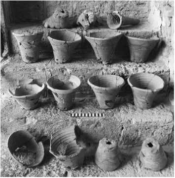
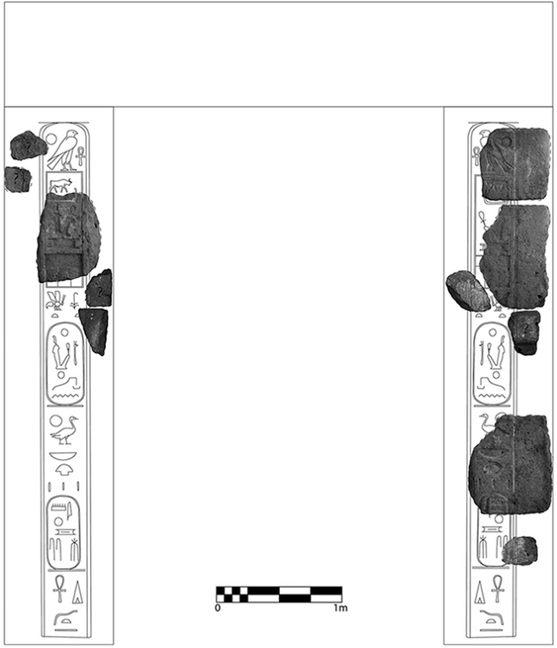
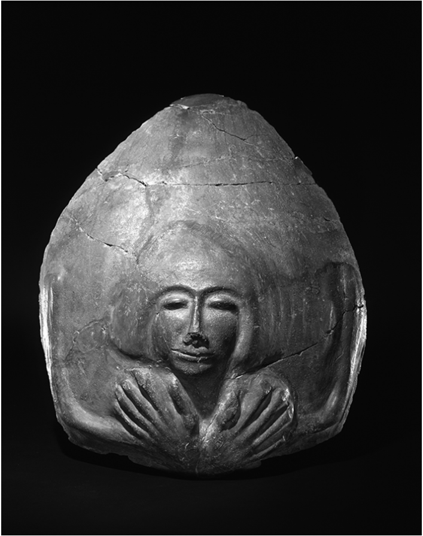
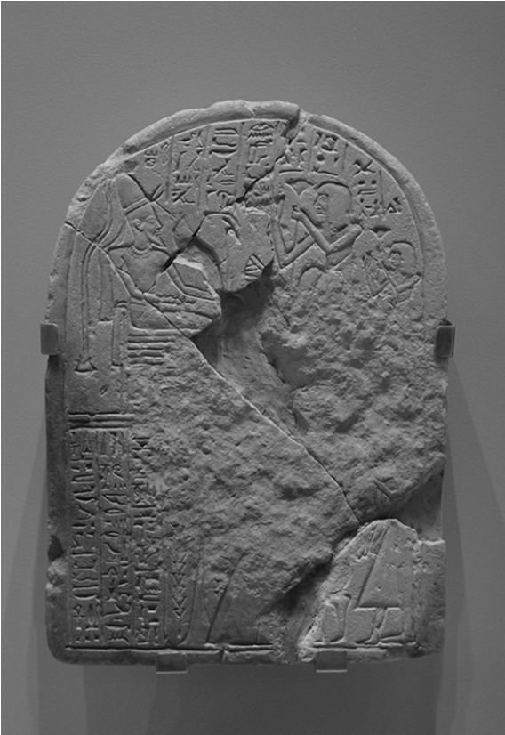

## FOURTEEN 

# “CANAAN IS YOUR LAND AND ITS KINGS ARE YOUR SERVANTS” 

Conceptualizing the Late Bronze Age Egyptian Government in the Southern Levant 

#### SHLOMO BUNIMOVITZ 

In a letter found in the Egyptian royal archive at Akhetaten (Tell el-Amarna) – the capital of the heretic pharaoh Akhenaten (Amenhotep IV) during the second half of the fourteenth century BCE – Burnaburiaš, king of Babylon, complains before his peer about a severe incident in which one of his trade caravans passing through Canaan was plundered by some local rulers, and the merchants were killed (EA 8; Moran 1992: 16–17; Rainey and Schniedewind 2015: 88–91). The angry Babylonian king demands justice from the pharaoh – quick investigation, compensation, and death sentences for the culprits – since “the Land of Canaan is your land and its kings are your servants.” Indeed, the Late Bronze Age (ca. 1550–1150 BCE) in the southern Levant is characterized by Egypt’s rule over the region. No wonder, then, that William F. Albright’s dictum “during this whole period Palestine remained an integral part of the Egyptian Empire” (1960: 99) epitomized the long prevalent view in archaeology of Palestine regarding this period (Höflmayer 2015: 193, with references). It is mainly thanks to James Weinstein’s ingenious reassessment of the “Egyptian Empire in Palestine” (1981) that we became aware of the changing nature of Egypt’s political involvement in Canaan and the need to discern distinct phases along the continuum of this lengthy process.1 

Inspired by these mind-provoking observations, I have attempted to explain changes in the social fabric of Late Bronze Age Canaan as an outcome of dialectical relations between Canaanite society and the Egyptian government (Bunimovitz 1995). In the twenty odd years that have passed since, not only has much relevant 

265 

266 

BUNIMOVITZ 

archaeological data been accumulated, but innovative anthropologically informed trials to define and understand the mechanism of the Egyptian governmental apparatus/apparatuses in Canaan were conducted (see below). In spite of these important developments, no consensus has been reached as yet regarding this issue. It should be realized that this is not a mere terminological question but a crucial matter relating to Canaanite reaction vis-à-vis Egyptian governmental policy. In light of this state-of-the-art, my intention in this chapter is to revisit the Late Bronze Age Egyptian rule in Canaan and its reciprocal relations with the local population and to offer some new insights concerning this subject. 

### background to the inquiry 

Before reviewing the various models suggested for the Late Bronze Age Egyptian government in Canaan, a brief survey of the archaeological and documentary data at hand is instrumental as background to the discussion. 

#### Late Bronze Age IA – The Early 18th Dynasty 

The transition from the Middle to the Late Bronze Age in Canaan is marked by a long line of destructions and abandonments that laid waste to many sites. The attribution of this chaotic situation to a single agent – the early pharaohs of the 18th Dynasty, who supposedly campaigned time and again in Canaan following the expulsion of the Hyksos from Egypt – is emphatically refuted today.2 Therefore, I see no reason to change my conclusions that destruction layers “were arbitrarily related to Ahmose or his successors, thus subjugating the archaeological facts to as yet vague historical data concerning Egyptian ’ ” involvement in Palestine prior to Thothmes III s . . . campaigns (Bunimovitz 1995: 322), and the settlement crisis reflects a fateful combination of internal Canaanite instability and conflicts and a limited Egyptian military action. Notably, at this stage, no effort was taken by the Egyptians to establish a system of long-term governmental and/or administrative control in Canaan. The only site that reveals an Egyptian presence (mainly pottery) in the Late Bronze (LB) Age I is Tell el-ʻAjjul (Sharuhen), presumably captured already by Ahmose (Kempinski 1974; Morris 2005: 60–7). 

#### Late Bronze Age IB – From Thutmose III to the el-Amarna Period 

Thutmose III’s renowned campaign to Megiddo is often considered as a watershed delineating change in the policy of the early pharaohs of the 18th Dynasty toward Canaan and the starting point of an Egyptian Empire in the region. As part of this change, Thutmose III supposedly established military garrisons and governmental centers in key positions along the main roads of southern Canaan: Gaza, Jaffa, and Beth Shean (Weinstein 1981: 10–12; 

267 

LATE BRONZE AGE EGYPTIAN GOV’T IN THE LEVANT 

14.1. Egyptian vessels from Jaffa. (Photo by A. A. Burke. Courtesy of The Jaffa Cultural Heritage Project.) 

Hoffmeier 2004: 134–9; Morris 2005: 115–80; Höflmayer 2015). Since no systematic modern excavations have been conducted as yet at ancient Gaza, an archaeological profile of the Egyptian headquarters in Canaan is still wanting. 

At Jaffa, excavations in the late 1950s exposed in Level VI late (LB IB) the remains of a kitchen with a rich assemblage of locally produced and imported Egyptian pottery associated with food storage, preparation, and consumption, especially of beer and bread – the two staples of Egyptian diet (Fig. 14.1). In close 

connection with the food preparation area, evidence for the production of the pottery used in the kitchen was exposed (Burke and Lords 2010; Burke et al. 2017: 93–8). While these finds attest to the earliest Egyptian presence at the site, no indication was found for protective fortifications around the Egyptian enclave. In light of Jaffaʼs mention in Thutmose III’s list of conquered cities and the lack of LB IA destruction at the site, Aaron Burke and his colleagues (2017: 124–5) suggest that Jaffa came under Egyptian rule in the wake of the battle of Megiddo rather than because of a direct assault on the city. They consider the LB IB Egyptian pottery assemblage from Jaffa as contemporaneous with the pottery assemblage from Stratum R-1b at Beth Shean (see below). 

In contrast to the seemingly nonviolent establishment of the first Egyptian “garrison” in Canaanite Jaffa, its end is marked by a heavy destruction. Immediately after this destruction – and probably as a lesson from it – the Egyptian base in Jaffa was fortified at the beginning of LB IIA as is apparent from the remains of an Egyptian-style massive mud-brick gate exposed in Phase RG-4b of the renewed excavations at the site. The gate functioned throughout the el-Amarna period (Burke et al. 2017: 105–7, 124–5). 

The LB IA–II period at Beth Shean is represented by Stratum IX. It seems that the Egyptian presence at the site began in the LB IB (Stratum R-1b of Amihai Mazar’s renewed excavations) but was quite restricted: The few architectural remains and the majority of the pottery were of Canaanite tradition, and only a limited number of locally manufactured Egyptian ceramics was found (Mazar and Mullins 2007: 18–21; Mazar 2011: 155–6). A small clay cylinder, which was discovered in the dump of the University of Pennsylvania excavations and bears a message from Tagi (the ruler of Ginti-kirmil? [see Goren, Finkelstein, and Naʼaman 2004: 259]) to Lab’ayu, 

268 BUNIMOVITZ 

the ruler of Shechem (Horowitz and Oshima 2006: 48–9), is considered by Mazar (2011: 153–4) to support the idea (based on EA 289) that Beth Shean continued to serve as an Egyptian stronghold during the el-Amarna period. 

The destruction inflicted on both early Egyptian garrisons in Jaffa and Beth Shean seems to attest to unsecured conditions in southern Canaan, presumably due to the minimal Egyptian presence in the region. 

#### LB IIB – 19th–20th Dynasties 

The rise of the 19th Dynasty to power marks a conspicuous change in the nature and extent of the Egyptian presence in southern Canaan. Egyptian sources and archaeological data alike suggest that the pharaohs of the 19th and 20th Dynasties took vigorous measures to increase their presence in southern Canaan and ensure their rule of the region (Weinstein 1981: 17–23; Singer 1988; Morris 2005: 343–611, 645–773). 

First and foremost, the Egyptians invested in their existing bases at Jaffa and Beth Shean. The Jaffa garrison seems to have been renovated under Ramesses II, whose royal names were carved on a new gate established there. On top of the ruins of this gate, another one was rebuilt (Phases RG-4a and RG-3b [Burke et al. 2017: 107–14]) (Fig. 14.2). At Beth Shean, Strata VIII–VI present a new urban layout, which may have been established in the days of Seti I, with more governmental buildings being added later. These layers are also characterized by numerous steles and architectural monuments bearing inscriptions and the names of the pharaohs of the 19th and 20th Dynasties, as well as by anthropoid coffin burials, presumably of Egyptian personnel (Oren 1973; Mazar 2009: 3–23; 2011: 156–85) (Fig. 14.3). 

In addition to reinforcing their presence in the few traditional strongholds, the Egyptians widened their hold in southern Canaan, mainly in the southern coastal plain and the Shephelah. In a process that took place especially under Ramesses II, Merenptah, and Ramesses III, these regions were subjected to direct Egyptian rule (Weinstein 1981: 17–22; Singer 1988). In many sites excavated in the area (e.g., Tell el-Farʽah South, Tel Seraʽ, Tell el-Hesi, Tell Jemmeh, Tel Mor, Gezer, Aphek), Egyptian-style fortified buildings containing both Egyptian and Canaanite material culture remains were found. Following William Flinders Petrie, these buildings are called “Governors’ Residencies,” supposedly having accommodated Egyptian governors/administrators (Oren 1984). Egyptian governmental buildings seem to have existed also in Ashkelon, Ashdod, and probably also at Tell es-S_ afi/Gath (Singer 1988; Stager 2008: 1580) and Qubur el-Walaydah (Lehmann 2011: 288). Egyptian offering bowls with hieratic inscriptions discovered at Tel Seraʽ and Lachish attest to the great amounts of grain tax collected by the Egyptians, presumably for the Temple of Amun in Gaza. Analysis of the processes that brought an 

269 

LATE BRONZE AGE EGYPTIAN GOV’T IN THE LEVANT 

14.2. Ramesses II gate from Jaffa. (Courtesy of The Jaffa Cultural Heritage Project.) 

end to the Egyptian Empire in Canaan is beyond the scope of the present chapter; suffice it to say that the last significant Egyptian presence in the region can be dated to the third quarter of the twelfth century BCE (Weinstein 1981: 22–3). 

### previous attempts to conceptualize the egyptian government in late bronze age canaan 

As we have seen, early Syro-Palestinian archaeological scholarship referred to the Egyptian rule in southern Canaan simplistically as part of the New Kingdom’s “empire.” Egyptologists, however, were more observant, emphasizing conspicuous differences between the character of the Late Bronze Age 

270 BUNIMOVITZ 

14.3. Lid of an anthropoid coffin from Beth Shean (Museum of Archaeology and Anthropology object no. 29–103–789). (Expedition to Beth Shean [Beisan]; C. Fisher, 1921–8. Courtesy of the University of Pennsylvania, Museum of Archaeology and Anthropology [image no. 150065].) 

Egyptian “empire” in Nubia and Canaan; while the Egyptian policy in Nubia was described as colonization, in Canaan it was rather related to imperialism (e.g., Kemp 1978; Frandensen 1979; Redford 1992: 192–3; Hoffmeier 2004; see below). It is mainly the accumulation in recent years of new archaeological data concerning the last phase of Egyptian rule in Canaan (thirteenth–twelfth centuries BCE) that prompted attempts to conceptualize this rule. The following concise survey refers to the main suggestions. 

LATE BRONZE AGE EGYPTIAN GOV’T IN THE LEVANT 

271 

Since throughout the Late Bronze Age, there is no evidence for a significant number of Egyptian settlers that “colonized” Canaan,3 Ann Killebrew looked for a more nuanced definition of the imperialism practiced by the Egyptians in this region. Following Ronald Horvath’s (1972) classificatory scheme of colonialism (and, for that sake, also of imperialism), she suggested that the Egyptian presence in Canaan during the New Kingdom period should be defined as “formal” or “administrative” imperialism, namely, “a form of intergroup domination in which formal (direct) controls over the affairs of the colony exist through a resident imperial administrative apparatus” (Killebrew 2005: 53; see also pp. 54–7). 

Yet, another important category of imperialism is “informal” imperialism – “a type of intergroup domination in which formal administrative controls are absent and power is channeled through a local elite” (Horvath 1972: 49). This type of imperialism concurs with the model of “elite emulation” presented by Carolyn Higginbotham (1996; 2000; see also Koch 2014). 

Criticizing the common view of Egyptian rule in Canaan as “direct rule,” Higginbotham argues that save for the Egyptian presence at Deir el-Balah,_ Gaza, Jaffa, and Beth Shean, the rest of Egyptian-style material remains uncovered in Canaan reflect elite emulation. This argument rests on insights – gained by studies of core periphery interaction showing that polities located at some distance from a prestigious culture tend to consider it as an important focus of civilization and power. By connecting themselves to such foci, the local rulers aggrandize their status and authority. Hence, local elites readily adapt cultural features of the “great civilization,” such as language, dress, architectural and artistic styles, and especially symbols of power. Comprising “iconography of power,” the adapted features transfer some of the prestige of the core to the peripheral rulers and support the legitimacy of their rule.4 Yet, in order to fulfill this task, the adapted features must be understood by the target audience at the local level. Transformations in the borrowed features that enable their integration within the local culture are therefore a conspicuous marker of cultural emulation (see, e.g., Stockhammer 2012, with references). 

Since the Canaanite elite depended on Egypt for their access to power, Higginbotham suggests that the high prestige of Egypt as a political power and cultural center motivated the local rulers to emulate Egyptian culture as a means of enhancing their stature. Close inspection of various aspects of Late ’ ” Bronze Age material culture – the architecture of “Governors Residencies and other buildings; Egyptianized pottery and prestige items in domestic, funerary, and ritual contexts; and more – reveals, according to Higginbotham, a mixture of Egyptian and Canaanite features that is the result of cultural emulation and attests to voluntary Egyptianization of the Canaanite elite. 

Higginbotham’s interpretation of Egyptian rule in Canaan has been criticized and rejected by a number of scholars, yet accepted by others. Following 

BUNIMOVITZ 

272 

his monumental research of Egyptian Late Bronze Age pottery in Canaan, Mario Martin (2004; 2011) contends that the large quantities of locally produced Egyptian-style pottery at many sites in Canaan, especially during the days of the 19th–20th Dynasties, should be regarded as tangible evidence for direct rule, namely, the physical presence of Egyptian administrative and/or military personnel. In his opinion, while Higginbotham’s theory might explain the presence of goods of high prestige, such as jewelry, stone vessels, scarabs, and other objects that display the strong interaction between the Egyptian and Canaanite cultural spheres in the form of artistic eclecticism, hybridization, and syncretism and are likely to have been imitated, it cannot accommodate the mass-produced, low prestige, Egyptian-style household pottery that is not expected to be emulated by the Canaanite elites. 

In her opus magnum about military bases and the evolution of foreign policy in Egypt’s New Kingdom, Ellen Morris (2005: 8–17) points to three problematic facets of the elite emulation model. First, the unrealistic sharp dichotomy delineated by Higginbotham between direct rule and elite emulation. According to Morris, under many imperialistic regimes, the two phenomena are entangled. Second, the claim that should there have been direct Egyptian rule in Canaan one would expect to find imperial enclaves with pure Egyptian material culture fails to acknowledge the difference between Egyptian rule in Nubia and Canaan. Furthermore, it ignores the fact that indigenous material culture always existed side by side with Egyptian-style artifacts. Third, the methodology set up to test the elite emulation model privileges the study of individual categories of artifacts over the study of artifact assemblages. While elite emulation may indeed account for the occasional appearance of Egyptian or Egyptian-style prestige objects on Canaanite soil, it is seldom the only explanation for their presence. In the cosmopolitan atmosphere of the Late Bronze Age and the taste for luxury goods, the find of a foreign artifact within a tomb, for example, does not necessarily mean a desire by the deceased or his family to emulate aspects of the foreign culture. Furthermore, certain Egyptian prestige goods may have come to Canaan as gifts bestowed upon loyal local dignitaries by the Egyptian government.5 Thus, Morris prefers the rule according to which the wider the range of Egyptian or Egyptian-style artifacts discovered at a Syro-Palestinian site, the greater the probability that Egyptians themselves had at one time been residents. 

Aware of the harsh critique leveled at Higginbotham’s model of elite emulation and the shortcomings of this model, Ido Koch (2014) has recently emphasized its importance as part of core–periphery theories that can explain the integration of local elite within an empire’s system and the peripheral appearance of cultural traits that originated in its center. Relying on crosscultural ethnographic research, he argues that this process was important for the construction of imperial power. The center has, in many cases, established 

LATE BRONZE AGE EGYPTIAN GOV’T IN THE LEVANT 

273 

administrative dominance in the governed peripheries, yet also embraced the local elite with its own symbols in order to implant ideological motives that justify its rule. As discussed by Koch, in the case of the Egyptian Empire in Canaan, there were many opportunities for the Canaanite elite to be exposed to Egyptian culture. Indeed, his article examines an assemblage of goose bones found in Late Bronze Age levels at Lachish, and he interprets it as attesting to the adoption of the Egyptian trait of goose keeping by the local elite that adapted it to their own needs of communal feasting – and thus presented themselves as Egyptian. 

### an alternative interpretation: from equilibrium imperialism to the “third space” 

At this point of our inquiry, it becomes clear that neither the direct rule model (with its variants) nor the elite emulation model provides satisfactory conceptualization of all phases of the Late Bronze Age Egyptian government in Canaan. In fact, both models refer mainly to textual and archaeological data related to its last phase – the thirteenth–twelfth centuries BCE. Apparently, each phase of Egyptian rule in the southern Levant must be examined and interpreted on its own merits. Yet, one should not ignore a more general important insight gained from a comparison between Egyptian imperialism in Nubia and Canaan. 

As already discussed by many Egyptologists, the Egyptians encountered a tribal sociopolitical structure and cultural traits in Nubia, which they considered inferior to theirs. This intercultural contact resulted in mass colonization and the transplantation of Egyptian administrative, economic, and religious institutions, as well as life ways on Nubian soil.6 In contrast, the Egyptians met in Canaan a sophisticated and literate ancient civilization, politically developed and fully urbanized – just like Egypt itself. The pharaohs of the New Kingdom accepted, therefore, the Canaanite system as it was and did not try to change it. Moreover, as evident from both the textual and archaeological testimony discussed above, a permanent Egyptian administrative and military presence in Canaan during the LB IB–IIA seems to have been minimal, even in the Egyptian centers at Jaffa and Beth Shean. As Barry Kemp aptly observed almost four decades ago: “On many sites in Palestine. . .the purely archaeological record would not of itself incline one to the view that an Egyptian empire existed at all” (1978: 51).7 Notably, the Egyptian garrisons and their installations (e.g., the granaries at Jaffa and the gates of Jaffa and Gaza) were guarded by local manpower recruited by the Canaanite rulers and not by Egyptian soldiers (EA 294, 296; see also Ta‘anach letters 5, 6). Furthermore, the recurring requests of the local rulers to the pharaoh to send soldiers to save them from their enemies (e.g., EA 238, 244, 263, 286, 287) attest that these 

BUNIMOVITZ 

274 

troops were not readily available in the nearby Egyptian centers. Apparently, Egyptian dominance in the Levant was based more on the obedience of local rulers and strict fulfillment of their obligations to the pharaoh than on direct rule. It seems, therefore, that from the days of Thutmose III to the end of the 18th Dynasty the Egyptian government in Canaan should be conceptualized as “equilibrium imperialism” characterized by indigenous self-maintenance with only a small imperial presence in certain enclaves (Bartel 1980: 17, fig. 1; 1985: 18–22; Smith 1991). 

The model of “elite emulation” emphasizes the voluntary Egyptianization of the Canaanite elite as a unidirectional process in which a peripheral culture emulated a core “high” culture. In fact, the southern Levant in the Late Bronze Age saw the meeting of two “high” cultures – the Egyptian and the Canaanite. Though the carriers of the one were the rulers and the second were the ruled, the encounter led to mutual acculturation. Intriguing evidence for this process comes from the Egyptian strongholds in southern Canaan. For example, steles found in the temples of Beth Shean show Egyptians worshiping Canaanite gods (James and McGovern 1993: 240, 250, nos. 10, 11) (Fig. 14.4); anthropoid coffin burials from Deir el-Balah are surrounded by local burial kits familiar to Canaanite burials along_ the coastal plain (Dothan 1979); and pottery assemblages from Beth Shean and Jaffa attest to mixed cultural traditions and foodways, hinting at intercultural marriages (see Mazar 2009: 17–23; Martin 2009: 465–7). These examples and others attest to the adoption of Canaanite cultural elements by Egyptian administrative and military personnel and to bi-directional emulation. It should be remembered that on the eve of the expulsion of the Hyksos from Egypt, Canaanite–Egyptian acculturation in the eastern Nile Delta reached its zenith, as evident from the Tell el-Dabʽa excavations. It is possible, therefore, that following the occupation of Canaan, Egyptian personnel within the newly established garrisons had Canaanite roots (cf. Morris 2005: 255, n. 157). On the other hand, one should not forget that in the Middle Bronze Age Egypt experienced Canaanite acculturation and prolonged service in Canaan also could have been fertile ground for absorption of Canaanite culture by Egyptian officials. Apparently, it is not easy to differentiate between the hybrids created in the Late Bronze Age: Canaanites that adopted Egyptian culture or Egyptians that adopted Canaanite culture (cf. Braunstein 2011). In the postcolonial discourse that recently has entered into archaeology, such cultural hybrids, which are the outcome of intercultural encounters in creative liminal spaces or “third space” (which displaces the certainties of either parental tradition), are considered as new entities that are more than the sum of their parts (Bhabha 1990; Papastergiadis 1997; Fahlander 2007).8 

The majority of the Late Bronze Age Egyptian finds are dated to the LB IIB – the days of the 19th–20th Dynasties – and were discovered mainly in the southern coastal plain and at Beth Shean. Trying to explain these finds as reflecting “elite emulation” raises intriguing questions: Why was this process taking place 

LATE BRONZE AGE EGYPTIAN GOV’T IN THE LEVANT 

275 

14.4. The Mekal Stele from Beth Shean. (Courtesy of Livius.org © 2018.) 

especially at that time? Why was it limited to a specific region? It seems that the answers to these questions can befound in the historical context of the last phase of the Egyptian Empire in the southern Levant. In spite of the fact that at least part of the Canaanite inhabitants of this region, which presumably returned to Canaan in the wake of the fall of Avaris, were acculturated in the eastern Delta, and many Canaanite princes were indoctrinated in Egypt since the days of Thutmose III, there is no hint in the archaeological record from the early part of the Late Bronze Age of cultural emulation as a prevalent strategy among the Canaanite elite. Apparently, the nature of Egyptian governance at that time and the concentration of Egyptian activity in a few garrisons did not encourage widespread adoption of Egyptian cultural traits. Information about such a phenomenon is limited to these 

276 

BUNIMOVITZ 

garrisons and rather reflects mutual Canaanite–Egyptian acculturation. Most probably, the change in Egyptian governmental policy under the 19th–20th Dynasties, leading to the annexation of large parts of the southern coastal plain and the Shephelah, initiated a change in the survival strategy of the local rulers in these regions, and they adopted Egyptian symbols of power and cultural traits in order to survive. However, due to the difficulty of differentiating between the – hybrids created by Egyptian Canaanite intercultural encounters (see above), it is also possible that, as part of their new policy, the pharaohs installed in place of the local rulers Canaanite administrators who have been Egyptianized or Egyptian administrators who have been Canaanized.9 

### notes 

- 1 The chronology and subdivisions of the Late Bronze Age used in this essay follow Panitz-Cohen 2014: table 36.1. 

- 2 For recent summaries of Egyptian sources, archaeological data, and scholarly literature, see, e.g., Hoffmeier 2004: 121–33; Morris 2005: 35–41; and Höflmayer 2015. 

- 3 For the terms “colony” and “colonialism,” see Gosden 2004: 2–3. 

- 4 In the context of the debate in Aegean archaeology about the sociopolitical and cultural meaning of the second millennium BCE “Minoan thalassocracy,” Malcolm Wiener (1984) introduced into archaeological parlance the term “Versailles effect” to describe the impact of Minoan Crete on the culture of Mycenaean Greece. Looking at the French court as the prestigious source for emulation, the capitals of Europe in the eighteenth century CE began to take on many aspects of its life and culture with respect to art, architecture, furnishings, cloths, jewelry, tableware, gardens, etc. This process of elite emulation is very similar to the one delineated by Higginbotham (note, however, that there was no French conquest, economic domination, or colonization). 

- 5 For a possible example, see Bunimovitz, Lederman, and Hatzaki 2013. 

- 6 See, e.g., Kemp 1978; Frandensen 1979; Smith 1991; 2003; Redford 1992: 192–3; Hoffmeier 2004. 

- 7 Morris’s (2005: 141) suggestion that Egyptian garrison posts could remain archaeologically invisible since the Egyptians occupied Canaanite-built compounds and were provided with local supplies seems untenable. 

- 8 Philipp Stockhammer (2012) suggested that the term “hybridity,” which is loaded with biological and political connotations, should be replaced with the more neutral term “entanglement.” 

- 9 An enlightening example – apparently one of many – of an Asiatic-originated high-rank Egyptian official from the days of the 19th–20th Dynasties is the “royal butler” Ramessesemperre (Semitic name: Ben-azen of Ziri-Bashan) that led the Egyptian expedition to the copper mines at Timna‘ (Schulman 1976; 1988: 143–4). 

### references 

- Albright, W. F. 1960. The Archaeology of Palestine. Rev. ed. Pelican Books A199. Harmondsworth: Penguin. 

LATE BRONZE AGE EGYPTIAN GOV’T IN THE LEVANT 

277 

- Bartel, B. 1980. Colonialism and Cultural Responses: Problems Related to Roman Provincial Analysis. WA 12: 11–26. 

1985. Comparative Historical Archaeology and Archaeological Theory. In Comparative Studies in the Archaeology of Colonialism, ed. S. L. Dyson, 8–37. BAR International Series 233. Oxford: BAR. 

- Bhabha, H. 1990. The Third Space: Interview with Homi Bhabha. In Identity: Community, Culture, Difference, ed. J. Rutherford, 207–21. London: Lawrence & Wishart. 

- Braunstein, S. L. 2011. The Meaning of Egyptian-Style Objects in the Late Bronze Cemeteries of Tell el-Farʽah (South). BASOR 364: 1–36. 

- Bunimovitz, S. 1995. On the Edge of Empires – Late Bronze Age (1550–1200 BCE). In The Archaeology of Society in the Holy Land, ed. T. E. Levy, 320–31. NAAA. London: Leicester University Press. 

- Bunimovitz, S.; Lederman, Z.; and Hatzaki, E. 2013. Knossian Gifts? Two Late Minoan IIIA1 Cups from Tel Beth-Shemesh, Israel. Annual of the British School at Athens 108: 51–66. 

- Burke, A. A., and Lords, K. V. 2010. Egyptians in Jaffa: A Portrait of Egyptian Presence in Jaffa during the Late Bronze Age. NEA 73: 2–30. 

- Burke, A. A.; Peilstöcker, M.; Karoll, A.; Pierce, G. A.; Kowalski, K.; Ben-Marzouk, N.; Damm, J. C.; Danielson, A. J.; Fessler, H. D.; Kaufman, B.; Pierce, K.V.L.; Höflmayer, F.; Damiata, B. N.; and Dee, M. 2017. Excavations of the New Kingdom Fortress in Jaffa, 2011–2014: Traces of Resistance to Egyptian Rule in Canaan. AJA 121: 85–133. 

- Dothan, T. 1979. Excavations at the Cemetery of Deir el-Balah. Qedem 10. Jerusalem: The Institute of Archaeology, The Hebrew University of Jerusalem. 

- Fahlander, F. 2007. Third Space Encounters: Hybridity, Mimicry and Interstitial Practice. In Encounters, Materialities, Confrontations: Archaeologies of Social Space and Interaction, ed. P. Cornell and F. Fahlander, 15–41. Newcastle: Cambridge Scholars. 

- Frandensen, P. J. 1979. Egyptian Imperialism. In Power and Propaganda: A Symposium on Ancient Empires [Held under the Auspices of the Institute of Assyriology at the University of Copenhagen, September 19th–21th, 1977], ed. M. T. Larsen, 167–90. Mesopotamia 7. Copenhagen: Akademisk. 

- ʼ 

- Goren, Y.; Finkelstein, I.; and Na aman, N. 2004. Inscribed in Clay: Provenance Study of the Amarna Letters and Other Ancient Near Eastern Texts. MSSMNIA 23. Tel Aviv: Emery and Claire Yass Publications in Archaeology. 

- Gosden, C. 2004. Archaeology and Colonialism: Cultural Contact from 5000 BC to the Present. Topics in Contemporary Archaeology. Cambridge: Cambridge University Press. 

- Higginbotham, C. R. 1996. Elite Emulation and Egyptian Governance in Ramesside Canaan. TA 23: 154–69. 

2000. Egyptianization and Elite Emulation in Ramesside Palestine: Governance and Accommodation on the Imperial Periphery. CHANE 2. Leiden: Brill 

- Hoffmeier, J. K. 2004. Aspects of Egyptian Foreign Policy in the 18th Dynasty in Western Asia and Nubia. In Egypt, Israel, and the Ancient Mediterranean World: Studies in Honor of Donald B. Redford, ed. G. A. Knoppers and A. Hirsch, 121–42. PAe 20. Leiden: Brill. 

- Höflmayer, F. 2015. Egypt’s “Empire” in the Southern Levant during the Early 18th Dynasty. In Policies of Exchange: Political Systems and Modes of Interaction in the Aegean and the Near East in the 2nd Millennium B.C.E.; Proceedings of the International Symposium at the University of Freiburg Institute for Archaeological Studies, 30th May–2nd 

278 

BUNIMOVITZ 

- June 2012, ed. B. Eder and R. Pruzsinszky, 191–206. Oriental and European Archaeology 2. Vienna: Austrian Academy of Sciences. 

Horowitz, W., and Oshima, T. 2006. Cuneiform in Canaan: Cuneiform Sources from the Land of Israel in Ancient Times. Jerusalem: IES; The Hebrew University of Jerusalem Horvath, R. J. 1972. A Definition of Colonialism. CA 13: 45–57. 

- James, F. W., and McGovern, P. E. 1993. The Late Bronze Egyptian Garrison at Beth Shan: A Study of Levels VII and VIII. UMM 85. Philadelphia: University of Pennsylvania Museum of Archaeology Press. 

- Kemp, B. J. 1978. Imperialism and Empire in New Kingdom Egypt (c. 1575–1087 B.C.). In Imperialism in the Ancient World, ed. P. D. A. Garnsey and C. R. Whittaker, 7–57. Cambridge Classical Studies. Cambridge: Cambridge University Press. 

- Kempinski, A. 1974. Tell el-ʻAjjul – Beth-Eglayim or Sharuhen? IEJ 24: 145–52. 

- Killebrew, A. E. 2005. Biblical Peoples and Ethnicity: An Archaeological Study of Canaanites, Egyptians, Philistines, and Early Israel, 1300–1100 B.C.E. ABS 9. Atlanta: SBL. 

- Koch, I. 2014. Goose Keeping, Elite Emulation and Egyptianized Feasting at Late Bronze Lachish. TA 41: 161–79. 

- Lehmann, G. 2011. Cooking Pots and Loomweights in a “Philistine” Village: Preliminary Report on the Excavations at Qubur el-Walaydah, Israel. In On Cooking Pots, Drinking Cups, Loomweights and Ethnicity in Bronze Age Cyprus and Neighbouring Regions: An International Archaeological Symposium Held in Nicosia, November 6th–7th 2010, ed. 

- V. Karageorghis and O. Kouka, 287–314. Nicosia: A. G. Leventis Foundation. 

- Martin, M. A. S. 2004. Egyptian and Egyptianized Pottery in Late Bronze Age Canaan: Typology, Chronology, Ware Fabrics, and Manufacture Techniques; Pots and People? Egypt and the Levant 14: 265–84. 

2009. The Egyptian Assemblage. In Excavations at Tel Beth-Shean 1989–1996, Vol. 3: The 13th–11th Century BCE Strata in Areas N and S, ed. N. Panitz-Cohen and A. Mazar, 434–77. BSVAP 3. Jerusalem: IES; The Institute of Archaeology, The Hebrew University of Jerusalem. 

2011. Egyptian-Type Pottery in the Late Bronze Age Southern Levant. CCEM 29; DG 69. Vienna: Austrian Academy of Sciences. 

- Mazar, A. 2009. Introduction and Overview. In Excavations at Tel Beth-Shean 1989–1996, Vol. 3: The 13th–11th Century BCE Strata in Areas N and S, ed. N. Panitz-Cohen and A. Mazar, 1–32. BSVAP 3. Jerusalem: IES; The Institute of Archaeology, The Hebrew University of Jerusalem. 

2011. The Egyptian Garrison Town at Beth-Shean. In Egypt, Canaan and Israel: History, Imperialism, Ideology and Literature; Proceedings of a Conference at the University of Haifa, 3–7 May 2009, ed. S. Bar, D. D. Kahn, and J. J. Shirley, 151–85. CHANE 52. Leiden: Brill. 

- Mazar, A., and Mullins, R. A. 2007. Introduction and Overview. In Excavations at Tel Beth-Shean 1989–1996, Vol. 2: The Middle and Late Bronze Age Strata in Area R, ed. A. Mazar and R. A. Mullins, 1–22. BSVAP 2. Jerusalem: IES; The Institute of Archaeology, The Hebrew University of Jerusalem. 

- Moran, W. L.1992. The Amarna Letters. Baltimore: The Johns Hopkins University Press. 

- Morris, E. F. 2005. The Architecture of Imperialism: Military Bases and the Evolution of Foreign Policy in Egypt’s New Kingdom. PAe 22. Leiden: Brill. 

- Oren, E. D. 1973. The Northern Cemetery of Beth Shan. UMM. Leiden: Brill. 

1984. “Governors’ Residencies” in Canaan under the New Kingdom: A Case Study of Egyptian Administration. JSSEA 14: 37–56. 

LATE BRONZE AGE EGYPTIAN GOV’T IN THE LEVANT 

279 

Panitz-Cohen, N. 2014. The Southern Levant (Cisjordan) during the Late Bronze Age. 

- In The Oxford Handbook of the Archaeology of the Levant, c. 8000–332 BCE, ed. 

- M. L. Steiner and A. E. Killebrew, 541–60. Oxford: Oxford University Press. 

- Papastergiadis, N. 1997. Tracing Hybridity in Theory. In Debating Cultural Hybridity: MultiCultural Identities and the Politics of Anti-Racism, ed. P. Werbner and T. Modood, 257–81. Critique, Influence, Change 8. London: Zed Books. 

- Rainey, A. F., and Schniedewind, W. M. 2015. The El-Amarna Correspondence: A New Edition of the Cuneiform Letters from the Site of El-Amarna Based on Collations of All Extant Tablets. 2 vols. Handbook of Oriental Studies 1, The Near and Middle East 110. Leiden: Brill. 

- Redford, D. B. 1992. Egypt, Canaan, and Israel in Ancient Times. Princeton: Princeton University Press. 

- Schulman, A. R. 1976. The Royal Butler Ramessesmperr�eʻ. JARCE 13: 117–30. 

1988. Catalogue of the Egyptian Finds. In The Egyptian Mining Temple at Timna, ed. B. Rothenberg, 114–47. Researches in the Arabah 1959–1984 1; Metal in History 2. London: Institute for Archaeo-Metallurgical Studies; Institute of Archaeology, University College London. 

- Singer, I. 1988. Merneptah’s Campaign to Canaan and the Egyptian Occupation of the Southern Coastal Plain of Palestine in the Ramesside Period. BASOR 269: 1–10. 

- Smith, S. T. 1991. A Model for Egyptian Imperialism in Nubia. Göttinger Miszellen 122: 77–102. 

- ’ 

- 2003. Wretched Kush: Ethnic Identities and Boundaries in Egypt s Nubian Empire. London: Routledge. 

- Stager, L. E. 2008. Ashkelon, Tel. NEAEHL 5: 1578–86. 

- Stockhammer, P. W. 2012. Performing the Practice Turn in Archaeology. Transcultural Studies 1: 7–42. 

- Weinstein, J. M. 1981. The Egyptian Empire in Palestine: A Reassessment. BASOR 241: 1–28. 

- Wiener, M. H. 1984. Crete and the Cyclades in LM I: The Tale of the Conical Cups. In The Minoan Thalassocracy: Myth and Reality; Proceedings of the Third International Symposium at the Swedish Institute in Athens, 31 May–5 June, 1982, ed. R. Hägg and 

- N. Marinatos, 17–26. Publications of the Swedish Institute at Athens 4, 32. 

- Stockholm: Swedish Institute at Athens. 

