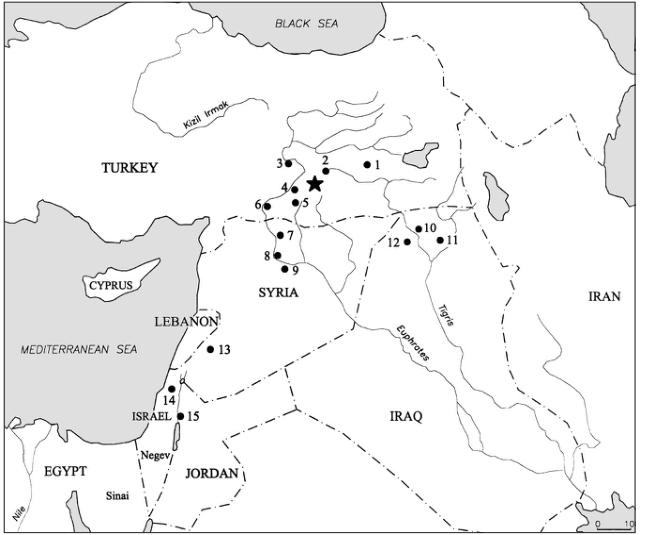

UDK 903’12/’15(5-11)"634" Documenta Praehistorica XXVIII 

# **The “when”, the “where” and the “why” of the Neolithic revolution in the Levant** 

### **Avi Gopher, Shahal Abbo and Simcha Lev-Yadun** 

- A. Gopher, Sonia and Marco Nadler Institute of Archaeology, Israel. Email: agopher@ccsg.tau.ac.il 

- S. Abbo, Dept. of Field Crops, Faculty of Agriculture, Hebrew University of Jerusalem, Israel. Email: Abbo@agri.huji.ac.il 

- S. Lev-Yadun, Dept. of Biology, University of Haifa, Israel. Email: levyadun@research.haifa.ac.il 

ABSTRACT – _An accumulation of data concerning the domestication of plants and the refinement of research questions in the last decade have enabled us a new look at the Neolithic Revolution and Neolithization processes in the Levant. This paper raises some points concerning the “When” and “Where” of plant domestication and suggests that the origins of plant domestication were in a welldefined region in southeast Turkey and north Syria. It presents a view on the process of Neolithization in the Levant and offers some comments concerning the background and motivations behind the Neolithic Revolution._ 

KEY WORDS – _agriculture; cultivation; domestication; Levant; Neolithization_ 

### **INTRODUCTION** 

Offering explanations for the “Neolithic Revolution” has gained momentum since the 1960’s and has not stopped ever since. Listed here are just a few of these which have become part and parcel of the Neolithic Revolution explantations ( _Braidwood 1967; 1975; Binford 1968; Boserup 1965; Flannery 1969; Wright 1968; Smith and Young 1972; Bender 1978_ ). In addition, we are challenged by a wealth of new explanations based on new ideas and data ( _e.g. Rindos 1980; 1984; Rosenberg 1990; 1998; Redding 1988; Diamond 1998_ ). All these explanations model regional geography, climate and specific environments, demography, social aspects, cultural aspects such as technology and technological innovations, 

and, the botanical and faunal components reflecting the “bear bones” of the revolution. Although some of the above were based on very specific studies conducted in particular, well-defined regions and sites, these were all aimed at achieving an overall explanation with a high generalization capability and, if possible, a degree of predictive power. An emphasis on the “social”, the “cognitive” and the “ideological” aspects of some of the recent explanations of the Neolithic Revolution ( _e.g. Hayden 1990; Hodder 1993; Cauvin 1994; 2000_ ) brought new flavour into this already complex agenda. Although the “When” and “Where” questions were always of interest as basics, the major question on the surgeon’s table 

49 

Avi Gopher, Shahal Abbo and Simcha Lev-Yadun 

terms of large-scale prehistoric clocks. In the Levant (northern Levant), it has generally started some 13 000 calibrated years ago and reached a full scale some 8000–7000 calibrated years ago. 

was naturally the “Why” question – why has such an immense change in human socio-economy taken place? As time went by through the 1970’s and 1980’ and especially in the 1990’s, high precision absolute dating, highly professional problem oriented research teams and high resolution field methods brought back to the stage questions such as the “Where” and “When” of the Neolithic Revolution. These have lost popularity in the 1970’s – 1980’s being considered as solved. 

In this paper we will concentrate first on the beginning of agriculture in the Levant – from the Upper Euphrathes and Tigris to the deserts of the Negev and Sinai (modern southeast Turkey, Syria, Lebanon, Israel, The Palestinian Authority, Jordan and Egypt, see Fig. 1). We concentrate on plants while animals are only briefly mentioned. The first part addresses the basic questions of man-plant relationship using old and new data from the Levant. It will focus on questions such as: What happened in manplant relationship (cultivation _vs._ domestication)? How did it happen – has domestication been a onetime/one place event? What was the pace of the process? How fast did agriculture diffuse in terms of archaeological resolution? The “When” and “Where” questions, which we find fascinating in themselves, and of high potential in facilitating answers to the “Why “question, are dealt with afterwards. The paper ends with comments on Neolithization and about the background and possible reasons for the Neolithic Revolution in light of accumulating data from southeast Turkey and north Syria – the newly suggested cradle of agriculture ( _Lev-Yadun et al. 2000_ ). 

Developments in archaeological thought in the last two decades (mainly the growing impact of postproccessual and cognitive archaeology) have paved the way for aspects of Neolithic daily life and everyday activities related to the transition to agriculture, to overtake the centre of the stage. With these as major research goals, a multiplicity of issues could be raised in an attempt to reconstruct and remodel the Neolithic Revolution in local terms, and/or in more human-related terms referring to past individuals or specific segments of past communities. 

The basic old world (Middle East, Europe, Egypt/Ethiopia, North Africa) founder domesticated plants package includes, in its primary form, cereals (wheats, barley), pulses (pea, lentil, chickpea, bitter vetch) and flax as a fibre crop. Domesticated animals include mainly sheep-goat, cattle and pig (the dog was domesticated much earlier by Natufian communities in the southern Levant). We may say that it has become generally accepted that the origins of this founder package were in the Near East and that it had spread throughout Europe and parts of Asia and Africa ( _Zohary and Hopf 1993; 2000_ ) (in other parts of the world different agro-packages have emerged). When establishing itself, this package caused immense change in all aspects of life which we usually refer to as “Neolithization” – a term emphasizing the dynamic nature of the Neolithic period. Taking into account the complexity of Neolithization and its demands on aspects of human perception, organization, activity/behaviour etc., this may be considered a very fast process in 

**_Map of region and sites mentioned in text: 1. Hallan Çemi Tepesi, 2. Cayönü, 3. Cafer Höyük, 4. Nevalli Çori, 5. Göbekli Tepe, 6. Dja’de, 7. Jerf el Ahmar, 8. Mureybet, 9. Tell Abu Hureyra, 10. Nemrik, 11. M’lefaat, 12. Qermez Dere, 13. Tell Aswad, 14. Yiftahel, 15. Jericho, Netiv Hagdud and Gilgal I. Large asterisk for Karacada_** _g_ **_._** 

50 

The “when”, the “where” and the “why” of the Neolithic revolution in the Levant 

### **Man-Plant relationship – What happened?** 

Plants can be exploited in many different strategies. _Foraging_ accounts for a state of collecting wild plants with no agricultural manipulation reflecting the hunters-gatherers slot of the classical model. It does however represent the time in which the choice was made by foragers, of species with high potential for human exploitation, some of which later become the founder-crops “package” of agriculture. _Cultivation_ refers to treating wild plants with a degree of agricultural manipulation (such as displacement or crop management) but still not causing their dependence on man for survival by conscious or unconscious selection of genotypes that lost some naturally adaptive traits. _Domestication_ , in this context, refers to full manipulation of biologically “new types” fully dependent on man for survival. These types went through genotypic change (brake-down of the wild-type mode of seed dispersal and dormancy) either unintentionally – namely, unconscious selection resulting from cultivation and harvesting practices, or, intentional/conscious selection of plants/seeds with particular attributes desirable to the farmer. These three strategies reflect a continuous process of change from foraging of wild plants to farming of domesticated species. Cultivation is however the significant cultural marker of the change to new perceptions and new behavioural patterns of man. Cultivation may have included the establishment of fields near the sites as so vividly shown by Hillman ( _2000.Fig. 12.27, 395_ ). It must have been accompanied by technological developments (agro-techniques such as soil tilling, seeding, weeding, harvesting equipment, threshing equipment and installations, storage facilities etc.) but, more importantly, a major shift in human perception of nature. A move to extended manipulation and dependency, a shift from a view of nature as a “giving environment” the way most hunters-gatherers see it ( _Bird-David 1990_ ), to an active manipulative view of the environment. Looked at as a longterm historical process covering the 6000–7000 years between the later phases of the Epipaleolithic and the end of the Neolithic period in the Levant, this process “widens the gap” between man and nature and leads to increased alienation and thus, in a way, to modern condition. 

Summing up the above under the heading “What Happened” in man-plant relationship, we may say that it included two major aspects: 

● A change in the perception of nature – establishing manipulative extraction as a major human beha- 

- viour in nature and increasing man-nature alienation. 

- An increase in man’s manipulation of wild plants up to a full genetic and technological domination over domesticated plants or a full interdependence between man and certain plant types. 

### **Man-Plant Relationship – How did the change happen?** 

Has domestication of the founder package plants taken place at a certain limited (small) area, in a certain short (or long) period of time? Was it a singleevent, or else, have several (or many) domestication events taken place? 

It was suggested that for most of the package species (possibly except for barley) the genetic change underlying domestication was a single-event (and therefore occurred at one location for each plant species) that could theoretically have been a fast process [(potentially much faster then archaeological resolution of the relevant period may record) ( _e.g_ . _Zohary 1996; 1999; Hillman and Davis 1992; Miller 1991; Garrard 1999_ )]. However, very recently, new thought has been raised. For example, Kislev ( _1998_ ), who studied Neolithic archaeobotanical assemblages in Israel, has argued and presented calculations that the transition from a wild population of cereals to a domesticated one would have taken hundreds of years at least. He adds that the process would not have been free of risks and failures that may have made it even longer. From a different angle, Wilcox ( _1998; 2000_ ), who studied Neolithic archeobotanical assemblages in Syria and Turkey, suggests a slow domestication process (lasting hundreds of years or even millennia) and a local one for each crop. He plotted cereals on geographical-temporal charts and argued that in each sub-region of the Levant specific package species have been domesticated – those that fit the specific local ecological conditions. These have survived and remained dominant in their sub-regions for thousands of years ( _e.g._ barley in the Jordan valley, emmer wheat in the Damascus basin, einkorn in the middle Euphrates etc.). His two major points are that domestication was a slow process and that it occurred in isolated, sub-regional contexts. Wilcox thus exposes the potential complexity of the process and the data. An attempt to model the pace of domestication worth mentioning here has been presented by Ladizinsky ( _1987_ ). He attempted to model the time required for a dormancy free mutation in lentil to establish itself and give rise to the domesticated crop. His model 

51 

Avi Gopher, Shahal Abbo and Simcha Lev-Yadun 

attracted negative responses ( _Zohary 1989; Blumler 1991_ ) which he later answered ( _Ladizinsky 1989; 1993_ ). Ladizinsky’s model suggests a possible quick process that could be as short as 15–18 years, under the assumption that soft-seededness (non-dormant seeds) was the key domestication trait and that pod indehiscent types were selected at a later stage. Additional assumptions underlying this model concern certain aspects of human behaviour. This model too cannot provide a precise answer as to the actual pace of lentil domestication. 

The genetics of seed dispersal (cereals and some legumes) and/or dormancy (legumes) may suggest that the domestication of most package-plant species happened once or only very few times. This is not however a simple statement. Relating the number of domestication events to the number of independent genes that control spike disarticulation was advocated by Zohary ( _1989; 1996; 1999_ ). The fact that two such genes appear in barley suggests according to Zohary that barley might have been domesticated in more than one occasion. The assumption that one gene reflects a single event is acceptable provided that there is evidence for more than one such gene in the genome for the critical trait in each respective crop, and that mutants for only one of those genes were selected for in each of the respective domestication events. Thus, Zohary’s argument that we agree with needs confirmation by other types of data. Just to illustrate the problematic nature of this issue – in lentil and common vetch, and to some extent in chickpea, a considerable degree of pod shattering is seen in modern cultivars to this very day. Does this indicate several domestication events for common vetch, chickpea or lentil?! This is hard to accept especially in light of the limited distribution of chickpea and the work by Ladizinsky ( _1999_ ) on lentil that indicates a single event. 

As for location, the ability to relate certain localized present-day wild populations to modern crops in terms of genetic similarity suggests that domestication of the founder package might have taken place in a fairly small geographic region ( _Lev-Yadun et al. 2000; and see below_ ). 

In summary, we are in favour of the one-event/oneplace scenario that best represents the biological process of plant domestication and the available data. We are however aware of the fact that from a cultural perspective, the slow nature of the process can easily be acceptable too since Neolithic people had to act by trial and error. The diffusion (through 

cultural contacts) of ideas, genetic materials (seeds) and possibly humans (through marriage) made the innovations available to all. In simple words, the fact that genetically most package species could have been domesticated in a single event does not bear on the pace of the actual process. We must find a way to model not only the genetic aspects but also aspects of human behavior and cultural processes and pragmatics. 

### **When were plants domesticated?** 

The “When” question seemed to be an easy one, however, in the last few years some surprises came about. The accepted dates for the domestication of plants – were _ca_ . 11 500 years CalBP ( _e.g. Zohary and Hopf 1993; 2000; Garrard 1999_ ). New data now available from Tell Abu Hureyra 1 ( _Hillman 1996; 2000; Hillman and Colledge 1998; Hillman et al. 2001_ ) including accelerator dates on seeds, suggest that rye was domesticated and large seeded legumes, have been possibly cultivated as early as _ca._ 13 000–12 600 years CalBP – over a millennium earlier than previously thought. They also suggest that this is the possible case in other sites such as Mureybet and Jerf el Ahmar in the middle Euphrates and Netiv Hagdud in the Jordan valley (authors comment: all of which are 500–100014 C calibrated years later then Tell Abu Hureyra 1). This data was first published in a short note ( _Hillman 1996.196_ ) and later in a conference abstract ( _Hillman and Colledge 1998_ ). Recently, the final detailed report on the Tell Abu Hureyra excavation, including the botanical remains enables a detailed look at these data ( _Moore et al. 2000_ ). This suggestion by Hillman ( _2000_ ) should be considered important. The meaning of this early date after so many years of research and absolute dating is that new data concerning the “When” question can still be added. The fact that we can now date single seeds and go for higher precision may be of importance in providing new chronological evidence. Had the process started as early as suggested by Hillman with the onset of the Younger Dryas, it may reflect an almost direct reaction to the effects of this dry and cool episode. Relating the Neolithic Revolution to the Younger Dryas has gained many supporters in recent writing ( _Bar-Yosef and Meadow 1995; Bar-Yosef 1998a; Garrard 1999;_ to mention just a few). The possible innovative finds of early domesticated cereals and cultivated legumes at Tell Abu Hureyra 1 ( _Hillman 2000; Hillman et al. 2001_ ), if augmented by evidence from other sites, may support this view. 

52 

The “when”, the “where” and the “why” of the Neolithic revolution in the Levant 

Another point related to this matter is that we may consider additional cereal and legume species as important components in the process of wild plant cultivation/domestication (e.g. rye). In other words, the package of plants, as referred to by most writers, is not exclusive. For instance, based on the archaeological record ( _Zohary and Hopf 1993; 2000_ ), we see no reason why not include common vetch as a member of the initial Near Eastern crop assemblage tested by the early farmers. Furthermore, it is quite probable that more cereals and legumes and possible other groups as evident by flax, were tested. Somehow, the progenitors of the package domesticates which have been chosen by men and continued (until today), had advantages of which we are not fully aware at the present stage of research, and their mutants appeared, were selected for and spread before it happened to other species. However, all the grain crops are selfers – a characteristic that is critical for the quick and simple isolation of the mutants from other types of the same plant species ( _Zohary and Hopf 1993; 2000_ ). Rye is different since it is primarily not a self-pollinated plant. 

A last point to be mentioned here is that there is a considerable chronological gap between the early evidence of domestication and cultivation from Tell Abu Hureyra 1 and the next available data on cultivated or domesticated plants. This necessitates a reassessment of our diachronic reconstruction of the process of plant cultivation/domestication or at least recognition that more data is needed to close the gap. It also emphasizes the fact that cultivation could have been, and probably was, a very long stage in the process. 

### **Where have plants been domesticated?** 

What one needs in order to answer the “Where” question is: Results of thorough genetic and geobotanical surveys of wild populations across their natural distribution range and of domesticated ones to identify the progenitor populations using distribution, chromosomal and DNA markers – which is not an easy task neither a cheap one. Comparative DNA marker analyses have been used with einkorn wheat, lentil and to a certain extent, for barley but all other progenitors should still be tested. In barley however, chloroplast DNA ( _Neale et al. 1988_ ) gave contrasting results to nuclear DNA ( _Badr et al. 2000_ and see also _Abbo et al. 2001_ ). 

Series of data indicating man-package plant relationship throughout the region dated to the relevant pe- 

riod, or, in other words a reliable archaeological record. Independent high precision dating of the above mentioned data sets, including the archeobotanical finds themselves. 

Based on such as the above mentioned sorts of data (but before new data emerging from the use of DNA markers were published) Bar-Yosef and colleagues have suggested in a series of papers that the “Levantine corridor” is the place of origin of domesticated plants ( _e.g. Bar-Yosef and Belfer-Cohen 1991; 1992; Bar-Yosef and Meadow 1995; Bar-Yosef 1995; 1998b_ ). They emphasized the role of the Jordan valley and the Damascus basin but the corridor could easily be, and was extended to include the middle and upper Euphrates and Tigris as suggested in later statements ( _Bar-Yosef 1998a; Belfer-Cohen and Bar-Yosef 2000_ ). A recent summary of plant domestication in the Levant by Garrard ( _1999_ ), based on a re-evaluation of archaeobotanical and environmental data sets and a better understanding of the cultural context of the domestication process, reached the following conclusions: 

- ❶ “…The data lends support to the findings of genetic research which suggests few rather than multiple origins for certain of the founder crops in the region…” ( _Garrard 1999.82_ ). 

- ❷ There is no evidence for plant domestication in Iraq or southeast Turkey before 10 550 years Cal BP [(Garrard was aware of Hillman’s Abu Hureyra 1 data mentioned above and of the finds concerning the identification of the progenitor population of einkorn wheat at Karacadag in southeastern Turkey) (see below)]. 

- ❸ There is positive evidence from the Damascus basin at Tell Aswad IA and from the Jordan valley at Jericho PPNA (the lowest Pre-Pottery Neolithic stratum) and at Iraq ed-Dubb of domesticated cereals from _ca_ . 11 500–11 000 CalBP. 

- ❹ Thus, the Damascus basin – southern Levant (Jordan valley) is the region where domestication started. 

In their seminal essay of plant domestication in the Old-World, Zohary and Hopf ( _1993; 2000_ ) also proposed the Near East Arc as the origin of plant domestication. 

In 1997, a paper by Heun _et al._ suggested a very specific place for the origin of the einkorn wheat progenitor in southeast Turkey. They also suggested its early domestication in the region of Karacadag. The genetic study was thorough and based on many plant DNA samples, but archaeological issues were 

53 

Avi Gopher, Shahal Abbo and Simcha Lev-Yadun 

not examined. A few replies and derivatives of this 1997 paper in _Science_ would suffice to shed light on the complex situation we still witness in the so called “simple” “Where” question: Jones _et al._ ( _1998_ ) accepted the identification of the progenitor population of einkorn. However, domestication in their opinion has not taken place there but some 700– 750 km to the south in the Damascus basin (Tell Aswad) and the Jordan valley (Jericho, Netiv Hagdud, Gilgal) as early as _ca._ 11 500–11 100 CalBP (in their paper they write 8000–7700 uncalibrated bc). They claim that “…On a global scale, centers of past domestication will not be vast distances from centres of present genetic diversity, but the match is likely to be approximate…” ( _Jones et al. 1998.303_ ). They cite examples for such a course of events from corn domestication in America and rice in China. Hole ( _1998_ ) also responded to Heun _et al._ ( _1997_ ) accepting their results about the progenitor population of einkorn. He says however that the conditions (mainly the climate just after the Younger Dryas episod) in the Karacadag area suggested as the site of einkorn domestication were not suitable for domestication. He then suggests that domestication took place to the south, on the middle Euphrates (referring to the evidence from Tell Abu Hureyra) “…regardless of where the progenitors of any economic species lived…” ( _Hole 1998.303_ ) and views domestication “…as a human achievement that depended on a combination of technological and social adaptations as well as the availability of the requisite species…” ( _Hole 1998.303_ ). In a reply to Jones _et al._ ( _1998_ ) Nesbitt and Samuel ( _1998_ ) show them to be inaccurate with their data – i.e. the sites Jones _et al._ have used as examples for early domestication in the southern Levant (such as Jericho and Tell Aswad) have no such evidence. Nesbitt and Samuel point out data from Cafer Höyük and Tell Abu Hureyra 2A on the middle Euphrates showing domesticated einkorn, emmer and barley at 11 100–10 550 CalBP – which they consider several hundred years earlier then any data from the southern Levant. They also cite evidence for the earlier presence of charred remains of wild einkorn in the region at sites such as Tell Abu Hureyra 1 ( _ca._ 12 900 CalBP), Mureybet I ( _ca._ 12 500 CalBP), and at Jerf el Ahmar ( _ca._ 11 000 CalBP). In their summary they say “… in view of the small number of excavated sites… radiocarbon dates… current evidence … does not allow localization of agriculture origins. However, … the genetic evidence of einkorn in southeast Turkey agrees with … archaeological evidence…”. And they add “… as for other species, it is not clear…”. So, they accept that the origin of one domesticated plant species accords 

well with Heun _et al_ . ( _1997_ ) but do not go as far as suggesting for more then einkorn. 

In a recent paper ( _Lev-Yadun et al. 2000_ ) a more general suggestion was made supporting a one-event domestication in a restricted “core area” in southeastern Turkey and northern Syria which is the only region where the distributions of all founder crops are overlapping ( _see Figure in Lev-Yadun et al. 2000_ ). They used evidence for known genetic stocks of einkorn wheat ( _Heun et al. 1997_ ), pea – with no accurate location ( _Zohary and Hopf 1993; 2000. 105_ ), lentil ( _Ladizinsky 1999_ ) and chickpea ( _Ladizinsky 1995; 1998a_ ; only ten populations of _Cicer reticulatum,_ the wild progenitor of chickpea, are known, all restricted to a very small area in southeast Turkey). There is still a lack of genetic data concerning emmer wheat, bitter vetch and flax, which are considered “package” species, and there are reservations concerning a single domestication event for barley (see above). Recently a new paper by Badr _et al._ ( _2000_ ) suggested that the origins of domesticated barley were in the southern Levant. This study still needs to be treated with caution because of various methodological aspects. Another point is that Badr _et al._ used nuclear DNA and did not refer to published chloroplast DNA data ( _Neale et al. 1988_ ) that show a different picture ( _Abbo et al. 2001_ ). However, for barley there is a consensus that it could have been domesticated more than once as indicated by genetic data ( _Zohary 1996; 1999; Ladizinsky 1998b_ ). 

In accordance with arguments made by Nesbitt and Samuel ( _1998_ ), Lev-Yadun _et al._ ( _2000_ ) argued that the southern Levant – Jordan valley/Damascus basin data are problematic. Lev-Yadun _et al._ ( _2000_ ) review more data supporting the early presence of package species in their wild state in sites of the northern Levant (the pre Neolithic Tell Abu Hureyra 1, Mureybet I and II, and Hallan Çemi Tepesi as well as in Neolithic Jerf el Ahmar, Mureybet III, Dja’de, Cayönü, Qermez Dere and M’lefaat). Data on the early domestication of package species are pointed out in this region too (in sites such as Tell Abu Hureyra 2A, Cafer Höyük, Cayönü and Nevalli Çori). An advantage of the Lev-Yadun _et al._ ( _2000_ ) paper is that it incorporated archaeological evidence to support the genetic, paleobotanical and geobotanical data. The area between the upper Tigris and the upper and middle Euphrates seems to be not only a core area from which domesticated plants spread throughout the Levant, but, also a centre of cultural innovation, from which other Neolithic innovations have dif- 

54 

The “when”, the “where” and the “why” of the Neolithic revolution in the Levant 

fused. This is the case with flint technology – i.e. a new method for producing long, straight blades (from “naviform” flint cores) for sickle-blades and arrowheads; flint tool types – such as the Helwan point ( _Gopher 1989a; 1989b_ ) and stone implements – i.e. the case of the “stepped” quern for grinding cereal crops ( _Gopher 1996; 1999_ ). All these diffused from the middle Euphrates area to the central and southern Levant as early as _ca._ 11 500 CalBP. Putting it forward in a simple way, we would say: 

- ❶ There is only a single small region in the northern Levant, where the wild progenitors of all package species appear together – which may be defined as the “core area”. 

- ❷ There is increasing evidence indicating that specific genetic stocks of the progenitors of several of these package species are concentrated in a limited part of their distribution, i.e. in this core area. 

- ❸ There is archaeobotanical evidence for all these species in their wild form up to _ca._ 11 000– 10 700 CalBP in that core area, and some may have been cultivated or even domesticated as early as 13 000–12 500 CalBP (assuming that if possible for rye it may have happened with other package types as well). There is also evidence for their earliest domestication in that region from 11 000–10 700 CalBP and onward. We may assume that some of the package plants, if not all of them, have already been cultivated long before domestication ( _see Hillman 1996; 2000; Hillman and Colledge 1998_ ). Cultivated wild plants are however morphologically indistinguishable from those gathered from the wild and are indicated by indirect evidence such as specific weeds known to infest cultivated fields. 

- ❹ Archaeological evidence, besides plant material, indicates that the core area was an active cultural centre from which innovations diffused to other parts of the Levant. 

Using Ocham’s Razor approach, it seems just logical to take advantage of such a wealth of accumulating data and “vote” in favour of this region as the cradle of agriculture. The problems we are left with (in all the above lines of evidence) are not to be ignored and should be tackled in the near future – but nevertheless, the general picture proposed by LevYadun _et al._ ( _2000_ ) seems to better fit the available data now. 

Two sets of archaeobotanical data from two Neolithic sites were commonly used in order to point out the Jordan valley/Damascus basin as the area where 

domestication has first taken place. We wish to comment on these: Botanical data from Jericho used by Jones _et al._ ( _1998_ ), Garrard ( _1999.Tab. 3_ ) and others to indicate the early domestication of cereals, derives from the PPNA and PPNB strata of the site. There is disagreement as for the domestic nature of cereals in the Jericho PPNA ( _Nesbitt and Samuel 1998.note 3_ ). The samples were claimed to include emmer, einkorn and barley grains and chaff identified in mud-brick impressions ( _see Hopf 1983_ ), but there is no evidence of the most important and indicative characteristic – non brittle rachis. Moreover, mud-brick impressions are indirect evidence and should be considered as such. The PPNB stratum reaches, at some areas of the site, a depth of seven meters of occupational sediments. We propose that the domesticated cereal seeds of this stratum should most probably be dated to 10 000–8850 CalBP (the 9th uncallibrated millennium bp), which is the major chronological span of the PPNB at Jericho, and thus represent the arrival of these species from regions where they have been already domesticated earlier. A detailed discussion on the problematic aspects of the stratigraphy of Jericho, the recovery methods and the samples is beyond our scope here. We would only say that this excavation was carried out some 50 years ago using field methods much different than those accepted in prehistoric excavations today. 

The remnants considered to be of domesticated emmer wheat from Tell Aswad IA dated to _ca_ . 11 000– 10 700 years CalBP is one of the most significant evidences used to indicate that the southern Levant/ Damascus basin is where cereals were first domesticated. The samples include enlarged (plump) wheat seeds which are, in our opinion, not a clear indication for domestication. Indeed, following Nesbitt and Samuel ( _1998_ ), we suggest that this set of data calls for a reassessment of the chronology and nature of the samples. Moreover, analysis of use-wear marks on glossed flint sickle blades from Tell Aswad IA suggest that emmer wheat could still have been harvested from the wild at this site at 11 000 years Cal BP ( _Anderson 1995_ ). Here too, unmistakable domesticated cereals appear only in stratum II, postdating stratum I, and are later then the ones known from southeast Turkey and north Syria. 

The lesson to learn here is that only unequivocal data, such as non-brittle rachis can demonstrate domestication accept for barley in which the lower part of the rachis is non-brittle even in the wild ( _see Kislev 1989_ ). And secondly, both these cases exem- 

55 

Avi Gopher, Shahal Abbo and Simcha Lev-Yadun 

plify the problems with data from old excavations, old recovery methods and the lack of direct chronological evidence concerning the seeds dealt with. 

### **Developments in the Neolithization process and their pace** 

Looked at through the prism of prehistory as a whole, the Neolithic Revolution was, and should be considered, a fast and radical change. However, let us focus and look through Neolithic (and modern) glasses, and in detail. Taking a view on the Levant, as the eagle flies, every _ca_ . 1000 years would reveal a mosaic of gradually changing human and natural landscapes. 

At 13 000 CalBP – there is still no evidence in the southern Levant for any agriculture whatsoever. The _Natufian_ (late Epipaleolithic) communities of the Levant (mainly its southern parts) lived in small sites (0.01–0.2 hectare in size) in which rounded stone houses were built. They were still maintaining a hunter-gatherer-type close relationship with cereals and legumes as well as with the gazelle as established by their antecedents. It is important to mention the presence of bone sickles, flint sickle blades, large assemblages of pounding implements (mainly pestles and mortars) as well as paved and plastered storage installations in their settlements (for a summary of the archaeology of the Natufian culture, _see Belfer-Cohen 1991; Valla 1995; Bar-Yosef 1998b_ ). Very little can be seen in the northern Levant at this stage. Cultivation of wild and domesticated cereals may have already appeared at _ca._ 13 000 CalBP if we consider the Tell Abu Hureyra 1 new data ( _Hillman et al. 2001; Hillman 2000_ ). 

At 12 000 CalBP – there is still no clear sign for agriculture in the southern Levant. The short-lived _Khiamian_ communities of the Levant still maintain a hunter-gatherer system. An innovation in their toolkit is the introduction of the El-Khiam point – a “real” arrowhead. Their sites seem to have changed a little with mud-brick technology introduced, however information is scarce ( _for details see Crowfoot-Payne 1983; Garfinkel and Nadel 1989; Bar-Yosef and Gopher 1997_ ). In the northern Levant, sites such as Hallan Çemi Tepesi and Mureybet I, II do exist, while the early strata of Cayönü were established a little later. These sites could reach a size of one hectare (and may be more) and had stone rounded houses in them. The cultivation of the founder package and possibly other plants may have been practiced. 

At 11 000 CalBP – evidence for early small-scale patches of cultivated/domesticated cereals and legumes may be seen around the _Mureybetian_ sites in the northern Levant – southeast Turkey and north Syria such as Mureybet III and Jerf el Ahmar. However, hunting continues to be an important part of the economy, and of society. Some sites are now much larger with a few reaching “gigantic” size (over 4 hectares) in early Neolithic terms. These still have rounded houses made of stone and mud-brick and public buildings and areas ( _for partial summaries see Cauvin 1989; Bar-Yosef and Gopher 1997; Özdo_ g _an 1999; and references therein_ ). In the southern Levant large (1–3 hectares) _Sultanian_ sites appear too with public projects ( _e.g._ Jericho, Netiv Hagdud) as well as small (0.01–0.5 hectare) villages and camps (Gesher, Iraq ed-Dubb, Ain Darat, Hatoula and others). Hunting continued and there may have been early cultivation. However, there is no clear evidence for domestication ( _Kislev 1989; 1997_ ). 

At 10 000 CalBP – forest cleared area and farmed land increases around the sites of Early and Middle PPNB in the whole Levant. Small herds of sheep and goat have been kept around the villages, mainly in the northern Levant. Settlements in the Mediterranean zone appear in a variety of sizes and houses are usually rectangular ( _for summaries see Bar-Yosef 1995 on the southern Levant; Özdo_ g _an 1999 about Turkey; and references therein_ ). The deserts of the Levant is filled up with many hunters camps. 

At 9000 CalBP – well organized and larger scale agricultural fields were farmed around Late PPNB sites throughout the Levant. Animal pens and other fenced areas can be detected with sheep and goat in and around the village. Cattle and possibly pigs have already joined in some parts of the Levant while hunting continued. Settlement size is diverse ranging from “towns” (up to 12–14 hectares) to small villages and camps. A possible new feature to be seen is the beginning of environmental degradation in areas near large and long-lasting sites. The beginning of pottery is evident in the northern Levant shortly after 9000 CalBP. 

At 8000 CalBP – “towns” and villages become clear features in the landscape with their accompanying domesticated package. This includes both animal management/husbandry and farming fields. The settlements are usually dense and houses are rectangular. Potter’s kilns and workshops are now clearly seen. In the more arid areas, fringe communities in smaller sites and with many animals can be seen 

56 

The “when”, the “where” and the “why” of the Neolithic revolution in the Levant 

now – these are early desert herders who may still live in rounded houses and build animal pens. 

At 7000 CalBP – “towns” and villages continue to appear with larger scale agriculture and herds of animals. Early indications of the Secondary Products Revolution ( _Sherratt 1981_ ) make an appearance. Large domesticated animals (bovids) may have been used for traction in the fields and new agricultural activities take their place in the landscape such as growing small orchards of fruit trees. Hunting has almost completely ceased. New activities and new raw materials first appear such as copper metallurgy. 

How fast did the domesticated genetic package diffuse within the Levant and from the Levant to adjacent regions or to farther afield areas? Did the whole package diffuse together? Did it move with a package of agro techniques? Was it a migration of a whole population? Or was it a continuous colonization of preferable enclaves? 

As for the Levant, it seems that large-scale migration is not the case. However, certain population movement is not ruled out. The question is why didn’t the new innovative economy take over the whole Levantine Neolithic system much faster had it had clear advantages for survival and prosperity and given the relatively fast communications within the Neolithic interaction sphere of the Levant ( _Gopher 1989a; 1989b; Lev-Yadun et al. 2000_ )? First, Neolithization, mainly the domestication of plants (and animals), has probably not been free of drawbacks and problems in many aspects that could have caused crop failures ( _e.g._ droughts, plant diseases). Another reason may be related to the pace of the cultural process. Adopting and absorbing innovations, especially major and influential ones, has limitations and creates cultural and social conflict that slows it down. In the case of agriculture, a major cultural shift was needed and it should have had long incubation and struggle phases. The major factor dictating the pace of a change, thus, was not limitations in communications and the movement of the ideas, seeds and the technology needed but rather, the acceptance of a new social and economic order. As for the diffusion to Europe, the question is very different and so is the chronology. The Levantine package and agricultural tradition was by far on its route before it started the journey to Europe. As for the Mediterranean islands – data is now emerging that neccessitates new considerations. It is however clear that in some cases it must have been a migration with the full package of plants and animals (like in the case of 

Cyprus). In other cases the picture is not clear and debates are ongoing. The question of whether the Levantine package has diffused to North Africa (Egypt) and Asia (India) is even more complex. Both these questions are beyond the Levantine limited scope of this paper but see for example Braidwood ( _1967; 1975_ ), Ammerman and Cavally-Sforza ( _1971_ ), Cavalli-Sforza ( _1996_ ), Zohary and Hopf ( _1993; 2000_ ), Harlan ( _1971; 1986; 1995_ ). 

### **SUMMARY AND ENDNOTES** 

Although we have stressed the need for basic information on the “Where”, “When” and “How” did the Neolithic Revolution take place, we believe that the “Why” question and the background to these developments are most intriguing issues. We would like to refer to these questions in light of the growing tendencies to present explanations based on climatic change reconstruction which is now detailed, factual, using high precision dating methods and elaborate meteorological models. This brings us back to the conditions under which the Neolithic Revolution took place – was it environmental stress and decreasing resources that triggered it or was it a socio-cultural development in the first place? Were people forced out of the rich zones by population pressure causing the budding off of sections of the community to the marginal zone that ended up in a revolution the way Binford ( _1968_ ) suggested? Or, did it happen on a background of an affluent, rich in resources environment within the framework of a competitive society driven into production amplification as suggested by Hayden ( _1990_ )? Or in other words, is it the rich centres communities that advanced the new way of life or the poor semi-desertic marginal zone dwellers? 

Recent studies of the Neolithic Revolution in the Levant use reconstruction of the environment and climate emphasizing the major influence of the Younger Dryas dry episode dated to _ca_ . 13 000–11 500 CalBP on the very late Natufian populations. These studies are presented under an almost general agreement that the southern Levant was the cradle of plant domestication and that this area provides the vivid “bad memory” (of the Younger Dryas) stressing background for the cultural and economic change. These studies are mainly based on Natufian data sets from the southern Levant indicating that the Natufian culture has provided much of the cultural background and many of the pre-adaptations needed for the revolutionary socio-economic change 

57 

Avi Gopher, Shahal Abbo and Simcha Lev-Yadun 

to come with the Neolithic Revolution. This includes sedentism to begin with, house building, storage facilities (silos), harvesting and food processing implements, the introduction of bifacial tools which are later important for tree felling needed for building, forest clearing for agriculture, fencing etc. Post Natufian – early Neolithic populations of the southern Levant however continued to base their economy on gathering and hunting. Cultivation may have been introduced in the early Neolithic (PPNA) post 11 500 years CalBP while domestication of cereals and legumes does not make a clear appearance in the southern Levant before the Middle PPNB (10 200–10 000 CalBP). The archaeological record has however changed conspicouesly in the PPNA (see above) compared to the Natufian. Another stage of change and growth took place in the PPNB (see above). Turning to the area we have pointed out here as the cradle of agriculture – southeastern Turkey and northern Syria – we face a somewhat different picture. First, we know very little about the Natufian or other archaeological entities preceding the Neolithic period in the northern Levant. Secondly, the influence of climate in these regions seems to be less significant. Some claim that the Younger Dryas influence in the Levant was not major at all ( _Wilcox 2000; and see Botema 1995; Helmer et al. 1998_ ). The presence of both large and small rivers in the core area region, along which many of the major settlements are located, also lessens the effect of a climatic change. The area has record for large-scale sites and sedentism as early as 12 500 CalBP, still within the time span of the Younger Dryas, such as Hallan Çemi Tepesi ( _Rosenberg and Redding 2000_ ), Tell Abu Hureyra 1 ( _Moore 1991_ ) and Mureybet I, II ( _Cauvin 1989_ ). Some of these may have been practicing cultivation of package cereals and legumes (which do appear in these sites but show no sign for domestication). This stage continues for some two calibrated millennia before domestication is evident. Sites such as Cayönü, Tell Abu Hureyra, Mureybet II–III, Jerf el Ahmar, Göbekli Tepe, Nevally Çori, Cafer Höyük and others experience a better climate (post Younger Dryas) and all show evidence for being large permanent sites with public buildings (or areas), rich imagery assemblages and large-scale fascinating stone sculpting, prestige traded materials and items, rich ritual activity etc. ( _see series of papers cited in Özdo_ g _an 1999; Guilaine 2000_ ) all of which must have been supported by well organized and rich communities that had no domesticates but seem to have practiced cultivation. We have no good reason to assume that all this was happening in egalitarian societies or based on an egalitarian ethos ( _as_ 

_suggested for the southern Levant by Kuijt 1996; 2000_ ). We rather see this as a suitable background for a rich, ranked society in which personal success; accumulation of wealth, potential gift giving or even surplus destruction may have played an important role. Thus, in our opinion, and joining suggestions made in recent years by M. Özdogan ( _1997; 1999_ ), we may see a rich complex hunter-gatherer socio-economy as the background to the revolution in early Neolithic times in southeast Turkey-north Syria – such a society may eventually become competitive which may have brought individuals and whole communities to increase their production. It would be too daring to state that this was the direct and only cause for the domestication of plants and later animals. However, we would argue that such social developments operated as important factors in promoting food production. In a more general way, the domestication of plants is most probably somehow related to climatic change but this may not be a sufficient condition. A cultural and social infrastructure was needed that is well configurated/designed for change and fully pre-adapted for this change to be successful. Also, there must have been a cultural incentive – a socio-cultural mover (and such a mover can be seen as stress too) that is a necessary and sufficient condition for the process to start and succeed. In other words, the reaction to external (environmental) stress, such as the Younger Dryas, alone does not necessarily lead to domestication and agriculture (Europe is an example where some of the species for potential domestication were available, climatic change has occurred but there was no domestication). 

One neglected factor in this discussion is demography. We simply are not in a state of the art that would enable a coherent estimate of population size. It would take an independent research that is beyond our scope here. 

If we are to summarize our point, we would say as follows: In a defined, small “core area” of the northern Levant, between the upper and middle Euphrates and the upper Tigris (southeast Turkey and northern Syria), a whole package of local “efficient” cereals and large seeded legume species and flax, have came under intensive use by man. This may have been triggered by the effects of the dry Younger Dryas episode (which still needs better indications than what is available at present) which brought about the practical choice and later cultivation of the package (most efficient) species some of which became domesticated later. This may actu- 

58 

The “when”, the “where” and the “why” of the Neolithic revolution in the Levant 

ally be considered the beginning of cultivation with possible displacement of species or even crop management. Following Hillman ( _Hillman 2000; Hillman et al. 2001_ ) we may say it started as early as 13 000 CalBP with the onset of the Younger Dryas. However, even if it had started sometime after 13 000 CalBP this still precedes the southern Levant by over a millennium of calibrated14 C years. Hunting continued and the economy has flourished and supported large-scale settlements with rich communities. The social order in this climax hunter-gatherer world was changing towards increased differentiation evidenced by trade, prestige (elite?) items and materials and high investments in ritual, art, and other public activities. These socio-economic developments could result in a competitive social environment that in turn accelerated resource exploitation. The stage of wild plant manipulation (cultivation) has been replaced by a new stage (domestication) after over a millennium and a half of getting closer to the species (at _ca_ . 11 000–10 500 CalBP). The success of this move was overwhelming. The reason, in retrospect, is that there was something special in the composition of wild plants in this specific region. It in- 

cluded a variety of efficient – very economical and with high dietary value – species that spread in all directions going through local cultural filters ( _e.g. Bar-Yosef 1998a_ ) to create a wealth of variations throughout the Levant. It accelerated social differentiation and eventually changes in social order. A variety of settlement types have spread throughout the Levant, which also enjoyed, post Younger Dryas, “improved” climatic conditions from ca. 11 500 CalBP. The southern Levant, again, as with cultivation, was over a millennium late with this stage. The later developments, especially the introduction of domesticated animals, and continued social reordering have created within a few millennia the traditional Mediterranean zone village based on a mixed economy. The Secondary Products Revolution and other social developments have completed this process and brought the Levant to the threshold of urbanism and thus to the gate of western civilization. 

#### <mark>ACKNOWLEDGEMENTS</mark> 

_We thank Ran Barkai for his comments on this text._ 

# ∴ 

## **REFERENCES** 

ABBO S., LEV-YADUN S., LADIZINSKY G. 2001. Tracing the wild genetic stocks of crop plants. _Genome 44: 309–310_ . 

AMMERMAN A. J. and CAVALLI-SFORZA K. L. 1971. Measuring the rate of spread of early farming in Europe. _Man 6: 674–688_ . 

BADR A., MÜLLER K., SCHÄFER-PREGL R., EL RABEY H., EFFGEN S., IBRAHIM H. H., POZZI C., ROHDE W. and SALAMINI F. 2000. On the origin and domestication history of barley ( _Hordeum vulgare_ ). _Molecular Biology and Evolution 17: 499–510_ . 

1998a. The role of the Younger Dryas in the origins fo cultivation in the Levant. Abstract of paper presented in the International workshop _The transition from foraging to farming in southwest Asia_ . Groningen, 7–11th Sept. 1998. 

1998b. The Natufian culture in the Levant, threshold to the origins of argriculture. _Evolutionary Anthropology 6(5): 159–177_ . 

BAR-YOSEF O., BELFER-COHEN A. 1991. From sedentary hunters-gatherers to territorial farmers in the Levant. In S. A. Gregg (ed.), _Between Bands and States: 181–202_ . 

1992. From foraging to farming in the Mediterranean Levant. In A. B. Gebauer and T. D. Price (eds.), _Transitions to Agriculture in Prehistory, Monographs in World Archaeology no. 4: 21–48_ . 

BAR-YOSEF O. 1995. Earliest food producers – PrePottery Neolithic (8000–5500 bc). In T. A. Levy (ed.), _The Archaeology of Society in the Holy Land: 190– 204_ . 

BAR-YOSEF O. and GOPHER A. 1997. _An Early Neolithic Village in the Jordan Valley, Part I: The Archaeology of Netiv Hagdud_ , American School of Prehistoric Research, Bulletin 43, Peabody Museum 

59 

Avi Gopher, Shahal Abbo and Simcha Lev-Yadun 

of Archaeology and Ethnology, Harvard University, Cambridge. 

BAR-YOSEF O. and MEADOW R. H. 1995. The origins of agriculture in the Near East. In T. D. Price and A. G. Gebauer (eds.), _Last Hunters – First Farmers: New perspectives on the Prehistoric transition to Agriculture: 39–94_ . 

BELFER-COHEN A. 1991. The Natufian in the Levant. _Annual Review of Anthropology 20: 167–186_ . 

BELFER-COHEN A. and BAR-YOSEF O. 2000. Early sedentism in the Near East, a bumpy ride to village life. In I. Kuijt (ed.), _Life in Neolithic Farming Communities: 19–37_ . 

BENDER B. 1978. Gatherer-Hunter to Farmer: A social perspective. _World Archaeology 10: 204–222_ . 

BINFORD L. 1968. Post-Pleistocene Adaptations. In S. Binford and L. Binford (eds.), _New Perspectives in Archaeology: 313–341._ 

BIRD-DAVID N. 1990. The giving environment: Another perspective on the economic system of gatherer-hunters. _Current Anthropology 31: 189–196_ . 

BLUMLER M. A. 1991. Modeling the origin of sigume domestication and cultivation. _Economic Botany 45: 243–250_ . 

BOSERUP E. 1965. _The conditions of agricultural growth_ , Aldine, Chicago. 

BOTTEMA S. 1995. The Younge Dryas in the Eastern Mediterranean. _Quaternary Science Reviews 14: 883–891_ . 

BRAIDWOOD R. 1967. _Prehistoric Men_ , 7th edition, Scott, Foresman and Company, Glenview. 

1975. _Prehistoric Men,_ Xth edition, Scott, Foresman and Company, Glenview. 

CAUVIN J. 1989. La Neolithization au Levant et sa Premiere Diffusion. In O. Aurench and J. Cauvin (eds.), _Neolithization, BAR International Series 516: 3–36_ . 

1994. _Naissance des divinites Naissance de l’agriculture_ , CNRS Editions, Paris. 

2000. _The Birth of the Gods and the origins of Agriculture_ . Cambridge University press. 

CAVALLI-SFORZA K. L. 1996. The spread of agriculture and nomadic pastoralism: insights from genetics, linguistics and archaeology. In D. R. Harris (ed.), _The Origins and Spread of Agriculture and Pastoralism in Eurasia: 51–69_ . 

CROWFOOT-PAYNE J. C. 1983. Appendix C: the flint industries of Jericho. In K. M. Kenyon and T. A. Holland (eds.), _Excavations at Jericho, Vol. 5: 622–759_ . 

DIAMOND J. 1998. _Guns, germs and steel_ , Vintage, London. 

FLANNERY K. V. 1969. Origins and ecological effects of early domestication in Iran and the Near East. In P. J. Ucko, G. W. Dimbleby (eds.), _The domestication and exploitatin of plants and animals: 73–100_ . 

GARFINKEL Y. and NADEL D. 1989. The Sultanian flint assemblage from Gesher and its implications for recognizing early Neolithic entities in the Levant. _Paleorient 15/2: 139–151_ . 

GARRARD A. 1999. Charting the emergence of cereal and pulse domestication in south-east Asia. _Environmental Archaeology 4: 67–86_ . 

GOPHER A. 1989a. Neolithic arrowheads of the Levant: results and implications of a multidimensional seriation analysis. In O. Aurench, M-C. Cauvin and P. Sanlavill (eds.), _Prehistoire du Levant Vol. 2: 365– 378_ . 

1989b. Diffusion processes in the Pre-Pottery Neolithic Levant: the case of the Helwan Point. In I. Heshkovitz (ed.), _People and Culture in Change, BAR International Series 508: 91–106_ . 

1996. What happened to the Early PPNB? In S. K. Kozłowski and H-G. Gebel (eds.), _Neolithic Chipped stone Industries of the Fertile Crescent, and their Contemporaries in Adjacent Regions, Ex Oriente: 151–158_ . 

1999. Lithic industries of the Neolithic period in the southern/central Levant. In S. K. Kozłowski (ed.), _The Eastern Wing of the Fertile Crescent, BAR International Series 760: 116–138_ . 

GUILAINE J. (ed.) 2000. _Premiers Paysans du Monde_ , Editions errance, Paris. 

HARLAN J. 1971. Agriculture origins: Centers and noncenters. _Science 174: 468–474_ . 

60 

The “when”, the “where” and the “why” of the Neolithic revolution in the Levant 

1986. Plant domestication: Diffuse origins and diffusion. In C. Barigozzi (ed.), _The origins and domestication of cultivated plants: 21–34_ . 

1995. _The living fields. Our agricultural heritage_ , Cambridge University Press, Cambridge. 

HAYDEN B. 1990. Nimrods, piscators, pluckers and planters: The emergence of food production. _Journal of Anthropological Archaeology 9(3): 225–236_ . 

HEUN M., SHÄFER-PREGL R., KLAWAN D., CASTAGNA R., ACCERBI M., BORGHI B. and SALAMANI F. 1997. Site of einkorn wheat domestication identified by DNA fingerprinting. _Science 278: 1312–1314_ . 

HILLMAN G. C. 1996. Late Pleistocene changes in wild plant-foods available to hunter-gatherers of the northern Fertile Crescent: possible preludes to cereal cultivation. In D. R. Harris (ed.), _The Origins and Spread of Agriculture and Pastoralism in Eurasia: 159–203_ . 

2000. The plant food economy of Abu Hureyra 1 and 2; Abu Hureyra 1: The Epipaleolithic. In A. M. T. Moore, G. C Hillman and A. J. Legge (eds.), _Village on the Euphrates, From foraging to farming at Abu Hureyra: 327–398_ . 

HILLMAN G. and COLLEDGE S. 1998. The state of cultivation at Abu Hureyra and some regional implications. Abstract of paper presented in the International workshop _The transition from foraging to farming in southwest Asia_ . Groningen, 7–11th Sept. 1998. 

HILLMAN G., HEDGES R., MOORE A., COLLEDGE S. and PETTITT P. 2001. New evidence of Lateglacial cereal cultivation of Abu Hureyra on the Euphrates. _The Holocene 11: 383–393_ . 

HILLMAN G. C. and DAVIS M. S. 1992. Domestication rate in wild wheats and barley under primitive cultivation: preliminary results and archaeological implications of field measurements of selection coefficient. In P. C. Anderson (ed.), _Prehistoire de L’Agriculture, Monographie du CRA no. 6: 113–158_ . 

HODDER I. 1993. _The Domestication of Europe_ , Balackwell, Oxford. 

HOLE F. 1998. Wheat domestication. _Science 279: 303_ . 

HOPF M. 1983. Jericho plant remains. In K. M. Kenyon and T. A. Holland (eds.), _Ecxcavation at Jericho Vol. 5: 576–621_ . 

JONES M. K., ALLABY R. G. and BROWN T. A. 1998. Wheat domestication. _Science 279: 302–303_ . 

KISLEV M. E. 1989. Pre domesticated cereals in the Pre-Pottery Neolithic A period. In I. Hershdovitz (ed.), _People and Culture in Change, BAR International Series 508: 147–152_ . 

1997. Early agriculture and paleoecology of Netiv Hagdud. _An Early Neolithic Village in the Jordan Valley, Part I: The Archaeology of Netiv Hagdud, American School of Prehistoric Research, Bulletin 43: 209–236_ . 

1998. The agrophyletic origin of annual crops. Abstract of paper presented at the International workshop _“The Trasition from Foraging to Farming in southwest Asia”_ Groningen, 7–11th Sept. 1998. 

KUIJT I. 1996. Negotiating equality through ritual: A consideration of late Natufian and Pre-Pottery Neolithic A period mortuary practices. _Journal of Anthropological Archaeology 19: 313–336_ . 

2000. Keeping the peace: Ritual, skull caching, and community integration in Levantine Neolithic. In I. Kuijt (ed.), _Life in Neolithic Farming Communities: 137–162_ . 

LADIZINSKY G. 1987. Pulse domestication before cultivation. _Economic Botany 41: 60–65_ . 

1989. Pulse Domestication: Facts and fiction. _Economic Botany 43: 131–132_ . 

1993. Lentil domestication: On the quality of evidence and Arguments. _Economic Botany 47: 60– 64_ . 

1998a. _Plant Evolution Under Domestication_ , Kluwer Academic Publishers, Dordrecht. 

1998b. How many tough rachis mutants gave rise to domesticated barley? _Genetic Resources and Crop Evolution 45: 411–414_ . 

61 

Avi Gopher, Shahal Abbo and Simcha Lev-Yadun 

1999. Identification of the lentil’s wild genetic stock. _Genetic Resources and Crop Evolution 46: 115–118_ . 

LEV-YADUN S., GOPHER A. and ABBO S. 2000. The cradle of agriculture. _Science 288: 1602–1603_ . 

MILLER N. 1991. The Near East. In Van Zeist, Wasylikowa and Behre (eds.), _Progerss in old world Paleoethnobotany: 133–160_ . 

MOORE A. M. T. 1991. Abu Hureyra 1 and the antecedents of agriculture on the middle Euphrates. In O. Bar-Yosef and F. Valla (eds.), _The Natufian Culture in the Levant, International Monographs in Prehistory no. 1: 277–294_ . 

MOORE A. M. T., HILLMAN G. C., and LEGGE A. J. 2000. _Village on the Euphrates, from Foraging to farming at Abu Hureyra_ , Oxford University Press, Oxford. 

NEALE D. B., SAGHAI-MAROOF M. A., ALLARD R. W., ZHANG Q. and JORGENSEN R. A. 1988. Chloroplast DNA diversity in populations of wild and cultivated barley. _Genetics 120: 1105–1110_ . 

NESBITT M. and SAMUEL D. 1998. Wheat domestication: Archaeological evidence. _Science 279: 1433_ . 

ÖZDOGAN M. 1997. The beginning of Neolithic economies in southeastern Europe: an Anatolian perspective. _Journal of European Archaeology 5.2: 1–33_ . 

1999. Preface; Concluding remarks. In M. Özdogan and N. Basgelen (eds.), _Neolithic in Turkey – the Cradle of Civilization: 9–12, 225–236_ . 

REDDING R. W. 1988. A general explanation of subsistance change: from hunting and gathering to food production. _Journal of Anthropological Archaeology 7(1): 56–97_ . 

RINDOS D. 1980. Symbiosis, Instability and the origins and spread of agriculture: a new model. _Current Anthropolgy 21: 751–772_ . 

1984. _The origins of agriculture: an evolutionary perspective_ , Academic Press, New York. 

ROSENBERG M **.** 1998. Cheating the musical chairs. _Current Anthropology 39(5): 653–681_ . 

ROSENBERG M. and REDDING R. W. 2000. Hallan Çemi and early village organization in Eastern Ana- 

tolia. In I. Kuijt (ed.), _Life in Neolithic Farming Communities: 39–62_ . 

SHERRATT A. 1981. Plough and pastoralism: aspects of the secondary products revolution. In I. Hodder, G. Isaac and N. Hammond (eds.), _Patterns of the Past: Studies in honor of David Clarke: 261–305_ . 

SMITH P. E. and CUYLER-YOUNG T. Jr. 1972. The evolution of early agriculture and culture in greater Mesopotamia: A trial model. In B. J. Spooner (ed.), _Population Growth: Anthropological implications: 1–59_ . 

VALLA F. 1995. The first settled societies – Natufian (12 500–10 200 bp). In T. E. Levy (ed.), _The Archaeology of Society in the Holy Land: 169–189_ . 

WRIGHT H. E. Jr. 1968. Natural environment of early food production north of Mesopotamia. _Science 161: 334–339_ . 

WILCOX G. 1998. Frequency variation of major cereal components from 9th and 10th millennium (bp. non cal.) sites in the Levant. Abstract of paper presented at the International workshop _“The Transition from Foraging to Farming in southwest Asia”_ Groningen, 7–11th Sept. 1998. 

ZOHARY D. 1989. Domestication of the southwest Asian Neolithic crop assemblage of cereals, pulses and flax: the evidence from the living plants. In D. R. Harris and G. C. Hillman (eds.), _Foraging and farming: the evolution of plant exploitation: 358–373_ . 

1996. The mode of domestication of the founder crops of southwest ‘Asian agriculture. In D. R. Harris (ed.), _The Origins and spread of Agriculture and Pastoralism in Eurasia: 142–158_ . 

1999. Monophyletic _vs._ polyphyletic origins of the crops on which agriculture was founded in the Near East. _Genetic Resources and Crop Evolution 46: 133–142_ . 

ZOHARY D. and HOPF M. 1993. _Domestication of plants in the old world_ (second edition), Clarendon Press, Oxford. 

2000. _Domestication of plants in the old world_ (third edition), Oxford University Press, Oxford. 

62 

