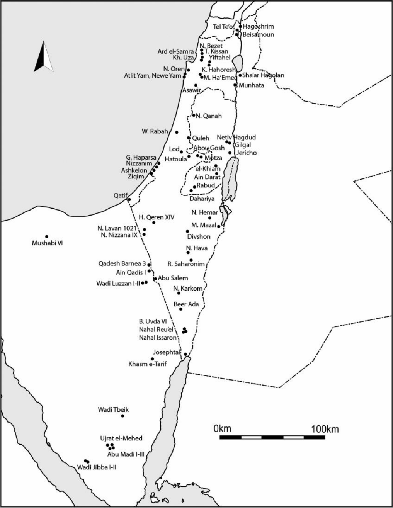
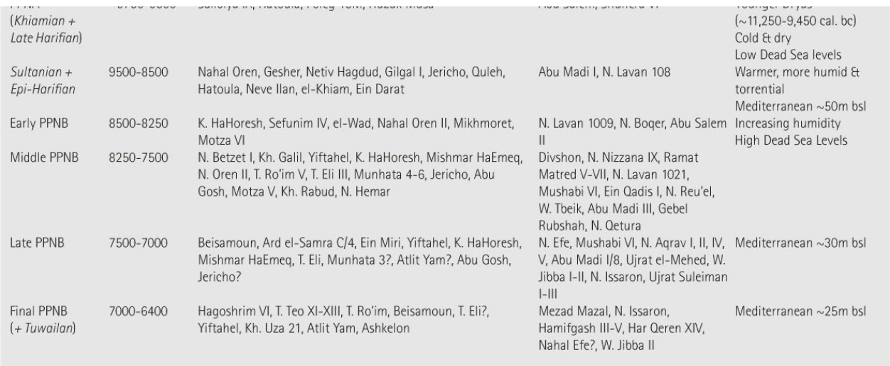
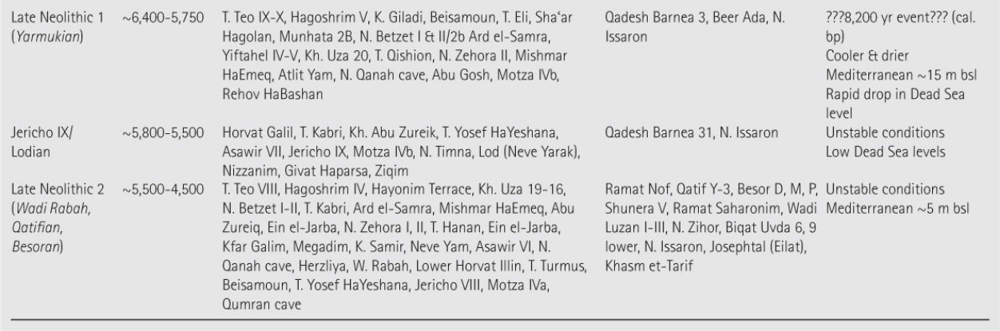
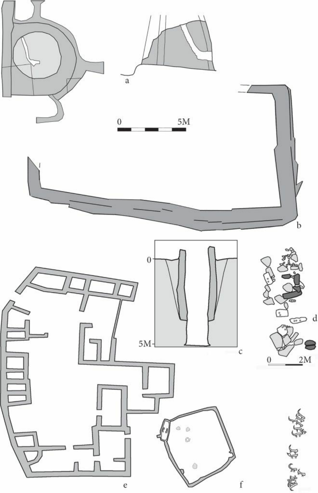
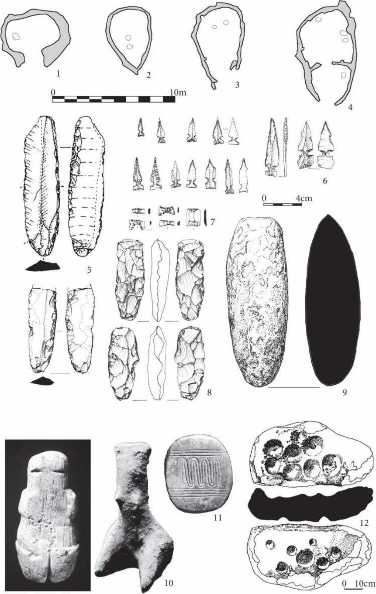
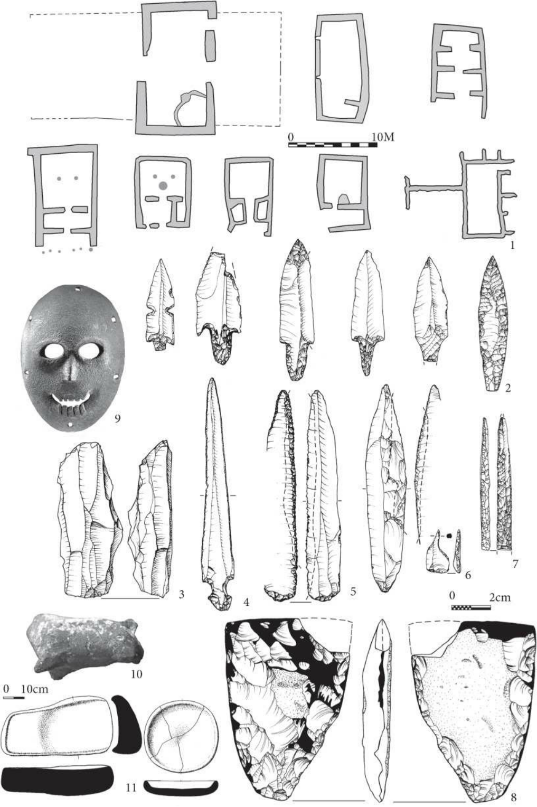
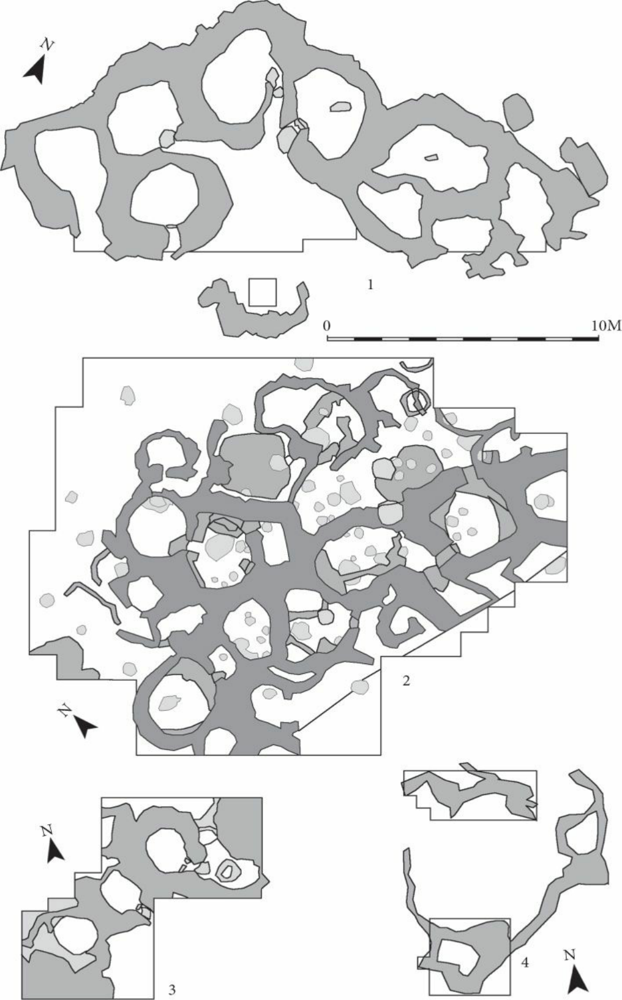

# **CHAPTER 11** 

# **THE SOUTHERN LEVANT (CISJORDAN) DURING THE NEOLITHIC PERIOD** 

## **A. NIGEL GORING-MORRIS AND ANNA BELFER-COHEN** 

## **INTRODUCTION** 

The Near Eastern Neolithic corresponds to revolutionary transformations in the human condition, setting the stage for later developments prior to the emergence of urban life. Theoretical constructs varying from climatic determinism through human vitalism to demographic and social triggers, coevolutionary symbiotic human–plant relationships, and linguistic and multi-factor models have all been hypothesized to explain these processes (Kuijt 2000; Kuijt and Goring-Morris 2002; Simmons 2007 and references therein). Yet such models frequently preceded the hard data available. In recent decades the situation has improved markedly as numerous field projects have generated copious quantities of evidence (Fig. 11.1). 

The period witnessed significant demographic growth when village communities were established, subsisting first on cultivation and foraging, then on agriculture, and finally on agropastoralism (Bar-Yosef 2001). Yet in order to begin to understand transformations associated with ‘Neolithization’ processes, it is crucial to note that many seminal developments were initiated during the preceding Epipaleolithic Natufian. Furthermore, ‘Neolithization’ involved not only plant and animal domestication but also the management of fire, water, and plastic materials as well as ritual and social interactions; these processes were neither linear nor directed (Goring-Morris and Belfer-Cohen 2010a). Wide-ranging cultural interaction spheres emerged throughout the Levant, of which the southern Levant (in and west of the Rift Valley), formed a small component of broader regional systems (Bar-Yosef and Belfer-Cohen 1989; Bar-Yosef and Bar-Yosef Mayer 2002). Subsistence shifted unevenly in time and space to domesticated plants and animals, with foraging still being important (Horwitz et al. 2000). The ‘desert and the sown’ dichotomy, present earlier, continued with the introduction of pastoralism midway through the Neolithic sequence (GoringMorris 1993). Communal, cultic installations and paraphernalia, and their contextual associations, attest to intensive ritual practices within settlements in spatially discrete locales. A range of prestige and other items were exchanged, often over considerable distances. Innate social tensions were exacerbated by discrepancies in the accumulation of material, social, and ritual wealth within and between communities. Mechanisms for dissipating resulting ‘scalar’ stress (tensions arising from larger numbers of decision-makers within communities) involved the emergence of increasing social and ritual complexity and, possibly, ranking. The role of interpersonal and even intercommunity violence remains uncertain and merits detailed study. Furthermore, the effects of long-term sedentism and the introduction of domestic animals into villages raise issues of contagious—including zoonotic (i.e. animal-borne)—and other diseases (Goring-Morris and Belfer-Cohen 2010b). 

**FIG. 11.1** Map of Neolithic sites in the southern Levant (Cisjordan) 

## **THE CHRONO-CULTURAL FRAMEWORK** 

While evidence for Neolithic settlement in the Levant was reported much earlier, it was only with Kenyon’s investigations in the 1950s at Tell es-Sultan (Jericho) that the four-phase terminological framework of Pre-Pottery Neolithic A (PPNA), Pre-Pottery Neolithic B (PPNB), Pottery Neolithic A (PNA), and Pottery Neolithic B (PNB) for the Neolithic was codified (see Table 11.1). While still 

widely used, with variations (e.g. Neolithic 1–4), numerous other appellations have also been used to describe specific industries, phases, and _facies_ (see below). 

The following presentation is arranged according to the traditional periodization, but with the PNA and PNB relabelled as Late Neolithic 1 and 2. Still, it should be noted that the PPNA probably shares greater commonalities with the Natufian than with the PPNB; while LN1 also could be more comfortably accommodated within the PPNB world; and LN2 has been argued to correspond more closely to the Chalcolithic. Adding to the confusion, ceramics first appear in small quantities during . the PPNB, yet are virtually absent from the Pottery Neolithic desertic _facies_ 

## **EARLY HOLOCENE ENVIRONMENTS** 

Independent sources for early Holocene environmental changes include: the Soreq cave speleothems (stalactites and stalagmites); the recently revised Hula pollen diagram chronology (rejecting the14 C dates due to the ‘reservoir effect’), based on correlations with other pollen sequences; deep sea cores; the eastern Mediterranean Sapropel 1 (a mud level consisting chiefly of decomposed organic matter formed at the bottom of a stagnant sea); and geomorphological evidence (e.g. Bar-Matthews, Ayalon, and Kaufman 1997; van Zeist, Baruch, and Bottema 2009). Climatic fluctuations generally correlate well with the archaeological evidence of changing settlement patterns. 

In the southern Levant at least, the cumulative effects of the Younger Dryas cold climatic event on later Natufian developments were significant. PPNA conditions improved, becoming warmer and more humid, albeit with a tendency towards torrential rains. Perhaps most significantly, this enabled relative increases of cereal-type grasses. The PPNB is marked by increasingly humid conditions, reaching its highest values through the entire Holocene during the Late PPNB (the early Holocene climatic optimum). The ‘8,200 yr. event’ (=6200 cal. BC) marks a rapid, short deterioration that likely played a major role in the demise of the PPNB (Weninger et al. 2009). Conditions thereupon improved somewhat, although the Late Neolithic is marked by environmental instability with climatic fluctuations. 

### **Table 11.1 Chronology and paleoenvironments of Neolithic entities west of the Rift Valley, with principal sites by region** 

Mediterranean Sea levels gradually rose during the Holocene from a low of _c_ .70m below sea _c c_ level during the early Natufian to .15m during the Final PPNB and .5m below sea level during LN2. The Dead Sea also witnessed major fluctuations, causing its contraction during the Late Neolithic to just the northern basin (Stein et al. 2010). 

## **_c_ ARCHAIC SETTLEMENTS OF THE PPNA ( .9750–8500 CAL. BC)** 

The local PPNA displays considerable elements of continuity from the preceding Natufian, with the ‘Khiamian’ representing a short-lived transition phenomenon after the cold spell of the Younger Dryas. Residual Mediterranean final Natufian/Khiamian communities probably combined with Negev and Sinai Harifian refugees and populations from elsewhere to aggregate into larger communities around more viable locales in ecotonal (intersection of two or more ecological zones) settings, close to more dependable water sources in lowland settings (Kuijt and Goring-Morris 2002; GoringMorris and Belfer-Cohen 2011). 

From this catalytic situation, Sultanian ( _c_ .9500–8500 cal. BC) settlements emerged, in a linear arrangement, mostly along the western flanks of the Rift Valley at intervals of 15–20km (Gesher, Huzuk Musa, Netiv Hagdud, Gilgal I, Jericho, el-Khiam, and ‘Ain Darat). Sites vary in size from _c_ .0.1ha to 2.5ha (e.g. Bar-Yosef and Gopher 1994; Bar-Yosef, Goring-Morris, and Gopher 2010). 

Smaller settlements also occur on the western fringes of the central mountain ridge (Nahal Oren, Quleh, Modi’in, and Hatoula), but rarely within the coastal plain itself (e.g. Kuijt 1994; Kuijt and Goring-Morris 2002; Zbenovich 2006). Small, specific seasonal occupations were found within the central hills. The Negev and Sinai were virtually devoid of occupants at this time, with the small encampment at Abu Madi I, in the high mountains of the southern Sinai, probably representing an ‘epi-Harifian’ (end of the final Epipaleolithic) site (Bar-Yosef 1991). 

At the nodal site of Jericho, the tower and wall represent a spectacular and unique communal PPNA endeavour (Kenyon and Holland 1982; 1983). The tower is widely accepted as representing a hallowed locale or shrine (perhaps even with topographic/celestial alignments) and associated silos (Fig. 11.2). The wall has been interpreted either as a defence against flooding or as delineating a sacred precinct, perhaps a cemetery (Bar-Yosef 1986; Barkai and Liran 2008; Naveh 2003; Ronen and Adler 2001). Other burials are found in and under houses and sometimes in abandoned structures, at times including post-mortem skull removal, a Natufian innovation (Kuijt 1996). 

PPNA domicile was based upon nuclear families in spaced, short-lived (and easily flammable) oval semi-subterranean structures (Fig. 11.3: 1–4). Construction was of wattle and daub or, somewhat later, of mud-brick on stone foundations with wooden posts and beams to support flat roofing and _pisé_ floors, sometimes with interior partitions. Interior furniture includes stone-lined hearths and ovens, large cup-marked slabs, bins, and external storage silos. 

PPNA subsistence integrated incipient farming (cultivation) and foraging, including hunting. Species cultivated comprised wild barley ( _Hordeum spontaneum_ ) and wild oats ( _Avena sterilis_ ), while foraging focused on nutlets of wild pistachio ( _Pistacia atlantica_ ), acorns of wild oak ( _Quercus ithaburensis_ ), and (possibly domesticated) fig ( _Ficus carica_ ). Legumes and pulses include _Lens_ sp. (lentil) and _Vicia_ sp. (broad bean) (Kislev, Hartmann, and Noy 2010). Overhunting and the deterioration of conditions during the late Natufian had probably already brought about a decline in the medium-sized mammalian prey available (Horwitz et al. 2010); yet the emphasis on gazelle was still marked, together with aurochs, wild boar, and some wild goat. At the same time, one can observe an emphasis upon smaller species, including hare and avian species, especially waterfowl (the Rift Valley and the coastal plain are major thoroughfares for annual bird migrations). Fox ( _Vulpes_ ) appear in some quantity, a factor that may be related to increased human sedentism, since it is a synanthropic (i.e. ecologically associated with humans) species, perhaps primarily for pelts. The only domesticated animal is the dog (already present during the Natufian). 

**FIG. 11.2** Public and ritual Neolithic architecture: (a) tower and wall of PPNA Jericho; (b) massive 

podium at PPNB Kfar HaHoresh; (c) well at Final PPNB Atlit Yam; (d) monoliths and cup-marked slabs of ritual complex at Final PPNB Atlit Yam; (e) public complex at LN1 Sha‘ar Hagolan; (f) sanctuary and pebble drawings at LN2 Biqat Uvda. Note different scales 

**FIG. 11.3** Characteristic elements of PPNA material culture: (1–4) oval habitations; (5) sickle blades; (6) Khiam points; (7) Hagdud truncations; (8) tranchet axes; (9) limestone axe (celt); (10) anthropomorphic figurines (limestone and clay); (11) decorative motif; (12) cup-holed slab. Note different scales 

Amongst the small finds, the chipped stone tool assemblages display innovations, including arrowheads, sickle-blades, bifacial tranchet axes and chisels, and pecked stone axes, reflecting developments in hunting, reaping, and carpentry activities (Fig. 11.3: 5–8) (Belfer-Cohen 1994). Groundstone tool assemblages shift from earlier narrow deep mortars characteristic of the late Natufian to shallow, v-shaped cup-marked slabs and platters (Fig. 11.3: 12), together with a variety of _manos_ (handstones), pounders, and celts (Fig. 11.3: 9) (Rosenberg 2008; Wright 2005). When preserved, sophisticated basketry is also documented (Schick 2010). 

Ritual objects include anthropomorphic and zoomorphic figurines in soft limestone and baked clay as well as incised geometric designs on slabs and pendants (Fig. 11.3: 10–11) (e.g. Goren and Biton 2010; Hershman and Belfer-Cohen 2010). Wide-ranging and complex exchange networks are documented, involving marine molluscs (from the Mediterranean and Red Seas) and exotic minerals (obsidian and greenstone), as well as asphalt (for hafting and lining baskets) and perhaps also salt (e.g. Bar-Yosef Mayer 2005; Bar-Yosef Mayer and Porat 2008). Certain localities (e.g. Jericho) appear to have served as hubs for redistribution networks. 

Causes for the demise of the PPNA remain elusive, although lowered water tables and climatic considerations should be taken into consideration; few if any sites display evidence of direct continuity with the PPNB. 

## **VILLAGES OF THE PRE-POTTERY NEOLITHIC B (** **_C_ .8500–6400 CAL. BC)** 

The PPNB coincides with significant and ongoing climatic amelioration throughout the Levant. Initially, during the Early PPNB, settlement density was sparse (e.g. Motza, Kfar HaHoresh, Michmoret, and Nahal Lavan 109), but then it steadily increased, reaching a peak during the Late PPNB–Final PPNB. These were indeed ‘good’ times as vegetation zones expanded and faunal populations rebounded. An eastward population shift is documented during the PPNB, as the major focus of settlement (and innovation) was now along the (later) ‘King’s Highway’ in Transjordan, although ‘megasites’ are also found within the Jordan Valley (Goring-Morris, Hovers, and BelferCohen 2009). Even when PPNA sites were reoccupied, it was only after a hiatus (Jericho, Nahal Oren), or by local realignment (Gesher–Munhata). Concurrently, seasonally mobile forager populations revisited or recolonized the arid periphery in the Negev and Sinai (Bar-Yosef 1984; Goring-Morris 1993). 

Recent investigations have conclusively documented the presence of a previously debated and short-lived, local Early PPNB phase displaying considerable elements of continuity from the PPNA (Khalaily et al. 2007). This is followed by the more widespread and substantial settlements of the Middle, Late, and Final PPNB. While some view the Final PPNB (or PPNC) as a distinct entity, it seems more pertinent to view it as the culmination of PPNB developments. 

Mediterranean-zone PPNB settlements are located close to secure water sources and arable land. Some villages in the Rift Valley are substantial, often approximating the size of PPNB ‘megasites’ east of the Rift, but sites elsewhere in or at the edges of alluvial valleys tend to be more modest in 

scope, rarely exceeding 4ha. There is little evidence for sites along the Mediterranean littoral prior to the Final PPNB (e.g. Atlit Yam and Ashkelon); however, this may be biased by presently submerged offshore sites (Galili et al. 2004). Few if any settlements were occupied throughout the entire _c_ .2000-year duration of the PPNB, perhaps reflecting a need to periodically relocate as agricultural yields declined in the absence of crop rotation or systematic fertilization of fields. Hunting probably focused on ‘neutral’ hilly areas. 

Domestic Middle/Late PPNB architecture is locally represented by individual, large-roomed, rectangular structures, often divided into three sections (the ‘megaron’ or ‘pier-house’ concept), probably occupied by nuclear families (Fig. 11.4: 1) (Goring-Morris and Belfer-Cohen 2008; Kenyon and Holland 1983; Lechevallier 1978). Houses were usually built of mud-brick on stone foundations with large posts to support roofing; there is no clear evidence that structures west of the Rift Valley were more than one storey high. Copious quantities of lime plaster were manufactured onsite for flooring and walls (Garfinkel 1988; Goren and Goring-Morris 2008). Hearths and silos are found within houses, while in outer, open areas numerous hearths, ovens, kilns, fire pits, etc. indicate intensive pyrotechnical activities, whether for cooking, plaster production, or for baking clay and other items. 

Unusual installations include massive, long walls traversing some sites (e.g. Middle/Late PPNB Abu Gosh and Final PPNB Atlit Yam), the functions of which remain uncertain, but they could reflect the delineation of wards within settlements. The >5m-deep wells at FPPNB Atlit Yam demonstrate sophisticated comprehension of hydrological principles (Galili and Nir 1993). 

During the PPNB there was clear intensification of ritual activities, many deriving from Natufian practices. Ritual precincts, sometimes with anthropomorphic monoliths ( _masseboth_ ), cup-marked slabs (Atlit Yam), and pavement-lined structures are found at the edges of sites (Mishmar Ha’Emeq) (Barzilai and Getzov 2008; Galili et al. 2005). The mortuary-cum-cult site of Kfar HaHoresh, with a massive walled podium/precinct, is located in the Nazareth hills; the secluded Judean desert cave of Nahal Hemar served as a storage locale for ritual paraphernalia marking the boundary between the ‘sown and the desert’ (Bar-Yosef and Alon 1988; Goring-Morris 2008). Other cave sites were also sporadically used (Belfer-Cohen and Goring-Morris 2007). 

Burials are found within villages, often concentrated in special areas, as well as in separate sites. Within-settlement burial places are usually insufficient for the settlement size and intensity, so that off-site disposal of some deceased, as at secluded Kfar HaHoresh, is likely. Burial customs often continued previous traditions, such as post-mortem skull removal, applied to both sexes and even children, but this was by no means ubiquitous. Occasionally it involved impressive plaster modelling of facial features (Jericho, Beisamoun, Yiftahel, and Kfar HaHoresh) or of wigs (Nahal Hemar). In addition to primary interments with varied associations (plaster-capped pits, cists, walls, and numerous hearths), there is evidence for dismemberment and manipulation of corpses (Eshed, Hershkovitz, and Goring-Morris 2008; Goring-Morris 2005). There tend to be more carefully arranged multiple burials in the Late PPNB, but it remains unclear whether these reflect diseases, violence, and/or other agents. Grave goods are located in and around burials, comprising lithics, groundstone, molluscs, polished pebbles, and animal motifs—whether the actual remains of foxes, gazelles, or aurochs or, in one case, an arrangement of human long bones, perhaps in the shape of an animal. 

**FIG. 11.4** Characteristic elements of PPNB material culture: (1) quadrilateral residential structures; (2) projectile points; (3) naviform core; (4) Nahal Hemar knife; (5) sickle blades; (6) awl; (7) borer; 

(8) polished axe; (9) mask; (10) zoomorphic clay figurine; (11) quern and platter. Note different scales 

Other ritual elements include baked clay and stone anthropomorphic and zoomorphic figurines that are common in sites throughout the Mediterranean zone. Elaborate stone masks (er-Ram, Duma, and Nahal Hemar) and large lime-plaster sculptures (Jericho and Nahal Hemar) are characteristic cultic paraphernalia in Judea (Fig. 11.4: 9), as in neighbouring areas east of the Rift Valley. 

Subsistence involved combinations of farming, foraging, hunting, herding, and fishing, depending on the specific location and phase (Horwitz et al. 2000). But, whereas primarily domesticated cereals ( _Hordeum_ sp. and _Triticum_ sp.) were farmed in and east of the Rift, further west the emphasis was on pulses ( _Lens culinaris_ and _Vicia fabia_ ) (Garfinkel 1988); this may correlate with the presence of stepped ‘saddle’ or ‘trough’ querns, found only in the Rift Valley, while symmetrical basin querns are typical further west (Fig. 11.4: 11). For animals, a similar pattern emerges, with domestic goat ( _Capra hircus_ ) present in the Jordan Valley, while further west gazelle continued to be the favoured prey, with goats only being introduced from the Late PPNB onwards. Other species include wild boar and aurochs, the latter especially in marshy areas, such as the coastal plain and Hula Valley. Fox, hare ( _Lepus capensis_ ), and some bird remains indicate the smaller hunted elements. Contextual evidence indicates that aurochs (caches at Atlit Yam, Kfar HaHoresh, and Motza) and also foxes were imbued with symbolic attributes beyond that of diet (Galili 2004; Goring-Morris and Horwitz 2007; Sapir-Hen et al. 2009). 

Much has been written concerning the hallmark PPNB ‘naviform’ chipped stone technology; but bidirectional blade technologies actually account for only a small proportion of PPNB lithic assemblages, especially in the Mediterranean zone (Barzilai 2009). Most production is actually ad hoc flake-based in nature. Bidirectional (naviform) technology was preferentially employed to provide elongated, symmetrical blade blanks for the more standardized tool classes (Fig. 11.4: 3)— sickle blades, large exquisitely fashioned arrowheads, borers, and burins/chanfreins (and the enigmatic Nahal Hemar knives, restricted to the eponymous site) (Fig. 11.4: 2, 5, 7) (Gopher 1994). There are diachronic and regional trends in the specifics of the technique; incipient craft specialization is represented by the exquisite blade stock at Early PPNB Motza. While good sources of raw material were available west of the Rift Valley (e.g. the Middle–Late PPNB beige ‘Sollelim’ flint near Yiftahel), Early–Middle PPNB purple/pink flint blanks were likely to have been procured by exchange from communities east of the Rift Valley (e.g. ‘Ain Ghazal). Bifacials represent a separate _chaîne opératoire_ , initially continuing PPNA tranchet sharpening techniques, but later shifting to polished ends to provide more durable cutting edges (Fig. 11.4: 8) (Barkai 2005). 

Extensive, sophisticated basketry, matting, and weaving industries are indicated by the bone tool assemblages and impressions; and at Nahal Hemar by the preserved items themselves, indicating the range of organic items normally absent (Bar-Yosef and Alon 1988). Flax ( _Linum usitatissimum_ ) was already domesticated for use through weaving. 

Exchange of exotic prestige items involved intensification of previous PPNA patterns— Mediterranean, Red Sea, and freshwater molluscs, obsidian, cinnabar, asphalt, and various greenstones, deriving from Sinai, the Arava, Transjordan, Saudi Arabia, northern Syria/Cyprus, Iraq, and central Anatolia (Bar-Yosef Mayer 2005; Bar-Yosef Mayer and Porat 2008). The exotics were used as cylinders, beads, pendants, votive axes, polished pebbles, incised tokens, etc. Such ornaments or talismans were individually rather than mass-produced. Bone, wood, fired clay and plaster beads and figurines (Fig. 11.4: 10) are also documented, some being coloured with powdered 

pigments. Poorly fired pottery and lime ‘white ware’ appear in small quantities. Clay tokens may indicate notational devices. 

Beginning with the Early PPNB, but especially during the Middle–Late PPNB, the arid zones of the Negev and Sinai were reoccupied by foragers who continued to be seasonally mobile, albeit interacting with their neighbouring kinsmen (Bar-Yosef 1984; Goring-Morris 1993). A central Negev and north Sinai province probably interacted with communities to the north; another province in the southern Negev and southern Sinai interacted primarily with southern Edom across the southern Arava. Base camps rarely exceeded 150m2 , and featured small beehive-type clusters of rounded stone huts with organic superstructures (Fig. 11.5). Hunting focused on gazelle and ibex, depending on the specific topographic setting, together with some wild ass and hare. Marine molluscs (almost absent in the central Negev province) were systematically collected on the eastern (Red Sea) coast of Sinai for exchange northwards by way of Biqat Uvda to the southern Edom mega-sites and thence along the ‘King’s Highway’. Insofar as burials are documented in the south Sinai province, skull removal was not practised, perhaps paralleling Late PPNB cist/chamber burial practices in southern Edom (Hershkovitz, Bar-Yosef, and Arensburg 1994). 

The Final PPNB ‘Tuwailan’ industry of the western Negev includes workshop sites for large cortical knives (e.g. Har Qeren XIV) that probably represent connections with the southern coastal plain (e.g. Ashkelon) and/or the Black Desert in Transjordan (Betts 1998; Garfinkel and Dag 2008; Goring-Morris, Gopher, and Rosen 1994). 

The gradual demise of PPNB lifeways should perhaps be considered as resulting from combinations of the unforeseen and deleterious consequences of living in large, long-term sedentary settlements with ecological degradation in their vicinity, declining yields, contagious diseases, and perhaps even inter-community violence, exacerbated by the brief but rapid climatic deterioration _c_ .6400 cal. BC (the so-called ‘8,200 yr. event’) (Goring-Morris and Belfer-Cohen 2010b; and see papers in _Neo-Lithics_ 1/10). 

## **THE LATE NEOLITHIC 1 (** **_C_ .6400–5500 CAL. BC)** 

In many respects the earlier part of the Late Neolithic represents what can best be termed as an ‘epiPPNB’ village phenomenon. For historical reasons, the appearance of pottery in quantity at this time has often been interpreted as heralding a complete break with the Pre-Pottery Neolithic; yet there is actually considerable evidence for continuity (see below). 

Two LN1 cultural entities have been defined within the Mediterranean zone: the ‘Yarmukian’ ( _c_ .6400–5750 cal. BC) and the ‘Lodian/Jericho IX’ ( _c_ .5800–5500 cal. BC) (Garfinkel 1993; Gopher 1995; Gopher and Gophna 1993). There has been considerable debate as to whether these represent regional differences (with the former located mostly north of the latter), a chronological succession, or, and most probably, combinations of both, not unlike the regionalization already apparent during the PPNB. 

**FIG. 11.5** Desert architecture: (1) beehive plan of Late PPNB Wadi Jibba I; (2) plan of Late PPNB Nahal Issaron; (3) plan of Early PPNB Abu Salem; (4) plan of animal enclosure and associated structures at LN2 Kvish Harif 

Mediterranean zone sites are usually found at low elevations, whether along the Rift Valley or in the coastal plain, as well as at the edges of the major alluvial valleys, where fully agricultural subsistence based on domesticated plants (wheat, barley, and legumes) and animals (sheep, goat, cattle, and pigs) could be practised, as reliance on hunting and foraging declined. 

The ‘mega-site’ of Sha‘ar Hagolan, without doubt the largest known and probably focal Yarmukian site (15ha), is favourably located on the alluvial fan of the Yarmuk River in the central Jordan Valley (Garfinkel and Miller 2002). However, other sites are much more modest in scope. Whether Sha‘ar Hagolan really displays ‘early signs of urban concepts’ (Ben-Shlomo and Garfinkel 2009) remains moot, as systematic surveys indicate patchy densities across the site (akin to those of the later Beersheva Chalcolithic sites). A more parsimonious interpretation is that the settlement comprised spatially discrete, perhaps clan-based clusters of wards. Still, there is a notable shift from previous PPNB domiciles to one of walled residential compounds, separated by alleys. These nuclear family compounds were walled with central courtyards, rectangular houses, and storage and cooking facilities. Such arrangements presumably reflect increasing concerns with privatization as well as providing penning for herded animals. 

_c_ A possible communal structure, Building II in Area E, may be present; .75 per cent of the clay and stone figurines in Area E derive from open areas within this complex, as did a concentration of three human skulls. Another probable communal endeavour is represented by the well. 

The coil-made pottery of the LN1 includes storage and cooking vessels, as well as finer wares, often with distinctive herringbone incised and/or painted decorations; both the globular shapes and decorative motifs probably mimic (earlier PPN) basketry. 

Amongst the lithic assemblages, projectile points (now including small pressure-flaked arrows) are found in relatively lower frequencies than previously, while deeply denticulated sickle blades, awls, burins, and bifacials are common (Matskevich 2005). Still, it is important to note some initial continuity of the (PPNB) bidirectional blade technology to produce blade blanks (Barzilai and Garfinkel 2006). 

The relative quantities and sources of exotic prestige items shift, with smaller quantities of obsidian, marine molluscs, and greenstone items. Beads begin to be mass produced (Wright, Critchley, and Garrard 2008). 

With regard to ritual, a special site is Nahal Qanah cave, the difficult access to and contents of which recall Nahal Hemar cave (Gopher and Tsuk 1991). The rich assemblage of large and small, more or less elaborate human figurines in clay and stone are a hallmark of the Yarmukian, albeit with differential concentrations from one site to the next (Garfinkel 1993). While very distinctive, certain iconographic elements again reflect origins in the PPNB, as do the zoomorphic figurines and geometric motifs. There are very few human burials within either Yarmukian or Lodian settlements, indicating that the deceased were disposed of either in such a manner as to leave no remains or, more probably, in currently undetected separate cemetery areas or sites. 

The shift from foraging to pastoralism in the southern deserts remains poorly documented, although it was probably introduced from southern and eastern Transjordan (and/or the southern coastal plain) some time during the seventh millennium, and thence eventually to the Nile Delta (Bar-Yosef and 

Khazanov 1992). Qadesh Barnea 3 and Beer Ada, the latter with what appears to be an animal corral, probably represent early manifestations of this process (Gopher 2010). However, with the rapid shift away from foraging (and especially hunting) to pastoralism, site visibility declines, since the material culture remains rarely include diagnostic attributes amongst the lithic assemblages (except for specialized bead workshops) and pottery is absent. 

## **THE LATE NEOLITHIC 2 (** **_C_ .5500–4500 CAL. BC)** 

With the shift to the LN2, ‘Wadi Rabah’ settlements are found throughout the Mediterranean zone. The tendency for smaller, dispersed clan-based settlements continues, although a few larger regional central sites are still documented in favourable localities such as the Hula Valley (e.g. Hagoshrim IV), and northern (e.g. Kabri, Tel Kissan) and central coastal plain (e.g. Tel Asawir) (Gopher and Gophna 1993; Getzov 2008; Getzov et al. 2009; Yannai 2006; Zviely et al. 2006). 

Wadi Rabah residential architecture presages the Chalcolithic in featuring rectangular broad-room (mud-brick?) houses on stone foundations with raised floors, together with associated circular storage and other features including pits and hearths within walled compounds. Indeed, the increasing quantities of elaborately incised stamps and tokens may reflect increasing concerns with privatization and marks of ownership (Eirikh-Rose 2004). 

It is somewhat surprising that, in contrast to the desert, there is presently little if any obvious evidence of communal, public, or ritual architectural endeavours during LN2 within the Mediterranean zone. But this may simply indicate that insufficient exposures have been opened in large tells covered by later settlements. 

Subsistence by now was almost entirely agropastoral, comprising the full suite of domestic plants (including olive exploitation if not actual domestication) and animals, with hunting rarely accounting for more than 10 per cent of faunal remains (Horwitz 1988; 2002; Marom and Bar-Oz 2009). 

The ceramic repertoire, still handmade, has a limited range of shapes and sizes and includes bow rims; there are also distinctive burnished black and red wares (Garfinkel 1999; Gopher 1995; Gopher and Goren 1995). Among the lithics, projectile points virtually disappear, while short, rectangular sickle segments displaying invasive pressure flaking (sometimes with spaced denticulation), burins, and bifacials are common. Stone and clay sling shots are a distinctive addition to the small finds repertoire (Rosenberg 2009), as are spindle whorls and loom weights for weaving. 

With regard to burial practices, only a few individual articulated remains have been recovered from within settlements with the exception of child jar burials (Gopher and Orrelle 1995). Still, the edge of the submerged site of Neve Yam displays a cemetery area with cist graves for individual burials (Galili et al. 2005). 

Largely paralleling the Wadi Rabah in the northern Negev are the still poorly documented ‘Qatifian’ and later ‘Besoran’ settlements (Abadi-Reiss and Gilead 2010; Gilead 1990; Goren 1990). Further south in the Negev and Sinai, the mobile pastoralist adaptation continues, seemingly with greater intensification than before, albeit with few recognizable settlements as at Kvish Harif (Rosen 1984). But a notable innovation during LN2 here is the widespread appearance of open-air sanctuaries, heralding a long-lasting ‘desert tradition’. They are usually situated in remote, hyper-arid areas, adjacent to prominent topographic features. Clusters of such sanctuaries are documented in Ramat Saharonim, Biqat Uvda, the Eilat mountains, and Khasm et-Tarif (Avner 2002; Rosen et al. 2007; Yogev and Avner 1983). Sanctuaries are sometimes megalithic in nature and a few appear to 

have celestial alignments; others feature associated large-scale pebble drawings and clusters of large or small stele, _masseboth_ , and hearths. Most are almost devoid of diagnostic material remains. The cemetery site of Josephtal near Eilat features cist burials, including a cache of skulls and numerous grave goods, wooden posts, and stone monoliths, as well as numerous hearths (Avner 1991). Carbon14 dates commonly indicate continuity into the Chalcolithic. 

## **DISCUSSION** 

While the Neolithic represents a period of major social and economic transformations, many material culture elements and practices can actually be traced to the late Epipaleolithic Natufian, when the first sedentary hamlets began to coalesce. So too, continuity can be traced from the PPNB through at least the earlier LN1. During the course of the Neolithic, wide-ranging cultural interaction spheres emerged throughout the Levant, of which the southern Levant, in and west of the Rift Valley, formed but a small component of broader regional systems. Following the Natufian, the centre of innovation shifted to the northern Levant. Nevertheless, there is considerable debate as to whether developments were polycentric, as opposed to central innovations in the north with secondary dispersion to the southern Levant. It seems likely there were elements of both; unquestionably, within the southern Levant the main PPNA axis was within the Rift Valley, while during the PPNB it shifted eastwards to higher elevations. During the LN, more pronounced regionalization is discerned, with primary developments in and west of the Rift Valley. 

Recent evidence from both Cyprus and the northern Levant demonstrates that the processes of plant and animal domestication were much more complex than previously thought. The ‘wild– domestic’ spectrum was by no means binary, but involved prolonged manipulation of plant and animal species, some of which were either never or only very much later domesticated. Furthermore, it has even been proposed that milking, commonly associated with the later ‘secondary products revolution’, actually may have begun much earlier, during the Pre-Pottery Neolithic. 

As global and community sizes increased, new social and ritual regulatory mechanisms were necessary to address the resulting stresses and inequalities within and between communities. Solutions involved realignments, together with embellishments and intensifications of previous traditions, many first apparent in the Natufian. Although Neolithic intra-community relationships were primarily kin-based, ritual behaviours were likely to have been both public and exclusionary in nature. 

The ‘agricultural revolution’ is widely associated with the concept of the ‘mother goddess’. Yet, inasmuch as gender can be identified amongst all Neolithic anthromorphic figurines, phallic depictions are a constant and significant element, indicating a more balanced perspective between the genders. 

The issue of hierarchical ranking remains debatable. PPNA settlements already display considerable variability in size and contents, and PPNB mortuary data certainly indicate differential treatments of the deceased; but whether this also related to the living is currently uncertain. So, too, questions as to the nature of interpersonal and inter-community interactions (including violence) remain to be systematically addressed. Indeed, the emergence of incipient craft specialization during the Pre-Pottery Neolithic often focused around exchange networks of prestige items (e.g. flint blades and knives, minerals, and marine molluscs) and technologies (e.g. pyrotechnology and hydrology), presaging later developments (e.g. ceramics). Still, notwithstanding the scale and scope of 

accomplishments in the PPNB _koiné_ , its lack of crucial social, organizational, and technological elements appears ultimately to have prevented it from developing into fully-fledged urban societies, and communities dispersed into generally smaller settlements. To summarize, the course of ‘Neolithization’ in the Near East was not a linear process leading to the establishment of urban centres and city-states, as thought in the past. Actually, it took another period, the whole of the Chalcolithic, to reach this stage in human history. 

## **ACKNOWLEDGEMENTS** 

Part of the research on which this contribution is based was supported by grants to Nigel GoringMorris from the Israel Science Foundation funded by the Israel Academy of Sciences (Grants 840/01, 558/04, and 755/07). We are grateful to Omry Barzilai, Yossi Garfinkel, Nimrod Getzov, Avi Gopher, Hamudi Khalaily, Ofer Marder, and Yanir Milevski for lively discussions; however, we naturally take full responsibility for the views expressed herein. 

## **SUGGESTED READING** 

- Banning, E. B. (1998). The Neolithic period: triumphs of architecture, agriculture, and art. _Near Eastern Archaeology_ 61: 188–237. 

- Bar-Yosef, O. (2001). New views on the origins of agriculture in southwestern Asia. _Review of Archaeology_ 22: 5–15. 

- Gopher, A. (1995). Early pottery-bearing groups in Israel: the Pottery Neolithic period. In T. D. Levy (ed.), _The Archaeology of Society in the Holy Land_ . New York: Facts on File, 205–25. 

- Goring-Morris, A. N., and A. Belfer-Cohen (2008). A roof over one’s head: developments in Near Eastern residential architecture across the Epipalaeolithic–Neolithic transition. In J.-P. Bocquet. 

- Appel and O. Bar-Yosef (eds), _The Neolithic Demographic Transition and Its Consequences_ Dordrecht: Springer, 239–86. 

- Horwitz, L. K., E. Tchernov, P. Ducos, et al. (2000). Animal domestication in the southern Levant. _Paléorient_ 25: 63–80. 

- Kuijt, I. (ed.) (2000). _Life in Neolithic Farming Communities: Social Organization, Identity, and Differentiation_ . New York: Kluwer Academic/Plenum. 

- —— and Goring-Morris, A. N. (2002). Foraging, farming and social complexity in the Pre-Pottery Neolithic of the south-central Levant: a review and synthesis. _Journal of World Prehistory_ 16: 361–440. 

- Rosen, S. A. (2008). Desert pastoral nomadism in the _longue durée_ : a case study from the Negev and the southern Levantine Deserts. In H. Barnard and W. Wendrich (eds), _The Archaeology of Mobility: Old and New World Nomadism_ . Los Angeles: Cotsen Institute of Archaeology, University of California, 115–40. 

- Simmons, A. H. (2007). _The Neolithic Revolution in the Near East: Transforming the Human Landscape_ . Tucson: University of Arizona Press. 

### **REFERENCES** 

Abadi-Reiss, Y., and I. Gilead (2010). The transition of Neolithic–Chalcolithic in the southern 

   - Levant: recent research of cultural assemblages from the site of Qatif. In P. Matthiae, F. Pinnock, L. Nigro and N. Marchetti (eds), _Proceedings of the 6th International Congress of the Archaeology of the Ancient Near East_ , Volume II, pp. 27-38. Wiesbaden: Harrassowitz. 

- Avner, U. (1991). Late Neolithic–Early Chalcolithic burial site in Eilat. _American Journal of Archaeology_ 95: 496–7. 

- —— (2002). _Studies in the material and spiritual culture of the Negev populations, during the 6th–3rd millennia B.C_ . PhD dissertation, Hebrew University of Jerusalem. 

- Barkai, R. (2005). _Flint and Stone Axes as Cultural Markers: Socio-Economic Changes as Reflected in Holocene Flint Tool Industries of the Southern Levant_ . Berlin: Ex oriente. 

- —— and R. Liran (2008). Midsummer sunset at Neolithic Jericho. _Time and Mind_ 1: 273–84. 

- Bar-Matthews, M., A. Ayalon, and A. Kaufman (1997). Late Quaternary paleoclimate in the eastern Mediterranean region from stable isotope analysis of speleothems at Soreq Cave, Israel. _Quaternary Research_ 47: 155–68. 

- Bar-Yosef, O. (1984). Seasonality among Neolithic hunter-gatherers in southern Sinai. In J. CluttonBrock and C. Grigson (eds), _Animals and Archaeology_ , vol. 3: _Early Herders and Their Flocks_ . Oxford: British Archaeological Reports, 145–60. 

- —— (1986). The walls of Jericho: an alternative explanation. _Current Anthropology_ 27: 157–62. 

- —— (1991). The Early Neolithic of the Levant: recent advances. _Review of Archaeology_ 12: 1–18. 

- —— (2001). From sedentary foragers to village hierarchies: the emergence of social institutions. In W. G. Runciman (ed.), _The Origin of Human Social Institutions_ . Oxford: Oxford University Press for the British Academy, 1–38. 

- —— and D. Alon (1988). _Nahal Hemar Cave_ . Jerusalem: Department of Antiquities and Museums. 

- —— and D. E. Bar-Yosef Mayer (2002). Early Neolithic tribes in the Levant. In W. A. Parkinson (ed.), _The Archaeology of Tribal Societies_ . Ann Arbor, Mich.: International Monographs in Prehistory, 340–71. 

- —— and A. Belfer-Cohen (1989). The Levantine ‘PPNB’ interaction sphere. In I. Hershkovitz (ed.), _People and Culture in Change: Proceedings of the Second Symposium on Upper Palaeolithic, Mesolithic, and Neolithic Populations of Europe and the Mediterranean Basin_ . Oxford: British Archaeological Reports, 59–72. 

- —— and A. Gopher (eds) (1994). _An Early Neolithic Village in the Jordan Valley, pt 1: The Archaeology of Netiv Hagdud_ . Cambridge, Mass.: Peabody Museum of Archaeology and Ethnology, Harvard University. 

- —— A. N. Goring-Morris, and A. Gopher (eds) (2010). _Gilgal: Excavations at Early Neolithic Sites in the Lower Jordan Valley—The Excavations of Tamar Noy_ . Oakville, Conn.: David Brown/Oxbow. 

- —— and A. M. Khazanov (eds) (1992). _Pastoralism in the Levant: Archaeological Materials in Anthropological Perspectives_ . Madison, Wis.: Prehistory Press. 

- Bar-Yosef Mayer, D. E. (2005). The exploitation of shells as beads in the Palaeolithic and Neolithic of the Levant. _Paléorient_ 31: 176–85. 

- —— and N. Porat (2008). Green stone beads at the dawn of agriculture. _Proceedings of the National Academy of Science_ (USA) 105: 8548–51. 

- Barzilai, O. (2009). _Social complexity in the southern Levantine PPNB as reflected through lithic studies: the bidirectional blade industries_ . PhD dissertation, Hebrew University of Jerusalem. 

- —— and Y. Garfinkel (2006). Bidirectional blade technology after the PPNB: new evidence from Sha‘ar Hagolan, Israel. _Neo-Lithics_ 1/06: 27–31. 

- —— and N. Getzov (2008). Mishmar Ha’emeq: a Neolithic site in the Jezreel Valley. _Neo-Lithics_ 2/08: 12–17. 

- Belfer-Cohen, A. (1994). The Lithic continuity in the Jordan Valley: Natufian unto the PPNA. In H. G. Gebel and S. K. Kozlowski (eds), _Neolithic Chipped Stone Industries of the Fertile Crescent: Proceedings of the First Workshop on PPN Chipped Lithic Industries, Seminar für_ . 

- Ben-Shlomo, D., and Y. Garfinkel (2009). Sha‘ar Hagolan and new insights on Near Eastern protohistoric urban concepts. _Oxford Journal of Archaeology_ 28: 189–209. 

- Betts, A. (ed.) (1998). _The Harra and the Hamad: Excavations and Surveys in Eastern Jordan_ , Volume 1. Sheffield: Sheffield Academic. 

- Garfinkel (2009). Sha‘ar Hagolan and new insights on Near Eastern proto-historic urban concepts. _Oxford Journal of Archaeology_ 28: 189–209. 

- Eirikh-Rose, A. (2004). Geometric patterns on pebbles: early identity symbols? In E. J. Peltenburg and A. Wasse (eds), _Neolithic Revolution: New Perspectives on Southwest Asia in Light of Recent Discoveries on Cyprus_ . Oxford: Oxbow, 145–62. 

- Eshed, V., I. Hershkovitz, and A. N. Goring-Morris (2008). A re-evaluation of burial customs in the Pre-Pottery Neolithic B in light of paleodemographic analysis of the human remains from Kfar HaHoresh, Israel. _Paléorient_ 34: 91–103. 

- . 

- Galili, E. (2004). _Submerged settlements of the ninth to seventh millennia BP off the Carmel coast_ PhD dissertation, Tel Aviv University. 

- —— A. Gopher, V. Eshed, and I. Hershkovitz (2005). Burial practices at the submerged Pre-Pottery Neolithic site of Atlit-Yam, northern coast of Israel. _Bulletin of the American School of Oriental Research_ 339: 1–19. 

- —— A. Gopher, B. Rosen, and L. K. Horwitz (2004). The emergence of the Mediterranean fishing village in the Levant and the anomaly of Neolithic Cyprus. In E. J. Peltenburg and A. Wasse (eds), _Neolithic Revolution: New Perspectives on Southwest Asia in Light of Recent Discoveries on Cyprus_ . Oxford: Oxbow, 91–101. 

- —— and Y. Nir (1993). The submerged Pre-Pottery Neolithic water well of Atlit-Yam, northern Israel, and its palaeoenvironmental implications. _The Holocene_ 3: 265–70. 

- Garfinkel, Y. (1988). Burnt lime products and social implications in the Pre-Pottery Neolithic B villages in the Near East. _Paléorient_ 13: 69–76. 

- —— (1993). The Yarmukian Culture in Israel. _Paléorient_ 19: 115–33. 

- —— (ed.) (1999). _The Yarmukians: Neolithic Art from Sha’ar Hagolan_ . Jerusalem: Bible Lands Museum. 

- —— and D. Dag (eds) (2008). _Neolithic Ashkelon_ . Jerusalem: Institute of Archaeology, Hebrew University of Jerusalem. 

- —— and M. A. Miller (eds) (2002). _Sha‘ar Hagolan 1: Neolithic Art in Context_ . Oxford: Oxbow Books/Jerusalem: Institute of Archaeology, Hebrew University of Jerusalem. 

- Getzov, N. (2008). Ha-Goshrim. In E. Stern (ed.), _The New Encyclopedia of Archaeological Excavations in the Holy Land_ , vol. 5: _Supplementary Volume_ . Jerusalem: Israel Exploration Society/Washington, DC: Biblical Archaeology Society, 1759–61. 

- —— O. Barzilai, G. Le Dosseur, et al. (2009). Nahal Betzet II and Ard el Samra: two late prehistoric sites and settlement patterns in the Akko Plain. _Mitekufat Haeven_ 39: 81–158. 

- Gilead, I. (1990). The transition Neolithic–Chalcolithic and the Qatifian of the northern Negev and Sinai. _Levant_ 22: 47–63. 

- Gopher, A. (1994). _Arrowheads of the Neolithic Levant: A Seriation Analysis_ . Winona Lake, Ind.: Eisenbrauns. 

- —— (1995). Early pottery-bearing groups in Israel: the Pottery Neolithic period. In T. D. Levy (ed.), _The Archaeology of Society in the Holy Land_ . New York: Facts on File, 205–25. 

- —— (2010). Qadesh Barnea 3: a Neolithic site in the western Negev highlands. _Mitekufat Haeven_ 40: 183–218. 

- —— and R. Gophna (1993). Cultures of the eighth and seventh millennium BP in the southern Levant: a review for the 1990s. _Journal of World Prehistory_ 7: 297–353. 

- —— and Y. Goren (1995). The beginnings of pottery production in the southern Levant: a model. In 

   - P. Vincenzini (ed.), _The Ceramics Cultural Heritage_ . Faenza: Techna, 21–8. 

- —— and E. Orrelle (1995). New data on burials from the Pottery Neolithic period (sixth–fifth millennium BC) in Israel. In S. Campbell and A. Green (eds), _The Archaeology of Death in the Ancient Near East_ . Oxford: Oxbow, 24–8. 

- —— and T. Tsuk (1991). _Ancient Gold: Rare Finds from Nahal Qanah Cave_ . Jerusalem: Israel Museum. 

- Goren, Y. (1990). The Qatifian culture in southern Israel and Transjordan: additional aspects for its definition. _Mitekufat Haeven_ 23: 100–112. 

- —— and R. Biton (2010). Technology of the fired clay objects from Gilgal. In Bar-Yosef et al. (2010: 217–22). 

- —— and A. N. Goring-Morris (2008). Early pyrotechnology in the Near East: experimental lime plaster production at the PPNB site of Kfar HaHoresh, Israel. _Geoarchaeology_ 23: 779–98. 

- Goring-Morris, A. N. (1993). From foraging to herding in the Negev and Sinai: the Early to Late Neolithic transition. _Paléorient_ , 19: 63–89. 

- —— (2005). Life, death and the emergence of differential status in the Near Eastern Neolithic: evidence from Kfar HaHoresh, Lower Galilee, Israel. In J. Clark (ed.), _Archaeological Perspectives on the Transmission and Transformation of Culture in the Eastern Mediterranean_ . Oxford: Oxbow, 89–105. 

- —— (2008). Kefar Ha-Horesh. In E. Stern (ed.), _The New Encyclopedia of Archaeological Excavations in the Holy Land_ , vol. 5: _Supplementary Volume_ . Jerusalem: Israel Exploration Society/Washington, DC: Biblical Archaeology Society, 1907–9. 

- —— (2010a). Different ways of being, different ways of seeing … changing worldviews in the Near East. In B. Finlayson and G. Warren (eds), _Landscapes in Transition_ . Oxford: Oxbow, 9–22. 

- —— (2010b). ‘Great expectations’, or, the inevitable collapse of the Early Neolithic in the Near East. In M. S. Bandy and J. R. Fox (eds), _Becoming Villagers: Comparing Early Village_ 

_Societies_ . Tucson: University of Arizona Press, 62–77. 

- —— (2011). Neolithization processes in the Levant: the outer envelope. _Current Anthropology_ 52(S4): S195– S208. 

- —— (forthcoming). Neolithisation processes in the Levant: the outer envelope. _Current_ . 

- _Anthropology_ 

- —— and A. Belfer-Cohen (2008). A roof over one’s head: developments in Near Eastern residential architecture across the Epipalaeolithic–Neolithic transition. In J.-P. Bocquet-Appel and O. BarYosef (eds), _The Neolithic Demographic Transition and Its Consequences_ . Dordrecht: Springer, 239–86. 

- —— and L. K. Horwitz (2007). Funerals and feasts in the Near Eastern Pre-Pottery Neolithic B. _Antiquity_ 81: 902–19. 

- —— A. Gopher, and S. A. Rosen (1994). The Neolithic Tuwailan cortical knife industry of the Negev, Israel. In H. G. Gebel and S. K. Kozlowski (eds), _Neolithic Chipped Stone Industries of the Fertile Crescent: Proceedings of the First Workshop on PPN Chipped Lithic Industries, Seminar für Vorderasiatische Altertumskunde, Free University of Berlin, 29th March–2nd April, 1993_ . Berlin: Ex oriente, 511–25. 

- —— E. Hovers, and A. Belfer-Cohen (2009).The dynamics of Pleistocene settlement patterns and human adaptations in the Levant—an overview. In J. J. Shea and D. Lieberman (eds), _Transitions in Prehistory: Papers in Honor of Ofer Bar-Yosef_ . Oakville, CT: David Brown/Oxbow, 187– 254. 

- Hershkovitz, I., O. Bar-Yosef, and B. Arensburg (1994). The Pre-Pottery Neolithic populations of south Sinai and their relations to other circum-Mediterranean groups: an anthropological study. _Paléorient_ 20: 59–84. 

- Hershman, D., and A. Belfer-Cohen (2010). ‘It’s magic!’ Artistic and symbolic material manifestations from the Gilgal sites. In Bar-Yosef et al. (2010: 185–216). 

- Horwitz, L. K. (1988). Bone remains from Tel Neve Yam. _Mitekufat Haeven_ 21: 99–109. 

- —— (2002). Fauna from the Wadi Rabah site of Abu Zureiq. _Israel Exploration Journal_ 52: 167– 78. 

- —— T. Simmons, O. Lernau, and E. Tchernov (2010). Fauna from the sites of Gilgal I, II and III. In Bar-Yosef et al. (2010: 263–96). 

- —— E. Tchernov, P. Ducos, et al. (2000). Animal domestication in the southern Levant. _Paléorient_ , 25: 63–80. 

- Kenyon, K. M., and T. A. Holland (eds) (1982). _Excavations at Jericho_ , vol. 4: _The Pottery Type Series and Other Finds_ . London: British School of Archaeology in Jerusalem. 

- —— (eds) (1983). _Excavations at Jericho_ , vol. 5. London: British School of Archaeology in Jerusalem. 

- Khalaily, H., O. Bar-Yosef, O. Barzilai, et al. (2007). Excavations at Motza in the Judean Hills and the Early Pre-Pottery Neolithic B in the southern Levant. _Paléorient_ 33: 5–37. 

- Kislev, M. E., A. Hartmann, and T. Noy (2010). The vegetal subsistence of Gilgal I as reflected in the assemblage of House 11. In Bar-Yosef et al. (2010: 251–8). 

- Kuijt, I. (1994). Pre-Pottery Neolithic A settlement variability: evidence for sociopolitical developments in the southern Levant. _Journal of Mediterranean Archaeology_ 7: 165–92. 

- —— (1996). Negotiating equality through ritual: a consideration of Late Natufian and Pre-Pottery 

   - Neolithic A period mortuary practices. _Journal of Anthropological Archaeology_ 15: 313–36. 

- —— (2000). _Life in Neolithic Farming Communities: Social Organization, Identity, and Differentiation_ . New York: Kluwer Academic/Plenum. 

- —— and A. N. Goring-Morris (2002). Foraging, farming and social complexity in the Pre-Pottery Neolithic of the south-central Levant: a review and synthesis. _Journal of World Prehistory_ 16: 361–440. 

- Marom, N., and G. Bar-Oz (2009). ‘Man made oases’: Neolithic patterns of wild ungulate exploitation and their consequences for the domestication of pigs and cattle. _Before Farming_ 2009: 1–12. 

- Matskevich, Z. (2005). _The lithic assemblage of Sha‘ar Hagolan: typo-technological and chronocultural aspects_ . MA thesis, Hebrew University of Jerusalem. 

- Naveh, D. (2003). PPNA Jericho: a socio-political perspective. _Cambridge Archaeological Journal_ 13: 83–96. 

- Ronen, A., and D. Adler (2001). The walls of Jericho were magical. _Archaeology, Ethnology and Anthropology of Eurasia_ 2: 97–103. 

- Rosen, S. A. (1984). Kvish Harif: preliminary investigation at a Late Neolithic site in the central Negev. _Paléorient_ 10: 111–21. 

- —— F. Bocquentin, Y. Avni, and N. Porat (2007). Investigations at Ramat Saharonim: a desert Neolithic sacred precinct in the central Negev. _Bulletin of the American School of Oriental Research_ 346: 1–27. 

- Rosenberg, D. (2008). Serving meals making a home: the PPNA limestone vessel industry of the southern Levant. _Paléorient_ 34: 23–32. 

- —— (2009). Flying stones: the slingstones of the Wadi Rabah Culture. _Paléorient_ 35: 99–112. 

- Sapir-Hen, L., G. Bar-Oz, H. Khalaily, and T. Dayan (2009). Gazelle exploitation in the Early Neolithic site of Motza, Israel: the last of the gazelle hunters in the southern Levant. _Journal of Archaeological Science_ 36: 1538–46. 

- Schick, T. (2010). Basketry finds from Gilgal. In Bar-Yosef, O., A. N. Goring-Morris, and A. Gopher (eds), _Gilgal: Excavations at Early Neolithic Sites in the Lower Jordan Valley: The Excavations of Tamar Noy_ . Oakville, Conn.: David Brown/Oxbow, 245–50. 

- Simmons, A. H. (2007). _The Neolithic Revolution in the Near East: Transforming the Human Landscape_ . Tucson: University of Arizona Press. 

- Stein, M., A. Torfstein, I. Gavrieli, and Y. Yechieli (2010). Abrupt aridities and salt deposition in the post-glacial Dead Sea and their North Atlantic connection. _Quaternary Science Review_ 29: 567–75. 

- van Zeist, W., U. Baruch, and S. Bottema (2009). Holocene palaeoecology of the Hula area, northeastern Israel. In E. Kaptijn and L. P. Petit (eds), _A Timeless Vale: Archaeological and Related Essays on the Jordan Valley in Honour of Gerrit van der Kooij on the Occasion of His Sixty-Fifth Birthday_ . Leiden: Leiden University Press, 29–64. 

- Weninger, B., L. Clare, E. J. Rohling, et al. (2009). The impact of rapid climate change on prehistoric societies during the Holocene in the eastern Mediterranean. _Documenta Praehistorica_ 36: 7–59. 

- Wright, K. I. (2005). The emergence of cooking in western Asia. _Archaeology International_ 2004–5: 33–7. 

- —— P. Critchley, and A. Garrard (2008). Stone bead technologies and early craft specialization: insights from two Neolithic sites in eastern Jordan. _Levant_ 40: 131–65. 

- Yannai, E. (2006). _‘En Esur (‘Ein Asawir) I: Excavations at a Protohistoric Site in the Coastal Plain of Israel_ . Jerusalem: Israel Antiquities Authority. 

- Yogev, O., and U. Avner (1983). Excavation at the Neolithic sanctuary at Biq’at ‘Uvda. _Excavations and Surveys in Israel_ 2: 14–15. 

- Zbenovich, V. (2006). Salvage excavations at a Pre-Pottery Neolithic site at Modiin. ‘ _Atiqot_ 51: 1– 15. 

Zviely, D., D. Sivan, A. Ecker, et al. (2006). Holocene evolution of the Haifa Bay area, Israel, and its influence on ancient tell settlements. _Holocene_ 16: 849–61. 

