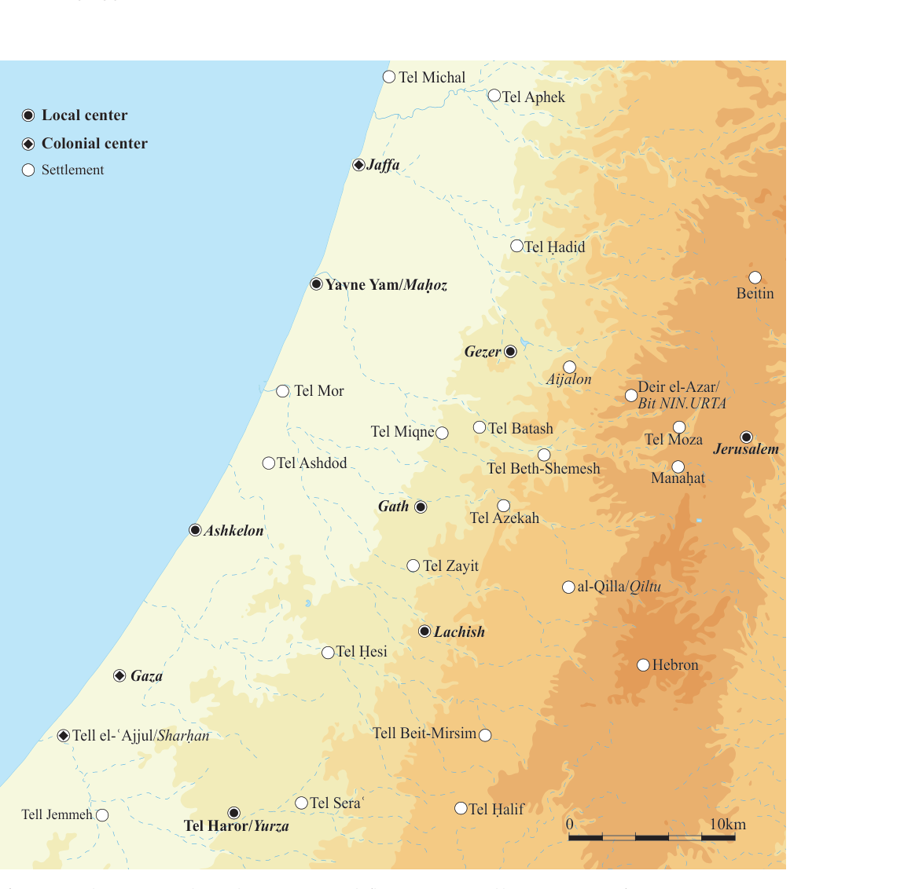
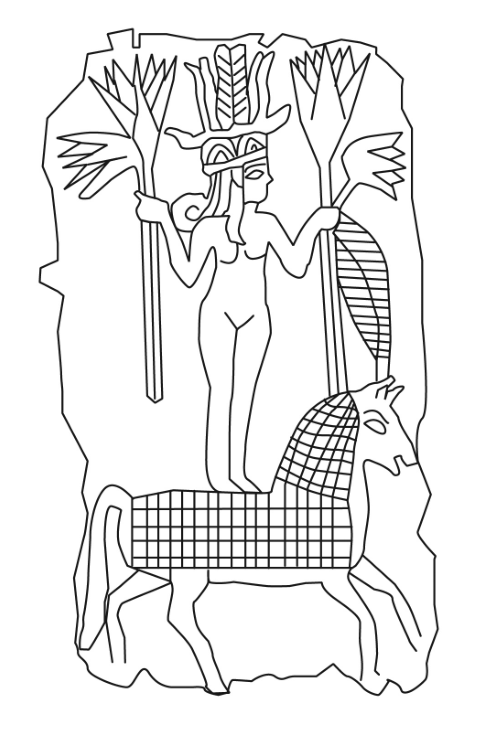
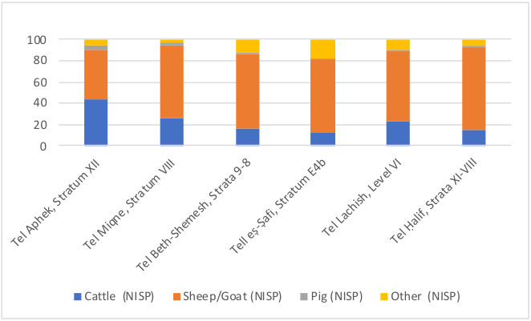
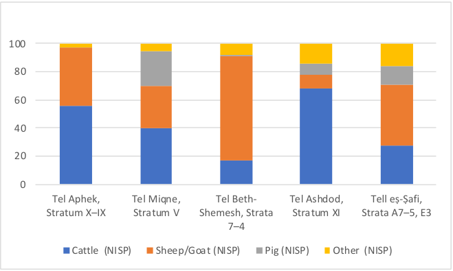
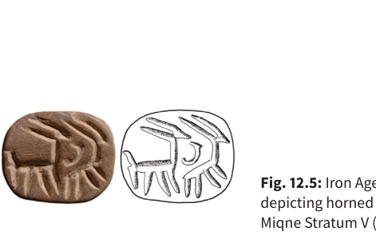
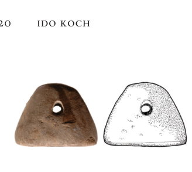
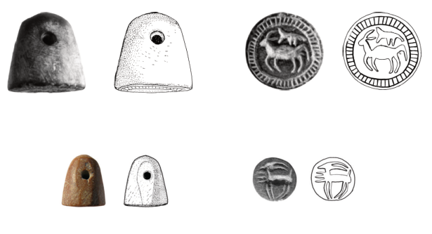
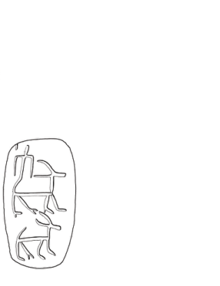
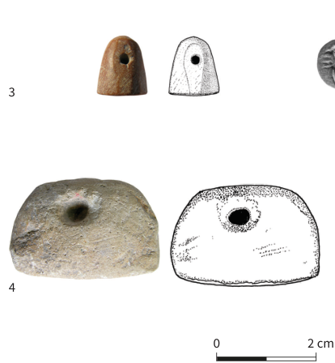
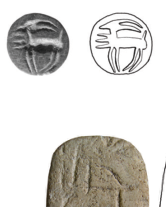

## FROM NOMADISM TO MONARCHY? 

Revisiting the Early Iron Age Southern Levant 

_Edited by_ Ido Koch Oded Lipschits Omer Sergi 

MOSAICS 3 

#### From Nomadism _to_ Monarchy? 

###### tel aviv university 

sonia and marco nadler institute of archaeology 

###### **mosaics** | studies on ancient israel 

NO. 3 

|**Executive Editor**|Oded Lipschits|
|---|---|
|**Managing Editor**|Tsipi Kuper-Blau|
|**Editorial Board**|Ran Barkai|
||Yuval Gadot|
||Ido Koch|
||Dafna Langgut|
||Nadav Naʾaman|
||Lidar Sapir-Hen|
||Guy D. Stiebel|
||Deborah Sweeney|
|**English-Language Editor**|Sean Dugaw|
|**Graphic Designer**|Ayelet Gazit|

### From Nomadism _to_ Monarchy? 

Revisiting the Early Iron Age Southern Levant 

_Edited by_ Ido Koch, oded LIpschIts and omer sergI 

_With contributions by_ 

co-published by eisenbrauns | university park, pennsylvania 

and emery and claire yass publications in archaeology | the institute of archaeology, tel aviv university 

###### Mosaics: Studies on Ancient Israel 

_Cover illustration:_ Collared-rim pithos from Tel Megiddo (photo by Sasha Flit, The Institute of Archaeology of Tel Aviv University) 

Library of Congress Cataloging-in-Publication Data 

- Names: Koch, Ido, editor. | Lipschits, Oded, editor. | Sergi, Omer, 1977– editor. 

- Title: From nomadism to monarchy? : revisiting the early Iron Age southern Levant / edited by Ido Koch, Oded Lipschits and Omer Sergi ; with contributions by Eran Arie [and seventeen others]. 

- Description: University Park, Pennsylvania : Eisenbrauns 

   - ; [Tel Aviv, Israel] : Emery and Clare Yass Publications in Archaeology, The Institute of Archaeology, Tel Aviv University, [2023]. 

Summary: “A collection of essays reevaluating the archaeology 

- and history of the early Iron Age Southern Levant and how the period may be reflected in the biblical accounts”— Provided by publisher. 

© Copyright 2023 by the Institute of Archaeology of Tel Aviv University 

All rights reserved Printed in the United States of America 

Eisenbrauns is an imprint of The Pennsylvania State University Press. 

The Pennsylvania State University Press is a member of the Association of University Presses. 

It is the policy of The Pennsylvania State University Press to use acid-free paper. Publications on uncoated stock satisfy the minimum requirements of American National Standard for Information Sciences—Permanence of Paper for Printed Library Material, ANSI Z39.48–1992. 

Identifiers: LCCN 2023030670 | ISBN 9781646022618 (hardback) Subjects: LCSH: Iron age—Middle East. | Excavations 

(Archaeology)—Middle East. | Middle East—Antiquities. Classification: LCC GN780.32.M4 F76 2023 

LC record available at https://lccn.loc.gov/2023030670 

##### **Contents** 

|_Contributors_|vii|
|---|---|
|_Preface_|xi|
|Introduction Ido Koch, oded LIpschIts and omer sergI|1|
|1.  Paleo-environment of the Southern Levant during the Bronze and Iron Ages: The Pollen Evidence dafna Langgut and IsraeL fInKeLsteIn|7|
|2. Animal Subsistence Economy during the Late Bronze–Iron I: Continuity vs. Change LIdar sapIr-hen|29|
|3. From Production Autonomy to Centralization:||
|The Iron I to Iron IIA Transition from a Metallurgical Perspective naama YahaLom-macK|41|
|4. The Northern Coastal Plain during the Early Iron Age (Iron I–Early Iron IIA) gunnar Lehmann|53|
|5. Sixty Years after Aharoni: Iron Age Settlements in the Upper Galilee Ido WachteL|87|
|6. Beyond Hazor: Urban Durability, Political Instability and Collective Memory in the Northern Jordan Valley at the Turn of the Second Millennium BCE assaf KLeIman|101|
|7. Canaanites in a Changing World: The Jezreel Valley during the Iron Age I eran arIe|119|
|8. Transitions between the Late Bronze Age and the Iron Age II: The Character of the Iron I Settlement at Tall Zirāʿa in Northern Jordan dIeter VIeWeger and Katja soennecKen|135|
|9. Iron I Settlements in the Highlands of Samaria and the Creation of Group Identities with an Emphasis on Mount Ebal YuVaL gadot|149|
|10. The Formation of the Israelite Monarchies in Archaeology, History and Historiography omer sergI|159|
|11. Like Frogs out of a Pond: Identity Formation in Early Iron Age Philistia and Beyond aren m. maeIr|201|
|12. Collapse and Regeneration in Late Second Millennium Southwest Canaan Ido Koch|209|

v 

vi 

|13. A False Contrast? On the Possibility of an Early Iron Age Nomadic Monarchy in the Arabah (Early Edom) and Its Implications for the Study of Ancient Israel erez Ben-Yosef|235|
|---|---|
|14. The Book of Josiah or the Book of Joshua? Excavating the Literary History of the Conquest Story cYnthIa edenBurg|263|
|15. The Origin, Function and Disappearance of the Ark of the Covenant according to the Hebrew Bible thomas römer|279|
|16. The Scope of the Pre-Deuteronomistic Saul–David Story Cycle nadaV naʾaman|291|
|17. The Rise of Ancient Israel: The View from 2021 IsraeL fInKeLsteIn|303|
|_Index of Geographic Names_|315|
|_Index of Subjects_|319|
|_Index of Modern Authors_|321|

# 12 

##### **Collapse and Regeneration in Late Second Millennium Southwest Canaan** 

Ido Koch 

###### **Introduction** 

During the 20th century, the final two centuries of the second millennium BCE were generally viewed in scholarly circles as a transitional period in the Southern Levant, which saw the region transform “from a province of the Egyptian empire… into a national Israelite state” (Singer 1994: 282). Academic inquiry into this period in southwest Canaan has focused on the collapse of the centuries-long Egyptian empire, Philistine settlement and hegemonic consolidation, along with their struggle against the Israelites that ultimately concluded with David’s victory. 

Within this discourse, decades of scholarship have crystallized Egyptian sources, biblical narratives and material remains into an overarching paradigm: First, the conventional chronology for the appearance of the Israelites in the highlands was anchored in the late 13th century BCE based on the reference to Israel on the Merneptah Stele (see summary and literature in Hasel 2008), which was linked with the biblical conquest-andsettlement narrative, data regarding the destruction of the last Late Bronze towns and the appearance of rural 

settlements across the highlands. Second, Egyptian sources describing Ramesses III’s battles (early 12th century BCE) against invading “Sea Peoples,” the Philistines included, were projected onto additional Late Bronze Age destructions and the appearance of locally produced Aegean-style pottery in order to argue that a violent Philistine invasion had taken place (Macalister 1914). Following stories from the Books of Judges and Samuel, a heroic historical narrative was surmised: The Philistines intent on conquering the entire land were confronted by the Israelite tribes, who banded together and crowned themselves a king. Both the Israelites and the Philistines were credited with their own “material culture”—a set of pottery forms, architectural concepts, dietary practices and cult objects that distinguished each from the other (Dothan 1982; 1998; Dever 1993; 1995). Consequently, Iron I destructions were associated with one or the other of these two parties, and the spread of specific material traits thought to have been associated with each culture were interpreted as reflecting its territorial expansion (Singer 1994: 315–326). 

The Israelite narrative was reshaped considerably during the 1980s with the integration of European-led 

210  ido koch 

biblical criticism and anthropology-oriented theories (e.g., Lemche 1985). In this regard, credit must be given to the archaeology-based studies presented in the original _From Nomadism to Monarchy_ volume (Finkelstein and Naʾaman 1994) for altering the prevailing academic mindset regarding society in the highlands during the Iron I. Since then, nuanced studies of the material remains from the highlands have led to meticulous discussions and fierce debates regarding the circumstances that precipitated the Iron I settlement wave, its chronology and its relationship to developments in the lowlands (Faust 2006; Finkelstein and Mazar 2007; Gadot 2017; Chapter 9; Finkelstein, Chapter 17). Scholars now discuss the place occupied by the Israelites among the several collective identities shared by the kin-based communities spread between the southern periphery of the Jezreel Valley and the northern portions of the Beersheba–Arad Valley. Questions have arisen regarding how this identity prevailed and by what process, a process which was undoubtedly nurtured by the kings based in Samaria and perhaps their peers in Jerusalem as well (Sergi, Chapter 10). 

Long held perspectives regarding the Philistines have likewise been scrutinized. No longer should scholars view the Philistines as emerging from a specific location, at a specific moment or as constituting a homogeneous society in the lowlands south of the Yarkon (Maeir and Hitchcock 2017a; 2017b; Maeir, Chapter 11). The multivocality of the material remains is now emphasized, and theory-based analyses are now invoked in order to explain the various behavioral innovations that characterize this period (Hitchcock and Maeir 2013; Stockhammer 2013). Nowadays, Philistine archaeology focuses on local-newcomer interactions and employs fine-tuned frameworks for dealing with changes in domestic practices, technological innovations and evident continuity in multiple local traditions, along with transcultural discourses (e.g., Yasur-Landau 2011; 2012b; Maeir and Hitchcock 2011; Mazow 2014; Faust 2015; Hitchcock _et al._ 2015; Maeir, Davis and Hitchcock 2016). 

A fundamental element of the Philistine paradigm is the interpretation of a specific scene in the long description of Ramesses III’s battles against hostile incursions into Egypt (Breasted 1930: Pl. 37). There, the vivid description of a fierce battle that took place in the king’s eighth year contains a scene of wagons carrying Sea People warriors 

alongside women and children. This became the ultimate evidence of Philistine migration (although nowhere is this explicitly stated). At first scholars located the battle in the Northern Levant and suggested that the Philistines had been forcibly settled by Ramesses III in Egyptian strongholds in Canaan (Alt 1944). Stadelmann (1968) disputed this suggestion, proposing instead that the Egyptians fought the Philistines somewhere on the eastern outskirts of the Nile Delta, alongside the maritime battle depicted in another relief. It was further argued that the Philistines and their allies coordinated multiple attacks that shook the Egyptian empire (which ultimately led to its collapse), in the process settling along the coast of its Canaanite province in territory they had seized for themselves (Bietak 1993). However, this latter scenario is based on shaky grounds, as despite the explicit reference to Amurru in the Northern Levant, scholars were locating the land battle far to the south (Singer 1994: 292 n. 52), while conflating it with the maritime battle that had occurred three years earlier. Instead, the Egyptian sources describe a more complex scenario, in which Ramesses III confronted several attacks in _different_ years. One attack was a sea raid during his fifth year, that likely occurred near one of the Nile’s outlets, while the other was a land battle fought at Amurru during his eighth year (Ben-Dor Evian 2016). 

Consequently, there is an absence of any reference to the Philistines being present in the Southern Levant prior to Adad-nirrari III’s mention of Philistia in his inscriptions dating to the late 9th or early 8th century BCE (Bagg 2007: 189–191). The biblical sources that have traditionally filled the lacuna between the Egyptian and the Neo-Assyrian sources, mostly stories about pre- and early-monarchic Israel, can be of no assistance either. The scholarship of the last decade has undermined the assumption that these stories contain authentic historical memories of pre-monarchic Israel while elaborating upon their complex literary development over time (see Chapters 14–16, this volume). The Philistines arrived in the Southern Levant sometime before the 9th century— and, as I will argue, probably before the 10th century—although the specific date cannot be narrowed down further with any certainty. 

Consequently, the practice of labeling of Iron I material remains from the Southern Levant as “Philistine” is 

collapse and regeneration in late second millennium southwest canaan  211 

somewhat dubious. However, this is not an entirely novel revelation. The view that invading Philistine warriors carried with them a technologically innovative urban culture has been called into question by numerous scholars since the 1970s, who have offered alternate explanations for the observable changes in the Iron I (Brug 1985; Bauer 1998; 2014; Drews 1998; Sherratt 1998; Sharon 2001). The two most common features uniting these alternate reconstructions are: 1) an emphasis on retrospective analysis of the preceding social structure in the region during the period of Egyptian dominance in an effort to understand the changes that occurred during the Iron Age I; and 2) limited credit given to the small numbers of newcomers who had integrated within the autochthonous population (or the complete dismissal of migration as a factor altogether). Interpretations differ regarding how the Philistines are best characterized, with some considering them to have been a warrior elite (like the Latin Europeans in the Levant during the Middle Ages), others viewing them as mercantile communities enmeshed within a pan-Mediterranean trade network, yet others postulating that they were local warriors who adopted a new collective identity. 

I forward a similar retrospective analytical approach to the archaeological data herein. In a nutshell, the collapse of the Egyptian colonial network in Canaan after four centuries of development opened a space for the regeneration and reorientation of local societies, which took place at various scales, in a variety of scopes and along different trajectories throughout the region. Some ecological niches experienced moderate continuity in both social structure and practices, while others, which apparently underwent more severe turmoil, did not. Southwest Canaan—which had become Philistia by the 9th century BCE—was clearly within the latter group. Although, both the degree of continuity and the development observed in various practices that had originated in the preceding period suggest societal resilience and bring forth questions regarding the course by which local identity was reshaped. The possible role of the Philistines in this process is considered in the concluding remarks. 

###### **The Egyptian Colonial Network: An Outline** 

Multiple written sources of various genres from the 16th to the 12th centuries BCE and a rich material record 

unearthed during dozens of excavations across the lowland south of the Yarkon provide ample evidence of the Egyptian colonial network (Morris 2005; Martin 2011; Koch 2021: 12–70). A process that began during the Late Bronze I with the revival of settlements that had been destroyed in the Middle Bronze III and the commencement of Egyptian presence along the coast (in the region of Gaza and later in Jaffa as well) generated intensive interaction between the local society and the Egyptian court and its agents (Koch 2021: 12–16). The royal language of military campaigns and forced capitulation was coupled with descriptions of a vivid colonial arena. The predominant source for such information available to modern scholars is the al-Amarna Correspondence (early to mid-14th century BCE) (Rainey 2015), which describes the interactions between the court and its agents on the one hand, and local rulers located at six or seven centers in the southwestern part of Canaan (Fig. 12.1) on the other: Maḥoz/Yavne-Yam, Gezer, Tel Beth-Shemesh (?), Gath/ Tell eṣ-Ṣafi, Ashkelon, Lachish and Yurza/Tel Haror (Naʾaman 2011; Finkelstein 2014; Koch 2016). Clearly, this is a snapshot of ca. 30 years rather than an all-encompassing picture of the political structure of southwest Canaan during the Late Bronze Age. Indeed, rulers from other centers might have starred in regional politics during preceding and succeeding generations. 

The content of the letters discloses the active role played by the local elite in the expansion of Egyptian hegemony within Canaan: The local rulers repeatedly stressed their affinity to Egypt, their involvement in Egyptian social networks such as the court and the army and their devotion to the king of Egypt, usually in order to gain Egyptian protection during local conflicts (Naʾaman 2000). And yet, Egyptian military intervention was rarely dispatched to their aid. The actions of these local rulers in Canaan might be interpreted as a surrender to Egyptian political hegemony, but they enjoyed some benefits from their — relationship with the Egyptians buttressing of their rule, expansion of their ties with other polities and participation within a broader economic sphere. 

Accordingly, a meshwork of southwestern Canaanite and Egyptian colonial interactions developed and intensified as the years went by and the various parties became better acquainted; thus, an entangled colonial 

212  ido koch 

<!-- Start of picture text -->
Tel Michal Tel Aphek Local center Colonial center Settlement Jaffa Tel Ḥadid Yavne Yam/ Maḥoz Beitin Gezer Tel Mor Aijalon Deir el-Azar/ Bit NIN.URTA Tel Miqne Tel Batash Tel Moza Jerusalem Tel Ashdod Tel Beth-Shemesh Manaḥat Gath Tel Azekah Ashkelon Tel Zayit al-Qilla/ Qiltu Lachish Tel Ḥesi Hebron Gaza Tell el- ʿ Ajjul/ Sharḥan Tell Beit-Mirsim Tel Sera ʿ Tell Jemmeh Tel Ḥalif Tel Haror/ Yurza 0 10km <!-- End of picture text -->

**Fig. 12.1:** Southwest Canaan during the “Amarna Period” (base map prepared by Itamar Ben-Ezra) 

society emerged. Means of control (hubs, garrisons, administration, client-patron relations) became increasingly complex and had more impact on the local landscape, while greater numbers of locals served the colonial system (though some opposed it) (Koch 2021: 25–44). Exposed to multiple nodes in the colonial 

network, its various components gradually changed their practices—Egyptian iconography, already localized in the Middle Bronze II–III, now had a greater impact on the local repertoire (Schroer 2011), Egyptian deities were translated into local deities and vice versa (Cornelius 1994; 2004; Tazawa 2009; 2014; Koch 2017a), while 

collapse and regeneration in late second millennium southwest canaan  213 

localized manifestations of elite Egyptian cuisine (Koch 2014), charm practices (Koch _et al._ 2017) and burial customs (Braunstein 2011) were all adopted. It should be pointed out that in such a setting, any distinction between the ethnonyms “Egyptian” and “Canaanite” would have become somewhat blurred. 

The Egyptian colonial network in southwest Canaan reached its zenith during the Late Bronze IIB. Jaffa was fortified and fashioned with royal inscriptions (Burke _et al._ 2017: 98–99, 105–112, 126); Egyptian holdings expanded to include the hinterland of the existing centers, dotted with estates and production centers constructed at Tel Aphek to the east of Jaffa (Gadot 2010), at Tel Seraʿ (Martin 2011: 224–228) and Deir el-Balaḥ (Dothan and Brandl 2010a; 2010b) near Gaza. A short-lived fortress at Ashkelon (Martin 2009) might have served the Egyptian army (probably following Merneptah’s campaign). Settlements such as Tel Ashdod (Dothan and Freedman 1967: 74–83; Dothan and Porath 1993: 39–49), Tell eṣ-Ṣafi (Maeir 2012a: 18, 224–229, 252, 258–259; Shai _et al._ 2011), Tel Azekah (Lipschits, Gadot and Oeming 2017: 11), Tel Lachish (Tufnell, Inge and Harding 1940; Tufnell 1958: 49, 51–61, 65–68; Ussishkin 2004: 188–201, 323–351, 1033–1045) and Tel Haror (Oren 1993; 1995) prospered, while the continuity of rural settlements and human activity in their hinterland suggests a certain stability (see summary in Koch 2017b: 183 with literature). Some of these prosperous settlements enjoyed development of their local economy, featuring modest signs of specialization. Examples of this include the herding of prime-age sheep for wool production at Lachish and the traction of the fields there by prime-age cattle (Croft 2004: 2270, 2283–2284). 

At the same time, local resistance to Egyptian colonialism, already documented in the Amarna Correspondence and even earlier, led Seti I, Ramesses II and Merneptah of the Nineteenth Dynasty to conduct military campaigns against local towns and tribes (Morris 2005: 343). There is likely a connection between these years of turmoil and the destruction of many of the prosperous Late Bronze IIB settlements—including Jaffa 

and its outpost at Aphek, Gezer, Tel Ashdod, Lachish, Tell Beit-Mirsim and Tel Haror—and the abandonment of others—such as Tell eṣ-Ṣafi. The agency in each event could have been the Egyptian army along with additional elements (compare the many violent episodes mentioned in the Amarna Correspondence), such as attacks by apiru bandits, shasu raiders, pirates along the coast and intraregional rivalry among competing local groups (Millek 2017). 

The decades that followed this period of turmoil were characterized by Egyptian activity in the region of Gaza and in Jaffa, now a diminished local power with few substantial focal points, along with the continued appropriation of Egyptian practices by local society. The Egyptian holdings around Gaza were expanded (Koch, forthcoming), and the hub at Jaffa was restored. Glimpses of the colonial network during this period are gleaned from the information embedded in the dozens of hieratic inscriptions on bowl fragments found in the region of Gaza and in adjacent settlements, particularly Lachish.1 These documents, which record the shipment and storage of large quantities of agricultural commodities, preserve indications of the role of local rulers and imperial officials of local descent in running this system, which supplied provisions to Egyptian hubs. Precious information about the Egyptian holdings in Canaan, perhaps even regarding Gaza itself, appears in Papyrus Harris I (9:1–3), which describes the acts of Ramesses III, including the establishment of a temple to Amun in Canaan, that some scholars believe was in Gaza (Uehlinger 1988; Wimmer 1990: 1086–1088; Morris 2005: 727–729), but this suggestion has been criticized (Higginbotham 2000: 58–59; Hasel 2009: 12–13). 

Local power was probably held by the rulers of Lachish. The remains of the affluent settlement include temples and storage facilities that reflect the introduction of several Egyptian architectural concepts. One of these “entangled” buildings was a well-built temple located at the top of the mound, fashioned out of a mudbrick floor, color-plastered walls and pillars made of cedar of Lebanon (Ussishkin 2004: 215–281). The temple was looted before its 

> 1. These inscriptions were found at Tel Seraʿ (Goldwasser 1984), Tel Haror (Goldwasser 1991), Tell el-Farʿah (S) (Goldwasser and Wimmer 1999), Deir el-Balaḥ (Wimmer 2010), Tel Lachish (Sweeney 2004), Tell eṣ-Ṣafi (Wimmer 2012; Wimmer and Maeir 2007) and Qubur al-Walaydah (Wimmer and Lehmann 2014). A few hieratic inscriptions, including three from Tel Beth-Shean and one from Ashkelon, deal with subjects unrelated to the Egyptian administration (Wimmer 2008). 

214  ido koch 

destruction so only a limited assemblage was recovered, including one delicate golden foil that preserves the image of a local deity (Fig. 12.2), exemplifying the interconnected nature of the colonial network in southwest Canaan. Several aspects of the figure exemplify entangled pictorial traditions: one is the nude goddess holding flowers, an image that originated in the Northern Levant, was localized in the Late Bronze Age in the Southern Levant and then later localized in Egypt; another is the iconography of Astarte and her horse, a Northern Levantine conception that was localized in Egypt then later transferred to the Southern Levant (Koch 2018: 30–32). 

Unfortunately, this phase of prosperity was even shorter than the previous one. At some point the temple was looted before being destroyed, as was another temple, located in the northern part of the settlement, as well (Weissbein _et al._ 2016). An additional indication of unrest may be gleaned from a large building located southwest of the temple, which consisted of a long room with a roof supported by six pillars surrounded by a paved courtyard 

**Fig. 12.2:** Depiction of a golden foil from Lachish Level VI (after Clamer 2004: Fig. 21.21:4) 

that likely served some non-mundane function (Ussishkin 2004: 355). This large space had been modified at a later date when the floor was raised, the wall was repaired and cooking installations were constructed within. The relatively simple assemblage of utilitarian pottery vessels found in the destruction debris supports the possibility that the public space had been appropriated during a period of social instability, perhaps by refugees prior to the final destruction of the town ( _ibid_ .: 353, 355). 

Several nodes of the Egyptian colonial network met a violent end, whereas other settlements were unaffected. The harbor at Jaffa was struck by a violent episode at least once before its destruction during the late 12th century BCE (Burke _et al_ . 2017: 99–100, 113–117, 126–128). Single violent events during the second half of the 12th century BCE brought an end to the estate at Tel Seraʿ and to the prosperous town at Tel Azekah (Kleiman _et al_ . 2019), where the inhabitants had been highly integrated into the Egyptian network (Koch _et al._ 2017). At the same time, life in many other settlements 

collapse and regeneration in late second millennium southwest canaan  215 

continued as it had, apparently without interruption (Koch 2017b: 186–189, and see subsequent discussion). 

The destructive episode which occurred in the second half of the 12th century BCE has been commonly associated with the collapse of the Egyptian colonial network or viewed as a consequence of the collapse (see Millek 2018 with literature). Diminishing numbers of objects from the Southern Levant bearing names of rulers later than Ramesses IV and the base of a statue from Tel Megiddo bearing the name of Ramesses VI are the only attestations of some sort of colonial activity during this period of instability. Written records are of little help since the Southern Levant disappears from Egyptian records following the reign of Ramesses IV. The information we have regarding the problems in the Egyptian court during the reigns of Ramesses III’s sons and grandsons and the rise of provincial powers who eclipsed central authority (Snape 2012) suggest that the court was unable to maintain its colonial network. 

###### **The Iron I: Regeneration** 

The observed settlement pattern during the Iron I2 represents the outcome of this second wave of destructions, marked by the emergence of two new political centers at the expense of the former Egyptianoriented centers. To the north, Jaffa contains only meager remains from this period (Herzog 2008; Burke _et al._ 2017: 101–102), while a new harbor was established just a few kilometers further to the north, at Tel Qasile. Three development phases of Iron I occupation have been detected at this small site, which feature an expanding settlement with a temple, storage facilities and specialized workshops. The inhabitants of the settlement interacted with the northern Levantine littoral, Cyprus, and Egypt (Mazar 1980; 1985; 2009). Eastward along the Yarkon, all excavated sites, both those resettled and those newly founded, exhibit a marked rural character (Gadot 2006). 

Further south, the rural landscape that emerged after the destruction and abandonment of former towns, that had existed during the Late Bronze Age IIB–III, was characterized by both continuity and gradual development. This includes Tel Batash Stratum V (Mazar 1997: 27–28, 76–81, 98–102, 177–180; Panitz-Cohen and Mazar 2006: 134–138), Tel Ashdod Strata XIIIA–XIA (Dothan 1971: 27–31, 136; Dothan and Porath 1993: 61–64, 70–79, 86–88, 92; Dothan and Ben-Shlomo 2005: 7, 13–37, 65–121, 132–161), Tel Beth-Shemesh Strata 6–4 (Bunimovitz and Lederman 2016: 173–187 and 677–694), Tel Gezer Strata XIII–XI (Dever, Lance and Wright 1970: 26–28; Dever _et al_ . 1974: 53–61; Dever 1986: 60–124; Ortiz and Wolff 2017: 72–78), and the notable expansion of Tell eṣ-Ṣafi (Maeir 2012b: 352–354 and Table 1; and Maeir, personal communication). The greatest change was the establishment of a large, 20-hectare, settlement at Tel Miqne, which became the chief settlement in the entirety southwest Canaan (Finkelstein 2007: 520–521; Yasur-Landau 2007: 615). Various public buildings, cultic activity, workshops with semi-industrial specialized production and a varied material assemblage all attest to social complexity (Meehl, Dothan and Gitin 2006; Dothan and Gitin 2008; Mazow 2014; Dothan, Garfinkel and Gitin 2016). 

These changes in settlement patterns and power shifts, therefore, reflect a reconcentration of power at different centers than those that had flourished under Egyptian hegemony. These changes should be viewed against the backdrop of the previous social order’s breakdown. The destruction of Jaffa provided an opportunity for the local population in the Yarkon Basin to change land tenure in the hinterland and to develop an alternative center, while the rise of a new group (or groups) at Tel Miqne was facilitated by the demise of the region’s previous elite. Thus, both cases represent developments brought about by the demise of the Egyptian-oriented elite, a process that led to the emergence of a new social structure unrelated to the previous centers of power.3 

> 2. The Late Bronze–Iron Age transition was undoubtedly a gradual one, encompassing most of the Late Bronze III and, to a certain extent, the early Iron I. Distinct markers of the Iron I, such as the settlement of the highlands and local production of monochrome pottery, are nowadays treated in a more nuanced manner, as scholars have recognized that it has been processes and differing trajectories rather than single events that shaped each archaeological phenomenon. For the settlement pattern, see Chapter 9, this volume. For the pottery, see the discussion that follows. 

> 3. Regrettably, nothing is known about the fate of Gaza, the most important Egyptian center in Canaan. The meager finds from the mound of Gaza, Tall il-Ḥarubeh/Kharrubi (Phythian-Adams 1923), point to the existence of a settlement of unknown size. For further discussion, see Koch (forthcoming). 

216  ido koch 

###### **Animal-Based Economy and Accumulation of Wealth** 

Like its predecessors, the newly founded society in southwest Canaan primarily relied on animal-based agriculture, including the raising of herds for wool production and the cultivation of fertile valleys and plains. However, the main transformation in the Southern Levant during the Iron I was growing specialization within local animal exploitation trends, (Lev-Tov, Porter and Routledge 2011; Sapir-Hen, Gadot and Finkelstein 2014: 736; Sapir-Hen, Meiri and Finkelstein 2015: 309–311), which suggests increasing societal complexity and an alteration of economic focal points. 

Iron I animal exploitation trends point to continuity and further development of the practices that had been common during the Egyptian colonial period. From the Late Bronze Age II–III onward, equivalent 

sheep:goat ratios indicate a general tendency toward non-specialized herding with different methods of exploitation suggested by the mortality rates (SapirHen, Gadot and Finkelstein 2014: 714). The previously mentioned low level of lamb slaughter at Tel Lachish, suggests a concentration on wool production, whereas higher infant-slaughter levels at other sites suggest herding for meat supply (Horwitz 2009: 544; Lev-Tov 2010: 95). Another LB II–III trend was the growing reliance on cattle (Fig. 12.3), evident at Tel Lachish and a cluster of sites farther north, at Tel Ḥarasim (Horwitz 1996), Tel Batash (Panitz-Cohen and Mazar 2006: 311, Table 81) and Tel Miqne (Lev-Tov 2006; 2010), as well as in the estate at Tel Aphek (Horwitz 2009). 

Moving to the Iron I, several trends are evident. A possible focus on prime-age herding at Tel Miqne (Lev-Tov 2010: 97–98) and to a lesser degree at Tel Aphek (Horwitz 2009: 544 and Table 21.5a) and Tell 

<!-- Start of picture text -->
120 100 80 60 40 20 0 Cattle  (NISP) Sheep/Goat (NISP) Pig (NISP) Other  (NISP) Tel Aphek, Stratum XIITel Miqne, Stratum VIIITel Beth-Shemesh, Strata 9-8Tell eṣ-Ṣafi, Stratum E4bTel Lachish, Level VITel Ḥalif, Strata XI-VIII <!-- End of picture text -->

<!-- Start of picture text -->
Fig. 12.3:  Late Bronze IIB–III sheep/ goat and cattle ratios in faunal assemblages from southwest Canaan <!-- End of picture text -->

|**Site and Stratum**|**Cattle** **(NISP)**|**Sheep/Goat** **(NISP)**|**Pig** **(NISP)**|**Other** **(NISP)**|
|---|---|---|---|---|
|**Tel Aphek, Stratum XII**|44|46|4|6|
|**Tel Miqne, Stratum VIII**|26.5|68|2|3.5|
|**Tel Beth-Shemesh, Strata 9–8**|17|69|1.5|12.5|
|**Tell eṣ-Ṣafi, Stratum E4b**|12|70|–|18|
|**Tel Lachish, Level VI**|23|66.5|0.7|9.3|
|**Tel Ḥalif, Strata XI-VIII**|15|78|2|5|

collapse and regeneration in late second millennium southwest canaan  217 

eṣ-Ṣafi (Lev-Tov 2012: 594) may indicate a shift in preference for wool production, as was previously common at Tel Lachish. At the same time, several textileproduction workshops located at Tel Miqne, Tel Ashdod and Ashkelon feature innovative production techniques shared by other Mediterranean communities, such as new types of loom weights (Rahmstorf 2005; 2011; YasurLandau 2009: 509–510) and a new means of wool processing (Mazow 2006–2007; 2013). One might suggest, following Sherratt’s (1998: 306) preliminary observation, that textiles became a prime product in the region during this era. 

Already prominent cattle exploitation was intensified at Tel Aphek, Tel Miqne and apparently Tel Batash (Panitz-Cohen and Mazar 2006: 311, Table 81), expanding during the later phases of the Iron I to Tel Ashdod and Tell eṣ-Ṣafi (Fig. 12.4). Pathological evidence for the use of cattle in traction at Tel Miqne (Lev-Tov 2006: 211–212; 

2010: 96–97), Tell eṣ-Ṣafi (Lev-Tov 2012: 595–596) and Tel Ashdod (Maher 2005: 284) has given rise to scholarly reconstructions of intensified cultivation of surrounding fields (also Yasur-Landau 2010a: 297). 

This overview suggests that during the Iron I there was an intensification of the already prominent land use at Tel Miqne and Tel Aphek and a focus on secondary products. The demise of the local elite might have led to a change in land rights, with a greater portion of ownership of fields and herds held by the newly emerged groups. Historically speaking, once the Egyptians had withdrawn there were no overlords to demand and consume local commodities. Taking all these factors into consideration, it may be surmised that the restructuring of local society and the development of continuing trends of animal exploitation (such as a growing reliance on cattle) led to the accumulation of great wealth by some groups, especially those located at Tel Miqne. 

<!-- Start of picture text -->
120 100 80 60 40 20 0 Tel Aphek,  Tel Miqne, Tel Beth- Tel Ashdod, Tell eṣ-Ṣafi, Stratum X–IX Stratum V Shemesh, Strata  Stratum XI Strata A7–5, E3 7–4 Cattle  (NISP) Sheep/Goat (NISP) Pig (NISP) Other  (NISP) <!-- End of picture text -->

**Fig. 12.4:** Iron I sheep/goat and cattle ratios in faunal assemblages from southwest Canaan 

|**Site and Stratum**|**Cattle** **(NISP)**|**Sheep/Goat** **(NISP)**|**Pig** **(NISP)**|**Other** **(NISP)**|
|---|---|---|---|---|
|**Tel Aphek, Stratum X–IX**|56|41|0.03|2.93|
|**Tel Miqne, Stratum V**|40|30|24.5|5.5|
|**Tel Beth-Shemesh, Strata 7–4**|16.5|75|0.01|8.49|
|**Tel Ashdod, Stratum XI**|68|10|8|14|
|**Tell eṣ-Ṣafi, Strata A7–5, E3**|27.5|43|13.5|16|

218  ido koch 

###### **Changes in Religion** 

The potential for analyzing cult practices as a means of understanding societal changes has been demonstrated in multiple studies, and the benefits of understanding the colonial past remain valid in the postcolonial present. The most significant source of information about public cult during the Iron Age I is the temple precinct at Tel Qasile (Strata XII–X) (Mazar 1980; 1985; 2000).4 The three phases of the precinct had central structures whose holiest space was consistently located at their back; their walls were lined with benches, and were integrated with courtyards which included additional structures. Their ground plans changed considerably over the years and incorporated local traditions with features that are known from contemporaneous Cyprus and the Aegean (Mazar 1980: 68). The transformations in the ground plan of the temples were explained by Mazar (2000: 222) as follows: “The inhabitants of Tell Qasile lacked a definite concept of temple architecture. Innovation and the lack of a welldefined architectural tradition are perhaps the most noticeable characteristics of the sacred complex at Tell Qasile.” Another possible explanation is that the persistence of the three architectural elements—the location of the holy space, the benches used for votive placements and the courtyard hosting the rituals themselves—suggests that the flexibility in the ground plan of the temple reflects the ability of the inhabitants of Tel Qasile to appropriate architectural concepts while keeping the essence of their cult. 

Continuity can also be seen in the paraphernalia of the Tel Qasile temples. Most of the many objects uncovered within the temple are associated with Canaanite traditions, or alternatively a site-specific version of that tradition (Mazar 1980: 119; 1985: 126). A particularly important object found at the foot of the altar of Stratum X is a clay plaque in the form of a temple façade with what remains of two nude, standing female figures, the hands apparently grasping their breasts (Mazar 1980: 82–84, Fig. 20). The plaque resembles shrine models from Canaan and the figures it bears may be associated with clay figurines 

from the Late Bronze Age, which depict a female figure who appears to be grasping her breasts in identical fashion (Keel and Uehlinger 1998: 100–103). It seems therefore that the items from the temple at Tel Qasile reveal a cult dedicated to a goddess, whose image and cultic objects were associated with a local tradition that had developed during the Late Bronze Age. 

Another aspect of continuity is visible in the ritual placement of building deposits (Koch 2021: 55–58, 98). The practice of lamp-and-bowl building deposits was a localization of an Egyptian tradition that spread among the communities living in and around the Egyptian administrative centers. This practice continued in southwest Canaan during the Iron I at Tel Gezer, Ashkelon, Tel Beth-Shemesh and Tel Miqne, and further into the Iron IIA at Tel Azekah. In addition, the integration of other types of vessels, already observed in the LB III, was expanded and closed vessels, such as juglets and pilgrim flasks, were now deposited at Ashkelon (Aja 2009: 383, Table 4.6) and Tel Qasile, although in the latter case, they were incorporated into a wall (Mazar 1980: 38). 

An additional aspect of the local cult’s development over time involves the clay figurines. The figurines that depict the goddess grasping branches mostly disappeared during the Late Bronze III. In their place, two types of figurines became common which are also primarily known from southwest Canaan. One type is an Aegeanstyle figurine known as Psi-type—a standing figure with arms raised and small breasts in the form of circles––that first appeared in Late Helladic IIIB style during the Late Bronze IIB at Tel Ashdod, Tel Beth-Shemesh, and Tel Lachish (Leonard 1994: Nos. 2183, 2190, 2201, 2213, 2254; Hankey _et al._ 2004: Nos. 91–91). This type appeared again during the Iron I, reflecting the Late Helladic IIIC style, at which time it was probably locally produced, at Tel Miqne, Tel Ashdod, Ashkelon and Tel Qasile (Ben-Shlomo and Press 2009: 47–48; Ben-Shlomo 2010: 37–38; Press 2012: 145–160). This dialogue between local traditions and Aegean-style iconography resulted in the emergence of a new and unique type of 

> 4. The large Building 350 in the lower mound of Tel Miqne Strata V–IV has been interpreted as a temple by the excavators (Dothan 2002). However, based on the ground plan and spatial analysis of the finds, others interpret the structure as an elite residence that might have hosted some sort of cultic activity (Mazow 2005: 295–301; Yasur-Landau 2010a: 308). 

collapse and regeneration in late second millennium southwest canaan  219 

figurine, which depicted a seated female whose body is incorporated into her chair (Ben-Shlomo and Press 2009: 49–54; Russell 2009; Ben-Shlomo 2010: 45–51; Press 2012: 154–156, 160–165). Items of this type, commonly referred to as “Ashdoda,” have been found throughout southwest Canaan, including on the Coastal Plain, in the Yarkon Basin, the Shephelah and perhaps in Jerusalem as well (Ben-Shlomo and Press 2009: 53). 

Consequently, it is clear that the standing figure was common mainly among the coastal inhabitants of southwest Canaan and may reflect their relations with Cyprus and the Aegean sphere, while the seated figure was more widely distributed and thus may have represented a cult that was accepted among significant portions of the local population. As in previous cases of the appearance of “foreign” motifs in local iconography, it is difficult to know whether the image was of a Mediterranean goddess who became accepted in southwest Canaan or perhaps a local goddess represented in a new way. This is another example of the entanglement of local and non-local cult traditions, which can be regarded as a long-term and recurring form of continuity, as non-local elements and new meanings were added to the images of local female deities, resulting in the transformation of the local goddess, or in some cases even replacement by a new goddess who had become popular among the local people. This instance of a newcomer goddess who had become fused with a local goddess may belong to a broader phenomenon reflected in similar occurrences along the coasts of the Mediterranean following encounters between Aegean goddesses and their local counterparts (Budin 2014). 

Lastly, there was a marked change in the charm practices in the region during the Iron I (Koch 2017c). Glyptic assemblages of the period are characterized by a decline in the number of scarabs. Scarabs found in Iron I contexts are mostly restricted to a specific group, the “massproduced early Iron Age series.” These scarabs were used for sealing (rather than as amulets only) and were widely consumed in the region of Gaza, in the Nile Delta and at several northern Canaanite sites (Münger 2003; 2005; Keel 2013b; Ben-Tor 2016; Ben-Dor Evian 2017). They were apparently quite rare in the inland regions of southwest Canaan, where New Kingdom scarabs had been the most popular amulet during the Late Bronze Age, appearing in 

limited numbers during the late Iron I, before becoming more common during the Early Iron IIA. 

Other types of amulets common in the Iron Age I were locally produced conoids and oval, button-like artifacts, mostly made of limestone and decorated with simple and schematic scenes. The images chosen for these charms attest to a focus on local pictorial traditions, which is best exemplified by the popularity of the horned animal, commonly attested in the region as early as the Chalcolithic period (Schroer and Keel 2005: 109–111, 114ff.). This image was popular in the Middle Bronze Age (Schroer 2008: 48 with literature, 194–203), becoming scarce in the Late Bronze Age, when it was mostly restricted to Mitanni-style cylinder seals and locally produced plaques. It became popular once again during the Iron Age I (Fig. 12.5), from when it has been found depicted on dozens of artifacts within a variety of scenes with floral motifs, scorpions, anthropomorphic figures and sucklings (Shuval 1990: 105–111; Keel and Uehlinger 1998: 125; Staubli 2009: 611–616; Ornan 2016: 293–297). 

The main reason for the decline in the popularity of scarabs at sites in the Shephelah, the same region where large numbers of these artifacts had once been found, was obviously due to a weakening connection to Egypt itself. Yet, additional factors might have been at work here. As the Iron Age I amulets were also found in burials, no change in function can be observed; there was, however, a selective preference for non-Egyptian artifacts and non-Egyptian imagery. The attention given to locally manufactured limestone artifacts decorated with local imagery that had been “underground” during the days of Egyptian hegemony can thus be explained as reflecting a broader local tendency to modify practices associated with the previous system, at times even replacing them with a more pronounced local flavor. 

###### **Reorientation of Regional and Interregional Interaction** 

The changes that took place in the consumption of amulets in southwest Canaan throughout the second millennium BCE reflect broader processes of integration and disintegration in the region and the Nile Valley. Similarities in practices between these two regions grew 

220  ido koch 

<!-- Start of picture text -->
Fig. 12.5: <!-- End of picture text -->

<!-- Start of picture text -->
220  ido koch <!-- End of picture text -->

**Fig. 12.5:** Iron Age limestone conoids depicting horned animals: 1) Tel Miqne Stratum V (CSSL: Ekron No. 72); 2) Tel Beth-Shemesh Stratum III (CSSL: Beth-Shemesh No. 161); 3) Tell eṣ-Ṣafi Area T (CSSL: Gath No. 56); 4) Tel Gezer, “Fourth Semitic Period” (CSSL: Gezer No. 44) 

<!-- Start of picture text -->
3 4 0 2 cm <!-- End of picture text -->

throughout the Middle Bronze Age, intensified during the Late Bronze Age, and declined during the Iron I. The archaeological remains convey the locals orientation toward Egypt and their exposure to, and appropriation of, a wide range of Egyptian cultural features, including conceptualizations, vocabulary and daily practices. The local elite were exposed to a limited range of Egyptian practices from which they both actively and passively appropriated those that they perceived as deepening their connection to Egypt and raising their status among the locals, thus integrated aspects of Egyptian culture within their own social identity (Koch 2018: 32–33; 2021: 67–70). 

Yet nothing lasts forever. The gradual disappearance of Egyptian officials and soldiers among others, and the collapse of the Egyptian-oriented system created a vacuum that was soon to be filled. With greater wealth in their hands than ever before, prominent groups in southwest Canaan during the Iron I were stronger than their predecessors and were able to reinforce their economic connections with other regions. For centuries, these interactions had been based on multifocal trade networks, contributing to transcultural discourses across regions; now these had survived, through reorientation and the collapse of the great polities (Sherratt 2003; Monroe 2009; Gates 2011; Broodbank 2013; Knapp and 

collapse and regeneration in late second millennium southwest canaan  221 

Manning 2016). The most prominent player in the eastern Mediterranean during the 12th century BCE was Cyprus, where various communities maintained trade connections with coastal regions around the basin, consequently appropriating a varied range of artifacts and practices, from technology to cult (Hitchcock 2008; 2011; Voskos and Knapp 2008; Knapp 2012). As the southwestern Canaanites reoriented their attention more toward this Mediterranean network, they became increasingly influenced by it, exchanging concepts and technologies. 

The development of a regional pottery style represents one such example of this reorientation. During the Late Bronze III, several workshops along the Levantine littoral and farther inland began producing local versions of a limited range of forms and decorations that reflect Cypriot mediation of more remote Aegean inspiration (Lehmann 2007; Mountjoy 2010; 2013; Rutter 2013; Sherratt 2013). Such workshops were located in northern Canaan (YasurLandau 2006; Cohen-Weinberger 2009; Zukerman 2009; Sherratt 2013: 650–651), where their products were few and had no influence on the local pottery tradition; conversely, two workshops in southwest Canaan, at Tel Ashdod (Sherratt 2006) and Tel Miqne (Killebrew 1998; 2013), had products that were widely consumed by nearby communities, giving rise to the development of the so-called “Philistine Bichrome” style. This second generation of pottery production vividly reflects the bi-directional discourse of the era, embedding further “foreign” influences (Ben-Shlomo 2010; Ben-Dor Evian 2012) and thus attesting to interregional contacts alongside patterns of regional exchange of technologies, styles and concepts. These exchange patterns are evident in the spread of such production from Tel Miqne and Tel Ashdod to workshops located at Tel Qasile (Yellin and Gunneweg 1985), in the region of Gaza (Ben-Shlomo and Van Beek 2014: 793), in the highlands of the al-Jib Plateau (Gunneweg _et al._ 1994) and at Megiddo (Martin 2017). 

Interaction with other regions also generated sporadic movement of individuals and groups of skilled workers, sailors and merchants from varied backgrounds looking for new markets or seeking new opportunities (cf. Gates 2011: 388). The introduction of cooking vessels, Aegean-inspired clay figurines, and architectural styles are the aspects most commonly discussed in the literature as evidence that such newcomers were present 

in southwest Canaan (Faust and Lev-Tov 2011; 2014; Yasur-Landau 2012b; Maeir, Hitchcock and Horwitz 2013)—although this inference is not without dispute (Middleton 2015). Less persuasive are conclusions regarding the origin(s) of settlers or their numbers in given communities on the basis of the distribution patterns of these innovations. Societal mechanisms as yet invisible in the archaeological record were most likely in operation during these dynamic years, leading to various interactions, appropriations and rejections between newcomers and the indigenous populations (Maeir and Hitchcock 2011: 58). 

Indeed, most of the innovations of this period exhibit a gradual emergence at the various sites they appear, in a wide range of performances which were produced in a variety of shapes and sizes and used in diverse local contexts. They were never part of a monolithic culture, but rather an ongoing process shared by several communities, the most notable having been Tel Miqne. These communities selectively adopted and adapted practices and concepts useful in the local context. With time, some of these innovations were further developed, integrating additional innovations from abroad with local discourse around specific concepts, producing a varied range of remains that are ultimately identified as characteristic of the Iron I in the region. 

###### **Conceptualizing Collapse and Regeneration in the Post-Egyptian Southern Levant** 

In summary, the collapse of the Egyptian colonial network led to the growth of a new social structure, situated around multiple centers but most prominently Tel Miqne. Equipped with specialized economic means, the stronger groups at Tel Miqne and neighboring communities were able to accumulate wealth and build connections with other regions. A variety of Cypriot, Anatolian, Aegean and North Levantine objects and practices appeared, some which became entangled with local traditions, possibly via mediation of newcomers. Contrary to the reconstruction widely accepted within the research literature, these settlers were a small number of migrants who ultimately assimilated into the local society. It appears that the rising elite, located at Tel Miqne, integrated various cultural practices as part of a broader 

222  ido koch 

process in which they sought new means to express their power and status. 

Similar accounts of continuity and change characterize other narratives about the revived social complexity in the Southern Levant during the Iron I. The most famous case is that of Megiddo. The last Late Bronze occupation lasted a few decades following the collapse of the Egyptian colonial network before being destroyed (Finkelstein _et al._ 2017). It was soon rebuilt, attaining prosperity in the mid-11th century BCE. On the one hand, continuity is evident in the architectural layout, including the location of the palace, which scholars have interpreted as evidence of a social revival, in which the local population who had survived the turmoil were able rebuild complex society (see Arie, Chapter 7). Continuity was manifested in multiple aspects of life, including pottery production, building techniques and styles as well as ideology—the same cult places were in use employing paraphernalia in Late Bronze traditions while burial practices likewise remained the same. On the other hand, some changes did take place, including the distribution of economic means beyond the hands of the elite (such as metal production), and the appropriation of innovative ideas and practices (pictorial motifs, wall brackets and textile production techniques). These changes, in the words of Arie (Chapter 7), attest to the Iron I inhabitants of Megiddo’s “propensity for absorbing and assimilating foreign influences.” 

In contrast to the situation at Megiddo, many centers that had flourished in the Egyptian colonial period were left in ruins or were resettled only to a limited extent, with no evidence of any accumulation of wealth. Such was the well-known case of Hazor, which had been utterly destroyed during the Late Bronze IIB with its local hegemony having been superseded by a new social structure centered around Tel Dan, Tel Abel Beth-Maacah and Tel Kinrot. The former two sites probably developed from preceding LB settlements, whereas the latter was settled sometime later (Kleiman, Chapter 6). In this regard, the prosperity of the well-planned urban center at Tel Kinrot—the only site in the Upper Jordan Valley to have provided substantial Iron I material evidence to date—is illuminating: it was heavily fortified, hosted insulae of well-built domestic units and specialized workshops and was populated by a hierarchical society. Moreover, its inhabitants were integrated in an 

interregional network that brought migrants, artifacts and influences from the southern Levantine coast, the Northern Levant and Transjordan, which were entangled with local pottery production, architectural styles and mortuary practices (Münger 2013; 2017: 119–123, 128–129). 

These, among other sociocultural phenomena in the Southern Levant during the late second millennium BCE, represent multiple variants of local responses to the collapse of the Egyptian colonial network. As is common following the disintegration of a prevailing social structure, this collapse led to multifaceted social regeneration, including a variety of reorientations and restructurings that opened the door for greater social mobility (Schwartz and Nichols 2006; McAnany and Yoffee 2009; Faulseit 2016; Middleton 2017). With the breakdown of social limitations, ambitious non-elite individuals were afforded greater opportunity to pursue power and to establish new focal points (Conlee 2006: 107–108; Schwartz 2006: 9, 12; Ristvet 2012). At the same time, individuals and social structures may have fused with the newly rising powers, contributing to this regeneration. These vestiges might have included low-level administrators, artisans or specialized farmers, who would have provided the foundation for the economic infrastructure of the reestablished social order (Conlee 2003). Movement of individuals and groups was also common; these people, who might have been uprooted from devastated homes or have been seeking new opportunities, thus would have settled within the reascendant society. Together, the various components of the emerging network would seek new paths to expand their capital, including intensification of production, access to new resources and relations with neighboring networks. 

###### **Musings on the Arrival of the Philistines** 

Our knowledge of the Philistines is fragmentary, and largely based on non-Philistine written sources. With the exception of a 7th century BCE royal inscription from Ekron (Gitin, Dothan and Naveh 1997), all the sources at our disposal are Egyptian, Assyrian, Babylonian or biblical. We are therefore relying upon external views. 

Gleanings of the early Philistines can be found in the Egyptian sources, embedded in the multi-layered 

collapse and regeneration in late second millennium southwest canaan  223 

literary and pictorial language of royal ideology (Redford 2000; Roberts 2009; Ben-Dor Evian 2016). The earliest Philistines probably originated from the Aegean, as attested by their name (Schneider 2012: 570) and their spiky headgear (Yasur-Landau 2013) and would have been equipped with Anatolian and Aegean-style weaponry, Aegean-style boats and Anatolian-style ox-driven carts (Yasur-Landau 2010b; 2012a). Another detail at our disposal is their description as _thr_ , a designation for well-trained paid men in the service of the courts of Hatti and Egypt (Ben-Dor Evian 2015). The Philistines can therefore be described as belonging to a transregional phenomenon of vigorous warrior bands with an Aegean and Anatolian background, active throughout the eastern Mediterranean during the final centuries of the second millennium BCE; they either raided coastal regions (Gilan 2013) or fought in their service throughout the Late Bronze Age (e.g., the case of the Sherden; Emanuel 2013: 14–16). 

Some of the Philistines were pirates,5 as described in the naval battle of Ramesses III, and some were mercenaries, as depicted in additional battle scenes of Ramesses III where warriors with similar headgear are seen fighting in the service of the king. Some of these individuals even became propertied and achieved high social status. The collapse of the palatial system during the late 13th–12th centuries BCE, the turmoil in some parts of the eastern Mediterranean, and the consequent political fragmentation could have been exploited by such bands and their leaders. 

The next cluster of evidence comes from memories found in the biblical saga of Saul and David. The stories of the early monarchy had undoubtedly been recounted for generations before being written and rewritten in multiple phases by several generations of scribes; indeed, much ink has been spilled over the reconstruction of its literary history. Both the compilation of this complex text and its interpretation have been shaped by the ideology, personal knowledge and historical 

perspective of every scholar involved. As such, the commonly reconstructed narrative which envisions the 11th and 10th centuries BCE as having been dominated by a struggle between the Philistines and the Israelites (among other regional social groups), along with its projection onto the archaeological data, cannot be accepted. There are, however, several elements that provide clues about the historical Philistines, as maintained through memories of the rise of the Israelite monarchy (Koch 2020: 15–22). 

A prime anchor for the old memories is the toponymy of the Philistines, or rather, its limited scope. The stories of David preserve the memory of the greatness of Gath during the Iron IIA (Naʾaman 1996: 176–178; 2002: 210–212) and the social conditions in the highlands and the Beersheba–Arad Valley prior to the consolidation of Jerusalemite regional hegemony (2 Sam 21:15–22; 23:8–39) (Isser 2003; Naʾaman 2010; Finkelstein 2013: 137–149; Sergi 2015: 64–70). There, the Philistines are described as well-trained fierce warriors, led by warlords ( _srnym_ ), raiding villages in the highlands (e.g., 1 Sam 13:17–18) and the lowlands (1 Sam 23:1–5) occupying several strongholds across the highlands (1 Sam 13:3; 2 Sam 23:14) and hiring _ʿbrym_ , Hebrews (1 Sam 14:21–22 with LXX), groups of warriors similar to the _ʿ_ Apiru mentioned in Late Bronze sources. Naturally, a special place is maintained for the heroic victories of Saul and Jonathan (1 Sam 13–14*), David in the service of Saul (1 Sam 18:14– 30*), and David’s heroes (2 Sam 21:15–22; 23:9–17). 

The conformity between these memories of the Philistine warriors and the image of the _prst_ warriors as commemorated by the much earlier Egyptian sources, despite the gap of several centuries, is illuminating, and thus gives rise to new questions about the circumstances that had brought them to the region and that led, in due course, to their hegemony over the local society. In the investigation of this process, the written evidence is of great help. Ultimately, the transformation of the 

> 5. See Hitchcock and Maeir (2014; 2016; 2018) on the Philistines as pirates, although I do not accept the automatic affiliation of the production of monochrome ware with the pirate way of life. The reconstruction of feasting as a primary social practice among pirates—as in other ancient societies, ancient Near Eastern included (Ziffer 2005)—should not automatically lead to the assumption that the production of a specific style of pottery was conducted by the pirate societies themselves. 

224  ido koch 

ethnonym _plšt_ to a toponym was the principal Philistine legacy.6 As fundamental as the naming of the region as Philistia was—a name eventually projected over the entire region—it was not accompanied by additional marked changes in the regional toponymy, which conversely maintained its autochthonous onomasticon for centuries (Shai 2009). Continuity can also be observed in the use of the Canaanite script, as seen in several epigraphic finds from Tell eṣ-Ṣafi/Gath and satellite settlements, among them a short inscription dating sometime from the late Iron I to the Early Iron IIA, referring to names with a possible etymology of Anatolian origin (Byrne 2007: 3, 17–23; Davis, Maeir and Hitchcock 2015). The prestigious status of the local dialect is most evident in the latest, longest, and most famous of the epigraphic finds from Philistia: The Ekron royal inscription from the Iron IIC, in which the local name of the city is mentioned alongside the non-local name of the ruler and the local names of his ancestors. Such a process might reflect the arrival(s) of small groups of newcomers who interacted with locals, gradually adopted the local language (and probably 

local practices) and eventually bequeathed their own collective identity to the local society at large. 

Hypothetically, the Philistines could have arrived when the region was still under Egyptian hegemony or after its collapse. If we opt for the former possibility, they could have served as part of an Egyptian garrison in Gaza and remained after the demise of the empire to become the lords of the new, post-collapse society. A fascinating illumination of such a scenario might be seen decorating a scarab embedded in a gold ring found in an affluent Late Bronze III tomb at Tell el-Farʿah (S). The scarab depicts a figure similar to the Philistines in the reliefs of Ramesses III receiving a large _ʿnḫ_ from Amun-Re in a setting otherwise reserved for royal figures (Keel and Uehlinger 1998: 110). Alternatively, the Philistines might have been involved in the destruction of the post-collapse society during the late Iron I, a chaotic period that concluded with the emergence of Gath as the regional hegemon during the Iron IIA. Any combination of these scenarios is possible as well; the absence of written sources makes it impossible to determine which of these reconstructions is more likely. 

###### REFERENCES 

Bauer, A.A. 1998. Cities of the Sea: Maritime Trade and the Origin of Philistine Settlement in the Early Iron Age Southern Levant. _Oxford Journal of Archaeology_ 17: 149–168. Bauer, A.A. 2014. The Sea Peoples as an Emergent Phenomenon. In: Galanakis Y., Wilkinson T. and Bennet J., eds. _ΑΘΥΡΜΑΤΑ: Critical Essays on the Archaeology of the Eastern Mediterranean in Honour of E. Susan Sherratt_ . Oxford: 31–39. 

Ben-Dor Evian, S. 2011. Egypt and the Levant in the Iron Age I– IIA: The Ceramic Evidence. _Tel Aviv_ 38: 94–119. 

Ben-Dor Evian, S. 2012. Egypt and Philistia in the Iron Age I: The Case of the Philistine Lotus Flower. _Tel Aviv_ 39: 20–37. 

Ben-Dor Evian, S. 2015. “They were _ṭhr_ on Land, Others at Sea...” The Etymology of the Egyptian Term for “Sea-Peoples.” _Semitica_ 57: 57–75. 

Ben-Dor Evian, S. 2017. Amun-of-the-Road: Trade and Religious Mobility between Egypt and the Levant at the Turn of the First Millennium BCE. _Die Welt des Orients_ 47: 52–65. 

> 6. Mentioned in Neo-Assyrian sources as early as the days of Adad-nirari III (above), on an Egyptian Third Intermediate Period inscription found on a reused Middle Kingdom statuette that reads “Envoy to the Canaan of Philistines”—dated to the Twenty-Second or even the Twenty-Sixth Dynasty (Redford 1992: 442; Ben-Dor Evian 2011: 98 with earlier literature)—and in a few biblical verses (e.g., Exod 15:14; Isa 14:29,31; Joel 4:4; Pss 60:10). 

collapse and regeneration in late second millennium southwest canaan  225 

- Ben-Shlomo, D. 2010. _Philistine Iconography: A Wealth of Style and Symbolism_ (Orbis Biblicus et Orientalis 241). Fribourg and Göttingen. 

- Ben-Shlomo, D. and Press, M.D. 2009. A Reexamination of Aegean-Style Figurines in Light of New Evidence from Ashdod, Ashkelon, and Ekron. _Bulletin of the American Schools of Oriental Research_ 353: 39–74. 

- Ben-Shlomo, D. and Van Beek, G. 2014. _The Smithsonian Institution Excavation at Tell Jemmeh, Israel, 1970–1990_ (Smithsonian Contributions to Anthropology 50). Washington, DC. 

- Ben-Tor, D. 2016. A Scarab of the Mass-Production Groups: The Origin and Date of Early Iron Age Scarabs in the Southern Levant. In: Zarzecki-Peleg, A., ed. _Yadin’s Expedition to Megiddo: Final Report of the Archaeological Excavations (1960, 1966, 1967 and 1971/2 Seasons)_ (Qedem 56). Jerusalem: 319–321. 

- Bietak, M. 1993. The Sea Peoples and the End of Egyptian Administration in Canaan. In: Biran, A. and Aviram, J., eds. _Biblical Archaeology Today. Proceedings of the Second International Congress on Biblical Archaeology, Jerusalem, June–July, 1990_ . Jerusalem: 292–306. 

- Braunstein, S.L. 2011. The Meaning of Egyptian-Style Objects in the Late Bronze Cemeteries of Tell el-Farʿah (South). _Bulletin of the American Schools of Oriental Research_ 364: 1–36. 

- Breasted, J.E., ed. 1930. _Medinet Habu I: Earlier Historical Records of Ramesses III_ (Oriental Institute Publications 8). Chicago. 

- Broodbank, C. 2013. _The Making of the Middle Sea: A History of the Mediterranean from the Beginning to the Emergence of the Classical World_ . London. 

- Brug, J.F. 1985. _A Literary and Archaeological Study of the Philistines_ (British Archaeological Reports International Series 265). Oxford. 

- Budin, S.L. 2014. Before Kypris was Aphrodite. In: Sugimoto, D.T., ed. _Transformation of a Goddess: Ishtar—Astarte— Aphrodite_ (Orbis Biblicus et Orientalis 263). Fribourg and Göttingen: 195–215. 

- Bunimovitz, S. and Lederman, Z. 2016. _Tel Beth-Shemesh: A Border Community in Judah – Renewed Excavations 1990–2000: The Iron Age_ (Monograph Series of the Institute of Archaeology of Tel Aviv University 34). Tel Aviv and Winona Lake. 

- Burke, A.A., Peilstöcker, M., Karoll, A., Pierce, G.A., Kowalski, K., Ben-Marzouk, N., Damm, J.C., Danielson, A.J., Fessler, 

H.D. and Kaufman, B. 2017. Excavations of the New Kingdom Fortress in Jaffa, 2011–2014: Traces of Resistance to Egyptian Rule in Canaan. _American Journal of Archaeology_ 121: 85–133. 

- Byrne, R. 2007. The Refuge of Scribalism in Iron I Palestine. _Bulletin of the American Schools of Oriental Research_ 345: 1–31. 

- Clamer, C. 2004. The Pottery and Artefacts from the Level VI Temple in Area P. In: Ussishkin, D., ed. _The Renewed Archaeological Excavations at Tel Lachish (1973–1994)_ (Monograph Series of the Institute of Archaeology of Tel Aviv University 22). Tel Aviv: 1288–1368. 

- Cohen-Weinberger, A. 2009. Petrographic Studies. In: PanitzCohen, N. and Mazar, A., eds. _Excavations at Tel Beth-Shean, 1989–1996 Vol. 3: The 13th—11th Centuries BCE Strata in Areas N and S_ . Jerusalem: 519–529. 

- Conlee, C.A. 2003. Local Elites and the Reformation of Late Intermediate Period Sociopolitical and Economic Organization in Nasca, Peru. _Latin American Antiquity_ 14: 47–65. 

- Conlee, C.A. 2006. Regeneration as Transformation: Postcollapse Society in Nasca, Peru. In: Schwartz, G.M. and Nichols, J.J., eds. _After Collapse: The Regeneration of Complex Societies_ . Tucson: 99–113. 

- Cornelius, I. 1994. _The Iconography of the Canaanite Gods Resheph and Baʿal_ (Orbis Biblicus et Orientalis 140). Fribourg and Göttingen. 

- Cornelius, I. 2004. _The Many Faces of the Goddess: The Iconography of the Syro-Palestinian Goddesses Anat, Astarte, Qedeshet, and Ashera c. 1500–1000 BCE_ (Orbis Biblicus et Orientalis 204). Fribourg and Göttingen. 

- Croft, P. 2004. The Osteological Remains (Mammalian and Avian). In: Ussishkin, D., ed. _The Renewed Archaeological Excavations at Tel Lachish (1973–1994)_ (Monograph Series of the Institute of Archaeology of Tel Aviv University 22). Tel Aviv: 2254–2345. 

- Davis, B., Maeir, A.M. and Hitchcock, L.A. 2015. Disentangling Entangled Objects: Iron Age Inscriptions from Philistia as a Reflection of Cultural Processes. _Israel Exploration Journal_ 65: 140–166. 

- Dever, W.G. 1986. _Gezer IV: The 1969–71 Seasons in Field VI, the “Acropolis”_ (Annual of the Nelson Glueck School of Biblical Archaeology 4). Jerusalem. 

- Dever, W.G. 1993. Cultural Continuity, Ethnicity in the Archaeological Record and the Question of Israelite Origins. _Eretz-Israel_ 24: 22*–33*. 

226  ido koch 

Dever, W.G. 1995. Ceramics, Ethnicity, and the Question of Israel’s Origins. _Biblical Archaeologist_ 58: 200–213. 

Dever, W.G., Lance, H.D., Bullard, R.G., Cole, D.P., Seger, J.D. and Wright, G.E. 1974. _Gezer II: Report of the 1967–70 Seasons in Fields I and II_ (Annual of the Nelson Glueck School of Biblical Archaeology 2). Jerusalem. 

Dever, W.G., Lance, H.D. and Wright, G.E. 1970. _Gezer I: Preliminary Report of the 1964–1966 Seasons_ (Annual of the Nelson Glueck School of Biblical Archaeology 1). Jerusalem. 

Dothan, M. 1971. _Ashdod II–III: The Second and Third Seasons of Excavations_ (ʿAtiqot 9–10). Jerusalem. 

Dothan, M. and Ben-Shlomo, D. 2005. _Ashdod VI: The Excavations of Areas H and K (1968–1969)_ (Israel Antiquities Authority Reports 24). Jerusalem. 

Dothan, M. and Freedman, D.N. 1967. _Ashdod I: The First Season_ 

_of Excavations_ (ʿAtiqot 7). Jerusalem. 

Dothan, M. and Porath, Y. 1993. _Ashdod V: Excavation of Area_ 

_G: The Fourth–Sixth Seasons of Excavations 1968 –1970_ (ʿAtiqot 23). Jerusalem. 

Dothan, T. 1982. _The Philistines and Their Material Culture_ . New Haven. 

Dothan, T. 1998. Initial Philistine Settlement: From Migration to Coexistence. In: Gitin, S., Mazar, A. and Stern, E., eds. _Mediterranean Peoples in Transition: Thirteenth to Early Tenth Centuries BCE in Honor of Trude Dothan_ . Jerusalem: 148–161. Dothan, T. 2002. Bronze and Iron Objects with Cultic Connotations 

from Philistine Temple Building 350 at Ekron. _Israel Exploration Journal_ 52: 1–27. 

Dothan, T. and Brandl, B. 2010a. _Deir el-Balaḥ: Excavations in 1977–1982 in the Cemetery and Settlement, Vol. 1: Stratigraphy and Architecture_ (Qedem 49). Jerusalem. 

Dothan, T. and Brandl, B. 2010b. _Deir el-Balaḥ: Excavations in 1977–1982 in the Cemetery and Settlement, Vol. 2: The Finds_ (Qedem 50). Jerusalem. 

Dothan, T., Garfinkel, Y. and Gitin, S. 2016. _Tel Miqne-Ekron Excavations 1985‒1988, 1990, 1992‒1995: Field IV Lower—The Elite Zone Part 1 The Iron Age I Early Philistine City_ (Final Reports of the Tel Miqne-Ekron Excavations 9/1). Winona Lake. 

Dothan, T. and Gitin, S. 2008. Miqne, Tel (Ekron). In: Stern, E., ed. _New Encyclopedia of Archaeological Excavations in the Holy Land._ Jerusalem and Washington, D.C.: 1952–1958. Drews, R. 1998. Canaanites and Philistines. _Journal for the Study of the Old Testament_ 81: 39–61. 

Emanuel, J.P. 2013. “ _Šrdn_ from the Sea”: The Arrival, Integration, and Acculturation of a “Sea People.” _Journal of Ancient Egyptian Interconnections_ 5: 14–27. 

- Faulseit, R.K., ed. 2016. _Beyond Collapse: Archaeological Perspectives on Resilience, Revitalization, and Transformation in Complex Societies_ , _Center for Archaeological Investigations, Southern Illinois University Carbondale Occasional Paper._ Carbondale. 

- Faust, A. 2006. _Israel’s Ethnogenesis: Settlement, Interaction, Expansion and Resistance_ (Approaches to Anthropological Archaeology). London and Oakville, CT. 

Faust, A. 2015. The “Philistine Tomb” at Tel ʿEton: Culture Contact, Colonialism, and Local Responses in Iron Age Shephelah, Israel. _Journal of Anthropological Research_ 71: 195–230. Faust, A. and Lev-Tov, J.S.E. 2011. The Constitution of Philistine Identity: Ethnic Dynamics in Twelfth to Tenth Century Philistia. _Oxford Journal of Archaeology_ 30: 13–31. 

- Faust, A. and Lev-Tov, J.S.E. 2014. Philistia and the Philistines in the Iron Age I: Interaction, Ethnic Dynamics and Boundary Maintenance. _Hiphil Novum_ 1: 1–24. 

- Finkelstein, I. 2007. Is the Philistine Paradigm Still Viable? In: Bietak, M. and Czerńy, E., eds. _The Synchronization of Civilisations in the Eastern Mediterranean in the Second Millennium B.C. III_ (Contributions to the Chronology of the Eastern Mediterranean 9). Vienna: 517–523. 

- Finkelstein, I. 2013. Geographical and Historical Realities behind the Earliest Layer in the David Story. _Scandinavian Journal of the Old Testament_ 27: 131–150. 

- Finkelstein, I., Arie, E., Martin, M.A.S. and Piasetzky, E. 2017. New Evidence on the Late Bronze/Iron I Transition at Megiddo: Implications for the End of the Egyptian Rule and the Appearance of Philistine Pottery. _Ägypten und Levante_ 27: 261–280. 

- Finkelstein, I. and Mazar, A. 2007. _The Quest for the Historical Israel: Debating Archaeology and the History of Early Israel: Invited Lectures delivered at the Sixth Biennial Colloquium of the International Institute for Secular Humanistic Judaism, Detroit, October 2005_ (Archaeology and Biblical Studies 17). Leiden and Boston. 

- Finkelstein, I. and Naʾaman, N., eds. 1994. _From Nomadism to Monarchy: Archaeological and Historical Aspects of Early Israel_ . Jerusalem. 

collapse and regeneration in late second millennium southwest canaan  227 

Gadot, Y. 2006. Aphek in the Sharon and the Philistine Northern Frontier. _Bulletin of the American Schools of Oriental Research_ 341: 21–36. 

- Gadot, Y. 2010. The Late Bronze Egyptian Estate at Aphek. _Tel Aviv_ 37: 48–66. 

- Gadot, Y. 2017. The Iron I in the Samaria Highland: A Nomad Settlement Wave or Urban Expansion? In: Lipschits, O., Gadot, Y. and Adams, M.J., eds. _Rethinking Israel: Studies in the History and Archaeology of Ancient Israel in Honor of Israel Finkelstein_ . Winona Lake: 103–114. 

- Gates, M.-H. 2011. Maritime Business in the Bronze Age Eastern Mediterranean: The View from Its Ports. In: Duistermaat, K. and Regulski, I., eds. _Intercultural Contacts in the Ancient Mediterranean: Proceedings of the International Conference at the Netherlands-Flemish Institute in Cairo, 25th to 29th October 2008_ . Leuven, Paris and Walpole, MA: 381–394. 

- Gilan, A. 2013. Pirates in the Mediterranean—A View from the Bronze Age. _Mittelmeerstudien_ 3: 49–66. 

- Gitin, S., Dothan, T. and Naveh, J. 1997. A Royal Dedicatory Inscription from Ekron. _Israel Exploration Journal_ 47: 1–16. 

- Goldwasser, O. 1984. Hieratic Inscriptions from Tel Seraʿ in Southern Canaan. _Tel Aviv_ 1: 77–93. 

- Goldwasser, O. 1991. A Fragment of an Hieratic Ostracon from Tel Haror. _Qadmoniot_ 93–94: 19 (Hebrew). 

- Goldwasser, O. and Wimmer, S.J. 1999. Hieratic Fragments from Tell el-Farʿah (South). _Bulletin of the American Schools of Oriental Research_ 313: 39–42. 

- Gunneweg, J., Asaro, F., Michel, H.V. and Perlman, I. 1994. Interregional Contacts between Tell en-Nasbeh and Littoral Philistine Centres in Canaan during Early Iron Age I. _Archaeometry_ 36: 227–239. 

- Hankey, V., French, E.B., Sherratt, S. and Magrill, P. 2004. The Aegean Pottery Section A: Catalogue and Description. In: Ussishkin, D., ed. _The Renewed Archaeological Excavations at Tel Lachish (1973–1994)_ (Monograph Series of the Institute of Archaeology of Tel Aviv University 22). Tel Aviv: 1373–1425. 

- Hasel, M.G. 2008. Merenptah’s Reference to Israel: Critical Issues for the Origin of Israel. In: Hess, R.S., Klingbeil, G.A. and Ray, P.J.J., eds. _Critical Issues in Early Israelite History_ . Winona Lake: 47–61. 

- Hasel, M.G. 2009. Pa-Canaan in the Egyptian New Kingdom: Canaan or Gaza? _Journal of Ancient Egyptian Interconnections_ 1: 8–17. 

- Herzog, Z. 2008. Jaffa. In: Stern, E., ed. _New Encyclopedia of Archaeological Excavations in the Holy Land_ . Jerusalem and Washington, D.C. 

- Higginbotham, C.R. 2000. _Egyptianization and Élite Emulation in Ramesside Palestine: Governance and Accommodation on the Imperial Periphery_ (Culture and History of the Ancient Near East 2). Leiden. 

- Hitchcock, L.A. 2008. “Do You See a Man Skillful in His Work? He Will Stand before Kings”: Interpreting Architectural Influences in the Bronze Age Mediterranean. _Ancient West and East_ 7: 17–48. 

- Hitchcock, L.A. 2011. “Transculturalism” as a Model for Examining Migration to Cyprus and Philistia at the End of the Bronze Age. _Ancient West and East_ 10: 267–280. 

- Hitchcock, L.A., Horwitz, L.K., Boaretto, E. and Maeir, A.M. 2015. One Philistine’s Trash is an Archaeologist’s Treasure: Feasting at Iron Age I, Tell es-Safi/Gath. _Near Eastern Archaeology_ 78: 12–25. 

- Hitchcock, L.A. and Maeir, A.M. 2013. Beyond Creolization and Hybridity: Entangled and Transcultural Identities in Philistia. _Archaeological Review from Cambridge_ 28: 43–65. 

- Hitchcock, L.A. and Maeir, A.M. 2014. Yo-ho, Yo-ho, a Seren’s Life for Me! _World Archaeology_ 46: 624–640. 

- Hitchcock, L.A. and Maeir, A.M. 2016. A Pirate’s Life for Me: The Maritime Culture of the Sea Peoples. _Palestine Exploration Quarterly_ 148: 245–264. 

- Hitchcock, L.A. and Maeir, A.M. 2018. Fifteen Men on a Dead Seren’s Chest: Yo Ho Ho and a Krater of Wine. In: Batmaz, A., Bedianashvili, G., Michalewicz, A. and Robinson, A., eds. _Context and Connection: Essays on the Archaeology of the Ancient Near East in Honour of Antonio Sagona_ (Orientalia Lovaniensia Analecta 268). Leuven: 147–159. 

- Horwitz, L.K. 1996. Late Bronze Age Fauna from the 1994 Season at Tel Harassim. In: Givon, S., ed. _The Six Seasons of Excavation at Tel Harassin (Nahal Barkai) 1995_ . Tel Aviv: 6*–13*. 

- Horwitz, L.K. 2009. Terrestrial Fauna. In: Gadot, Y. and Yadin, E., eds. _Aphek-Antipatris II: The Remains on the Acropolis— The Moshe Kochavi and Pirhiya Beck Excavations_ (Monograph Series of the Institute of Archaeology of Tel Aviv University 27) _._ Tel Aviv: 526–561. 

- Isser, S. 2003. _The Sword of Goliath: David in Heroic Literature_ (Studies in Biblical Literature 6). Atlanta. 

228  ido koch 

   - _Bahan bis Tel Eton_ (Orbis Biblicus et Orientalis Series Archaeologica 29). Fribourg and Göttingen. 

- Keel, O. 2013a. Glyptics. _Nelson Gluek School of Biblical Archaeology Reports_ 2: 30–35. 

- Keel, O. and Uehlinger, C. 1998. _Gods, Goddesses, and Images of God in Ancient Israel._ Minneapolis. 

- Killebrew, A.E. 1998. _Ceramic Craft and Technology during the Late Bronze and Early Iron Ages: The Relationship between Pottery Technology, Style, and Cultural Diversity_ (Ph.D. dissertation, The Hebrew University of Jerusalem). Jerusalem. 

- Killebrew, A.E. 2013. Early Philistine Pottery Technology at Tel Miqne-Ekron: Implications for the Late Bronze–Early Iron Age Transition in the Eastern Mediterranean. In: Killebrew, A.E. and Lehmann, G., eds. _The Philistines and Other “Sea Peoples” in Text and Archaeology._ Atlanta: 77–129. 

- Kleiman, S., Koch, I., Webster, L., Linares, V., Berendt, K., Sergi, O., Oeming, M., Gadot, Y. and Lipschits, O. 2019. Late Bronze Age Azekah—An Almost Forgotten Story. In: Maeir, A.M., Shai, I. and McKinny, C., eds. _The Late Bronze and Early Iron Ages of Southern Canaan_ (Archaeology of the Biblical World 2). Berlin: 37–61. 

- Knapp, A.B. 2012. Matter of Fact: Transcultural Contacts in the Late Bronze Age Eastern Mediterranean. In: Maran, J. and Stockhammer, P.W., eds . _Materiality and Social Practice: Transformative Capacities of Intercultural Encounters_ . Oxford: 32–50. 

- Knapp, A.B. and Manning, S.W. 2016. Crisis in Context: The End of the Late Bronze Age in the Eastern Mediterranean. _American Journal of Archaeology_ 120: 99–149. 

- Koch, I. 2014. Goose Keeping, Elite Emulation and Egyptianized Feasting at Late Bronze Lachish. _Tel Aviv_ 41: 161–179. 

- Koch, I. 2016. Notes on Three South Canaanite Sites in the el-Amarna Correspondence. _Tel Aviv_ 43: 91–98. 

- Koch, I. 2017a. Revisiting the Fosse Temple at Tel Lachish. _Journal of Ancient Near Eastern Religions_ 17: 64–75. 

- Koch, I. 2017b. Settlements and Interactions in the Shephelah during the Late Second through Early First Millennia BCE. In: Lipschits, O. and Maeir, A.M., eds. _The Shephelah during the Iron Age: Recent Archaeological Studies_ . Winona Lake: 181–207. 

- Koch, I. 2017c. Egyptian Scarabs in Southwest Canaan in the Late Bronze and Iron I: Observations from a Local Perspective. _Ash-Sharq—Bulletin of the Ancient Near East: Archaeological, Historical and Societal Studies_ 1: 294–303. 

- Koch, I. 2018. The Egyptian-Canaanite Interface as Colonial Encounter: A View from Southwest Canaan. _Journal of Ancient Egyptian Interconnections_ 18: 24–39. 

- Koch, I. 2019. Southwestern Canaan during the Late Bronze I–IIA. In: Maeir, A.M., Shai, I. and McKinny, C., eds. _The Late Bronze and Early Iron Ages of Southern Canaan_ (Archaeology and the Biblical Worlds 2). Berlin: 262–282. 

- Koch, I. 2020. On Philistines and Early Israelite Kings: Memories and Perceptions. In: Krause, J., Weingart, K. and Sergi, O., eds. _Saul, Benjamin and the Emergence of Monarchy in Israel: Biblical and Archaeological Perspectives_ (Ancient Israel and Its Literature 40). Atlanta: 7–31. 

- Koch, I. 2021. _Colonial Encounters in Southwest Canaan during the Late Bronze Age and the Early Iron Age_ (Culture and History of the Ancient Near East 119). Leiden and Boston. 

- Koch, I. Forthcoming. The Region of Gaza as a Colonial Arena. In: Uehlinger, C. and Koch, I., eds. _The Archaeology of Imperial Encounters in the Levant during the Second and First Millennia BCE._ Fribourg and Göttingen. 

- Koch, I., Kleiman, S., Oeming, M., Gadot, Y. and Lipschits, O. 2017. Amulets in Context: A View from Late Bronze Age Tel Azekah. _Journal of Ancient Egyptian Interconnections_ 16: 9–24. 

- Lalkin, N. 2008. _Late Bronze Age Scarabs from Eretz Israel_ (Ph.D. dissertation, Tel Aviv University). Tel Aviv. 

- Lehmann, G. 2007. Decorated Pottery Styles in the Northern Levant during the Early Iron Age and Their Relationship with Cyprus and the Aegean. _Ugarit-Forschungen_ 39: 487–550. 

- Lemche, N.P. 1985. _Early Israel: Anthropological and Historical Studies on the Israelite Society before the Monarchy_ (Vetus Testamentum Supplements 37). Leiden. 

collapse and regeneration in late second millennium southwest canaan  229 

Leonard, A. 1994. _An Index to the Late Bronze Age Aegean Pottery from Syria-Palestine_ (Studies in Mediterranean Archaeology 114). Jonsered. 

- Lev-Tov, J.S.E. 2006. The Faunal Remains: Animal Economy in the Iron Age I. In: Meehl, M.W., Dothan, T. and Gitin, S., eds. _Tel Miqne-Ekron Excavations 1995–1996: Field INE East Slope Iron Age I (Early Philistine Period)_ (Tel MiqneEkron Final Report Series 8). Jerusalem: 207–234. 

- Lev-Tov, J.S.E. 2010. A Plebeian Perspective on Empire Economies: Faunal Remains from Tel Miqne-Ekron, Israel. In: Campana, D.V., Choyke, A., Crabtree, P.J., deFrance, S.D. and Lev-Tov, J.S.E., eds. _Anthropological Approaches to Zooarchaeology: Colonialism, Complexity and Animal Transformations_ . Oxford: 90–104. 

- Lev-Tov, J.S.E. 2012. A Preliminary Report on the Late Bronze and Iron Age Faunal Assemblages from Tell es-Safi/Gath. In: Maeir, A.M., ed. _Tell es-Safi/Gath I: Report on the 1996– 2005 Seasons_ (Ägypten und Altes Testament 69). Wiesbaden: 589–612. 

- Lev-Tov, J.S.E., Porter, B.W., Routledge, B.E. 2011. Measuring Local Diversity in Early Iron Age Animal Economies: A View from Khirbat al-Mudayna al-ʿAliya (Jordan). _Bulletin of the American Schools of Oriental Research_ 361: 67–93. 

- Lipschits, O., Gadot, Y. and Oeming, M. 2017. Four Seasons of Excavations at Tel Azekah: The Expected and (Especially) Unexpected Results. In: Lipschits, O. and Maeir, A.M., eds. _The Shephelah during the Iron Age: Recent Archaeological Studies_ . Winona Lake: 1–25. 

- Macalister, R.A.S. 1914. _The Philistines: Their History and Civilization_ (The Schweich Lecture 1911). London. 

- Maeir, A.M. 2012a. _Tell es-Safi/Gath 1: The 1996–2005 Seasons_ (Ägypten und Altes Testament 69). Wiesbaden. 

- Maeir, A.M. 2012b. Insights on the Philistine Culture and Related Issues: An Overview of 15 Years of Work at Tell eṣ-Ṣafi/Gath. In: Galil, G., Gilboa, A., Maeir, A.M. and Kahn D.E., eds. _The Ancient Near East in the 12th–10th Centuries BCE Culture and History: Proceedings of the International Conference Held at the University of Haifa, 2–5 May, 2010_ (Alter Orient und Altes Testament 392). Münster: 345–404. 

- Maeir, A.M., Davis, B. and Hitchcock, L.A. 2016. Philistine Names and Terms Once Again: A Recent Perspective. _Journal of Eastern Mediterranean Archaeology and Heritage Studies_ 4: 321–340. 

- Maeir, A.M. and Hitchcock, L.A. 2011. Absence Makes the “Hearth” Grow Fonder: Searching for the Origins of the Philistine Hearth. _Eretz-Israel_ 30: 46*–64*. 

- Maeir, A.M. and Hitchcock, L.A. 2017a. Rethinking the Philistines: A 2017 Perspective. In: Lipschits, O., Gadot, Y. and Adams, M.J., ed. _Rethinking Israel: Studies in the History and Archaeology of Ancient Israel in Honor of Israel Finkelstein_ . Winona Lake: 247–266. 

- Maeir, A.M. and Hitchcock, L.A. 2017b. The Appearance, Formation and Transformation of Philistine Culture: New Perspectives and New Finds. In: Fischer, P.M. and Bürge, T., eds. _“Sea Peoples” Up-to-Date: New Research on Transformation in the Eastern Mediterranean in the 13th–11th Centuries BCE_ (Contributions to the Chronology of Eastern Mediterranean 35). Vienna: 149–162. 

- Maeir, A.M., Hitchcock, L.A. and Horwitz, L.K. 2013. On the Constitution and Transformation of Philistine Identity. _Oxford Journal of Archaeology_ 32: 1–38. 

- Maher, E.F. 2005. The Faunal Remains. In: Dothan, M. and Ben-Shlomo, D., eds. _Ashdod VI: The Excavations of Areas H and K (1968–1969)_ (Israel Antiquities Authority Reports 24). Jerusalem: 283–290. 

- Martin, M.A.S. 2009. Egyptian Fingerprints at Late Bronze Age Ashkelon: Egyptian-Style Beer Jars. In: Schloen, J.D., ed. _Exploring the Longue Durée: Essays in Honor of Lawrence E. Stager_ . Winona Lake: 297–304. 

- Martin, M.A.S. 2011. _Egyptian-Type Pottery in the Late Bronze Age Southern Levant_ (Contributions to the Chronology of the Eastern Mediterranean 29). Vienna. 

- Martin, M.A.S. 2017. The Provenance of Philistine Pottery in Northern Canaan, with a Focus on the Jezreel Valley. _Tel Aviv_ 44: 193–231. 

- Mazar, A. 1980. _Excavations at Tell Qasile, Part 1: The Philistine Sanctuary: Architecture and Cult Objects_ (Qedem 12). Jerusalem. 

- Mazar, A. 1985. _Excavations at Tell Qasile, Part 2: The Philistine Sanctuary—Various Finds, the Pottery, Conclusions, Appendices_ (Qedem 20). Jerusalem. 

- Mazar, A. 1997. _Timnah (Tel Batash) 1: Stratigraphy and Architecture_ (Qedem 37). Jerusalem. 

- Mazar, A. 2000. The Temples and Cult of the Philistines. In: Oren, E.D., ed. _The Sea Peoples and Their World: A Reassessment_ (University Museum Monograph 108). Philadelphia: 213–232. 

- Mazar, A. 2007. Myc IIIC in the Land of Israel: Its Distribution, Date and Significance. In: Bietak, M. and Czerńy, E., eds. 

230  ido koch 

_The Synchronization of Civilisations in the Eastern Mediterranean in the Second Millennium B.C. III_ (Contributions to the Chronology of the Eastern Mediterranean 9). Vienna: 571–582. 

Mazar, A. 2009. The Iron Age Dwellings at Tell Qasile. In: Schloen, J.D., ed. _Exploring the Longue Durée: Essays in Honor of Lawrence E. Stager_ . Winona Lake: 319–336. 

- Mazow, L.B. 2005. _Competing Material Culture: Philistine Settlement at Tel Miqne-Ekron in the Early Iron Age_ (Ph.D. dissertation, University of Arizona). 

- Mazow, L.B. 2006–2007. The Industrious Sea Peoples: The Evidence of Aegean-Style Textile Production in Cyprus and the Southern Levant. _Scripta Mediterranea_ 27–28: 291–321. 

- Mazow, L.B. 2013. Throwing the Baby Out with the Bathwater: Innovations in Mediterranean Textile Production at the End of the 2nd/Beginning of the 1st Millennium BCE. In: Nosch, M.-L., Koefoed, H. and Anderson Strand, E., eds. _Textile Production and Consumption in the Ancient Near East: Archaeology, Epigraphy, Iconography_ (Ancient Textile Series 12). Oxford and Oakville: 215–223. 

- Mazow, L.B. 2014. Competing Material Culture: Philistine Settlement at Tel Miqne-Ekron in the Early Iron Age. In: Spencer, J.R., Mullins, R.A. and Brody, A.J., eds. _Material Culture Matters: Essays on the Archaeology of the Southern Levant in Honor of Seymour Gitin_ . Winona Lake: 131–163. 

- McAnany, P.A. and Yoffee, N., eds. 2009. _Questioning Collapse: Human Resilience, Ecological Vulnerability, and the Aftermath of Empire_ . Cambridge. 

- Meehl, M.W., Dothan, T. and Gitin, S. 2006. _Tel Miqne-Ekron Excavations 1995–1996: Field INE East Slope Iron Age I (Early Philistine Period)_ (Tel Miqne-Ekron Final Report Series 8). Jerusalem. 

- Middleton, G.D. 2015. Telling Stories: The Mycenaean Origins 

   - of the Philistines. _Oxford Journal of Archaeology_ 34: 45–65. 

- Middleton, G.D. 2017. The Show Must Go On: Collapse, Resilience, and Transformation in 21st-Century Archaeology. _Reviews in Anthropology_ 46: 1–28. 

- Millek, J.M. 2017. Sea Peoples, Philistines, and the Destruction of Cities: A Critical Examination of Destruction Layers “Caused” by the “Sea Peoples.” In: Fischer, P.M. and Bürge, T., eds. _“Sea Peoples” Up-to-Date: New Research on Transformation in the Eastern Mediterranean in the 13th–11th Centuries BCE_ (Contributions to the Chronology of Eastern Mediterranean 35). Vienna: 113–140. 

Millek, J.M. 2018. Destruction and the Fall of Egyptian Hegemony over the Southern Levant. _Journal of Ancient Egyptian Interconnections_ 19: 1–21. 

- Monroe, C.M. 2009. _Scales of Fate: Trade, Tradition, and Transformation in the Eastern Mediterranean, ca. 1350– 1175 BCE_ (Alter Orient und Altes Testament 357). Münster. 

Morris, E.F. 2005. _The Architecture of Imperialism: Military Bases and the Evolution of Foreign Policy in Egypt’s New Kingdom_ (Probleme der Ägyptologie 22). Leiden and Boston. 

- Mountjoy, P.A. 2010. A Note on the Mixed Origins of Some Philistine Pottery. _Bulletin of the American Schools of Oriental Research_ 359: 1–12. 

- Mountjoy, P.A. 2013. The Mycenaean IIIC Pottery at Tel MiqneEkron. In: Killebrew, A.E. and Lehmann, G., eds. _The Philistines and Other “Sea Peoples” in Text and Archaeology_ . Atlanta: 53–75. 

- Münger, S. 2003. Egyptian Stamp-Seal Amulets and Their Implications for the Chronology of the Early Iron Age. _Tel Aviv_ 30: 66–82. 

- Münger, S. 2005. Stamp-Seal Amulets and Early Iron Age Chronology––An Update. In: Levy, T.E. and Higham, T., eds. _The Bible and Radiocarbon Dating––Archaeology, Text and Science_ . London: 381–404. 

- Münger, S. 2013. Early Iron Age Kinneret––Early Aramaean or Just Late Canaanite? Remarks on the Material Culture of a Border Site in Northern Palestine at the Turn of an Era. In: Angelika, B. and Streck, M.P., eds. _Arameans, Chaldeans, and Arabs in Babylonia and Palestine in the First Millennium B.C._ (Leipziger Altorientalistische Studien 3). Wiesbaden: 149–182. 

- Naʾaman, N. 1996. Sources and Composition in the History of David. In: Fritz, V. and Davies, P.R., eds. _The Origin of the Ancient Israelite States_ . Sheffield: 170–186. 

- Naʾaman, N. 2000. The Egyptian–Canaanite Correspondence. In: Cohen, R. and Westbrook, R., eds. _Amarna Diplomacy: The Beginnings of International Relations_ . Baltimore: 125–138. 

- Naʾaman, N. 2002. In Search of Reality behind the Account of David’s Wars with Israel’s Neighbours. _Israel Exploration Journal_ 52: 200–224. 

- Naʾaman, N. 2010. David’s Sojourn in Keilah in Light of the Amarna Letters. _Vetus Testamentum_ 60: 87–97. 

collapse and regeneration in late second millennium southwest canaan  231 

- Naʾaman, N. 2011. The Shephelah according to the Amarna Letters. In: Finkelstein, I. and Naʾaman, N., eds. _The Fire Signals of Lachish: Studies in the Archaeology and History of Israel in the Late Bronze Age, Iron Age and Persian Period in Honor of David Ussishkin._ Winona Lake: 281–299. 

- Oren, E.D. 1993. Haror, Tel. In: Stern, E., ed. _New Encyclopedia of Archaeological Excavations in the Holy Land._ Jerusalem. 

- Oren, E.D. 1995. Tel Haror––1990. _Excavations and Surveys in Israel_ 13: 113–116. 

- Ornan, T. 2016. The Beloved, Neʾehevet, and Other Does: Reflections on the Motif of the Grazing or Browsing Wild Horned Animal. In: Finkelstein, I., Robin, C. and Römer, T., eds. _Alphabets, Texts and Artefacts in the Ancient Near East, Studies Presented to Benjamin Sass_ . Paris: 279–302. 

- Ortiz, S.M. and Wolff, S.R. 2017. Tel Gezer Excavations 2006– 2015: The Transformation of a Border City. In: Lipschits, O. and Maeir, A.M., eds. _The Shephelah during the Iron Age: Recent Archaeological Studies_ . Winona Lake: 61–102. 

- Panitz-Cohen, N. and Mazar, A. 2006. _Timnah (Tel Batash) 3: The Finds from the Second Millennium BCE_ (Qedem 45). Jerusalem. 

- Phythian-Adams, W.J. 1923. Reports on Sounding at Gaza, etc. _Palestine Exploration Quarterly Statement_ 55: 11–30. 

- Press, M.D. 2012. (Pytho)Gaia in Myth and Legend: The Goddesse of the Ekron Inscription Revisited. _Bulletin of the American Schools of Oriental Research_ 365: 1–25. 

- Rahmstorf, L. 2005. Ethnicity and Changes in Weaving Technology in Cyprus and the Eastern Mediterranean in the 12th Century BC. In: Karageorghis, V., Matthäus, H. and Rogge, S., eds. _Cyprus: Religion and Society from the Late Bronze Age to the End of the Archaic Period: Proceedings of an International Symposium on Cypriote Archaeology, Erlangen, 23–24 July 2004_ . Bialystock: 143–169. 

- Rahmstorf, L. 2011. Handmade Pots and Crumbling Loomweights: “Barbarian” Elements in the Eastern Mediterranean in the Last Quarter of the 2nd Millennium BC. In: Karageorghis, V. and Kouka, O., eds. _On Cooking Pots, Drinking Cups, Loomweights and Ethnicity in Bronze Age Cyprus and Neighbouring Regions: An International Archaeological Symposium Held in Nicosia, November 6th–7th 2010_ . Nicosia: 315–330. 

- Rainey, A.F. 2015. _The El-Amarna Correspondence: A New Edition of the Cuneiform Letters from the Site of El-Amarna based_ 

_on Collations of all Extant Tablets_ (Handbuch der Orientalistik 1). Leiden and Boston. 

- Redford, D.B. 1992. _Egypt, Canaan, and Israel in Ancient Times_ . Princeton. 

Redford, D.B. 2000. Egypt and Western Asia in the Late New Kingdom: An Overview. In: Oren, E.D., ed. _The Sea Peoples and Their World: A Reassessment_ . Philadelphia: 1–20. 

- Ristvet, L. 2012. Resettling Apum: Tribalism and Tribal States in the Tell Leilan Region, Syria. In: Laneri, N., Pfälzner, P. and Valentini, S., eds. _Looking North: The Socioeconomic Dynamics of Northern Mesopotamian and Anatolian Regions during the Late Third and Early Second Millennium BC_ . Wiesbaden: 37–50. 

- Roberts, R.G. 2009. Identity, Choice, and the Year 8 Reliefs of Ramesses III at Medinet Habu. In: Bachhuber, C. and Roberts, R.G., eds. _Forces of Transformation: The End of the Bronze Age in the Mediterranean—Proceedings of an International Symposium Held at St. John’s College, University of Oxford 25–26th March 2006_ . Oxford: 60–68. 

- Russell, A. 2009. Deconstructing Ashdoda. _Babesch_ 84: 1–15. 

- Rutter, J.B. 2013. Aegean Elements in the Earliest Philistine Ceramic Assemblage: A View from the West. In: Killebrew, A.E. and Lehmann, G., eds. _The Philistines and Other “Sea Peoples” in Text and Archaeology_ . Atlanta: 543–561. 

- Sapir-Hen, L., Gadot, Y. and Finkelstein, I. 2014. Environmental and Historical Impacts on Long Term Animal Economy: The Southern Levant in the Late Bronze and Iron Ages. _Journal of the Economic and Social History of the Orient_ 57: 703–744. 

- Sapir-Hen, L., Meiri, M. and Finkelstein, I. 2015. Iron Age Pigs: New Evidence on Their Origin and Role in Forming Identity Boundaries. _Radiocarbon_ 57: 307–315. 

- Schneider, T. 2012. The Philistine Language: New Etymologies and the Name David. _Ugarit-Forschungen_ 43: 569–580. 

- Schroer, S. 2011. _Die Ikonographie Palästinas/Israels und der Alte Orient 3: Die Spätbronzezeit._ Fribourg. 

- Schwartz, G.M. 2006. From Collapse to Regeneration. In: Schwartz, G.M. and Nichols, J.J., eds. _After Collapse: The Regeneration of Complex Societies_ . Tucson: 3–17. 

232  ido koch 

- Schwartz, G.M. and Nichols, JJ., eds. 2006. _After Collapse: the Regeneration of Complex Societies_ . Tucson. 

- Sergi, O. 2015. State Formation, Religion and “Collective Identity” 

   - in the Southern Levant. _Hebrew Bible and Ancient Israel_ 4: 56–77. 

- Shai, I. 2009. Understanding Philistine Migration: City Names and Their Implications. _Bulletin of the American Schools of Oriental Research_ 354: 15–27. 

- Shai, I., Maeir, A.M., Gadot, Y. and Uziel, J. 2011. Differentiating between Public and Residential Buildings: A Case Study from Late Bronze Age II Tell es-Safi/Gath. In: Yasur-Landau, A., Ebeling, J. and Mazow, L.B., eds. _Household Archaeology in Ancient Israel and Beyond_ (Culture and History of the Ancient Near East 50). Leiden and Boston: 107–131. 

- Sharon, I. 2001. Philistine Bichrome Painted Pottery: Scholarly Ideology and Ceramic Typology. In: Wolff, S.R., ed. _Studies in the Archaeology of Israel and Neighboring Lands in Memory of Douglas L. Esse_ . Chicago: 555–609. 

- Sherratt, S. 1998. “Sea Peoples” and the Economic Structure of the Late Second Millennium in the Eastern Mediterranean. In: Gitin, S., Mazar, A. and Stern, E., eds. _Mediterranean Peoples in Transition: Thirteenth to Early Tenth Centuries BCE in Honor of Trude Dothan_ . Jerusalem: 292–313. 

- Sherratt, S. 2003. The Mediterranean Economy: “Globalization” at the End of the Second Millennium B.C.E. In: Dever, W.G. and Gitin, S., eds. _Symbiosis, Symbolism, and the Power of the Past_ . Winona Lake: 37–62. 

- Sherratt, S. 2006. The Chronology of the Philistine Monochrome Pottery—An Outsider’s View. In: Maeir, A.M. and de Miroschedji, P., eds. _“I Will Speak the Riddles of Ancient Times”: Archaeological and Historical Studies in Honor of Amihai Mazar on the Occasion of His Sixtieth Birthday_ . Winona Lake: 361–374. 

- Sherratt, S. 2013. The Ceramic Phenomenon of the “Sea Peoples”: An Overview. In: Killebrew, A.E. and Lehmann, G., eds. _The Philistines and Other “Sea Peoples” in Text and Archaeology_ Atlanta: 619–644. 

- Shuval, M. 1990. A Catalogue of Early Iron Stamp Seals from Israel. In: Keel, O., Shuval, M. and Uehlinger, C., eds. _Studien zu den Stempelsiegeln aus Palästina/Israel III_ (Orbis Biblicus et Orientalis 100). Fribourg and Göttingen: 67–161. 

- Singer, I. 1994. Egyptians, Canaanites, and Philistines in the Period of the Emergence of Israel. In: Finkelstein, I. and Naʾaman, N., eds. _From Nomadism to Monarchy: Archaeological and Historical Aspects of Early Israel_ . Jerusalem: 282–338. 

- Snape, S.R. 2012. The Legacy of Ramesses III and the Libyan Ascendancy. In: Cline, E.H. and O’Connor, D., eds. _Ramesses III: The Life and Times of Egypt’s Last Hero_ . Ann Arbor: 404–441. 

- Stadelmann, R. 1968. Die Abwehr der Seevölker unter Ramses III. _Saeculum_ 19: 156–171. 

- Staubli, T. 2009. Bull Leaping and other Images and Rites of the Southern Levant in the Sign of Scorpius. _UgaritForschungen_ 41: 611–630. 

- Stockhammer, P.W. 2013. From Hybridity to Entanglement, From Essentialism to Practice. _Archaeological Review from Cambridge_ 28: 11–28. 

- Sweeney, D. 2004. The Hieratic Inscriptions. In: Ussishkin, D., ed. _The Renewed Archaeological Excavations at Tel Lachish (1973–1994)_ (Monograph Series of the Institute of Archaeology of Tel Aviv University 22). Tel Aviv: 1601–1617. 

- Tazawa, K. 2009. _Syro-Palestinian Deities in New Kingdom Egypt. The Hermeneutics of Their Existence_ (British Archaeological Reports International Series 1965). Oxford. 

- Tazawa, K. 2014. Astarte in New Kingdom Egypt: Reconsideration of Her Role and Function. In: Sugimoto, D.T., ed. _Transformation of a Goddess: Ishtar—Astarte—Aphrodite_ (Orbis Biblicus et Orientalis 263). Fribourg and Göttingen: 103–123. 

- Tufnell, O. 1958. _Lachish (Tell ed Duweir) IV: The Bronze Age_ . London. 

- Tufnell, O., Inge, C.H. and Harding, L. 1940. _Lachish (Tell ed Duweir) II: The Fosse Temple._ London. 

- Ussishkin, D. 2004. _The Renewed Archaeological Excavations at Tel Lachish (1973–1994)_ (Monograph Series of the Institute of Archaeology of Tel Aviv University 22). Tel Aviv. 

- Voskos, I., Knapp A.B. 2008. Cyprus at the End of the Late Brozne: Crisis and Colonization or Continuity and Hybridization? _American Journal of Archaeology_ 112: 659–684. 

- Weissbein, I., Garfinkel, Y., Hasel, M.G., Klingbeil, M.G. 2016. Goddesses from Canaanite Lachish. _STRATA: Bulletin of the Anglo-Israel Archaeological Society_ 34: 41 –55. 

- Wimmer, S.J. 1990. Egyptian Temples in Canaan and Sinai. In: Israelite-Groll, S., ed. _Studies in Egyptology Presented to Miriam Lichtheim_ . Jerusalem: 1065–1106. 

collapse and regeneration in late second millennium southwest canaan  233 

Wimmer, S.J. 2008. A New Hieratic Ostracon from Ashkelon. _Tel Aviv_ 35: 65–72. 

Wimmer, S.J. 2010. A Hieratic Inscription. In: Dothan, T. and Brandl, 

B., eds. _Deir el-Balaḥ: Excavations in 1977–1982 in the Cemetery and Settlement_ (Qedem 50). Jerusalem: 225–228. Wimmer, S.J. 2012. Hieratic Inscriptions from Tell el-Safi/Gath. In: Maeir, A.M., ed. _Tell es-Safi/Gath 1: The 1996–2005 Seasons_ (Ägypten und Altes Testament 69). Wiesbaden: 485–489. Wimmer, S.J. and Lehmann, G. 2014. Two Hieratic Inscriptions 

from Qubur el-Walayda. _Ägypten und Levante_ 24: 343–348. Wimmer, S.J. and Maeir, A.M. 2007. The Prince of Safit? A Late Bronze Age Hieratic Inscription from Tell eṣ-Ṣāfi/Gath. _Zeitschrift des Deutschen Palästina-Vereins_ 123: 37–48. Yasur-Landau, A. 2006. A LHIIIC Stirrup Jar from Area K. In: Finkelstein, I., Ussishkin, D. and Halpern, B., eds. _Megiddo IV: The 1998–2002 Seasons_ (Monograph Series of the Institute of Archaeology of Tel Aviv University 24). Tel Aviv: 299–302. 

- Yasur-Landau, A. 2007. Let’s Do the Time Warp Again: Migration Processes and the Absolute Chronology of the Philistine Settlement. In: Bietak, M. and Czerńy, E., eds. _The Synchronization of Civilisations in the Eastern Mediterranean in the Second Millennium B.C. III_ (Contributions to the Chronology of the Eastern Mediterranean 9). Vienna: 609–620. 

- Yasur-Landau, A. 2009. Behavioral Patterns in Transition: 11th-Century BCE Innovation in Domestic Textile Production. In: Schloen, J.D., ed. _Exploring the Longue Durée: Essays in Honor of Lawrence E. Stager_ . Winona Lake: 507–515. 

- Yasur-Landau, A. 2010a. _The Philistines and Aegean Migration at the End of the Late Bronze Age_ New York. 

- Yasur-Landau, A. 2010b. On Birds and Dragons: A Note on the Sea Peoples and Mycenaean Ships. In: Cohen, Y., Gilan, A. and Miller, J.L., eds. _Pax Hethitica. Studies on the Hittites and Their Neighbours in Honor of Itamar Singer_ (Studien zu den Bogazköy-Texten 51). Wiesbaden: 399–410. 

- Yasur-Landau, A. 2011. Deep Change in Domestic Behavioural Patterns and Theoretical Aspects of Interregional 

Interaction in the 12th Century Levant. In: Karageorghis, V. and Kouka, O., eds. _On Cooking Pots, Drinking Cups, Loomweights and Ethnicity in Bronze Age Cyprus and Neighbouring Regions: An International Archaeological Symposium Held in Nicosia, November 6th–7th 2010_ . Nicosia: 245–255. 

- Yasur-Landau, A. 2012a. Chariots, Spears and Wagons: Anatolian and Aegean Elements in the Medinet Habu Land Battle Relief. In: Galil, G., Gilboa, A., Maeir, A.M. and Kahn, D.E., eds. _The Ancient Near East in the 12th–10th Centuries BCE Culture and History: Proceedings of the International Conference Held at the University of Haifa, 2–5 May, 2010_ (Alter Orient und Altes Testament 392). Münster: 549–567. 

- Yasur-Landau, A. 2012b. The Role of the Canaanite Population in the Aegean Migration to the Southern Levant in the late Second Millennium BCE. In: Maran, J. and Stockhammer, P.W., eds. _Materiality and Social Practice: Transformative Capacities of Intercultural Encounters_ . Oxford: 191–197. 

- Yasur-Landau, A. 2013. The “Feathered Helmets” of the Sea Peoples: Joining the Iconographic and Archaeological Evidence. _Talanta_ 44: 27–40. 

- Yellin, J. and Gunneweg, J. 1985. Provenience of Pottery from Tell Qasile Strata VII, X, XI and XII. In: Mazar, A., ed. _Excavations at Tell Qasile, Part 2: The Philistine Sanctuary––Various Finds, the Pottery, Conclusions, Appendices_ (Qedem 20). Jerusalem: 111–117. 

- Ziffer, I. 2005. From Acemhöyük to Megiddo: The Banquet Scene in the Art of the Levant in the Second Millennium BCE. _Tel Aviv_ 32: 133–167. 

- Zukerman, A. 2009. Notes on Pottery with Philistine, Cypriot and Aegean Affinities. In: Panitz-Cohen, N. and Mazar, A., eds. _Excavations at Tel Beth-Shean, 1989–1996 Vol. 3: The 13th–11th Centuries BCE Strata in Areas N and S_ . Jerusalem: 500–509. 

