## FROM NOMADISM TO MONARCHY? 

Revisiting the Early Iron Age Southern Levant 

_Edited by_ Ido Koch Oded Lipschits Omer Sergi 

MOSAICS 3 

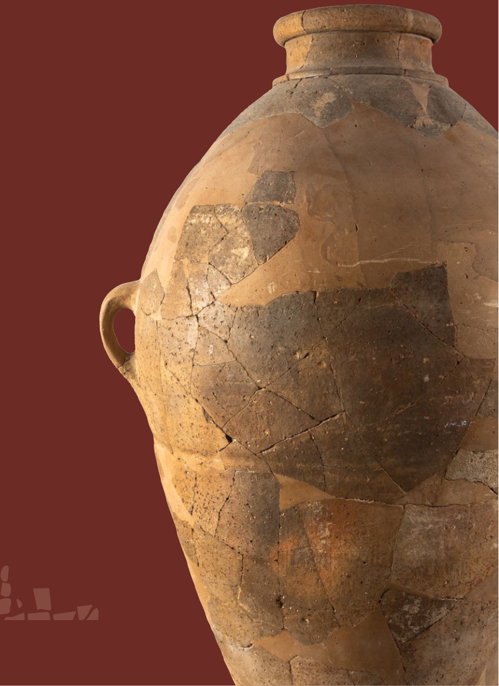

#### From Nomadism _to_ Monarchy? 

###### tel aviv university 

sonia and marco nadler institute of archaeology 

###### **mosaics** | studies on ancient israel 

NO. 3 

|**Executive Editor**|Oded Lipschits|
|---|---|
|**Managing Editor**|Tsipi Kuper-Blau|
|**Editorial Board**|Ran Barkai|
||Yuval Gadot|
||Ido Koch|
||Dafna Langgut|
||Nadav Naʾaman|
||Lidar Sapir-Hen|
||Guy D. Stiebel|
||Deborah Sweeney|
|**English-Language Editor**|Sean Dugaw|
|**Graphic Designer**|Ayelet Gazit|

### From Nomadism _to_ Monarchy? 

Revisiting the Early Iron Age Southern Levant 

_Edited by_ Ido Koch, oded LIpschIts and omer sergI 

_With contributions by_ 

co-published by eisenbrauns | university park, pennsylvania 

and emery and claire yass publications in archaeology | the institute of archaeology, tel aviv university 

###### Mosaics: Studies on Ancient Israel 

_Cover illustration:_ Collared-rim pithos from Tel Megiddo (photo by Sasha Flit, The Institute of Archaeology of Tel Aviv University) 

Library of Congress Cataloging-in-Publication Data 

- Names: Koch, Ido, editor. | Lipschits, Oded, editor. | Sergi, Omer, 1977– editor. 

- Title: From nomadism to monarchy? : revisiting the early Iron Age southern Levant / edited by Ido Koch, Oded Lipschits and Omer Sergi ; with contributions by Eran Arie [and seventeen others]. 

- Description: University Park, Pennsylvania : Eisenbrauns 

   - ; [Tel Aviv, Israel] : Emery and Clare Yass Publications in Archaeology, The Institute of Archaeology, Tel Aviv University, [2023]. 

Summary: “A collection of essays reevaluating the archaeology 

- and history of the early Iron Age Southern Levant and how the period may be reflected in the biblical accounts”— Provided by publisher. 

© Copyright 2023 by the Institute of Archaeology of Tel Aviv University 

All rights reserved Printed in the United States of America 

Eisenbrauns is an imprint of The Pennsylvania State University Press. 

The Pennsylvania State University Press is a member of the Association of University Presses. 

It is the policy of The Pennsylvania State University Press to use acid-free paper. Publications on uncoated stock satisfy the minimum requirements of American National Standard for Information Sciences—Permanence of Paper for Printed Library Material, ANSI Z39.48–1992. 

Identifiers: LCCN 2023030670 | ISBN 9781646022618 (hardback) Subjects: LCSH: Iron age—Middle East. | Excavations 

(Archaeology)—Middle East. | Middle East—Antiquities. Classification: LCC GN780.32.M4 F76 2023 

LC record available at https://lccn.loc.gov/2023030670 

##### **Contents** 

|_Contributors_|vii|
|---|---|
|_Preface_|xi|
|Introduction Ido Koch, oded LIpschIts and omer sergI|1|
|1.  Paleo-environment of the Southern Levant during the Bronze and Iron Ages: The Pollen Evidence dafna Langgut and IsraeL fInKeLsteIn|7|
|2. Animal Subsistence Economy during the Late Bronze–Iron I: Continuity vs. Change LIdar sapIr-hen|29|
|3. From Production Autonomy to Centralization:||
|The Iron I to Iron IIA Transition from a Metallurgical Perspective naama YahaLom-macK|41|
|4. The Northern Coastal Plain during the Early Iron Age (Iron I–Early Iron IIA) gunnar Lehmann|53|
|5. Sixty Years after Aharoni: Iron Age Settlements in the Upper Galilee Ido WachteL|87|
|6. Beyond Hazor: Urban Durability, Political Instability and Collective Memory in the Northern Jordan Valley at the Turn of the Second Millennium BCE assaf KLeIman|101|
|7. Canaanites in a Changing World: The Jezreel Valley during the Iron Age I eran arIe|119|
|8. Transitions between the Late Bronze Age and the Iron Age II: The Character of the Iron I Settlement at Tall Zirāʿa in Northern Jordan dIeter VIeWeger and Katja soennecKen|135|
|9. Iron I Settlements in the Highlands of Samaria and the Creation of Group Identities with an Emphasis on Mount Ebal YuVaL gadot|149|
|10. The Formation of the Israelite Monarchies in Archaeology, History and Historiography omer sergI|159|
|11. Like Frogs out of a Pond: Identity Formation in Early Iron Age Philistia and Beyond aren m. maeIr|201|
|12. Collapse and Regeneration in Late Second Millennium Southwest Canaan Ido Koch|209|

v 

vi 

|13. A False Contrast? On the Possibility of an Early Iron Age Nomadic Monarchy in the Arabah (Early Edom) and Its Implications for the Study of Ancient Israel erez Ben-Yosef|235|
|---|---|
|14. The Book of Josiah or the Book of Joshua? Excavating the Literary History of the Conquest Story cYnthIa edenBurg|263|
|15. The Origin, Function and Disappearance of the Ark of the Covenant according to the Hebrew Bible thomas römer|279|
|16. The Scope of the Pre-Deuteronomistic Saul–David Story Cycle nadaV naʾaman|291|
|17. The Rise of Ancient Israel: The View from 2021 IsraeL fInKeLsteIn|303|
|_Index of Geographic Names_|315|
|_Index of Subjects_|319|
|_Index of Modern Authors_|321|

# 10 

##### **The Formation of the Israelite Monarchies in Archaeology, History and Historiography** 

Omer Sergi 

###### **Introduction** 

The Kingdoms of Israel and Judah are known, first and foremost, from the Hebrew Bible. The story of these kingdoms is recounted in the Books of Samuel and Kings, which, in their current position within the Hebrew Bible, present the advent of the Israelite monarchy as the culmination of a relatively coherent process that began with the ancestral family described in Genesis. According to this narrative, the Israelite monarchy reached its zenith early in its history, when it was a great united monarchy encompassing the territories of both Israel and Judah, and ruled by David and Solomon from Jerusalem. For the greater part of the last two centuries, the United Monarchy of Saul, David and Solomon held an axial position in the historical study of ancient Israel and the Hebrew Bible. The biblical literature was uncritically accepted as a reliable source for the events and circumstances which prevailed during the 10th century 

BCE. Consequently, the historicity of the United Monarchy was taken for granted, and thus became the prism through which all ancient Israelite history was interpreted. The biblical texts were dated according to their own internal chronology, which was likewise applied to any associated archaeological finds. 

It was not until the 1980s and 1990s that doubts began to surface about the historicity of a great united monarchy ruled by David and Solomon from Jerusalem. Scholars initially noted the discrepancy between the vivid depiction of the United Monarchy in Samuel and Kings and the fact that no evidence of it could be found in either the material remains or in extra-biblical sources.1 Ultimately, it was ongoing archaeological research in the Southern Levant that dealt the final blow to the United Monarchy as a historical entity (cf. Finkelstein 2010). It became clear that the Samarian Hills had been significantly more densely populated relative to the regions of Judah and Jerusalem. The former exhibited a rapid accumulation of 

> * This essay is based on a forthcoming monograph (Sergi 2023). I would like to thank Ido Koch, Yuval Gadot and Hannes Bezzel for providing valuable feedback regarding earlier drafts. Maps throughout the chapter were prepared by Itamar Ben-Ezra. 

> 1. E.g., Garbini 1988; Jamieson-Drake 1991; Thompson 1992; Davies 1995. 

160  omer sergi 

wealth, which enabled the development of complex social structure and political centralization before any similar phenomena could be attested in the south (Finkelstein 1995a; 1999; 2003a). The relatively poor remains from early Iron Age Jerusalem stood in marked contrast not only to the depiction of Solomon’s lavish and rich capital (1 Kgs 4, 5:1–25, 9:26–28, 10:18–29), but also to the degree of urbanization and monumentality in contemporaneous northern sites, such as Tel Reḥov, and even more so in contrast to sites in the lowlands to the west of Judah, such as Tel Miqne/Ekron and Tell eṣ-Ṣafi/ Gath. All these factors pointed to the relatively marginal local importance of Jerusalem, and cast doubts on the possibility that it could have functioned as a capital ruling a considerable swath of territory, whether extending to the north or to the west. 

Attempts to dismiss the role of archaeological finds in the reconstruction of the early Israelite monarchy (e.g., Stager 2003; Ben-Yosef 2019), are mostly based on the assumption, that within the mobile-pastoral landscape of the Southern Levant, sociopolitical bonds and the accumulation of economic and political wealth, were not necessarily expressed in material remains. However, the fact is that even in a tribal society, where sociopolitical hierarchies are based on personal alliances (rather than bureaucratic apparatus), the formation of a more centralized power structure would still have been expressed in material remains. Personal bonds and tribal alliances were economically materialized, and thus may be traced in the archaeological record, particularly in the form of exchange and accumulation of wealth. More significant for the current discussion, beginning in the Early Iron IIA, there is clear evidence for public and monumental building activity in Jerusalem (Sergi 2017a; Gadot and Uziel 2017; Mazar 2020a), and even earlier, monumental structures were built in Iron I Shiloh. Both Shiloh and Jerusalem were highland strongholds amongst a relatively tribal and even (to some extent) mobile society (e.g., Finkelstein 1993), yet both exhibited monumental and public architecture, which in turn seems to imply the existence of some centralized form of tribal alliance.  In any event, even if we could agree that David and Solomon might have 

ruled the entire central highlands based solely on personal alliances within a nomadic society, thus leaving little material remains behind, that would have nevertheless been quite modest in contrast to the great United Monarchy portrayed in Samuel and Kings. There is absolutely no evidence for the flow of wealth into Jerusalem as depicted in 1 Kings 3–11, nor any to support the possibility that the Iron IIA Jerusalemite elite could have ruled over the strong urban centers in the lowlands west of Judah, much less those farther away in the northern valleys. This stands in addition to the fact that all the available historical sources (which are admittedly meager) point to the primacy of the Kingdom of Israel as a local power with regional influence, making implausible the notion that Israel was once ruled from the relatively marginal Judah. It was in light of these observations that many drew the conclusion that the United Monarchy must be considered a literary construct with no historical grounds. Biblical scholars soon followed suite, re-evaluating the stories of Saul, David, and Solomon, and emphasizing what seems to be a temporal gap between the reality the stories about Saul, David and Solomon yearn to depict, and the late date at which they were actually composed.2 

Ultimately, neither from an archaeological, historical, nor a biblical perspective, could the traditional view of the great United Monarchy have been maintained. The confluence of multiple streams of evidence inevitably undermined the plausibility of a great early Iron Age kingdom encompassing the territories of both Israel and Judah, but ruled from Jerusalem. Replacing the reconstruction of a great united monarchy with a more gradual and contemporaneous formation of two neighboring kingdoms, fits better with all the available data. Yet, the shift of the United Monarchy from the historical past to the intellectual and literary spheres generated new problems, both historical and literary. If the United Monarchy is not more than a literary fiction, what were the origins of this biblical account? Against what socio-historical background could Judahite scribes in Jerusalem have envisioned the rule of the Davidic Kings over Israel? This is not a mere problem of dating the biblical stories about the United Monarchy, or 

2. E.g., Kratz 2005; Dietrich 2007; Bezzel 2015; Bezzel and Kratz 2021, and further discussion herein. 

the formation of the israelite monarchies   161 

pondering the reality they yearn to depict. Beyond the political unity of Israel and Judah, the stories of the United Monarchy presuppose a common sense of pan-Israelite identity, which provided the social grounding for the political union. 

In order to grasp the origins of any conception of union between Israel and Judah, we should first look into the historical origin of these kingdoms. In the following, I intend to provide a brief overview of state formation in Israel and in Judah, in light of the archaeological remains and textual sources. On this basis, I will reassess the origin of the common sense of Israelite identity, at least as it was expressed in the idea of the United Monarchy formed by Saul and David (1 Sam 9–2 Sam 5). However, before moving on to all that, Israel and Judah should first be contextualized, as these kingdoms did not appear in a vacuum. They emerged at a very specific moment in the history, when many local territorial polities were formed throughout the Levant. Understanding this moment is the first step in any discussion of state formation in Israel and Judah. 

###### **Israel and Judah in Context: The Levant during the Early Iron Age** 

For a short period of time in the early Iron Age (ca. 11th– 8th centuries BCE), the Levant was not ruled by strong external powers as it had been throughout the Late Bronze Age (by Egypt, Mittani, and the Hittite kingdoms), and would be again from the second half of the 8th century BCE (when it was ruled successively by the Assyrian, Babylonian, and Persian empires).  During this hiatus, the sociopolitical organization of the Levant took the form of a network of urban centers with strong maritime economies along the coasts (the “Phoenicians” in the north, and the “Philistines” in the south), together with inland kin-based territorial polities. The inland territorial polities were a new and one-time phenomenon that were formed and maintained in a very particular political landscape. Israel and Judah were part of a much wider 

sociopolitical phenomenon, which encompassed the entire Levant.3 

In the past, it was assumed that these territorial kingdoms were formed by invaders—Hittites/Luwians in northern Syria, Aramaeans in Syria, and Israelites in Canaan, who invaded/migrated into the Levant during the 13th–12th centuries BCE, and brought about the end of the Late Bronze regional system (e.g., Albright 1975).4 However, not only does this theory raise some serious historical difficulties (Bunnens 2000: 15–16), archaeological studies conducted in recent decades highlight continuity in many aspects of the material culture throughout Syria and Canaan.5 This continuity may also be observed in some cultural aspects of the social life, like the use of language or the system of beliefs. Therefore, it is now widely agreed that “the Israelites,” “the Aramaeans” and “the Luwians” were neither invaders nor migrants, and certainly not foreign, but rather they were the indigenous population of the Levant reconfigured by changing social conditions (Sass 2005: 63). 

It was the collapse of the Late Bronze Age hierarchy with its former urban elites that enabled the rise of new elites, which did not necessarily originate in the traditional urban system, but could also have come from marginal groups. State formation in the Iron Age Levant should, therefore, be considered to have been a social transformation, a process during which the ruling elites— who had been associated with the former city-state system and affiliated with the great regional powers—were replaced by a new elite, of differing origins, whose legitimacy was rooted in a different social structure (cf. Routledge 2017: 64–67). 

Past evolutionary approaches to state formation in the ancient Near East assumed a sharp dichotomy between the tribe and the state, the first being more mobile and based on kinship identity, and the latter being more sedentary and based on urban-political identity. Accordingly, state formation was viewed as a process resulting from sedentarization and/or conquest, 

> 3. For recent discussion of the Iron Age Levant, see Porter 2016; Routledge 2017. For the Northern Levant and the Syro-Anatolian sphere, see Osborne 2020. 

> 4. E.g., Albright 1975. 

> 5. E.g., Bunnens 2000; Mazzoni 2000; Bryce 2012: 163–165, 202–209; Sader 2014. For Canaan, see Finkelstein 1988; 2003a; 2003b; Gadot 2017, and further herein. 

162  omer sergi 

which led to the suppression or dissolution of kinship relations, as the “tribe” gave way to the “state.” However, ethnographic studies have indicated that groups organized in a tribal system have typically maintained a flexible way of life, moving between different modes of mobile-pastoralism and village-based agriculture. Hence, there would hardly have been a dichotomy between agriculture and pastoralism, or between sedentary and mobile populations, which could all coexist within the same kinship group (Van der Steen 2004: 102–131; B.W. Porter 2013: 20–37, 69–103). This is not to argue that ancient societies did not consist of groups differentiated by lifestyle, but rather that lifestyle was not the focal point of these groups’ identity. Ancient Near Eastern societies considered themselves to be part of one social family, divided not by mode of life or place of residence, but according to traditional kin associations (cf. Gen. 5–11).6 

In essence, kinship relations were utilized in order to stretch time and space, and to enable the conception of common identity with unknown others (A. Porter 2012: 57–58, 326; B.W. Porter 2013: 56–57). They appear to maintain their essential integrity over long periods of time, as demonstrated by the fact that the ruling elite in early second millennium BCE Mari could maintain their “tribal,” kin-related identity, even when residing in a wealthy urban center (Fleming 2009; A. Porter 2012: 240). Similarly, and closer to the arena dealt with in this essay, the 9th century BCE Mesha Inscription presents Mesha as “king of Moab… the Dibonite.” Knauf (1992) noted that Mesha did not identify himself as a Moabite—with the territorial polity that he formed and ruled—but as a Dibonite, which was most likely his kinship identity, the social group with which he was affiliated (Van der Steen and Smelik 2007). Therefore, there was no evolutionary relationship between the tribe and the state, but rather, as A. Porter (2012: 39–63, 238–240, 326–229) argued, they coexisted as contemporaneous identities. They did not represent two different worlds in which one identity would give way to the other, as kinship remained in essence the dominant relational ideology in Near Eastern societies. 

Rather than bringing about the dissolution of kinship ties, the state contained them, incorporating kin-based communities within a more centralized, sometimes hierarchical, structure. Moreover, as kinship provided the organizing principle for the entire society, both the tribe and the state shared a conceptual unity, within an overarching social order. It was the metaphorical extension of kinship itself that provided the vocabulary needed to conceptualize the ancient Near Eastern state, and in some cases, its administrative structure (Schloen 2001: 69–73). This is well demonstrated by the Samaria Ostraca, which provide a glimpse into the Iron IIB Israelite palace administration, demonstrating the significance of kinship affiliation as a structural element within the relations between the palace and the communities living around it ( _ibid_ .: 155–164; Niemann 2008). Even more significantly, this explains much of the Iron Age Levantine state formation—it was the nature of kinship structure, which enabled the inclusion of different communities and kin-based groups under a relatively centralized rule. 

It is against this background that scholars are in disagreement regarding the exact nature of the Iron Age Levantine territorial polities and how they should be conceptualized, whether as “secondary states” (Knauf 1992; Joffe 2002), “patrimonial states” (Schloen 2001), “tribal states” (Van der Steen 2004; Bienkowski 2009), “segmented states” (Routledge 2004), or “complex chiefdoms” (Pfoh 2008). Naturally, it would be impossible to encompass all the different political formations of the Iron Age Levant in one conclusive term. Each polity had its own patterns and sociopolitical trends and traditions (Routledge 2017: 59–67), as was also the case with Israel and Judah. Beyond that, it is important to remember that in the eyes of their own elites, these territorial polities were often strictly “kingdoms,” whose rulers were called “kings.” Hence, all of the various terms utilized by scholars attempting to better express the nature of Levantine kingdoms, are aiming to highlight a common structural element—their fragmented nature, and ultimately, their rootedness in an overarching concept of kinship. 

6. A. Porter 2012: 12–37, with further literature. 

the formation of the israelite monarchies   163 

###### **On Israel and Its Origins in Light of Textual Sources** 

The earliest mention of Israel appeared in the wellknown Merneptah inscription, a Nineteenth Dynasty king of Egypt, which is otherwise known as the “Israel Stele” (ca. 1207 BCE). Israel is mentioned within a formulaic hymn, praising the victories of Merneptah in Canaan, which was placed at the end of a much longer annalistic review of his victories in Libya (Kitchen 2004). Throughout the history of research there have been many attempts to undermine this evidence as an attestation to any kind of Israel that could be associated with the biblical or historical one. Yet, the vast majority of scholars agree, that despite of the formulaic nature of the hymn, which blurs the exact nature and location of the “Israel” it refers to, it is beyond doubt that it refers to a group of people named Israel, who lived somewhere in Late Bronze Age Canaan.7 

Before the appearance of the name “Israel” three other place-names are mentioned—Ashkelon, Gezer, and Yenoʿam. These place names are given the throw-stick determinative for “foreign” entity, and the three hills sign for foreign territory, and could thus be read “the land of Ashkelon/Gezer/Yenoʿam.” This formula represents the so-called “city-state” system, in which strong and wealthy families based in urban centers ruled their immediate rural hinterlands.8 In contrast, “Israel” is also determined with the throw-stick of foreigners, plus here the man + woman over plural strokes, which (as in numerous other examples) indicates a people/group (Hasel 1994: 51–52). Therefore, as far as Merneptah’s soldiers, record-keepers, and the stele’s scribe and engraver were concerned, this “Israel” was a people/group in Canaan (Kitchen 2004: 271–272). 

Many scholars have somehow concluded that Israel of the Merneptah Stele should be located in the Samarian Hills (Fig. 10.1), the location of pre-monarchic Israel 

according to Judges–Samuel, and the core territory of the kingdom that bore the same name. However, the hymn gives no indication regarding the location of Israel. The locations of Ashkelon and Gezer are well known, and accordingly the hymn implies a southwest–northeast movement. The location of Yenoʿam is a matter of dispute, but all scholars identify it somewhere along the central Jordan Valley between the Sea of Galilee in the north and the Beth-Shean Valley to the south (Naʾaman 1977). However, this gives no indication that the location of Israel was in the Samarian Hills, though the possibility cannot be ruled out. 

Throughout the LB II–III Beth-Shean was an Egyptian garrison town, a regional Egyptian administrative and military center in Canaan (Naʾaman 1981; 1988; Mazar 2011). It is thus not surprising that the Egyptians had their “eyes and ears” in this region. Interestingly enough, the second Stele of Sethi I, found at Tel Beth-Shean and dated a century before the Merneptah Stele, provides another glimpse of the sociopolitical organization of the area before the Egyptian withdrawal. It narrates the victory of the king over some “rebellious” groups in the Lower Galilee, and in the vicinity of the Beth-Shean Valley. These groups are portrayed as follows: “the ʿApiru of the mountains of Yarmutu (probably the Lower Galilee), along with the Tayaru (folk) are arisen, attacking the Asiatic Ruhma.”9 The ʿApiru are given the armed man determinative, while the Tayaru are referred to as a people/group. Therefore, it seems that according to both the Israel Stele and the Stele of Sethi I, the region of Beth-Shean and the highlands to its west and east were inhabited by groups, whether sedentary or not, who were not affiliated with any citystate polity, and who occasionally drew Egyptian attention. More than an attestation to the exact location of Israel, its mention in the Stele commissioned by Merneptah, seen in the overall context of Egyptian domination in Late Bronze Age Canaan, reflects Egyptian interests in the Beth-Shean Valley and its vicinity, and the fact that the Egyptians had 

> 7. Kitchen (2004) persuasively rejected recent criticism, but see also Hasel 1994; 1998: 178–193; Morris 2005: 376–381; Morenz 2008; Nestor 2010: 179. Against the attempt of Ahlström and Edelman (1985) to argue that “Israel” refers to a geographical region, see Hasel 1994: 47–51; Morenz 2008: 3–9. For history of research, see Nestor 2010: 179–87. 

> 8. Similar rendering may also be found in the slightly earlier (mid-14th century BCE) el-Amarna correspondence, which refer to the political entities in Late Bronze Age Canaan as KUR.URU + (place name), namely, “the land of the city of (place name),” and see further discussion in Benz 2016: 81–110. For a recent publication and translation of the el-Amarna letters, see Rainey, Schniedewind and Cochavi-Rainey 2015. 

> 9. Translation follows Hallo and Younger 2003: 27–28. 

164  omer sergi 

a hard time controlling it due to the various kin-based groups inhabiting it. The social unrest in Late Bronze II– III northern Canaan reflected in the Egyptian sources,10 contextualizes the early appearance of Israel and thus also clarifies the way it was conceived of by the Egyptians. Apparently, “Israel” was only one of various groups with a strong mobile identity, who were an integral part of the Canaanite social fabric despite not being connected to any specific urban center. Thus, if the Merneptah inscription says anything about the identity of Israel, it testifies to its kin-based association. 

The next time the name Israel appears again in textual sources, ca. 350 years later, it refers to the polity ruled by the Omride Dynasty—in the Assyrian Kurkh Monolith, in the Mesha Inscription, and in the Tel Dan Stele.11 In the Assyrian Kurkh Monolith (852 BCE), the name Israel is applied to Ahab (the king of Israel according to 1 Kgs 16:29), who is identified as an “Israelite,” while his father, Omri, and his son and heir, Joram, are each identified in the contemporaneous Mesha Inscription and the Tel Dan Stele (respectively) as “King of Israel.” Israel, accordingly, was understood as a polity, but it is impossible to define the nature of this polity, besides the fact that it was ruled by a single monarch at each point in time, in what appears to have been a hereditary system. The usage on the Assyrian Kurkh Monolith appears to indicate a preservation of the association between the name Israel and a kinship group. If so, there is more in common between the occurrences of the name “Israel” in the late 13th century and the mid-9th century BCE than is usually acknowledged. In both cases it was located in Canaan, or even in northern Canaan specifically, and in both cases the name was associated with a kin-based identity, even when it was simultaneously utilized to designate a monarchic polity. 

To be sure, there is no clear-cut distinction between Israel on the Merneptah Stele and Israel in the Iron IIA inscriptions. The name “Israel” in the phrase “king of Israel,” as it appears in both the Mesha Inscription and the Tel Dan Stele, does not specify what exactly this Israel was, but only that it was ruled by a king. In light 

of the fact that within the same period another king from the same dynasty, Ahab, is referred to as an “Israelite,” it may well have been that Israel was still the name of a kinship group, even if by the 9th century BCE its usage extended well beyond the group which the scribes of Merneptah identified as Israel 350 years earlier. After all, the Kingdom of Israel never had fixed borders, and so the name could hardly refer to a geographical region alone. It is exactly this fact—the kinship association of Israel—which provided the flexibility and fluidity between kin as a social identity and kin as a political identity. It was the kinship social structure that legitimized and normalized the alliance of different kin-based groups under a more inclusive definition of Israel, as may be seen, for instance, in the Song of Deborah in Judges 5, where Israel is presented as a tribal alliance.12 Within the historical framework of state formation in the early Iron Age Levant, forming kin-based polities brought with it the construction of more encompassing kinship identities, applied to different groups which were clustered beneath a ruling family. Hence, the name Israel in the 9th century BCE denoted a much more complex sociopolitical entity than the Israel of the late 13th century BCE, and yet, they both share the same fundamental underlying conceptualization of Israel as a kin-based group. 

The name Israel disappears, however, from the textual records after the second half of the 9th century BCE. Assyrian inscriptions from the 8th century BCE refer to the Kingdom of Israel by the name of its capital (Samaria), and then later in the inscriptions of Tiglathpileser III, as the “House of Omri.” Therefore, it appears that in extra-biblical sources, the name Israel was exclusively identified with the Omrides, and thus it is reasonable to believe that Israel was the kinship group which the Omrides were affiliated with, and by which they identified themselves. The size, extent, and exact nature of this kin-based group are relatively unknown, at least when relying exclusively on extrabiblical evidence. 

10. See also the el-Amarna correspondence EA 246, 250, 255 and 256.. 11. For some general discussion of these sources, see Weippert 2010: 242–248, 252–253. 

12. Cf. Groß 2009: 344–349; Wright 2011a; 2011b; Fleming 2012:63–66; Blum 2020. 

the formation of the israelite monarchies   165 

###### **Setting the Scene: The Iron I in the Highlands and the Lowlands of Canaan** 

The central Canaanite Highlands (Fig. 10.1) consist of a mountain range that stretches from the Jezreel Valley in the north to the more arid desert of the Beersheba and Arad Valleys in the south. To the west of the Highlands lies the Coastal Plain; to the southwest, the hills of the Judean Lowlands (hereafter, the Shephelah) stand between the Highlands and the coast; to the east lies the Jordan Valley and the Dead Sea, which despite their arid climate, were relatively amenable for habitation due to numerous springs and seasonal river beds. The central Canaanite Highlands may be divided into two major geographical units—the Samarian Hills to the north and the Judean Hills to the south—each of which may be further divided into two subunits. The Samarian Hills stretch from the Jezreel Valley in the north to the highlands of Shiloh-Bethel in the south, and constitute the most habitable area in the central Canaanite Highlands. Its northern part, north of Shechem, is characterized by broad valleys separated by mountain-ridges, while the region south of Shechem is characterized by a hillier terrain with narrow valleys crossing it. To the south, the Judean Hills, between Jerusalem and the Beersheba Valley, have desert on their eastern and southern slopes. The central range is relatively flat, but rocky and steep on its western flank. The area north of Jerusalem, the Benjamin Plateau between Jerusalem and Bethel, is relatively amenable to habitation, and hence forms an intermediate zone between the more hospitable Samarian Hills to the north and the less amenable Judean Hills to the south (Finkelstein 1995a: 353). 

The hilly terrain between Shechem and Jerusalem was only sparsely settled throughout the Late Bronze Age, while most of the sedentary population was concentrated north of Jerusalem, primarily in the region of Shechem (Finkelstein 1995a: 360–361; 1996: 206–209). A major change occurred in the Iron I, when for the first time since the Middle Bronze Age, the region became densely sedentarized. Hundreds of small rural sites appeared 

during this period, clustered in geographical locales (Fig. 10.2), which largely corresponded to the four topographical niches on the central highlands: 1) In northern Samaria, between Shechem and the Jezreel valley; 2) In southern Samaria, between Bethel and Shechem; 3) On the Benjamin Plateau, between Bethel and Jerusalem; and 4) In the Judean Hills, between Hebron in the south, and Beth-Zur (identified with Khirbet at-Tubeqa) in the north, but still some 20 km south of Jerusalem.13 

The settlement pattern, the architectural layout, and the typical ceramic assemblage of the newly sedentarized Iron I population reflect an agro-pastoral subsistence economy, revealing their mobile-pastoral background.14 I have recently discussed this settlement wave in detail (Sergi 2019a; 2019b), which there is no need to repeat here. For the purpose of this essay, it is important to note that there are no textual sources that shed any light on the social or political identity of the Iron I highland population. The Merneptah Stele, previously discussed, dates to the late 13th century BCE, prior to the massive sedentarization of the highlands. Its importance lies in the fact that it attests to the strong kinship association of Israel. As previously noted, Israel was most likely the kinship identity of the Omrides. If in fact their home was in the region of Samaria (Sergi and Gadot 2017:105–106, 109), it may be argued that at least some of the mobile and sedentarized population in this region were affiliated with a kinship group named Israel. The size, extent and exact nature of this group are relatively unknown, and while we can say with a degree of certainty that at least some of the settlers in northern Samaria were affiliated with a kinship group named “Israel,” that does not mean that other communities, located in other regions, could not have been affiliated, in one way or another, with the Israelite kinship group. 

As has been recently pointed out by Gadot (2017), the massive sedentarization in the central Canaanite Highlands during the Iron I should be seen in tandem with the growing urbanism of this period. The Iron I urban system in the Southern Levant indicates that while 

> 13. For recent discussion, see Gadot 2017; Sergi 2019a: 209–221, with references to previous surveys and excavations. For Benjamin and the south, see also Sergi 2017a. 

> 14. Finkelstein 1988; 1995a; 1996, and cf. Shahack-Gross and Finkelstein 2008; 2015. For Transjordan, see Van der Steen 2004; B.W. Porter 2013. 

166  omer sergi 

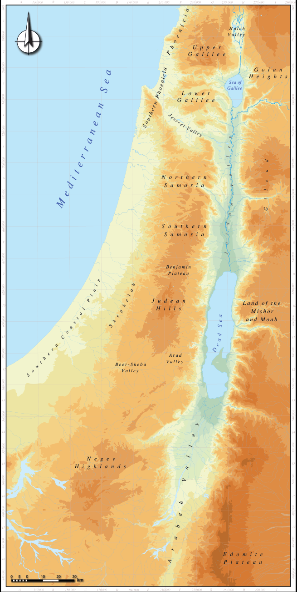

<!-- Start of picture text -->
A 130 000 B 150 000 C 170 000 D 190 000 E 210 000 F 230 000 G 250 000 H 270 000 I 290 000 1 1 H u l e h V a l l e y 2 GUa pl pi le er e 2 G o l a n H e i g h t s 3 Galilee Sea of 3 L o w e r G a l i l e e 4 4 5 5 6 N o r t h e r n 6 S a m a r i a 7 7 S o u t h e r n S a m a r i a 8 8 B e n j a m i n 9 P l a t e a u 9 10 J Hu id le l as n L a n d o f t h e M i s h o r 10 a n d M o a b 11 11  A r a d  B e e r - S h e b a V a l l e y 12 V a l l e y 12 13 13 14 14 15 H i  Ng he lg ae nv d s 15 16 16 17 17 E d o m i t e 18 P l a t e a u 18 0 5 0 10 20 30 km A 130 000 B 150 000 C 170 000 D 190 000 E 210 000 F 230 000 G 250 000 H 270 000 I l l e y V a ee l J e z r u o S r e h t o C n t s a e h S l a p P D h P e h d e M a l  u t S o e e o e t i a l  r h e i i n a r r P n n h c a e n h o y i e n S n A e r a i c a a e l b a l d a a i a y V n a e h d r a d a e l i G J 800 800 000 000 780 780 000 000 760 760 000 000 740 740 000 000 720 720 000 000 700 700 000 000 680 680 000 000 660 660 000 000 640 640 000 000 620 620 000 000 600 600 000 000 580 580 000 000 560 560 000 000 540 540 000 000 520 520 000 000 500 500 000 000 480 480 000 000 460 460 000 000 440 440 o e S l l V a <!-- End of picture text -->

**Fig. 10.1:** Geographic subdivisions of the Southern Levant 

the formation of the israelite monarchies   167 

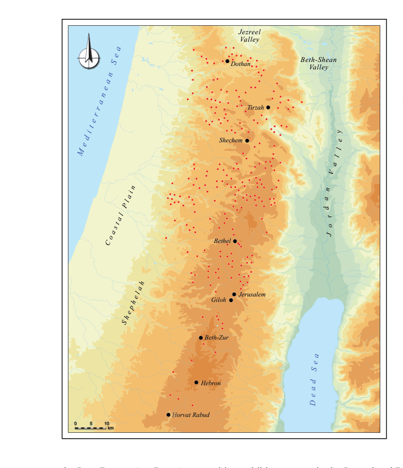

<!-- Start of picture text -->
Jezreel Valley Beth-Shean Dothan Valley Tirzah Shechem Bethel Jerusalem Giloh Beth-Zur Hebron Ḥorvat Rabud 0 5 10 km  a  l P l  a  t  s a  o C  h  a  l  e h e p  h S i n r r e t i d e M S n a e n a l a a e V l n a o J e S a d a e D y e d r <!-- End of picture text -->

**Fig. 10.2:** Iron I settlement in the central Canaanite Highlands 

in the Jezreel and Beth-Shean Valleys and the adjacent northern Samarian Hills, the same urban system that had dominated the landscape throughout the Late Bronze Age and under Egyptian rule, was maintained into the Iron I, exhibiting urban and cultural continuity: Tel Megiddo was the prominent urban center in the western Jezreel Valley (along with a lesser center at Tel Yoqneʿam to its north);16 Shechem had been the main highland stronghold in northern Samaria since the 

the Late Bronze Age/Iron Age transition exhibits some changes in the balance of urban power (subsequently discussed herein), the basic social structure, based upon ruling families situated in urban centers, changed very little, both in the north and in the south. In the Ḥula Valley (Fig. 10.3), following the destruction of LB II Tel Hazor, which dominated the region throughout most of the 2nd millennium BCE, new urban centers emerged during the Iron I at Tel Kinrot and Tel Abel Beth-Maacah.15 However, 

> 15. See Sergi and Kleiman 2018; Yahalom-Mack, Panitz-Cohen and Mullins 2018; Kleiman, this volume. 

> 16. For Iron I Tel Megiddo (Stratum VIA) and its destruction, see Arie, this volume; Finkelstein 2003c; 2013: 27–32; Ussishkin 2018: 281–315. For Megiddo during the Early Iron IIA (Stratum VB), see Ussishkin 2018: 317–318. 

168  omer sergi 

MB II,17 while Tel Reḥov was the main urban center in the Beth-Shean Valley (Mazar 2020b). Despite the Iron I settlement wave in the Samarian Hills, the urban power structure in this region and the adjacent valleys (The Jezreel and Beth-Shean Valleys) was maintained along the same lines as it had been previously in the Late Bronze Age and under Egyptian rule. 

This situation only came to an end in the late Iron I (early to mid-10th century BCE) with severe destructions inflicted upon all the urban centers in the Samarian Hills (Shechem, Tel Shiloh, Tel Dothan) and the northern valleys (Tel Megiddo, Tel Yoqneʿam, Tel Kinrot, Tel Abel Beth-Maacah).18 After which, no other urban center rose to power in the northern valleys until almost a century later, indicating a complete break with the former social and political hierarchies, and thus marking the termination of the inherited Late Bronze Age political system in the north. This was true for all the northern valleys with the exception of the Beth-Shean Valley, where Tel Reḥov retained its urban prosperity during the transition from the Iron I to the Iron IIA.19 The persistence of Tel Reḥov implies that the Late Bronze Age political structure continued in this region even under Israelite rule. In the south of Canaan, the Egyptian withdrawal brought with it not only changes in the urban power-balance, but also innovations in the material culture (Koch 2021), which will be further discussed subsequently. 

###### **The Iron IIA in the North and the Formation of Israel: Archaeology and Text** 

By the early 9th century BCE, the Omride family ruled vast territories from their seat in Samaria, which included the northern valleys, the Samarian Hills and portions of central Transjordan. Their power and wealth enabled them to exercise political hegemony far beyond their borders 

and thus to be counted among the most powerful rulers in the Southern Levant, a fact that may be deduced from extra-biblical sources alone. The Omride Kingdom has been well identified archaeologically (Fig 10.4): the palace in Samaria (Building Period I), and the contemporaneous royal compound in Late Iron IIA Tel Jezreel, are exclusively identified with the Omrides’ building projects; the contemporary palatial town at Tel Megiddo (Stratum VA– IVB), the two small fortified towns at Tel Yoqneʿam (Stratum XIV) and Tel Hazor (Stratum IX)20 , together with the prosperous urban center at Tel Reḥov (Stratum IV) are likewise associated with the Omride polity by the vast majority of scholars.21 These urban and royal centers attest to the power and wealth of the Omrides from Samaria. They may also illuminate the variety of means by which they integrated the different regions and communities under their rule (Sergi and Gadot 2017).  In spite of all this, the span of Omride rule was relatively brief, lasting only two or three generations (ca. 40 years). It is clear, therefore, that their achievements could not have been realized in such a short period of time, if they had not been built upon pre-existing sociopolitical networks. 

The point of departure for discussing the formation of the Omride polity, is in the complete destruction of Canaanite urban culture by the end of the Iron I, as previously discussed. The fact that the Samarian Hills and the Jezreel Valley were left throughout the Early Iron IIA with no urban center only highlights the magnitude of the social change. The collapse of former sociopolitical systems provided a rare opportunity for marginal groups to seize upon new economic strategies, and to reconfigure local power structures. This point is well demonstrated by the archaeological data. It took almost one hundred years from the destruction of Shechem—the main urban center in the Samarian Hills throughout the 2nd millennium BCE—until a new urban center emerged in the region, first, and only for a short time at Tell el-Farʿah (N), 

> 17. Following a short hiatus during the LB I (Campbell 2002: 185–88), Shechem had been restored by the LB II (Campbell 2002: 169–233). For the LB–Iron I continuity, see Campbell 2002: 210–233; Finkelstein 2006a. 

> 18. Finkelstein 1993; Master _et al._ 2005; Finkelstein 2013: 13–36; Sergi and Kleiman 2018; and Chapters 6–7, this volume. 

> 19. For the remarkable persistence of Tel Reḥov as a prosperous urban center throughout the LB I–Iron IIA, see also Mazar 2020b. 

> 20. For a different view of Hazor X–IX, see Ben-Tor 2016: 132–145. Ben-Tor identified  Hazor with the reign of Solomon, however, the assemblage from Levels X–IX is associated with the Late Iron IIA, which is well-dated to the 9th century BCE; see also Lee, Bronk-Ramsey and Mazar 2013; Toffolo _et al_ . 2014. 

> 21. Finkelstein 2000; Herzog and Singer-Avitz 2006; Niemann 2006; Finkelstein 2013: 83–105; Sergi and Gadot 2017; Mazar 2020b. 

the formation of the israelite monarchies   169 

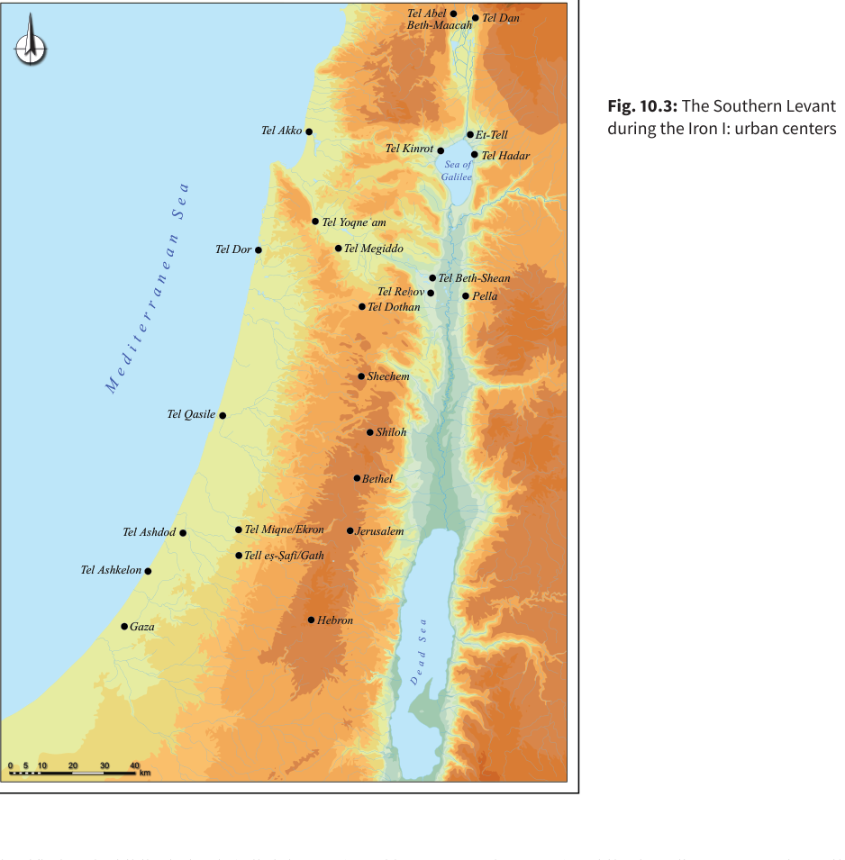

<!-- Start of picture text -->
Tel Abel Tel Dan Beth-Maacah Fig. 10.3:  The Southern Levant Tel Akko Et-Tell during the Iron I: urban centers Tel Kinrot Tel Hadar Sea of Galilee Tel Yoqneʿam Tel Dor Tel Megiddo Tel Beth-Shean Tel Reḥov Pella Tel Dothan Shechem Tel Qasile Shiloh Bethel Tel Ashdod Tel Miqne/Ekron Jerusalem Tell eṣ-Ṣafi/Gath Tel Ashkelon Hebron Gaza 0 5 10 20 30 40 km e M DD t i d r r e e n a a e n e e S a a a dd a e S a e S <!-- End of picture text -->

identified as the biblical Tirzah (Albright 1925), and later in Samaria, the capital of Omride Israel. The transition of power from the long enduring center in Shechem to sites that had no preceding urban or royal tradition, and the instability that characterizes such a transition of power among neighboring sites, demonstrate the formative nature of the period. 

Tel Reḥov (Stratum VI) was the only urban center in the northern valleys that survived the Iron I/IIA transition, and continued to flourish in the Early Iron IIA (Mazar 

2020b: 85–86), while the adjacent Samarian Hills and Jezreel Valley remained devoid of any urban or political center. Tel Reḥov (Stratum V) had maintained its urban prosperity into the beginning of the Late Iron IIA,22 and it was only then, in the late 10th–early 9th centuries BCE, that the recovery of the valleys’ urban system began (Finkelstein and Kleiman 2019): early signs of monumental architecture appeared at Tel Megiddo (Level Q5) in the Jezreel Valley; a fortified town was erected on the upper mound of Tel Hazor (Stratum X) in the Ḥula Valley; and 

22. For Tel Reḥov Stratum V–IV (the Late Iron IIA town), see Mazar 2020b: 91–113. 

170  omer sergi 

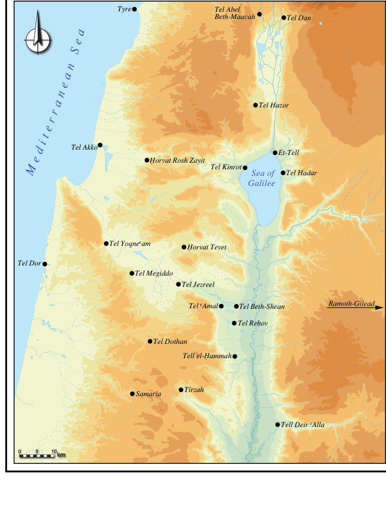

<!-- Start of picture text -->
Tyre Tel Abel Beth-Maacah Tel Dan Tel Hazor Tel Akko Et-Tell îorvat Rosh Zayit Tel Kinrot Sea of Tel Hadar Galilee Tel Yoqne>am îorvat Tevet Tel Dor Tel Megiddo Tel Jezreel Tel >Amal Tel Beth-Shean Ramoth-Gilead Tel Reúov Tel Dothan Tell el-îammah Tirzah Samaria Tell Deir >Alla 0 5 10km  r e  t  i  d  e M  n  a  e  n  a r  a  e S <!-- End of picture text -->

**Fig. 10.4:** Northern Canaan during the Iron I–IIA 

a new urban center emerged at Tell el-Farʿah (N)/Tirzah (Stratum VIIb) in northeast Samaria (Fig. 10.4). The latter rapidly developed from a poor settlement in Stratum VIIa to a rich urban center in Stratum VIIb (Kleiman 2018). 

the reign of Baasha. This conclusion is certainly plausible, and there should be little doubt that the urban revitalization in the north was associated with the early beginnings of the Kingdom of Israel. It nevertheless must be admitted, that the identification of Tirzah as the center of the polity is based solely on the biblical text. From a strictly archaeological point of view, the entire urban system, which Finkelstein and Kleiman attribute to the polity of Baasha, evolved in the early phases of the Late Iron IIA around the already existing and prosperous urban center at Tel Reḥov (Stratum V).23 Since Tel Reḥov and Tirzah 

According to Kings (1 Kgs 15:33; 16:8–9,16–18) Tirzah was the capital of Baasha, who ruled Israel before the Omrides. Accordingly, Finkelstein and Kleiman (2019) have argued that the contemporary urban growth in Tirzah (Stratum VIIb) and in the northern valleys (Tel Megiddo Level Q5, Tel Hazor X, Tel Reḥov V, Tirzah VIIb) was associated with the Kingdom of Israel during 

> 23. Late Iron IIA Tel Reḥov (Strata V–IV) exhibits extraordinary wealth and prosperity, with evidence of specialized industries (apiary culture that was exclusively associated with Stratum V, textile production), evidence of trade networks that spanned the entire eastern Mediterranean, a rich cultic assemblage and other aspects of conspicuous consumption. For an overview with historical discussion, see Mazar 2020b: 86–128, with further literature. 

the formation of the israelite monarchies   171 

are situated less than a day’s walk from each other, at two ends of a road connecting the Samarian Hills with the Beth-Shean Valley, it is only reasonable to assume that the rulers of Tirzah were, in one way or another, related to the rulers of Tel Reḥov. Moreover, viewed from this perspective, the sudden emergence of urban prosperity in Tirzah during the late 10th early 9th centuries BCE looks more like an expansion, or an offshoot, of the long enduring urban prosperity at Tel Reḥov. Tirzah was destroyed, however, shortly after its emergence as a ruling center, and the power balance shifted again, when a lavish palatial compound was built on the Samaria hilltop on what had previously been an agricultural estate with no former urban or monumental traditions.24 

The construction of the palace at Samaria was accompanied by further urban development in the Jezreel Valley as palaces and a royal compound were likewise built at the western (Tel Megiddo VA–IVB) and eastern (Tel Jezreel) ends of the valley (respectively), thus marking it as a single political unit (Sergi and Gadot 2017).25 No such building activity has been detected further to the north, in the Ḥula Valley, where Tel Hazor IX retained its fort-like character, which dated back to the very beginning of the Late Iron IIA. Similarly, so far, no building activity that may be associated with the Omrides has been discovered in the Beth-Shean Valley, where Tel Reḥov IV maintained its status and role since the Late Bronze Age as the seat of the local ruling elite. In spite of that, attempts to argue that Tel Reḥov V–IV and the Beth-Shean Valley were not integrated into the Omride polity (e.g., Finkelstein 2016; Arie 2017), are difficult to accept (Mazar 2016: 115–116; Kleiman 2017: 366–369; Mazar 2020b: 124–126). If the Omrides ruled the Jezreel Valley west of the Beth-Shean Valley, and fought in the Gilead east of it (2 Kgs 8:28–29, 9:14–15), it is hard to imagine that the territory in between was ruled by some local elites, who were hostile/not-loyal to the Omrides. Furthermore, a large number of hippo jars (Kleiman 2017) and cylindrical holemouth jars (Butcher 2020; Butcher _et al._ 2022)—both of which were 

exclusively associated with early monarchic Israel and were probably utilized is some centralized administrative system—were found not only at Tel Reḥov V–IV, but also in Tel Megiddo Q5–Q4, Tel Jezreel and Tel Dothan. Lastly, epigraphic finds indicate that one of the prominent families in Israel, the Nimshides, who eventually usurped the Omride throne, were connected with Tel Reḥov and the Beth-Shean Valley (Aḥituv and Mazar 2014). In light of all these factors, and when considering the fragmented nature of Levantine polities, this was probably a classic case of “palace-clan” relations: Even if Tel Reḥov was in some way self-governed, as may be suggested by its long durability since the LB I, it is most likely that its rulers had come to accept Omride overlordship. 

That Tel Reḥov played a prominent role in the political formation characterizing the region during the Iron IIA is clear from the fact that Tel Reḥov endured and maintained its material wealth in a period of social and political upheavals. This, in turn, made it a stable and strong component in the sociopolitical network upon which early monarchic Israel was eventually established. As Tel Reḥov was the only enduring political entity in the northern valleys, it had to be incorporated first into the polity centered around Tirzah, and then later into the one ruled from Samaria. This is enough to suggest some sort of patronage relationship between the urban elite in Tel Reḥov and the highland seats in Tirzah and Samaria. Furthermore, it may even be argued that the patronage relationship established between groups in northern Samaria and in the Beth-Shean Valley were central to the formation and maintenance of political hegemony in these regions. This point is mirrored by the available textual sources, in this case, the Israelite kings list embedded in 1 Kings 15–16, as well as some contemporaneous epigraphic finds. 

According to the Book of Kings, Baasha, son of Ahiah, who ruled Israel from Tirzah, was from the “House of Issachar” (1 Kgs 15:27–28). The tribal allotment of Issachar was located in the eastern parts of the Jezreel Valley (Josh 19:18–23; Judg 5:16), and it may well have been that Baasha originated in a clan that was also (but perhaps not exclusively) situated in the eastern Jezreel/ 

> 24. For the palace at Samaria during Building Period I, see Franklin 2004; Sergi and Gadot 2017: 105–106; Niemann 2011, _contra_ Ussishkin 2007; Finkelstein 2011a. 

> 25. For palatial Megiddo (Strata VA–IVB) see also Ussishkin 2018: 333–362. 

172  omer sergi 

Beth-Shean Valleys. According to 1 Kings 16:16–18, Omri served as the commander of Baasha’s army. This piece of information may provide further insights regarding the nature of patronage relations in Baasha’s polity: It was based on the alliance between ruling families in northern Samaria (the Omrides) and ruling families in the eastern Jezreel–Beth-Shean valleys (Baasha of the House of Issachar). Baasha of the House of Issachar was the patron to whom the Omrides from Samaria were loyal and to whom they owed military service. 

Similar patronage relations were also maintained during the reign of the Omrides: Following the murder of Baasha’s son and heir in Tirzah (1 Kgs 16:9–10), Omri was elected (by the army he led under Baasha) to rule Israel as Baasha’s successor (1 Kgs 16:16–22). Omri established his power base at Samaria, probably his family’s possession, and managed to found a dynasty that ruled for three generations. However, the Omride family was supplanted by their own military commander, Jehu son of Nimshi (2 Kgs 9–10). As the aforementioned epigraphic finds may indicate, the Nimshi family originated (or at least owned lands) in the Beth-Shean Valley, and probably even had a residence in Tel Reḥov (Naʾaman 2008: 214; Mazar 2020b: 125–126). Hence, just as previously Baasha, who had a connection to the eastern valleys, was the patron to whom the Omride family was loyal and to whom they provided military service; so were the Omrides of Samaria, the patrons to whom the Nimshide family from the eastern valleys owed loyalty and military service. Accordingly, the possibility that Baasha and the Nimshides were actually affiliated with the same family/clan, as has been suggested by Naʾaman (2008; 2016a), should also be considered. 

Both material remains and textual sources highlight the crucial role played by the valleys’ urban system and local clans in the formation of the Kingdom of Israel, whether it is the enduring role of Tel Reḥov within the emerging urban systems around it, or the epigraphic and the biblical sources implying the alliance of the Omrides with Baasha/the Nimshides. Either way, all the available data points to the fact that the relations between ruling elites in northern Samaria and ruling elites in the 

northeastern valleys provided the platform, upon which the early Israelite monarchy was established. This conclusion underscores the significance of the BethShean Valley, and especially Tel Reḥov, in the formation of early monarchic Israel, which is too often thought to have originated exclusively in the highlands. 

One last important point should be stressed against this background: It is clear that the sociopolitical formation of early monarchic Israel was rooted exclusively in northern Samaria and the northern Valleys. The accumulation of wealth, social hierarchy, and political formations, as they appear in the archaeological record, are limited to these regions and have not been detected anywhere south of Shechem. Thus, for instance, from the beginning of the Late Iron IIA, evidence exists for some kind of an Israelite administrative system meant to control the redistribution of wealth from/to the northern valleys (Kleiman 2017; Sergi _et al._ 2021; Butcher _et al_ . 2022). Yet there is no evidence for the utilization of this system anywhere south of Tirzah/Samaria. In fact, following the destruction of Shiloh by the mid-Iron I (ca. 1050 BCE) there was no other urban center in the Samarian Hills south of Tirzah/Samaria. Therefore, it seems that the social configuration in northern Samaria and the Jezreel–Beth-Shean Valleys during the Iron IIA had almost no impact on the southern Samarian Hills or the region of Benjamin and Jerusalem further to the south. The latter followed a completely distinct course of sociopolitical development. 

###### **The Iron IIA in the South and the Formation of Judah: Early Beginnings in the Region of Jerusalem and the Benjamin Plateau** 

Jerusalem is located to the immediate south of the Benjamin Plateau and north of the point where the Judean Hills rise. Some massive stone and earth works attributed to the MB II–III (De Groot 2012: 144–149; Regev _et al._ 2021) indicate that during this period Jerusalem was likely the center of a small local highland polity (Maeir 2011; Greenberg 2019: 236–243). The el-Amarna correspondence confirms the existence of such a polity, at least in the LB IIA (Naʾaman 1996a; 2011).26 Hence, 

26. For a recent evaluation of Late Bronze Age Jerusalem, see Uziel, Baruch and Szanton 2019. 

the formation of the israelite monarchies   173 

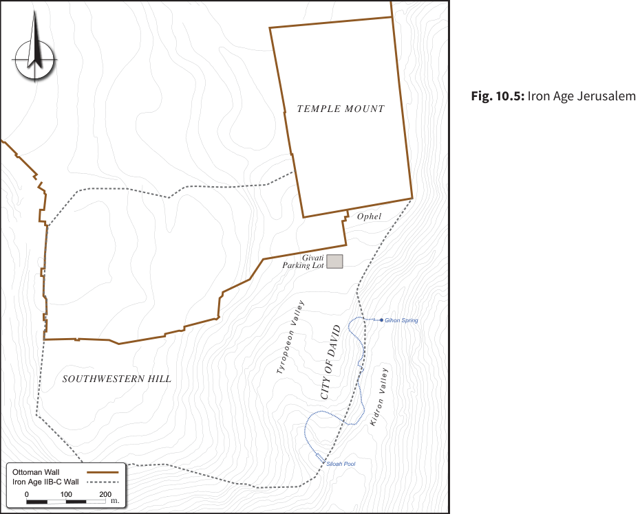

<!-- Start of picture text -->
Fig. 10.5:  Iron Age Jerusalem TEMPLE MOUNT Ophel Givati Parking Lot Gihon Spring SOUTHWESTERN HILL Siloah Pool Ottoman Wall Iron Age IIB-C Wall 0 100 200 m. K i d r  y a l l e o V  n  o  e  o  p Ty r o n VID A V D F O Y CIT  l la e y <!-- End of picture text -->

it is not far-fetched to assume that throughout most of the second millennium BCE, Jerusalem was the seat of a local ruling elite, whose patronage network could not have extended much beyond its immediate vicinity (Lipschits 2020: 163–164). This, apparently, did not change much with the transition to the Iron Age. Unlike Shechem, its northern neighbor throughout the second millennium BCE, Jerusalem continued to function as the seat of a ruling elite in the Iron Age, exhibiting further urban development, which reached its zenith in the Iron IIB. This stands in marked contrast to the sociopolitical developments in northern Samaria as previously detailed. The more arid and less populated region around Jerusalem 

had, apparently, its own rhythm, which brought about different trajectories for the formation of the Judahite polity. 

Monumental architecture in the City of David appeared—for the first time since the Middle Bronze Age—only in the early Iron Age, with the construction of the “Stepped Stone Structure” on the eastern slope of the ridge, west of the Gihon Spring (Fig. 10.5). The structure was meant to support the slope and to enable the construction of buildings—probably of a public nature—on the summit of the ridge above it.27 It is almost unanimously agreed that at least the foundations of this structure, comprised of stone terraces (only the northern 

> 27. Shiloh 1984: 16–17, 26–29; Steiner 2001: 28–29, 36–52; Mazar 2006: 257–265; E. Mazar 2015: 181. Mazar (2020a) following E. Mazar (2019) has recently demonstrated that the stepped stone structure was likely related to at least one massive wall erected on the summit of the City of David. Although it is impossible to reconstruct the nature of the building on the summit, this possibility is certainly plausible. 

174  omer sergi 

portion of which was over-built with stepped stone mantel), date to no earlier than the mid/late Iron I or the very beginning of the Iron IIA.28 Kenyon exposed the remains of a domestic structure that was built over by the stone terraces. It had a plaster floor on which a large amount of pottery dated to the Iron I has been found, including an almost complete though broken collared rim jar (Steiner 2001: 24–28, Figs. 4.3–4.6). Iron I pottery sherds were also retrieved from the rubble fills supported by the terrace system (Steiner 2001: 29–36, Fig. 4.16; Cahill 2003: 46–51). Indeed, these finds may only provide the _terminus post quem_ for the construction of the stone terraces. However, since an Iron I collared rim jar was found immediately below them, red-slipped and handburnished pottery (Iron IIA) was found above them and there was a complete absence of Iron IIB pottery—a period well represented in the archaeological record of Jerusalem—the construction of the stone terraces can be dated to the mid/late Iron I or the very beginning of the Iron IIA. In terms of absolute chronology, this means that the stone terraces were erected by the mid-11th–early 10th century BCE,29 regardless of whether or not they were constructed contemporaneously with the stepped stone mantle covering them. 

The structure’s construction required material resources, engineering expertise, pre-planning and a labor force composed mainly of unskilled labor, alongside a few experienced craftsmen. It seems, therefore, that by the end of the 11th/early 10th century BCE, centralized political rule had been established in Jerusalem, along with a developing hierarchical social structure. Doubtless, Jerusalem was a ruling center even before, and though it is impossible to accurately determine its status in the Iron I, the archaeological remains suggest that at least the area in the vicinity of the Gihon Spring was occupied by some LB III/Iron I domestic units. That this exact area, which had previously been domestic, was built over by completely new monumental structure, that by its very nature transformed the physical landscape, marks an important social transformation in Early Iron IIA 

Jerusalem. It appears that a rising elite was materializing its newly acquired power. In order to better explain such a social change, one must shift views from Jerusalem itself to the surrounding territories. 

Throughout the 14th–12th centuries BCE, Jerusalem ruled over a sparsely populated land inhabited mainly by mobile-pastoralists, while to its immediate south there were some sedentary settlements (Figs. 10.6–10.7). The 11th century BCE was characterized by massive sedentarization, when for the first time since the Middle Bronze Age settlements were founded north of Jerusalem, and on the Benjamin Plateau and the Bethel Range to its immediate north, although this trend was for the most part absent to the south of Jerusalem (Fig 10.8).30 Hence, if the stepped stone structure reflects the establishment of political power, it must have been primarily in order to impose political authority over the settlers to the north of Jerusalem, as they were the only inhabitants who could have provided the rulers of Jerusalem with the required (human and financial) resources, as well as the political motivation, to erect it. 

The settlements that clustered north of Jerusalem, on the Benjamin Plateau, and to the immediate south of the town, were relatively isolated, while the regions north of Bethel and south of Jerusalem were comparatively less settled during the Iron I–IIA. Jerusalem, at the southern end of this cluster, had been the seat of local rulers since the second millennium BCE, and by the late 11th/early 10th century BCE it had been differentiated from the rural settlements in its vicinity by the construction of the stepped stone structure. Thus, in the absence of territorial continuity and in light of the long-standing political status of Jerusalem, it is difficult to believe that Shechem could have established political hegemony over rural settlements located some 30–40 km to its south, especially in a period when Jerusalem’s political status had been reaffirmed with the construction of the stepped stone structure. Moreover, during the Early Iron IIA and following the destruction of Shiloh and 

> 28. Steiner 2001; Cahill 2003; Mazar 2006; E. Mazar 2015: 169–188; Sergi 2017a; Mazar 2020a. 

> 29. In his recent discussion, Finkelstein (2018) completely ignored the collared rim jar found on a floor immediately below the stone terraces, as well as the Iron I sherds found within the terraces themselves. For further criticism of Finkelstein, see also Mazar 2020a; Lipschits 2020: 168, n. 22. 

> 30. For a detailed discussion of settlement oscillation in the regions of Jerusalem and the Benjamin Plateau, see Sergi 2017a: 5–12. 

the formation of the israelite monarchies   175 

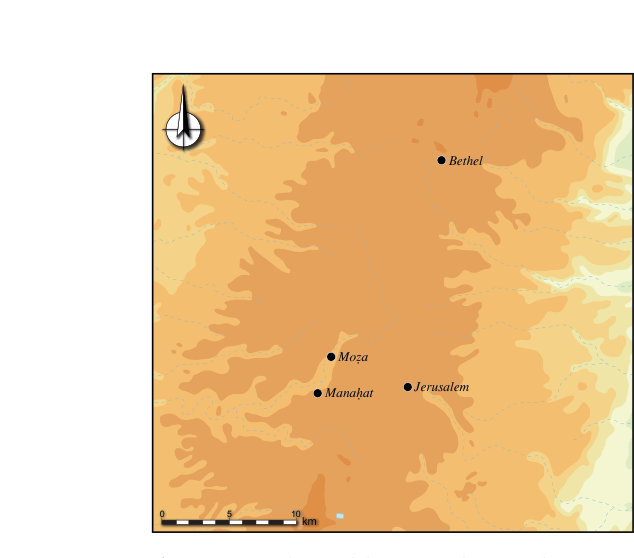

<!-- Start of picture text -->
Bethel Mo½a Manaúat Jerusalem 0 5 10 km <!-- End of picture text -->

**Fig. 10.6:** Jerusalem and the surrounding area during the LB II (ca. 14th–13th centuries BCE) 

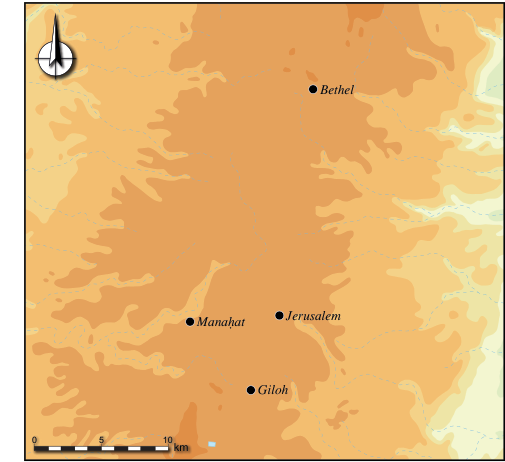

<!-- Start of picture text -->
Bethel Manaúat Jerusalem Giloh 0 5 10 km <!-- End of picture text -->

**Fig. 10.7:** Jerusalem and the surrounding area during the LB III (12th century BCE) 

Shechem, there was no urban center in the central Canaanite Highlands north of Jerusalem. Even when new urban centers emerged at Tirzah and Samaria (in the Late Iron IIA) they appear to have been connected to activity in northern Samaria and in the Jezreel–BethShean Valleys. Therefore, the new settlements on the Benjamin Plateau would have been much more likely associated with the emerging center in their vicinity, Jerusalem, than to those in the north. 

It should be concluded that by the early 10th century BCE at the latest, the inhabitants of the Benjamin Plateau came under the patronage rule of the newly rising elite in Jerusalem. The construction of the stepped stone structure marks the emergence of a polity ruled from Jerusalem, which the Benjamin Plateau apparently formed an integral part of from its early beginnings. The extent of this polity was apparently limited to the immediate vicinity of Jerusalem—the valleys to its immediate south and west, and the plateau to its immediate north, which was thus not so different from the extent of its second millennium BCE predecessors. 

It is interesting to note that the northernmost settlements in the Benjaminite cluster (Khirbet Raddana, Bethel, et-Tell, Khirbet ed-Dawwara), that were established during the Iron I on the Bethel Range, to the immediate north of the Benjamin Plateau (Fig. 10.8), were all abandoned during the Early Iron IIA (Finkelstein 2007; Finkelstein and Singer-Avitz 2009), and following the construction of the Stepped Stone Structure. Consequently, the relatively small, rural settlement in Tell en-Naṣbeh/Mizpah, which was now the northernmost settlement on the Benjamin Plateau, was fortified sometime during the Late Iron IIA (Fig. 10.9).31 What we have here, therefore, is the archaeological materialization of state formation—the rise of Jerusalem as a seat of a new ruling elite, and the process through which these elite formed patronage relations with the sedentarized clans to its north. The establishment of Jerusalemite political hegemony over the settlements that had clustered to its north was apparently accompanied by some degree of social unrest, as the following abandonment of the Bethel Range (second half of the 10th century BCE), and the subsequent fortification of Tell en-Naṣbeh/Mizpah 

> 31. For the abandonments during the Early Iron IIA on the Bethel Range, see Sergi 2017a: 8–12, with previous literature. For the fortification of Tell en-Naṣbeh/Mizpah in the Late Iron IIA, see Finkelstein 2012, and a modified view in Sergi 2017a: 9–10. 

176  omer sergi 

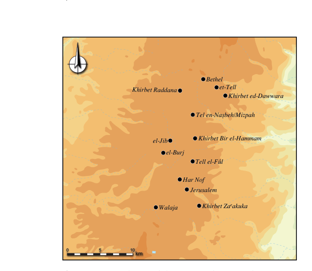

<!-- Start of picture text -->
Bethel et-Tell Khirbet ed-Dawwara Tel en-Na§beh/Mizpah el-Jib Khirbet Bir el-Hammam el-Burj Tell el-Fžl Har Nof Jerusalem Walaja Khirbet Za>akuka 0 5 10 km Khirbet Raddana <!-- End of picture text -->

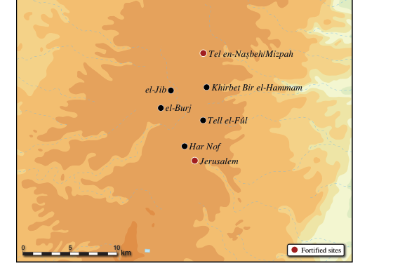

<!-- Start of picture text -->
Tel en-Na§beh/Mizpah el-Jib Khirbet Bir el-Hammam el-Burj Tell el-Fžl Har Nof Jerusalem 0 5 10 km Fortified sites <!-- End of picture text -->

**Fig. 10.9:** Jerusalem and the surrounding area during the Late Iron IIA (9th century BCE) 

**Fig. 10.8:** Jerusalem and the surrounding area during the Iron I–Early Iron IIA (11th–10th centuries BCE) 

(early 9th century BCE) may indicate. The fortification of Tell en-Naṣbeh/Mizpah marked the northern border of the newly founded polity—Judah. 

As for the Judean Hills to the south of Jerusalem, the ancient site of Hebron has been identified as Tell Rumeida, located in the southern suburbs of the modernday city.32 By the MB II–III, Hebron was surrounded by massive fortifications, which have been uncovered in every excavation area.33 However, the city was abandoned by the end of this period, after which it was (at most) only sparsely settled throughout the Late Bronze Age. Ancient Hebron was resettled in the Iron I (or perhaps as early as the LB III), but thus far, no evidence has been found which would indicate reuse of the MB II– III wall during this later period. Ofer (1994) as well as Eisenberg and Ben-Shlomo (2017: 17–18) have attributed a few installations and domestic remains to 

the Iron I settlement, while Iron I pottery sherds have also been retrieved from later fills (Eisenberg and Ben-Shlomo 2017: 267–269). The Iron I settlement at Hebron should be seen within the wider settlement process of the central Canaanite Highlands. While the Samarian Hills were densely sedentarized, only a few new rural settlements were founded in the region south of Jerusalem, most of them between Hebron in the south and Beth-Zur in the north, still some 20 km south of the Jerusalem-Benjamin cluster (Fig. 10.2). This implies that in the Iron I, as in the entire second millennium BCE beforehand, the Hebron region and the Jerusalem region were two distinct and separated sociopolitical units (Naʾaman 1992; Lipschits 2020). 

Interestingly, there is no evidence of substantial habitation at Hebron during the Iron IIA. A few pottery sherds retrieved from later fills (Eisenberg and 

> 32. Exploration of the site began early in the 20th century CE, followed by extensive excavations directed by Hammond (1965; 1966; 1967; 1968), Ofer (1994), and Eisenberg and Ben-Shlomo (2017). Only Eisenberg and Ben-Shlomo’s excavation from 2014 has been fully published, and so far, no clear Iron Age stratigraphic sequence or pottery assemblage has been presented for the previous excavations. For the history of archaeological exploration at Hebron, see Eisenberg and Ben-Shlomo 2017: 10–14. 

> 33. Ofer 1994; Eisenberg and Ben-Shlomo 2017: 68–78; Chadwick 2018; Ben-Shlomo 2019. Ussishkin (2021) has recently doubted the MB II–III date commonly given to the wall, and argued that it should be dated to the Iron IIC. As also admitted by Ben-Shlomo (2019), the evidence for the MB II–III date of the wall is indeed meager. 

the formation of the israelite monarchies   177 

Ben-Shlomo 2017: 269–71) may at most attest to the site having been sparsely inhabited during the Early Iron IIA, then completely abandoned in the Late Iron IIA. Substantial occupation did not resume until the Iron IIB–C, and it was not until this period that Hebron was refortified, when repairs and modifications were made to its MB II–III walls (Eisenberg and Ben-Shlomo 2017: 78–92; Ussishkin 2021). In this regard, the occupational history of Iron Age Hebron mirrors that of Iron Age Bethel, as both sites were settled during the Iron I, abandoned in the Iron IIA, but re-emerged as a significant urban center in the highlands during the Iron IIB–C. Hence, with all due caution, I would like to suggest that the decline in settlement activity in Iron IIA Hebron mirrors the contemporaneous decline in the Bethel Range and that both should be seen in tandem with the concurrent rise of Jerusalem. This likely reflects the consolidation of Jerusalemite power in the region of the Judean Hills as well. 

To conclude, the first stage in the formation of Judah as a territorial polity had begun in the late 11th/early 10th century BCE with the construction of the stepped stone structure in the City of David. It reflected the rise of a new elite to power in this marginal town, which was undoubtedly the House of David. This stage of development ended with the fortification of Tell en-Naṣbeh/Mizpah in the early 9th century BCE, marking the northern border of Judah. Throughout this period, the House of David steadily increased its power and wealth, in relative terms, forming patronage relations that eventually extended across the entire southern half of the central Canaanite hill country, from the Judean Hills in the south to the Benjamin Plateau in the north. This patronage network united, for the first time, all the inhabitants of these hilly regions under one 

political rule, based in Jerusalem. This was a major achievement for the Davidic kings in Jerusalem, which set the stage for their later expansion into the more lucrative regions of southern Canaan. 

###### **The Late Iron IIA in Southern Canaan and the Expansion of Judah into the Lowlands** 

Throughout the Iron I–IIA, in the period when Jerusalem rose to prominence as the primary center in the southern central Canaanite Highlands, large urban centers were thriving in the western Shephelah (Fig. 10.10)—Iron I Tel Miqne/Ekron (Strata VII–IV), situated in the western Shephelah, on a tributary of the Sorek Valley ca. 35 km west of Jerusalem, grew to become a relatively large (ca. 20 ha) and wealthy urban center, but was destroyed by the end of the Iron I.34 Tell eṣ-Ṣafi/Gath, ca. 8 km to its south, flourished throughout the Iron I–IIA, and reached its zenith in the Late Iron IIA, becoming the largest urban center in Canaan. Smaller settlements prospered in the hinterland of the larger urban centers (Ekron and Gath), inhabited by local elite families who could exploit their immediate surroundings—along the Sorek Valley, and contemporaneously with Iron I Ekron, were Tel Batash (Strata V–IV),35 ca. 7 km east of Ekron, and Tel BethShemesh (Levels 6–4), ca. 15 km east of Ekron.36 These sites were abandoned in the Early Iron IIA and sometime after the destruction of Ekron. Only a few local centers of power flourished contemporaneously with Iron IIA Gath, which were mainly located to its south, along the Naḥal Guvrin (Tel Zayit, Tel Burna, and perhaps also Tel Goded),37 or along the Naḥal Lachish (Lachish Level V, Khirbet er-Raʿi).38 For a short period of time during the Iron I/IIA transition, and following the destruction of Ekron, another local center of power flourished at Khirbet 

> 34. For Iron I Tell Miqne/Ekron, see Dothan and Gitin 1993. 

> 35. For Tel Batash Strata V–IV, see Mazar 1997; Mazar and Panitz-Cohen 2001. For the abandonment of Stratum IV in the Early Iron IIA, see Mazar and Panitz-Cohen 2001: 149–159, 274–283; Herzog and Singer-Avitz 2004: 221. 

> 36. For Iron I Beth-Shemesh, see Bunimovitz and Lederman 2016: 159–245. 

> 37. For Tel Zayit, see Tappy 2017. For Tel Burna, see Shai 2017, and for Tel Goded see Gibson 1994. 

> 38. For Lachish Level V, see Ussishkin 2004: 76–78; 2014: 203–205. Following the renewed excavations at the site, Garfinkel argued that Lachish Level V had been fortified (Garfinkel _et al._ 2019; Kang and Garfinkel 2021), however this reconstruction is not supported by the data (Ussishkin 2019; 2022; Finkelstein 2020). 

178  omer sergi 

Qeiyafa, on the banks of the eastern Elah Valley, although it was abandoned shortly after it first emerged.39 This settlement network lacked a high degree of social and political integration, which often resulted in localized destructions (e.g., Tel Beth-Shemesh Level 6, Khirbet Qeiyafa, Khirbet er-Raʿi). This also meant that the smaller centers of power could maintain some degree of independence vis-à-vis the urban centers in their vicinity. Although ultimately, they were interconnected as may be seen in the fact that the demise of Iron I Ekron and Late Iron IIA Gath brought about the demise of the smaller settlements in their hinterland. It was this sort of social organization—lacking political or social integration and characterized by social unrest—that made the extension of Davidic political hegemony into the Shephelah possible.40 

The situation was different, however, in the southeast, just at the western foot of the Judean Hills (Fig. 10.10), where small settlements that were founded in the Iron I (Tel ʿEton, Tell Beit-Mirsim, Tel Ḥalif), continued to develop uninterrupted until their destruction in the late Iron IIB, most likely during Sennacherib’s campaign against Judah (701 BCE).41 Situated in a topographical niche between the highlands of Judah and the hills of the eastern Shephelah, they were able to prosper irrespective of the sociopolitical upheavals taking place in the western Shephelah at the time (such as the destructions of Iron I Ekron and Late Iron IIA Gath). On the other hand, they were closely associated with settlement expansion in the highlands of Judah. The fact that by the late 10th/early 9th century BCE, the Davidic kings united the regions of Jerusalem and Hebron under their rule, provided the base upon which they could further expand into the 

lowlands. By that time Gath was already the most dominant center in the west. Hence, the first step was to gain the loyalty of local elites in the southeast Shephelah, who lay at the foot of the Hebron Hills and beyond the immediate interest of Gath, and who could benefit more by allying themselves with the rising power in the highlands. Archaeologically, there is no way to accurately date this process, nor should it be assumed that it was immediate or conclusive. Rather, the local elites in the southeastern Shephelah could have played off their intermediate position between the Davidic kings and the kings of Gath (cf. 2 Kgs 8:22b) in order to maintain some level of independence. The very fact that they persisted uninterruptedly even after the destruction of Gath in the Late Iron IIA, but were destroyed in the Iron IIB, probably during Sennacherib’s campaign against Judah (701 BCE), indicates that they were most likely affiliated with the House of David sometime before the destruction of Gath. 

To the north, at the foot of the Jerusalem Hills, the settlement at Tel Beth-Shemesh (Level 3) was renewed during the Late Iron IIA.42 With no other competitors along the Sorek Valley, its local elite could accumulate much more wealth than in the previous period, demonstrated by the fact that the site developed gradually, with some elements added over time and others removed.43 Located in a topographical niche that kept them relatively isolated from the western Shephelah, they were not affected by the rise and fall of Gath in the 9th century BCE. Although, as they were also situated on a passage leading to Jerusalem, they probably fell into some sort of patronage relationship with the Davidic kings. The fortification of Tel Beth-Shemesh, facing the passage of the Sorek, may be the sole archaeological indication for 

> 39. In multiple publications, the site’s excavators have argued that Khirbet Qeiyafa was a Judahite fortress (recently, Garfinkel, Kreimerman and Zilberg 2016). However, I agree with Naʾaman (2010a; 2017) and those who have followed him (Koch 2017; 2021: 88–91; Niemann 2017; Römer 2017). These scholars have noted that the site’s material culture is remarkably local, and thus the settlement should be seen as a local venture. Evidently the establishment of Judahite rule in the region, brought continuity from the Late Iron IIA and into the Iron IIB. Khirbet Qeiyafa does not fit into this pattern. It existed for a short period of time, after the fall of Ekron and before (or during) the rise of Gath. The fact that Khirbet Qeiyafa was destroyed with no continuity thereafter, even when Judah took control of the region, indicates that it was a local center of power that was able to thrive in a very specific sociopolitical landscape, only before Judah had expanded to the west. 

> 40. For further discussion of the Shephelah during the Iron I–IIA, see Koch 2017; 2021; and cf. Chapters 11–12, this volume. 

> 41. For Tel ʿEton, see Faust and Katz 2015; Faust and Sapir 2018, and for a more modified view see also Finkelstein 2020; for Tell Beit-Mirsim, see Greenberg 1987; for Tel Ḥalif, see Borowski 2017. 

> 42. The excavators of Tel Beth-Shemesh dated Level 3 to the Early Iron IIA (Bunimovitz and Lederman 2016: 366, 677–679), but while it may indeed have first begun some time toward the end of the Early Iron IIA, it spanned mostly the Late Iron IIA (Boaretto, Sharon and Gilboa 2016; Piasetzky 2016). 

> 43. For Beth-Shemesh Level 3, see Bunimovitz and Lederman 2016: 281–288. 

the formation of the israelite monarchies   179 

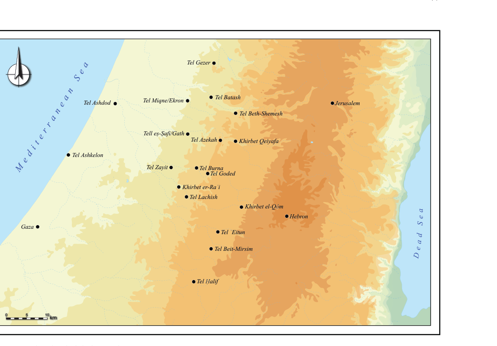

<!-- Start of picture text -->
Tel Gezer Tel Ashdod Tel Miqne/Ekron Tel Batash Jerusalem Tel Beth-Shemesh Tell eṣ-Ṣafi/Gath Tel Azekah Khirbet Qeiyafa Tel Ashkelon Tel Zayit Tel Burna Tel Goded Khirbet er-Raʿi Tel Lachish Khirbet el-Qôm Hebron Gaza Tel ʿEitun Tel Beit-Mirsim Tel Ḥalif 0 5 10 km a r r e t i d e M e S n a e n a D a e d e S a <!-- End of picture text -->

**Fig. 10.10:** The Shephelah during the Iron I–IIA 

that. In any event, it seems safe to assume that sometime in the 9th century, probably before the destruction of Gath, the local rulers of Beth-Shemesh were already affiliated with Judah. 

Incorporating the relatively isolated communities in the eastern Shephelah—at the foot of the Jerusalem or the Hebron Hills, between Beth-Shemesh and Tel Ḥalif, was the best that any of the Davidic kings could achieve as long as Gath thrived in the western Shephelah. During the Iron I–IIA, the settlement at Gath expanded into a “lower city,” located north and east of the mound, extending all the way to the Elah Valley, reaching an incredible size (in local terms) of some 50 hectares. The finds from the town include domestic compounds and industrial areas, cultic installations and sanctuaries. Massive fortifications surrounded the lower city. Material remains associated with Iron IIA Gath elucidate 

the wide exchange network within which it was integrated. This network encompassed the Phoenician littoral and the Aegean, inland polities such as Judah, and the copper production sites in the Arabah (Maeir 2012; 2017; 2020). Substantial epigraphic finds (Maeir _et al._ 2008; Maeir and Eshel 2014), and various luxury items further illustrate the dominant economic and political status of Gath during the Iron IIA. In this respect, Gath maintained much of the previous (Late Bronze Age) sociopolitical organization of the region, which was based on a ruling elite in an urban center, with sedentary and mobile communities around it. This came to an end, however, in the second half of the 9th century, when Gath was utterly destroyed, probably at the hands of Hazael of Damascus. 

Further to the south, massive sedentarization in the Beersheba and Arad valleys and in the Negev highlands 

180  omer sergi 

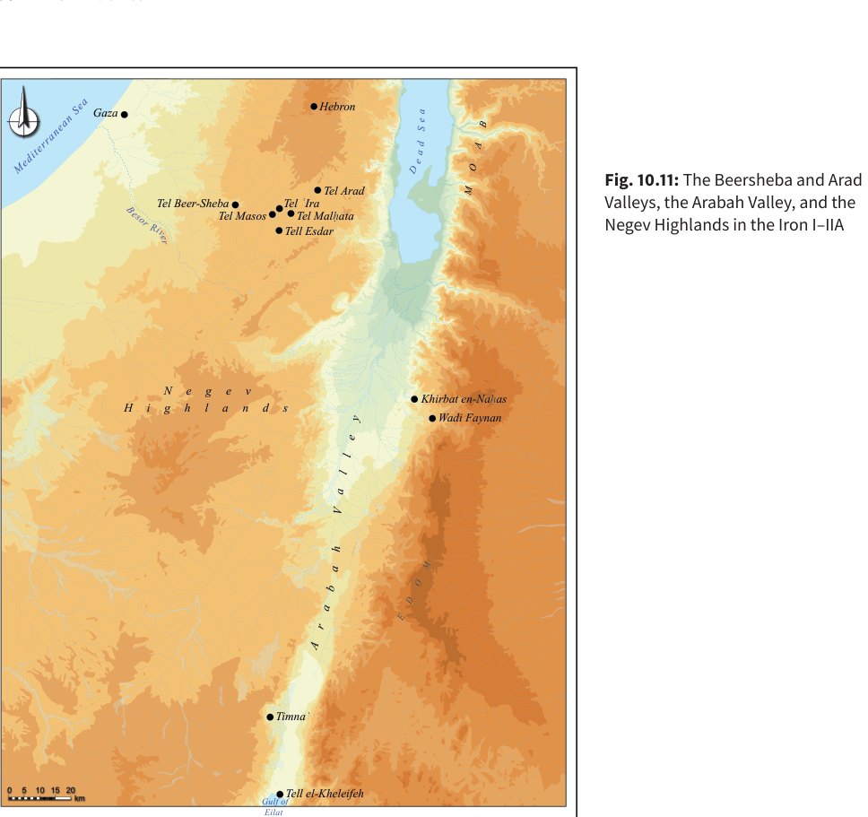

<!-- Start of picture text -->
Hebron Gaza Tel Arad Fig. 10.11:  The Beersheba and Arad Tel Beer-Sheba Tel ʿIra Valleys, the Arabah Valley, and the Tel Masos Tel Malḥata Tell Esdar Negev Highlands in the Iron I–IIA  N e g e v Khirbat en-Naḥas H i g h l a n d s Wadi Faynan Timnaʿ 0 5 10 15 20km Gulf ofTell el-Kheleifeh Eilat Ri esor Mediterra Se nean a v B D E D O M e A r e a B l A b y l e O r M a a a d h V a e S <!-- End of picture text -->

(Fig. 10.11) had already begun during the late Iron I, but reached its zenith in the Iron IIA,44 the period when the copper production in the Arabah Valley likewise reached its peak (Levy, Najjar and Ben-Yosef 2014; Ben-Yosef 2016). The material culture characterizing these sites reflects the sedentarization process of local, pastoralnomadic desert groups (Finkelstein 1995b; Shahack-Gross and Finkelstein 2015). There is also sufficient evidence to conclude that the copper production in the Arabah was operated by mobile-pastoral groups (Levy 2009). 

Finkelstein (2005) related the unprecedented settlement wave in the arid Negev Highlands to the contemporaneous Arabah copper production, arguing that the prosperity it brought to the south generated the process of sedentarization of the desert nomads, who participated in the production and trade of the Arabah copper. This suggestion was further reinforced by a petrographic study of the Negev highlands’ pottery assemblage, which revealed social and economic interactions (and possible population overlap) between the desert settlers and the 

44. For the Iron I–IIA settlement in the Beersheba and Arad Valleys and the Negev Highlands, see Herzog and Singer-Avitz 2004; Cohen and CohenAmin 2004. 

the formation of the israelite monarchies   181 

copper-production sites (Martin and Finkelstein 2013). Copper production in the Arabah abruptly ceased in the second half of the 9th century BCE, and consequently all of the settlements in the Beersheba and Arad Valleys and the Negev Highlands were abandoned. Radiocarbon dating suggests that the end of the Arabah copper production was contemporaneous with the destruction of Gath by Hazael, thus suggesting a relationship between Gath’s prosperity and the contemporaneous Arabah copper production (Ben-Yosef and Sergi 2018). 

By the first half of the 9th century BCE, even if the Davidic kings could rule (at least some parts of) the eastern Shephelah, they were still sandwiched between the two most dominant political powers in Canaan—Gath in the southwest and Omride Israel to the north—both of which attempted to dominate the Davidic kings in one way or another. As long as Gath flourished in the western Shephelah, the Davidic kings could hardly establish any firm rule in the region. This however changed abruptly in the last third of the 9th century BCE, when Gath was violently destroyed, and with it the entire settlement system in southwest Canaan collapsed (Lehmann 2019). Under these circumstances, the Davidic kings in Jerusalem could consolidate their rule over the entire Shephelah. In the midst of the devastated landscape, which would have also been inhabited by some displaced communities (Koch 2017: 191–193), they erected a massive fortified governmental center at Tel Lachish (Level IV), commanding the entire hilly terrain of the western Shephelah and manifesting the power and wealth of their dynasty.45 A similar process characterized the Beersheba– Arad Valleys, when following the demise of the settlement system connected to the Arabah copper production, the Davidic kings were able to establish political hegemony over the region, as may be reflected in the fortification of Tel Beer-Sheba V and Tel Arad XI (Herzog 2002; 2016). 

Going back to Jerusalem, public and monumental construction works in the City of David did not end with the stepped stone structure. Throughout the 10th–9th 

centuries BCE, the city grew in size and strength. The settled area expanded to the southeastern (De Groot 2012: 150–154) and western (Ben-Ami 2014) slopes of the City of David, encompassing much of the ridge. The settlement growth was accompanied by further monumental and public construction works, mainly on the northern part of the ridge and the Ophel.46 This included the fortification of the Gihon Spring in the City of David (Regev _et al._ 2017). It is in this period that early evidence for an administrative system appears in the City of David, implying the employment of literacy (Reich, Shukron and Lernau 2007). It seems, therefore, that the accumulation of more and more wealth in Jerusalem was accompanied not only by demographic growth (and settlement expansion), but likewise with the stratification of Jerusalem’s society. These were two sides of the same coin, reflecting the growing political power of the House of David. The gradual expansion and growth of Jerusalem throughout the Iron IIA mirrored the gradual expansion and growth of Judah during that period. 

In summary, the formation of Judah may be conceived of as a two stage process. The first stage, from the beginning of the 10th to the late 10th/early 9th centuries BCE, was characterized by the establishment of Davidic rule over clans and communities residing in the southern parts of the central Canaanite Highlands, between the Benjamin Plateau and the Judean Hills. The second stage, that lasted throughout the 9th century, was characterized by the expansion of Davidic political hegemony from the highlands to the lowlands. By the end of the 9th century BCE, Judah had emerged as a relatively strong and wealthy territorial polity on the southern margins of the Levant. From its hub in Jerusalem, it extended to the highlands of Judah and Benjamin and into the lowlands of the Shephelah and the Beersheba–Arad Valleys. Jerusalem itself grew to become a vibrant urban center, characterized by monumental public architecture, in which a new class of urban elite—administrators, clerics, 

> 45. For Lachish Level IV as a Judahite military and administrative center, see Ussishkin 2004: 78–83; 2014: 223– 266. Some argue that it was constructed prior to the fall of Tell eṣ-Ṣafi/Gath (e.g., Naʾaman 2013), but many think that it could have only been constructed after the fall of Gath (Sergi 2013; Lehmann and Niemann 2014; Maeir 2020: 27–28). Recent radiocarbon results retrieved from a floor uncovered below the Level IV fortification confirm this assumption as they provide dates within the mid-late 9th century (Garfinkel _et al._ 2019), which _ante-date_ the construction of the Level IV fortifications. 

> 46. Uziel and Szanton 2015; Gadot and Uziel 2017; Shalev _et al._ 2019; Shalev _et al._ 2020; Winderbaum 2021; 2022. 

182  omer sergi 

and scribes—had risen to power. Davidic royal centers (Tel Lachish Level IV–III and Tel Arad Stratum XI–VIII) represented the power and wealth of the dynasty in regions remote from the capital, and were inhabited by an ever-growing class of military and administrative elite in the service of the House of David. 

###### **The Stories about Saul and David (1 Sam 9 to 2 Sam 5): Date and Origin** 

The formation of Judah was a gradual process that lasted throughout the 10th and 9th centuries BCE. This process was unrelated to the formation of Israel in northern Samaria. Israel and Judah were never politically united, and ultimately, their respective formative trajectories differed resulting in two distinct sociopolitical structures. Such an image of early Judahite history differs greatly from the one cemented in the cultural memory of later generations (from at least the late Iron Age and to a certain extent as still embraced today). The latter is the one which commemorates the heroic deeds of Saul and David and the great United Monarchy ruled by David and Solomon. If Israel and Judah were never united, what was the origin of the biblical account of the lives of Saul and David? Against what socio-historical background could Judahite scribes in Jerusalem envision the rule of the Davidic kings over Israel? This is not a mere problem of dating the biblical stories about the United Monarchy or pondering the reality they yearn to depict. The questions regarding the intellectual and the literary origins of the United Monarchy reflect a much more fundamental problem— the origin of pan-Israelite ideology and the common sense of Israelite identity. 

Since Israel and Judah were never politically united, many scholars suggest the period after the fall of monarchic Israel (720 BCE) but before the fall of Judah (586 BCE) as the mostly likely time frame 

during which Israelite written traditions could have been adopted in Judah, and with them some sense of Israelite identity. According to this perspective, it was only after the fall of Israel that Judahite scribes could have adopted, and appropriated, a pan-Israelite identity, which sees Judah as part of a greater Israel.47 Following this presupposition, it has been argued that the traditions about Saul, David and the formation of the United Monarchy stem from two distinct sources, each of different origin: a collection of northern Israelite traditions about Saul (usually identified in 1 Sam 9–14), which tell the story of the rise and fall of the first Israelite king; and a Judahite collection of stories about David, which presents David as Saul’s legitimate successor (1 Sam 16–2 Sam 5). It has further been assumed that the northern Israelite Saul traditions arrived in Judah only after the fall of Samaria (720 BCE), which subsequently stimulated the composition of the stories about David’s rise, that were correspondingly dated to the 7th century BCE. The stories of David’s rise, according to this reconstruction, created the first literary link between Saul the Israelite and David the Judahite in order to present Judah as the political and cultural successor of the former Kingdom of Israel. In other words, it is argued that the stories about David’s rise connect two formerly unrelated literary protagonists—the first king of Israel (Saul) and the first king of Judah (David)—in order to present Judah (and the House of David) as the rightful successor to the (former) Israel (and the House of Saul).48 This hypothesis is based on the interpretive reading of the stories about David’s rise in 1 Samuel 16 to 2 Samuel 5 as an allegory for the histories of Israel and Judah. However, these stories are well embedded within the social and political realia of southern Canaan during the early Iron Age, as has been demonstrated by Naʾaman in numerous publications (Naʾaman 1996b; 2002; 2010b; 2010c; and see subsequent discussion herein). 

> 47. E.g., Kratz 2000; Fischer 2004; Finkelstein and Silberman 2006; Naʾaman 2010d; Schütte 2012; Kratz 2016. Recently, some studies have traced the origin of pan-Israelite identity to the period before the fall of Samaria, and argued it was related to its kinship conceptualization (e.g., Fleming 2012; Weingart 2014), but these barely considered the archaeological evidence. 

> 48. This is the prevailing view, for some of the vast literature, see, for example, Fischer 2004: 280–291; Kratz 2005: 181–182; Finkelstein 2006b; 2011b; Dietrich 2007: 247–248, 304–308; Kaiser 2010; Wright 2014; Bezzel 2015. But see Naʾaman (2009), who challenged this perception (see also Chapter 16, this volume). 

the formation of the israelite monarchies   183 

I have recently demonstrated that the so-called early Saul traditions in 1 Samuel 9–14 hardly reflect any of the geographical or political realities of the Kingdom of Israel.49 Their geographical scope is restricted to the area north of Jerusalem, while the entire hill country north of Bethel, which was the heart of the Kingdom of Israel (and cf. the Jacob Cycle), is completely absent, as are the main political centers of Israel (Shechem, Tirzah, Samaria), the importance of the cult place in Bethel, the Israelite royal cities in the northern valleys and the Israelite cult centers in the Gilead, most notably Penuel—all completely absent from the narrative. The geopolitical picture that arises from these traditions better reflects a Jerusalemite point of view. According to the story, Saul’s main sphere of influence is north of Jerusalem, on the Benjamin Plateau and the southern Ephraim hill country, regions in which the rural population was contravened by the Philistines, the inhabitants of the urban centers in the Judahite Shephelah (1 Sam 13:20; 14:31). These characteristics draw the line between the more urban societies of southwestern Canaan and the rural societies of the Benjamin–Jerusalem hills prior to the Iron IIB. 

Lastly, as previously demonstrated, from an archaeological point of view, the inhabitants of the Benjamin Plateau were affiliated with Jerusalemite political hegemony as early as the 10th century BCE. Thus, if the memory of a Benjaminite hero would have been preserved and recorded somewhere, it would have been in the scribal school in Jerusalem. This is also the best explanation for the complete absence of any trace of Israelite geography, politics, or concerns within these traditions, which rather reflect the political realia, problems, and interests of early monarchic Judah. Recognition of the southern origin of the early Saul traditions is a key factor in dating them. It was only in the Iron I–IIA (11th–9th centuries BCE) that the Benjamin Plateau and the Southern Ephraim highlands were densely settled by rural, agropastoral communities, while larger urban centers—Ekron 

and Gath—thrived to the west, in the Shephelah. Therefore, the early Saul traditions reflect the Jerusalemite political landscape and the concerns of early monarchic Judah, and not those of early monarchic Israel (which was fully situated in northern Samaria and the eastern Jezreel–BethShean Valleys). The memory of the first king of the Israelites is apparently a Judahite, or more specifically, a Jerusalemite memory from the early monarchic period. 

The story of David’s rise in 1 Samuel 16 to 2 Samuel 5 includes multiple narrative strands that recount David’s service in Saul’s court (1 Sam 16:14–23; 17–19), David’s flight from Saul (1 Sam 20–26), his consequent time in the service of the king of Gath (1 Sam 27–2 Sam 1) until the death of Saul (1 Sam 31 to 2 Sam 1), and David’s coronation as the king of Judah (2 Sam 2:1–4) and then Israel (2 Sam 5:1–3), followed by his seizure of Jerusalem and his final battles against the Philistines (2 Sam 5:6–25). Although the extent and scope of the story of David’s rise remain a matter of dispute, there is general agreement that it consists of earlier traditions that were collected and compiled together by a pre-Deuteronomistic scribe.50 It is likewise well accepted that despite its mosaic nature, it has been painted with an overall unifying royal, pro-Davidic ideology, which suggests that its authors were not mere compilers. Within this framework, scholars agree that the story of David’s rise was meant to present David as the legitimate successor of Saul, not only due to his military prowess and his relationship to the House of Saul and the royal court, but also because he was elected by Yahweh to lead his people.51 

The geographical scope of the stories in 1 Samuel 16 to 2 Samuel 5 is restricted to the southern parts of the central Canaanite Highlands and the eastern Shephelah, while the Philistines controlled the western Shephelah. Accordingly, David is quite independent (as a leader of a warrior band) whenever he acts in the Judean Hills and their foothills in the southeastern Shephelah (1 Sam 23–26 and 2 Sam 5:6–25), but he is at the service of the king of Gath whenever 

> 49. For a detailed discussion of the literary extent of the early Saul traditions (with further literature), and for their southern origin, see Sergi 2017b; 2020. 

> 50. For a summary of the discussion, see Dietrich 2007: 240–250; 2011: 44–47; 2015: 192–195, with further literature. 

> 51. For this general consensus, and for the various reconstructions of the distinct narrative strands embedded in the story of David’s rise, see Grønbæk 1971: esp. 259–279; Stoebe 1973: 59–63; Veijola 1975; Stolz 1981: 17–18; Fischer 2004: 270–291; Kratz 2005: 177–181; Bezzel 2021. Other reconstructions (e.g., Halpern 2001; Hutton 2009), which presuppose two distinct narrative blocks that were intertwined together, seem less persuasive. 

184  omer sergi 

he ventures to the west or to the south (cf. 1 Sam 27, 29–30). This geopolitical scenario is further highlighted by the importance of Gath (1 Sam 17:4, 23, 52; 21:11, 13; 27:2– 4, 11), which can only reflect the period in the Iron IIA when Tell eṣ-Ṣafi/Gath ruled much of southwest Canaan before its ultimate destruction in ca. 830 BCE. The memory of Gath and the Philistines in the stories of David’s rise are quite detailed and reflect intimate knowledge of Iron IIA southern Canaan (Koch 2020). Thus, for instance, it recalls the prominent status and role of Gath, the extent of its territory, and its complex interaction with the rural society in the eastern Shephelah, the Judean Hills, and the southern desert fringe. The social conditions described in several episodes predate the period of consolidation of Jerusalemite regional hegemony in the final decades of the 9th century BCE. These are mainly episodes in the complex narrative of David leading his band of warriors in Keilah and Ziklag (1 Sam 23:1–5; 27; 30), and the anecdotes of the heroic deeds of his men (2 Sam 21:15–22; 23:8–39). For example, Naʾaman (2010c) has pointed out the remarkable accord between the story of the rescue of Keilah (1 Sam 23:1–5) and the Qiltu affair that is described in the el-Amarna correspondence (EA 279, 280, 287 and 289), both in place and and social circumstances. 

The overall sociopolitical landscape presupposed by the story of David’s rise, is one that lacks any social or political integration. Southern Canaan is portrayed as a region where semi-autonomous sedentary and mobile groups inhabited the margins of an urban based polity— Gath—holding differing degrees of loyalty and hostility toward it. All these details may exclusively reflect the sociopolitical landscape of the 10th and especially the 9th centuries BCE as the preceding archaeological discussion demonstrates. It is further noteworthy that there is nothing in these stories that resembles the sociopolitical realia of the Iron IIB–C, the period to which they are dated by many scholars. The story does not reflect Judahite hegemony in the Shephelah during the Iron IIB. In fact, Lachish, which was the main Judahite royal center in the Shephelah, is completely absent from the narrative. The prominence of the Kingdom of Ekron during the Iron IIC is not represented. Neither is the Assyrian invasion nor are any of its various consequences. This last omission is particularly remarkable, as the Neo-Assyrian Empire had cast a dense shadow over the entire Southern Levant throughout the Iron IIB–IIC. 

The Assyrian military (unlike that of the Philistines) were the armed forces of the most powerful empire to date. Not only had it destroyed numerous local territorial kingdoms, it had also rearranged the entire social and political structure of the Southern Levant. It cannot be equated with a local Philistine garrison attempting to control the highland population (e.g., 1 Sam 13:3, 14:1–13, 23:1–5; 2 Sam 5:17–25, 21:15–22, 23:8–39). Evidently, the story of David’s rise contains intimate details that express a vivid memory of the Iron IIA in southern Canaan, yet includes not the slightest hint of circumstances in later periods. Therefore, it should not be considered to date from much later than the reality it reflects. The overall scope and historical context of the many narratives embedded in 1 Samuel 16–2 Samuel 5 are best situated in the 9th century BCE, which means that they were composed no later than the first half of the 8th century BCE. 

In sum, both the early Saul traditions in 1 Samuel 9–14 and the story of David’s rise in 1 Samuel 16 to 2 Samuel 5 are consistent with the social and political realities of southern Canaan during the 10th and 9th centuries BCE. Hence, it is reasonable to surmise that both were composed in Jerusalem, no later than the first half of the 8th century BCE, and well before the fall of Samaria in 720 BCE. The composition of the early Saul traditions and the many narrative strands that were ultimately embedded in the David story, their ongoing collection, compilation, and redaction into a relatively coherent story, no doubt involved several literary stages. However, the entire literary horizon of the composition, compilation, and redaction of the Saul and the David stories could not have begun earlier than the second half of the 9th century BCE, and must have ended sometime in the first half of the 8th century BCE. The question remains as to how David, who was the founder of Judah, could have been conceived of in these traditions as the successor of the first king of Israel. The answer to this question lies in the nature of Israelite identity assumed by the narrators of the Saul and David stories. 

###### **The Formation of the Davidic Kingdom and the Origin of Pan-Israelite Identity** 

The stories about Saul’s wars with the Philistines in 1 Samuel 13–14 presuppose his kingship over Israel, or at 

the formation of the israelite monarchies   185 

the very least, commemorate him as Israel’s military leader and liberator (1 Sam 11:15; 14:47). The name _Israel_ is mentioned fourteen times in 1 Samuel 13–14. In most of these cases the term clearly refers to a group of people. The text identifies the Israelites as a composite clan/tribal society settled on the Benjamin Plateau and in the southern Ephraim hill country, between Gibeah in the south and Bethel in the north (1 Sam 13:4–6, 20, 14:22–24). It also reflects the complex nature of Israel as a kinship group, consisting of different clans (such as the Benjaminites) who were brought together under a more encompassing kinship identity (Israel). Being a Benjaminite (1 Sam 9:1), Saul was also considered an Israelite, and thus the early Saul traditions are telling the story of the rise and fall of a Benjaminite who came to rule his kinsmen, the Israelites. In other words, the story never portrayed Saul as the king of Israel, relating to the polity formed by the Omrides far to the north, in the region of Shechem and Samaria. Rather, it tells how Saul came to rule his Israelite kinsmen, residing on the Benjamin Plateau. The clans inhabiting the Benjamin Plateau were eventually subordinated to Davidic rule from Jerusalem, as is demonstrated by the archaeological remains. So, it becomes clear that according to the early Saul traditions, Israelite clans were a major component in the Kingdom of Judah from its inception. It is for this reason that the memory of their ruler, Saul, was commemorated in Jerusalem. 

A similar portrayal of Israel as a kinship group residing in the regions of Jerusalem and Benjamin characterizes the story of David’s rise, especially the narratives recounting David’s service in Saul’s court (1 Sam 17–19). In fact, most of the occurrences of the name _Israel_ within the story of David are concentrated in the narratives about his service in Saul’s court, where it always refers to a group of people, who were ruled by Saul (1 Sam 17:2–3,8,10–11,19,21,24,25– 26,45–46,52–53, 18:6,16,18). As in the early Saul traditions, there is never an instance of the name Israel in which it refers to a certain territoriality or to the northern Kingdom of Israel known from the 9th century BCE (Willi-Plein 2004: 164–166), and David himself never appears anywhere north of the Benjamin Plateau. 

The story of David’s rise does not portray the Israelites as particularly hostile to David, even when it is clear that they were ruled by his rival, Saul. Quite the contrary, during his days in Saul’s court it is said that David was loved and admired by the Israelites for his military prowess (1 Sam 18:6–7,14,18). Eventually, the “tribes of Israel” arrived in Hebron and crowned David as their king (2 Sam 5:1–2a,3b), on account of his former successful service in Saul’s court (2 Sam 5:2a; cf. 1 Sam 18:16). What explanation is there for the close relationship between David and the Israelites? Of course, historically, the House of David was the ruling dynasty of Judah, whose royal seat was in Jerusalem. However, this does not mean that David’s kinship identity was Judahite. Nowhere in the stories of his rise to power is David identified as a Judahite. Quite the contrary, on four separate occasions David is explicitly identified as an Israelite (1 Sam 17:2, 18:18, 27:12; 2 Sam 5:1). In 1 Samuel 17:12, it is stated that David was the son of an Ephratite (namely, from the clan of Ephraim), who settled in Bethlehem.52 According to the story, David and his family were affiliated with an Ephratite clan from Bethlehem, which further implies that they were identified as Israelites by kin, and for this reason they were also associated with the Israelite ruler, Saul.53 In this regard, David’s words to Saul in 1 Samuel 18:18 are telling (“Who am I? And who are my kindred or my father’s clan in Israel that I should become the king’s son-in-law?”), as they explicitly express the association of Israel with a kin-based group consisting of several clans, to which David’s family belongs. Assuming an Israelite origin for David may also explain why his coronation over the clans of Judah (2 Sam 2:1–4) is not taken for granted. Not only did David make an inquiry to Yahweh before advancing to Hebron (an action he otherwise took only before battles, 1 Sam 23:2,4, 30:8; 2 Sam 5:19,23–24), but prior to his arrival, he bribed the Judahite leaders, sending them booty he had looted from the Amalekites (1 Sam 30:26). His coronation as king of Israel, on the other hand, seems to have been much more natural, as the Israelites 

> 52. For the settlement of Ehpratite clans south of Jerusalem, and for the identification of Bethlehem with Ephrath, see Naʾaman 2014; Zadok 2018: 246; Niemann 2019: 6–7. 

> 53. For the Ehpratite identity of David, see also Naʾaman 2014: 525–527; Niemann 2019: 6–9. 

186  omer sergi 

themselves declared David their king on account of him being their kinsman (“you are our bone and flesh”), and on the account of his previous successful service in the court of Saul, the former king of the Israelites (2 Sam 5:1–2a). So, it becomes clear that David, at least according to the stories of his rise to Saul’s throne, originated in an Israelite clan, and hence was identified as an Israelite (by kin), and not as a Judahite. 

What is even more striking, is that the stories about Saul and David (1 Sam 9–2 Sam 5) presuppose a sociopolitical landscape governed by kin-based entities. Thus, besides the Benjaminite and Ephratite clans, the text mentions yet another group—the Jebusites—who lived in Jerusalem and its environs (2 Sam 5:6–8). The text is not explicit regarding their origin, their relations with the Israelites, or with the kingdom of Saul. Most scholars have assumed that they were affiliated with Saul’s kingdom, while Naʾaman (2015) has even suggested that they were Benjaminites. Whether they were affiliated with Benjamin or not, the story refers to the complex kin-based composition of a relatively small territory extending from the north of Judah (Bethlehem) to the Benjamin Plateau. This tradition further presupposes that all the distinct clans that inhabited this small region—Jebusites, Ephratites, and Benjaminites— had come under Davidic rule and were merged into the Kingdom of Judah. 

In light of the kin-based landscape presupposed by the stories about Saul and David, it is noteworthy that none of the literary traditions embedded within it locate any Israelite clan south of Bethlehem. The text makes clear that other kin-based groups, who were not necessarily under Saul’s dominion, inhabited the Judean Hills: Ziphites in south east Judah (1 Sam 23:19, 26:1); Yerahmielites and Qenites in southeast Judah and the Arad Valley (1 Sam 27:10, 30:29); and the Calebites on Mount Hebron (1 Sam 30:14, cf. Num 13–14 and Josh 14); the inhabitants of Keilah, in the western foothills of Judah, are only identified by their town (“the people of Keilah” in 1 Sam 23:4,12); and lastly, a list of towns 

associated with the “elders of Judah” (1 Sam 30:27–31) is identified with sites located in the western foothills of the Judean Hills and their southern desert fringe before 701 BCE (Naʾaman 2010b).54 The texts portray the Judean Hills and the desert fringe to their south as regions that were inhabited by loosely related kin-based groups, which were beyond the reach of Saul’s patronage. None of them are explicitly affiliated with a Judahite tribal unit or with any Israelite collectivity. Scholars have, therefore, suggested that the name “Judah” originally referred to the steep and rocky landscape of the Judean hills (Lipiński 1973; Knauf 2007); and that only following the establishment of Davidic rule, the different kinship groups living in this region coalesced into a larger tribal unit identified by its geographic territory as “Judah.”55 

The stories about Saul and David delineates, accordingly, the following (and in fact, not impossible) scenario: David originated in an Ephrathite clan from Bethlehem that was associated with a larger kinship group of Israelites. This group consisted of Benjaminite clans from the Benjamin Plateau as well. The Israelite clans resided to the south and to the north of Jerusalem, and were ruled by Saul, the Benjaminite. David’s father and family were subordinates of Saul, and thus were also obliged to provide him military service. If we follow the biblical narrative, David, for whatever reason, detached himself from Saul, and formed his own band. As the leader of his own band, he operated only among the clans residing in the Judean Hills and their surroundings: he came to the rescue of the people of Keilah in the southeastern Shephelah (1 Sam 23:1–5); he ruled the town of Ziklag in the western Shephelah, but under the auspices of the king of Gath (1 Sam 27:5– 6); and he kept closely connected through marriage (1 Sam 25) and bribery (1 Sam 30) with the clans residing in the Judean Hills and their desert fringe. Ultimately, these clans chose him as their king. Thus, David established himself as the ruler of groups, who resided in the Judean Hills and their desert fringe (to the south of Saul’s kin-based polity), and who were not 

> 54. See further in Lehmann and Niemann 2006; Naʾaman 2016b; Niemann 2019; Zadok 2018: 181–183. 

> 55. Scholars seem to agree that Judah was not a distinct tribe prior to the monarchic period, and that it emerged when several clans from the region of the Judean Hills coalesced under Davidic rule. Disagreement exists regarding the date and nature of this process; for different reconstructions, see Noth 1930: 107–108; Zobel 1975; Ishida 1977: 65–66; Knauf and Guillaume 2016: 48; Lehmann and Niemann 2006: 3–4; Lipschits, Römer and Gonzalez 2017: 275–283; Niemann 2019: 10–17. 

the formation of the israelite monarchies   187 

of his own kin (1 Sam 2:1–7). It was only following Saul’s death that David was crowned as Saul’s legitimate successor over his own kinsmen, the Israelites from the north (Benjaminites) and the south (Ephratites, David’s kin) of Jerusalem. David’s coronation over the Israelites who were formerly ruled by Saul, made him the king of the Judahite clans from the Judean Hills and the king of the Israelite clans from the regions of Jerusalem and the Benjamin Plateau. To that end, he seized the stronghold of Jerusalem and founded his residence and power base in it, thus incorporating one more local clan—the Jebusites—into his kingdom. 

It was probably deliberate that the text remains vague regarding the size or extent of the general term “the tribes of Israel” referring to those who came to Hebron in order to crown David over them (2 Sam 5:1). As a result, the extent of David’s kingdom remains vague as well. Yet, the northernmost sites mentioned in the story of David’s rise are Geba and Gezer, both are located on the route descending from the Benjamin Plateau (Geba, has been identified as Jebaʿ ca. 10 km north of Jerusalem) to the Ayalon Valley in the northern Shephelah (Tel Gezer, ca. 30 km west-northwest of Jerusalem). The limited geographic scope of the story is noteworthy: David’s battles against the Philistines were conducted mainly north and south of Jerusalem (2 Sam 5:17–25) and in the southeastern Shephelah (1 Sam 23:1–5). The territory reclaimed by David was limited in size and reflects the territorial-political reality prior to the destruction of Gath and the further Judahite expansion into the western Shephelah, when Judah was still mostly a highland polity. However, this point is not a mere reflection of territorialpolitical reality. The stories about David’s activity as a warlord interconnect the Judean Hills and the southeastern Shephelah with the Benjamin Plateau, thus creating the notion of a unified realm. The sites in which David is active—Hebron, Bethlehem, Jerusalem, Geba/Gibeon, Adullam and Keilah—represent different communities, social groups and geographical regions. David’s very activity among these groups—whether in fighting the enemy, leading his men, or conquering a new town— manifests Davidic political hegemony, and thus generates the concept of a politically unified kingdom under Davidic rule (Sergi 2015). In other words, more than reflecting, these stories construct the territorial concept 

of early monarchic Judah, and delineate its boundaries on the Benjamin Plateau, in the Judean Hills and in the southeastern Shephelah. 

This last point is significant, as it reveals how David’s kingdom was envisioned by the Jerusalemite intellectual elite of the late 9th–first half of the 8th centuries BCE. It is this territory, restricted to the southern parts of the central Canaanite Highlands and their foothills, to which the Jerusalemite scribes attribute so many different clans that ultimately clustered into two main kin-based groups: the Israelites (to which David belonged by kin) in the northern parts of this limited territory (Jerusalem and the Benjamin Plateau), consisted of Ephratites, Benjaminites and perhaps also Jebusites; and the Judahites in the southern part of this limited territory (Judean Hills and their foothills), consisted of Qenites, Yerahmielites, among many others. In other words, the unification of “Israel” and “Judah” in the stories about Saul and David (1 Sam 9 to 2 Sam 5) refers to the political unification of Jerusalem and the Benjamin Plateau with the Judean Hills under the rule of the House of David. In a sociopolitical landscape ruled by kin-based groups, as assumed by the authors of the stories about Saul and David, this territorial-political unification was portrayed in kinship terminology. The formation of the Davidic Kingdom was commemorated, first and foremost, as the unification of Judahite clans from the Judean Hills with Israelite clans from the Benjamin Plateau under the rule of David. 

From an archaeological perspective, the formation of Judah was a gradual process that lasted throughout the 10th and 9th centuries BCE, and as already demonstrated herein, it was probably not before the late 10th or early 9th centuries BCE that the House of David had firmly consolidated its rule in the southern parts of the central Canaanite Highlands and their foothills. In this sense, the stories about Saul and David in 1 Samuel 5 to 2 Samuel 9 may be seen as the projection of a long and gradual process onto the figure of the founder of the monarchy. The incorporation of different communities under Davidic rule, which historically took place over more than a century, was “telescoped” at the narrative level to the figure of the dynastic founder—David. By extension, the prominent role of the House of David in uniting different kin-based groups, which were only loosely associated 

188  omer sergi 

with each other, may illuminate the nature of what is generally considered Judahite historiography (in Samuel and Kings)—its focus on David and his house and its preoccupation with the kin-based structure of southern Canaan. 

To conclude, the stories about Saul and David (1 Sam 9 to 2 Sam 5) reveal a particular interest in the social, kinship composition of the south of Canaan, and especially the southern part of the central Canaanite Highlands. The political landscape portrayed in this literary work is one governed by kin-based entities (Benjaminites, Ephratites, Jebusites, Yerahmielaties, Calebites, and Qenites, among others). As such, early monarchic Judah was conceived as the result of uniting the Israelite clans from Benjamin and the Judahite clans from the Judean Hills under the rule of David. Accordingly, David never ruled the northern Israelite clans, nor does the story of his rise to power presuppose his kingship over the territories that were eventually included in the northern Kingdom of Israel. This story was never meant to portray David as the king of the northern Israelite polity, which is known from the extrabiblical sources of the 9th century BCE. Rather, it portrays the formation of early monarchic Judah as a unification of the Benjamin Plateau and Jerusalem on the one hand, with the Judean Hills on the other. Hence, the focus on the Benjaminite and Ephratite clans that were formerly ruled by Saul, and the presentation of David as the successor of Saul, not as an allegory to hypothetical wishes of late monarchic Judah, but simply because both Saul and David ruled the same group of people, the Israelites residing in the Jerusalem– Benjamin highlands. 

This is, of course, a literary image, one that could at best reflect the worldview of Jerusalemite intellectual elites of a much later period, but it points to the origin of pan-Israelite identity, not as a cultural process by which the Judahite elite adopted the name and the cultural heritage of its northern neighbor as argued by so many scholars, but rather it was a matter of kinship. Both the northern and the southern ruling dynasties were Israelite, in their kinship identity, or at the very least, this is how they presented themselves and this is how they constructed their kin-based power. This may explain why in First Isaiah, Judah and Israel are already referred to as “the Two Houses of Israel” 

(Isa 8:14) —because this is exactly what they were, even if they were never united—they were nevertheless two Israelite monarchies in the sense that they were ruled by two dynasties whose kin-based origin was Israelite (cf. Williamson 2011; Weingart 2014: 201–212). 

That being said, it is likewise important to remember that such traditions are a literary product of an intellectual elite from the period after the formation of the territorial kingdom of Judah (late 9th–first half of the 8th centuries BCE). Therefore, the conceptualization of Israel as a kinship group residing north and south of Jerusalem is the one ascribed to the population of the region by scribes in the service of the ruling dynasty in Jerusalem. This could at best reflect the sociopolitical organization of Judah at the time of composition. However, regardless of the true kinship identity of David and the inhabitants of his kingdom, it is evident that scribes of the late 9th or early 8th centuries BCE ascribed Israelite identity to David and to the core component of his kingdom. The stories about David in 1 Samuel 16 to 2 Samuel 5 place considerable emphasis on David’s legitimacy to rule the Israelites—as their own kin, as their savior, and as the legitimate successor of Saul. These in turn reflect the importance of Israelite identity in the Davidic court well before the fall of Samaria. Apparently, the Davidic court considered itself to be Israelite by kin, ruling Israelite clans in the regions to the immediate north and south of Jerusalem. Pan-Israelite identity was not a construct of the late monarchic Judahite elite, but a social reality, along with a strong sense of kinship identity shared by the ruling families in Samaria and Jerusalem, at least from the second half of the 9th century BCE onward. 

###### **Conclusion** 

Archaeological and textual evidence demonstrate that early monarchic Israel was formed and maintained as an alliance of clans from northern Samaria and the eastern Jezreel–Beth-Shean Valleys. It is for this reason that from an archaeological point of view, the formation of Israel involved multiple destructions (such as at Shechem or Tirzah VIIb) and drastic shifts between centers of power (from Shechem to Tirzah to Samaria), none of which characterize the formation of Judah. The 

the formation of the israelite monarchies   189 

formation of Judah took a completely different course, as it was a gradual process that lasted throughout the 10th and 9th centuries BCE. During this period, the Davidic kings in Jerusalem incorporated different social groups under their rule, first in the regions of Jerusalem and Benjamin, later in the Judean Hills and the eastern Shephelah, and finally in the western Shephelah and the Beersheba–Arad Valleys. The steady and gradual growth and expansion of Judah, mirrored by urban growth in its capital, Jerusalem, reflect the consolidation of power in the hands of one, exclusive, ruling elite— the House of David. 

Israel and Judah were never politically united, and ultimately, their formation processes took different courses and resulted in different sociopolitical structures. That means, that no king of the House of David could have ever ruled the territories of the northern Kingdom of Israel. The only unity between Israel and Judah was rooted in a shared sense of common kinship by the royal courts of Samaria and Jerusalem. No other literary work reflects the kin-based politics of the early Iron Age Southern Levant as do the early Saul traditions and the stories of David’s rise (1 Sam 9 to 2 Sam 5). According to the narrative embedded in these traditions, the small territory stretching from Bethlehem in the south, and through Jerusalem to the Benjamin Plateau in the north, was inhabited by Benjaminite, Ephratite, and Jebusite clans. At least the Benjaminites and the Ephratites were seen as part of the larger group known as Israelites. The narrative locates loosely related kinship groups in the Judean Hills and their desert fringe, and small sedentary communities (e.g., the people of Keilah) in the southeastern Shephelah. Such a portrayal of the social reality—of semi-independent kin-based groups living on the margins of an urban based polity (Gath)— can only refer to and reflect southern Canaan during the 10th–9th centuries BCE. Accordingly, these stories must have been composed and redacted in Jerusalem no later than the first half of the 8th century BCE, well before the fall of Samaria. Israel, according to this portrayal, was a kin-based group that consisted of Ephratite and Benjaminite families, who resided in the core territory of historical Judah, in the Jerusalem– Benjamin regions. 

It was the unification of the Judean Hills and the Benjamin Plateau under the House of David—probably for the first time in the history of the region—that was commemorated in Judahite cultural memory as the founding myth of the Davidic monarchy. The Davidic kingdom presupposed by these stories consisted of the regions of the southern part of the central Canaanite Highlands, between the Benjamin Plateau in the north and the Judean Hills in the south, perhaps along with the eastern Shephelah. The very idea of unity under Davidic rule is rooted in the actual political unity of Judah and Benjamin under the House of David during the Early Iron IIA. From the perspective of kinship politics, as presupposed by the authors of the Saul and David stories, this was a unity of kin-based groups and not of territorial polities. Accordingly, the original idea of unity between Israel and Judah under David never really referred to early monarchic Israel, situated in northern Samaria and the northern Valleys. It referred to the different kin-based groups in the southern parts of the central Canaanite Highlands that in a process lasting at least a century clustered under Davidic rule based in Jerusalem. In the eyes of the Judahite intellectual elite, these groups were made of Israelite clans inhabiting the Benjamin and Jerusalem regions, and Judahite clans inhabiting the Judean Hills. Regardless of the true kin-based composition of early monarchic Judah (or the true identity of David himself), it is evident, that by the first half of the 8th century BCE at the latest, the Jerusalemite intellectual elite had applied an Israelite identity to David and to the inhabitants of his kingdom. This fact alone is enough to indicate that a sense of Israelite identity existed in the Davidic court well before the fall of Samaria. It may therefore be concluded that both the northern and the southern ruling dynasties were Israelite by kin, or at the very least, this is how they presented themselves, and this is how they constructed their kin-based power. 

In the long run, it was the common sense of Israelite kinship shared by the royal courts of both Israel and Judah, and which was perpetuated in Judahite cultural memory from the early monarchic period, that enabled in a later period to imagine Israel and Judah as one polity (e.g., in 2 Sam 15–20) and facilitated the conceptualization 

190  omer sergi 

of Judah as part of a greater Israel.56 Eventually, it was that common sense of  Israelite identity that during the late monarchic period and following the fall of Israel, enabled the adoption and appropriation of Israelite 

literary traditions as a means of amalgamating Israel and Judah into one social and cultural unity. Yet this was no innovation of the late monarchic period, as it was rooted in the early formation of both Israel and Judah. 

###### REFERENCES 

- Aḥituv, S. and Mazar, A. 2014. The Inscriptions from Tel Reḥov and Their Contribution to the Study of Script and Writing during Iron Age IIA. In: Eshel, E. and Levin, Y., eds. _“See, I Will Bring a Scroll Recounting What Befell Me” (Ps 40:8) Epigraphy and Daily Life from the Bible to the Talmud_ Göttingen: 39–68. 

- Ahlström, G.W. and Edelman, D.V. 1985. Merneptah’s Israel. _Journal of Near Eastern Studies_ 44: 59–61. 

- Albright, W.F. 1925. Bronze Age Mounds of Northern Palestine and the Hauran: The Spring Trip of the School in Jerusalem. _Bulletin of the American Schools of Oriental Research_ 19: 5–19. 

- Albright, W.F. 1975. Syria, the Philistines and Phoenicia. _Cambridge Ancient History_ (Vol. II/2). Cambridge: 507–534. 

- Arie, E. 2017. The Omride Annexation of the Beth-Shean Valley. In: Lipschits, O., Gadot, Y. and Adams, M.J., eds. _Rethinking Israel: Studies in the History and Archaeology of Ancient Israel in Honor of Israel Finkelstein_ . Winona Lake: 1–18. 

- Ben-Ami, D. 2014. Notes on the Iron IIA Settlement in Jerusalem in Light of Excavations in the Northwest of the City of David. _Tel Aviv_ 4: 3–19. 

- Ben-Shlomo, D. 2019. New Evidence of Iron Age II Fortifications at Tel Hebron. In: Čapek, F. and Lipschits, O. eds. _The Last Century in the History of Judah: The Seventh Century BCE in Archaeological, Historical, and Biblical Perspectives_ (Ancient Israel and Its Literature 37). Atlanta: 61–85. 

- Ben-Tor, A. 2016. _Hazor: Canaanite Metropolis, Israelite City_ Jerusalem. 

- Ben-Yosef, E. 2016. Back to Solomon’s Era: Results of the First Excavations at “Slaves’ Hill” (Site 34, Timna, Israel). _Bulletin of the American Schools of Oriental Research_ 376: 169–198. 

   - Ben-Yosef, E. 2019. The Architectural Bias in Current Biblical Archaeology. _Vetus Testamentum_ 69: 361–387. 

   - Ben-Yosef, E. and Sergi, O. 2018. The Destruction of Gath by Hazael and the Arabah Copper Industry: A Reassessment. In: Shai, I., Chadwick, J.R., Hitchcock, L.A., Dagan, A., McKinny, C. and Uziel, J., eds. _Tell It in Gath—Studies In the History and Archaeology of Israel: Essays in Honor of Aren M. Maeir on the Occasion of His Sixtieth Birthday_ (Ägypten und Altes Testament 90). Münster: 461–480. 

   - Benz, B.C. 2016. _The Land before the Kingdom of Israel: A History of the Southern Levant and the People Who Populated It_ (History, Archaeology and Cultures of the Levant 7). Winona Lake. 

   - Bezzel, H. 2021. Saul and David—Stages in Their Lietrary Relationship. In: Bezzel, H. and Kratz, R.G., eds. _David in the Desert: Tradition and Redactions in the History of David’s Rise_ (Beihefte zur Zeitschrift für die alttestamentliche Wissenschaft 514). Berlin and Boston: 159–180. 

   - Bienkowski, P. 2009. “Tribalism” and “Segmentary Society” in Iron Age Transjordan. In: Bienkowski, P., ed. _Studies on Iron Age Moab and Neighbouring Areas in Honour of Michèle Daviau_ (Ancient Near Eastern Studies Supplement 29). Leuven and Paris: 7–26. 

   - Blum, E. 2020. The Israelite Tribal System: Literary Fiction or Social Reality? In: Krause, J., Sergi, O. and Weingart, K., eds. _Saul, Benjamin, and the Emergence of Monarchy in_ 

56. For the concept of the United Monarchy in the so-called Succession Narrative (2 Sam 15-20, 1 Kgs 1–2) see Sergi 2017c, with further literature. For Judah as part of Israel see also Weingart 2014. 

the formation of the israelite monarchies   191 

_Israel: Biblical and Archaeological Perspectives_ (Ancient Israel and Its Literature 40). Atlanta: 201–222. 

- Boaretto, E., Sharon, I. and Gilboa, A. 2016. Radiocarbon Dating 

   - of the Iron Age Stratigraphic Sequence. In: _Tel BethShemesh: A Border Community in Judah, Renewed Excavations 1990–2000: The Iron Age, Vol II_ (Monograph Series of the Institute of Archaeology of Tel Aviv University 34). Tel Aviv and Winona Lake: 680–687. 

- Borowski, O. 2017. Tell Halif in the Late Bronze and Iron Age. In: Lipschits, O. and Maeir, A.M., eds. _The Shephelah during the Iron Age: Recent Archaeological Studies._ Winona Lake: 103–114. 

- Bryce, T. 2012. _The World of the Neo-Hittite Kingdoms: A Political and Military History_ . Oxford. 

- Bunimovitz, S. and Lederman, Z. 2016. _Tel Beth-Shemesh: A Border Community in Judah, Renewed Excavations 1990– 2000: The Iron Age_ (Monograph Series of the Institute of Archaeology of Tel Aviv University 34). Tel Aviv and Winona Lake. 

- Bunnens, G. 2000. Syria in the Iron Age: Problems and Definitions. In: Bunnens, G., ed. _Essays on Syria in the Iron Age_ (Ancient Near Eastern Studies Supplement 7). Louvain, Paris and Sterling: 3 _–_ 19. 

- Butcher, M. 2020. Northern Holemouth Jars in the Iron IIA: A Royal Israelite Administrative System for the Redistribution of Wealth (unpublished M.A. thesis, Tel Aviv University). Tel Aviv. 

- Butcher, M., Covello-Paran, K., Weiman-Barak, P., Bezzel, H., Lipschits, O. and Sergi, O. 2022. The Late Iron IIA Cylindrical Holemouth Jars and Their Role in the Royal Economy of Early Monarchic Israel. _Tel Aviv_ 49: 205–229. 

- Cahill, J.M. 2003. Jerusalem at the Time of the United Monarchy: The Archaeological Evidence. In: Vaughn, A.G. and Killebrew, A.E., eds. _Jerusalem in Bible and Archaeology: The First Temple Period_ . Atlanta: 13–80. 

- Campbell, E.F. 2002. _Shechem III: The Stratigraphy and Architecture of Shechem/Tell Balâṭah_ (American Schools of Oriental Research Archaeological Reports 6). Boston. 

- Chadwick, J.R. 2018. Hebron in Early Bronze Age III and Middle Bronze Age II. Fortification Walls in Area 1.3 of the American Expedition to Hebron (Tell er-Rumeide). In: Sahi, I., Chadwick, J.R., Hitchcock, L.A., Dagan, A., McKinny, C. and Uziel, J., eds. _Tell It in Gath: Studies in the History and Archaeology of Israel Essays in Honor of Aren M. Maeir_ 

_on the Occasion of His Sixtieth Birthday_ (Ägypten und Altes Testament 90). Münster: 167–186. 

- Cohen, R. and Cohen-Amin, R. 2004. _Early Settlements in the Negev Highlands, Vol. 2: Iron Age and Persian Period_ (Israel Antiquities Authority Studies 20). Jerusalem (Hebrew). 

- Davies, P.R. 1995. _In Search of “Ancient Israel.”_ Sheffield. 

- De Groot, A. 2012. Discussion and Conclusions. In: De Groot, A. and Bernick-Greenberg, H., eds. _Excavation at the City of David 1978–1985 Directed by Yigal Shiloh, Vol VIIA: Area E, Stratigraphy and Architecture Text_ (Qedem 53). Jerusalem: 141–184. 

- Dietrich, W. 2007. _The Early Monarchy in Israel: The Tenth Century B.C.E_ (Biblical Encyclopedia 3). Atlanta. 

- Dietrich, W. 2011. _Samuel I: 1Sam 1–12_ (Biblischer Kommentar Altes Testament 8/1). Neukirchen-Vluyn. 

- Dietrich, W. 2015. _Samuel II: 1Sam 13–26_ (Biblischer Kommentar Altes Testament 8/2). Neukirchen-Vluyn. 

Dothan, T. and Gitin, S. 1993. Miqne, Tel. In Stern, E. ed., _New Encyclopedia of Archaeological Excavations in the Holy Land_ 3. Jerusalem:1051–1059. 

- Eisenberg, E. and Ben-Shlomo, D. 2017. _The Tel Hevron 2014 Excavations: Final Report_ (Ariel University Institute of Archaeology Monograph Series 1). Ariel. 

- Faust, A. and Katz, H. 2015. A Canaanite Town, a Judahite Center, and a Persian Period Fort: Excavating over Two Thousand Years of History at Tel ʿEton. _Near Eastern Archaeology_ 78: 88–102. 

- Faust, A. and Sapir, Y. 2018. The “Governor’s Residency” at Tel ʿEton, the United Monarchy, and the Impact of the Old-House Effect on Large-Scale Archaeological Reconstructions. _Radiocarbon_ 60: 801–820. 

- Finkelstein, I. 1988. _The Archaeology of the Israelite Settlement_ . Jerusalem. 

- Finkelstein, I. 1993. The History and Archaeology of Shiloh from the Middle Bronze Age II to Iron Age II. In: Finkelstein, I., ed. _Shiloh: The Archaeology of a Biblical Site_ (Monograph Series of the Institute of Archaeology of Tel Aviv University 10). Tel Aviv: 371–393. 

- Finkelstein, I. 1995a. The Great Transformation: The Conquest of the Highlands Frontier and the Rise of the Territorial States. In: Levy, T.E., ed. _The Archaeology of Society in the Holy Land_ . London: 349–362. 

- Finkelstein, I. 1995b. _Living on the Fringe: The Archaeology and History of the Negev, Sinai and Neighbouring Regions in_ 

192  omer sergi 

_the Bronze and Iron Ages_ (Monographs in Mediterranean Archaeology 6). Sheffield. 

Finkelstein, I. 1996. Ethnicity and Origin of the Iron I Settlers in the Highlands of Canaan: Can the Real Israel Stand Up? _Biblical Archaeologist_ 59: 198–212. 

- Finkelstein, I. 1999. State Formation in Israel and Judah: A Contrast in Context, a Contrast in Trajectory. _Near Eastern Archaeology_ 62: 35–52. 

- Finkelstein, I. 2000. Omride Architecture. _Zeitschrift des Deutschen Palästina-Vereins_ 116: 114–138. 

- Finkelstein, I. 2003a. The Rise of Jerusalem and Judah: The Missing Link. In: Killebrew, A.E. and Vaughn A.G., eds. _Jerusalem in Bible and Archaeology—The First Temple Period_ . Atlanta: 81–101. 

- Finkelstein, I. 2003b. City States and States: Polity Dynamics in the 10th–9th Centuries BC E. In: Dever, W.G. and Gitin, S., eds. _Symbiosis, Symbolism, and the Power of the Past: Canaan, Ancient Israel, and Their Neighbors, From the Late Bronze Age through Roman Palaestina_ . Winona Lake: 75–83. 

- Finkelstein, I. 2003c. New Canaan. _Eretz-Israel_ 27: 189–195 (Hebrew), 289*–290* (English summary). 

- Finkelstein, I. 2005. Khirbet en-Nahas, Edom and Biblical History. _Tel Aviv_ 32: 119–125. 

- Finkelstein, I. 2006a. Shechem in the Late Bronze and the Iron I. In: Czerny, E., Hein, I., Hunger, H., Melman, D. and Schwab, A., eds. _Timelines: Studies in Honor of Manfred Bietak_ (Orientalia Lovaniensia Analecta 149). Leuven: 349–356. 

- Finkelstein, I. 2006b. The Last Labayu: King Saul and the Expansion of the First North Israelite Territorial Entity. In: Amit, Y., Ben-Zvi, E., Finkelstein, I. and Lipschits, O., eds. _Essays on Ancient Israel in Its Near Eastern Context: A Tribute to Nadav Na_ ʾ _aman_ Winona Lake: 171–187. 

- Finkelstein, I. 2007. Iron Age I Khirbet Et-Tell and Khirbet Raddana: Methodological Lesson. In: Crawford, S.W. ed. _“Up to the Gates of Ekron”: Essays on the Archaeology and History of the Eastern Mediterranean in Honor of Seymour Gitin_ . Jerusalem: 107–113. 

- Finkelstein, I. 2011a. Observations on the Layout of Iron Age Samaria. _Tel Aviv_ 38: 194–207. 

- Finkelstein, I. 2012. The Great Wall of Tell en-Naṣbeh (Mizpah): The First Fortifications in Judah, and 1 Kings 15: 16–22. _Vetus Testamentum_ 62: 14–28. 

- Finkelstein, I. 2013. _The Forgotten Kingdom: The Archaeology and History of Northern Israel_ (Ancient Near Eastern Monographs 5). Atlanta. 

- Finkelstein, I. 2016. Does Rehob of the Beth-Shean Valley Appear in the Bible? _Biblische Notizen_ 169: 3–9. 

- Finkelstein, I. 2020. Iron Age Chronology and Biblical History Rejoinders: The Late Bronze/Iron Age Transition, Tel ʿEton, and Lachish. _Palestine Exploration Quarterly_ 152: 82–93. 

- Finkelstein, I. and Kleiman, A. 2019. The Archaeology of the Days of Baasha? _Revue Biblique_ 126: 277–296. 

- Finkelstein, I. and Silberman, N.A. 2006. Temple and Dynasty: Hezekiah, the Remaking of Judah and the Rise of the Pan-Israelite Ideology. _Journal for the Study of the Old Testament_ 30: 259–285. 

- Fleming, D. 2009. Kingship of City and Tribe Conjoined: ZimriLim at Mari. In: Szuchman, J., ed. _Nomads, Tribes and the States in the Ancient Near East: Cross-Disciplinary Perspectives_ (Oriental Institute Seminar 5). Chicago: 227 _–_ 240. 

- Fleming, D. 2012. _The Legacy of Israel in Judah’s Bible: History, Politics, and the Reinscribing of Tradition_ . Cambridge. 

- Franklin, N. 2004. Samaria: From the Bedrock to the Omride Palace. _Levant_ 36: 189–202. 

- Gadot, Y. 2017. The Iron I in the Samaria Highland: A Nomad Settlement Wave or Urban Expansion? In: Lipschits, O., Gadot, Y. and Adams, M.J., eds. _Rethinking Israel: Studies in the History and Archaeology of Ancient Israel in Honor of Israel Finkelstein_ . Winona Lake: 103–114. 

the formation of the israelite monarchies   193 

Gadot, Y. and Uziel, J. 2017. The Monumentality of Iron Age Jerusalem Prior to the 8th Century BCE. _Tel Aviv_ 44: 123–140. 

Garbini, G. 1988. _History and Ideology in Ancient Israel_ . New York. Garfinkel, Y., Hasel, M.G., Klingbeil, M.G., Kang, H.-G., Choi, 

G., Chang, S.-Y., Hong, S., Ganor, S., Kreimerman, I. and Ramsey, C.B. 2019. Lachish Fortifications and State Formation in the Biblical Kingdom of Judah in Light of Radiometric Datings. _Radiocarbon_ 61: 695–712. 

Garfinkel, Y., Kreimerman, I. and Zilberg, P. 2016. _Debating Khirbet Qeiyafa: A Fortified City in Judah from the Time of King David_ . Jerusalem. 

Gibson, S. 1994. The Tell ej-Judeideh (Tel Goded) Excavations: A Re-Appraisal Based on Archival Records in the Palestine Exploration Fund. _Tel Aviv_ 21: 194–234. 

Greenberg, R. 1987. New Light on the Early Iron Age at Tell Beit Mirsim. _Bulletin of the American Schools of Oriental Research_ 265: 55–80. 

Greenberg, R. 2019. _The Archaeology of the Bronze Age Levant: From Urban Origins to the Demise of City-States, 3700– 1000 BCE_ . Cambridge. 

Groß, W. 2009. _Richter_ (Herder Theologischer Kommentar zum Alten Testament). Freiburg, Basel and Vienna. 

Hallo, W.W. and Younger, K.L. 2003. _The Context of Scripture: Monumental Inscriptions from the Biblical World_ (Vol. 2). Leiden. 

Halpern, B. 2001. _David’s Secret Demons: Messiah, Murderer, Traitor, King_ . Grand Rapids. 

Hammond, P.C. 1965. The Excavation of Hebron, 1964 Season. _American Journal of Archaeology_ 69: 168. 

Hammond, P.C. 1966. Ancient Hebron. The City of David. _Natural History_ 75: 42–49. 

Hammond, P.C. 1967. Excavation of Hebron, 1965–1966. 

_American Journal of Archaeology_ 71: 188. 

Hammond, P.C. 1968. Hebron. _Revue Biblique_ 75: 253–258. 

Hasel, M.G. 1994. Israel in the Merneptah Stela. _Bulletin of the American Schools of Oriental Research_ 296: 45–61. 

Hasel, M.G. 1998. _Domination and Resistance: Egyptian Military Activity in the Southern Levant, ca. 1300–1185 B.C._ (Probleme der Ägyptologie 11). Leiden. 

Herzog, Z. 2002. The Fortress Mound at Tel Arad: An Interim Report. _Tel Aviv_ 29: 3–109. 

- Herzog, Z. 2016. Social, Historical, and Cultural Ramifications. In: Herzog, Z., ed. _Beer-Sheba III: Early Iron IIA Enclosed Settlement and the Late Iron IIA-Iron IIB Cities, Vol. 3, Artifacts, Ecofacts and Concluding Studies_ (Monograph Series of the Institute of Archaeology of Tel Aviv University 33). Tel Aviv and Winona Lake: 1452–1485. 

Herzog, Z. and Singer-Avitz, L. 2004. Redefining the Centre: The Emergence of State in Judah. _Tel Aviv_ 31: 209–244. 

Herzog, Z. and Singer-Avitz, L. 2006. Sub-Dividing the Iron Age IIA in Northern Israel: A Suggested Solution to the Chronological Debate. _Tel Aviv_ 33: 163–195. 

- Ishida, T. 1977. _The Royal Dynastics in Ancient Israel: A Study on the Formation and Development of Royal-Dynastic Ideology_ (Beihefte zur Zeitschrift für die neutestamentliche Wissenschaft 142). Berlin. 

- Jamieson-Drake, D.W. 1991. _Scribes and Schools in Monarchic Judah: A Socio-Archeological Approach (Social World of Biblical Antiquity_ 9). Sheffield. 

- Joffe, A.H. 2002. The Rise of Secondary States in the Iron Age Levant. _Journal of the Economic and Social History of the Orient_ 45: 425–467. 

Kaiser, O. 2010. Der historische und der biblische König Saul (Teil 

   - I). _Zeitschrift für Alttestamentliche Wissenschaft_ 122: 520–545. 

- Kang, H.-G. and Garfinkel, Y. 2021. The Fortifications of Areas CC and BC at Tel Lachish. _Jerusalem Journal of Archaeology_ 1: 352–374. 

- Kitchen, K.A. 2004. The Victories of Merenptah, and the Nature of Their Record. _Journal for the Study of the Old Testament_ 28: 259–272. 

Kleiman, A. 2017. A North Israelite Royal Administrative System and Its Impact on Late-Monarchic Judah. _Hebrew Bible and Ancient Israel_ 6: 354–371. 

- Kleiman, A. 2018. Comments on the Archaeology and History of Tell el-Farʿah North (Biblical Tirzah) in the Iron IIA. _Semitica_ 60: 85–104. 

- Knauf, E.A. 1992. The Cultural Impact of Secondary State Formation: The Cases of the Edomites and Moabites. In: Binekowski, P., ed. _Early Edom and Moab: The Beginning of the Iron Age in Southern Jordan_ (Sheffield Archaeological Monographs 7). Sheffield: 47–54. 

194  omer sergi 

Knauf, E.A. 2007. Jerusalem in the Tenth Century BCE. In: Kafafi, Z. and Schick, R., eds. _Jerusalem before Islam_ (British Archaeological Reports International Series 1699). Oxford: 86–105. 

Knauf, E.A. and Guillaume, P. 2016. _A History of Biblical Israel: The Fate of the Tribes and Kingdoms from Merneptah to Bar Kochba_ . Sheffield and Bristol. 

- Koch, I. 2017. Settlements and Interactions in the Shephelah during the Late Second through Early First Millennia BCE. In: Lipschits, O. and Maeir, A.M., eds. _The Shephelah during the Iron Age: Recent Archaeological Studies_ . Winona Lake: 181–207. 

- Koch, I. 2020. On Philistines and Early Israelite Kings. In: Krause, J., Sergi, O. and Weingart, K., eds. _Saul, Benjamin and the Emergence of Monarchy in Israel: Biblical and Archaeological Perspectives_ (Ancient Israel and Its Literature 40). Atlanta: 7–32. 

- Koch, I. 2021. _Colonial Encounters in Southwest Canaan during the Late Bronze Age and the Early Iron Age_ (Culture and History of the Ancient Near East 119). Leiden and Boston. 

- Kratz, R.G. 2000. Israel als Staat und als Volk. _Zeitschrift für Theologie und Kirche_ 97: 1–17. 

- Kratz, R.G. 2005. _The Composition of the Narrative Books of the Old Testament_ . London. 

- Kratz, R.G. 2016. _Historical and Biblical Israel: The History, Traditions, and Archives of Israel and Judah_ . Oxford. 

- Lee, S., Bronk Ramsey, C. and Mazar, A. 2013. Iron Age Chronology in Israel: Results from Modeling with a Trapezoidal Bayesian Framework. _Radiocarbon_ 55: 731–740. 

- Lehmann, G. 2004. Reconstructing the Social Landscape of Early Israel: Rural Marriage Alliances in the Central Hill Country. _Tel Aviv_ 31: 141–193. 

- Lehmann, G. 2019. Hazael in the South. In: Berlejung, A. and Maeir, A.M., eds. _Research on Israel and Aram: Autonomy, Independence and Related Issues, Proceedings of the First Annual RIAB Center Conference, Leipzig, June 2016_ (Research on Israel and Aram in Biblical Times 1). Tübingen: 276–292. 

- Lehmann, G. and Niemann, H.M. 2006. Klanstruktur und charismatische Herrschaft: Juda und Jerusalem 1200–900 

   - v. Chr. _Theologische Quartalschrift (München)_ 186: 134–159. 

- Lehmann, G. and Niemann, H.M. 2014. When Did the Shephelah Become Judahite? _Tel Aviv_ 41: 77–94. 

- Levy, T.E. 2009. Pastoral Nomads and Iron Age Metal Production in Ancient Edom. In: Szuchman, J., ed. _Nomads, Tribes, and the State in the Ancient Near East: Cross-Disciplinary Perspectives_ (Oriental Institute Seminaris 5). Chicago: 147–177. 

- Levy, T.E., Najjar, M. and Ben-Yosef, E. 2014. Conclusions. In: Levy, T.E., Najjar, M. and Ben-Yosef, E., eds. _New Insights into the Iron Age Archaeology of Edom, Southern Jordan_ . Los Angeles: 977–1001. 

Lipiński, E. 1973. L’étymologie de “Juda”. _Vetus Testamentum_ 23: 380–381. 

- Lipschits, O. 2020. Benjamin in Retrospective: Stages in the Creation of the Territory of the Benjamin Tribe. In: Krause, J., Sergi, O. and Weingart, K., eds. _Saul, Benjamin, and the Emergence of Monarchy in Israel: Biblical and Archaeological Perspectives_ (Ancient Israel and Its Literature 40). Atlanta: 161–200. 

- Lipschits, O., Römer, T. and Gonzalez, H. 2017. The Pre-Priestly Abraham Narratives from Monarchic to Persian Times. _Semitica_ 59: 261–296. 

- Maeir, A.M. 2011. The Archaeology of Early Jerusalem: From the Late Proto-historic Period (ca. 5th Millennium) to the End of the Bronze Age (ca. 1200 B.C.E.). In: Galor, K. and Avni, G., eds. _Unearthing Jerusalem: 150 Years of Archaeological Excavations in the Holy City_ . Winona Lake: 171–187. 

- Maeir, A.M. 2012. The Tell eṣ-Ṣafi/Gath Archaeological Project 1996–2010: Introduction, Overview and Synopsis of Results. In: Maeir, A.M., ed. _Tell eṣ-Ṣafi/Gath 1: The 1996– 2005 Seasons_ (Ägypten und Altes Testament 69). Wiesbaden: 1–88. 

- Maeir, A.M. 2017. Philistine Gath after 20 Years: Regional Perspectives on the Iron Age at Tell eṣ-Ṣafi/Gath. In: Lipschits, O. and Maeir, A.M., eds. _The Shephelah during the Iron Age: Recent Archaeological Studies_ . Winona Lake: 133–154. 

- Maeir, A.M. 2020. Introduction and Overview. In: Maeir, A.M. and Uziel, J., eds. _Tell eṣ-Ṣafi/Gath II: Excavations and Studies_ (Ägypten und Altes Testament 105). Münster: 3–54. 

- Maeir, A.M. and Eshel, E. 2014. Four Short Alphabetic Inscriptions from Late Iron Age IIa Tell es-Safi/Gath and Their Implications for the Development of Literacy in Iron Age Philistia and Environs. In: Eshel, E. and Levin, Y., eds. _“See, I Will Bring a Scroll Recounting What Befell Me” (Ps 40: 8): Epigraphy and Daily Life from the Bible to Talmud._ Göttingen: 69–88. 

the formation of the israelite monarchies   195 

- Maeir, A.M., Wimmer, S.J., Zukerman, A. and Demsky, A. 2008. A Late Iron Age I/Early Iron Age II Old Canaanite Inscription from Tell eṣ-Ṣâfī/Gath, Israel: Palaeography, Dating, and Historical-Cultural Significance. _Bulletin of the American Schools of Oriental Research_ 351: 39–71. 

- Martin, M.A.S. and Finkelstein, I. 2013. Iron IIA Pottery from the Negev Highlands: Petrographic Investigation and Historical Implications. _Tel Aviv_ 40: 6–45. 

- Master, D.M., Monson, J.M., Lass, E.H.E. and Pierce, G.A., eds. 2005. _Dothan I: Remains from the Tell (1953–1964)_ . Winona Lake. 

- Mazar, A. 1997. _Timnah (Tel Batash) 1: Stratigraphy and Architecture_ (Qedem 37). Jerusalem 

- Mazar, A. 2006. Jerusalem in the 10th Century BCE: The Glass Half Full. In: Amit, Y., Ben Zvi, E., Finkelstein, I. and Lipschits, O., eds. _Essays on Ancient Israel in Its Near Eastern Context: A Tribute to Nadav Na_ ʾ _aman_ . Winona Lake: 255–272. 

- Mazar, A. 2011. The Egyptian Garrison Town at Beth Shean. In: Bar, S., Kahn, D. and Shirley, J., eds. _Egypt, Canaan and Israel: History, Imperialism, Ideology and Literature: Proceedings of a Conference at the University of Haifa, 3–7 May 2009_ (Culture and History of the Ancient Near East 52). Leiden and Boston: 155–189. 

- Mazar, A. 2016. Culture, Identity and Politics Relating to Tel Reḥov in the 10th–9th Centuries BCE. In: Sergi, O., Oeming, M. and de-Hulster, I., eds. _In Search of Aram and Israel: Politics, Culture and Identity_ (Orientalische Religionen in Der Antike 20). Tübingen: 89–119. 

- Mazar, A. 2020a. Jerusalem in the 10th Cent. B.C.E.: A Response. _Zeitschrift des Deutschen Palästina-Vereins_ 136: 139–151. 

- Mazar, A. 2020b. The Tel Reḥov Excavations: Overview and Synthesis. In: Mazar, A. and Panitz-Cohen, N., eds. _Tel Reḥov: A Bronze and Iron Age City in the Beth-Shean Valley, Vol I, Introductions, Synthesis and Excavations on the Upper Mound_ (Qedem 59). Jerusalem: 69–140. 

- Mazar, A. and Panitz-Cohen, N. 2001. _Timnah (Tel Batash) 2: The Finds from the First Millennium BCE_ (Qedem 42). Jerusalem 

- Mazar, E. 2015. _The Summit of the City of David: Excavations 2005–2008, Final Reports, Volume I, Area G_ . Jerusalem. 

- Mazar, E. 2019. Excavations at the Summit of the City of David Hill: 2005–2008. In: Geva, H., ed. _Ancient Jerusalem Revealed: Archaeological Discoveries, 1998–2018_ . Jerusalem: 45–53. 

- Mazzoni, S. 2000. Syria and the Periodization of the Iron Age: A Cross Cultural Perspective. In: Bunnens, G., ed. _Essays on Syria in the Iron Age_ (Ancient Near Eastern Studies Supplement 7). Louvain: 31–59. 

- Morris, E.F. 2005. _The Architecture of Imperialism: Military Bases and the Evolution of Foreign Policy in Egypt’s New Kingdom_ (Probleme der Ägyptologie 22). Leiden and Boston. 

Naʾaman, N. 1977. Yenoʿam. _Tel Aviv_ 4: 168–177. 

- Naʾaman, N. 1981. Economic Aspects of the Egyptian Occupation of Canaan. _Israel Exploration Journal_ 31: 172–185. 

- Naʾaman, N. 1988. Pharaonic Lands in the Jezreel Valley in the Late Bronze Age. In: Heltzer, M. and Lipiński, E., eds. _Society and Economy in the Eastern Mediterranean (c. 1500–1000 BCE)_ (Orientalia Lovaniensia Analecta 23). Leuven: 177–185. 

- Naʾaman, N. 1992. Canaanite Jerusalem and Its Central Hill Country Neighbours in the Second Millennium BCE. _Ugarit-Forschungen_ 24: 275–291. 

- Naʾaman, N. 1996a. The Contribution of the Amarna Letters to the Debate on Jerusalem’s Political Position in the Tenth Century BCE. _Bulletin of the American Schools of Oriental Research_ 304: 17–27. 

- Naʾaman, N. 1996b. Sources and Composition in the History of David. In: Fritz, V. and Davies, P.R., eds. _The Origin of the Ancient Israelite States_ . Sheffield: 170–186. 

- Naʾaman, N. 2002. In Search of Reality Behind the Account of David’s Wars with Israel’s Neighbours. _Israel Exploration Journal_ 52: 200–224. 

- Naʾaman, N. 2008. Naboth’s Vineyard and the Foundation of Jezreel. _Journal for the Study of the Old Testament_ 33: 197–218. 

- Naʾaman, N. 2010a. Khirbet Qeiyafa in Context. _UgaritForschungen_ 42: 497–526. 

- Naʾaman, N. 2010b. The Date of the List of Towns that Received the Spoil of Amalek (1 Sam 30: 26–31). _Tel Aviv_ 37: 175–187. 

- Naʾaman, N. 2010c. David’s Sojourn in Keilah in Light of the Amarna Letters. _Vetus Testamentum_ 60: 87–97. 

196  omer sergi 

Naʾaman, N. 2010d. The Israelite-Judahite Struggle for the Patrimony of Ancient Israel. _Biblica_ 91: 1–23. 

Naʾaman, N. 2013. The Kingdom of Judah in the 9th Century BCE: Text Analysis versus Archaeological Research. _Tel Aviv_ 40: 247–276. 

Naʾaman, N. 2014. The Settlement of the Ephrathites in Bethlehem and the Location of Rachel’s Tomb. _Revue Biblique_ 121: 516–529. 

Naʾaman, N. 2015. Jebusites and Jabeshites in the Saul and David Story-Cycles. _Biblica_ 95: 481–497. 

- Naʾaman, N. 2016b. The “Kenite Hypothesis” in the Light of the Excavations at Ḥorvat ʿUza. In: Bartolini, G. and Biga, M.G., eds. _Not Only History: Proceedings of the Conference in Honor of Mario Liverani Held in Sapienza-Università di Roma, Dipartimento di Scienze dell’Antichità, 20–21 April 2009_ . Winona Lake: 171–182. 

Naʾaman, N. 2017. Was Khirbet Qeiyafa a Judahite City? The Case against It. _Journal of Hebrew Scriptures_ 17: Article 7. 

Nestor, D. 2010. _Cognitive Perspectives on Israelite Identity_ (Library of Hebrew Bible/Old Testament Studies 519). New York and London. 

- Niemann, H.M. 2006. Core Israel in the Highlands and Its Periphery: Megiddo, the Jezreel Valley and the Galilee in the 11th to 8th Centuries BCE. In: Finkelstein, I., Ussishkin, D. and Halpern, B., eds. _Megiddo IV: The 1998–2002 Seasons_ (Monograph Series of the Institute of Archaeology of Tel Aviv University 24). Tel Aviv: 821–842. 

- Niemann, H.M. 2008. A New Look at the Samaria Ostraca: The King-Clan Relationship. _Tel Aviv_ 35: 249–266. 

- Niemann, H.M. 2011. Observations on the Layout of Iron Age Samaria: A Reply to Israel Finkelstein. _Ugarit-Forschungen_ 43: 325–334. 

- Niemann, H.M. 2019. Judah and Jerusalem: Reflections on the Relationship between Tribe and City and the Role of 

Jerusalem in Judah. _Zeitschrift des Deutschen PalästinaVereins_ 135: 1–31. 

- Noth, M. 1930. _Das System der Zwölf Stämme Israels_ . Stuttgart. Ofer, A. 1994. All the Hill Country of Judah: From a Settlement Fringe to a Prosperous Monarchy. In: Finkelstein, I. and Naʾaman, N., eds. _From Nomadism to Monarchy: Archaeological and Historical Aspects of Early Israel_ . Jerusalem and Washington, D.C.: 92–121. 

Osborne, J.F. 2020. _The Syro-Anatolian City-States: An Iron Age Culture_ . Oxford. 

- Pfoh, E. 2008. Dealing with Tribes and States in Ancient Palestine. _Scandinavian Journal of the Old Testament_ 22: 86–113. 

- Piasetzky, E. 2016. Radiocarbon Dating at Tel Beth-Shemesh: A Second Look. In: Bunimovitz, S. and Lederman, Z., eds. _Tel Beth-Shemesh: A Border Community in Judah, Renewed Excavations 1990–200: The Iron Age, Vol 2_ (Monograph Series of the Institute of Archaeology of Tel Aviv University 34). Tel Aviv and Winona Lake: 688–694. 

- Porter, A. 2012. _Mobile Pastoralism and the Formation of Near Eastern Civilizations: Weaving Together Society_ . Cambridge. 

- Porter, B.W. 2013. _Complex Communities: The Archaeology of Early Iron Age West-Central Jordan_ . Tucson. 

- Porter, B.W. 2016. Assembling the Iron Age Levant: The Archaeology of Communities, Polities, and Imperial Peripheries. _Journal of Archaeological Research_ 24: 373–420. 

- Rainey, A.F., Schniedewind, W.M. and Cochavi-Rainey, Z. 2015. _The El-Amarna Correspondence: A New Edition of the Cuneiform Letters from the Site of El-Amarna Based on Collations of All Extant Tablets_ (Handbook of Oriental Studies 1/110). Leiden and Boston. 

- Regev, J., Gadot, Y., Roth, H., Uziel, J., Chalaf, O., Ben-Ami, D., Mintz, E., Regev, L. and Boaretto, E. 2021. Middle Bronze Age Jerusalem: Recalculating Its Character and Chronology. _Radiocarbon_ : 1–31. 

- Regev, J., Uziel, J., Szanton, N. and Boaretto, E. 2017. Absolute Dating of the Gihon Spring Fortifications, Jerusalem. _Radiocarbon_ 59: 1171–1193. 

- Reich, R., Shukron, E. and Lernau, O. 2007. Recent Discoveries in the City of David, Jerusalem. _Israel Exploration Journal_ 57: 153–169. 

- Römer, T. 2017. Khirbet Qeiyafa–Some Thoughts of a Biblical Scholar: Response to Yosef Garfinkel and Aren Maeir. In: 

the formation of the israelite monarchies   197 

Schroer, S. and Münger, S., eds. _Khirbet Qeiyafa in the Shephelah: Papers Presented at a Colloquium of the Swiss Society for Ancient Near Eastern Studies Held at the University of Bern, September 6, 2014_ (Orbis Biblicus et Orientalis 282). Fribourg and Göttingen: 73–86. 

Routledge, B.E. 2004. _Moab in the Iron Age: Hegemony, polity, Archaeology_ . Philadelphia. 

Routledge, B.E. 2017. Is There an Iron Age Levant? _Revista del_ 

_Instituto de Historia Antigua Oriental_ 18: 49–76. 

Rowton, M. 1974. Enclosed Nomadism. _Journal of the Economic_ 

_and Social History of the Orient_ 17: 1–30. 

Rowton, M. 1977. Dimorphic Structure and the Parasocial Element. _Journal of Near Eastern Studies_ 36: 181–198. 

Sader, H. 2014. History. In: Niehr, H., ed. _The Aramaeans in Ancient Syria_ (Handbook of Oriental Studies 1/106). Leiden: 11–36. Sass, B. 2005. _The Alphabet at the Turn of the Millennium: The West Semitic Alphabet ca. 1150–850 BCE, The Antiquity of the Arabian, Greek and Phrygian Alphabets_ (Occasional Publications 4). Tel Aviv. 

Schloen, J.D. 2001. _The House of the Father as Fact and Symbol:_ 

_Patrimonialism in Ugarit and the Ancient Near East_ (Studies in the Archaeology and History of the Levant 2). Winona Lake. 

Schütte, W. 2012. Wie wurde Juda israelitisiert? _Zeitschrift für die alttestamentliche Wissenschaft_ 124: 52–72. 

Sergi, O. 2013. Judah’s Expansion in Historical Context. _Tel Aviv_ 40: 226–246. 

Sergi, O. 2015. State Formation, Religion and “Collective Identity” 

in the Southern Levant. _Hebrew Bible and Ancient Israel_ 4: 56–77. 

Sergi, O. 2017b. Rethinking Israel and the Kingdom of Saul. In: Lipschits, O., Gadot, Y. and Adams, M.J., eds. _Rethinking Israel: Studies in the History and Archaeology of Ancient Israel in Honor of Israel Finkelstein_ . Winona Lake: 371–388. 

Sergi, O. 2017c. The United Monarchy and the Kingdom of Jeroboam II in the Story of Absalom and Sheba’s Revolts (2 Samuel 15–20). _Hebrew Bible and Ancient Israel_ 6: 329–353. 

Sergi, O. 2019a. Israelite Identity and the Formation of the Israelite Polities in the Iron I–IIA Central Canaanite Highlands. _Die Welt des Orients_ 49: 206–235. 

Sergi, O. 2019b. (Re)constructing Identities in the Bronze and Iron Age Levant: Introduction. _Die Welt des Orients_ 49: 146–150. 

- Sergi, O. 2020. Saul, David, and the Formation of the Israelite Monarchy: Revisiting the Historical and Literary Context of 1 Samuel 9–2 Samuel 5. In: Krause, J., Sergi, O. and Weingart, K., eds. _Saul, Benjamin and the Emergence of Monarchy in Israel: Biblical and Archaeological Perspectives_ (Society of Biblical Literature Ancient Israel and Its Literature 40). Atlanta: 57–91. 

- Sergi, O. 2023. _The Two Houses of Israel: State Formation in Israel and Judah and the Origins of Pan-Israelite Identity_ (Archaeology and Biblical Studies). Atlanta. 

Sergi, O., Bezzel, H., Tzur, Y. and Covello-Paran, K. 2021. Ḥorvat Tevet in the Jezreel Valley: A Royal Israelite Estate. In: Covello-Paran, K., Erlich, A. and Beeri, R., eds. _New Studies in the Archaeology of Northern Israel_ . Jerusalem: 31–48. 

- Sergi, O. and Gadot, Y. 2017. Omride Palatial Architecture as Symbol in Action: Between State Formation, Obliteration, and Heritage. _Journal of Near Eastern Studies_ 76: 103–111. 

- Sergi, O. and Kleiman, A. 2018. The Kingdom of Geshur and the Expansion of Aram-Damascus into the Northern Jordan Valley: Archaeological and Historical Perspectives. _Bulletin of the American Schools of Oriental Research_ 379: 1–18. 

- Shahack-Gross, R. and Finkelstein, I. 2008. Subsistence Practices in an Arid Environment: A Geoarchaeological Investigation in an Iron Age Site, The Negev Highlands, Israel. _Journal of Archaeological Science_ 35: 965–982. 

- Shahack-Gross, R. and Finkelstein, I. 2015. Settlement Oscillations in the Negev Highlands Revisited: The Impact of Microarchaeological Methods. _Radiocarbon_ 57: 253–264. 

- Shai, I. 2017. Tel Burna: A Judahite Fortified Town in the Shephelah. In: Lipschits, O. and Maeir, A.M., eds. _The Shephelah during the Iron Age: Recent Archaeological Studies_ . Winona Lake: 45–60. 

- Shalev, Y., Gellman, D., Bocher, E., Freud, L., Portat, N. and Gadot, Y. 2019. The Fortifications along the Western Slopes of the City of David: A New Perspective. In: Peleg-Barkat, O., Zelinger, Y., Uziel, J. and Gadot, Y., eds. _New Studies in the Archaeology of Jerusalem and Its Region: Collected Papers_ . Jerusalem: 51–70 (Hebrew). 

- Shalev, Y., Shalom, N., Bocher, E. and Gadot, Y. 2020. New Evidence on the Location and Nature of Iron Age, Persian and Early Hellenistic Period Jerusalem. _Tel Aviv_ 47: 149–172. 

Shiloh, Y. 1984. _Excavations at the City of David I: 1978–1982, Interim Report of the First Five Seasons_ (Qedem 19). Jerusalem. 

198  omer sergi 

Stager, L.E. 2003. The Patrimonial Kingdom of Solomon. In: Dever, W.G. and Gitin, S., eds. _Symbiosis, Symbolism and the Power of the Past: Canaan, Ancient Israel and Their Neighbors from the Late Bronze Age through Roman Palestina_ . Winona Lake: 63–73. 

- Steiner, M.L. 2001. _Excavations by Kathleen M. Kenyon in Jerusalem 1961–1967, Volume III: The Settlement in the Bronze and Iron Ages_ (Copenhagen International Series 9). Sheffield. 

- Stoebe, H.-J. 1973. _Das erste Buch Samuelis_ (Kommentar zum Alten Testament 8/1). Gutersloh. 

- Stolz, F. 1981. _Das erste und zweite Buch Samuel_ (Zürcher Bibelkommentare AT 9). Zürich. 

- Tappy, R.E. 2017. The Archaeology and History of Tel Zayit: A Record of Liminal Life. In: Maeir, A.M. and Lipschits, O., eds. _The Shephelah during the Iron Age: Recent Archaeological Studies_ . Winona Lake: 155–180. 

- Thompson, T.L. 1992. _Early History of the Israelite people: From the Written and Archaeological Sources_ (Studies in the History of the Ancient Near East  4). Leiden, New York and Köln. 

- Toffolo, M.B., Arie, E., Martin, M.A.S., Boaretto, E. and Finkelstein, I. 2014. Absolute Chronology of Megiddo, Israel, in the Late Bronze and Iron Ages: High-Resolution Radiocarbon Dating. _Radiocarbon_ 56. 

- Ussishkin, D. 2004. A Synopsys of the Stratigraphical, Chronological and Historical Issues. In: Ussishkin, D., ed. _The Renewed Archaeological Excavations at Lachish (1973–1994), Vol I_ (Monograph Series of the Institute of Archaeology of Tel Aviv University 22). Tel Aviv: 50–120. 

- Ussishkin, D. 2007. Megiddo and Samaria: A Rejoinder to Norma Franklin. _Bulletin of the American Schools of Oriental Research_ 348: 49–70. 

- Ussishkin, D. 2014. _Biblical Lachish: A Tale of Construction, Destruction, Excavation and Restoration_ . Jerusalem. 

- Ussishkin, D. 2018. _Megiddo-Armageddon: the Story of the Canaanite and Israelite City_ . Jerusalem. 

- Ussishkin, D. 2019. Lachish and Its Fortifications: A Response to Yosef Garfinkel’s Proposals. In: Peleg-Barkat, O., Zelinger, Y., Uziel, J. and Gadot, Y., eds. _New Studies in the Archaeology of Jerusalem and Its Region_ (Vol. 13). Jerusalem: 301–311 (Hebrew). 

- Ussishkin, D. 2022. The City Walls of Lachish: Response to Yosef Garfinkel, Michael Hasel, Martin Klingbeil and Their Colleagues. _Palestine Exploration Quarterly_ 154: 1–20. 

- Uziel, J., Baruch, Y. and Szanton, N. 2019. Jerusalem in the Late Bronze Age–The Glass Half Full. In: Maeir, A.M., Shai, I. and McKinny, C., eds. _The Late Bronze and Early Iron Ages of Southern Canaan_ (Archaeology of the Biblical World 2). Berlin and New York: 171–184. 

- Uziel, J. and Szanton, N. 2015. Recent Excavations near the Gihon Spring and Their Reflection on the Character of Iron II Jerusalem. _Tel Aviv_ 42: 233–250. 

- Van der Steen, E. 2004. _Tribes and Territories in Transition: the Central East Jordan Valley in the Late Bronze Age and Early Iron Age: A Study of the Sources_ (Orientalia Lovaniensia Analecta 130). Louvain and Paris. 

- Van der Steen, E. and Smelik, K.A.D. 2007. King Mesha and the Tribe of Dibon. _Journal for the Study of the Old Testament_ 32: 139–162. 

Weippert, M. 2010. _Historisches Textbuch zum Alten Testament_ . 

- Williamson, H.G.M. 2011. Judah as Israel in Eighth-Century Prophecy. In: Grant, J.A., Lo, A. and Wenham, G., eds. _A God of Faithfulness: Essays in Honour of J. Gordon McConville on His 60th Birthday_ (Library of Hebrew Bible/ Old Testament Studies 538). London: 81–95. 

- Willi-Plein, I. 2004. I Sam. 18–19 und die Davidshausgeschichte. 

- Winderbaum, A. 2021. _The Iron IIA Pottery Assemblages from the Ophel Excavations and Their Contribution to the Understanding of the Settlement History of Jerusalem_ (Ph.D. dissertation, Tel Aviv University). Tel Aviv. 

- Wright, J.L. 2011a. Deborah’s War Memorial. The Composition of Judges 4–5 and the Politics of War Commemoration. _Zeitschrift für die Alttestamentliche Wissenschaft_ 123: 516–534. 

the formation of the israelite monarchies   199 

- Wright, J.L. 2011b. War Commemoration and the Interpretation of Judges 5: 15b–17. _Vetus Testamentum_ 61: 505–521. 

- Wright, J.L. 2014. _David, King of Israel, and Caleb in Biblical Memory_ . Cambridge. 

- Yahalom-Mack, N., Panitz-Cohen, N. and Mullins, R.A. 2018. From a Fortified Canaanite City-State to “a City and a Mother” in Israel: Five Seasons of Excavation at Tel Abel Beth Maacah. _Near Eastern Archaeology_ 81: 145–156. 

- Yoffee, N. 2005. _Myths of the Archaic State: Evolution of the Earliest Cities, States, and Civilizations_ . Cambridge. 

- Zadok, R. 2018. _A Prosopography of the Israelites in Old Testament Traditions: A Contextualized Handbook_ . Tel Aviv–Jaffa. 

