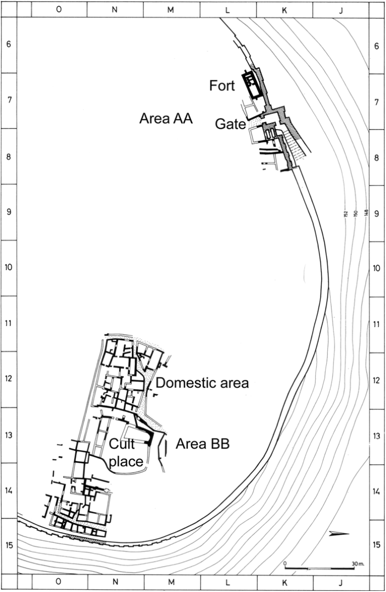
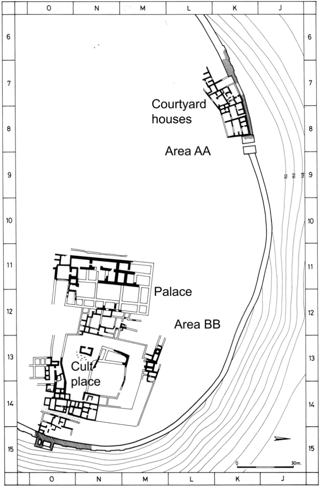
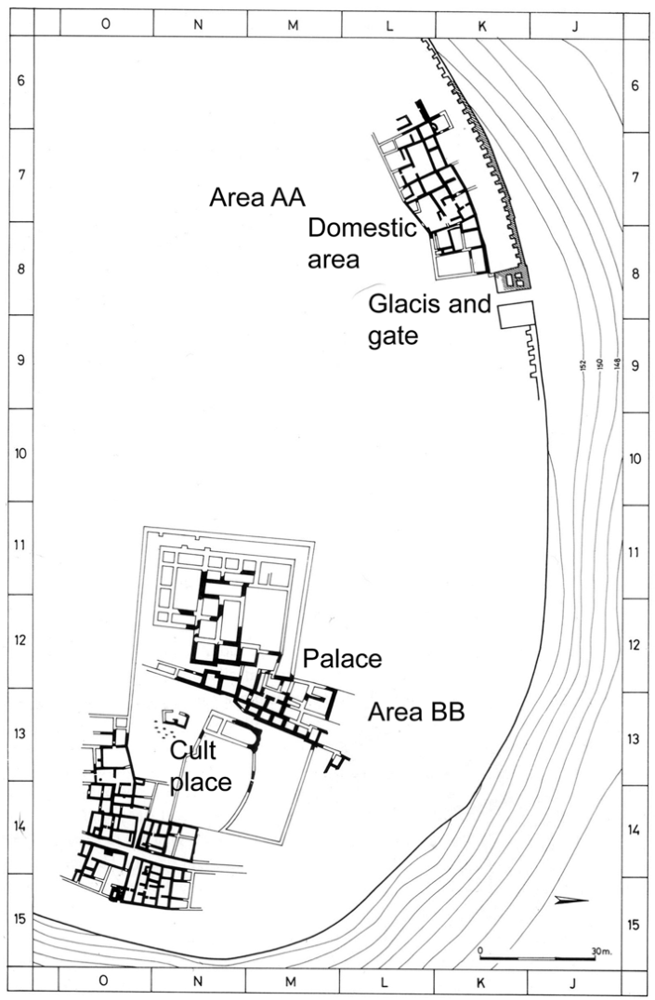
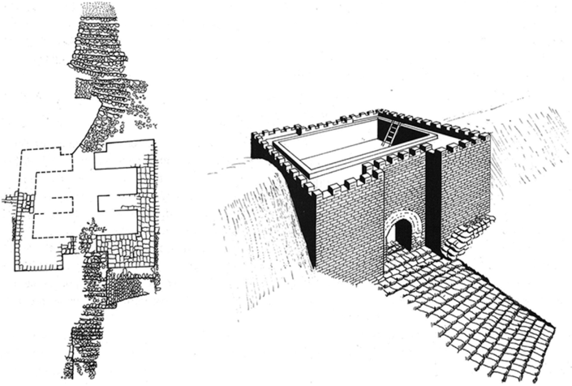
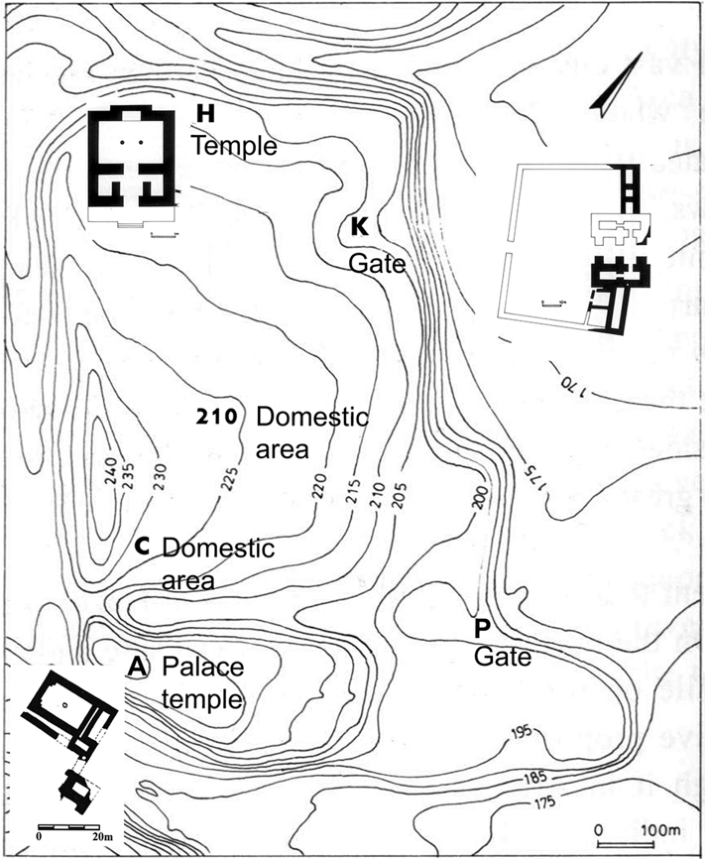

## TWELVE 

# THE MIDDLE BRONZE AGE CANAANITE CITY AS A DOMESTICATING APPARATUS 

#### ASSAF YASUR-LANDAU 

### what is a canaanite city? 

Until the early 1990s, the term “urbanization” for the Middle Bronze Age in reference to the end of the long non-urban hiatus of the Intermediate Bronze Age was used simply to denote the existence of fortifications (Dever 1987: 154). Earthen ramparts became synonymous with urbanization in scholarship (Herzog 1997: 102) or, as put by Raphael Greenberg, “the ramparts were used by its builders to give concrete form to a pre-existing concept of ‘city’; it was a conventional symbol of urbanism” (2002: 109). There was a vivid discussion, however, on the date of the first ramparts in relation to the renewed urbanization. Yigael Yadin weighed in with a notion that the Middle Bronze Age (MB) I was a pre-urban phase, while Moshe Kochavi, Ze’ev Herzog, and others presented the existence of MB I fortifications as proof of the existence of urban sites already in this phase (Herzog 1997: 102, with earlier references). As ramparts were perceived as sharing a common origin in Syria, the urbanization in the Middle Bronze Age southern Levant was frequently connected with northern influence. The rise of Canaanite cities was not considered to be a local evolutionary trajectory but was rather associated with a broader interregional narrative, in which these cities emerged as part of secondary state formation, exogenously inspired by earlier developments in Syria and Mesopotamia. As the region became a periphery of the Syro-Mesopotamian world and was incorporated into inter-regional trade networks, settlements in the southern Levant began indeed to display Syrian traits manifested in 

224 

MIDDLE BRONZE AGE CANAANITE CITY 

225 

monumental architecture, in the form of fortifications, temples, and palaces (Greenberg 2002: 107). 

Contrarily, William Dever (1993) argued that urbanization in the southern Levant must have been different from the Syro-Mesopotamia phenomenon because it developed in a profoundly different ecological environment: Mesopotamia enjoyed rich river plains, while Canaan’s climate and landscape resulted in a lower carrying capacity. These environments were the outset of two different trajectories, leading, necessarily, to different outcomes. For a site to have the capacity to support its own inhabitants without provisions brought from the hinterland, it cannot exceed 6–8 ha in size and a population of 1,500–2,000 people. The first urban centers of Canaan include Tel Dan, Akko, Tel Kabri, Megiddo, Gezer, Aphek, Ashkelon, and Tell el-ʻAjjul (Dever 1993). While Dever’s scale may be exaggeratedly small, the approach that differentiates between the ancient Near Eastern and Mediterranean phenomena of urbanization on the basis of the difference in ecology may well be justified. 

Steven Falconer and Stephen Savage (1995) also argued for different trajectories of development in Levantine and Mesopotamian cities, but they suggested that it stemmed from different forms of interactions between the cities and their hinterland. Perhaps the criteria for urbanism should be more flexible and based on the social and economic functions of a settlement rather than merely on its size. A convenient starting point may be Keith Branigan’s definition of a city, which he presented at the beginning of a conference on urbanism in the Bronze Age Aegean: The city is “a relatively large, dense and permanent settlement of socially heterogeneous individuals, which performs specialist functions, of a non-agricultural type, in relationship to a broader hinterland” (2001: vii). Indeed, as Branigan duly noted, size is not everything in defining cities, but it is rather the social and economic services provided in them that are salient for this definition. Thus, for example, centers of great importance could be deceivingly small in size. Such is the maritime hub of Byblos, known for its elaborate contacts with Egypt; it was remarkably small in the days of the Old Kingdom: only 5 ha with a population of 1,000–2,000 people (Broodbank 2013: 302). 

If so, is the Canaanite city of the Middle Bronze Age a peripheral offshoot of the Syro-Mesopotamian urban core, or does it reflect a local phenomenon that should be divorced from ancient Near Eastern (and other) concepts of urbanization? It will be argued here for a middle ground: The formation of the urban layout of Canaanite cities was a dialectical, highly local process. It entailed an uneasy discourse between the rulers’ will to implement ambitious building plans inspired by Syro-Mesopotamian ideas of monumentality; the realities of the Mediterranean topography; and, just as importantly, the residents’ will to keep their property safe from the expansion of public projects (Yasur-Landau 2011). At the same time, the intra-group tensions created by urbanization resulted in new adaptive methods of conflict resolution, as well as social control over the individuals in urban Canaanite society. 

226 YASUR-LANDAU 

### the layout of the city 

None of the cities in Canaan exhibits overall urban planning of the type seen in Middle Kingdom Egypt, such as the example seen in the layout of the town of Kahun, near the pyramid of Senusret II. Its residents lived in houses whose area, plan, and location had been predetermined in the foundation of the city. Ten elite mansions were located on both sides of the main east–west road in Kahun. A possible temple stood on the acropolis in the eastern part of the site. Insulae of small houses were located to its south. The western sector, separated by a wall from the rest of the town, consisted of long blocks of humble four- and fiveroom houses separated by east–west streets (Petrie 1891: 5–6, pl. XIV; Kemp 2006: 211–13). William Flinders Petrie suggested that these may have been the houses of the workmen and their families. The town was planned by a literate administration that used measured blueprints. An inscribed limestone tablet from Kahun reads: “A four house block – 30 � 20 cubits,” most likely marking the place for four small houses to be built in a total area of 15 � 10 m (Kemp 2006: 195). Though southern Levantines must have visited similar planned settlements, such as the 12th Dynasty town at Tell el-Dabʻa (Bietak 1996: 9; 2010: 17, fig. 11), they never implemented this idea in Canaan. The concept of dividing urban space by streets was not adopted in the southern Levant during the Middle and Late Bronze Age, as it was employed in Syria and even on Cyprus, as demonstrated by the orthogonal or semi-orthogonal plan of Tell Halawa on the Upper Euphrates during the MB II (Akkermans and Schwartz 2003: 307) and by thirteenth-century BCE Enkomi on Cyprus, where parallel east–west streets intersect with long north–south streets (Fisher 2014: 191–5). 

As we will see below, the layouts of Canaanite cities were, to an extent, influenced by notions of monumentality emitting from Syria. There, the urban layout was determined largely by imposing massive building projects of fortifications, temples, and palaces on the urban landscapes – a concept that was inspired by Mesopotamia. The cases of Ebla and Qatna, both reflecting Middle Bronze Age planning, demonstrate this ideal well: Paolo Matthiae (2013: 265) regards the foundation of Ebla in the twenthieth century BCE as de novo. The town was divided in two: the acropolis, surrounded by its own fortifications, and the lower town, which encircled the acropolis and was fortified by a huge earthen rampart. Rather than being centralized in one place, power was divided between palaces on the acropolis (the royal residence) and the lower town (Matthiae 2013: 274–5). This entire plan is probably the result of preplanning the locations of the main features at the site (Pinnock 2001: 22). The alteration of landscape by ramparts in the early Middle Bronze Age is manifested well in the huge rectangular plan of Qatna, probably devised during the MB I, with gates facing the four cardinal directions (Burke 2008: 213–17; Morandi Bonacossi 2014: 275). 

MIDDLE BRONZE AGE CANAANITE CITY 

227 

As massive earthen ramparts represent an imported Syro-Mesopotamian feature found in most southern Levantine tells, it is important to examine their function in the urban landscape in order to see their impact on urban communities in Canaan. The ramparts were used for the defense of the urban population; their massive appearance alone may have deterred potential external threats (Burke 2008). This, however, is only a part of the story. 

While enemies and competitors witnessed the might of the ramparts infrequently, those who lived in the cities experienced them daily: In imagination and perception, the imposing rampart settlement, emerging from amidst the flat plains of Syria and Mesopotamia, acted as a symbolic deterrent, a manifestation of strength, and a constant looming reminder to the inhabitants of the ruler’s power. The Epic of Gilgamesh begins with an invitation to see the mighty walls of Uruk, built by the legendary king Gilgamesh: “see the upper wall, whose face gleams like copper. See its lower course, which nothing will equal!” (Foster 2001: 3). Warad-Sîn, who built the wall of Ur, aspired to achieve a similar psychological effect: “I made its height suppressing, had it release its terrifying aura” (E4.2.13.21 lines 80–95 [Frayne 1990: 243]). In the Mesopotamian experience, this imaginative aura was actually created by a heavy physical presence, blocking out the light: The city walls cast long shadows over the smaller houses below them. These shadows also extended outside the town: Adam Smith (2003: 216) described how, during the late third and early second millennia BCE, the imposing tell of Ur (currently 20 m higher than its surroundings) would have thrown a long shadow over the plain during sunset. The diminishing light was accompanied by the restriction of movement: Gates, cosmologically aligned with the cardinal directions, were not merely an element in the fortification system; they were used by rulers to regulate the entry into and exit from a city, controlling the access of residents to their homes in the city and their fields outside it (Stone 1995: 240; Smith 2003: 216). 

While the gates were used to control access, the top of the wide ramparts was used, no doubt, for patrols that overlooked both the city and the land outside it. Thus, in a letter regarding the defense of the Yaminite town Mišlan, during the revolt against Zimri-lim, king of Mari, such patrols are mentioned: “Mišlan is well; your brother Yaggih-Addu is well . . . We, your servants, are well. No one is neglecting the patrol of the rampart and the gates” (Fleming 2004: 74). We learn from this that the wide ramparts and gates were also areas in which troops patrolled. 

Walls were not the only measure by which rulership manifested its power. Their construction was, at times, accompanied by the construction of monumental architecture within the city. For example, after the collapse of the Sargonid dynasty, King Ur-Nammu restored Ur’s independence from Uruk by rebuilding the city wall and carrying out a vast building program within the city, focusing on cultic structures. He constructed the Ziggurat of Ur-Nammu 

228 YASUR-LANDAU 

and the great terrace (temenos) as well as refurbished the Temples of Nanna and Ningal (Smith 2003: 193). 

### two regional narratives of cities: hazor and megiddo 

It was argued above that the shape of Middle Bronze Age sites enclosed in ramparts, such as Hazor, Tel Dan, and Tel Kabri, indicates that the builders had an ideal plan in mind of a Syrian city, such as Ebla or Qatna, in which the site is given a regular plan, either oval or rectangular (Kempinski 1992a). However, the attempt to recreate a foreign political landscape met with the difficult reality of the Mediterranean landscape, bringing about tension between imagination and experience in the creation of a political landscape (cf. Smith 2003: 72–3, 202–20). The symmetrical shape of the site and the prerequisite that it be considerably higher than its surroundings (in order to emit the desired “fearful aura”) can only be achieved in alluvial areas. These, however, are not common in the fragmented Mediterranean landscape, where some mountainous sites, such as Jerusalem, had to be located in a lower position than some hills surrounding them. The following examples of cities do not present an exhaustive catalog; instead, they illustrate the pronounced variety of city layouts in the formative era of the Middle Bronze Age, while continuing the regional narrative of the development of complexity, which began in the previous period. 

#### Megiddo: From Village to City with Resisting Inhabitants 

Large-scale construction projects were severely hindered in MB II Megiddo because of the considerable height of the Early Bronze Age tell and the existence of the large unfortified MB I settlement in Strata XIV and XIIIb, with the open-air cultic site taking up much of the central area of the tell (Loud 1948: 84; Kempinski 1989: 178). The transition from village to city at Megiddo was gradual and does not seem to reflect the implementation of a Syro-Mesopotamian building plan combining the elements of temples, a palace, and massive fortifications. There was never any attempt to alter the shape of the tell as there was at Hazor, Tel Kabri, Ashkelon, and Tel Dan by constructing a massive earthen rampart. Therefore, the site was never enlarged in a significant manner to accommodate both the building of the MB I fortifications and the natural development of domestic areas. This situation caused great friction and led to a power struggle between the ruling elite and the private householders throughout most of the Middle Bronze Age, especially in the area adjacent to the walls. 

Stratum XIII in Area AA at Megiddo, dated to mid-MB I, is characterized by the appearance of a well-planned, elaborate fortification system (Loud 1948: 6–8, fig. 378; Burke 2008: 291–2) (Fig. 12.1). It includes a stepped approach, a 

MIDDLE BRONZE AGE CANAANITE CITY 

229 

12.1. Megiddo Stratum XIII (from Herzog 1997: fig. 4.2). (Altered by A. Yasur-Landau. Courtesy of Z. Herzog, Tel Aviv University.) 

YASUR-LANDAU 

230 

gate, a brick city-wall, and an inner tower or small fort (L4014 [Loud 1948: fig. 378]) – a solid rectangular structure similar in shape to the one found by the south gate at Gezer (Herzog 1997: fig. 4.20). This development was not accompanied by the building of a palace or temples. Rather, the area next to the open-air cult precinct in Area BB was filled with densely packed domestic structures in Stratum XIIIb (Loud 1948: figs. 306, 307; Kempinski 1989: figs. 27, 28). Indeed, the transition to a city was probably gradual and included a phase featuring a large fortified village with narrow twisting alleys. 

The first palace at Megiddo can be seen only in Stratum XII, Area BB (Loud 1948: fig. 308; Kempinski 1989: fig. 29; Herzog 1997: 104–7), built next to the sacred area (Fig. 12.2). This vast multi-room structure replaced the domestic structures preceding it. The evacuation of residents from Area BB was accompanied by the construction of dwellings at the expense of previous fortifications in Area AA. The gate to the town was presumably moved to the east, while the formal architecture of the Stratum XIII gate and tower in Area AA was replaced by at least three large courtyard houses (Loud 1948: figs. 23, 378). Their northern wall was adjacent to the city’s fortification, and a street ran to their south. Burials were dug below the floors of these houses (T. 4094, 4099, 4107, 4108). Is it possible that these new houses were built to compensate the residents evicted from the area that had been reassigned for the construction of the new palace? 

The pendulum swung again toward rulership initiatives in the days of Stratum XI, the transition between MB I and MB II (Loud 1948: fig. 379; Burke 2008: 292), when a new fortification program was implemented, including the addition of an eastern rampart, a glacis, and a gate (Fig. 12.3). The elaboration of the fortifications obliterated the Stratum XII courtyard houses. A new street separated the fortifications from a new group of houses built to the south, facilitating quick access to the wall, unhindered by private houses. 

In a previous publication, I suggested that the resistance to public building projects by people whose houses these projects compromised was expressed in Stratum XI in a new venue of legitimizing private ownership: multiple burial tombs (Yasur-Landau 2011). These were found in Area AA (T. 4055 + 4056, 3175, 4099 [Loud 1948: figs. 29, 32]) and in Area BB (T. 3075, 3085 [Loud 1948: fig. 218]), and contained vast amounts of pottery and jewelry, representing multiple generations of burials. In constructing these tombs, the house became not only the residence of its current inhabitants but a manifestation of a lineage, which included both the living and their ancestors. These may be interpreted as reciprocal relations: the living honored the dead, perhaps also with offerings and feasts, and the dead, ever present in their own subterranean room of the house, gave historical depth and legitimacy to the claims of the living to their property. 

MIDDLE BRONZE AGE CANAANITE CITY 

231 

12.2. Megiddo Stratum XII (from Herzog 1997: fig. 4.3). (Altered by A. Yasur-Landau. Courtesy of Z. Herzog, Tel Aviv University.) 

YASUR-LANDAU 

232 

It seems that Syro-Mesopotamian ideas about monumentality and even Syrian-inspired architecture had little effect on the development of Megiddo as an urban center. As stated, a rampart was never constructed in order to reshape the site. The other two characteristics of Syrian architecture appear only in the late MB II Stratum X: the three-chamber Syrian gate in Area AA, and a Syrian-style migdol temple replacing the open-air cult area in Area BB (Kempinski 1989: fig. 34). 

#### The Hula Valley: A Failed Attempt of Urbanization at Tel Dan and the Implementation of a Syrian Model at Hazor 

The implementation at Tel Dan of a Syrian-inspired fortification system, including a rampart and a chambered gate, built over a preexisting, large unfortified settlement, did not result in the desired effect – that is, turning the site into a lasting urban center (Fig. 12.4). Dan was fortified during the latest part of the MB I or during the transition into the MB II (Biran 1994: 62; Ilan 1996: 164–5; Greenberg 2002: 35). The impressive fortification system included a rampart that had a stone core and encircled the entire tell, and a gate found in Area K. This massive, six-pier brick gate reflects imported Syrian architectural traditions. Surprisingly, this fortification system was used for only a brief period of time. It was built during Stratum XI, and the small pottery assemblage found on the gate’s latest floor provides a terminus ante quem for its latest use (Biran 1994: 82, fig. 50), assigning it to the same stratum in which it – was built, possibly the transitional MB I MB II. Though an attempt was made to give the site a regular shape by the construction of the ramparts, the spring’s location had to be considered and was probably the reason for positioning the gates off the cardinal directions, hindering a more ideal design (Kempinski 1992a). 

Still, as may have been predicted, the construction of the ramparts brought about a dramatic change in the use of available space for habitation and fortification. In Area B, MB I domestic levels belonging to Stratum XII were buried under the rampart (Biran 1994: 51). The possible clash between ancestral rights over land and the ruling elites’ will to construct monumental architecture, as seen at Megiddo, is evident also at Tel Dan in Area Y. Tombs 1025 and 902c, d, which were probably located originally below the floors of houses, were uncovered in this area, sealed by the rampart (Ilan 1996: 164, 202–8). The building of fortifications on top of domestic structures was no doubt an action dictated, in part, by the politics of inclusion and exclusion, which, in turn, led to social instability at the site. This may have played a role in the rapid decline of Tel Dan soon thereafter (Yasur-Landau 2011). During the MB II, Tel Dan’s magnificent Syrian gate was blocked up, and finds from tombs at the site indicate that Tel Dan’s links to trade and 

MIDDLE BRONZE AGE CANAANITE CITY 

233 

12.3. Megiddo Stratum XI (from Herzog 1997: fig. 4.17). (Altered by A. Yasur-Landau. Courtesy of Z. Herzog, Tel Aviv University.) 

YASUR-LANDAU 

234 

12.4. Plan and reconstruction of the Tel Dan gate (from Herzog 1997: fig. 4.7). (Courtesy of Z. Herzog, Tel Aviv University.) 

influence from outside the region were almost completely severed. In fact, it is likely that the site, possibly with no functioning fortifications, became Hazor’s subordinate shortly after its sudden rise in the MB II (Maeir 2000: 39). 

In contrast to Megiddo, the evidence at Hazor suggests that the site was founded based on a preplanned Syrian model, with the location of the palace, temples, and fortifications determined from the outset (Fig. 12.5). The first settlement at the site was a small village built no earlier than the MB I–MB II transition, as indicated by tombs and scattered pottery on the upper tell. Immediately afterward, possibly in the earliest phase of the MB II, the site was fortified with an immense rampart, adding a huge lower town to the existing upper tell, which amounted to a total area of ca. 74 ha (Maeir 1997: 327; Ben-Tor 2004: 51; Burke 2008: 265–71). 

The urban layout of Middle Bronze Age Hazor demonstrates the result of preplanning that took into account monumental architecture, while allowing some leeway for the internal development of domestic architecture (Kempinski 1992b: 125; for a discussion on the residential neighborhood in Area C, see below). The upper tell, Area A, was dedicated to temples and possibly also to a palace. A Middle Bronze Age temple excavated there presents a symmetrical Syrian plan (Zuckerman 2012: 110–12; Ben-Tor et al. 2017). The lower tell included formal structures of distinct Syrian style, such as the Orthostats Temple in Area H (Yadin 1972: 75–9; Ben-Tor 1989: plans XXXVII, XLI) and the three-chambered Middle Bronze Age gates in Areas 

MIDDLE BRONZE AGE CANAANITE CITY 

235 

12.5. Plan of Hazor, with MB II symmetrical (“Syrian”) temples in Areas A and H, and a “Syrian” gate in Area K (from Herzog 1997: fig. 4.8 A, C, D and after Zuckerman 2012: fig. 2). (Courtesy of Z. Herzog, Tel Aviv University.) 

K and P (Yadin 1972: 58–65; Ben-Tor 1989: plan XLII; Mazar 1997: plan V.2, V.4). The dispersal of these monuments over the urban landscape in a manner reminiscent of Ebla’s plan brought Ruhama Bonfil and Anabel ZarzeckiPeleg (2007: 27) to propose, tentatively, that Hazor, as suggested for Ebla, was divided into quarters; however, in the absence of a clear street system for Hazor, it is difficult to test this hypothesis. 

The sudden massive construction project at Hazor during the MB II and the contemporary appearance of the many examples of Syrian-style architecture at 

236 

YASUR-LANDAU 

the site were no coincidence. Middle Bronze Age cuneiform tablets from the site reveal its prominent position in the international economic and cultural networks of the Old Babylonian period. Hazor is not only a rare example of Middle Bronze Age Canaanite literacy, it is also the only site in the southern Levant mentioned in texts from the Mari archive (e.g., Malamat 1989: 52–69), and it was likely unique in the southern Levant in regards to implementing a literate administration using cuneiform script (Horowitz and Oshima 2006: 65–80). In fact, the appearance of the full Syrian, urban architecture package, complete with cuneiform script, in a place in which only a small village existed before, may indicate the direct involvement of powers from Syria in the foundation and construction of the city. 

### stability and change in the urban layout 

Thus, flawed as it is, a city is born. As most cities in the Middle Bronze Age existed continuously from their founding, through the rest of this long period and well into the Late Bronze Age, it is important to present here several examples of continuity versus change in the urban layout. 

During the Ur III and Old Babylonian periods in southern Mesopotamia, there were no strict rules about the location of palaces within a city. In some cities, they were built next to temples, such as the cases of Larsa, Eshnunna, and the Ehursag at Ur, where the palace was constructed adjacent to a temple complex (Smith 2003: 214). The location of palaces was dynamic also in Syrian cities. The Late Bronze Age royal palace of Qatna was built upon an earlier Middle Bronze Age cultic area, rather than over an earlier MB II palace (the “eastern palace”), which was located to the east of its successor. Other palaces were built at Hazor in the Late Bronze Age, in addition to the royal palace: to its south, the “southern palace” in Area C and to its north, the “lower city palace” in Area K (Morandi Bonacossi 2014). 

At Megiddo, the location of the palace changed during the Middle Bronze Age, while the location of the central cult place did not. The sacred precinct of Megiddo enjoyed surprisingly uninterrupted longevity beginning as early as the Early Bronze Age, when it boasted a series of temples (Kempinski 1989: figs. 24–28). From the Intermediate Bronze Age well into MB II Stratum XI, this area was maintained as an open-air cult place, encircled by a temenos wall (Loud 1948: fig. 309; Kempinski 1989: 33). A Syrian-style migdol temple replaced the open-air cult area in Stratum X and maintained its position until the destruction of Megiddo at the end of the Late Bronze Age (Kempinski 1989: figs, 34, 42). The palace, however, changed locations. During Strata XII, XI, and X (Kempinski 1989: figs. 29, 33, 34; Herzog 1997: 104–7, 150–3), it stood in Area BB next to the sacred area, perhaps drawing legitimacy from it. In Stratum IX onward, following the gradual rise 

MIDDLE BRONZE AGE CANAANITE CITY 

237 

to power of a family residing in a house west of the city gate, the main palace of the city was relocated to Area AA, where it remained until the final destruction of the Late Bronze Age city in Stratum VII (Kempinski 1989: figs. 37, 38, 41; Herzog 1997: 165–9). The palace was replaced by the monumental “Nordburg” structure (perhaps non-palatial public structure), which existed in the Late Bronze Age (LB) II (Finkelstein, Ussishkin, and Halpern 2006: 847). 

In sharp contrast to these examples of profound change, the city of Hazor with its pronounced Syrian connections displays impressive architectural continuity from the Middle to Late Bronze Age (Bonfil and Zarzecki-Peleg 2007: 26–7, fig. 1). During the LB II, the area of the acropolis was taken up by a large cultic complex (Area A), which included Building 7050 and two adjacent temples and a grand palace, still unexcavated (Area M and the areas between A and M [Zuckerman 2010; cf. Bonfil and Zarzecki-Peleg 2007, who view Building 7050 as a ceremonial palace]). The Area A complex stood on top of an earlier Middle Bronze Age complex of a temple (Zuckerman 2012: 100–12) and a palace; the latter is known from very few remains. In the lower town, a cult place existed in Area F from the MB II until the LB II (Yadin 1972: 42–6, 95–102). The structures in this area changed over time, but the area’s function remained cultic. Similarly, the Area H Syrian-style migdol temple was in continuous use from the late MB II to the LB II (Yadin 1972: 75–95; Zuckerman 2012: 105–6). The location of the excavated gates in Areas K and P was maintained from the MB II to the LB II (Yadin 1972: 58–65). The minimal or absence of change in the areas designated at Hazor for fortification, the palace, and major cultic precincts may indicate that, similar to Ebla (see above), the major monumental or public features had been preplanned. The fact that the essence of this plan was maintained for centuries is a testimony to the strength of the rulership at Hazor. 

### a service approach to activities inside the canaanite city 

The work of Benjamin Stanley and his colleagues (2016) on service access in premodern cities provides compelling evidence of inequality between elites and non-elites in access to religious services, assembly places, and market areas. However, access overall was better in small cities than in larger ones. This service approach allows for the examination of who benefitted from Middle Bronze Age urbanization. The level of services available to the residents of Canaanite cities during the Middle and Late Bronze Age appears to have been low. 

In terms of sanitation, few non-palatial structures had access to built-in drains, in contrast to palatial structures. This is evident in residential Area C at Hazor, where few drains lead from houses (Yadin 1972: 28–38). At other 

238 

YASUR-LANDAU 

sites where drains did exist, they diverted water from the main streets closest to the city wall into the gate area or under the wall itself (e.g., Tell Beit Mirsim, MB II Strata E and D [Herzog 1997: fig. 4.15, 16]; Hazor MB II, lower city, Strata 4 and 3 [Yadin 1972: 65–6]; Jericho MB II [Herzog 1997: fig. 4.12]; Megiddo, LB II Stratum VIII [Loud 1948: fig. 382]). 

It is possible that at some sites water was provided to the inhabitants within the city, very likely for purposes of defense rather than simply to provide amenities for residents. Apparently, these sites each had a single water source that could be tightly controlled by the government. The springs of Tel Dan and Tel Kabri enabled year-round access to fresh water from within the city; the situation may have been similar in Jericho if indeed the spring was contained within the fortification line (Herzog 1997: fig. 4.11). There are indications that elaborate water systems were also constructed during the Middle Bronze Age; for example, a massive MB II fortification system in Jerusalem protected the Gihon Spring and the associated rock-cut water system (Maeir 2011: 176–7). Recent work at Gezer suggests that the rockcut water management system there may also date to the Middle Bronze Age (Warner 2013). At Hazor, a large water reservoir dating to the late Middle Bronze Age or the Late Bronze Age, found on the upper tell, was very likely limited to the use of the palace (Yadin 1972: 127). 

Assessing the accessibility of religious services to the townspeople is difficult. Formal direct access to temples and their courtyards were probably off limits to the majority of the populace, while open-air sanctuaries, as at Megiddo and Gezer, could offer a line of vision that would enable some form of wider public participation. At the same time, there is evidence – although more scarce – of more vernacular cult places that serviced the neighborhoods, such as the one in Area C at Hazor (Zukerman 2012: 102–3). 

The largest open areas in these cities were the courtyards of the palaces and the temples. However, the winding, very narrow streets of most towns precluded the existence of large open-air markets in the cities and large assembly areas. Shops may have operated from the ground floors of domestic structures, as suggested for Jericho (Ziffer 1990: 17–18, fig. 11). 

It would be perhaps overly optimistic to assume that the ramparts, walls, and gates were intended mainly for their value as protection of the citizens and rulers. Rather, beyond a deterrent of prospective enemies, they were a measure of population control. Entry to the city was limited to existing gates and their operating hours. As argued above, the shadow cast by the walls and ramparts was a constant reminder of their powers of restriction. The mere construction of the wall and rampart created an inherent crisis by limiting the available space for new private houses to be built and causing the phenomenon of densely built residential neighborhoods, which strived to use every square meter of available space. 

MIDDLE BRONZE AGE CANAANITE CITY 

239 

### conclusions: the city as an apparatus for domestication 

Was there a direct line of influence leading from Ebla and Qatna to the southern Levant, and was Canaanite urbanization a secondary or tertiary derivative of early second-millennium BCE Syrian urbanization? The distinctively different trajectories emerging from Megiddo, Tel Dan, and Hazor suggest that urbanization in the southern Levant during the Middle Bronze Age bore more resemblance to Italo Calvino’s Invisible Cities (1974) then to V. Gordon Childe’s model cities (1950). Each of the Canaanite sites had its own history, story, and formation process. A comparison between the first appearances of “Syrian”-style Middle Bronze Age city-gates, fortifications, temples, and palaces paints a considerably complex picture. Sites such as Megiddo and Aphek became cities during the MB I without adopting any visible Syrian trait, including the rampart (Yasur-Landau 2011). Ramparts first appeared in mid-MB I in southern coastal sites (Ashkelon, Yavneh-Yam) and in the north coast only late in the MB I (Akko, Tel Kabri). While ramparts differ significantly from one another in detail, architectural features with distinctive Syrian traits – gates and temples – only began to appear at urban sites in the transitional MB I–II (with the earliest being Tel Dan) but mainly in the MB II (at sites such as Ashkelon and Hazor). This chronological scheme advises against the approach that perceives a sudden transition from the initial pre-urban phase to the emergence of permanent fortified settlements, inspired by the SyroMesopotamian powers (Greenberg 2002: 106–7). This being said, the Hula Valley, much closer to Syria than to the Levantine coast, is likely an exception to the rule, with the massive and sudden implementation of a Syrian city layout in Hazor. 

A portrait of the city as reflected through the social and economic services provided in it may cast a shadow over the joys of urbanization. The image of a city with crowded people within its walls, who have limited or no access to services provided by the public structures, does not reflect an effort of the ruling elite to bring the fruits and benefits of urbanization to most of the city’s residents. Urbanization may actually be better portrayed as a deliberate domestication process aimed at controlling the populace. The houses buried underneath the fortifications at Tel Kabri and Tel Dan (Yasur-Landau 2011) and, no doubt, at other sites demonstrate the forcefulness of this process. The possible resistance of homeowners at Megiddo, building their houses over land formerly allotted to fortification, suggests that it took time for this domestication process to take effect. 

Indeed, it seems that urbanization contributed to the taming of the Canaanite population at least in one aspect – a change in the persona of Canaanite males regarding engagement in single combat. Warrior tombs are a common trait of the MB I (Philip 1995; Cohen 2012). These are single interments with weapons, such as daggers, spearheads, and axes, all connected with hand-to-hand combat. They represent a pre-urban reality in which, as vividly depicted in the duel-to-the-death scene in the contemporary Tale of 

YASUR-LANDAU 

240 

Sinuhe, intergroup conflicts were resolved through socially accepted violence (Parkinson 1997: 32 B 100–106; Rainey and Notley 2006: 54). 

To my mind, it is not accidental that warrior tombs become rarer toward the end of the MB I, as urban centers become common across Canaan. A recent study of lethal human violence, encompassing numerous past and present societies of various sociopolitical organizations, has pointed to a sharp decrease in the level of personal violence in states in comparison to chiefdoms, which is attributed to the monopolization of the legitimate use of violence by the state (Gómez et al. 2016). This may certainly explain partly the impact of urbanization on Canaanite society; that is, urbanization in Canaan created a balance between the warrior ideal that was still a celebrated notion, crucial for the protection of the city, and the state monopoly on violence – a balance that was reached in contemporary Amorite-dominated Mari (Bonneterre 1995). 

The adoption of some elements of the Syro-Mesopotamian judiciary system by Hazor is reflected in an Akkadian tablet discussing a legal case brought before the king, regarding real estate in the territory of Hazor (Horowitz and Oshima 2006: 69–72). While we cannot be certain if this imported disputesolving mechanism alleviated general tensions in the city, it doubtless strengthened the power of the ruler over the urban population. 

At the same time, it is possible that the new living conditions of large communities, crowded in limited urban spaces, created additional adaptation mechanisms for solving internal strife in the urban neighborhoods of Canaanite cities. These mechanisms depended only on the power of the ruler, while working on multiple levels – from the household level to kinship group and from the neighborhood level to that of the city and the polity. 

It is possible that mechanisms for preventing violent conflicts were similar to some systems of local leadership in Old Babylonian Amorite cities. There, neighborhoods (babtu¯) functioned as villages within cities and had their own local government system, including a mayor and elders (Potts 1997: 216–17; Schloen 2001: 287). Additional power for conflict resolution was held in the hands of elder assemblies (puhrum) and mayors (rabia¯nu¯) whose power was acknowledged by the king, the highest instance of law (Yoffee 2000: 55–8; Fleming 2004: 190–211). 

With multiple tiers of enforcement and control over the individual, intragroup violence could be kept at bay even when the competition for living space within a city increased with population growth at the same time as a ruler sought to execute more ambitious building plans at the expense of private dwellings. Even in cases where there is evidence of high tension between residents and the ruling elite, such as at Megiddo, the urban nature of the site remained intact. Perhaps, somewhat pessimistically, the advent of the city should be regarded as a self-sharpening instrument of control, both decreasing internal strife and increasing the control of the ruling elite. 

MIDDLE BRONZE AGE CANAANITE CITY 

241 

### acknowledgments 

I would like to thank Norman Yoffee and Guillermo Algaze for the most enlightening discussions on Near Eastern urbanization(s) and complex societies during the process of writing this chapter. This chapter is dedicated to Ze’ev Herzog, pioneer of the study of urban planning in ancient Israel. 

### references 

- Akkermans, P. M. M. G., and Schwartz, G. M. 2003. The Archaeology of Syria: From Complex Hunter-Gatherers to Early Urban Societies (c. 16,000–300 BC). CWA. Cambridge: Cambridge University Press. 

- Ben-Tor, A. 2004. Hazor and Chronology. Egypt and the Levant 14: 45–67. 

- Ben-Tor, A., ed. 1989. Hazor III–IV: An Account of the Third and Fourth Seasons of Excavations, 1957–1958, Vol. 2: Text. Jerusalem: IES; The Hebrew University of Jerusalem. 

- Ben-Tor, A.; Zuckerman, S.; Bechar, S.; and Sandhaus, D. 2017. Hazor VII: The 1990–2012 Excavations; The Bronze Age. Jerusalem; IES; The Institute of Archaeology, The Hebrew University of Jerusalem. 

- ʻ 

- Bietak, M. 1996. Avaris, the Capital of the Hyksos: Recent Excavations at Tell el-Dab a; The First Raymond and Beverly Sackler Foundation Distinguished Lecture in Egyptology. London: British Museum Press. 

2010. Houses, Palaces and Development of Social Structure in Avaris. In Cities and Urbanism in Ancient Egypt: Papers from a Workshop in November 2006 at the Austrian Academy of Sciences, ed. M. Bietak, E. Czerny, and I. Forstner-Müller, 11–68. DG 60; UZKOAI 35. Vienna: Austrian Academy of Sciences. 

- Biran, A. 1994. Biblical Dan. Jerusalem: IES; Hebrew Union College–Jewish Institute of Religion. 

- Bonfil, R., and Zarzecki-Peleg, A. 2007. The Palace in the Upper City of Hazor as an Expression of a Syrian Architectural Paradigm. BASOR 348: 25–47. 

- Bonneterre, D. 1995. The Structure of Violence in the Kingdom of Mari. BCSMS 30: 11–22. 

- Branigan, K. 2001. Preface. In Urbanism in the Aegean Bronze Age, ed. K. Branigan, vii–ix. SSAA. Sheffield: Sheffield Academic. 

- Broodbank, C. 2013. The Making of the Middle Sea: A History of the Mediterranean from the Beginning to the Emergence of the Classical World. London: Thames & Hudson. 

- Burke, A. A. 2008. “Walled Up to Heaven”: The Evolution of Middle Bronze Age Fortification Strategies in the Levant. SAHL 4. Winona Lake, IN: Eisenbrauns. 

- Calvino, I. 1974. Invisible Cities. Trans. W. Weaver, from Italian. Orlando: Harcourt. 

- Childe, V. G. 1950. The Urban Revolution. TPR 21 (1): 3–17. 

- Cohen, S. L. 2012. Weaponry and Warrior Burials: Patterns of Disposal and Social 

- Change in the Southern Levant. In The 7th International Congress on the Archaeology of the Ancient Near East, 12 April–16 April 2010, the British Museum and UCL, London, Vol. 1: Mega-Cities & Mega-Sites – The Archaeology of Consumption & Disposal – Landscape, Transport & Communication, ed. R. Matthews and J. Curtis, 307–19. Wiesbaden: Harrassowitz. 

- Dever, W. G. 1987. Archaeological Sources for the History of Palestine: The Middle Bronze Age; The Zenith of the Urban Canaanite Era. BA 50: 148–77. 

YASUR-LANDAU 

242 

1993. The Rise of Complexity in the Land of Israel in the Early Second Millennium B.C.E. In Biblical Archaeology Today, 1990: Proceedings of the Second International Congress on Biblical Archaeology, Supplement: Pre-Congress Symposium: Population, Production and Power, ed. A. Biran and J. Aviram, 98–109. Jerusalem: IES. 

- Falconer, S. E., and Savage, S. H. 1995. Heartlands and Hinterlands: Alternative Trajectories of Early Urbanization in Mesopotamia and the Southern Levant. AA 60: 37–58. 

- Finkelstein, I.; Ussishkin, D.; and Halpern, B. 2006. Archaeological and Historical Conclusions. In Megiddo IV: The 1998–2002 Seasons, Vol. 2, ed. I. Finkelstein, D. Ussishkin, and B. Halpern, 843–59. MSSMNIA 24. Tel Aviv: Emery and Claire Yass Publications in Archaeology. 

- Fisher, K. D. 2014. Making the First Cities on Cyprus: Urbanism and Social Change in the Late Bronze Age. In Making Ancient Cities: Space and Place in Early Urban Societies, ed. A. T. Creekmore III and K. D. Fisher, 181–219. Cambridge: Cambridge University Press. 

- Fleming, D. E. 2004. Democracy’s Ancient Ancestors: Mari and Early Collective Governance. Cambridge: Cambridge University Press. 

- Foster, B. R., ed. 2001. The Epic of Gilgamesh: A New Translation, Analogues, Criticism. Norton Critical Edition. New York: Norton. 

- Frayne, D. R. 1990. The Royal Inscriptions of Mesopotamia: Early Periods, Vol. 4: Old Babylonian Period (2003–1595 BC). Toronto: University of Toronto Press. 

- Gómez, J. M.; Verdú, M.; González-Megías, A.; and Méndez, M. 2016. The Phylogenetic Roots of Human Lethal Violence. Nature 538: 233–7. 

- Greenberg, R. 2002. Early Urbanizations in the Levant: A Regional Narrative. NAAA. London: Leicester University Press. 

- Herzog, Z. 1997. Archaeology of the City: Urban Planning in Ancient Israel and Its Social Implications. MSSMNIA 13. Tel Aviv: Emery and Claire Yass Publications in Archaeology. 

- Horowitz, W., and Oshima, T. 2006. Cuneiform in Canaan: Cuneiform Sources from the Land of Israel in Ancient Times. Jerusalem: IES; The Hebrew University of Jerusalem. 

- Ilan, D. 1996. The Middle Bronze Age Tombs. In Dan 1: A Chronicle of the Excavations, the Pottery Neolithic, the Early Bronze Age and the Middle Bronze Age Tombs, ed. A. Biran, – – 

- D. Ilan, and R. Greenberg, 163 267. ANGSBAJ. Jerusalem: Hebrew Union College Jewish Institute of Religion. 

- Kemp, B. J. 2006. Ancient Egypt: Anatomy of a Civilization. 2nd ed. London: Routledge. 

- 1992a. Dan and Kabri – A Note on the Planning of Two Cities. ErIsr 23: 76–81 (Hebrew). 

- 1992b. Urbanization and Town Plans in the Middle Bronze Age II. In The Architecture of Ancient Israel: From the Prehistoric to the Persian Period in Memory of Immanuel (Munya) Dunayevsky, ed. A. Kempinski and R. Reich, 121–6. Jerusalem: IES. 

- Loud, G. 1948. Megiddo II: Seasons of 1935–39. OIP 62. Chicago: The University of Chicago Press. 

- Maeir, A. M. 1997. Tomb 1181: A Multiple-Internment Burial Cave of the Transitional Middle Bronze Age IIA–B. In Hazor V: An Account of the Fifth Season of Excavation, 1968, ed. A. Ben-Tor and R. Bonfil, 295–340. Jerusalem: IES; The Hebrew University of Jerusalem. 

2000. The Political and Economic Status of MB II Hazor and MB II Trade: An Interand Intra-Regional View. PEQ 132: 37–58. 

MIDDLE BRONZE AGE CANAANITE CITY 

243 

2011. The Archaeology of Early Jerusalem: From the Late Proto-Historic Periods 

- (ca. 5th Millennium) to the End of the Late Bronze Age (ca. 1200 B.C.E.). In 

- Unearthing Jerusalem: 150 Years of Archaeological Research in the Holy City, ed. K. Galor and G. Avni, 171–87. Winona Lake, IN: Eisenbrauns. 

- Malamat, A. 1989. Mari and the Early Israelite Experience. Schweich Lectures 1984. Oxford: Published for the British Academy by Oxford University Press. 

- Matthiae, P. 2013. Studies on the Archaeology of Ebla, 1980–2010. Wiesbaden: Harrassowitz. 

- Mazar, A. 1997. Area P. In Hazor V: An Account of the Fifth Season of Excavation, 1968, ed. A. Ben-Tor and R. Bonfil, 353–86. Jerusalem: IES; The Hebrew University of Jerusalem. 

- Morandi Bonacossi, D. 2014. Some Considerations on the Urban Layout of Second Millennium BC Qatna. In Tell Tuqan Excavations and Regional Perspectives: Cultural Developments in Inner Syria from the Early Bronze Age to the Persian/Hellenistic Period; Proceedings of the International Conference, May 15th–17th, 2013, Lecce, ed. F. Baffi, R. Fiorentino, and L. Peyronel, 275–96. Lecce: Congedo. 

- Parkinson, R. B. 1997. The Tale of Sinuhe and Other Ancient Egyptian Poems, 1940–1640 BC. Oxford: Clarendon. 

- Petrie, W. M. F. 1891. Illahun, Kahun and Gurob, 1889–90. London: Nutt. 

- Philip, G. 1995. Warrior Burials in the Ancient Near-Eastern Bronze Age: The Evidence from Mesopotamia, Western Iran and Syria-Palestine. In The Archaeology of Death in the Ancient Near East, ed. S. Campbell and A. Green, 140–54. Oxbow Monographs 51. Oxford: Oxbow. 

- Pinnock, F. 2001. The Urban Landscape of Old Syrian Ebla. JCS 53: 13–33. 

- Potts, D. T. 1997. Mesopotamian Civilization: The Material Foundations. Athlone Publications in Egyptology and Ancient Near Eastern Studies. London: Athlone. 

- Rainey, A. F., and Notley, R. S. 2006. The Sacred Bridge: Cartaʼs Atlas of the Biblical World. Jerusalem: Carta. 

- Schloen, J. D. 2001. The House of the Father as Fact and Symbol: Patrimonialism in Ugarit and the Ancient Near East. SAHL 2. Winona Lake, IN: Eisenbrauns. 

- Smith, A. T. 2003. The Political Landscape: Constellations of Authority in Early Complex Polities. Berkeley: University of California Press. 

- Stanley, B. W.; Dennehy, T. J.; Smith, M. E.; Stark, B. L.; York, A. M.; Cowgill, G. L.; Novic, J.; and Ek, J. 2016. Service Access in Premodern Cities: An Exploratory Comparison of Spatial Equity. Journal of Urban History 42: 121–44. 

- Stone, E. C. 1995. The Development of Cities in Ancient Mesopotamia. CANE 1: 235–48. 

- Warner, D. 2013. Who Built the Water System at Gezer? A Preliminary Assessment of the Renewed Excavations. ASOR Blog. http://asorblog.org/2013/11/16/who-built-thewater-system-at-gezer-a-preliminary-assessment-of-the-renewed-excavations (accessed June 27, 2017). 

- Yadin, Y. 1972. Hazor: The Head of All Those Kingdoms (Joshua 11:10). Schweich Lectures 1970. London: Published for the British Academy by Oxford University Press. 

- Yasur-Landau, A. 2011. “The Kingdom Is His Brick Mould and the Dynasty Is His Wall”: The Impact of Urbanization on Middle Bronze Age Households in the Southern Levant. In Household Archaeology in Ancient Israel and Beyond, ed. A. Yasur-Landau, J. R. Ebeling, and L. B. Mazow, 55–84. CHANE 50. Leiden: Brill. 

- Yoffee, N. 2000. Law Courts and the Mediation of Social Conflict in Ancient Mesopotamia. In Order, Legitimacy, and Wealth in Ancient States, ed. J. Richards and M. Van Buren, 46–63. Cambridge: Cambridge University Press. 

YASUR-LANDAU 

244 

- Ziffer, I. 1990. At That Time the Canaanites Were in the Land: Daily Life in Canaan in the Middle Bronze Age 2 (2000–1550 B.C.E.). Tel Aviv: Eretz Israel Museum. 

- Zuckerman, S. 2010. “The City, Its Gods Will Return There. . .”: Toward an Alternative Interpretation of Hazor’s Acropolis in the Late Bronze Age. JNES 69: 163–78. 

- 2012. The Temples of Canaanite Hazor. In Temple Building and Temple Cult: Architecture and Cultic Paraphernalia of Temples in the Levant (2.–1. Mill. B.C.E.); Proceedings of a Conference on the Occasion of the 50th Anniversary of the Institute of Biblical Archaeology at the University of Tübingen (28–30 May 2010), ed. J. Kamlah, 99–125. ADPV 41. Wiesbaden: Harrassowitz. 

