# התקופה הכלקוליתית הקדומה 

## נמרוד גצוב, דינה שלם ויניר מילבסקי 

מופיע באזורים נרחבים יחסית, חלקה המאוחר לובש פנים .רבות וקצבי שינוי שונים בחלקים שונים של ארץ�ישראל ההבנה של מורכבות חלקה המאוחר צמחה בהדרגה עם התפתחות החפירות בארצנו. כבר בחפירות ואדי רבה מצא ,, שאותה שייך לתרבות ואדי רבהB קפלן ששכבת בניין מאוחרת לשרידים דלים מהתקופה הנאוליתית הקראמית . מהתקופה הכלקוליתית המאוחרתA וקדומה לשכבת בניין תצפיות דומות עלו גם מחפירות באתרים נוספים, אך לא באופן מובהק שיראה חלוקה פנימית של מכלולי התקופה נמצאו1991�הכלקוליתית הקדומה. בחפירות חורבת עוצה ב ארבע שכבות מובחנות היטב שמצויות זו מעל זו, וניתן היה להקביל את ממצאיהן לשלוש קבוצות כרונולוגיות של 

4.מכלולים שונים מאתרי התקופה הכלקוליתית הקדומה קושי נוסף טמון במאפייני התרבות החומרית של התקופה, ובמגמות של המשכיות ושינוי מהתקופות הקודמת והעוקבת. התקופה הכלקוליתית הקדומה מגשרת בין התקופות, ולצד סמנים תרבותיים חדשים המבשרים התנהגות שתתבסס בהמשך, ממשיכים גם נוהגים שהיו נפוצים בעבר, כפי שיפורטו להלן. חלק מהחידושים המשמעותיים מתחילים דווקא בסופה של התקופה. כך למשל, שמה של התקופה הכלקוליתית, קדומה ומאוחרת ,)כאחד, נגזר מתחילת השימוש בנחושת (״כלקוס״ ביוונית .אך אין עדויות רבות לשימוש בנחושת לאורך רוב התקופה השימוש5 ,למעט מרצע נחושת שנמצא לאחרונה בתל צף בנחושת נפוץ רק במאוחרים שבאתרי התקופה הכלקוליתית ובכל זאת, על אף מיעוט הנחושת בשלב6 .המאוחרת הקדום של התקופה הכלקוליתית המאוחרת, לא מקובל לשייכו לתקופה הנאוליתית, ועל דעת הכל הוא נכלל בזו הכלקוליתית. זאת מתוך הבנה כי לא רק הופעת הנחושת מאפיינת את התרבות הע'סולית שבתקופה הכלקוליתית המאוחרת, אלא גם שינויים נוספים. חוקרים שונים מצביעים על מגמות תרבותיות כבסיס לייחוס התקופה הנדונה לתקופה הנאוליתית או לזו הכלקוליתית, ועם התקדמות במחקר, וככל שיתבררו המאפיינים התרבותיים, ניתן יהיה 

.Getzov et al. 2009 4 .Garfinkel et al. 2014 5 .Gilead and Gošić 2014 6 

1) לפנה״ס4500�5600( התקופה הכלקוליתית הקדומה מוגדרת בין התקופה הנאוליתית הקראמית (התרבות 6400 ,הירמוכית, התרבות הלודית ואופק נחל ציפורי לפנה״ס) לתקופה הכלקוליתית המאוחרת (התרבות5600� הע'סולית ותת־התרבויות הע'סולית הגולנית והע'סולית לפנה״ס). שתי התפתחויות בולטות3800�4500 ,הגלילית בתקופה זו, שיתוארו להלן, הן הרחבת המדרג של גודל היישובים, המתבטא בתפוצת יישובים גדולים והופעת אתרי ענק, ופיתוח מערכת קשרים מורכבת עם תרבויות רחוקות .מזרח אירופה **�** בסוריה, צפון מסופוטמיה ואפילו דרום מאמר זה יציג את מאפייני התקופה, ולאחר מכן יתוארו ,אתרי הגושרים שבאצבע הגליל ותל צף שבעמק הירדן שמאירים פן ייחודי של מערכת הקשרים בין ארץ־ישראל לארצות שכנות. בשל קוצר היריעה, הסתפקנו בתיאור כללי ללא דוגמאות מפורטות לאתרים שמייצגים את התרבויות 

.החומריות שנפוצו בארץ־ישראל 

### **תולדות מחקר התקופה והכרונולוגיה שלה** 

ממצאים מתקופה זו נחשפו לראשונה בחפירות ג' גרסטנג , ביריחו בשנות השלושים של המאה הקודמתVIII בשכבה וכעשרים שנה מאוחר יותר הגדיר י' קפלן את תרבות ואדי ,רבה, זאת בעקבות חפירותיו בתל אביב וסמוך לוואדי רבה קפלן הצביע על2 .במקום שבו תוכנן לייסד את ראש העין קשר בין תרבות ואדי רבה ובין התרבות החלפית שרווחה בצפון סוריה ומסופוטמיה, ופנה לחפירות בצפון הארץ כדי .למצוא עדויות נוספות לקשר זה, אך הדבר לא עלה בידו קשרים אלה נמצאו מאוחר יותר בארד תלילי שבמרכז בקעת ובחפירות הגושרים3 הלבנון בחפירותיה של ד' קירקבריד נמצאו עוד עדויות לקשר זה (להלן). קפלן שייך את תרבות ואדי רבה לתקופה הכלקוליתית הקדומה, בעוד שחוקרים 

.אחרים מגדירים את התקופה כסוף התקופה הנאוליתית הקושי בחלוקת התקופה והגדרתה מתבטא בשונות ,האזורית הרבה. בעוד חלקה המוקדם, הוא תרבות ואדי רבה 

כל התאריכים במאמר זה הם תאריכים מקורבים המבוססים על מדידה1 . להלן7 . ראו גם הערה14 מכוילת של שאריות פחמן .Kaplan 1958  ;קפלן תשל״ב, תשל״ז2 .Kirkbride 1969 3 

57 )2025  (תשפ״ו170 קדמוניות 

הכלקוליתית הקדומה. עם זאת ההגדרות התרבותיות של המכלולים ועריכת מפות תפוצה של תרבויות השלבים ,השונים של התקופה מצויות עדיין בראשית דרכן. כיום ישנן שלוש דעות על חלוקתה הכרונולוגית של התקופה .)1 וכינויי השלבים השונים (טבלה 

לשנות את המינוח. אנו בחרנו במינוח שהתווה קפלן במחקרו .החלוצי לעיל, וכינינו את התקופה ״הכלקוליתית הקדומה״ ,בעקבות עיון במכלולי כלי החרס והממצא מאתרים שונים ובמיוחד לאור הממצא מרצף השכבות מחורבת עוצה, ניתן על פי רוב להגדיר את הכרונולוגיה היחסית של התקופה 

**הכרונולוגיה של התקופה לפי דעות שונות והתרבויות המרכזיות בה** : **1 טבלה** 

|**8תרבויות מוכרות**|**תאריכים סכמתיים** **7לפנה״ס**|**שם התקופה והתרבות** **2012 לפי גופר**|**שם התקופה לפי** **1999 גרפינקל**|**שם התקופה לפי** **המאמר הנוכחי**|
|---|---|---|---|---|
|עיונית ירמוכית ירמוכית מאוחרת|5800�6400|נאוליתית קראמית ירמוכית|נאוליתית קראמית|1 נאוליתית קראמית )920 (עוצה שכבה|
|IXלודית / יריחו קורנית|5600�5800|נאוליתית קראמית לודית||2 נאוליתית קראמית )20 (עוצה שכבה|
|אופק נחל ציפורי||||3 נאוליתית קראמית|
|ואדי רבה IVמכלול הגושרים שכבה|5200�5600|� נאוליתית קראמית ואדי רבהקדומה||1 כלקוליתית קדומה )19(עוצה שכבה|
|תרבות עין אסור מכלול תל צף  קטיפית|4800�5200|� נאוליתית קראמית ואדי רבה מאוחרת|כלקוליתית קדומה כלוליתית תיכונה|2 כלקוליתית קדומה )18�17 (עוצה שכבות|
|נמל אכזיב נצורית בשורית|4500�4800|� נאוליתית קראמית ואדי רבה מאוחרת־פרה ע'סולית|ק|כלקוליתית קדומה )16  (עוצה שכבה3|
|ע'סולית תת־התרבות הע'סולית הגלילית תת־התרבות הע'סולית 10הגולנית|3800�4500|כלקוליתית � ע'סולית|כלקוליתית מאוחרת|כלקוליתית מאוחרת )15 (עוצה שכבה|

הישימון של הר הנגב והרי אילת מוכרים שרידים שכוללים בעיקר קברים ואתרי פולחן כדוגמת ״מקדש הנמרים״ בבקעת שני אתרי ענק בולטים בנוף היישובי של התקופה12 .עובדה הם עין ציפורי שבגליל התחתון שבו יישוב מהתקופה דונמים ומעליו300, ששטחו כ־1 הכלקוליתית הקדומה ששטחו קטן2 יישוב מהתקופה הכלקוליתית הקדומה במעט, ועין אסור שבנחל עירון ובו יישוב מאותה התקופה דונמים. מחקרים שבחנו את המשתמע500ששטחו כ־ מההבדלים בגודל היישובים הציעו שמדרג יישובי מעיד על 

13.חברה מורכבת שהתפתחו בה כפי הנראה מרכזי כוח דונמים מוכרים גם200יישובים שגודלם מגיע לכ־ )בתקופה הנאוליתית הקדם־קראמית (כדוגמת מוצא ובתקופה הנאוליתית הקראמית (כדוגמת שער הגולן) וודאי שמרכזי כוח התפתחו כבר אז, אך בתקופה הכלקוליתית .הקדומה מגמה זו מתעצמת 

. יוגב תשנ״ד12 . בונימוביץ תשמ״ח13 

### **מאפייני התקופה** 

**תםגודל היישובים ופריש** יישובי התקופה הכלקוליתית הקדומה מוכרים מצפון ). בין1 הארץ ועד הנגב, מחוף הים ועד עבר הירדן (איור יישובי התקופה מצויים יישובים קטנים ששטחם דונמים אחדים, כדוגמת רחוב הבשן בתל אביב, ואף יישובים זעירים וכן יישובים11 ,במערות, כדוגמת מערת נמר ומערת ספסוף בינוניים ששטחם עשרות דונמים כמו חורבת עוצה. במרחבי 

והם14 התאריכים בטבלה זו מבוססים על מדידות מכוילות של פחמן7 .מופיעים באופן סכמתי 

מצוינים שמות תרבויות שהציעו חוקרים שונים, אך יש להדגיש כי8 .באשר לחלקים נרחבים בארץ עדיין לא הוצע שיוך תרבותי בחורבת עוצה, הממצא20 בגלל השטח המצומצם שבו נחשפה שכבה9 מועט ולא ניתן לקבוע את שיוכו המדויק לשלבי התקופה הנאוליתית .הקראמית 

הגדרת מכלולי מרכז הגולן כתת תרבות ע'סולית מקובלת רק על ידי10 .)שניים מהכותבים (ד״ש ונ״ג .Ullman et al. 2025 11 

> )2025  (תשפ״ו170 קדמוניות 58 

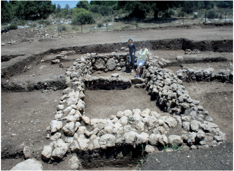

**,. מבנה פולחני שבקירו המזרחי משובצות שתי מצבות2 איור נמרוד גצוב; תודה לאלה נגורסקי על הרשות** : **חורבת אושה (צילום )לפרסם צילום זה** 

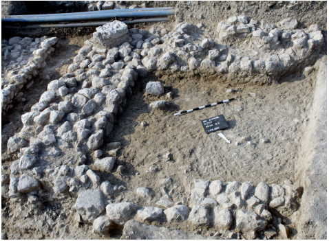

**אלה ירושביץ, באדיבות** : **. המבנה הגדול בעין ציפורי (צילום3 איור )אלה ירושביץ** 

, מ'). בשל מיקומם בתוך היישובים ולא בשוליהם1.5(כ־ לא נכון לזהותם כביצורים, כפי שהציע קפלן באשר לוואדי רבה, וסביר שאלה שרידי מבנים מרכזיים שהתנשאו לגובה רב יחסית. נראה שהם מעידים על מורכבות חברתית .שהתעצמה בתוך יישובי התקופה הכלקוליתית הקדומה 

#### **כלכלה** 

.בכלכלת התקופה ניכרת המשכיות מהתקופה הקודמת עיזים, כבשים ובקר מבויתים גודלו כבר בתקופה הנאוליתית14 וחזירים בויתו כבר בראשית התקופה הכלקוליתית הקדומה ארבעת15 .או אף בסוף התקופה הנאוליתית הקדם־קראמית המינים האלה שולטים בממצא העצמות בכל אתרי התקופה .הכלקוליתית הקדומה בארץ 

14 

.Haber et al. 2005 

.Price, Perry-Gal and Reshef 2023 15 

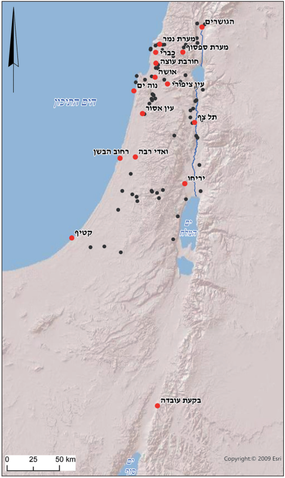

**.. מפת אתרים נבחרים מהתקופה הכלקוליתית הקדומה1 איור ) אנסטסיה שפירו** : **באדום אתרים שמוזכרים במאמר (התקנת המפה** 

#### **אדריכלות** 

במרבית אתרי התקופה נמצאו שרידי מבנים מלבניים. על פי רוב נחשפו רק חלקים מהמבנים וקשה לקבוע הכללות באשר לתכנונם. עם זאת בדרך כלל היו אלה מבני מגורים 

.קטנים שלעיתים היו קשורות אליהם חצרות ישנם מבנים שאופי בנייתם השונה מעיד כי עשויים היו להיות מבני פולחן או מבנים ציבוריים. לדוגמה, בעין ציפורי נמצא במבנה אחד תא קטן שעל קירו הדרומי נשענו שלוש אבנים שטוחות ששימשו כנראה מצבות פולחן. כך גם באושה שבמערב הגליל התחתון נמצא מבנה מאורך שבקירו הקצר המזרחי שולבו שתי אבנים גדולות מאוד שכנראה ). בעין אסור מופיעה עדות למבנה2 שימשו כמצבות (איור .ציבורי עם חצר גדולת ממדים מוקפת בקיר עדויות למבנים יוצאי דופן נמצאו גם בוואדי רבה, בעין ) ובעין אסור, בהם נמצאו קירות רחבים3 ציפורי (איור 

59 )2025  (תשפ״ו170 קדמוניות 

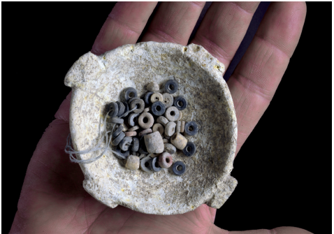

**. קערית בעלת ידיות מדף שנמצאה בקבר בעין ציפורי5 איור ) יניר מילבסקי** : **(צילום** 

#### **כלי החרס** 

בולט מכלול כמו זה שנמצא1 תקופה הכלקוליתית הקדומהב בחפירות ואדי רבה. נפוצים בו חרסים ממורקים ומעוטרים בהקפדה בחריטה ודיקור, ולעיתים קרובות מחופים בגוונים רובם שייכים לפערורים מזווים בינוניים20 .שבין אדום לשחור : א) ומיעוטם לקערות ולקנקניות. ליד אלה6 וקטנים (איור :6 מצויים כלים נוספים, שבולטים בהם קערות מזוות (איור ב), פערורים שאינם מעוטרים, קנקנים בעלי צוואר שחובר : ד), וכן6 : ג) או פשוק (איור6 לגוף הכלי ומתארו קשתי (איור 

.מצויות מעט ידיות סרט שמתרחבות בחיבור אל גוף הכלי נדירים מאוד העיטורים2 בתקופה הכלקוליתית הקדומה המאפיינים את כלי ואדי רבה, ועיטורי הכלים מוקפדים פחות. גם הקערות המזוות בקושי בנמצא. גדל מאוד מספר ידיות הסרט ואיתן מופיעים כלים מעוטרים בפסים רחבים בתרבות21 .): א7 של צבע אדום על גבי רקע בהיר (איור הקטיפית שבדרום מישור החוף מופיעים קנקנים מעוגלי22 .): ה6 צוואר, שצווארם יוצר בהמשך ישיר לגוף הכלי (איור כמו כן, בכל אזורי הארץ מצוי עיטור של רכסים שעוצבו 

.בדגם חבל 

נפוצים בכל הארץ3 בתקופה הכלקוליתית הקדומה קנקנים מעוגלי צוואר, ממשיך השימוש בידיות סרט, מצויות ידיות שחתכן משולש, נפוץ הרבה יותר העיטור בדגם חבל : ב) ומתמעט השימוש בעיטור צבע. באתרי צפון7 (איור הארץ ומרכז הארץ מופיעות מחבצות שלחלקן ידיות סרט : ג) ולחלקן ידיות נקב גדולות שדומות מאוד לאלה7 (איור .שנפוצות בתקופה הכלקוליתית המאוחרת **כלי צור** מכלול הצור מתאפיין בשליטה של כלי אד־הוק, שהם כלים ,שהוכנו ללא תכנון מקדים לשימוש קצר חיים. לצד אלה 

.Kaplan 1958 20 .Shalem and Getzov 2023 21 .Gilead 1990 22 

חיטה, שעורה וקטניות (פול, עדשים וחִמצה) בויתו כבר בתקופה הנאוליתית הקדם־קראמית. מחקר שרידים אורגניים בדפנות כלי חרס מעין ציפורי הראה שכבר מסוף ,התקופה הנאוליתית הקראמית אחסנו שמן זית בכלי חרס וממצא של שפע שרידי זיתים באתר המוצף סמוך לכפר סמיר שלחופה של חיפה, מצביע על הפקת שמן בתקופה עדויות בוטניות מראות שכבר16 .הכלקוליתית הקדומה בתקופה הנאוליתית גדלו בארץ ענבים שהתאימו לייצור יין, ומהתקופה הכלקוליתית המאוחרת נמצאה גת שיוצר נראה אם כך שכבר בתקופה הכלקוליתית הקדומה17 .בה יין :עמד לרשות תושבי הארץ מוקד הכלכלה הים תיכונית הדגן, היצהר והתירוש, שמאוחר יותר מוזכר פעמים רבות 

.במקרא 

**קבורה** 

נשמר הנוהג ששימש עוד בתקופה הנאוליתית הקדם־ קראמית של קבורה בתוך היישוב, אך בתקופות הנאוליתית הקראמית והכלקוליתית הקדומה הקבורה מצויה גם בין המבנים. כמו כן לא נמצאה עדות להמשך המנהג הקדום של ניתוק הגולגולת. בתקופה הכלקוליתית הקדומה גדל 

.מגוון הטיפוסים של קברי הבוגרים והילדים באתרי התקופה הכלקוליתית הקדומה מצויים קברי )יחידים בשוחה ובחלקם כוסו המתים (בעיקר פעוטות בשברי כלי חרס. מעט קברים בנויים ומקורים בלוחות אבן ) ומעט קברים מצויים בעומקן של מערות קארסטיות4 (איור על פי רוב, הקבורה היא ראשונה והנקברים הונחו18 .עמוקות על צידם בתנוחה מכווצת. במקרים מעטים צורפו לקבר . ובקברים אחדים הועמדו מצבות19 ,)5 חפצי לוואי (איור 

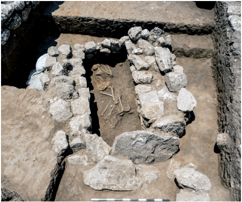

**) אסף פרץ** : **. קבר בנוי מעין אסור (צילום4 איור** 

16 .Namdar et al. 2015 .2025 גצוב, ורדי ומרום17 .Ullman et al. 2025 18 .Shalem et al. 2025: 69 19 

60 

)2025  (תשפ״ו170 קדמוניות 

**אובסידיאן** אובסידיאן (״זכוכית געשית״) שהובא מהרי אנטוליה מוכר ברבים מאתרי התקופה הנאוליתית, ובתקופה הכלקוליתית הקדומה הוא נמצא כמעט בכל האתרים ובצפון הארץ הוא .נפוץ יותר. בהגושרים נמצאו פריטי אובסידיאן רבים במיוחד הפריטים השכיחים ביותר הם להבונים שרבים מהם בכברי23 .משובררים ויש גם מעט ראשי חיצים וכלים אחרים נמצאו שני פריטים יוצאי דופן: גרעין ענק ומראה שעוצבה בקפידה רבה. על גב המראה ידית וחזיתה הישרה שלוטשה .שימשה לשיקוף פני המתבונן בה 

#### **חפצי האבן** 

מצוי מגוון רחב מאוד של פריטי אבן מעובדים. נציין שלושה טיפוסים: קערות קטנות בעלות ידיות מדף זעירות על שפתן ) שמהוות אב8 ), קערות בעלות בסיס מסיבי (איור5 (איור טיפוס של הקערות שלהן בסיס בעל חלונות, שנפוצות בתקופה הכלקוליתית המאוחרת, וכן אבני קלע סגלגלות ) שכנראה מעידות על עימותים אלימים בין הקהילות9 (איור 24.השונות באותה העת 

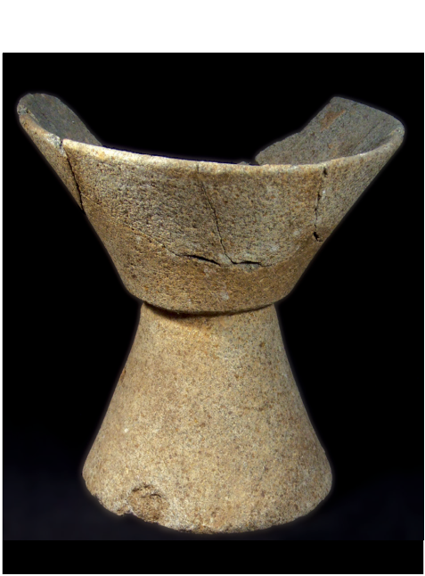

**הווארד** : **. קערת בזלת בעלת בסיס מאסיבי מהגושרים (צילום8 איור )סמיטליין** 

23 

.Schechter et al. 2013 .Getzov et al. 2022 ;Haklay et al. 2023 

24 

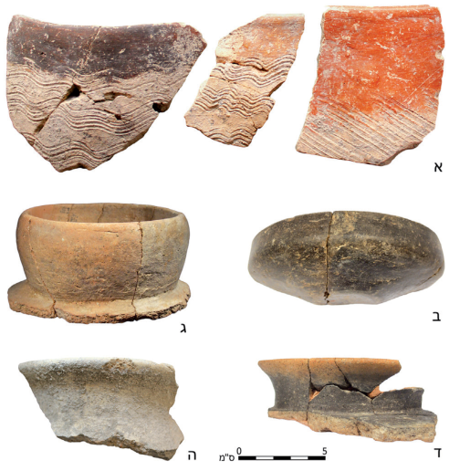

**א. שברי** : **. כלי חרס מהתקופה הכלקוליתית הקדומה6 איור נמרוד** : **פערורים מעוטרים בסגנון ואדי רבה מעין ציפורי (צילום ;) הווארד סמיטליין** : **גצוב); ב. קערה מזווה מהגושרים (צילום ;) הווארד סמיטליין** : **ג. שפת קנקן צוואר קשת מהגושרים (צילום ;) הווארד סמיטליין** : **ד. שפת קנקן פסוק צוואר מהגושרים (צילום ) נמרוד גצוב** : **ה. שפת קנקן עגול צוואר מחורבת עוצה (צילום** 

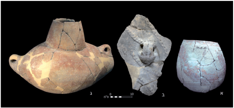

**א. פערור בעל** : **. כלי חרס מהתקופה הכלקוליתית הקדומה7 איור ;) נמרוד גצוב** : **עיטור ״אדום על בהיר״ מעין ציפורי (צילום ;) דפנה גזית** : **ב. עיטור חבל על גבי קנקן מעין אסור (צילום ) הווארד סמיטליין** : **ג. מחבצה מהגושרים (צילום** 

יצוינו כילפות, מגרדים על צור לוחי ולהבי מגל שמתארם מלבני ויש להם גב זקוף, קטימות וחורפה משוננת. בתקופה להבי המגל רחבים יותר, קצרים1 הכלקוליתית הקדומה והשינון על פי רוב עמוק יותר ודומה במידה מסוימת לשינון של הלהבים הירמוכיים מראשית התקופה הנאוליתית הקראמית. מכלול כלים זה מהווה בסיס למכלול כלי הצור .שנפוץ בתקופה הכלקוליתית המאוחרת 

61 )2025  (תשפ״ו170 קדמוניות 

#### **צלמיות בעלי חיים** 

באתרים אחדים נמצאו צלמיות חרס קטנות של בעלי חיים : א), לרוב צאן ובקר, הממשיכות מסורות מהתקופה10 (איור הנאוליתית. מעניין שבאתרים רבים כלל לא נמצאו צלמיות כאלה. ממצא יוצא דופן הוא צלמית של אריה שנמצאה 25.): ב10  בחורבת עוצה (איור16 בשכבה בכברי נמצאו שני פסלונים של אֵילִים שגולפו מאבן ועוד צלמית אבן קטנה של ראש אַיִל שדומה לה נמצאה : ג). פסלונים וצלמיות אלה נמצאו10 בהגושרים (איור על פני השטח, אך סביר מאוד לקושרן לשרידי התקופה הכלקוליתית הקדומה באתרים אלה. צלמית דומה מאוד .לשתי האחרונות נמצאה גם בדומוזטפה בדרום טורקיה 

**דמויות אדם** 

עוד בסוף המאה הקודמת נראה היה שתיאורי האדם בתקופה הכלקוליתית הקדומה הם מעטים מאוד, אך תגליות בשלושים השנים האחרונות מעלות מגוון רב של 26.תיאורי דמות אדם � זוהי דמות אישה שנחרטה על גבי **האישה גדולת העיניים** עצמות רגל של בעל חיים או לוחיות אבן, וצוירה על דופן פערור קטן. דמות זו דומה לדמויות שנחרטו על גבי לוחיות אבן ונמצאו באשור שעל החידקל ועל גבי מצבה שנמצאה : א�ב). לדמות זוג עיניים גדולות11 במארי שעל הפרת (איור ואיבר מין ולעיתים גם אף או טבור, ללא פרטי גוף אחרים כגון ידיים ורגליים. במרכז הגוף מצוי בדרך כלל תיאור 16 נטורליסטי של בעלי חיים ו/או צמחים. עד עתה מוכרים 

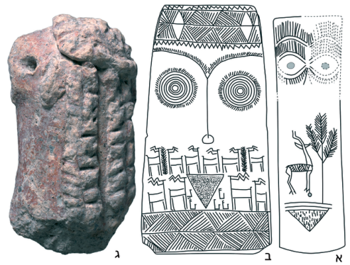

: **א. אישה גדולת עיניים מהגושרים (איור** : **. צלמיות נשים11 איור . נמרוד גצוב); ג** : **נמרוד גצוב); ב. אישה גדולת עיניים ממארי (איור ) דפנה גזית** : **אישה בעלת מחלפות שיער מעין אסור (צילום** 

בדו״ח הראשוני שויכה הצלמית בטעות לשכבה מאוחרת יותר, גצוב25 .2006 .Milevski et al. 2016 26 

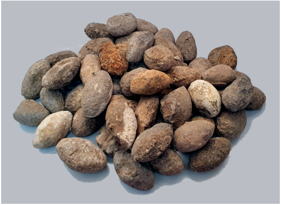

**) דינה שלם** : **. אבני קלע מעין אסור (צילום9 איור** 

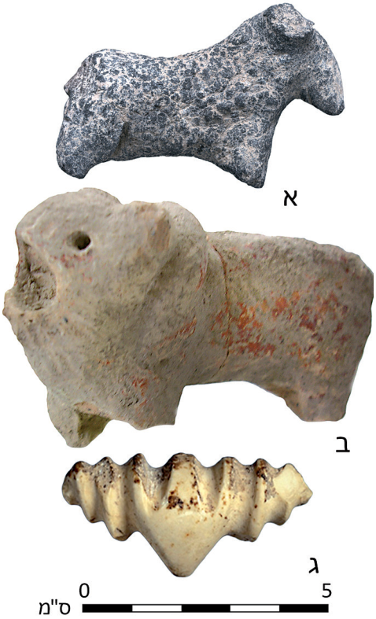

**קלרה** : **א. צאן מעין אסור (צילום** : **. צלמיות בעלי חיים10 איור ;) קלרה עמית** : **עמית); ב. צלמית אריה מחורבת עוצה (צילום ) באדיבות אוצרות המדינה** : **ג. צלמית אַיִל מכברי (צילום** 

62 

)2025  (תשפ״ו170 קדמוניות 

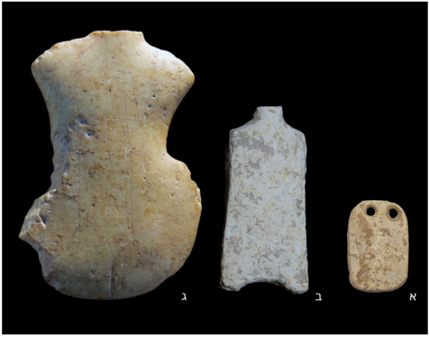

**;) הווארד סמיטליין** : **א. הגושרים (צילום** : **. צלמיות סכמטיות13 איור הווארד** : **דפנה גזית); ג. חורבת עוצה (צילום** : **ב. עין ציפורי (צילום** 

##### **)סמיטליין** 

רוב טיפוסי הצלמיות שתוארו כאן נמצאו בחפירות ארכאולוגיות, אך נוספות נמצאו על פני השטח באתרי התקופה או לידם: צלמיות לוח של נשים שנמצאו ,בהגושרים ושלוש צלמיות של גברים שנמצאו בהגושרים כברי וליד נחל זהורה. ריבוי צלמיות הנשים מעיד בוודאי על מרכזיותן ב״פנתאון״ התקופה. ניתן גם לשער שצלמיות האֵילִים מייצגות דמות זכרית שגם לה היה כנראה מקום .ב״פנתאון״ זה 

### � **עדויות לנוכחות זרה הגושרים ותל צף בארץ־ישראל** 

באתרים הגושרים ותל צף נחשפו מכלולי ממצא ששונים באופן בולט ממכלולי התקופה הכלקוליתית הקדומה האחרים והם מעידים על קשרים צפונה בשני שלבים שונים של התקופה הכלקוליתית הקדומה. על כן בחרנו לתארם .באופן מפורט יותר 

IV **הגושרים שכבה** 

מעל שרידי התקופה הנאוליתית נחשפו שרידי יישוב הבנוי בצפיפות, כעדותם של יסודות אבן שבוודאי שימשו מסד 30.לקירות לבנים. נחשפו לכל הפחות ארבעה שלבי בנייה במכלול כלי החרס מצויים רכיבים מובהקים שאופייניים לתרבות ואדי רבה הארץ ישראלית, ובנוסף להם נמצאו בחפירה כלי חרס שמראים על קרבה למכלולי התרבות החלפית שנפוצים בסוריה ובצפון מסופוטמיה, בהם קערות בעלות זיווי כפול, כלי חרס בעלי מירוק שנעשה על גבי חיפוי שחור ופריטים אחדים של כלי חרס חלפיים שניכרים בדפנות דקיקות שעשויות מחרס לבנבן ומעוטרות בדגמים ). הקערות כפולות הזיווי14 גאומטריים מצוירים (איור 

.Getzov 200830 

חפצים שעליהם תיאור זה והחזרה המדויקת על הפרטים ,מלמדת על מיתולוגיה שמצויה מאחורי עיצוב הדמות .וסביר על כן שזו דמות של אלה � נמצאו שברים של ארבע **הדמות בעלת מחלפות השיער** צלמיות חרס (שתיים בעין אסור וכן בעין ציפורי ובנווה ים שלחוף הכרמל) של דמות אדם, סביר שאישה, בעלת : ג). הצלמיות דומות מאוד זו לזו11 מחלפות שיער (איור ואולי הן מעידות על דמות אלה נוספת. מעניין מאוד שצלמיות דומות נמצאו גם בתסליה ביוון. שלוש מבין ואין2 הצלמיות יש לתארך לתקופה הכלקוליתית הקדומה 

> 27 .עדות ברורה להימצאותן בשלבים אחרים של התקופה � בעין ג'רבה נמצא ממצא יחידאי **הפערור מעין ג׳רבה** בארץ־ישראל של פערור מזווה ועל דפנותיו תבליט של שני ). לסצנה זו הקבלות רבות במזרח12 גברים רוקדים (איור 28.הקרוב ובדרום־מזרח אירופה 

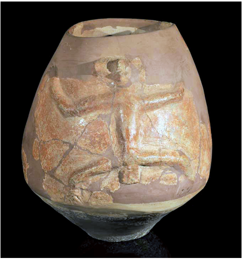

**) קלרה עמית** : **רבה (צילום** ' **. פערור עם תבליט אדם מעין ג12 איור** 

� צלמיות שבהן נרמזים רק פרטים **צלמיות סכמתיות** אחדים שנחרטו על גבי לוח אבן קטן, או חלוק נחל לא מעובד. בדרך כלל נראה משולש שמציין את איבר המין הנשי, יש לוחיות שבראשן זוג חורים שמציינים את העיניים : א), צלמיות שבהן נרמז המתאר הכללי של הגוף13 (איור מופיעות גם3 : ב) ובתקופה הכלקוליתית הקדומה13 (איור : ג), שנפוצות בתקופה הכלקוליתית13 ״צלמיות כינור״ (איור 

29.המאוחרת 

.Shalem et al. 2024 27 .Milevski et al. 2016 28 .Milevski et al. forthcoming 29 

63 )2025  (תשפ״ו170 קדמוניות 

**) נמרוד גצוב** : **. קערה חלפית מהגושרים (ציור14 איור** 

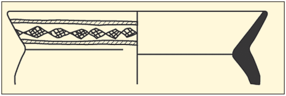

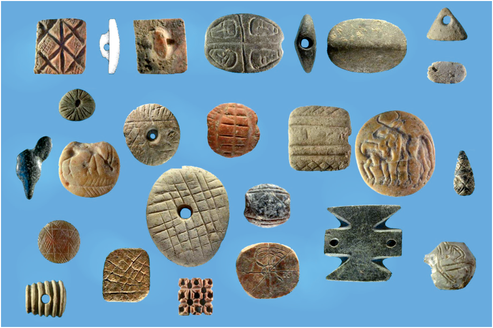

**) נמרוד גצוב** : **. חותמות מהגושרים (צילום15 איור** 

על פי הקבלות לכלי החרס ולחותמות, יש לתארך את 1  בהגושרים לתקופה הכלקוליתית הקדומהIV שכבה ותיארוך זה נתמך גם על ידי תיארוך רדיומטרי מכויל של לפנה״ס. עד עתה, לא דווח על5317�5561ממצאי פחם ל־ מכלולי ממצא דומים באתרים אחרים, ויתרה מכך באתר עין השומר שמצוי מצפון־מערב להגושרים נחשף מכלול אופייני לתרבות ואדי רבה. מתברר שמצוי בהגושרים מכלול ייחודי שמייצג קהילה עם זיקה ברורה לאתרי התרבות החלפית שרווחה בצפון סוריה ומסופוטמיה, אך שוכנת בתחום השפעתה של תרבות ואדי רבה הארץ־ישראלית. אפשר 32.שבהגושרים שכנה קהילה של סוחרים 

והכלים נושאי המירוק השחור נמצאו גם במכלולים ארץ־ ישראליים אחרים, אך חלקם במכלול מהגושרים גדול באופן ניכר. הכלים החלפיים העדינים מוכרים רק מצפון לארץ־ .ישראל בנוסף, נמצאו בחפירה אלפי פריטי אובסידיאן. פריטים אלה כללו בעיקר להבונים ומעט כלים, גרעינים, פריטי פסולת שונים וגרעין גדול שנשבר והוא דומה מאוד לגרעין הענק שנמצא בכברי. מספרם של פריטי האובסידיאן גדול עשרות מונים מזה שנמצא בכל שאר אתרי התקופות הנאוליתית והכלקוליתית בארץ־ישראל. על הזיקה לתרבות חלף מעידים גם חותמות רבים שכמוהם נמצאו באתרי התרבות החלפית והם נדירים ביותר באתרי ארץ־ישראל 

31.)15 (איור 

. גצוב תשנ״א31 

.Yacobi and Gopher 2023 32 

> )2025  (תשפ״ו170 קדמוניות 64 

**סיכום** 

שנים פרסם קפלן את תוצאות חפירתו בוואדי70 לפני כמעט רבה ופתח צוהר ללימוד התקופה הכלקוליתית הקדומה שמאוחרת לתרבויות הנאוליתיות הקראמיות וקדומה .לתרבות הע'סולית מהתקופה הכלקוליתית המאוחרת המחקר מצביע על התפתחות מתמדת בתרבות החומרית ובמורכבות החברתית, כפי שניכר ממדרג רחב של גודל היישובים, מבנים מרכזיים עבי קירות, קשרים ארוכי טווח עם קהילות בצפון מסופוטמיה, התמחויות, חפצי יוקרה ,בעלי השקעה רבה כקערות האבן והמראה מאובסידיאן ועדות למאבקים בין הקהילות או בתוכן כפי שמתברר מתפוצת אבני הקלע. מצד אחד אלה יכולים להוביל לנתק ושונות בין הקהילות, מנגד תפוצתה הרחבה של תרבות ואדי רבה בראשית התקופה הכלקוליתית הקדומה מעידה .דווקא על קשרים הדוקים בין הקהילות ,בכלל התקופה ניכרים שינויים בתרבות החומרית שחלקם מבטאים התפתחות כרונולוגית והאחרים היבט ,מרחבי. שינויים אלה ניכרים בעיקר במכלולי כלי החרס בעוד שרכיבים אחרים של התרבות החומרית נותרו ללא שינוי ניכר, כדוגמת מכלולי כלי האבן והצור, שבהם היו רק שינויים מועטים. גם בתפוצתן של צלמיות וביטויים ,אמנותיים של דמות האדם נראה שלא חלו שינויים ניכרים 

.אך מיעוט הממצא לא מאפשר עדיין לברר עניין זה כראוי ,מעניין במיוחד הקשר לתרבויות צפון סוריה ומסופוטמיה שעליו כבר הצביע קפלן, והוא מתבטא ברכיבים שונים של התרבות החומרית ובעיקר בביטוייה האמנותיים. יתרה מזאת התבליט על הפערור מעין ג'רבה והצלמיות בעלות מחלפות השיער מעידים גם על קשרים לתרבויות דרום־מזרח אירופה ויוון. ביטוי נוסף לקשרים עם הארצות השכנות הן כפי הנראה הקהילות הייחודיות שקבעו את מושבן בהגושרים 

.ומאוחר יותר בתל צף 

דומה שבתקופה הכלקוליתית המאוחרת כבר לא ניכרים הבדלים מפליגים בגודלם של היישובים. הביטוי האמנותי ייחודי יותר לארץ־ישראל, ולא מוכרות עדויות לקהילות נושאות השפעה זרה, שמקורה בארצות שמחוץ לארץ־ .ישראל, כמו אלה שהיו בהגושרים ותל צף 

### **רשימת מקורות** 

,בונימוביץ, ש', תשמ״ח, שיחזור מערכות מדיניות בעזרת ניתוח מרחבי **ישובים, אוכלוסיה וכלכלה** ,)'בש' בונימוביץ, מ' כוכבי וא' כשר (עור .56�39 'תל אביב, עמ **,בארץ־ישראל בעת העתיקה** https://hadashot. .118 **חדשות ארכיאולוגיות** ,, חורבת עוצה2006 ,'גצוב, נ .iaa.org.il/report_detail.aspx?id=407&mag_id=111 גצוב, נ', תשע״א, חותמות וצלמיות מראשית התקופה הכלקוליתית .83*�81* ,26�1 :67 **עתיקות** ,הקדומה באתר הגושרים , ארד א־סמרה: אתר יישוב פרוטו־היסטורי2025 ,'גצוב נ', ורדי, י' ומרום, נ https://publications.iaa.org.il/qadum/vol1/ .1 **קדום** ,בשולי מישור עכו ./iss1/13 

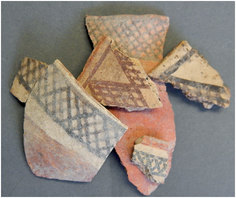

**. חרסים מעוטרים מתל צף (צילם דני רוזנברג, באדיבות16 איור )דני רוזנברג** 

#### **תל צף** 

בתל צף נחשפו שרידי יישוב, בהם לבני בוץ ששימשו לבנייה והשתמרו היטב הודות לתנאי היובש במקום. נחשפו 33.מבני חצר שבהם הובחנו לפחות שני שלבים סטרטיגרפיים בחצרות נמצאו משטחים עגולים שככל הנראה שימשו בסיס 

.לאסמים 

במכלול כלי החרס מצויים פריטים מובהקים שמוכרים , כדוגמת קנקני צוואר2 בתקופה הכלקוליתית הקדומה קשת וידיות סרט. לצד אלה בולטים מאוד כלים מעוטרים בציור גאומטרי באדום ושחור, לעיתים קרובות על גבי חיפוי ), המכונה ״עיטור תל צף״. בחינת כלי החרס16 לבן (איור והמחקר הפטרוגרפי מעלים כי הכלים בעלי עיטור תל צף יוצרו בסביבה הקרובה. גרפינקל הראה שעיטורים כאלה אך תפוצתם הרבה34 ,מצויים בכמה מאתרי בקעת הירדן בתל צף יוצאת דופן. חופרי תל צף זיהו בממצא מהאתר גם מעט חרסים שמקורם בתרבות העובידית של צפון סוריה ומסופוטמיה, ואפשר ששם מקורות ההשפעה על קדרי תל צף. ממצא חשוב נוסף הם מעט חותמות ושפע בולות שמעידים על חתימת מכלים או מבנים. שימוש נרחב בחותמות ובולות מוכר באתרי התרבות העובידית ונדיר 

.באתרי ארץ־ישראל 

על פי ההקבלות לכלי החרס ועל פי תיארוך רדיומטרי ,) לפנה״ס (מכויל4700�5200של ממצאים מפוחמים ל־ יש לשייך את עיקר השרידים שנחשפו בתל צף לתקופה . מתברר שכמו בהגושרים, גם בתל2 הכלקוליתית הקדומה צף מצוי מכלול ייחודי שמייצג קהילה עם זיקה ברורה לאתרים בצפון סוריה ומסופוטמיה, אך שוכנת בתחום 

.תפוצתן של תרבויות ארץ־ישראליות 

.2021 שובל ורוזנברג33 .Garfinkel 1999: 186–188 34 

65 )2025  (תשפ״ו170 קדמוניות 

גצוב, נ', תשע״א, חותמות וצלמיות מראשית התקופה הכלקוליתית .83*�81* ,26�1 :67 **עתיקות** ,הקדומה באתר הגושרים , ארד א־סמרה: אתר יישוב פרוטו־היסטורי2025 ,'גצוב נ', ורדי, י' ומרום, נ https://publications.iaa.org.il/qadum/vol1/ .1 **קדום** ,בשולי מישור עכו ./iss1/13 ,יוגב, א', תשמ״ד, מקדש מן האלף החמישי לפני סה״נ בבקעת עובדה .122�118 :64 **קדמוניות** https:// .126 **חדשות ארכיאולוגיות** ,, עין ציפורי2014 ,'מילבסקי, י' וגצוב, נ hadashot.iaa.org.il/report_detail.aspx?id=13675&mag_id=121 קפלן, י', תשל״ב, עשרים שנה לגילויה של התרבות הכלקוליתית של ואדי .13�9 :14 **שנתון מוזיאון הארץ** ,רבה : יג ,קפלן, י', תשל״ז, שרידים נאוליתיים וכלקוליתיים בלוד **ארץ־ישראל** .75�57 

, מבט חדש על הקרמיקה מתל צף: מקרה מבחן2021 ,'שובל ת' ורוזנברג, ד **חידושים** ,)', בק' קובלו־פארן, ע' ארליך ור' בארי (עורC70 מחדר .30�11 ', ירושלים, עמ **בארכיאולוגיה של צפון ישראל** 

Garfinkel, Y. 1999, _Neolithic and Chalcolithic Pottery of the Southern Levant_ (Qedem 39), Jerusalem. 

Gilead, I. 1990, The Neolithic-Chalcolithic transition and the Qatifian 

of the Northern Negev and Sinai, _Levant_ XXII: 47–63. 

Kaplan, J. 1958, Excavations at Wadi Rabah, _Israel Exploration Journal_ 8: 149–160. 

Kirkbride, D. 1969, Early Byblos and the Beqa'a, _Melanges de L'Universite Saint-Joseph_ 45: 45–60. 

66 

)2025  (תשפ״ו170 קדמוניות 

