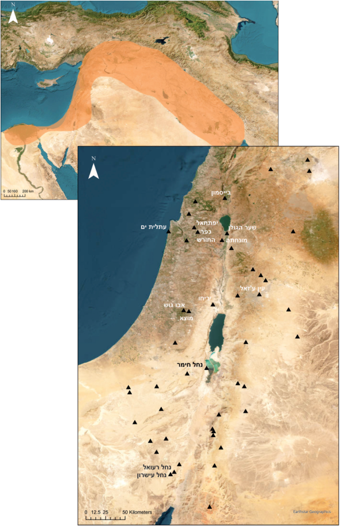
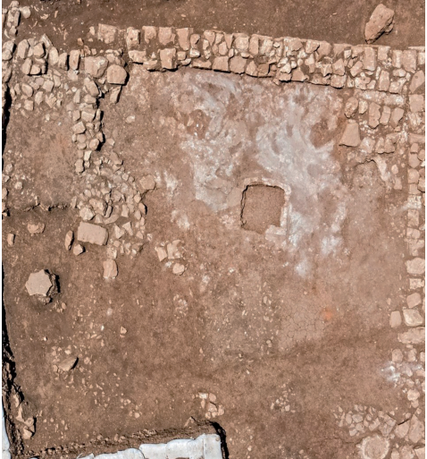
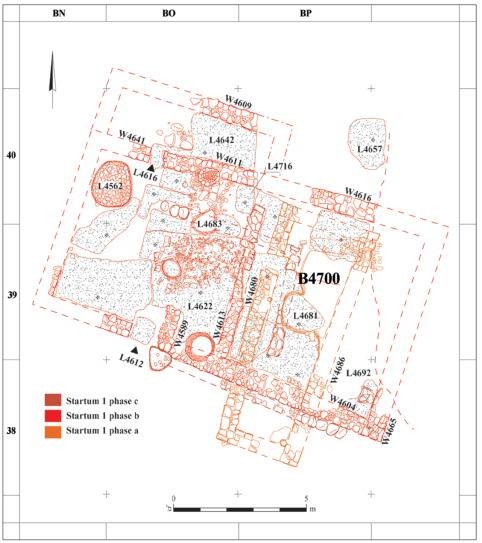
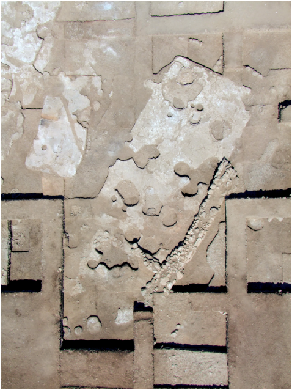
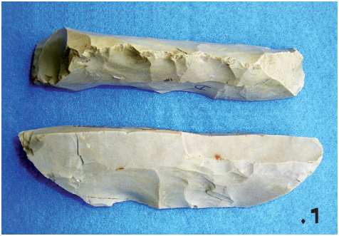
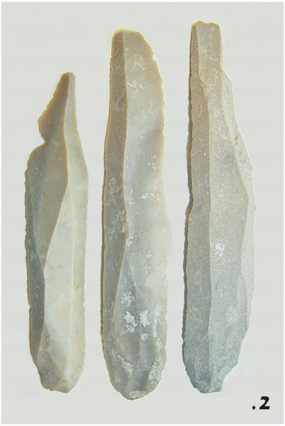
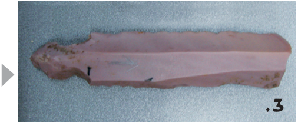

# התקופה הנאוליתית הקדומה בארץ־ישראל � מאה שנים של מחקר ואתגרים עתידיים 

## מיכל בירקנפלד 

**. הסהר הפורה, דרום הלבנט והאתרים המרכזיים בני1 איור ) מיכל בירקנפלד** : **התקופה הנאוליתית המוזכרים במאמר (הכנה** 

ציון מאה שנים למחקר הפרהיסטורי בארץ־ישראל הוא הזדמנות מצוינת למבט רחב על אחד מצומתי הדרכים המרכזיים בתולדות האנושות: המעבר מחיי נדודים מבוססי ציד ולקט, לישיבת קבע בכפרים חקלאיים. תהליך זה, שאת **�** ,פליאוליתית ניצניו ניתן לזהות כבר בסוף התקופה האפי הגיע לשיאו בתקופה הנאוליתית הקדם־קראמית, שראשיתה שנים, והביא לשינוי דרמטי באורחות החיים11,700 לפני ,האנושיים, לא רק אלה הנוגעים לכלכלה ודגמי היישוב אלא גם למבנה ולארגון החברתי, גודל האוכלוסייה, עולם 

.המוטיבים האומנותיים, הפולחן והקבורה אזור המזרח התיכון, ובייחוד הסהר הפורה, נחשב מאז ומעולם למוקד הופעתם הראשונית והתפתחותם של ). מכאן התפשטו כל אותם1 תהליכי הנאוליתיזציה (איור ,חידושים קיומיים מערבה וצפונה אל היבשת האירופית .מזרחה אל אסיה, ואף דרומה אל ערב ואל צפון אפריקה במובן זה, ארץ־ישראל יכולה לשמש כמעבדה נהדרת לחקר התקופה הנאוליתית: מיקומה הגאוגרפי כצומת דרכים המקשר בין אפריקה ואסיה והחיבור לים התיכון הפכו אותה ללא ספק לחוליה חשובה באותה שרשרת תהליכית. ריבוי הסביבות האקולוגיות הקיימות בה הובילו להתפתחותו של טווח רחב של התאמות מקומיות ודפוסים יישוביים וכלכליים, המאפשרים לבחון מגוון רחב של התנהגויות אנושיות. שפע האתרים בני התקופה והיקף המחקר הארכאולוגי � כל אלה מספקים טווח רחב של נתונים המאירים מגוון היבטים של התהליך, ומדגימים את 

.השונות הרחבה האופיינית לתקופה במאמר קצר זה אנסה לסקור את התפתחות המחקר הארכאולוגי של התקופה בארץ־ישראל, את מצבו היום ואת האופק שלו. אתמקד בכמה צירים מרכזיים, המבטאים טוב מכול את השינויים העיקריים שהביאה עימה ה״מהפכה .הנאוליתית״ חפירות בודדות באתרים נאוליתיים אומנם התקיימו עוד , אך סיפורו של המחקר השיטתי הנוגע לתקופה1952 לפני 

49 )2025  (תשפ״ו170 קדמוניות 

הוסיפה גם היא מורכבות לתמונה הכרונולוגית, עם הגדרת ,תרבויות התקופה הנאוליתית הקראמית (התרבות הירמוכית ותרבות ואדי רבה, חלקן נחשבותIX התרבות הלודית/יריחו כל אלה3 .)היום לחלק מהתקופה הכלקוליתית הקדומה הביאו ליצירתה של הסכימה הכרונולוגית והתרבותית 4.)1 המשמשת גם כיום (טבלה 

: **1 טבלה** 

**־ישראלץופה הנאוליתית בארקהמסגרת הכרונולוגית של הת** 

|**המסגרת הכרונולוגית** **)(תאריך מכויל**|**התקופה**|
|---|---|
|לפנה״ס~8500�9750|'נאוליתיתקדם־קראמית א|
|לפנה״ס~7000�8500|'נאוליתיתקדם־קראמית ב|
|לפנה״ס~6400�7000|'נאוליתיתקדם־קראמית ג|
|לפנה״ס~6000�6400|נאוליתיתקראמית|
|לפנה״ס~5300�6000|כלקוליתיתקדומה|

שינויים במסגרת התאורטית הארכאולוגית הגלובלית במהלך חלקה השני של המאה הכ (מהפכת ה״ארכאולוגיה החדשה״ או ״הארכאולוגיה התהליכית״) הביאו למעבר מתפיסה לינארית של ״קידמה״ חקלאית אל מול ,״פרימיטיביות״ של חברות ציידים־לקטים פלאוליתיות ולשילובם של מודלים אקולוגיים־חברתיים במחקר. אלה העלו שאלות בדבר תהליכי יישוב ונטישה וההשפעות האקולוגיות � אירועי עזיבה, הגירה או שינוי אקלימי אשר עיצבו מחדש את דגם ההתיישבות בכפרים � ואפשרו מבט חדש ומורכב יותר על תהליכי השינוי הנרחבים שהתרחשו 5.במהלך התקופה המחצית השנייה של המאה הקודמת ותחילתה של המאה הנוכחית התאפיינו בגילויים של אתרים חדשים ,ובסדרה של חפירות נרחבות. אתרים כמו מונחתה ובייסמון נחל אורן, כפר החורש, יפתחאל, עתלית ים, אבו גוש, מוצא ושער הגולן באזורים הים־תיכוניים, נחל עישרון, נחל רעואל ומערת נחל חימר באזורים המדבריים, וכן שורה ארוכה ,של חפירות הצלה, תרמו רבות להבנת התרבות החומרית דרכי החיים, התפקוד והמבנה של היישובים, וכן היבטים .חברתיים כמו ריבוד, תהליכים דמוגרפיים, אמנות ופולחן הגישה הרב תחומית ושילובם הנרחב של מדעי הטבע והמדעים המדויקים במחקר הארכאולוגי הרחיבו לאין שיעור את יכולתנו לדון בעדויות הארכאולוגיות ולגבש תובנות 

לדיון בהיסטוריית המחקר ובהגדרות הכרונו־תרבויות השונות של3 .Gopher 2012 הנאולית הקראמי ראו דיון אצל לחלוקה כרונולוגית אחרת של החלק המאוחר של התקופה ראו4 .מאמרם של גצוב, שלם ומילבסקי, ומאמרו של גופר בגיליון זה Childe 1928 ;Braidwood and Howe 1960 ;Binford 1968 ;Sahlins5 .1972 

,הנאוליתית בארץ־ישראל מתחיל במידה רבה בשנה זו .עם חפירותיה של החוקרת הבריטית ק' קניון בתל יריחו הייתה זו המשלחת הרביעית בתל, וקניון, שהתמקדה ,בחפירת תעלות צרות ועמוקות שהגיעו עד לבסיס התל הייתה הראשונה לבסס את רצף ההתיישבות במקום, ואת העובדה שאת מרבית ההצטברות בתל ניתן לשייך לתקופה 

1.הנאוליתית בתחילה, התבססו חלוקות הכרונולוגיה הפרהיסטורית בארץ על הדגמים האירופיים, תוך אימוץ ההבחנה ,הקלאסית בין תקופות האבן השונות: הפלאוליתית הנאוליתית והכלקוליתית. קניון עמדה על קיומם של ,שלבים סטרטיגרפיים מובחנים בתוך התקופה הנאוליתית והגדירה לראשונה את הרצף הכרונו־סטרטיגרפי הייחודי לתקופה בארץ־ישראל. חלוקתה, ששילבה לא רק אבחנות , יצרה14 סטרטיגרפיות אלא תיארוך רדיומטרי מבוסס פחמן את הבסיס למסגרת המחקרית המקובלת היום ברחבי הלבנט 

.ואף מחוצה לו :קניון הגדירה רצף בן ארבעה שלבים תרבותיים עיקריים התקופה הנאוליתית הקדם־קראמית א', התקופה הנאוליתית הקדם־קראמית ב', התקופה הנאוליתית Pre-( 'הקראמית א', והתקופה הנאוליתית הקראמית ב ). בין שניPottery Neolithic A, B and Pottery Neolithic A, B השלבים הקדם־קראמיים ושני השלבים הקראמיים זיהתה קניון פער יישובי בן כמה מאות שנים. עבודתה בשלב הקדום ביותר ביריחו, בתקופה הנאוליתית הקדם־קראמית א', חשפה בנייה ציבורית מרשימה, ראשונה מסוגה בעולם בשעתו, הכוללת חומה ארוכה ומגדל אבן עגול בגובה של מטרים. היא אף הראתה כי אלה קדומים באלף שנה8כ־ � ויותר מהאתר הנאוליתי הקדום ביותר שנחפר עד אז האתר בג'רמו (כורדיסטאן) שנחפר על ידי משלחתו של ר' בריידווד מאוניברסיטת שיקגו. בכך שינתה את הידע לא רק בנוגע לראשית ההתיישבות הקבועה, אלא גם עוררה דיון 

.רחב סביב ראשית החקלאות והופעת הריבוד החברתי המחקר במרבית המאה הכ התרכז בזיהוי האתרים שביססו את הרצף התפתחותי, וניסיון לענות על שאלות יסוד בדבר המועד, המיקום וסיבות המעבר לישיבת קבע והופעת החקלאות. חפירותיו של ג' רולפסון באתר עין ע'זאל היוו נקודת מפנה נוספת בהבנת80בעבר הירדן בשנות ה־ הרצף הכרונולוגי של התקופה הנאוליתית בלבנט, והובילו 'להוספת שלב חדש: התקופה הנאוליתית הקדם־קראמית ג זיהוין של שכבות היישוב משלב2 .)Pre-Pottery Neolithic C( זה הראו שאותו פער יישובי שזוהה על ידי קניון ביריחו ביטא, יותר מכול, תופעה מקומית בתל וכי היישוב הנאוליתי באזורנו היה רציף ובלתי קטוע. עבודתם של חוקרים ,60 וה־50ישראלים, דוגמת מ' שטקליס וי' קפלן בשנות ה־ 

.Kenyon 19571 .Rollefson 20192 

50 

)2025  (תשפ״ו170 קדמוניות 

וניתוח מורפומטרי (צורני) ממוחשב, מספקים הבנה מעמיקה יותר של תהליכים והתפתחויות באדריכלות הנאוליתית. אם באופן מסורתי מקובלת הייתה תפיסה כמעט לינארית של התפתחות מאדריכלות מעוגלת למרובעת, הרי שחשיפתם 

**) אסף פרץ** : **. מבנה מגורים מהאתר הנאוליתי במוצא (צילום2 איור** 

: **. מבנה מגורים מהאתר הנאוליתי במוצא (שרטוט3 איור )דועאא סלמן** 

חדשות על תרבויות התקופה הנאוליתית. בזכות כלים כמו תיארוך רדיומטרי ברזולוציה גבוהה, אנליזות גנטיות ודנ״א־ קדום, מחקר פלאו־בוטני וחקר אקלים קדום, התאפשר זיהוי מדויק יותר של מקורות צמחים ובעלי חיים מבויתים, הבנה ,עמוקה יותר של תהליכי ביות, ניתוח דפוסי צריכה, בריאות ארגון חברתי והסתגלות סביבתית, לצד הבנה מעמיקה יותר של יחסי אדם�סביבה והדינמיקה האקולוגית. כיום מחקר התקופה הנאוליתית בארץ־ישראל מדגיש רצף יישובי, גיוון דפוסי מגורים ואסטרטגיות קיום, התפתחות טכנולוגית־ .כלכלית, והתפתחות האמנות והפולחן במגוון סביבות קיום רבים המקורות האקדמיים והפופולריים העוסקים בפירוט בממצא הארכאולוגי הנאוליתי העצום והמגוון שנבנה 6.והתגבש באזורנו מאז חפירתה של קניון ביריחו ועד היום ,תקצר היריעה מפירוט מכלול תהליכי השינוי הכלכליים החברתיים והתרבותיים שהתרחשו במהלך התקופה, או מפירוט המגוון העצום של ממצאי התרבות החומרית. במאמר זה אנסה להתחקות אחר הצירים המרכזיים היושבים בבסיס המחקר העכשווי של התקופה הנאוליתית. בכל נושא אציג את שאלות המפתח המובילות את המחקר ואסכם את מצב 

.המחקר ואת התמונה הארכאולוגית הנוכחית 

#### **אדריכלות, דפוסי יישוב והמעבר לישיבת קבע** 

המאפיין המרכזי של התקופה הנאוליתית הוא המעבר מאורח חיים נוודי, המבוסס על חברות קטנות יחסית של ,ציידים־לקטים, לקהילות חקלאיות גדולות, יושבות קבע המבוססות על כלכלת צמחים ובעלי חיים מבויתים. תהליך זה מהווה ציר מרכזי בתאוריית ״המהפכה הנאוליתית״של או ב״תהליכי הנאוליתיזציה״, כפי שהגדיר7 ,ג' צ'יילד וכפי שהם נתפסים כיום, עם דגש על אופיים8 ,ז' קובאן ההתפתחותי והמתמשך של תהליכים אלה, שמתחילים למעשה כבר בתקופה האפי־פלאוליתית. יישובי קבע ראשונים, דוגמת האתר ביריחו ובנתיב הגדוד שבדרום עמק .'הירדן, מופיעים כבר בתקופה הנאוליתית הקדם־קראמית א אלה, לצד אתרים מאוחרים יותר, דוגמת האתרים ביפתחאל בגליל התחתון ואבו גוש ומוצא באזור ירושלים, מייצגים שלבים שונים בדגם הכפר המשתנה. מבנים מעוגלים בנויי בוץ ואבן מהנאולית הקדם־קראמי א' מפנים את מקומם ,למבנים מרובעים או מלבניים, לעיתים בעלי חצרות בנאולית הקדם־ קראמי ב', שהולכים והופכים מורכבים יותר ויותר במהלך הנאולית הקדם־קראמי ב' וג'. בסופו של דבר, עם המעבר לתקופה הנאוליתית הקרמית, יופיעו מבני 9.)2 חצר ייחודיים, מסודרים לאורך רחובות מתוכננים (איור פיתוחן של שיטות דיגיטליות, בהן מידול תלת־ממדי 

.2018 ; גרפינקל2008 ראו למשל בר־יוסף וגרפינקל6 .Childe 19287 .Cauvin 19908 .Garfinkel et al. 2009 למשל, באתר שער הגולן, ראו9 

51 )2025  (תשפ״ו170 קדמוניות 

עצמם חלק מקבוצה הולכת וגדלה של תושבים, כאשר מאות אנשים החלו להתגורר יחד באופן קבוע. שינוי זה הוביל ליצירתם של מתחים חברתיים חדשים, שהובילו בתורם להתגבשותם של מנגנונים חברתיים ותרבותיים חדשים שמיתנו אותם. אין ספק שהמעבר לישיבת קבע והופעתו של הכפר הביאו לשינוי שאין כדוגמתו במבנה החברתי ובארגונו: צבירת עודפי ייצור, צבירת רכוש, עלייה בחשיבות הטריטוריה ושאלת הבעלות על קרקע � כל אלה יצרו את הרקע הנדרש להופעתו של ריבוד חברתי וליצירת מערכות יחסים מסוג חדש בין קבוצות ואף בין פרטים ובין .יחידות גרעיניות בתוך כל קבוצה תהליכים אלה משתקפים במידה רבה גם בשינויים האדריכליים הניכרים לאורך התקופה. המעבר ממבנים עגולים בני חדר אחד אל בתים מלבניים מרובי חדרים משקפים שינוי משמעותי במבנה החברה ובאיזון בין הפרטי לקולקטיבי: המבנה העגול מאפשר גמישות מרחבית ושותפות במשאבים, המשקפים אינטימיות קולקטיבית של ,הקבוצה. המבנה המלבני מרובה החדרים, לעומת זאת משקף חלוקה היררכית של המרחב לאזורי מגורים, אזורי אחסון ואזורי פעילות והפרדה בין פונקציות ביתיות. מגמה זו, הניכרת בבירור באתרים הנאוליתיים (דוגמת יריחו, מוצא ואחרים) נקשרת לעליית מרכזיותן של יחידות המשפחה הגרעינית, והדגשת הזהות הביתית, הבעלות ואולי אף התעצמות הקניין האישי אל מול הקולקטיבי. יש חוקרים הרואים בתהליך זה אמצעי חברתי־סימבולי, שמסדר גבולות בין האינטימי והציבורי, היחיד והקהילה, וכבמה לארגון מחדש של תפקידים משפחתיים אל מול תפקידי 12.הקולקטיב תופעה משמעותית נוספת המשקפת את התהליכים החברתיים החדשים היא הופעתם של מבנים קהילתיים או ציבוריים לצד מבני המגורים. מבנים אלה, הנבדלים לרוב בגודלם או בתוכניתם האדריכלית, שימשו כמוקדים ). מבנים4 לפעילויות חברתיות, פולחניות וכלכליות (איור אלה, כמו המגדל ביריחו שהוזכר לעיל, או מבני האסמים הגדולים שנתגלו באתרים כמו ג'רף אל־אחמר שבסוריה ודרע' שבירדן, מילאו תפקיד מכריע בארגון הקהילות ,יושבות הקבע המוקדמות. הם שימשו כמקומות מפגש לאחסון ולטקסים פולחניים, ומשקפים את הופעתה של מורכבות חברתית ואת הצורך בתיאום חברתי שהוא מעבר .למשפחה הגרעינית 

#### **הכלכלה הנאוליתית וביסוס אורח החיים החקלאי** 

שאלת תהליכי הביות של בעלי החיים והצמחים אף . מיני13 היא נמצאת בליבו של חקר התקופה הנאוליתית המפתח, או צמחי היסוד, כללו שני מינים של דגניים (חיטה 

.Kuijt et al. 2011 ;Balbo et al. 2012 ;Grosman and Goldgeier 202512 . ראו גם מאמרה של ספיר־חן בגיליון זה13 

**. מבנה ציבורי מהאתר הנאוליתי ביפתחאל (באדיבות רשות4 איור )העתיקות** 

של אתרים חדשים לצד ניתוחים מחודשים של דגמי ,היישוב והבנייה מדגישים כיום מידה רבה יותר של שונות הן בצורות הבנייה והן בחומרי הבנייה, וכן תנועה חופשית באופן מסורתי, נהוג היה לראות את10 .יותר בין צורות מקורם של שינויים אלה באתרי צפון הלבנט, ובייחוד בעמקי הפרת והחידקל. שם ניתן לעקוב אחר התפתחות רציפה של האדריכלות ממעוגלת למלבנית, למשל באתרים כמו ג'רף אל־אחמר. עם התפתחות המחקר, גם תפיסה זו תופסת צורה חדשה. בעוד שאין ספק שרכיבים מסוימים נדדו אלינו מצפון, ניתן בכל זאת לזהות דפוסים ברורים של המשכיות והתפתחות מתרבויות האפי־פלאולית המקומיות אל תוך 

> 11 .ראשיתה של התקופה הנאוליתית הקדם־קראמית ענף מחקר מעניין במיוחד עוסק במשמעות התרבותית והחברתית של הארגון היישובי החדש, אופיים של הכפרים .והמבנה האדריכלי, והשינויים שאותם עברו לאורך התקופה האוכלוסייה שגדלה ונהייתה צפופה יותר הביאה, ללא ספק, לשינויים חברתיים ותרבותיים נרחבים. אם קודם לכן נהגו בני האדם לחיות בקבוצות נוודיות קטנות של ציידים־ לקטים, הרי כעת, לראשונה בפרהיסטוריה האנושית, מצאו 

.Grosman and Goldgeier 202510 .Goring-Morris and Belfer-Cohen 200711 

> )2025  (תשפ״ו170 קדמוניות 52 

בשלב מאוחר הרבה יותר, נראה שעבר תהליכים מוקדמים של ניהול ושליטה בגליל כבר בראשית התקופה הנאוליתית .הקדם־קראמית ב', בכפר החורש למשל התמונה הנוכחית אם כך הולכת והופכת מורכבת, ונראה שתהליך הביות, על צורותיו השונות, החל, התפתח והתפשט במקומות שונים ובזמנים שונים. הדיון לגבי מידת ההשפעה של הדפוסים המקומיים לעומת אלה הרחבים יותר עדיין נמשך. עם זאת, אין ספק היום שאוכלוסיות שהתקיימו בו :זמנית באזורים שונים אימצו דגמים כלכליים שונים זו מזו ,לאורך חופי הים התיכון הופיעו קבוצות של דייגים־לקטים בעוד בפנים הארץ התבססו קבוצות חקלאיות, שהמשיכו במקביל להישען על צייד ולא על רעיית עדרים. באזורים המדבריים והמדבריים למחצה התבססו קבוצות של רועי � עדרים, שהמשיכו לעסוק בלקט אינטנסיבי של צמחי בר אין ספק שהגיוון הגאוגרפי והסביבתי הניכר באזורנו הוביל .להיווצרותו של מגוון רחב של התנהגויות והתאמות 

**מסורת וחדשנות** : **טכניקות וטכנולוגיות** 

באופן מסורתי, חקר הטכנולוגיות בתקופה הנאוליתית התמקד בחדשנות הבסיסית של כלי הצור, כלי השחיקה והכתישה ומלאכות הציד והלקט. אין ספק שהתופעה המובהקת ביותר היא התפתחותה של הטכנולוגיה הליתית הדו־כיוונית, הנקראת לעיתים גם בשם הטכנולוגיה הנביפורמית, ״דמוית הסירה״, ובמרכזה הפקת להבים ארוכים וישרים באמצעות הקשה משני קצוות הגרעין באופן ). מקובל לראות את מקורה של טכנולוגיית5 סדור (איור הפקה זו באגן הפרת העליון ובצפון סוריה, משם הופצה המעבר לייצור להבים ארוכים16 .במהירות יחסית דרומה 

וישרים היווה שלב מעבר קריטי מהתעשייה המיקרוליתית של האפי־פלאולית לתעשייה להבית סדרתית המייצרת גם כלים גדולים ומורכבים, דוגמת להבי המגל. בארגז הכלים הנאוליתי ראויים לציון גם הכלים הדו־הפניים � הגרזן והכילף. אלה, לצד ריבוי כלי השחיקה והכתישה מאבן גיר ומבזלת, משקפים במידה רבה את המעבר לחקלאות ,ואת התפתחות טכניקות הקציר ועיבוד המזון. עם זאת שכיחותם הגבוהה של ראשי החץ במכלולים מדגישה את המשך ההישענות על ציד של חיות בר הן כרכיב חשוב .בכלכלת הקיום והן ככלי חברתי־תרבותי מכלולי הצור של אזורנו מפגינים במידה רבה השפעה צפונית, ובד בבד מידה לא מועטה של המשכיות של מסורות גם הפער הכרונולוגי בין הופעת התעשיות17 .קדומות יותר בצפון ובדרומו של הלבנט הולך ומתקצר, כשאתרים קדומים יותר ויותר צצים ברחבי הדרום. מנגד, וכמו בתחומים אחרים של התרבות החומרית, היישוב והכלכלה, עולה תמונה של רבגוניות הולכת וגדלה: אכן, יש קווים כלליים המחברים 

.Abbès 2003 ;Gopher 199416 .Shemer et al. 202417 

ושעורה) ושלושה מיני קטניות (עדשים, חומוס ופול), וכן פשתה, ששימשה לייצור סיבים וחוטים ולא למאכל. אלו לוו בארבעה מיני בעלי חיים: העז והכבש, שהיו הראשונים להופיע באזורנו, הבקר והחזיר, שהופיעו מעט מאוחר יותר .)(והצטרפו אל הכלב, שבוית כבר בתקופה האפי־פלאוליתית מקובל לראות בתהליכי הביות והמעבר לאורח חיים חקלאי 

.תהליכים ממושכים, שארכו מאות ואלפי שנים בסוף המאה הקודמת ותחילת המאה הנוכחית מקובל היה לראות בסהר הפורה, ובמיוחד האזורים העליונים של נהרות החידקל והפרת, את מקום הביות הראשוני של מספר גדול של צמחי היסוד ולפחות שלושה ממיני בעלי החיים שהוזכרו, אם לא כל הארבעה. משם התפשטו בעלי החיים המבויתים דרומה, מערבה ומזרחה, יחד עם ,שאר רכיבי ״החבילה הנאוליתית״: ארכיטקטורה מלבנית � חידושים בטכנולוגיית כלי הצור (ובשלב מאוחר יותר הקרמיקה), ועוד. גישה זו התבססה, בין השאר, על פער של כמה מאות שנים בין ראשיתן של תופעות אלה בצפונו של ,הלבנט ובדרומו. שילוב של גילויים ארכאולוגיים חדשים לצד התקדמות טכנולוגית בשיטות המחקר הביאו בעשור .האחרון לתחילתו של שינוי מהותי בתפיסה פשטנית זו .המהפכה החשובה ביותר היא זו של הדנ״א העתיק טכנולוגיות הריצוף החדשות והתקדמות הפלאוגנומיקה של בעלי חיים וצמחים מבויתים הצביעו על דפוסים מורכבים הרבה יותר. עדויות עכשוויות תומכות ברעיון שביות בעלי חיים התרחש במוקדים מרובים ובשלבים שונים של התקופה. מצד אחד, נראה שכל אזור פיתח פתרונות מותאמים לסביבה המקומית והתמחה במינים ותתי־מינים שהתאימו לתנאים המקומיים. מנגד, יש עדויות לאינטראקציה בין המוקדים השונים ותנועה מהירה יחסית של רעיונות וטכנולוגיות בין האזורים. נראה למשל שבעוד שהכבש בוית במהירות יחסית בחלקו הצפוני של הלבנט ורק לאחר מכן התפשט דרומה, תהליך הביות של )העז היה ממושך יותר ואירע בשני האזורים (בצפון ובדרום מחקרים אלה מראים בנוסף, שהפער14 .באופן כמעט מקביל הכרונולוגי שניכר בעבר בין ביות צמחים ובעלי חיים אף הוא הולך ומצטמצם, ומסתמן כפער מחקרי יותר מכל דבר אחר. עולה, למשל, כי ניצול מיני צמחים מבויתים, לא רק דגניים אלא (ואולי בעיקר) עדשים וקטניות, היה נפוץ באתרי הגליל ועמק הירדן כבר בשלביה הראשונים של התקופה ביות בעלי החיים, ובמיוחד15 .'הנאוליתית הקדם־קראמית ב העז, מודגם הן בממצא עצמות בעלי החיים באתרים והן ,בבחינת דנ״א עתיק: אתרים כמו כפר החורש ומוצא מפגינים עדויות להתפתחות מקומית של אסטרטגיות ניהול עדרים באותו השלב הקדום. אפילו הבקר, שנחשב מסורתית לבעל חיים שבוית בצפון הלבנט והגיע לדרומו רק 

.Munro et al. 2018 ;Lebenzon and Munro 202514 .Caracuta et al. 201515 

53 )2025  (תשפ״ו170 קדמוניות 

יחד את הקבוצות היושבות באזורים שונים של הלבנט, אך בכל אזור מתפתחת גרסה מעט אחרת, שמשקפת אומנם את ההבדלים באורחות החיים ובפעילות הכלכלית, אך ,ללא ספק משקפת גם הבדלים תרבותיים־חברתיים. בנוסף ,שיטות מחקר חדשות, דוגמת שימוש בתיעוד תלת־ממדי שיטות מדידה חדשניות ואנליזה מיקרוסקופית וכימית של כלי הצור והאבן מאפשרים לנו להבין לעומקם לא רק את .תהליכי ייצור הכלים, אלא גם את מגוון השימושים בהם כיצד נוצר ברק השימוש המאפיין את להבי המגל? ואילו � צמחים גורמים להופעתו? אילו חומרים עובדו בכלי האבן ?האם רק מזונות שונים, או גם מינרלים וחומרים אחרים התקדמויות בחקר הפרוטאומיקה, המבוסס על זיהוי שרידי חלבונים עתיקים, מבטיחות אף הן לשנות את הדרך לשחזור .דגמי פעילות ממכלולי הכלים שאנו מוצאים באתרים ,התקדמות הניתוח האיזוטופי והכימי של מקורות צור בזלת, אובסידיאן ומינרלים אחרים מאפשרת זיהוי מדויק הרבה יותר של מקורות חומרי הגלם שמהם הוכנו כלי הצור, כלי השחיקה והכתישה, וכן פריטים אחרים כמו חרוזים ועדיליונים. דבר זה מאפשר שחזור מעמיק יותר של מסלולי סחר והפצה אזוריים ובין־אזוריים ומעיד על עושר של רשתות חליפין ותנועה הדדית של חומרי גלם ופריטים מוגמרים בין אזורים. כל אלה הובילו למגוון הטכנולוגי והתרבותי הגבוה המאפיין את התקופה הנאוליתית. ניתן לעקוב אחר אותם הבדלים בחומרי הגלם ומגוון טכניקות העיבוד, העיצוב וההכנה של הפריטים כדי לעסוק בשאלות מורכבות יותר של התמחות מקצועית, והשפעות הדדיות בין קבוצות שונות ובין אזורים שונים. המחקר העכשווי שם דגש גם על נושאים של דינמיקה של התחדשות, סינרגיה ,אזורית ואינטגרציה בין טכנולוגיה, כלכלה וזהות חברתית לצד הבנת הדרך שבה התרבות החומרית מוטמעת בתוך מערכות תרבותיות המשקפות זהות ושייכות חברתית והטמעת הבסיס לריבוד החברתי שיופיע בתקופות העוקבות. חומרים נדירים, 'אקזוטיים', כמו אובסידיאן או ,חרוזי אבן וצדף, נשאו לא רק תפקיד פונקציונלי, תועלתני אלא גם שימשו כסמלים של מעמד, כוח ויוקרה בתוך אותן מערכות חליפין אזוריות. למשל, הוצע שהופעתם של חומרי גלם אלה בהקשרים פולחניים, דוגמת מטמונים, מבנים ציבוריים או קבורות, משקפת אסטרטגיה חברתית־תרבותית מפותחת, שנועדה להעצים את הזהות הקבוצתית ולהדגיש .את ההיררכיה או המעמד של הפרט או הקבוצה בקהילה יכול להיות שחומרים אלה הוטמעו בפעילות הפולחנית גם 18.כמייצגים של קשרים חברתיים 

**. הטכנולוגיה הליתית הדו־כיוונית להפקת להבים (הטכנולוגיה5 איור** 

**) ראשי החץ שעוצבו עליהם3 ,) להבים2 ,) גרעין1** : **)הנביפורמית ) עומרי ברזילי** : **(צילום** 

.Ibanez et al. 2016 ;Shechter et al. 202318 

<!-- Start of picture text -->
.1 <!-- End of picture text -->

<!-- Start of picture text -->
.2 <!-- End of picture text -->

<!-- Start of picture text -->
.3 <!-- End of picture text -->

54 

)2025  (תשפ״ו170 קדמוניות 

,זהות קבוצתית? חשיבותן של שאלות אלה היא רבה במיוחד כאשר אנו דנים בתהליכי הביות והתפשטות אורח החיים החקלאי, ותהליכי הנאוליתיזציה הרחבים. הסביבה הנאוליתית מבחינה זו נתפסת כיום כפלטפורמה דינמית של מגע, ניסוי, השפעה הדדית ואינטגרציה עמוקה של זהות .תרבותית וחברתית 

לאן ייקחו אותנו מאה השנים הבאות? רבות הן הסוגיות העומדות בפנינו כחוקרי התקופה הנאוליתית: מיפוי הגירות אנושיות אל מול תנועה של רעיונות וחומרים, הבנת הקשר ,בין שינויי סביבה ואקלים להתפתחויות חברתיות ותרבותיות כל אלה מאתגרים ויאתגרו את המחקר הארכאולוגי של השנים הבאות. הדורות שלפנינו עסקו במידה רבה בהנחת הבסיס שאיפשר את חקר התקופה: בניית המסגרות הכרונולוגיות והתרבותיות והעשרתן בממצא ובנתונים. הם בנו תאוריות־על שמאפשרות לנו לשאול את השאלות שיובילו את המחקר קדימה. המחקר העדכני מעלה סוגיות רבות שעלינו לחקרן ולדון בהן: הדינמיקה בין הפרט לבין הקהילה, בין ריבוד חברתי וזרימה של ידע, בין יצירת כלים יום־יומיים ליצירת משמעות סמלית. מבחינה זו, התקופה הנאוליתית מהווה מפתח להבנת תשתית הזהויות האנושית המודרנית ולמנגנונים הקושרים סביבה, כלכלה, תרבות 

.וטכנולוגיה 

אין ספק שהתרחבות המחקר הארכאולוגי של התקופה אל אזורים חדשים במזרח הקדום (דוגמת הגילויים החדשים המגיעים אלינו מערב הסעודית או מאזורים הנסקרים ) והטכנולוגיה המתפתחת20 לראשונה במדבריות ירדן ועיראק בקצב הולך וגובר, ימשיכו להוסיף נתונים חדשים ופורצי דרך, שיאתגרו אותנו, את התאוריות שאנו נסמכים עליהן ואת השאלות שאנו שואלים. עם זאת, ההתקדמות הטכנולוגית מעלה גם אתגרים מתודולוגיים, ובפרט יכולתנו ,לקשור ולשלב נתונים ארכאולוגיים למידעים אחרים. למשל כיצד נקשור בין נתונים ארכאולוגיים, המשקפים פעילות אנושית קצרת מועד (יחסית), לנתונים ומודלים פלאו־ אקלימיים או פלאו־סביבתיים, הפועלים במשכי זמן רחבים הרבה יותר? כיצד נקשור בין דגמי התנהגות אנושית עתיקים ,ומודלים אנתרופולוגיים היסטוריים או מודרניים? ומנגד בעולם מחקרי רווי פרטים ומקרי מבחן � איך נוציא את המוץ מן התבן? כיצד נוכל לזהות תהליכים רחבים, תהליכי־ על? כל מחקר עתידי יצטרך להתמודד עם שאלת הסינתזה בין מחקר טכנולוגי, אנתרופולוגי וסביבתי, ואיחודם תחת ליבה חדשה של פרשנות. מבחינה זו, אין ספק שהתקופה הנאוליתית אינה אירוע חד־פעמי שאירע בעבר העמוק של האנושות, אלא אבן יסוד בחברה האנושית, שמחקרה .מצעיד אותנו קדימה 

.Charpentier et al. 2023 ;Fujii 202420 

### **מאה השנים הבאות בחקר התקופה** : **סיכום הנאוליתית** 

מציינת מאה שנים לתחילתו של המחקר2025 שנת הפרהיסטורי הסדור בארץ־ישראל ושבעים שנה למחקרה פורץ הדרך של קניון ביריחו � עשורים רבים של חפירות ,ארכאולוגיות, גילויים חדשים ומהפכה מתמדת בתפיסות בשאלות ובגישות המחקר, ובעצם הבנת התקופה הנאוליתית בארץ־ישראל בפרט ובמזרח הקדום בכלל. המחקר הארכאולוגי העדכני של התקופה הנאוליתית נהנה מעלייה לא רק במספר האתרים בני התקופה הנחפרים ועלייה בהיקף הממצא הארכאולוגי הנוגע לתקופה, אלא גם, ואולי .בעיקר, מעלייה משמעותית ברזולוציה של המידע הזמין השימוש וההטמעה של טכנולוגיות אנליטיות מתקדמות ,מתחומי מחקר משיקים (דוגמת ניתוח כימי ואיזוטופי )מודלים מיקרוסקופיים, אמצעים דיגיטליים חדשניים ועוד .מאפשרים לנו מבט חדש ומעמיק אל מעבר לממצא עצמו אנסה כעת לסכם את המגמות המרכזיות המאפיינות את ההתפתחות המחקרית של העשורים האחרונים ואת 

.המחקר העכשווי המגמה הראשונה, הבולטת בכל נושאי המחקר, היא התפיסה של תהליכי הנאוליתיזציה כתהליכים מגוונים ,ודינמיים. חקר הכלכלה, התפתחות הארכיטקטורה � תעשיות הצור, דפוסי היישוב הפרטי והציבורי/קהילתי כל אלה מצביעים על דפוסים מגוונים של שינוי, תוך זיקה מתמדת בין השפעות מבחוץ (צפון הלבנט למשל) לבין התפתחות וחידושים מקומיים, מותאמים לסביבה האקולוגית והאנושית הנתונה. שאלה נוספת נוגעת ביחסי הגומלין בין חדשנות ומסורת: דרכי עיבוד, טכנולוגיה ותרבות חומרית משקפים לא רק פתיחות לחידושים אלא גם שמרנות מסוימת. אם לפני כמה עשורים הדגיש המחקר את הופעתם הרחבה של קווי דמיון תרבותיים משמעותיים בין התרבויות הנאוליתיות ברחבי המרחב הלבנטיני (״ספירת , כפי שהוגדרוkoineהאינטראקציה הנאוליתית״, או ה־ ), הרי שכיום19 בעבודתם המייסדת של בר־יוסף ובלפר־כהן מתמלאת התמונה בעוד ועוד מידע מקומי המדגיש דווקא את הגיוון והעושר שהפגינו האדפטציות האנושיות ברחבי 

.האזור העצום הזה מגמה שנייה נוגעת לשינוי באופן שבו אנו רואים את העברת הטכנולוגיה, הידע והחומרים בין אזורים שונים במרחב. הניתוח האיזוטופי והמינרלי וחקר מקורות הגלם ותנועת החומרים פתחו צוהר להבנת מורכבותן של רשתות התקשורת בין הקהילות המרוחקות. מושם דגש רב יותר על יחסי הגומלין בין טכנולוגיה, זהות וכלכלה: כיצד עובר ידע בין קבוצות? כיצד חדשנות טכנולוגית פוגשת דינמיקה אזורית ובין־אזורית? ומה משמעותן של בחירות אלה לביסוסו של אורח חיים נאוליתי, זיכרון קולקטיבי וביסוס 

.Bar-Yosef and Belfer-Cohen 198919 

55 )2025  (תשפ״ו170 קדמוניות 

- Goring-Morris, A.N. and Belfer-Cohen, A. 2020, Highlighting the PPNB in the Southern Levant, _Neo_ - _Lithics_ 20: 3–20. 

- Kenyon, K.M. 1957, _Digging up Jericho_ , London. 

- Sahlins, M. 1972, _Stone Age Economics_ , London. 

### **רשימת מקורות** 

**תרבות** : **הפרהיסטוריה של ארץ ישראל** ,2008 ,'בר־יוסף, ע' וגרפינקל, י . ירושלים **,האדם לפני המצאת הכתב** ,, ארץ ישראל בתקופה הניאוליתית ובתקופה הכלקוליתית2018 ,'גרפינקל, י **מבוא לארכיאולוגיה של ארץ ישראל משלהי** )'בא' פאוסט וח' כץ (עור ., רעננה158�77 ' כרך א', עמ **,תקופת האבן ועד כיבושי אלכסנדר** 

- Childe, G.V. 1928, _The Most Ancient East: The Oriental Prelude to European Prehistory_ , London. 

Garfinkel, Y., Ben-Shlomo, D., Korn, N. and Rosenberg, D. 2009, _Sha’ar Hagolan_ , Jerusalem. 

56 

)2025  (תשפ״ו170 קדמוניות 

