# התקופה הכלקוליתית המאוחרת בארץ־ישראל וסביבותיה 

## דני רוזנברג 

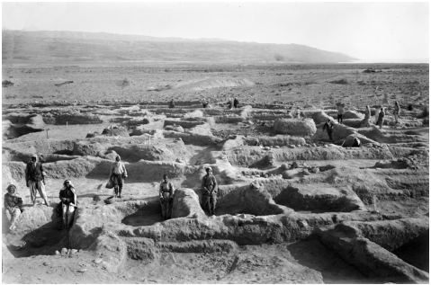

**(באדיבות ג׳ בריפה1933 ,. חפירות תולילת אל־ע׳סול1 איור )והמכון האפיפיורי, ירושלים** 

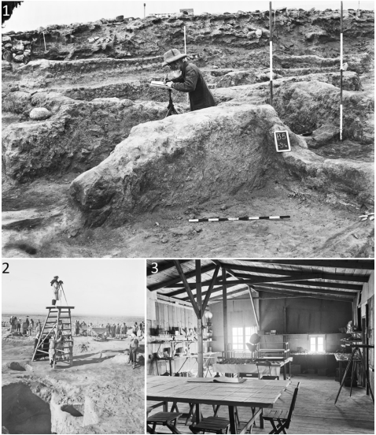

**. תיעוד החפירות בתולילת אל־ע׳סול והצריף ששימש2 איור את המשלחת בעת עבודת השדה (באדיבות ג׳ בריפה והמכון )האפיפיורי, ירושלים** 

### **מבוא** 

התקופה הכלקוליתית המאוחרת בארץ־ישראל וסביבותיה לפנה״ס, והתרבות3,800�4,500 מתוארכת לשנים הארכאולוגית העיקרית שאפיינה אותה היא התרבות תקופה זו נחשבת בעיני רבים התקופה1 .הע'סולית הפרהיסטורית האחרונה באזור, המסמנת שינויים מהותיים בחברה ובכלכלה, ובחידושים טכנולוגיים, והבולט בהם הוא פריחת תעשיית המתכת. מחקר התקופה החל לפני קרוב , בחפירות האתר תולילת אל־ע'סול1929למאה שנה, ב־ והוא נמשך עד ימינו אנו, בחשיפת2 ,)2�1 שבירדן (איורים 

3.מאות אתרים העשירים בממצאים רבים ומגוונים אתרי התקופה הכלקוליתית המאוחרת פרושים בעיקר מדרום־לבנון וסוריה בצפון ועד סיני בדרום, וממישור החוף במערב ועד רמת ההר הירדנית במזרח, והם משקפים קשרים תרבותיים בין קהילות על פני שטח נרחב ובאזורים גאוגרפיים ואקלימיים שונים. בעוד שקיימים קווי דמיון בתרבות החומרית בין אזורים שונים, ניכרים גם הבדלים בין־ אזוריים המצביעים על שונות פנים־תרבותית ועל השפעת מאפייני הסביבה, למשל בטיפוסי הכלים ובשיטות ייצורם או בכלכלת האתרים. תרבויות כלקוליתיות נוספות לתרבות הע'סולית הוגדרו על פי מיקומן הגאוגרפי ומאפייני התרבות החומרית שלהן, למשל זו של הגולן, עמק הירדן או הגליל ,העליון. להלן נסקור בקצרה את מאפייני התקופה העיקריים .ונציג כיווני מחקר חדשים המומלצים לקידום ופיתוח עתידי 

### **מאפייני התקופה הכלקוליתית המאוחרת** 

#### **היישובים** 

תפרוסת היישובים בתקופה הכלקוליתית המאוחרת מצביעה על המשכיות מתקופות קדומות, כמו ריכוזי יישובים בעמק הירדן והגליל, לצד אכלוס של אזורים חדשים שקודם לכן היו מיושבים בדלילות, כדוגמת מרכז־דרום רמת הגולן וצפון הנגב. יש להניח שתרמו לכך תנאי אקלים וכמות משקעים משופרת, שאפשרו אכלוס ושגשוג של כפרים חקלאיים ורעיית עדרים באזורים שהיו צחיחים יותר קודם 

.Albright 19321 .Mallon et al. 19342 .Rowan and Golden 2009 ;Bourke 2001 ;Gilead 1988 ;Levy 19983 

67 )2025  (תשפ״ו170 קדמוניות 

והן בהיבט הארגון החברתי והדרך שבה המרחב התחלק בין .קהילות בגדלים שונים אתרי התקופה הכלקוליתית המאוחרת כוללים כפרים חקלאיים גדולים, כתולילת אל־ע'סול שמצפון לים המלח ושקמים שבנגב, אך דומה שמרביתם היו צנועים בשטחם ולרוב לא נראה שהיה תכנון מוקדם של פרישת המבנים בכל יישוב. לעיתים קשה לקבוע במדויק האם מקבץ של אתרים אכן מייצג יישובים קטנים נפרדים, או שהם מהווים אתר אחד גדול, כמו בחלק מאתרי אגן נחל באר שבע. חלק ,מהמבנים בכפרים אלה הם גדולים בשטחם ומרובי חדרים ובהם חצרות ששימשו לאחסון, לעיבוד מזון והכנתו, להכנת כלים ופריטים שונים ועוד. נעשה גם שימוש נרחב במערות למגורים ולשימושים אחרים. בחלק קטן מאתרי הנגב הצפוני ) שנראה כי3 ישנם גם חללים תת־קרקעיים חפורים (איור .שימשו למגוון שימושים כאחסון, מגורים, פולחן ואף קבורה בכמה אתרים אף נמצאו בארות ובאחרים, בעיקר במישור החוף, נמצאו פירים, לעיתים עמוקים, לשימושים שונים 

.)4 (איור 

#### **אתרי הקבורה** 

אתרי הקבורה של התקופה כוללים מערות קבורה בודדות ובתי קברות שכללו מספר מערות או מבנים עיליים, שנקבעו 

לכן, כדוגמת צפון הנגב. ואכן, בחלק מהאזורים ניכרת עלייה משמעותית במספר האתרים ובצפיפות האוכלוסין בהשוואה ,לתקופות קודמות. דבר זה השליך על ניצול הנוף הקדום ,הן בהיבט הארגון הכלכלי והתפוקה החקלאית לכל יישוב 

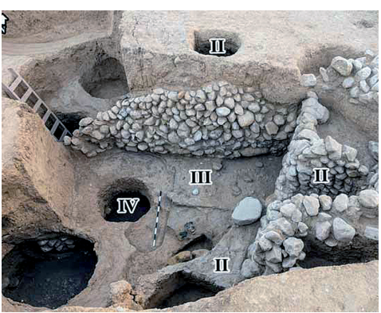

**. כמה שלבים של ממגורות תת־קרקעיות באתר צומת שוקת3 איור )(באדיבות ר׳ בארי ורשות העתיקות** 

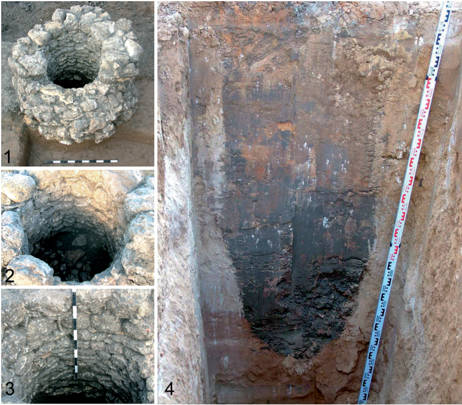

**. פיר ובאר באתר4 איור בדרך נמיר, תל אביב (באדיבות א׳ ון דן־ברינק )ורשות העתיקות** 

68 

)2025  (תשפ״ו170 קדמוניות 

חצובות או כוללות עיצוב והרחבה של חללים טבעיים. לרוב מתגלות במערות הקבורה קבורות שניות, כלומר הקבורה הראשונה של הנפטרים התרחשה באתר אחר, ומאוחר .יותר עצמות הנפטרים או חלק מהן הובאו לקבורה במערה ייתכן שבחלק מהמערות התקיימה גם קבורה ראשונה. כמות ,הנקברים בכל מערה משתנה מפרטים בודדים ועד עשרות ולעיתים נדירות נקברו מאות פרטים במערה כמו במערת פקיעין. בתי הקברות העיליים הבודדים המוכרים בנויים וכוללים מבנים או מעגלי אבן, כמו אלה שבמצד אלוף ), אתר שדומה6 שבנגב ובפלמחים שבמישור החוף (איור .ומייצג כפר מתים של ממש ,בתוך מערות ואתרי הקבורה התגלו מכלי קבורה מגוונים לרוב מחרס, ששימשו לאחסון עצמות המתים. הם כוללים ), אגנים וארגזי אבן וחרס, וכן כלים7 גלוסקמאות (איור מטיפוסי כלי היום־יום כדוגמת קערות, קנקנים ומחבצות ששימשו אף הם כמכלי קבורה. ייתכן שנעשה שימוש גם ,במכלי קבורה מעץ שלא שרדו את פגעי הזמן. לעומת זאת חפצים שהיו עשויים לשמש כמנחות קבורה, כדוגמת כלי .נחושת, קערות בזלת וכלי צור שונים, אינם נפוצים מאוד 

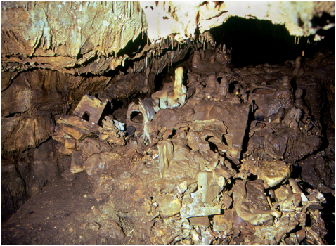

**. גלוסקמאות בתוך מערת הקבורה בפקיעין (באדיבות ד׳ שלם5 איור )ורשות העתיקות** 

לרוב הרחק מאתרי המגורים. הראשון שבהם נתגלה ונחפר . ומאז נתגלו עוד רבים4 ,1934 בצפון העיר חדרה כבר בשנת יש להניח שמאות רבות ואולי אלפים מאנשי התקופה נקברו במערות לאורך השנים, בעוד שמספר הנקברים באתרי היישוב היה קטן בהרבה. עדיין לא ברורה מערכת השיקולים בבחירת מיקומם של אתרי הקבורה בתקופה הכלקוליתית המאוחרת, כמו גם מי היו האוכלוסיות שנקברו בכל אחד .מהם ומי לא זכו לכך המערות הן לעיתים בודדות כמו המערות הקארסטיות ) ובנחל קנה שבשומרון, או מקבצים5 בפקיעין שבגליל (איור של עשרות מערות, כמו בחורבת קרקר שבשפלה. לעיתים נוצלו מערות טבעיות, אך רבות ממערות הקבורה בתקופה 

#### **חברה וכלכלה** 

בעבר הועלו שתי גישות עיקריות למבנה החברתי־ כלכלי בתקופה הכלקוליתית המאוחרת, בהסתמך על גודל היישובים, מבנה היישובים ורכיבים שונים בתרבות החומרית. גישה אחת הציעה מבנה היררכי בדגם של צ'יפדום, שהוא מעין משטר אזורי ובו שתיים או יותר )קבוצות מקומיות הנתונות למרות הצ'יף (או הצ'יפים העומד בראש המערכת. ישנם מבנים שונים של מערכת 

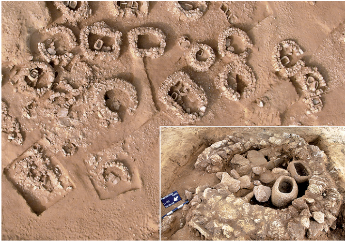

**. מבט כללי על בית6 איור הקברות בפלמחים. בהגדלה אחד ממבני הקבורה ותכולתו (באדיבות )א׳ גורזלזני ורשות העתיקות** 

.Sukenik 19374 

69 )2025  (תשפ״ו170 קדמוניות 

עצמות בעלי החיים משתנה מאתר לאתר. הצייד הינו רכיב שולי בדיאטה של התקופה. במהלך התקופה הכלקוליתית המאוחרת ניכר שימוש רב בחלב ובמוצריו, וזאת על פי עדויות עקיפות כמו ממשק העדרים (המין וגיל השחיטה של חיות העדר) והופעתן של מחבצות לחביצת חמאה באתרים ,רבים. קיימות גם עדויות ישירות לשימוש בחלב ותוצריו כחומצות שומן שמקורן בכלי חרס ששימשו להכנת מזון או 

> 7 .אחסונו, אך אלה עדיין מעטות הרכיב הצמחי בדיאטה כלל בעיקר מינים שונים של דגניים כמו חיטה ושעורה, וקטניות כדוגמת חומוס, עדשים ואפונה. מיני בר שונים מופיעים גם הם, וסביר שחלקם בדיאטה היה חשוב מכפי שאנו מעריכים כיום. נתון מעניין הוא העלייה הברורה בצריכת זיתים, ויש להניח שגם הפקת שמן הזית קיבלה חשיבות מיוחדת בתקופה זו. עדויות לניצול של מיני עצי פרי אחרים אינן רבות והן דורשות בחינה של מדגמים נוספים מאזורים שונים. לצד צריכת צמחים למזון, קיימות עדויות נדירות גם לניצול של דגניים לצורך ייצור אלכוהול. עדויות אלה מגיעות מניתוח שינויים 

8.במבנה עמילני הדגן בעת תהליך ההתססה של הבירה 

#### **תרבות חומרית** 

שינויים רבים מאפיינים את מכלולי התרבות החומרית בתקופה הכלקוליתית המאוחרת, ובעיקר את אלה הקשורים בייצור מזון, אחסנתו או הגשתו. חלק מטיפוסי הכלים מעידים על התפתחויות טכנולוגיות משמעותיות ועל ,התמחות מקצועית כמו גם על המיומנות הרבה של אומנים 

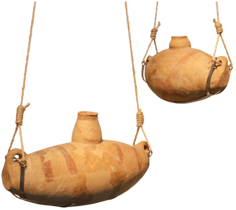

**. מחבצות חרס (אוסף רשות העתיקות, צילום © מוזיאון8 איור )ישראל, ירושלים** 

.Chasan et al. 20227 .Rosenberg et al. 20218 

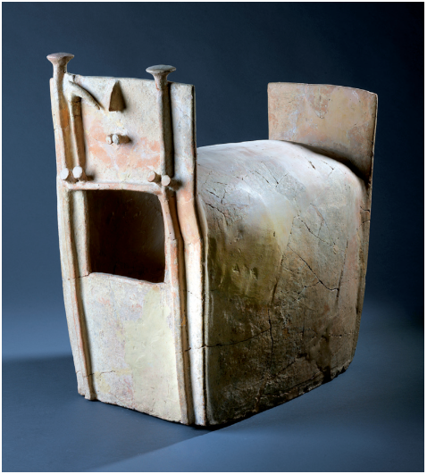

**,. גלוסקמת חרס דמוית מבנה מאזור (אוסף רשות העתיקות7 איור )צילום © מוזיאון ישראל, ירושלים, א׳ פוזנר** 

חברתית זו והיא לרוב גמישה. הנחה זו הועלתה לגבי יישובי ,הנגב הצפוני, ונטען שהיא תולדה של תהליכים חברתיים הגישה השנייה טוענת5 .כלכליים וטכנולוגיים קדומים יותר ,שאין תימוכין בממצא הארכאולוגי לארגון חברתי היררכי וגורסת שהמערך היישובי כלל ישויות חברתיות־כלכליות ,חקלאיות ויושבות קבע בעיקרן, בעלות מעמד דומה או זהה גישות6 .בדומה לארגון היישובים בתקופות קדומות יותר נוספות בשנים האחרונות הדגישו את חשיבותם האפשרית של כוהני הדת או מובילי הפולחן לארגון החברתי־כלכלי בתקופה הכלקוליתית המאוחרת. כך או כך, ניכרת עלייה בצפיפות היישובית בחלק מהאזורים ודומה שהארגון החברתי בתוך היישובים וביניהם עברו שינויים במהלך התקופה, אם כי קשה לאבחן בהם בתי אב המסמנים עושר או חשיבות גדולה במיוחד. משמעותם ועוצמתם של שינויים 

.אלה עדיין דורשת ניתוח ובירור כלכלת הקיום בתקופה הכלקוליתית המאוחרת התבססה לרוב על גידול עדרים וחקלאות של גידולי שדה. בתקופה ,זו מגיעה לשיאה התבססות הדיאטה הים־תיכונית באזורנו כחלק מתהליך שראשיתו למעלה מאלף שנים קודם. לצד דיאטה זו מתמסדים גם כלים ומסורות הקשורים בה ,ומשפיעים על אופן הכנת המזון, אחסונו וצריכתו. עיזים כבשים, בקר וחזירים מהווים את המקורות העיקריים של החלבון מן החי, ושכיחותם של מינים אלה במכלולי 

.Levy 1986; 2006: 8315 .Gilead 19886 

70 

)2025  (תשפ״ו170 קדמוניות 

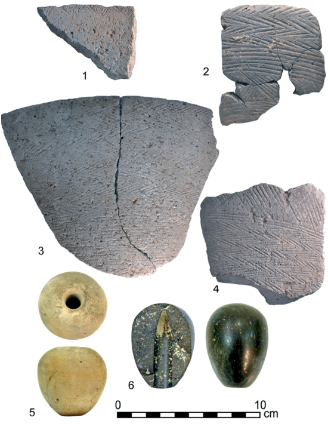

**. קערות בזלת מעוטרות מהאתר דרך נמיר בתל אביב4** � **1 .10 איור . ראשי אלות6** � **5 ,)(באדיבות א׳ ון דן־ברינק ורשות העתיקות ) המחבר** : **בנגב (צילום66B מאתר** 

.באובניים, להם זו העדות העקיפה הקדומה ביותר באזורנו ניכר שחלק מהכלים נוצרו על מחצלות שהותירו את חותמן ). חלק מכלי החרס של התקופה7�4 :9 על בסיסיהם (איור עוטרו בדגמים שונים, לרוב בצבע אדום או בעיטור דמוי חבל .שהוסף בהדבקת פסי טין, שבהם הוטבעו דפוסים שונים מכלולי כלי האבן הגדולים כוללים כלי שחיקה לעיבוד מזון, וקערות וקובעות בזלת רבות שמשקפות היכרות עמוקה עם חומר הגלם ויכולות סיתות יוצאות דופן. חלק ניכר מקערות הבזלת עוטרו בדגמים חרוטים של משולשים בצידן ) או בדגמים מורכבים על צידן החיצוני1 :10 הפנימי (איור , במחקרים שקיימנו בשנים האחרונות10 .)4�2 :10 (איור הראינו את תפוצת טיפוסי קערות הבזלת השונות ואת דפוסי העיטורים שלהן, ובתוך כך זיהינו את מקור חומר הגלם ואת מערכות ההפצה האפשריות שלהן, שחלקן הובילו קערות בזלת עד לנגב וסיני. בחלק מהאתרים נמצאו גם מתקני סלע מאורכים, לעיתים עשרות רבות מהם, ויש להניח שהללו 

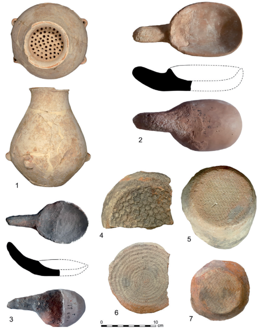

**. כלי מסננת ממודיעין (באדיבות א׳ ון דן־ברינק ורשות1 .9 איור** � **. כפות חרס מהאתר תולילת אל־ע׳סול (באדיבות3 2 ;)העתיקות** � **. טביעות מחצלת על7 4 ;)ג׳ בריפה והמכון האפיפיורי, ירושלים בסיסי כלי חרס מהאתר תולילת אל־ע׳סול (באדיבות ג׳ בריפה )והמכון האפיפיורי, ירושלים** 

דוגמת קדרים, סתתי אבן וצור, וחרשי מתכת. חלק מתוצרי תעשיות אלה קשורים בחיי היום־יום, בעוד שאחרים שימשו, יש להניח, בטקסים ובפולחן, אך דומה שאין הפרדה חדה בין אלה לאלה. התפתחותן של מלאכות וטכנולוגיות ,כגון אלה שנזכרו לעיל מסמנת שלב חדש בתולדות האזור שלב המבשר את הופעתן של מערכות הייצור וההפצה 

.המורכבות יותר שמאפיינות את תקופת הברונזה הממצא הבולט ביותר במרבית אתרי התקופה הכלקוליתית המאוחרת הינו כלי החרס. במכלולים אלה ניכר שינוי מהותי מתקופות קודמות, כולל הופעתם של טיפוסי יש להניח9 .כלים חדשים, וכן כאלה שנעלמו מיד לאחריה שחלק ניכר ממכלולי כלי החרס היו קשורים במזון, כגון ,הכנתו, אחסונו והגשתו, אך גם למטרות אחרות. לצד קערות ), מסננות וכלים8 קנקנים ואגנים, מופיעות גם מחבצות (איור ,), בזיכים3�2 :9 ), כפות (איור1 :9 שבפתחם מסננת (איור בקבוקים וקובעות. חלק גדול מהכלים נעשו ביד וחלקם נעשו 

.Rosenberg et al. 201610 

.Garfinkel 19999 

71 )2025  (תשפ״ו170 קדמוניות 

שחוררו בעיקר על ידי התזות והקשות עדינות רבות. כלים ,)11 אלה, הייחודיים לתקופה ושימושם אינו ידוע (איור משקפים התמחות בסיתות ברמה גבוהה. בשונה מתקופות פרהיסטוריות קודמות, ראשי החץ נדירים ביותר. זהו תהליך שראשיתו בתקופה הכלקוליתית הקדומה, ונראה שהוא קשור להסתמכות על בעלי חיים מבויתים בכלכלת הקיום ,ופחות על ציד חיות בר. עוד שכיחים מקדחים ומחוררים מגרדים לְוָחִּיִים ופריטים שנועדו לשימוש חד־פעמי ומכונים .״כלי אד הוק״ 

,מעט פריטי אובסידיאן, שמקורם באנטוליה וצפונה משם מוכרים בתקופה הכלקוליתית המאוחרת. נתון זה מעניין ,במיוחד לאור מאפייני תעשיית המתכת של התקופה ,שמקור חלק מהעפרות ששימשו לייצור הכלים שלה היה כפי הנראה, באזורים אלה גם כן. חרוזים שנעשו ממינרלים שונים, תליוני אבן, פריטי צדף, לוחיות אבן קטנות וחותמות ,אבן נמצאו אף הם, אם כי בכמויות משתנות מאתר לאתר ,כנראה עקב שיטות החפירה והסינון השונות. לעומת זאת כלי עצם העשויים ממגוון בעלי חיים מופיעים בשפע. עד כה נמצאו רק כמה עשרות חפצי שנהב, שנעשו מחטי פילים והיפופוטמים והם כוללים צלמיות אדם, כלי קיבול, סיכות 

12.)12 ותליונים, כמו גם חפצים ששימושם אינו ברור (איור אך אולי מרשימה מכולן היא תעשיית המתכת, המופיעה לראשונה בתקופה זו כתעשייה נרחבת ומקיפה, ואף העניקה תעשייה זו דרשה ידע13 .)13 לתקופה את שמה (איור והיכרות קרובה במיוחד גם עם חומרי הגלם והפיכת עפרות הנחושת למתכת שממנה נעשו הפריטים השונים, וגם עם ,שיטות הייצור וטכניקות היציקה השונות. לצד הנחושת שהיא המתכת השכיחה ביותר, מוכרים גם פריטים בודדים מזהב או מסגסוגת של זהב וכסף, ומעופרת. עד כה נמצאו ,מאות פריטי נחושת מתקופה זו ופריטים הקשורים בייצורם אך יש לציין שבמרבית אתרי התקופה לא נמצאה נחושת כלל, או שנמצאו רק מספר קטן של חפצי נחושת. יוצאים .מכלל זה הם שני אתרים 

הראשון הוא מערת המטמון בנחל משמר שבמדבר פריטי400  נחשף מטמון ובו מעל1961 יהודה, שבה בשנת נחושת אסופים במחצלת יחד עם מעט פריטים אחרים כמו חפצי שנהב. רוב החפצים הם ראשי אלות וכלים נוספים שנעשו בטכניקת ה״שעווה האבודה״. בשיטה זו יוצרים את דגם הפריט המבוקש משעווה או מחומר דומה כשומן וטובלים אותו בטין14 ,מן החי, כגון חמאה או חמאת־אפר מדולל במספר מחזורי טבילה וייבוש, עד שנוצרת תבנית .חומר שחלקה הפנימי קיבל את צורת הדגם המקורי כשהתבנית יציבה מספיק, צורפים אותה, והדגם נמס ואובד ). לתוךlost wax ,בחום הכבשן (ומכאן השם שעווה אבודה התבנית הצרופה יוצקים נחושת מסוגסגת מותכת, ולאחר 

.Rosenberg and Chasan 20212 .Bar-Adon 1980; Golden 200913 .Gershtein and Rosenberg 202514 

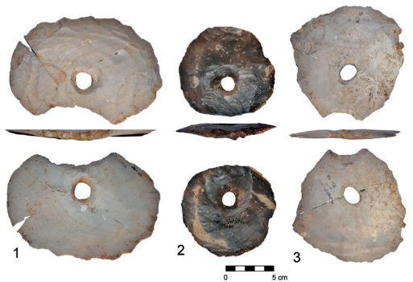

**) המחבר** : **. פריטי צור מחוררים מאתרי רמת הגולן (צילום11 איור** 

שימשו אף הם לשחיקת מזון ועיבודו. עוד מופיעים מכתשים וקעריות אבן קטנות, ראשי אלות, בעיקר מגיר והמטיט (איור ), משקולות פלך לטווייה, משקולות ומעט כלים דו־6�5 :10 .פניים, כמו גרזינים, ּכֵילַּפֹות ואזמלים ,כלים דו־פניים ששימשו לבירוא יערות ולעיבוד עץ וייתכן שגם לעיבוד השדות, לחציבה, ואולי גם ככלי נשק, מאפיינים גם את מכלולי הצור המגוונים, הכוללים במרכז ובצפון11 .בנוסף גם להבי מגל שכויתו במגלי קציר האזור מופיעים פריטי צור אובליים, עגולים ועדשתיים 

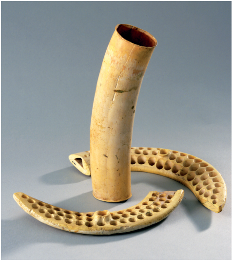

**. פריטי שנהב ממערת המטמון בנחל משמר (אוסף רשות12 איור )העתיקות, צילום © מוזיאון ישראל, ירושלים, י׳ להמן** 

.Hermon 200811 

72 

)2025  (תשפ״ו170 קדמוניות 

אזמלים וקרסי דיג, למשל. ״פריטי היוקרה״ מורכבים יותר ונעשו בתבניות סגורות בטכניקת השעווה האבודה. אלה .כוללים קנים, שרביטים, עטרות, כלי קיבול וראשי אלות ההבדל בין שתי התעשיות ניכר לא רק בטכנולוגיה שבה נוצרו (בתבנית פתוחה או סגורה), אלא גם במוצא המתכת ובמקום הכנת הפריטים. חלק מהפריטים המורכבים עשויים ,מעפרות הנחושת שמקורן באנטוליה וצפונה מאזור זה כנראה, בעוד שהיציקה שלהם נעשתה באזורנו, אולי בפצאל לעומת זאת, פריטים שנוצקו בתבניות פתוחות הוכנו16 .2 מעפרות נחושת שהובאו מאזור פינאן שבדרום ירדן או מתמנע ,שבערבה, והיציקה עצמה נעשתה ככל שאנו מבינים כיום בכמה אתרים בבקעת באר שבע. הקשר בין טיפוסי הפריטים שנוצקו וההרכב הכימי של הנחושת שנבחרה נבע בעיקר .מהצורך בשליטה בהתכת הנחושת ובקצב ההתקררות שלה 

#### **סימבוליקה, פולחן ודת** 

חשיבות רבה נודעת לשינוי שחל בתקופה הכלקוליתית המאוחרת בהיבטי ההסמלה של רעיונות, כמו גם בשינויים ,שחלו בדרך שבה תפסו אנשי התקופה את עצמם את סביבתם ואת העולם הבא, כפי שאלה מתבטאים בתרבות החומרית בכלל ובאתרי הקבורה בפרט. התקופה הכלקוליתית המאוחרת מסמנת שינוי משמעותי גם בפולחן ובתפיסות הדתיות, הן במספר הביטויים והן בגיוונם. כך למשל, בנוסף לאתרי הקבורה, שהינם מקומות פולחן 

שזו התקררה, שוברים את התבניות ונותרים עם חפץ הנחושת המבוקש, והוא עובר עוד שלבי ניקוי וגימור. חלק מהפריטים במערת המטמון עדיין נושא שרידים זעירים של ,החומר שהרכיב את התבנית ושל חלקי צמחים שעורבבו בו וכך ניתן לזהות את מקום הייצור ואף לתארך את זמן הכנת15 .התבנית 2 אתר שני שנתגלו בו חפצי מתכת רבים הוא פצאל שבבקעת הירדן. שם נמצאו פריטי נחושת רבים כמו גם פריטים נוספים הקשורים בייצורם, כולל עדויות למחזור חפצי נחושת ולשימוש בטכניקת השעווה האבודה. ההקשר הארכאולוגי של שני המכלולים שונה בתכלית ובעוד שהמכלול מנחל משמר הוא מטמון שלטיבו ומיקומו הוצעו בעבר פרשנויות רבות, הרי שהשני הוא יישוב ובו התקיימה תעשיית נחושת שכללה מחזור של פריטים שיצאו מכלל 

.שימוש מסיבות כלשהן תעשיית הנחושת של התקופה הכלקוליתית כוללת ,סוגי פריטים שונים, שבאופן מסורתי חולקו לשתי קבוצות ״כלי עבודה״ ו״פריטי יוקרה״, אם כי דומה שכלל תעשיית הנחושת בתקופה הכלקוליתית המאוחרת היא למעשה תעשיית ״יוקרה״ של חפצי פולחן. הנחה זו נסמכת על ,נדירות חומר הגלם, הצורך לשנע אותו ממקורות הנחושת אופי הפריטים כמו גם הידע והמומחיות הנדרשים בהכנת הפריטים. ״כלי העבודה״ שלרוב נעשו מנחושת טהורה שנוצקה לתבנית פתוחה, כוללים בעיקר גרזינים, אך גם 

**. מדגם מכלי המתכת ממערת13 איור ,המטמון בנחל משמר (אוסף רשות העתיקות )צילום © מוזיאון ישראל, ירושלים, פ׳ לני** 

.Rose et al. 202316 

.Goren et al. 202515 

73 )2025  (תשפ״ו170 קדמוניות 

). גם ״אלילי הבית״3 :14 הכינור״, שנעשו לרוב מאבן (איור ,שסותתו בבזלת שנמצאו באתרי הגולן שייכים לעולם זה כמו גם גלוסקמאות פיגורטיביות רבות שנמצאו במערות הקבורה. ניתן גם להזכיר צלמיות של בעלי חיים, בעיקר חיות מקרינות וציפורים, מוטיבים שחלקם שולבו בפריטי ,המתכת ובגלוסקמאות. ציורי הקיר בתולילת אל־ע'סול שייתכן שהם מעט המעיד על המרובה, גם הם עדות לעושר ולהיקף ההסמלה של רעיונות ושל תפיסות עולם בתקופה .הכלקוליתית המאוחרת 

חשובים בהגדרתם, ניתן לציין את הופעתם של אתרים חריגים המקושרים לפולחן, כמו למשל המבנה מעל מעיין עין גדי, ומבנים וחדרים מסוימים באתרי יישוב, כמו 17.בתולילת אל־ע'סול ובגילת ,בנוסף לפריטי הנחושת שהוזכרו לעיל בהקשר לפולחן ניתן למנות גם דימויים פיגורטיביים שהיו מפותחים בתקופה זו. אלה כוללים צלמיות אנתרופומורפיות (דמויות אדם), שחלקן נעשו מחרס, אבן ושנהב, והן מרובות פרטים ). אחרות הן מופשטות מאוד כמו ״צלמיות2�1 :14 (איור 

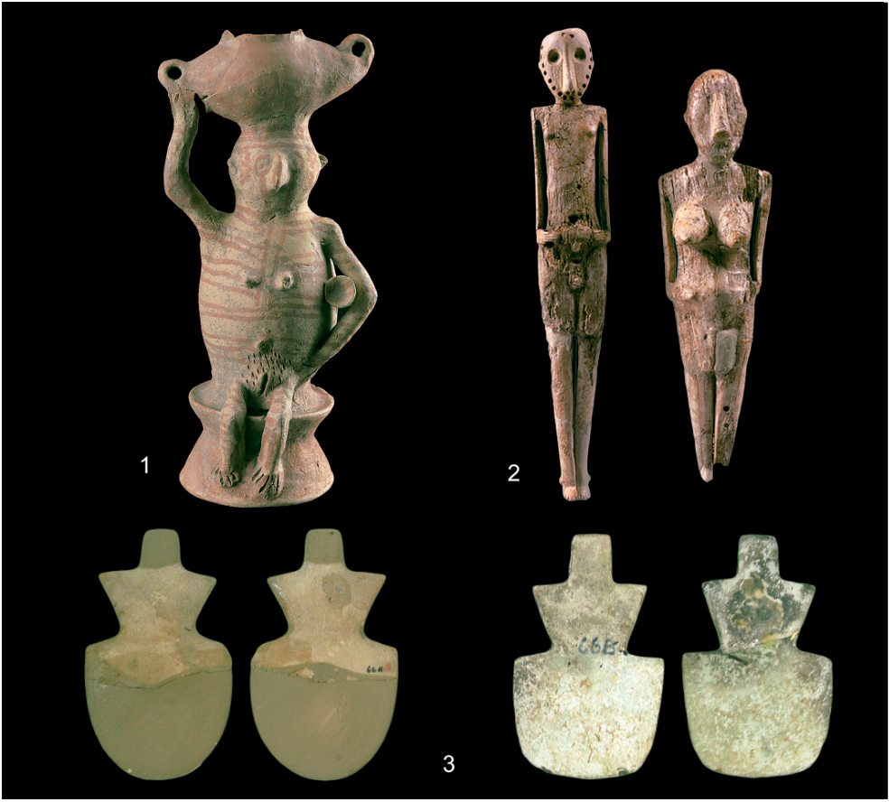

- **. צלמיות שנהב מביר א׳2 ;). צלמית אישה מגילת (אוסף רשות העתיקות, צילום © מוזיאון ישראל, ירושלים, א׳ פוזנר1** : **. צלמיות14 איור ) המחבר** : **בנגב (צילום66B . צלמיות כינור מאתר3 ;)צפאדי (אוסף רשות העתיקות, צילום © מוזיאון ישראל, ירושלים, ד׳ חריס** 

Bourke 2001 לתלוליות ע'סול ראו ;Ussishkin 1980  לעין גדי ראו17 .Levy 2006 ולגילת ראו ;Mallon et al. 1934 

74 

)2025  (תשפ״ו170 קדמוניות 

אוכלוסיות אנושיות, החלו סנוניות ראשונות של מחקרים מחקרי דנ״א קדום18 .מסוג זה גם בתקופה הכלקוליתית נוספים יאפשרו להעריך את חלקן של אוכלוסיות מקומיות ומהגרות בתמורות שחלו בתקופה. כמו כן, נוכל לאפיין את הקשרים הגנטיים בין אוכלוסיות ביישובים קרובים ורחוקים ולנסות ולמפות קשרי משפחה באתרים עצמם, בין אזורים שונים ובמיוחד באתרי הקבורה. בדרך זו נוכל להבין טוב יותר את מבנה הקהילות והקשרים ביניהן. המחקר הגנטי יאפשר גם לבחון את הקשרים בין האוכלוסייה הכלקוליתית המאוחרת בדרום הלבנט במעגלים שונים: ראשית באזורים ,קרובים כמו מצרים, ירדן וסוריה; במעגל שני כדוגמת עיראק איראן וטורקיה; ואף במעגל שמעבר לים, בקשר לעולם האגאי ולקפריסין, שעשוי להעיד על סחר ותנועה בדרך .הים, שכרגע הם ספקולטיביים לחלוטין 

**מה היה המבנה החברתי־כלכלי בתקופה ?הכלקוליתית המאוחרת** כלכלת הקיום של אוכלוסיות התקופה הכלקוליתית המאוחרת זכתה לאחרונה למיקוד חדש בדיאטה, נושא בו אנו עוסקים בעשור האחרון ביתר שאת ועם תוצאות ,מבטיחות במיוחד. כך נבחנים הרכיב הצמחי בה כמו הזית תפקיד החלב ומוצריו, והקשר בין כלים ובין סוגי מזון, דרך חקר שרידים עתיקים על הכלים ואופן השימוש בהם, ועל .)גבי שלדים (למשל גרגירי עמילן המחולצים מבין השיניים יחד עם זאת, במחקרים שאנו עורכים כיום נעשה מאמץ מחודש לבחון לא רק את הרכב הדיאטה אלא גם את היחסים השונים בין רכיבי כלכלת הקיום, למשל ההסתמכות על מקורות מן החי מול מקורות מהצומח ומאפייניהם, באתרים באזורים גאוגרפיים שונים, והקשר בין אלה לבין רכיבים 

.שונים של התרבות החומרית הוויכוח בנוגע למבנה החברתי של התקופה בין תפיסת הצ'יפדום לבין תפיסת החברה השוויונית יותר, יכול להסתייע בבחינת השינויים מהתקופה הקודמת. גודל היישובים והבדלים בגודל המבנים, ארגונם המרחבי, ואופי :הממצאים יסייעו לענות על שאלות המפתח הנדרשות כאן האם ניכרים הבדלים בין משפחות וקהילות? האם ניתן לזהות נקודות ברצף הזמן שבהן חל השינוי וגורמים שהובילו אליו? והאם ניתן לזהות למשל את מובילי הפולחן ואולי אף לאפיינם? לצד אלה דומה שיש לשקול הכללת רכיבים נוספים, ובעיקר היחס הכמותי ביניהם, על מנת לענות על .שאלות אלה 

בהקשר זה ובהקשרים אחרים שהוזכרו לעיל, דומה ,), שכבר התחלנו בוbig data analysis( שניתוח רב נתונים ואף שימוש בכלי בינה מלאכותית, הם כלים חשובים בקידום חקר התקופה. מדובר בניתוח רחב ומתוחכם של נתונים כדוגמת תעשיית הצור, החרס והאבן, תעשיית 

.Harney et al. 201818 

### **שאלות פתוחות, שיטות מחקר וכיוונים עתידיים בחקר התקופה הכלקוליתית המאוחרת** 

למרות מידע רב שהצטבר אחרי כמעט מאה שנות מחקר ארכאולוגי, דומה ששאלות רבות לגבי התקופה הכלקוליתית המאוחרת באזורנו, הנוגעות לתחילתה ולאחריתה ולפנים והשונות שלה, עדיין לוטות בערפל. כדי לענות על שאלות אלה, נדרשים שני דברים עיקריים: חפירה מבוקרת ברזולוציה גבוהה, איטית ומדוקדקת שתאפשר הבנה של תהליכי ;הרבדה ובתר־הרבדה באתרי יישוב ובמערות הקבורה ושימוש בשיטות מחקר מתחומי מדעי הארכאולוגיה בשדה ובמעבדה שיסייעו בניתוח הנתונים ובהבנתם. בעוד אלה ,שלובים במחקר הפרהיסטורי באזורנו כבר כמה עשורים .שילובם בחפירות הכלקוליתיות עדיין מצומצם יחסית 

#### – **מה הביא להתגבשות החברה ראשית וסוף בתקופה הכלקוליתית המאוחרת ומה הביא ?לאחריתה** 

קשה לקבוע את הסיבות להופעתן והתגבשותן של קהילות 4,500 התקופה הכלקוליתית המאוחרת, בערך סביב שנה מאוחר יותר. רמזים700לפנה״ס, והיעלמותן כ־ לראשית התקופה ניתן למצוא באתרים הקודמים מעט לתקופה הכלקוליתית המאוחרת, כמו האתר תל צף שבעמק שנים לפנה״ס), שננטש זמן4,700  עד5,300 הירדן (בערך קצר טרם התקופה הכלקוליתית המאוחרת, ובו כבר ניכרים ניצני התרבות החומרית העתידית. לגבי סופו של פרק זמן זה, השינויים שחלו בו וסיבותיהם עדיין אינם ברורים עד תום. הצעות שונות לגבי הגורמים לשינוי בתום התקופה ,כוללים למשל את השפעתה של מצרים ככוח עולה במרחב שינויים אקלימיים ושינוי ביחסי כוחות פנים־אזוריים. איסוף קפדני של נתונים מזירות מחקר שונות ומאתרים באזורים 

.שונים, יסייע לענות ביתר דיוק על שאלות אלה 

**מי היו הכלקוליתים, מה מקורם ואילו מערכות ?קשרים אזוריות הם קיימו** ,מקורה של אוכלוסיית התקופה הכלקוליתית באזור והקשרים והשפעות בין אוכלוסיות ותרבויות נידונים לרוב דרך זיקה ודמיון של פריטי תרבות חומרית. שיטות מחקר .נוספות מסייעות להבנת מקורות הייצור ורשתות הסחר כאלה הם המחקר הפטרוגרפי למיפוי המקורות הגאולוגיים של חומרי הגלם לייצור כלי חרס וגלוסקמאות, וגם המחקר הגאוכימי שאנו עורכים בשנים האחרונות שממפה את מקורות כלי הבזלת, החרוזים ופריטים אחרים העשויים ממינרלים שונים, ואף את מקורם של חפצי הנחושת. על תנועת בני האדם ובעלי החיים לאורך חייהם ניתן ללמוד .למשל מניתוח יחסי איזוטופים בעצמות ובשיניים לאחרונה, עם התקדמות מחקר הדנ״א הקדום של 

75 )2025  (תשפ״ו170 קדמוניות 

Gershtein, B. and Rosenberg, D. 2025, The Lost-Butter Technique: 

Golden, J.M. 2009 _, Dawn of the Metal Age: The Origins of Social_ 

_Complexity in the Southern Levant_ , London. 

Goren, Y., Ascher, Y., Shalev, S., Batiashvili, M., Nabisoy, G., Pagelson, 

Y., Pinsky, S. and Rosenberg, D. 2025, The Advent of Complex Metallurgy, _Journal of Archaeological Science_ 182: 106364. 

Harney, H., May, H., Shalem, D., Rohland, N., Mallick, S., Lazaridis, 

- Mallon, A., Koeppel, R. and Neuville, R. 1934, _Teleilat Ghassul I, 1929–1932_ , Rome. 

Sukenik, E.L. 1937, A Chalcolithic Necropolis at Hadera, _Journal of the Palestine Oriental Society_ 17: 15–30. 

Ussishkin, D. 1980, The Ghassulian Shrine at En-Gedi, _Tel Aviv_ 7: 1–44. 

,המתכת, מכלולי שרידי החי והצומח, מאפייני האומנות מנהגי קבורה והאדריכלות, נתונים סביבתיים ותיארוך רדיומטרי. שילוב מקיף של נתונים כאלה יספק תובנות על סוגיית המבנה החברתי־כלכלי ועל סוגיית החלוקה האזורית. בסיס נתונים שכזה יאפשר לבדוק גם לעומק מה הייתה השפעתם של תהליכים חברתיים ודתיים על הארגון החברתי של הקהילות. האם באמת ניתן לראות עלייה של מרכזי פולחן כפי שהוצע בעבר, ואם כן, מה השפעתם על התגבשות החברה? מה הייתה השפעת החידושים הטכנולוגיים כדוגמת הופעת תעשיית המתכת והשימוש באובניים על המערכת החברתית והכלכלית? כיצד הושפע גודל האוכלוסייה מגורמים כמו שינויי אקלים, שימוש גובר בתוצרים משניים כמו חלב וצמר, והגדלת תפוקת התוצרת החקלאית על ידי שימוש בהשקיה ובבקר לחריש ולנשיאת משאות? והאם הרכיב הנוודי, או הנוודי־למחצה, באותן )mixed farming( אוכלוסיות שהתבססו על כלכלה מעורבת היה דומיננטי יותר מכפי שאנו משערים? כלי זה יאפשר לחבר ולבודד מאפיינים כגון פולחן וטכנולוגיה ולקשור אותם למערכות אזוריות, ויסייע בהבנת התפתחותם וקצב השינוי .שלהם בתקופת מפתח זו 

### **סיכום** 

התקופה הכלקוליתית המאוחרת היא תקופה של תמורות רבות וחשובות בחיי האדם והחברה בדרום הלבנט, שינויים ,הניכרים בין השאר בהופעה ובפיתוח טכנולוגיות חדשות .במנהגי הקבורה ובפולחן, ובארגון הכלכלי של היישובים אף שקיימים בידינו כיום נתונים רבים מאתרים רבים, דומה שהדרך להבנה מקיפה של התקופה עוד ארוכה. נראה ששילובן של גישות תאורטיות מקיפות עם שיטות תיעוד ומחקר חדשות בשדה ובמעבדה ושימוש בטכנולוגיות ניתוח מתקדמות הזמינות כבר עתה לחוקרים, יאפשרו הבנה טובה יותר של החברה הכלקוליתית המאוחרת ומיקומה בתפר בין .החברות הפרהיסטוריות והחברות ההיסטוריות באזורנו 

### **רשימת מקורות** 

Bar-Adon, P. 1980, _The Cave of the Treasure: The Finds from the Caves in Nahal Mishmar_ , Jerusalem. 

76 

)2025  (תשפ״ו170 קדמוניות 

