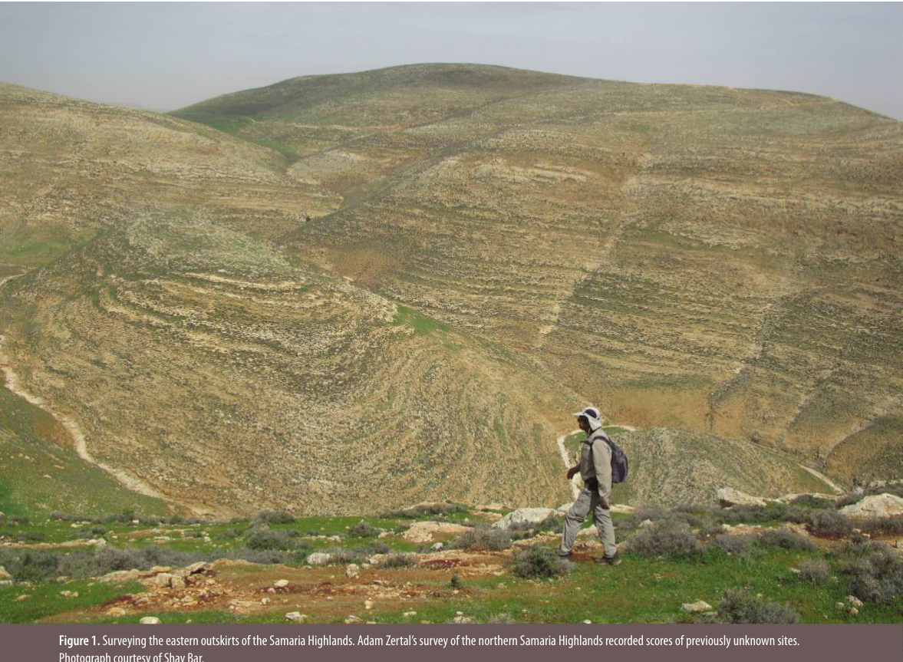
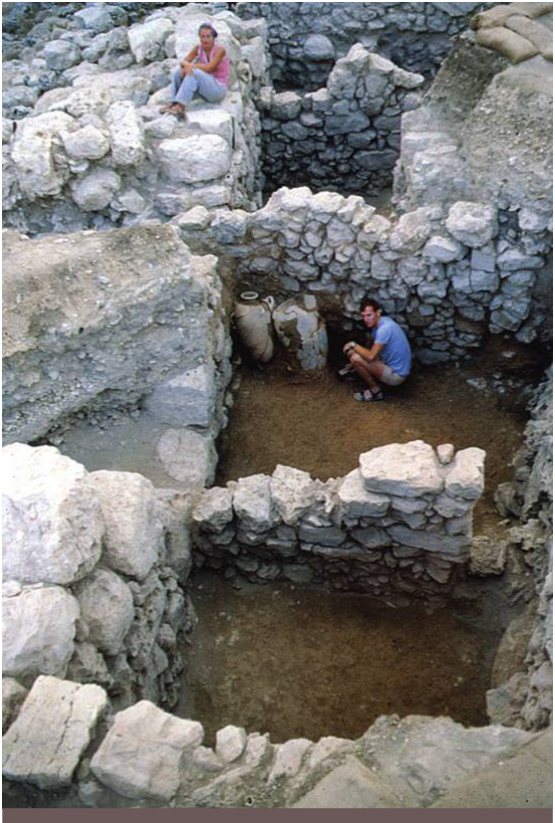
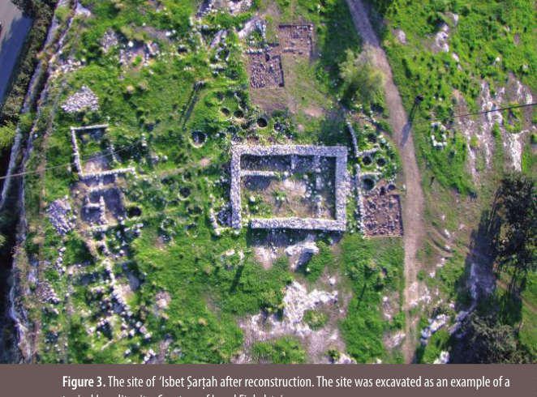
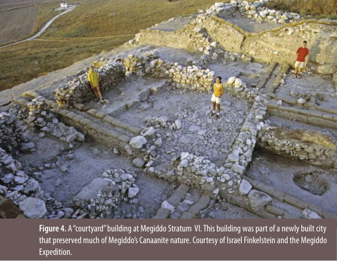
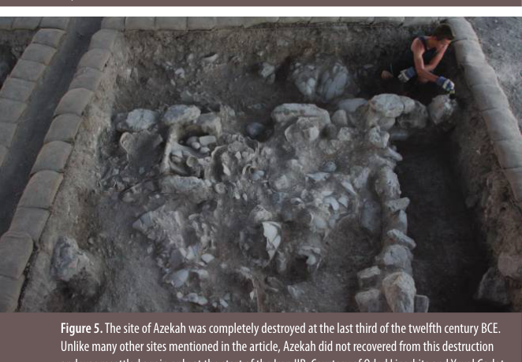
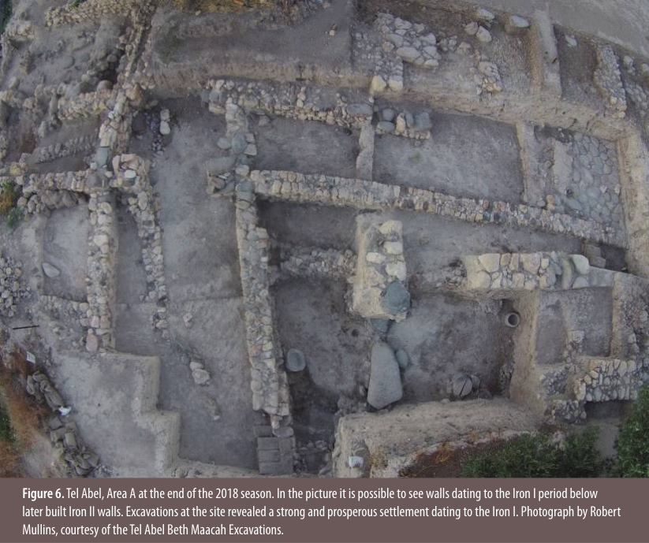
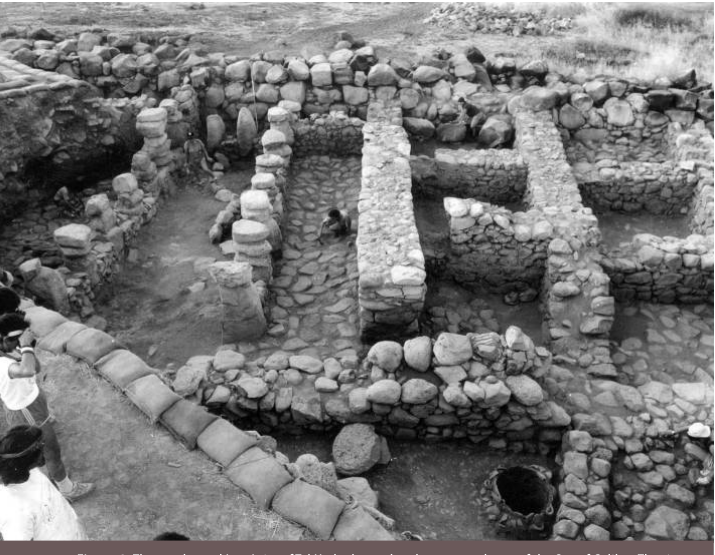
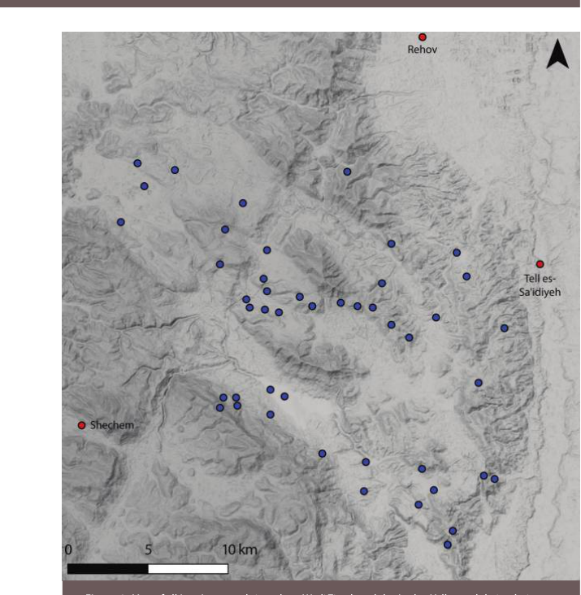
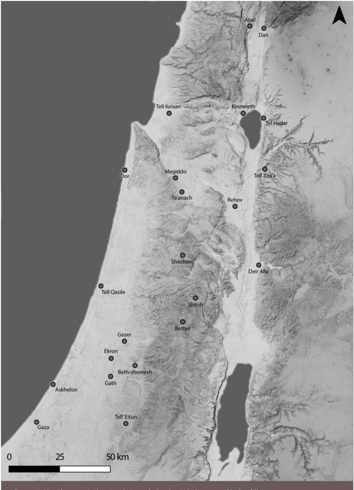

<!-- Translated automatically from Gadot NEA 2019  Iron I settlement and the urban centers.pdf via deep_translator/google on 2026-06-30 10:34:29. Source: step1_md/Gadot NEA 2019  Iron I settlement and the urban centers/Gadot NEA 2019  Iron I settlement and the urban centers.md -->

# **גל ההתיישבות ברזל I ברמת השומרון והקשר שלו עם המרכזים העירוניים**

## **_יובל גדות_**

**NEAR EASTERN ARCHEOLOGY 82.1 (2019)**

תוכן זה הורד מ-132.066.011.211 ב-09 במרץ 2019 04:38:39 AM. כל השימוש בכפוף לתנאים וההגבלות של אוניברסיטת שיקגו (http://www.journals.uchicago.edu/t-and-c).

**NEAR EASTERN ARCHEOLOGY 82.1 (2019)** תוכן זה הורד מתאריך 132.066.011.211 ב-09 במרץ 2019 04:38:39 AM. כל השימוש בכפוף לתנאים וההגבלות של University of Chicago Press (http://www.journals.uchicago.edu/).

<!-- Start of picture text -->
Figure 1.  Surveying the eastern outskirts of the Samaria Highlands. Adam Zertal’s survey of the northern Samaria Highlands recorded scores of previously unknown sites. <!-- End of picture text -->

**איור 1.** סקר את הפאות המזרחיות של הרי השומרון. הסקר של אדם זרטל בצפון הרי השומרון רשם עשרות אתרים שלא היו ידועים בעבר. צילום באדיבות שי בר.

אולם, לא משנה עד כמה התיאוריות הללו היו מהפכניות, מושג יסוד אחד היה משותף לכולן: ההנחה הבסיסית שלהן שההתנחלות "ישראל הקדומה" היא תגובה ותוצאה של קריסת המרכזים העירוניים הכנעניים - נפילה שהתרחשה בסוף תקופת הברונזה המאוחרת וכחלק מ"התמוטטות כל הציוויליזציות" שהתרחשה ברחבי העולם (29).

בהמשך, ברצוני לשאול האם זה בהכרח כך? האם נוכל לזהות בנתונים הארכיאולוגיים הרס סיטוני של כל המרכזים הכנעניים ועידן של חברה מבוססת כפר שנמשכה מאתיים שנה בכל רחבי הארץ? כפי שיוכח, הנתונים הארכיאולוגיים ההולכים וגדלים של המאות השתים עשרה עד העשירית לפני הספירה מאזורים כמו מישור החוף ועמק יזרעאל, ירדן ועמק החולה מחייבים הערכה מחדש של תרחיש זה.

### **היסטוריה של המחקר**

הארכיאולוגיה וההיסטוריה של ישראל הקדומה חייבות חוב גדול לאלברכט אלט, שהיה הראשון לאמץ נקודת מבט ארוכת טווח

במחקרו על תהליך ההתיישבות של בני ישראל. בהתבסס על ביקורת טקסטואלית על התנ"ך ומקורות עכשוויים אחרים מהמזרח הקרוב, כגון מכתבי עמארנה, שיער אלט שבני ישראל התיישבו אט אט בארץ הפנויה של שומרון והרי יהודה. כדי לאמת את ההשערה של אלט היה צורך לחקור את הקרקע בין הערים, לבצע סקרים של אתרי התיישבות בקנה מידה קטן ולחפור אחד או שניים מהם. הדור הראשון של החוקרים, לעומת זאת, בחר לחפור באתרים המרכזיים, כלומר שכם, תל דותן ותענק, וכך הצליח לחשוף את טבעם של המרכזים העירוניים הכנעניים רק בתקופת הברונזה התיכונה והמאוחרת, אך תרומתם להבנת עלייתה של ישראל הייתה מוגבלת.

רק עם פרסום "סקר החירום" שנערך בהרי השומרון ויהודה (כוכבי 1972) הצליחו החוקרים לזהות אתרי ברזל 1 רבים שמעולם לא תועדו. כוכבי מיהר להבין שחקר אתרים אלו יכול להוסיף במידה ניכרת להבנתנו את התיישבות בני ישראל באזור הליבה של השומרון. ככל שהזמן התקדם, החלו סקרים חדשים ונערכו שני פרויקטים אזוריים גדולים בדרום

**34 NEAR EASTERN ARCHEOLOGY 82.1 (2019)**

תוכן זה הורד מ-132.066.011.211 ב-09 במרץ 2019 04:38:39 AM. כל השימוש בכפוף לתנאים וההגבלות של אוניברסיטת שיקגו (http://www.journals.uchicago.edu/t-and-c).

**איור 2.** חפירות באתר שילה (1981–1985). צילום באדיבות ישראל פינקלשטיין.

וצפון הרמה השומרונית (איור 1; פינקלשטיין 1994; צרטל 1994). שתי העבודות זיהו עלייה משמעותית במספר האתרים ותוארכו למאות השתים-עשרה לפנה"ס. בעוד שזרטל קשרה את הנפיחה הזו לעלייתם של "הישראלים" לאזור, רוב החוקרים הכירו בעובדה שהאתרים החדשים אינם תוצאה של עלייה מאורגנת כמתואר בספר יהושע. לחילופין, ארכיאולוגים והיסטוריונים מקראיים חיפשו הסבר שראה בעלייה זו תוצאה של תהליכים חברתיים פנימיים. פינקלשטיין ציין את העובדה שגל ההתיישבות של ברזל I לא היה ייחודי ויש להסבירו לאור שני גלים קודמים המתוארכים ל-EB I ול-MB II. זה הביא אותו להכרה כי נסיבות סוציו-פוליטיות וכלכליות משתנות הפעילו לחץ על אוכלוסיית הרמות להתאים את אסטרטגיות הקיום שלה ולעבור או לנודה בין נוודות לישיבה. ליתר דיוק, לגבי הברזל הראשון, טען פינקלשטיין כי קריסת המרכזים העירוניים בסוף תקופת הברונזה המאוחרת הביאה לכך שהנוודים המתמחים מבחינה כלכלית של הרמות איבדו את השווקים שלהם. כתוצאה מכך, הם נאלצו להתיישב ולפתח כלכלה מעורבת המבוססת על רעיית צאן, חקלאות וגננות. חוקרים אחרים באותה תקופה

התווכח עם פינקלשטיין באשר למוצאם של רוב המתיישבים החדשים, אך גם היו משוכנעים שהערים המתפוררות מחד גיסא והלחץ ההולך וגדל של האדונים המצריים מאידך גיסא הם שהביאו מתיישבים חדשים לביטחון היחסי שמציעה שטח ההפקר של הרי השומרון.

תרחיש שונה מאוד מבחינה רעיונית הוצע על ידי בונימוביץ (1994). נקודת המוצא לשחזורו היא הידוק הניצול המצרי של השפלה במהלך החלק האחרון של המאה השלוש עשרה והמחצית הראשונה של המאות השתים עשרה לפני הספירה. כתוצאה מכך, לטענתו, אוכלוסיית הנוודים ששוטטה בעמקים נדחקה אל הרמות ולא הייתה לה שום אפשרות אחרת מאשר להתיישב (ראה בהמשך).

הוצאתו לאור של _מהנודנות למונרכיה_ (פינקלשטיין ונאמן 1994) היה שיאו של עשור וחצי של פעולות שטח ושמטרתו לעורר מחקר נוסף. אולם במציאות זה סימן את סוף עידן. כתוצאה מהאינתיפאדה הפלסטינית הראשונה (1987–1989) והסכמי אוסלו (1993), פסק המחקר על אתרים הנמצאים בהר השומרון; לא נערכה שם עבודת שדה משמעותית מאז אותה תקופה ולא נעשו נתונים חדשים שיכולים לקדם את המחקר שם. תשומת הלב והעניין של המלומדים, לעומת זאת, לא דעכו. מאז פורסמו עשרות מאמרים וספרים. עם מעט נתונים חדשים, מחקרים אלה הציעו בעיקר מסגרות תיאורטיות לפירוש מידע שהיה זמין בעבר. אם כבר, מאמרים אלה קראו לנקוט משנה זהירות בעת הערכת הבעת זהות באמצעות תרבות חומרית (למשל, Bloch-Smith 2003). על ידי התבוננות במרכיבים השונים המרכיבים את התרבות החומרית של ההר, חוקרים הטילו ספק בשימושם כסממנים אתניים. נדונו בתים בני ארבעה חדרים, פיתוי צווארון והימנעות מחזירים ומעמדם כסמני זהות נמצא מפוקפק במקרה הטוב (ראה ספיר-חן בגיליון זה ובמבוא לסוגיה זו). כתוצאה מכך, החיפוש אחר ישראל הקדומה עבר מחיפוש אחר סמני זהות לניתוח היווצרות המורכבות החברתית.

דבר אחד נותר ללא שינוי לאורך השנים: ההתרחבות הדרמטית במספר האתרים בתקופת הברזל. בין אם צמיחת המלוכה בישראל הייתה תהליך חברתי, שינוי זהות או שניהם, כל ניתוח חדש של העדויות חייב להתחיל בהסבר הסיבות לגידול הדרמטי הזה. למרבה הצער, יש לנו מעט נתונים חדשים לגבי אתרים אלה: התיארוך שלהם עדיין מבוסס בעיקרו על כלי חרס, ולא הכלכלה שלהם ולא הקשרים האזוריים שלהם מעולם לא נחקרו בשיטות טבעיות, מבוססות מדע.

### **הרמה השומרונית: תנודת ההתנחלויות**

תוצאת הסקרים שערכו אדם זרטל וישראל פינקלשטיין בהר השומרון מלמדת על עלייה ברורה ביותר במספר האתרים במהלך המעבר מתקופת הברונזה המאוחרת לברזל 1 ובגבהות מדרום ומצפון לשכם. טבלה 1 מסכמת את כל הנתונים הזמינים מהסקרים שפורסמו שנערכו ברמות הגבוהות.

**NEAR EASTERN ARCHEOLOGY 82.1 (2019) 35** תוכן זה הורד מתאריך 132.066.011.211 בתאריך 09 במרץ 2019 04:38:39 AM כל השימוש בכפוף לתנאים וההגבלות של University of Chicago Press (http://www.educ/tica-goand).

<!-- Start of picture text -->
Figure 3.  The site of  ‘Isbet Sartah after reconstruction. The site was excavated as an example of a artah after reconstruction. The site was excavated as an example of a ah after reconstruction. The site was excavated as an example of a <!-- End of picture text -->

**איור 3.** האתר של 'אסבת סרטה לאחר שיקום. האתר נחפר כדוגמה לארתה לאחר שחזור. האתר נחפר כדוגמה לאח לאחר שחזור. האתר נחפר כדוגמה לאתר ישראלי טיפוסי. באדיבות ישראל פינקלשטיין.

<!-- Start of picture text -->
Figure 4.  A “courtyard” building at Megiddo Stratum  VI. This building was part of a newly built city that preserved much of Megiddo’s Canaanite nature. Courtesy of Israel Finkelstein and the Megiddo Expedition. <!-- End of picture text -->

<!-- Start of picture text -->
Figure 5.  The site of Azekah was completely destroyed at the last third of the twelfth century BCE. Unlike many other sites mentioned in the article, Azekah did not recovered from this destruction <!-- End of picture text -->

**איור 5.** אתר עזקה נהרס כליל בשליש האחרון של המאה השתים עשרה לפני הספירה. בניגוד לאתרים רבים אחרים המוזכרים בכתבה, עזקה לא התאושש מהחורבן הזה ויושב מחדש רק בתחילת ה-Iron IIB. באדיבות עודד ליפשיץ ויובל גדות, משלחת לאוטנשלאגר אזקה.

**טבלה 1: מספר אתרי LB ו-Iron I שנסקרו בהרי השומרון כפי שדווחו על ידי זרטל ופינקלשטיין ולדרמן**

|**Subregion**|**LB**|**IA I**|**Reference**|
|---|---|---|---|
|Southern Samaria|91|129|Finkelstein and Lederman 1997, 893–96|
|Shechem anticline|18 (15)2|56|Zertal 2004, 53–55|
|Eastern Valleys|13 (9)3|47|Zertal 2008, 82–86|
|Nahal ‘Iron to Shechem anticline|10 (6)4|42|Zertal 2016, 38–41|
|From Nahal Bezeq to the Sartaba5|11|60|Zertal 2005|

ממידע לגבי ההקטרים ​​המיושבים הכוללים כפי שחישב פינקלשטיין עולה כי העלייה לא הייתה רק במספר האתרים; זו הייתה גם עלייה דמוגרפית. ייחודה של דפוס היישוב ברזל 1 טמון לא רק במספר האתרים ובשטח המיושב הכולל, אלא גם במרחב לחלקים שהיו מיושבים בדלילות בעבר של הרמות. התפוצה המרחבית של אתרים המתוארכים לברזל I מלמדת שהם מתקבצים לארבעה צבירים: הצפוני ביותר ממוקם סביב בקעת דותן ונראה שהוא מקשר או לפחות מקיים אינטראקציה עם יישובים הנמצאים בעמק יזרעאל. מקבץ שני ממוקם סביב השומרון ושכם ומקיים אינטראקציה עם אתרים עכשוויים הממוקמים לאורך ואדי אל-פרעה ובקעת הירדן. מקבץ שלישי נמצא דרומה יותר סביב שילה (איור 2), והרביעי כולל אתרים הנמצאים ברמת בנימין. חלק מהאתרים, במיוחד אלה הממוקמים קרוב יותר למישורים מסביב, מראים המשכיות רבה יותר בין תקופת הברונזה המאוחרת לתקופת הברזל I. כך למשל, מבין עשרים וארבעה אתרים באשכול הצפוני, שמונה התיישבו גם בתקופת הברונזה המאוחרת. לעומת זאת, רק חמישה מתוך שלושים ושישה אתרים במקבץ סביב השומרון התיישבו בעבר.

לתארוך את תחילת גל ההתיישבות יש חשיבות מכרעת כדי להבין את ההקשר שלו ואת הכוחות שייתכן שהפעילו אותו. יש לנו ידע מפורט יחסית על הנסיבות המשתנות של המאות השתים עשרה עד האחת עשרה לפני הספירה. עם זאת ביד, חיוני שנקבע האם גל ההתנחלויות החל לפני או אחרי הנסיגה המצרית וכיצד הוא קשור להרס ולתחייה של מרכזים עירוניים כנעניים. למרבה הצער, רוב אם לא כל האתרים שנסקרו תוארכו באופן יחסי; כלי חרס אינדיקטיביים שנאספו מפני השטח כדי לקבוע כרונולוגיה הביאו לתיארוך שאינו מדויק בשום אופן. כלי חרס של ברזל I הם במובנים רבים מעביר מתקופת הברונזה המאוחרת ובאזורים של המשכיות תרבותית אין דרך אמיתית להבדיל בין כלי החרס המקומיים של סוף המאות השלוש עשרה, הי"ב והאחת עשרה לפני הספירה. מכאן, למשל, יש לנקוט בניסיון של זרטל לחלק את האתרים לשלבים כרונולוגיים

**36 NEAR EASTERN ARCHEOLOGY 82.1 (2019)** תוכן זה הורד מתאריך 132.066.011.211 בתאריך 09 במרץ 2019 04:38:39 AM. כל השימוש בכפוף לתנאים וההגבלות של אוניברסיטת שיקגו (http://www.journals.uchicago.edu).

בזהירות (Zertal 1994, 58–59). גישה טובה יותר תהיה לארגן מכלולים של כלי החרס של האתרים שנחפרו על סמך כרונולוגיה, תוך שימוש בתאריכים מוחלטים של14 C במידת האפשר (Finkelstein and Piazetsky 2006). האתר היחיד שתוארך ל14 ג' הוא שכבה V שילה, שנמצאה כיושבת במחצית הראשונה של המאה האחת עשרה לפני הספירה. התיארוך של כל שאר האתרים שנחפרו, כמו הר עיבל או אל-אחוות, נחשב ביחס למכלול החרסים של שילה החמישי, כאשר חלק מהאתרים התיישבו מוקדם יותר (למשל גילה) וחלק מאוחר יותר (כגון 'עזבת סרטא ב'-א'; איור 3). מבחינה מתודולוגית יש לזכור שתמיד קשה לצפות בהתחלות של תהליכים בתיעוד הארכיאולוגי, שכן הם נמחקים על ידי פעילויות מאוחרות יותר. לפיכך, ללא מחקר שטח נוסף, ניתן רק להסיק שגל ההתיישבות החל כבר במאה הי"ב לפנה"ס והגיע לשיאו במהלך המאות האחת עשרה והעשירית לפנה"ס.

<!-- Start of picture text -->
Figure 6.  Tel Abel, Area A at the end of the 2018 season. In the picture it is possible to see walls dating to the Iron I period below later built Iron II walls. Excavations at the site revealed a strong and prosperous settlement dating to the Iron I. Photograph by Robert Mullins, courtesy of the Tel Abel Beth Maacah Excavations. <!-- End of picture text -->

**איור 7.** שחזור תלת מימדי של רובע מגורים מתוכנן היטב באתר תל כנרות. באדיבות כריסטה לנרט וברבל שונווייס-מהרינג, פרויקט אזורי כנרת.

**NEAR EASTERN ARCHEOLOGY 82.1 (2019) 37** תוכן זה הורד מתאריך 132.066.011.211 בתאריך 09 במרץ 2019 04:38:39 AM. כל השימוש בכפוף לתנאים וההגבלות של University of Chicago Press (http://www.edu/tica-goand).

**איור 8.** אתר "ברזל I" המתוכנן מראש בתל הדר השוכן בחוף המזרחי של הכנרת. האתר נחפר על ידי משה כוכבי ופרייה בק עבור אוניברסיטת תל אביב. באדיבות אסף קליימן ומכון סוניה ומרקו נדלר לארכיאולוגיה, אוניברסיטת תל אביב.

**איור 9.** מפת כל האתרים שנסקרו ברזל 1 לאורך ואדי תרצה ובקעת הירדן והקשר שלהם לאתרים העירוניים שכם, תל-סעדיה ורחוב. הוכן על ידי אסף קליימן.

### **המשכיות עירונית כנענית**

בעוד חקר הארכיאולוגיה של הרמה השומרונית של ברזל 1 נמצא במצב של אנימציה קפואה בעשרים השנים האחרונות, האמנם שלנו לגבי אזורים שכנים כמו בקעת יזרעאל וירדן כמו גם מישור החוף השתנה לחלוטין.

דפוס ההתיישבות העירוני בעמקים ממערב, צפון ומזרח השומרון במהלך המאה הי"א לפנה"ס צוין על ידי פינקלשטיין שהצביע על תפקידיהם של דור, מגידו, רחוב וכנרת כמרכזים עירוניים מרכזיים במאות האחת עשרה והעשירית לפנה"ס (פינקלשטיין 2003). מחקר שפורסם מאז רק חיזק את התצפית הזו. מחקר ארכיאולוגי אינטנסיבי בעמקים בצפון, בחלקים השונים המרכיבים את מישור החוף והשפלה, שינה בהדרגה את הבנתנו לגבי גורל התרבות הכנענית.

אתר מפתח להבנה חדשה זו של המאות השתים-עשרה והאחת-עשרה-עשירית הוא מגידו. שכבה VIIA נחשבת בעיני רבים לאחרונה מבין ערי "תקופת הברונזה המאוחרת" במגידו. הרס שלה תוארך באופן מסורתי לאמצע המאה השתים עשרה לפני הספירה בערך. עבודות אחרונות מלמדות באופן חד משמעי כי יש להציב את ההרס בסוף אותה מאה, אולי אף מאוחר יותר וכי העיר לא חוותה הרס סיטונאי (Finkelstein et al. 2017). מחקר על כלכלת העיר מראה התעצמות בתחומה ובניצול בעלי חיים, תהליך הקשור בהמשכיות הנוכחות המצרית בכנען.

העובדה שמגידו נהרסה בחלקה מאוחר כל כך פירושה שתחייתה בוודאי התרחשה מהר יותר מכפי שהודע קודם לכן, וכי עד אמצע המאה האחת-עשרה העיר חזרה לכוחה. העיר החדשה שכבה VI נבנתה באותם קווים של העיר מתקופת הברונזה המאוחרת, אם כי בקנה מידה פחות מפואר. שכבה VIA נהרסה כליל במהלך המאה העשירית לפני הספירה, חורבן המסמן את סופה של התרבות העירונית ה"כנענית" (איור 4).

מגידו היא דוגמה אחת לתהליך ששטף את האזור במהלך המאות השתים עשרה עד העשירית לפני הספירה. בשנים הראשונות נרשמה התעצמות של השליטה המצרית על חלקים מהמדינה ככל שמעורבותה הפכה ישירה יותר. זה כלל הקמת אחוזות קטנות לאורך דרום מישור החוף וחיזוק ובנייה מחדש של המצודות ביפו ובבית שאן. אופי ועוצמת האינטראקציה בין הערים הכנעניות המקומיות לאתרים בעלי אוריינטציה מצרית שונים ממקום למקום, כאשר חלק מהאתרים מראים מעורבות מצרית ישירה יותר ואילו באחרים ההתאחדות הייתה עדינה יותר.

**38 NEAR EASTERN ARCHEOLOGY 82.1 (2019)** תוכן זה הורד מתאריך 132.066.011.211 ב-09 במרץ 2019 04:38:39 AM. כל השימוש בכפוף לתנאים וההגבלות של אוניברסיטת שיקגו (http://www.journals.uchicago.edu).

יישובי בקעת הירדן באו לאפיין מרכזים עירוניים. אתרים כמו תל רחוב, טל זירעא וטל דיר אלה החלו להפגין המשכיות תרבותית ופוליטית במעבר מתקופת הברונזה המאוחרת לברזל 1 (איור 9). עבודה שנערכה סביב מגידו מלמדת שהעיר לא הייתה מבודדת ושמערב עמק יזרעאל נהנה מתקופה של התחדשות. כמו כן, חודש סחר בין-אזורי וימי, כפי שהציעו עבודות שבוצעו ב"דור" המביאות לידי ביטוי את מעמדה כנמל כניסה למסחר המגיע בעיקר ממצרים ומארצות זרות אחרות. אתרים כמו תל קייסן ותל קסיל, אשדוד, אשקלון וכנראה גם עזה מראים שדור לא הייתה לבד בקשר עם סחר ימי. עם זאת, רוב הערים היו מקומיות יותר בכלכלתן ופיתחו רשת חילופין מקומית בעיקרה. המשכיות תרבותית מדווחת מתל גזר, תל בית שמש ותל עטון. רחוק יותר מדרום מערב, המרכז העירוני של עקרון הגיע לשיאו במהלך המאה האחת עשרה, רק כדי שהוחלף בעיר גת. קרוב יותר לסוף העידן חודש ייצור הנחושת בערבה והדבר הביא לשינויים רחבי היקף בדפוס ההתיישבות של הנגב ומישור החוף הדרומי. האזור הפנימי של השפלה התחתית, שטחה לשעבר של לכיש, הוא האזור היחיד שלא התאושש משנות התסיסה הפוליטית.

### **יישובי Iron I בהקשר**

**איור 10.** מפת אתרים עירוניים שנחפרו מתקופת ברזל 1. מפה שהכין אסף קליימן.

נסיגת האימפריה המצרית מדרום הלבנט, שתוארכה על ידי רוב החוקרים לעשורים האחרונים של המאה השתים עשרה לפני הספירה, גררה אחריה תסיסה חברתית ומלחמות פנימיות הרסניות. חלק מהאתרים חוו הרס סיטונאי (לכיש, עזקה) שממנו התאוששו רק לאחר יותר ממאה שנה (איור 5), ואחרים נהרסו רק חלקית (מגידו). אלו היו שנים בעייתיות שבהן נראו שינויי כוח בין האליטה המסורתית שסמכה על האימפריה המצרית עבור סמכותן לבין אליטות חדשות יותר שביססו את הלגיטימיות שלהן על מקורות מקומיים.

בתוך כמה עשורים סדר חברתי חדש הגיע לאיזון ומרכזים עירוניים פרחו על פני רוב הארץ. השטח שנשלט בעבר על ידי חצור התחלק לפחות בין שתי ישויות (סרגי וקליימן 2018): אחת במרכזה בעמק החולה, שכלל אתרים מרכזיים בתל אביל אל-קאמה (אבל בית מעכה; איור 6) ותל דן, ואחת שמרכזה סביב הכנרת וכלל את האתר תל כנרת (8) וחד.

תיאוריית "נוודות למונרכיה" ניסתה להסביר את הופעתם של אתרים רבים ברחבי הרמה השומרונית כתגובה לקריסת התרבות העירונית הכנענית. בין אם מתיישבי הרמות שתמיד היו שם ורק שינו את אסטרטגיית הקיום שלהם, ובין אם פליטים מהמרכזים העירוניים הנרקבים, המניע העיקרי להתיישבות ברמות הוא קריסת החברה העירונית בשלהי תקופת הברונזה המאוחרת. נראה ש

**NEAR EASTERN ARCHEOLOGY 82.1 (2019) 39** תוכן זה הורד מתאריך 132.066.011.211 בתאריך 09 במרץ 2019 04:38:39 AM. כל השימוש בכפוף לתנאים וההגבלות של אוניברסיטת שיקגו (http://www.edu/tica-goand).

פרשנויות אלו היו מוגבלות בפרדיגמה של תחרות בין מתיישבי השפלה לאלה של הרמות, פרדיגמה ששורשיה בנרטיב של ספר שופטים. אמנם יחסים אנטגוניסטיים אלו נכונים כנראה לסוף התהליך, כלומר המעבר ל-Iron IIA ועלייתן של המדינות הטריטוריאליות (ראה סרגי בגיליון זה), אבל אין סיבה להניח שהם מאפיינים גם את תחילת התהליך.

הסקירה המובאת כאן מראה באופן סופי שהעירוניות הכנענית לא קרסה אלא עברה תקופה של מהומה. בסוף המאה השלוש עשרה ותחילת המאה השתים עשרה לפני הספירה נהרסו כמה מרכזים כנעניים ומעוזי מצרים. אולם רוב המרכזים התאוששו במהירות ונבנו מחדש וההגמוניה המצרית על הארץ הפכה ישירה יותר. גל שני של הרס ליווה את הנסיגה המצרית סמוך לסוף המאה השתים עשרה אך המאות האחת עשרה והעשירית לפני הספירה היו תקופה של עירוניות עצמאית ומתפתחת (איור 10).

היעדר כרונולוגיה מוחלטת של גל ההתנחלויות בהרי השומרון מקשה על קשר בין תופעה זו למאה השתים עשרה לפני הספירה - תקופת ההגמוניה המצרית המועצמת - או המאה האחת עשרה לפנה"ס - תקופת המערכת העירונית העצמאית. שני ניסיונות קודמים נעשו לחבר בין התעצמות הניצול המצרי במהלך המאה השתים עשרה לפני הספירה לבין התחלת התנחלויות ברחבי הרמות. לדברי בונימוביץ, השתלטות המצרים על אדמות עיבוד יזרעאל ושאר העמקים דחקה את אוכלוסיית הנוודים אל הרמות, שם התיישבו (בונימוביץ 2014). הסבר זה שומר על היחסים המנוגדים בין האזורים השכנים אך מכיר בעובדה שהמאה השתים עשרה לפני הספירה לא הייתה עידן של משבר.

התרחיש של בונימוביץ לא הצליח להתייחס לשאלת המאות האחת עשרה-עשירית לפני הספירה. אם אכן המתיישבים נדחקו אל מחוץ לאדמות שבשליטת מצרים, מה קרה לאחר שהמצרים עזבו והאדמות שוב התפנו? מה מנע מאוכלוסיית הרמות לעזוב את הרמות כדי לנצל שוב את העמקים הפנויים? המודל של David Wengrow (1996) גם קשר את גל ההתיישבות עם נוכחות מצרית, אך, לפי הצעתו, האתרים לא היו תוצאה של התיישבות כפויה אלא להיפך: האתרים היוו חלק ממושבה מצרית שניצלה אדמות בלתי מיושבות אלו באופן פורמלי (ראה גם Knauf 2017). נראה שהסבר זה מפשט יתר על המידה את המציאות המורכבת, במיוחד לגבי המאות הי"א והעשירית לפני הספירה. ונגרו ביסס את המודל שלו על ההנחה שרוב האתרים מתוארכים למאה השתים עשרה לפני הספירה וכי מושבות אלו קרסו כאשר המצרים נסוגו. אין כל בסיס להנחה זו שכן חלק מהאתרים, אם לא רובם, מתוארכים למאה האחת עשרה ותחילת המאה העשירית. עם זאת, וונגרוב היה הראשון שראה בהתנחלויות הגבוהות חלק בלתי נפרד מהמערכת החברתית והפוליטית ששלטה על השפלה וטען ששני האזורים היו סימביוטיים. דוגמה לקשר סימביוטי כזה ניתן לראות באסוציאציות שהתפתחו בין יישובים הממוקמים לאורך נחל הירקון (למשל תל קסיל ותל אפק) לבין אתרים הממוקמים לאורך המורדות המערביים של דרום השומרון כמו 'איזבת סרטה'. ה

העושר המצטבר בעזבת סרטה שליד בניין 109 עשוי להיות שיקוף של תפקידו של הבעלים כמתווך בחילופי תבואות ותוצרת מטע בין אתרי שילה למישור החוף.

נראה שהמציאות העירונית של המאה ה-11 לפני הספירה, שרוב החוקרים התעלמו ממנה עד כה, היא המפתח להבנת גל ההתיישבות. בהקשר הארכיאולוגי שלו, נחשול ההתנחלויות בהרי השומרון הופך לחלק בלתי נפרד מהגל ההתנחלויות בכל רחבי הארץ. ערים הממוקמות באזורים שונים במדינה ייצבו את המגזר הכפרי וטיפחו פעילות חקלאית במקומות המרוחקים יותר ויותר. ייתכן שגל ההתיישבות החל כבר במאה השתים עשרה לפני הספירה בתגובה למערכת האחוזה המצרית האינטנסיבית שניצלה ישירות את השפלה הפורייה. במקרה זה, כשם שהערים הכנעניות שגשגו למרות נסיגת מצרים, כך גם האתרים הכפריים ברחבי הרמה השומרונית.

מלגה קודמת לגבי יישובי ההר השומרוני ראו באתרים אלה כמורכבים מאוכלוסיות סמינומדיות או עקורות שנלחצו להתיישב באזור כתוצאה מהתמוטטות החברה מתקופת הברונזה המאוחרת. גם כאשר הבינו חוקרים שהתרבות העירונית הכנענית כלל לא קרסה, התיישבות ברזל 1 בהר נתפסה כתופעה מבודדת וכזו שנוגדת לאזורי הסביבה.

לאור הידע הנוכחי, ברור שגל ההתיישבות לרמת השומרון לא היה תהליך ייחודי שעמד במנותק מתהליכים דמוגרפיים והתיישבותיים שהתרחשו באזורים אחרים. להיפך, המרכזים העירוניים המתחדשים וקשרי מסחר אזוריים ובין-אזוריים טיפחו ניצול כפרי ועלייה במספר האתרים. הרמות של השומרון לא היו יוצאות דופן. מוקפים בנוף עירוני פורח ממזרח, צפון ומערב, העמקים והגבעות של השומרון השתלטו בהדרגה על ידי יישובי קבע.

פינקלשטיין טען כי יש לראות את העלייה הדרמטית במספר היישובים בתקופת הברזל הראשון כחלק מתהליכים מחזוריים ארוכי טווח המתרחשים לאורך אלפי שנים. הוא זיהה שני גלי התיישבות מוקדמים יותר מתקופת הברונזה הקדומה והתיכונה. בשתי התקופות, העלייה במספר הישובים תואמת לעלייה בעירוניות. זה היה נכון במיוחד עבור ה-MB II. ככל הנראה, העובדה שתנודת ההתנחלות ברזל I התרחשה במקביל לעלייה נוספת בעירוניזם מסבירה זאת טוב יותר כאירוע מחזורי בתוך תהליך סוציו-דמוגרפי ארוך טווח. נראה שלאורך ההיסטוריה, מערכת עירונית יציבה בארצות הנמוכות והפוריות הביאה עמה עלייה בפעילות הכפרית בהרי השומרון. תקופת הברונזה המאוחרת עומדת כחריג, כנראה בגלל עול השלטון המצרי. למעלה מארבע מאות שנים של ניצול כלכלי וחברתי רוקנו את המדינה ממשאביה המוגבלים. בעוד שכמה משפחות נהנו ממונופול על היחסים עם המצרים, שעזר להם לצבור עושר וכוח, רוב המדינה הוזנחה והמגזר הכפרי התרוקן. כאשר המצרים נסוגו, חלק מהאליטה העירונית והשבטית איבדו את מעמדם כאשר מרכזי כוח חדשים תפסו את מקומם. ככל שחלפו השנים, התפתח נוף עירוני חדש יד ביד עם התרחבות היישובים הכפריים. צמיחה אוטונומית זו הייתה הדרגתית עד שהגיעה

**40 NEAR EASTERN ARCHEOLOGY 82.1 (2019)**

תוכן זה הורד מ-132.066.011.211 ב-09 במרץ 2019 04:38:39 AM. כל השימוש בכפוף לתנאים וההגבלות של אוניברסיטת שיקגו (http://www.journals.uchicago.edu/t-and-c).

שיאו בסוף ה-Iron I. עד אז הישויות הללו היו חזקות מספיק כדי להתחיל להתחרות על שליטה ומשאבים, מה שסימן את תחילתו של פרק חדש.

### **הערות**

1. רק אתרים מוגדרים נספרו (ברונזה מאוחרת–ברזל I או ברזל I–II לא נכללו).

2. באינדקס 6 (רשימת אתרים לפי תקופות) רשומים חמישה עשר אתרים כמתוארכים ל-LBIIB.

3. באינדקס 6 (רשימת אתרים לפי תקופות) רשומים תשעה אתרים כמתוארכים ל-LBIII.

4. באינדקס 7 (רשימת אתרים לפי תקופות) רשומים שישה אתרים כמתוארכים ל-LBIII.

5. ספר זה מציג אתרים הנמצאים בקצה הדרומי של בקעת בית שאן, בקעת הירדן ומישורי השטפונות של ואדי אל פרעה. נראה שהוא מייצג אתרים שהם הפריפריה של תל רחוב (האשכול הצפוני) ואדי אל פרעה (האשכול הדרומי). בתקופת הברונזה המאוחרת, כולל האשכול הצפוני שמונה אתרים הגדלים ל-11 בברזל I. הצביר הדרומי נע מאחד ל-49 (Zertal 2005, 64–69).

### **הפניות**

בלוך-סמית', אליזבת. 2003. Israelite Ethnicity in Iron I: Archaeology שומרת על מה שזכור ומה נשכח בתולדות ישראל. _כתב העת לספרות המקרא_ 122:401–25.

Dever, William G. 1995. Ceramics, Ethnicity, and the Question of Israel's Origins. _ארכיאולוג מקראי_ 58:200–213.

- פינקלשטיין, ישראל. 1994. הופעתה של ישראל: שלב בהיסטוריה המחזורית של כנען באלף השלישי והשני לפני הספירה. עמ. 150–78 ב-_From Nomadism to Monarchy, עורך. ישראל פינקלשטיין ונדב נעמן. ירושלים: יד יצחק בן צבי והחברה לחקר ישראל.

- ———. 1995. הטרנספורמציה הגדולה: "כיבוש" גבולות הרמה ועלייתן של המדינות הטריטוריאליות. עמ. 349–65 ב-_הארכיאולוגיה של החברה בארץ הקודש,_ עורך. תומס

- א' לוי. לונדון: הוצאת אוניברסיטת לסטר.

- ———. 1996. מוצא אתני ומוצאם של מתיישבי הברזל הראשון בהרי כנען: האם ישראל האמיתית יכולה לעמוד? _ארכיאולוג מקראי_ 59:198–212.

- פינקלשטיין, ישראל, ונדב נעמן (עורכים). 1994. _מנוודות למונרכיה_. ירושלים: יד יצחק בן צבי והחברה לחקר ישראל.

- פינקלשטיין ישראל וצבי לדרמן. 1997. _גבעות של תרבויות רבות: סקר דרום השומרון; האתרים_ . תל-אביב: סדרת מונוגרפיה של המכון לארכיאולוגיה, אוניברסיטת תל-אביב.

- פינקלשטיין, ישראל ואלי פיאזצקי. 2006. הברזל I–IIA בהר ומחוצה לו:14 עוגני C, שלבי חרס ומסע שושנק I. _לבנט_ 38:45–61.

- פינקלשטיין, ישראל, ערן אריה, מריו ס. מרטין ואלי פיאסצקי. 2017. עדות חדשה על מעבר ברונזה/ברזל I המאוחר במגידו: השלכות על סוף השלטון המצרי והופעת חרס פלשתים _, מצרים והלבנט_ 27:261–80.

- קנאוף, אקסל ארנסט. 2017. השפעת תקופת הברונזה השלישית המאוחרת על מקורות ישראל. עמ. 125–32 ב_ארץ כנען בתקופת הברונזה המאוחרת_, עורך. לסטר ל. גראב. סמינר אירופי במתודולוגיה היסטורית 10; ספריית חקר התנ"ך/הברית הישנה 636. לונדון: בלומסברי; ניו יורק: T&T קלארק.

- כוכבי, משה. 1972. _יהודה, שומרון והגולן: סקר ארכיאולוגי 1967–1968_. ירושלים: האגודה לסקר ארכיאולוגי. (עִברִית)

- סרגי, עומר ואסף קליימן, א' 2018. ממלכת גשור והתרחבות ארם-דמשק לבקעת הירדן הצפונית: נקודות מבט ארכיאולוגיות והיסטוריות. _עלון האסכולות האמריקאיות לחקר המזרח_ 379:1–18.

- וורד, וויליאם א' ומרתה שארפ ג'וקובסקי (עורכים). 1992. _שנות המשבר: המאה ה-12 לפני הספירה. ממעבר לדנובה ועד לחידקל_. דובוק, IA: קנדל האנט.

- ונגרו, דיוויד. 1996. מנהלי משימות מצריים ועומסים כבדים: ניצול היילנד ופיתוס צווארון שוליים של לבנט תקופת הברונזה/ברזל. _אוקספורד כתב עת לארכיאולוגיה_ 15:307–26.

- זרטל, אדם. 1994. "אל ארץ הפריזים והענקים": על ההתיישבות הישראלית בגבעת מנשה. עמ. 47–69 ב-_From Nomadism to Monarchy, עורך. ישראל פינקלשטיין ונדב נעמן. ירושלים: יד יצחק בן צבי והחברה לחקר ישראל.

- ———. 2004. _סקר ארץ גבעת מנשה_. כרך יד. 1: _סינקליין שכם_ . ליידן: בריל.

- ———. 2008. _סקר ארץ גבעת מנשה_. כרך יד. 2: _העמקים המזרחיים ושולי המדבר_. ליידן: בריל.

- ———. 2016. _סקר ארץ גבעת מנשה_. כרך יד. 2: _מנחל עירון לנחל שכם_ . ליידן: בריל.

**יובל גדות** הוא ראש המחלקה לארכיאולוגיה ותרבויות המזרח הקדום באוניברסיטת תל אביב, יעקב מ. אלקוב. גדות השיג את הדוקטורט שלו, שכותרתו: "המשכיות ושינוי: המעבר בין תקופת הברונזה המאוחרת לתקופת הברזל בישראל מישור החוף המרכזי", בשנת 2004 מאוניברסיטת תל-אביב. עבודה זו כללה פרסום מלא ראשון של החפירות בתל אפק ולימוד מגמות בתרבות החומרית כפי שהן מובנות ביחס לאירועים היסטוריים. כיום הוא מנחה את הפרויקט "היווצרות נופים מדורגים בהרי יהודה", הממומן על ידי הקרן הישראלית למדעים.

**NEAR EASTERN ARCHEOLOGY 82.1 (2019) 41** תוכן זה הורד מתאריך 132.066.011.211 ב-09 במרץ 2019 04:38:39 AM. כל השימוש בכפוף לתנאים וההגבלות של אוניברסיטת שיקגו (http://www.edu/tica-goand).

