<!-- Translated automatically from Greenberg-ThirdMillenniumLevantine-1996.pdf via deep_translator/google on 2026-06-30 11:15:28. Source: step1_md/Greenberg-ThirdMillenniumLevantine-1996/Greenberg-ThirdMillenniumLevantine-1996.md -->

מרכז לייצור חרס לבנטיני של האלף השלישי: טיפולוגיה, פטרוגרפיה ומקור של הכלים המתכתיים של צפון ישראל והאזורים הסמוכים

מחבר(ים): רפאל גרינברג ונעמי פורת

מקור: Bulletin of the American Schools of Oriental Research, פברואר, 1996, מס' 301 (פברואר, 1996), עמ' 5-24

הוצאת: The University of Chicago Press מטעם The American Schools of Oriental Research

כתובת אתר יציבה: https://www.jstor.org/stable/1357293

JSTOR הוא שירות ללא מטרות רווח המסייע לחוקרים, חוקרים וסטודנטים לגלות, להשתמש ולהתבסס על מגוון רחב של תוכן בארכיון דיגיטלי מהימן. אנו משתמשים בטכנולוגיית מידע ובכלים כדי להגביר את הפרודוקטיביות ולאפשר צורות חדשות של מלגות. למידע נוסף על JSTOR, אנא צור קשר עם support@jstor.org.

השימוש שלך בארכיון JSTOR מעיד על הסכמתך לתנאים וההגבלות, הזמינים בכתובת https://about.jstor.org/terms

בתי הספר האמריקאיים לחקר המזרח ואוניברסיטת שיקגו עיתונות משתפים פעולה עם JSTOR כדי לבצע דיגיטציה, שימור והרחבת גישה ל-Bulletin of the American Schools of Oriental Research

תוכן זה הורד מ-�������������87.58.80.171 ביום שני, 25 במאי 2026 17:36:58 UTC�������������� כל השימוש בכפוף ל https://about.jstor.org/terms

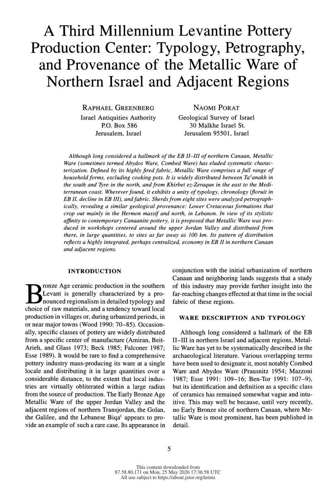

<!-- Start of picture text -->
 A Third Millennium Levantine Pottery  Production Center: Typology, Petrography,  and Provenance of the Metallic Ware of  Northern Israel and Adjacent Regions  RAPHAEL GREENBERG  NAOMI PORAT  Israel Antiquities Authority  Geological Survey of Israel  P.O. Box 586  30 Malkhe Israel St.  Jerusalem, Israel  Jerusalem 95501, Israel  Although long considered a hallmark of the EB II-III of northern Canaan, Metallic  Ware (sometimes termed Abydos Ware, Combed Ware) has eluded systematic charac-  terization. Defined by its highly fired fabric, Metallic Ware comprises a full range of  household forms, excluding cooking pots. It is widely distributed between Tacanakh in  the south and Tyre in the north, and from Khirbet ez-Zeraqun in the east to the Medi-  terranean coast. Wherever found, it exhibits a unity of typology, chronology (floruit in  EB II, decline in EB III), and fabric. Sherds from eight sites were analyzed petrograph-  ically, revealing a similar geological provenance: Lower Cretaceous formations that  crop out mainly in the Hermon massif and north, in Lebanon. In view of its stylistic  affinity to contemporary Canaanite pottery, it is proposed that Metallic Ware was pro-  duced in workshops centered around the upper Jordan Valley and distributed from  there, in large quantities, to sites as far away as 100 km. Its pattern of distribution  reflects a highly integrated, perhaps centralized, economy in EB II in northern Canaan  and adjacent regions.  INTRODUCTION  conjunction with the initial urbanization of northern  Canaan and neighboring lands suggests that a study  of this industry may provide further insight into the  Bronze Age ceramic production in the southern  Levant is generally characterized by a pro-  far-reaching changes effected at that time in the social  nounced regionalism in detailed typology and  fabric of these regions.  choice of raw materials, and a tendency toward local  production in villages or, during urbanized periods, in  WARE DESCRIPTION AND TYPOLOGY  or near major towns (Wood 1990: 70-85). Occasion-  ally, specific classes of pottery are widely distributed  Although long considered a hallmark of the EB  from a specific center of manufacture (Amiran, Beit-  II-III in northern Israel and adjacent regions, Metal-  Arieh, and Glass 1973; Beck 1985; Falconer 1987;  lic Ware has yet to be systematically described in the  Esse 1989). It would be rare to find a comprehensive  archaeological literature. Various overlapping terms  pottery industry mass-producing its ware at a single  have been used to designate it, most notably Combed  locale and distributing it in large quantities over a  Ware and Abydos Ware (Prausnitz 1954; Mazzoni  considerable distance, to the extent that local indus-  1987; Esse 1991: 109-16; Ben-Tor 1991: 107-9),  tries are virtually obliterated within a large radius  but its identification and definition as a specific class  from the source of production. The Early Bronze Age  of ceramics has remained somewhat vague and intu-  Metallic Ware of the upper Jordan Valley and the  itive. This may well be because, until very recently,  adjacent regions of northern Transjordan, the Golan,  no Early Bronze site of northern Canaan, where Me-  the Galilee, and the Lebanese Biqac appears to pro-  tallic Ware is most prominent, has been published in  vide an example of such a rare case. Its appearance in  detail.  5 This content downloaded from �������������87.58.80.171 on Mon, 25 May 2026 17:36:58 UTC�������������� All use subject to https://about.jstor.org/terms <!-- End of picture text -->

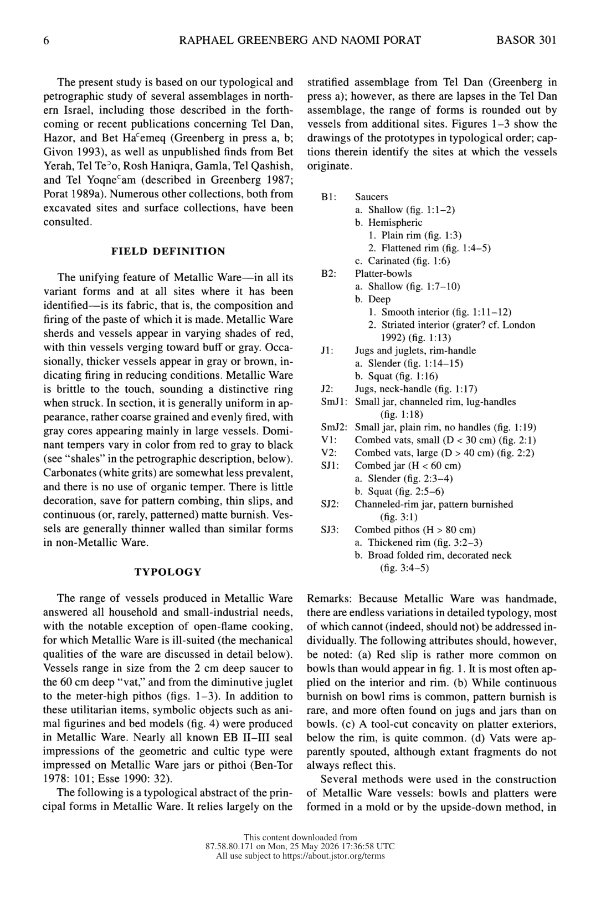

<!-- Start of picture text -->
 6 RAPHAEL GREENBERG AND NAOMI PORAT BASOR 301  The present study is based on our typological and stratified assemblage from Tel Dan (Greenberg in  petrographic study of several assemblages in north- press a); however, as there are lapses in the Tel Dan  ern Israel, including those described in the  assemblage, the range o forms is rounded out by f orth-  coming or recent publications concern vessels from add i tional sites. Figures 1-3 show theng Tel Dan,  Hazor, and Bet Hacemeq (Greenberg in press a, b; drawings of the prototypes in typological order; cap-  Givon 1993), as well as unpublished finds from Be tions therein identify the sites a which the vessels t  Yerah, Tel Te'o, Rosh Haniqra, Gamla, Tel Qashish, originate.  and Tel Yoqnecam (described in Greenberg 1987;  Porat 1989a). Numerous other collections, both from B 1: Saucers  excavated sites and surface collections, have been  a. Shallow (fig. 1:1-2)  consulted.  b. Hemispheric  1. Plain rim (fig. 1:3)  FIELD DEFINITION  2. Flattened rim (fig. 1:4-5)  c. Carinated (fig. 1:6)  B2: Platter-bowls  The unifying feature of Metallic Ware-in all its  variant forms and at all sites where it has been  a. Shallow (fig. 1:7-10)  b. Deep  identified-is its fabric, that is, the composition and  1. Smooth interior (fig. 1:11-12)  firing of the paste of which it is made. Metallic Ware  2. Striated interior (grater? cf. London  sherds and vessels appear in varying shades of red,  1992) (fig. 1:13)  with thin vessels verging toward buff or gray. Occa- J1: Jugs and juglets, rim-handle  sionally, thicker vessels appear in gray or brown, in- a. Slender (fig. 1:14-15)  dicating firing in reducing conditions. Metallic Ware b. Squat (fig. 1:16)  is brittle to the touch, sounding a distinctive ring J2: Jugs, neck-handle (fig. 1:17)  when struck. In section, it is generally uniform in ap- SmJ 1: Small jar, channeled rim, lug-handles  pearance, rather coarse grained and evenly fired, with  (fig. 1:18)  SmJ2: Small jar, plain rim, no handles (fig. 1:19)  gray cores appearing mainly in large vessels. Domi-  VI: Combed vats, small (D < 30 cm) (fig. 2:1)  nant tempers vary in color from red to gray to black  V2: Combed vats, large (D > 40 cm) (fig. 2:2)  (see "shales" in the petrographic description, below).  SJI: Combed jar (H < 60 cm)  Carbonates (white grits) are somewhat less prevalent,  a. Slender (fig. 2:3-4)  and there is no use of organic temper. There is little b. Squat (fig. 2:5-6)  decoration, save for pattern combing, thin slips, and SJ2: Channeled-rim jar, pattern burnished  continuous (or, rarely, patterned) matte burnish. Ves-  (fig. 3:1)  sels are generally thinner walled than similar forms SJ3: Combed pithos (H > 80 cm)  in non-Metallic Ware.  a. Thickened rim (fig. 3:2-3)  b. Broad folded rim, decorated neck  TYPOLOGY  (fig. 3:4-5)  The range of vessels produced in Metallic Ware Remarks: Because Metallic Ware was handmade,  answered all household and small-industrial needs, there are endless variations in detailed typology, most  with the notable exception of open-flame cooking, of which cannot (indeed, should not) be addressed in-  for which Metallic Ware is ill-suited (the mechanical dividually. The following attributes should, however,  qualities of the ware are discussed in detail below). be noted: (a) Red slip is rather more common on  Vessels range in size from the 2 cm deep saucer to bowls than would appear in fig. 1. It is most often ap-  the 60 cm deep "vat," and from the dpl i ed on the interior and rim. (b) While continuousminutive juglet  to the meter-high pithos (figs. 1-3). In addition to burnish on bowl rims is common, pattern burnish is  these utilitarian items, symbolic objects such as ani- rare, and more often found on jugs and jars than on  mal figurines and bed models (fig. 4) were produced bowls. (c) A tool-cut concavity on platter exteriors,  in Metallic Ware. Nearly all known EB II-III seal below the rim, is quite common. (d) Vats were ap-  impressions of the geometric and cul paren t ly spouted, although extant fragments do notic type were  impressed on Metallic Ware jars or pithoi (Ben-Tor always reflect this.  1978: 101; Esse 1990: 32).  Several methods were used in the construction  The following is a typological abstract of the prin- of Metallic Ware vessels: bowls and platters were  cipal forms in Metallic Ware. It relies largely on the formed in a mold or by the upside-down method, in This content downloaded from �������������87.58.80.171 on Mon, 25 May 2026 17:36:58 UTC�������������� All use subject to https://about.jstor.org/terms <!-- End of picture text -->

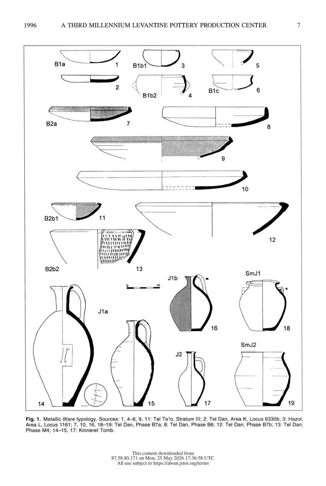

<!-- Start of picture text -->
 1996 A THIRD MILLENNIUM LEVANTINE POTTERY PRODUCTION CENTER 7  Bla Blbl 3 5  2 Bb  \ Blb2 4  B2a 7  B29  B2b2 13 S  1012  Jia  16b2 118  SmJ2  J2  14 __ 15 17 19  Fig. 1. Metallic Ware typology. Sources: 1, 4-6, 9, 11: Tel Te o, Stratum i11; 2: Tel Dan, Area K, Locus 6330b; 3: Hazor,  Area L, Locus 1161; 7, 10,166, 18-19: Tel Dan, Phase B7a; l Dan, Phase B6; 12: Tel Dan, Phase B7b; 13: Tel Dan,  Phase M4; 14-15, 17: Kinneret Tomb. This content downloaded from �������������87.58.80.171 on Mon, 25 May 2026 17:36:58 UTC�������������� All use subject to https://about.jstor.org/terms <!-- End of picture text -->

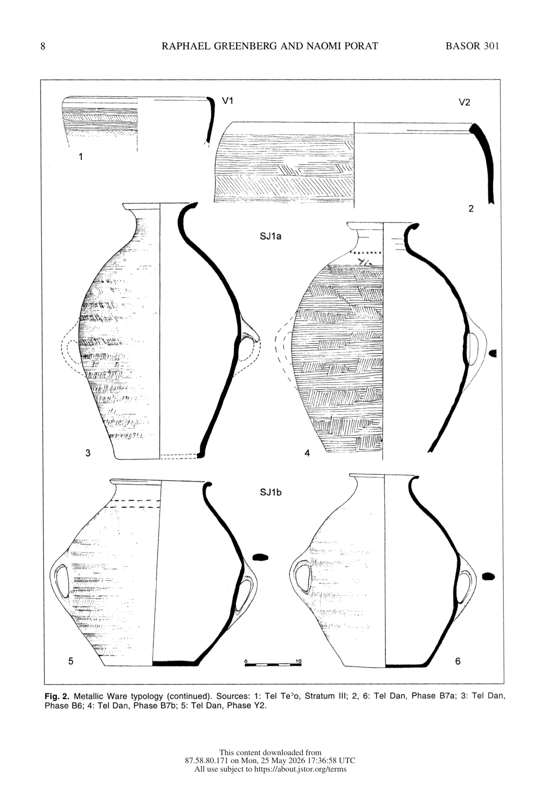

<!-- Start of picture text -->
 8 RAPHAEL GREENBERG AND NAOMI PORAT BASOR 301  V V2  "i ... Si..\ \?.\..  2  -" $Jla  \~\ s\WC  /1 - ....SJ1 a-  i ....1  / --/  I 3  p\ I  l/.!A, _________  3 ~ ,-- --? --  rSA  --V  ,NO _ Qk i -  J+ -f 7'. I  _ _ _ _ _ _ _ _ _ _ _ 1 0 .?:  Fig. 2. Metallic Ware typology (continued). Sources: 1: Tel Te o, Stratum ili; 2, 6: Tel Dan, Phase B7a; 3: Tel Dan,  Phase B6; 4: Tel Dan, Phase B7b; 5: Tel Dan, Phase Y2. This content downloaded from �������������87.58.80.171 on Mon, 25 May 2026 17:36:58 UTC�������������� All use subject to https://about.jstor.org/terms <!-- End of picture text -->

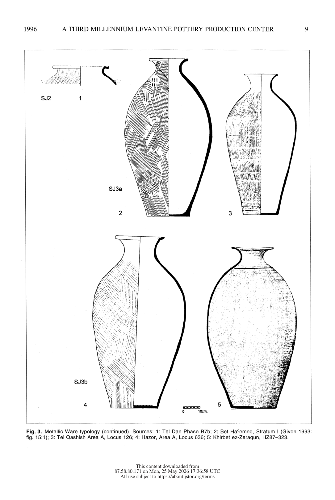

<!-- Start of picture text -->
 1996 A THIRD MILLENNIUM LEVANTINE POTTERY PRODUCTION CENTER 9  . , , - wt,  ?J- ',!;IE~1 '.'l; .t7 /;,i~ J~  fi t-'" I"- i i:  i)?1 t' ?7. ! i tk  1/  N, N"1 ;!fi 'i! a l  N1  S3aSJ2  2 3/  2 43  f i  " " ? " " : " " , ,, ,---  S . .  -" - -, - i . ib  t~ ~ 10cm.~rrt,~.  _____ r 5  Fig. 3. Metallic Ware typology (continued). Sources: 1: Tel Dan Phase B7b; 2: Bet HaCemeq, Stratum i (Givon 1993:  fig. 15:1); 3: Tel Qashish Area A, Locus 126; 4: Hazor, Area A, Locus 636; 5: Khirbet ez-Zeraqun, HZ87-323. This content downloaded from �������������87.58.80.171 on Mon, 25 May 2026 17:36:58 UTC�������������� All use subject to https://about.jstor.org/terms <!-- End of picture text -->

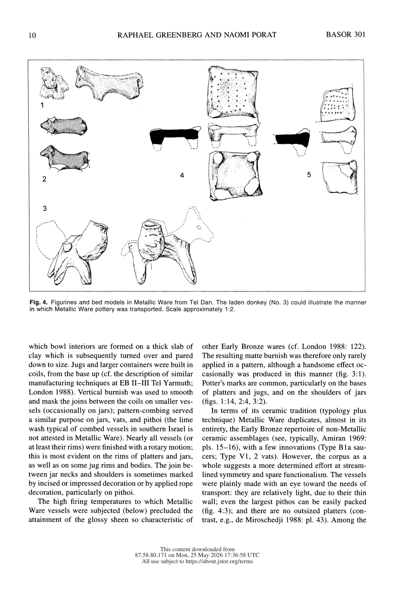

<!-- Start of picture text -->
 10 RAPHAEL GREENBERG AND NAOMI PORAT BASOR 301  J*~2t? :.  I-~f  K. -  i~" ? ~tI  2 " \~'~-iac  3 . ?'  I B ~ , ?~:-..:~ 5 i"? 1 Db  Fig. 4. Figurines and bed models in Metallic Ware from Tel Dan. The laden donkey (No. 3) could illustrate the manner  in which Metallic Ware pottery was transported. Scale approximately 1:2.  which bowl interiors are formed on a thick slab of  other Early Bronze wares (cf. London 1988: 122).  clay which is subsequently turned over and par Th resulting matte burnish was therefore only rarely e d  down to size. Jugs and larger containers were built in applied in a pattern, although a handsome effect oc-  coils, from the base up (cf. the description of similar casionally was produced in this manner (fig. 3:1).  manufacturing techniques at EB II-III Tel Yarmu Po t h;ter's marks are common, particularly on the bases  London 1988). Vertical burnish was used to sm f platters and jugs, and on the shoulders of jars o oth  and mask the joins between the coils on smaller ves-(figs. 1:14, 2:4, 3:2).  sels (occasionally on jars); pattern-combing served In terms of its ceramic tradition (typology plus  a similar purpose on jars, vats, and pithoi (the lime technique) Metallic Ware duplicates, almost in its  wash typical of combed vessels in southern Israel is entirety, the Early Bronze repertoire of non-Metallic  not attested in Metallic Ware). Nearly all vessels (o ce r amic assemblages (see, typically, Amiran 1969:  at least their rims) were finished with a rotary motion; pls. 15-16), with a few innovations (Type Bla sau-  this is most evident on the rims of platters and ja ce rs ,; Type V1, 2 vats). However, the corpus as a  as well as on some jug rims and bodies. The join be-whole suggests a more determined effort at stream-  tween jar necks and shoulders is sometimes marked lined symmetry and spare functionalism. The vessels  by incised or impressed decoration or by applied ropewere plainly made with an eye toward the needs of  decoration, particularly on pithoi.  transport: they are relatively light, due to their thin  The high firing temperatures to which Metallic wall; even the largest pithos can be easily packed  Ware vessels were subjected (below) precluded the (fig. 4:3); and there are no outsized platters (con-  attainment of the glossy sheen so characteristic of trast, e.g., de Miroschedji 1988: pl. 43). Among the This content downloaded from �������������87.58.80.171 on Mon, 25 May 2026 17:36:58 UTC�������������� All use subject to https://about.jstor.org/terms <!-- End of picture text -->

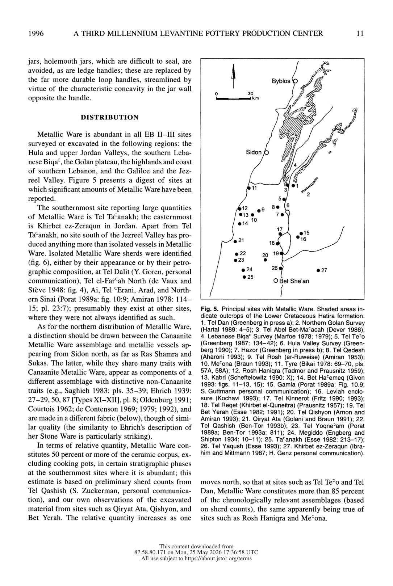

<!-- Start of picture text -->
 1996 A THIRD MILLENNIUM LEVANTINE POTTERY PRODUCTION CENTER 11  jars, holemouth jars, which are difficult to seal, are  avoided, as are ledge handles; these are replaced by  the far more durable loop handles, streamlined by Byblos  virtue of the characteristic concavity in the jar wall 0 30  opposite the handle.  I mm km  DISTRIBUTION  Metallic Ware is abundant in all EB II-III sites  surveyed or excavated in the following regions: the  Hula and upper Jordan Valleys, the southern Leba-  Sidon  nese Biqac, the Golan plateau, the highlands and coast  of southern Lebanon, and the Galilee and the Jez-  reel Valley. Figure 5 presents a digest of sites at  which significant amounts of Metallic Ware have been  reported.  The southernmost site reporting large quantities  12 *9 8@ 6  of Metallic Ware is Tel Tacanakh; the easternmost  013 70  *14 10  is Khirbet ez-Zeraqun in Jordan. Apart from Tel  Tacanakh, no site south of the Jezreel Valley has pro-  *21 18 16  duced anything more than isolated vessels in Metallic  Ware. Isolated Metallic Ware sherds were identified  @ 22 20 19  S23 *  (fig. 6), either by their appearance or by their petro-  0 24 26 * 27  graphic composition, at Tel Dalit (Y. Goren, personal  communication), Tel el-Farcah North (de Vaux and  @25 0 Bet She'an  Stive 1948: fig. 4), Ai, Tel CErani, Arad, and North-  ern Sinai (Porat 1989a: fig. 10:9; Amiran 1978: 114-  15; pl. 23:7); presumably they exist at other sites, Fig. 5. Principal sites with Metallic Ware. Shaded areas in-  where they were not always identified as such. dicate outcrops of the Lower Cretaceous Hatira formation.  1. Tel Dan (Greenberg in press a); 2. Northern Golan Survey  As for the northern distribution of Metallic Ware,  (Hartal 1989: 4-5); 3. Tel Abel Bet-Macacah (Dever 1986);  a distinction should be drawn between the Canaanite  4. Lebanese Biqac Survey (Marfoe 1978; 1979); 5. Tel Telo  (Greenberg 1987: 134-42); 6. Hula Valley Survey (Green-  Metallic Ware assemblage and metallic vessels ap-  berg 1990); 7. Hazor (Greenberg in press b); 8. Tel Qedesh  pearing from Sidon north, as far as Ras Shamra and (Aharoni 1993); 9. Tel Rosh (er-Ruweise) (Amiran 1953);  Sukas. The latter, while they share many traits with 10. Mecona (Braun 1993); 11. Tyre (Bikai 1978: 69-70, pls.  57A, 58A); 12. Rosh Haniqra (Tadmor and Prausnitz 1959);  Canaanite Metallic Ware, appear as components of a  13. Kabri (Scheftelowitz 1990: X); 14. Bet Hacemeq (Givon  different assemblage with distinctive non-Canaanite 1993: figs. 11-13, 15); 15. Gamla (Porat 1989a: Fig. 10.9;  traits (e.g., Saghieh 1983: pls. 35-39; Ehrich 1939: S. Guttmann personal communication); 16. Leviah enclo-  27-29, 50, 87 [Types XI-XII], pl. 8; Oldenburg 1991; sure (Kochavi 1993); 17. Tel Kinnerot (Fritz 1990; 1993);  18. Tel Reqet (Khirbet el-Quneitra) (Prausnitz 1957); 19. Tel  Courtois 1962; de Contenson 1969; 1979; 1992), and  Bet Yerah (Esse 1982; 1991); 20. Tel Qishyon (Arnon and  are made in a different fabric (below), though of simi- Amiran 1993); 21. Qiryat Ata (Golani and Braun 1991); 22.  lar quality (the similarity to Ehrich's description of Tel Qashish (Ben-Tor 1993b); 23. Tel Yoqne'am (Porat  1989a; Ben-Tor 1993a: 811); 24. Megiddo (Engberg and  her Stone Ware is particularly striking).  Shipton 1934: 10-11); 25. Tacanakh (Esse 1982: 213-17);  In terms of relative quantity, Metallic Ware con- 26. Tel Yaqush (Esse 1993); 27. Khirbet ez-Zeraqun (Ibra-  him and Mittmann 1987; H. Genz personal communication).  stitutes 50 percent or more of the ceramic corpus, ex-  cluding cooking pots, in certain stratigraphic phases  at the southernmost sites where it is abundant; this  estimate is based on preliminary sherd counts from moves north, so that at sites such as Tel TeDo and Tel  Tel Qashish (S. Zuckerman, personal communica- Dan, Metallic Ware constitutes more than 85 percent  tion), and our own observations of the excavated of the chronologically relevant assemblages (based  material from sites such as Qiryat Ata, Qishyon, and on sherd counts), the same apparently being true of  Bet Yerah. The relative quantity increases as one sites such as Rosh Haniqra and Mecona. This content downloaded from �������������87.58.80.171 on Mon, 25 May 2026 17:36:58 UTC�������������� All use subject to https://about.jstor.org/terms <!-- End of picture text -->

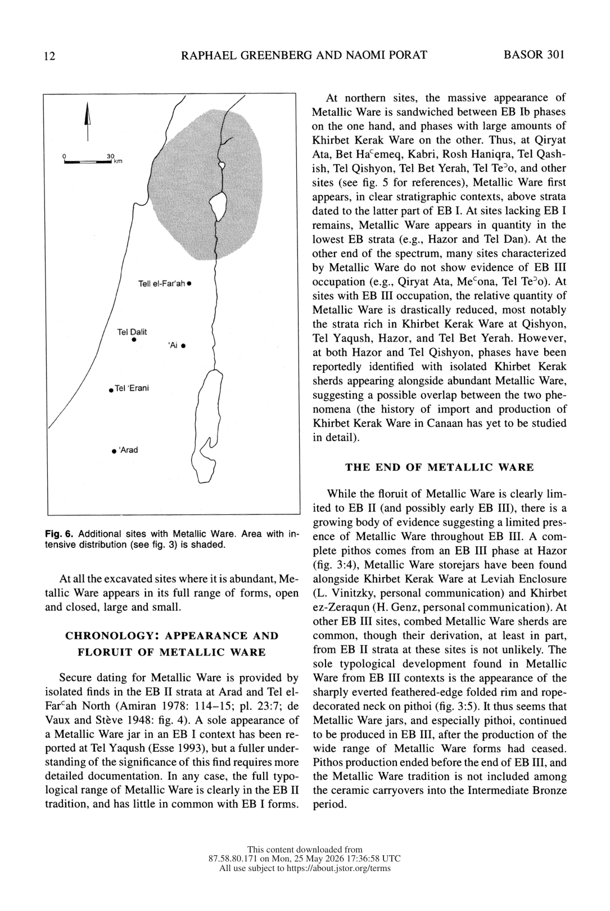

<!-- Start of picture text -->
 12 RAPHAEL GREENBERG AND NAOMI PORAT BASOR 301  At northern sites, the massive appearance of  Metallic Ware is sandwiched between EB Ib phases  on the one hand, and phases with large amounts of  Khirbet Kerak Ware on the other. Thus, at Qiryat  0 30  Ata, Bet Hacemeq, Kabri, Rosh Haniqra, Tel Qash-  km---- //k  ish, Tel Qishyon, Tel Bet Yerah, Tel Te'o, and other  sites (see fig. 5 for references), Metallic Ware first  appears, in clear stratigraphic contexts, above strata  dated to the latter part of EB I. At sites lacking EB I  remains, Metallic Ware appears in quantity in the  lowest EB strata (e.g., Hazor and Tel Dan). At the  other end of the spectrum, many sites characterized  by Metallic Ware do not show evidence of EB III  Tell el-Far'ah 0  occupation (e.g., Qiryat Ata, Mecona, Tel Te'o). At  sites with EB III occupation, the relative quantity of  Metallic Ware is drastically reduced, most notably  Tel Dalit  the strata rich in Khirbet Kerak Ware at Qishyon,  Tel Yaqush, Hazor, and Tel Bet Yerah. However,  at both Hazor and Tel Qishyon, phases have been  reportedly identified with isolated Khirbet Kerak  Tel 'Erani  sherds appearing alongside abundant Metallic Ware,  suggesting a possible overlap between the two phe-  nomena (the history of import and production of  Khirbet Kerak Ware in Canaan has yet to be studied  in detail).  * Arad  THE END OF METALLIC WARE  While the floruit of Metallic Ware is clearly lim-  ited to EB II (and possibly early EB III), there is a  growing body of evidence suggesting a limited pres-  Fig. 6. Additional sites with Metallic Ware. Area with in- ence of Metallic Ware throughout EB III. A com-  tensive distribution (see fig. 3) is shaded.  plete pithos comes from an EB III phase at Hazor  (fig. 3:4), Metallic Ware storejars have been found  At all the excavated sites where it is abundant, Me- alongside Khirbet Kerak Ware at Leviah Enclosure  tallic Ware appears in its full range of forms, open (L. Vinitzky, personal communication) and Khirbet  and closed, large and small.  ez-Zeraqun (H. Genz, personal communication). At  other EB III sites, combed Metallic Ware sherds are  CHRONOLOGY: APPEARANCE AND  common, though their derivation, at least in part,  FLORUIT OF METALLIC WARE  from EB II strata at these sites is not unlikely. The  sole typological development found in Metallic  Secure dating for Metallic Ware is provided by Ware from EB III contexts is the appearance of the  isolated finds in the EB II strata at Arad and Tel el-  sharply everted feathered-edge folded rim and rope-  Farcah North (Amiran 1978: 114-15; pl. 23:7; de decorated neck on pithoi (fig. 3:5). It thus seems that  Vaux and Steve 1948: fig. 4). A sole appearance ofMetallic Ware jars, and especially pithoi, continued  a Metallic Ware jar in an EB I context has been re- to be produced in EB III, after the production of the  ported at Tel Yaqush (Esse 1993), but a fuller under- wide range of Metallic Ware forms had ceased.  standing of the significance of this find requires more Pithos production ended before the end of EB III, and  detailed documentation. In any case, the full typo- the Metallic Ware tradition is not included among  logical range of Metallic Ware is clearly in the EB II the ceramic carryovers into the Intermediate Bronze  tradition, and has little in common with EB I forms. period. This content downloaded from �������������87.58.80.171 on Mon, 25 May 2026 17:36:58 UTC�������������� All use subject to https://about.jstor.org/terms <!-- End of picture text -->

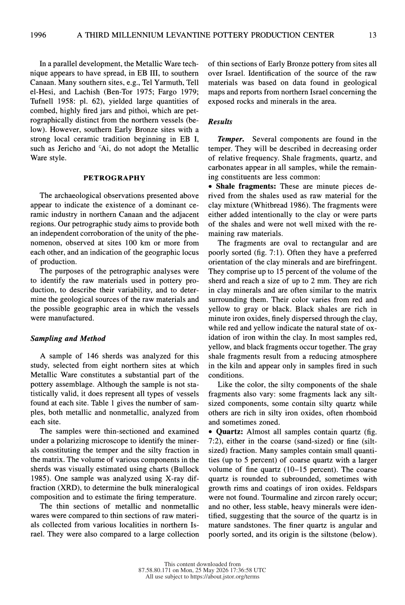

<!-- Start of picture text -->
 1996 A THIRD MILLENNIUM LEVANTINE POTTERY PRODUCTION CENTER 13  In a parallel development, the Metallic Ware tech- of thin sections of Early Bronze pottery from sites all  nique appears to have spread, in EB III, to southern over Israel. Identification of the source of the raw  Canaan. Many southern sites, e.g., Tel Ymateri a ls was based on data found in geologicalrmuth, Tell  el-Hesi, and Lachish (Ben-Tor 1975; Fa maps and eports from northern Israel concerning the r go 1979;  Tufnell 1958: pl. 62), yielded large quantities of exposed rocks and minerals in the area.  combed, highly fired jars and pithoi, which are pet-  rographically distinct from the northern vessels (be- Results  low). However, southern Early Bronze sites with a  strong local ceramic tradition beginning in EB I, Temper. Several components are found in the  such as Jericho and CAi, do not adopt the Metallic temper. They will be described in decreasing order  Ware style.  of relative frequency. Shale fragments, quartz, and  carbonates appear in all samples, while the remain-  PETROGRAPHY  ing constituents are less common:  * Shale fragments: These are minute pieces de-  The archaeological observations presented above rived from the shales used as raw material for the  appear to indicate the existence of a dominant ce- clay mixture (Whitbread 1986). The fragments were  ramic industry in northern Canaan and the adjacenteither added intentionally to the clay or were parts  regions. Our petrographic study aims to provide both of the shales and were not well mixed with the re-  an independent corroboration of the unity of the phe-maining raw materials.  nomenon, observed at sites 100 km or more from  The fragments are oval to rectangular and are  each other, and an indication of the geographic locus poorly sorted (fig. 7:1). Often they have a preferred  of production.  orientation of the clay minerals and are birefringent.  The purposes of the petrographic analyses were They comprise up to 15 percent of the volume of the  to identify the raw materials used in pottery pro- sherd and reach a size of up to 2 mm. They are rich  duction, to describe their variability, and to deter-  in clay minerals and are often similar to the matrix  mine the geological sources of the raw materials and  surrounding them. Their color varies from red and  the possible geographic area in which the vessels yellow to gray or black. Black shales are rich in  were manufactured.  minute iron oxides, finely dispersed through the clay,  while red and yellow indicate the natural state of ox-  Sampling and Method  idation of iron within the clay. In most samples red,  yellow, and black fragments occur together. The gray  A sample of 146 sherds was analyzed for this shale fragments result from a reducing atmosphere  study, selected from eight northern sites at which in the kiln and appear only in samples fired in such  Metallic Ware constitutes a substantial part of the conditions.  pottery assemblage. Although the sample is not sta-  Like the color, the silty components of the shale  tistically valid, it does represent all types of vessels fragments also vary: some fragments lack any silt-  found at each site. Table 1 gives the number of sam- sized components, some contain silty quartz while  ples, both metallic and nonmetallic, analyzed from others are rich in silty iron oxides, often rhomboid  each site.  and sometimes zoned.  The samples were thin-sectioned and examined * Quartz: Almost all samples contain quartz (fig.  under a polarizing microscope to identify the miner- 7:2), either in the coarse (sand-sized) or fine (silt-  als constituting the temper and the silty fraction insized) fraction. Many samples contain small quanti-  the matrix. The volume of various components in the ties (up to 5 percent) of coarse quartz with a larger  sherds was visually estimated using charts (Bullock volume of fine quartz (10-15 percent). The coarse  1985). One sample was analyzed using X-ray dif- quartz is rounded to subrounded, sometimes with  fraction (XRD), to determine the bulk mineralogical growth rims and coatings of iron oxides. Feldspars  composition and to estimate the firing temperature. were not found. Tourmaline and zircon rarely occur;  The thin sections of metallic and nonmetallic  and no other, less stable, heavy minerals were iden-  wares were compared to thin sections of raw materi- tified, suggesting that the source of the quartz is in  als collected from various localities in northern Is-  mature sandstones. The finer quartz is angular and  rael. They were also compared to a large collection poorly sorted, and its origin is the siltstone (below). This content downloaded from �������������87.58.80.171 on Mon, 25 May 2026 17:36:58 UTC�������������� All use subject to https://about.jstor.org/terms <!-- End of picture text -->

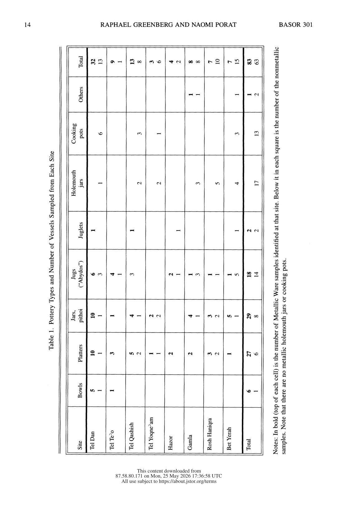

<!-- Start of picture text -->
 Table 1. Pottery Types and Number of Vessels Sampled from Each Site  Jars, Jugs Holemouth Cooking  4  Site Bowls Platters pithoi ("Abydos") Juglets jars pots Others Total  Tel Dan 5 10 10 6 1 32  1 1 1 3 1 13  Tel Teo 1 3 1 4 9  O  1 1  Tel Qashish 5 4 3 1 13  >  2 1 2 3 8  z tTI >  Tel YoqneDam 1 2 3  0  1 2 2 1 6  Z  Hazor 2 2 4  tTI O  1 1 2  z  0  Gamla 2 4 1 1 8  z,  1 3 3 1 8  0  Rosh Haniqra 3 3 1 7  2 2 1 510  O 0  Bet Yerah 1 5 1 7  1 5 1 4 3 1 15  Total 6 27 29 18 2 1 83  1 6 8 14 2 17 13 2 63  H  Notes: In bold (top of each cell) is the number of Metallic Ware samples identified at that site. Below it in each square is the number of the nonmetallic  samples. Note that there are no metallic holemouth jars or cooking pots.  0  o This content downloaded from �������������87.58.80.171 on Mon, 25 May 2026 17:36:58 UTC�������������� All use subject to https://about.jstor.org/terms <!-- End of picture text -->

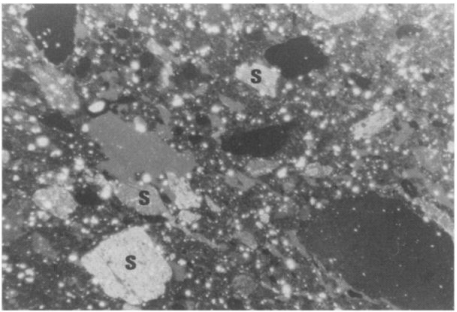

<!-- Start of picture text -->
 :.? .!?  Ai k  -4' <!-- End of picture text -->

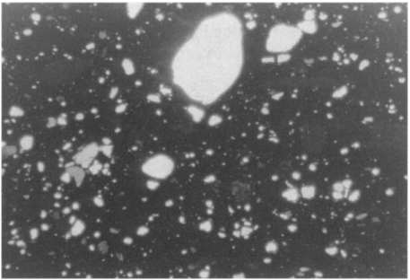

<!-- Start of picture text -->
 Ak  At  1 40 <!-- End of picture text -->

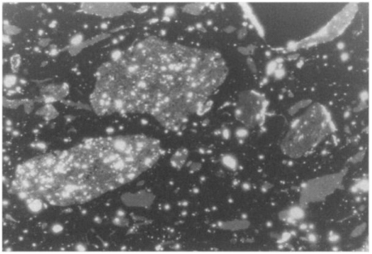

<!-- Start of picture text -->
 ,Z:: <!-- End of picture text -->

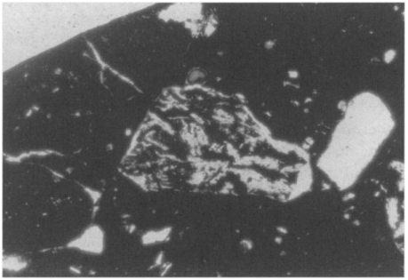

<!-- Start of picture text -->
 414,  1*4 ". , it, <!-- End of picture text -->

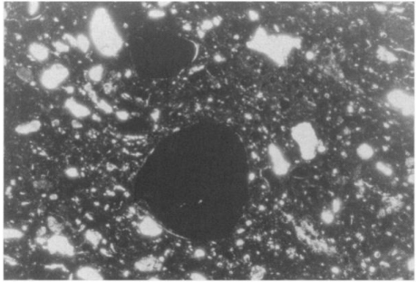

<!-- Start of picture text -->
 lee  Ile <!-- End of picture text -->

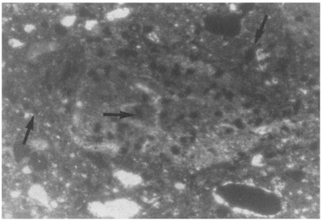

<!-- Start of picture text -->
 'zd  M, M  2i??- ?;; ; <!-- End of picture text -->

תוכן זה הורד מ-�������������87.58.80.171 ביום שני, 25 במאי 2026 17:36:58 UTC�������������� כל השימוש בכפוף ל https://about.jstor.org/terms

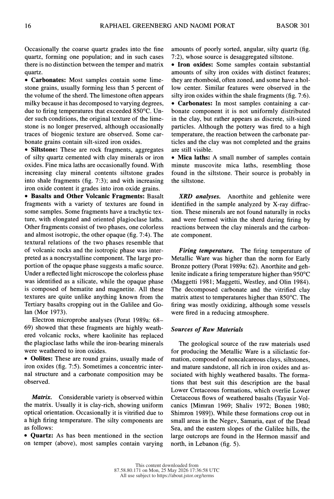

<!-- Start of picture text -->
 16 RAPHAEL GREENBERG AND NAOMI PORAT BASOR 301  Occasionally the coarse qu mounts of poorly orted, angular, silty quartz (fig. a rtz grade s  into the fine  quartz, forming one population; and in such cases 7:2), whose source is desaggregated siltstone.  there is no distinction between the temper and matrix * Iron oxides: Some samples contain substantial  quartz.  amounts of silty iron oxides with distinct features;  * Carbonates: Most samples contain some lime-  they are rhomboid, often zoned, and some have a hol-  stone grains, usually forming less than 5 percent of  low center. Similar features were observed in the  the volume of the sherd. The limestone often appears  silty iron oxides within the shale fragments (fig. 7:6).  milky because it has decomposed to varying degrees,  * Carbonates: In most samples containing a car-  due to firing temperatures that exceeded 8500C. Un-  bonate component it is not uniformly distributed  der such conditions, the original texture of the lime-  in the clay, but rather appears as discrete, silt-sized  stone is no longer preserved, although occasionally  particles. Although the pottery was fired to a high  traces of biogenic texture are observed. Some car-  temperature, the reaction between the carbonate par-  bonate grains contain silt-sized iron oxides.  ticles and the clay was not completed and the grains  * Siltstone: These are rock fragments, aggregates  are still visible.  of silty quartz cemented with clay minerals or iron  * Mica laths: A small number of samples contain  oxides. Fine mica laths are occasionally found. With  minute muscovite mica laths, resembling those  increasing clay mineral contents siltstone grades  found in the siltstone. Their source is probably in  into shale fragments (fig. 7:3); and with increasing  the siltstone.  iron oxide content it grades into iron oxide grains.  * Basalts and Other Volcanic Fragments: Basalt  XRD analyses. Anorthite and gehlenite were  fragments with a variety of textures are found in  identified in the sample analyzed by X-ray diffrac-  some samples. Some fragments have a trachytic tex-  tion. These minerals are not found naturally in rocks  ture, with elongated and oriented plagioclase laths.  and were formed within the sherd during firing by  Other fragments consist of two phases, one colorless  reactions between the clay minerals and the carbon-  and almost isotropic, the other opaque (fig. 7:4). The  ate component.  textural relations of the two phases resemble that  of volcanic rocks and the isotropic phase was inter-  Firing temperature. The firing temperature of  preted as a noncrystalline component. The large pro-  Metallic Ware was higher than the norm for Early  portion of the opaque phase suggests a mafic source.  Bronze pottery (Porat 1989a: 62). Anorthite and geh-  Under a reflected light microscope the colorless phase  lenite indicate a firing temperature higher than 950'C  was identified as a silicate, while the opaque phase  (Maggetti 1981; Maggetti, Westley, and Olin 1984).  is composed of hematite and magnetite. All these  The decomposed carbonate and the vitrified clay  textures are quite unlike anything known from the  matrix attest to temperatures higher than 850'C. The  Tertiary basalts cropping out in the Galilee and Go-  firing was mostly oxidizing, although some vessels  lan (Mor 1973).  were fired in a reducing atmosphere.  Electron microprobe analyses (Porat 1989a: 68-  69) showed that these fragments are highly weath-  Sources of Raw Materials  ered volcanic rocks, where kaolinite has replaced  the plagioclase laths while the iron-bearing minerals  The geological source of the raw materials used  were weathered to iron oxides.  for producing the Metallic Ware is a siliclastic for-  * Oolites: These are round grains, usually made ofmation, composed of noncalcareous clays, siltstones,  iron oxides (fig. 7:5). Sometimes a concentric inter- and mature sandstone, all rich in iron oxides and as-  nal structure and a carbonate composition may besociated with highly weathered basalts. The forma-  observed.  tions that best suit this description are the basal  Lower Cretaceous formations, which overlie Lower  Matrix. Considerable variety is observed within Cretaceous flows of weathered basalts (Tayasir Vol-  the matrix. Usually it is clay-rich, showing uniform canics [Mimran 1969; Shaliv 1972; Bonen 1980;  optical orientation. Occasionally it is vitrified due to Shimron 1989]). While these formations crop out in  a high firing temperature. The silty components are small areas in the Negev, Samaria, east of the Dead  as follows:  Sea, and the eastern slopes of the Galilee hills, the  * Quartz: As has been mentioned in the section large outcrops are found in the Hermon massif and  on temper (above), most samples contain varying north, in Lebanon (fig. 5). This content downloaded from �������������87.58.80.171 on Mon, 25 May 2026 17:36:58 UTC�������������� All use subject to https://about.jstor.org/terms <!-- End of picture text -->

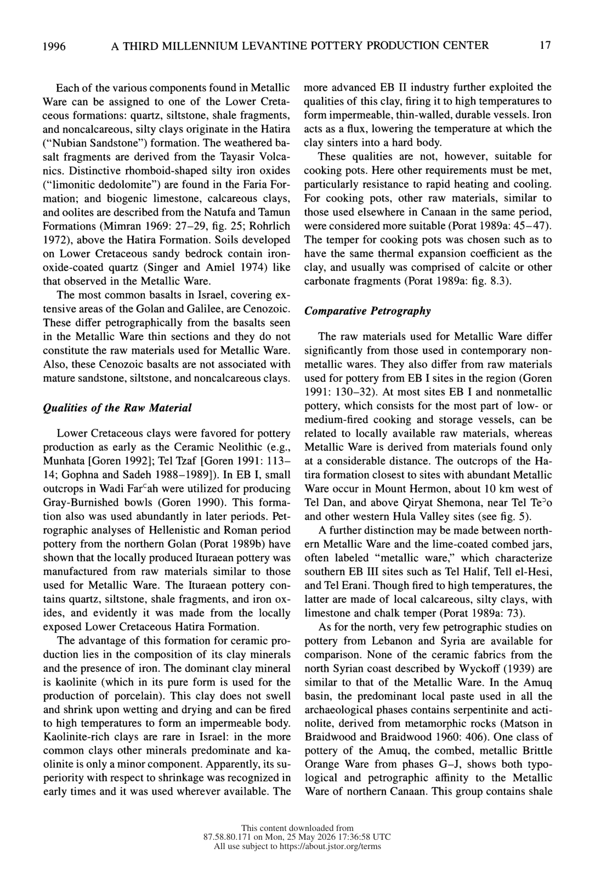

<!-- Start of picture text -->
 1996 A THIRD MILLENNIUM LEVANTINE POTTERY PRODUCTION CENTER 17  Each of the various components found in Metallic more advanced EB II industry further exploited the  Ware can be assigned to one of the Lower Creta-qualities of this clay, firing it to high temperatures to  ceous formations: quartz, siltstone, shale fragments, form impermeable, thin-walled, durable vessels. Iron  and noncalcareous, silty clays originate in the Hatira acts as a flux, lowering the temperature at which the  ("Nubian Sandstone") formation. The weathered ba- clay sinters into a hard body.  salt fragments are derived from the Tayasir Volca- These qualities are not, however, suitable for  nics. Distinctive rhomboid-shaped silty iron oxides cooking pots. Here other requirements must be met,  ("limonitic dedolomite") are found in the Faria For- particularly resistance to rapid heating and cooling.  mation; and biogenic limestone, calcareous clays, For cooking pots, other raw materials, similar to  and oolites are described from the Natufa and Tamun  those used elsewhere in Canaan in the same period,  Formations (Mimran 1969: 27-29, fig. 25; Rohrlich were considered more suitable (Porat 1989a: 45-47).  1972), above the Hatira Formation. Soils developed The temper for cooking pots was chosen such as to  on Lower Cretaceous sandy bedrock contain iron- have the same thermal expansion coefficient as the  oxide-coated quartz (Singer and Amiel 1974) like clay, and usually was comprised of calcite or other  that observed in the Metallic Ware.  carbonate fragments (Porat 1989a: fig. 8.3).  The most common basalts in Israel, covering ex-  tensive areas of the Golan and Galilee, are Cenozoic. Comparative Petrography  These differ petrographically from the basalts seen  in the Metallic Ware thin sections and they do not The raw materials used for Metallic Ware differ  constitute the raw materials used for Metallic Ware.  significantly from those used in contemporary non-  Also, these Cenozoic basalts are not associated with metallic wares. They also differ from raw materials  mature sandstone, siltstone, and noncalcareous clays. used for pottery from EB I sites in the region (Goren  1991: 130-32). At most sites EB I and nonmetallic  Qualities of the Raw Material  pottery, which consists for the most part of low- or  medium-fired cooking and storage vessels, can be  Lower Cretaceous clays were favored for pottery related to locally available raw materials, whereas  production as early as the Ceramic Neolithic (e.g., Metallic Ware is derived from materials found only  Munhata [Goren 1992]; Tel Tzaf [Goren 1991: 113- at a considerable distance. The outcrops of the Ha-  14; Gophna and Sadeh 1988-1989]). In EB I, small tira formation closest to sites with abundant Metallic  outcrops in Wadi Farcah were utilized for producing Ware occur in Mount Hermon, about 10 km west of  Gray-Burnished bowls (Goren 1990). This forma- Tel Dan, and above Qiryat Shemona, near Tel Te'o  tion also was used abundantly in later periods. Pet- and other western Hula Valley sites (see fig. 5).  rographic analyses of Hellenistic and Roman period A further distinction may be made between north-  pottery from the northern Golan (Porat 1989b) have ern Metallic Ware and the lime-coated combed jars,  shown that the locally produced Ituraean pottery was often labeled "metallic ware," which characterize  manufactured from raw materials similar to those  southern EB III sites such as Tel Halif, Tell el-Hesi,  used for Metallic Ware. The Ituraean pottery con- and Tel Erani. Though fired to high temperatures, the  tains quartz, siltstone, shale fragments, and iron ox- latter are made of local calcareous, silty clays, with  ides, and evidently it was made from the locally limestone and chalk temper (Porat 1989a: 73).  exposed Lower Cretaceous Hatira Formation.  As for the north, very few petrographic studies on  The advantage of this formation for ceramic pro- pottery from Lebanon and Syria are available for  duction lies in the composition of its clay minerals comparison. None of the ceramic fabrics from the  and the presence of iron. The dominant clay mi o n e r th Syrian coast described by Wyckoff (1939) areal  is kaolinite (which in its pure form is used for thesimilar to that of the Metallic Ware. In the Amuq  production of porcelain). This clay does not swell basin, the predominant local paste used in all the  and shrink upon wetting and drying and can be fired archaeological phases contains serpentinite and acti-  to high temperatures to form an impermeable body. nolite, derived from metamorphic rocks (Matson in  Kaolinite-rich clays are rare in Israel: in the more Braidwood and Braidwood 1960: 406). One class of  common clays other minerals predominate and ka- pottery of the Amuq, the combed, metallic Brittle  olinite is only a minor component. Apparently, its su- Orange Ware from phases G-J, shows both typo-  periority with respect to shrinkage was recognized  log i ncal and petrographic affinity to the Metallic  early times and it was used wherever available. The Ware of northern Canaan. This group contains shale This content downloaded from �������������87.58.80.171 on Mon, 25 May 2026 17:36:58 UTC�������������� All use subject to https://about.jstor.org/terms <!-- End of picture text -->

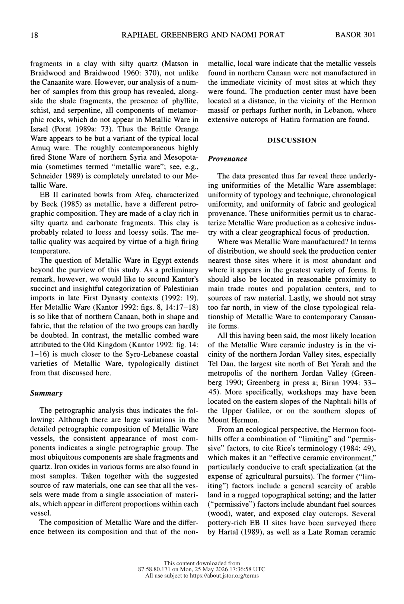

<!-- Start of picture text -->
 18 RAPHAEL GREENBERG AND NAOMI PORAT BASOR 301  fragments in a clay with silty quartz (Matson in metallic, local ware indicate that the metallic vessels  Braidwood and Braidwood 1960: 370), not unlike found in northern Canaan were not manufactured in  the Canaanite ware. However, our analysis of a num- the immediate vicinity of most sites at which they  ber of samples from this group has revealed, along- were found. The production center must have been  side the shale fragments, the pre located at a di s tance, in the vicinity of the Hermonence of phyllite,  schist, and serpentine, all comp massif r perhaps further north, in Lebanon, where o nents of metamor-  phic rocks, which do not appear in Metallic W extensive outcrops of Hatira form a tion are found.re in  Israel (Porat 1989a: 73). Thus the Brittle Orange  Ware appears to be but a variant of the typical local DISCUSSION  Amuq ware. The roughly contemporaneous highly  fired Stone Ware of northern Syria and Mesopota- Provenance  mia (sometimes termed "metallic ware"; see, e.g.,  Schneider 1989) is completely unrelat The data present e d thus far reveal three underly-d to our Me-  tallic Ware.  ing uniformities of the Metallic Ware assemblage:  EB II carinated bowls from Afeq, characterized uniformity of typology and technique, chronological  by Beck (1985) as metallic, have a different petro- uniformity, and uniformity of fabric and geological  graphic composition. They are made of a clay rich in provenance. These uniformities permit us to charac-  silty quartz and carbonate fragments. This clay is terize Metallic Ware production as a cohesive indus-  probably related to loess and loessy soils. The me- try with a clear geographical focus of production.  tallic quality was acquired by virtue of a high firing Where was Metallic Ware manufactured? In terms  temperature.  of distribution, we should seek the production center  The question of Metallic Ware in Egypt extends  nearest those sites where it is most abundant and  beyond the purview of this study. As a preliminary  where it appears in the greatest variety of forms. It  remark, however, we would like to second Kantor's  should also be located in reasonable proximity to  succinct and insightful categorization of Palestinian  main trade routes and population centers, and to  imports in late First Dynasty contexts (1992: 19).  sources of raw material. Lastly, we should not stray  Her Metallic Ware (Kantor 1992: figs. 8, 14:17-18)  too far north, in view of the close typological rela-  is so like that of northern Canaan, both in shape and  tionship of Metallic Ware to contemporary Canaan-  fabric, that the relation of the two groups can hardly  ite forms.  be doubted. In contrast, the metallic combed ware  All this having been said, the most likely location  attributed to the Old Kingdom (Kantor 1992: fig. 14:  of the Metallic Ware ceramic industry is in the vi-  1-16) is much closer to the Syro-Lebanese coastal cinity of the northern Jordan Valley sites, especially  varieties of Metallic Ware, typologically distinct Tel Dan, the largest site north of Bet Yerah and the  from that discussed here.  metropolis of the northern Jordan Valley (Green-  berg 1990; Greenberg in press a; Biran 1994: 33-  Summary  45). More specifically, workshops may have been  located on the eastern slopes of the Naphtali hills of  The petrographic analysis thus indicates the fol-  the Upper Galilee, or on the southern slopes of  lowing: Although there are large variations in the  Mount Hermon.  detailed petrographic composition of Metallic Ware  From an ecological perspective, the Hermon foot-  vessels, the consistent appearance of most com-  hills offer a combination of "limiting" and "permis-  ponents indicates a single petrographic group. The  sive" factors, to cite Rice's terminology (1984: 49),  most ubiquitous components are shale fragments and  which makes it an "effective ceramic environment,"  quartz. Iron oxides in various forms are also found in  particularly conducive to craft specialization (at the  most samples. Taken together with the suggested  expense of agricultural pursuits). The former ("lim-  source of raw materials, one can see that all the ves-  iting") factors include a general scarcity of arable  sels were made from a single association of materi-  land in a rugged topographical setting; and the latter  als, which appear in different proportions within each  ("permissive") factors include abundant fuel sources  vessel.  (wood), water, and exposed clay outcrops. Several  The composition of Metallic Ware and the differ- pottery-rich EB II sites have been surveyed there  ence between its composition and that of the non- by Hartal (1989), as well as a Late Roman ceramic This content downloaded from �������������87.58.80.171 on Mon, 25 May 2026 17:36:58 UTC�������������� All use subject to https://about.jstor.org/terms <!-- End of picture text -->

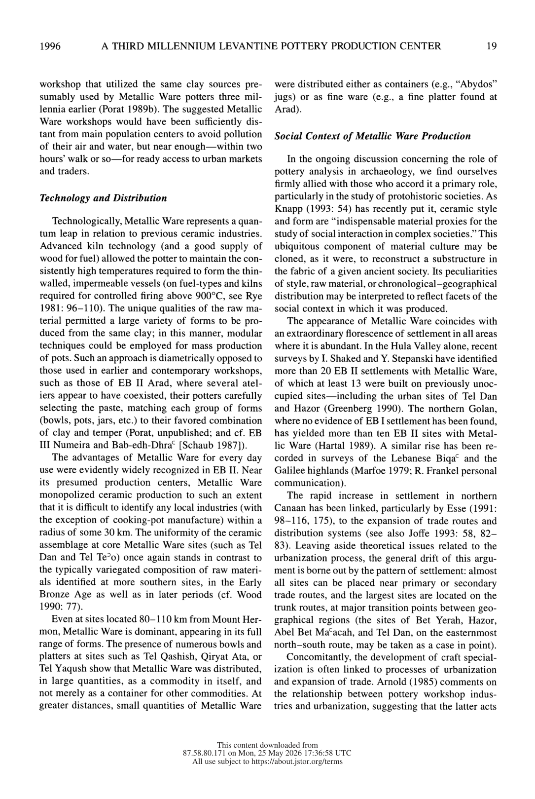

<!-- Start of picture text -->
 1996 A THIRD MILLENNIUM LEVANTINE POTTERY PRODUCTION CENTER 19  workshop that utilized the same clay sources pr were distributed eith e r as containers (e.g., "Abydos"-  sumably used by Metallic Ware potters thre jugs) or as fin ware (e.g., a fine platter found at e  mil-  lennia earlier (Porat 1989b). The suggested Metallic Arad).  Ware workshops would have been sufficiently dis-  tant from main population centers to avoid pollution Social Context of Metallic Ware Production  of their air and water, but near enough-within two  hours' walk or so-for ready access to urban markets In the ongoing discussion concerning the role of  and traders.  pottery analysis in archaeology, we find ourselves  firmly allied with those who accord it a primary role,  Technology and Distribution  particularly in the study of protohistoric societies. As  Knapp (1993: 54) has recently put it, ceramic style  Technologically, Metallic Ware represents a quan- and form are "indispensable material proxies for the  tum leap in relation to previous ceramic industries.  study of social interaction in complex societies." This  Advanced kiln technology (and a good supply of ubiquitous component of material culture may be  wood for fuel) allowed the potter to maintain the con- cloned, as it were, to reconstruct a substructure in  sistently high temperatures required to form the thin- the fabric of a given ancient society. Its peculiarities  walled, impermeable vessels (on fuel-types and kilns of style, raw material, or chronological-geographical  required for controlled firing above 9000C, see Rye  distribution may be interpreted to reflect facets of the  1981: 96-110). The unique qualities of the raw ma- social context in which it was produced.  terial permitted a large variety of forms to be pro-  The appearance of Metallic Ware coincides with  duced from the same clay; in this manner, modular  an extraordinary florescence of settlement in all areas  techniques could be employed for mass production where it is abundant. In the Hula Valley alone, recent  of pots. Such an approach is diametrically opposed to surveys by I. Shaked and Y. Stepanski have identified  those used in earlier and contemporary workshops,  more than 20 EB II settlements with Metallic Ware,  such as those of EB II Arad, where several atel-  of which at least 13 were built on previously unoc-  iers appear to have coexisted, their potters carefully cupied sites-including the urban sites of Tel Dan  selecting the paste, matching each group of forms and Hazor (Greenberg 1990). The northern Golan,  (bowls, pots, jars, etc.) to their favored combination where no evidence of EB I settlement has been found,  of clay and temper (Porat, unpublished; and cf. EBhas yielded more than ten EB II sites with Metal-  III Numeira and Bab-edh-Dhrac [Schaub 1987]).  lic Ware (Hartal 1989). A similar rise has been re-  The advantages of Metallic Ware for every day corded in surveys of the Lebanese Biqac and the  use were evidently widely recognized in EB II. Near Galilee highlands (Marfoe 1979; R. Frankel personal  its presumed production centers, Metallic Ware communication).  monopolized ceramic production to such an extent The rapid increase in settlement in northern  that it is difficult to identify any local industries (with Canaan has been linked, particularly by Esse (1991:  the exception of cooking-pot manufacture) within a 98-116, 175), to the expansion of trade routes and  radius of some 30 km. The uniformity of the ceramic distribution systems (see also Joffe 1993: 58, 82-  assemblage at core Metallic Ware sites (such as Tel 83). Leaving aside theoretical issues related to the  Dan and Tel TeDo) once again stands in contrast tourbanization process, the general drift of this argu-  the typically variegated composition of raw materi- ment is borne out by the pattern of settlement: almost  als identified at more southern sites, in the Early all sites can be placed near primary or secondary  Bronze Age as well as in later periods (cf. Wood trade routes, and the largest sites are located on the  1990: 77).  trunk routes, at major transition points between geo-  Even at sites located 80-110 km from Mount Her- graphical regions (the sites of Bet Yerah, Hazor,  mon, Metallic Ware is dominant, appearing in its full Abel Bet Macacah, and Tel Dan, on the easternmost  range of forms. The presence of numerous bowls and north-south route, may be taken as a case in point).  platters at sites such as Tel Qashish, Qiryat Ata, or Concomitantly, the development of craft special-  Tel Yaqush show that Metallic Ware was distributed, ization is often linked to processes of urbanization  in large quantities, as a commodity in itself, and and expansion of trade. Arnold (1985) comments on  not merely as a container for other commodities. At the relationship between pottery workshop indus-  greater distances, small quantities of Metallic Ware tries and urbanization, suggesting that the latter acts This content downloaded from �������������87.58.80.171 on Mon, 25 May 2026 17:36:58 UTC�������������� All use subject to https://about.jstor.org/terms <!-- End of picture text -->

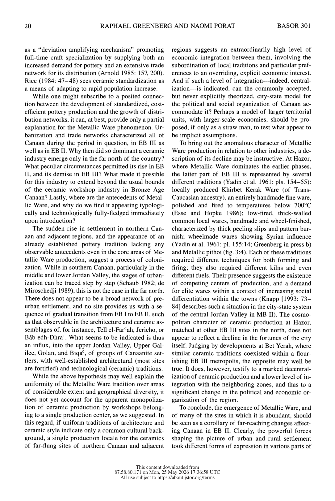

<!-- Start of picture text -->
 20 RAPHAEL GREENBERG AND NAOMI PORAT BASOR 301  as a "deviation amplifying mechani regions sugge s ts an extm" p r aordinarily high level ofomoting  full-time craft specialization by supplying both an economic integration between them, involving the  increased demand for pottery and a subordinatio of local trad n  extens i tions and particular pref-ve trade  network for its distribution (Arn erences t an overriding, explicit economic interest. o ld 1985: 157, 200).  Rice (1984: 47-48) sees ceramic standardization as And if such a level of integration-indeed, central-  a means of adapting to rapid population increase. ization-is indicated, can the commonly accepted,  While one might subscribe to a posited connec- but never explicitly theorized, city-state model for  tion between the development of stan the political an social organization of Canaan ac- d ardized, cost-  efficient pottery production and th commodat it? Perhaps a model of larger territorial e  growth of distri-  bution networks, it can, at best, provid units, with larg e r-scale economies, should be pro- only a partial  explanation for the Metallic Ware phenomenon. Ur- posed, if only as a straw man, to test what appear to  banization and trade networks characterized all of  be implicit assumptions.  Canaan during the period in question, in EB III as To bring out the anomalous character of Metallic  well as in EB II. Why then did so dominant a ceramic Ware production in relation to other industries, a de-  industry emerge only in the far north of the country? scription of its decline may be instructive. At Hazor,  What peculiar circumstances permitted its rise in EB where Metallic Ware dominates the earlier phases,  II, and its demise in EB III? What made it possible the latter part of EB III is represented by several  for this industry to extend beyond the usual bounds different traditions (Yadin et al. 1961: pls. 154-55):  of the ceramic workshop industry in Bronze Age locally produced Khirbet Kerak Ware (of Trans-  Canaan? Lastly, where are the antecedents of Metal- Caucasian ancestry), an entirely handmade fine ware,  lic Ware, and why do we find it appearing typologi- polished and fired to temperatures below 7000C  cally and technologically fully-fledged immediately (Esse and Hopke 1986); low-fired, thick-walled  upon introduction?  common local wares, handmade and wheel-finished,  The sudden rise in settlement in northern Can-  characterized by thick peeling slips and pattern bur-  aan and adjacent regions, and the appearance of annish; wheelmade wares showing Syrian influence  already established pottery tradition lacking any (Yadin et al. 1961: pl. 155:14; Greenberg in press b)  observable antecedents even in the core areas of Me-  and Metallic pithoi (fig. 3:4). Each of these traditions  tallic Ware production, suggest a process of coloni- required different techniques for both forming and  zation. While in southern Canaan, particularly in thefiring; they also required different kilns and even  middle and lower Jordan Valley, the stages of urban- different fuels. Their presence suggests the existence  ization can be traced step by step (Schaub 1982; de of 4competing centers of production, and a demand  Miroschedji 1989), this is not the case in the far north. for elite wares within a context of increasing social  There does not appear to be a broad network of pre- differentiation within the towns (Knapp [1993: 73-  urban settlement, and no site provides us with a se- 84] describes such a situation in the city-state system  quence of gradual transition from EB I to EB II, such of the central Jordan Valley in MB II). The cosmo-  as that observable in the architecture and ceramic as-  politan character of ceramic production at Hazor,  semblages of, for instance, Tell el-FarCah, Jericho, or matched at other EB III sites in the north, does not  B b edh-Dhrac. What seems to be indicated is thus  appear to reflect a decline in the fortunes of the city  an influx, into the upper Jordan Valley, Upper Gal- itself. Judging by developments at Bet Yerah, where  ilee, Golan, and Biqac, of groups of Canaanite set- similar ceramic traditions coexisted within a flour-  tlers, with well-established architectural (most sites ishing EB III metropolis, the opposite may well be  are fortified) and technological (ceramic) traditions. true. It does, however, testify to a marked decentral-  While the above hypothesis may well explain the ization of ceramic production and a lower level of in-  uniformity of the Metallic Ware tradition over areas tegration with the neighboring zones, and thus to a  of considerable extent and geographical diversity, it significant change in the political and economic or-  does not yet account for the apparent monopoliz g a nization of the region.-  tion of ceramic production by workshops belong- To conclude, the emergence of Metallic Ware, and  ing to a single production center, as we suggested. In of many of the sites in which it is abundant, should  this regard, if uniform traditions of architecture and be seen as a corollary of far-reaching changes affect-  ceramic style indicate only a common cultural back- ing Canaan in EB II. Clearly, the powerful forces  ground, a single production locale for the ceramic haping the picture of urban and rural settlement s  of far-flung sites of northern Canaan and adjacent took different forms of expression in various parts of This content downloaded from �������������87.58.80.171 on Mon, 25 May 2026 17:36:58 UTC�������������� All use subject to https://about.jstor.org/terms <!-- End of picture text -->

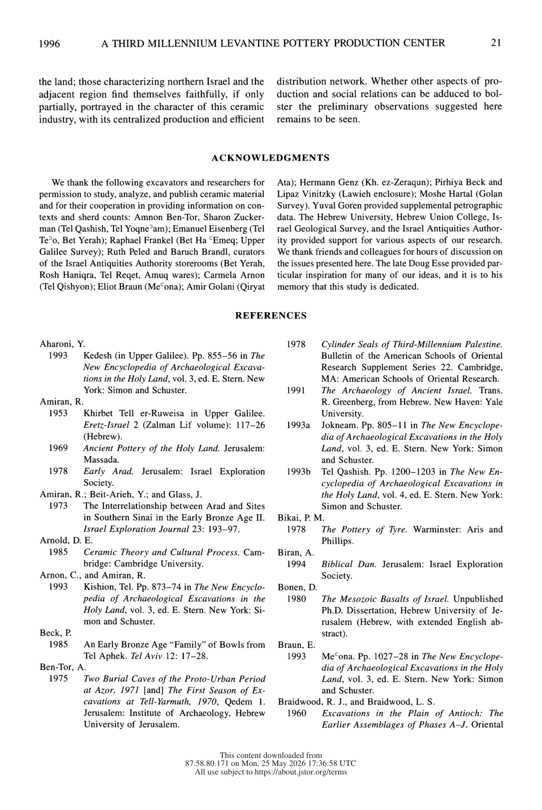

<!-- Start of picture text -->
 1996 A THIRD MILLENNIUM LEVANTINE POTTERY PRODUCTION CENTER 21  the land; those characterizing northern Israel and thedistribution network. Whether other aspects of pro-  adjacent region find themselves faithfully, if only duction and social relations can be adduced to bol-  partially, portrayed in the character of this ceramic ster the preliminary observations suggested here  industry, with its centralized production and efficient remains to be seen.  ACKNOWLEDGMENTS  We thank the following excavators and resea Ata); He r chers formann Genz (Kh. ez-Zeraqun); Pirhiya Beck and  permission to study, analyze, and publish ceramic material Lipaz Vinitzky (Lawieh enclosure); Moshe Hartal (Golan  and for their cooperation in providing information on con- Survey). Yuval Goren provided supplemental petrographic  texts and sherd counts: Amnon Ben-Tor, Sharon Zucker- data. The Hebrew University, Hebrew Union College, Is-  man (Tel Qashish, Tel YoqneDam); Emanuel Eisenberg (Tel rael Geological Survey, and the Israel Antiquities Author-  TeDo, Bet Yerah); Raphael Frankel (Bet Ha CEmeq; Upper ity provided support for various aspects of our research.  Galilee Survey); Ruth Peled and Baruch Brandl, curators We thank friends and colleagues for hours of discussion on  of the Israel Antiquities Authority storerooms (Bet Yerah, the issues presented here. The late Doug Esse provided par-  Rosh Haniqra, Tel Reqet, Amuq wares); Carmela Arnon ticular inspiration for many of our ideas, and it is to his  (Tel Qishyon); Eliot Braun (Mecona); Amir Golani (Qiryat memory that this study is dedicated.  REFERENCES  Aharoni, Y.  1978 Cylinder Seals of Third-Millennium Palestine.  1993 Kedesh (in Upper Galilee). Pp. 855-56 in The Bulletin of the American Schools of Oriental  New Encyclopedia of Archaeological Exc Rese a rch Supplement Series 22. Cambridge,va-  tions in the Holy Land, vol. 3, ed. E. Stern. New MA: American Schools of Oriental Research.  York: Simon and Schuster.  1991 The Archaeology of Ancient Israel. Trans.  Amiran, R.  R. Greenberg, from Hebrew. New Haven: Yale  1953 Khirbet Tell er-Ruweisa in Upper Galilee.  University.  Eretz-Israel 2 (Zalman Lif volume): 117-26  1993a Jokneam. Pp. 805-11 in The New Encyclope-  (Hebrew).  dia of Archaeological Excavations in the Holy  1969 Ancient Pottery of the Holy Land. Jerusalem:  Land, vol. 3, ed. E. Stern. New York: Simon  Massada.  and Schuster.  1978 Early Arad. Jerusalem: Israel Exploration 1993b Tel Qashish. Pp. 1200-1203 in The New En-  Society.  cyclopedia of Archaeological Excavations in  Amiran, R.; Beit-Arieh, Y.; and Glass, J.  the Holy Land, vol. 4, ed. E. Stern. New York:  1973 The Interrelationship between Arad and Sites  Simon and Schuster.  in Southern Sinai in the Early Bronze Age II.  Bikai, P. M.  Israel Exploration Journal 23: 193-97.  1978 The Pottery of Tyre. Warminster: Aris and  Arnold, D. E.  Phillips.  1985 Ceramic Theory and Cultural Process. Cam-  Biran, A.  bridge: Cambridge University.  1994 Biblical Dan. Jerusalem: Israel Exploration  Arnon, C., and Amiran, R.  Society.  1993 Kishion, Tel. Pp. 873-74 in The New Encyclo-  Bonen, D.  pedia of Archaeological Excavations in the  1980 The Mesozoic Basalts of Israel. Unpublished  Holy Land, vol. 3, ed. E. Stem. New York: Si-  Ph.D. Dissertation, Hebrew University of Je-  mon and Schuster.  rusalem (Hebrew, with extended English ab-  Beck, P.  stract).  1985 An Early Bronze Age "Family" of Bowls from Braun, E.  Tel Aphek. Tel Aviv 12: 17-28.  1993 Mecona. Pp. 1027-28 in The New Encyclope-  Ben-Tor, A.  dia of Archaeological Excavations in the Holy  1975 Two Burial Caves of the Proto-Urban Period  Land, vol. 3, ed. E. Stern. New York: Simon  at Azor, 1971 [and] The First Season of Ex-  and Schuster.  cavations at Tell-Yarmuth, 1970, Qedem 1. Braidwood, R. J., and Braidwood, L. S.  Jerusalem: Institute of Archaeology, Hebrew 1960 Excavations in the Plain of Antioch: The  University of Jerusalem.  Earlier Assemblages of Phases A-J. Oriental This content downloaded from �������������87.58.80.171 on Mon, 25 May 2026 17:36:58 UTC�������������� All use subject to https://about.jstor.org/terms <!-- End of picture text -->

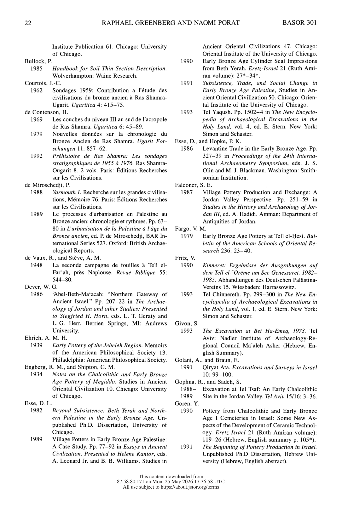

<!-- Start of picture text -->
 22 RAPHAEL GREENBERG AND NAOMI PORAT BASOR 301  Institute Publication 61. Chicago: Un Ancient Or i ental Civilizations 47. Chicago:versity  of Chicago.  Oriental Institute of the University of Chicago.  Bullock, P.  1990 Early Bronze Age Cylinder Seal Impressions  1985 Handbook for Soil Thin Section Description. from Beth Yerah. Eretz-Israel 21 (Ruth Ami-  Wolverhampton: Waine Research. ran volume): 27*-34*.  Courtois, J.-C.  1991 Subsistence, Trade, and Social Change in  1962 Sondages 1959: Contribution a l'6tude des  Early Bronze Age Palestine, Studies in An-  civilisations du bronze ancien 'a Ras Shamra-  cient Oriental Civilization 50. Chicago: Orien-  Ugarit. Ugaritica 4: 415-75.  tal Institute of the University of Chicago.  de Contenson, H.  1993 Tel Yaqush. Pp. 1502-4 in The New Encyclo-  1969 Les couches du niveau III au sud de l'acropole  pedia of Archaeological Excavations in the  de Ras Shamra. Ugaritica 6: 45-89.  Holy Land, vol. 4, ed. E. Stem. New York:  1979 Nouvelles donnees sur la chronologie du  Simon and Schuster.  Bronze Ancien de Ras Shamra. Ugarit For- Esse, D., and Hopke, P. K.  schungen 11: 857-62.  1986 Levantine Trade in the Early Bronze Age. Pp.  1992 Prdhistoire de Ras Shamra: Les sondages  327-39 in Proceedings of the 24th Interna-  stratigraphiques de 1955 a 1976. Ras Shamra-  tional Archaeometry Symposium, eds. J. S.  Ougarit 8. 2 vols. Paris: Editions Recherches  Olin and M. J. Blackman. Washington: Smith-  sur les Civilisations.  sonian Institution.  de Miroschedji, P.  Falconer, S. E.  1988 Yarmouth 1. Recherche sur les grandes civilisa- 1987 Village Pottery Production and Exchange: A  tions, Memoire 76. Paris: Editions Recherches  Jordan Valley Perspective. Pp. 251-59 in  sur les Civilisations.  Studies in the History and Archaeology of Jor-  1989 Le processus d'urbanisation en Palestine au  dan III, ed. A. Hadidi. Amman: Department of  Bronze ancien: chronologie et rythmes. Pp. 63-  Antiquities of Jordan.  80 in L'urbanisation de la Palestine a l'd ge du  Fargo, V. M.  Bronze ancien, ed. P. de Miroschedji, BAR In-  1979 Early Bronze Age Pottery at Tell el-Hesi. Bul-  ternational Series 527. Oxford: British Archae-  letin of the American Schools of Oriental Re-  ological Reports.  search 236: 23-40.  de Vaux, R., and Steve, A. M.  Fritz, V.  1948 La seconde campagne de fouilles 'a Tell el-  1990 Kinneret: Ergebnisse der Ausgrabungen auf  Farcah, pres Naplouse. Revue Biblique 55:  dem Tell el-cOrjme am See Genessaret, 1982-  544-80.  1985. Abhandlungen des Deutschen Palistina-  Dever, W. G.  Vereins 15. Wiesbaden: Harrassowitz.  1986 DAbel-Beth-MaCacah: "Northern Gateway of 1993 Tel Chinnereth. Pp. 299-300 in The New En-  Ancient Israel." Pp. 207-22 in The Archae-  cyclopedia of Archaeological Excavations in  ology of Jordan and other Studies: Presented  the Holy Land, vol. 1, ed. E. Stern. New York:  to Siegfried H. Horn, eds. L. T. Geraty and  Simon and Schuster.  L. G. Herr. Berrien Springs, MI: Andrews Givon, S.  University.  1993 The Excavation at Bet Ha-Emeq, 1973. Tel  Ehrich, A. M. H.  Aviv: Nadler Institute of Archaeology-Re-  1939 Early Pottery of the Jebeleh Region. Memoirs  gional Council Macaleh Asher (Hebrew, En-  of the American Philosophical Society 13.  glish Summary).  Philadelphia: American Philosophical Society.  Golani, A., and Braun, E.  Engberg, R. M., and Shipton, G. M.  1991 Qiryat Ata. Excavations and Surveys in Israel  1934 Notes on the Chalcolithic and Early Bronze  10: 99-100.  Age Pottery of Megiddo. Studies in Ancient  Gophna, R., and Sadeh, S.  Oriental Civilization 10. Chicago: University  1988- Excavation at Tel Tsaf: An Early Chalcolithic  of Chicago.  1989 Site in the Jordan Valley. Tel Aviv 15/16: 3-36.  Esse, D. L.  Goren, Y.  1982 Beyond Subsistence: Beth Yerah and North-  1990 Pottery from Chalcolithic and Early Bronze  ern Palestine in the Early Bronze Age. Un-  Age I Cemeteries in Israel: Some New As-  published Ph.D. Dissertation, University of  pects of the Development of Ceramic Technol-  Chicago.  ogy. Eretz Israel 21 (Ruth Amiran volume):  1989 Village Potters in Early Bronze Age Palestine:  119-26 (Hebrew, English summary p. 105*).  A Case Study. Pp. 77-92 in Essays in Ancient  1991 The Beginning of Pottery Production in Israel.  Civilization. Presented to Helene Kantor, eds.  Unpublished Ph.D Dissertation, Hebrew Uni-  A. Leonard Jr. and B. B. Williams. Studies in  versity (Hebrew, English abstract). This content downloaded from �������������87.58.80.171 on Mon, 25 May 2026 17:36:58 UTC�������������� All use subject to https://about.jstor.org/terms <!-- End of picture text -->

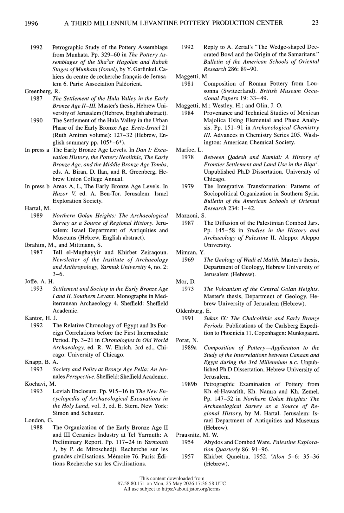

<!-- Start of picture text -->
 1996 A THIRD MILLENNIUM LEVANTINE POTTERY PRODUCTION CENTER 23  1992 Petrographic Study of the Pottery Assemblage 1992 Reply to A. Zertal's "The Wedge-shaped Dec-  from Munhata. Pp. 329-60 in The Pottery As-orated Bowl and the Origin of the Samaritans."  semblages of the Sha ar Hagolan and Rabah Bulletin of the American Schools of Oriental  Stages ofMunhata (Israel), by Y. Garfinkel. Ca- Research 286: 89-90.  hiers du centre de recherche franqais de Jerusa- Maggetti, M.  lem 6. Paris: Association Paleorient.  1981 Composition of Roman Pottery from Lou-  Greenberg, R.  sonna (Switzerland). British Museum Occa-  1987 The Settlement of the Hula Valley in the Early  sional Papers 19: 33-49.  Bronze Age II-III. Master's thesis, Hebrew Uni-Maggetti, M.; Westley, H.; and Olin, J. O.  versity of Jerusalem (Hebrew, English abstract). 1984 Provenance and Technical Studies of Mexican  1990 The Settlement of the Hula Valley in the Urban  Majolica Using Elemental and Phase Analy-  Phase of the Early Bronze Age. Eretz-Israel 21  sis. Pp. 151-91 in Archaeological Chemistry  (Ruth Amiran volume): 127-32 (Hebrew, En-  III. Advances in Chemistry Series 205. Wash-  glish summary pp. 105*-6*).  ington: American Chemical Society.  In press a The Early Bronze Age Levels. In Dan I: Exca- Marfoe, L.  vation History, the Pottery Neolithic, The Early 1978 Between Qadesh and Kumidi: A History of  Bronze Age, and the Middle Bronze Age Tombs,  Frontier Settlement and Land Use in the Biqac.  eds. A. Biran, D. Ilan, and R. Greenberg, He-  Unpublished Ph.D Dissertation, University of  brew Union College Annual.  Chicago.  In press b Areas A, L, The Early Bronze Age Levels. In 1979 The Integrative Transformation: Patterns of  Hazor V ed. A. Ben-Tor. Jerusalem: Israel  Sociopolitical Organization in Southern Syria.  Exploration Society.  Bulletin of the American Schools of Oriental  Hartal, M.  Research 234: 1-42.  1989 Northern Golan Heights: The Archaeological Mazzoni, S.  Survey as a Source of Regional History. Jeru- 1987 The Diffusion of the Palestinian Combed Jars.  salem: Israel Department of Antiquities and  Pp. 145-58 in Studies in the History and  Museums (Hebrew, English abstract).  Archaeology of Palestine II. Aleppo: Aleppo  Ibrahim, M., and Mittmann, S.  University.  1987 Tell el-Mughayyir and Khirbet Zeiraqoun.  Mimran, Y.  Newsletter of the Institute of Archaeology  1969 The Geology of Wadi el Malih. Master's thesis,  and Anthropology, Yarmuk University 4, no. 2:  Department of Geology, Hebrew University of  3-6.  Jerusalem (Hebrew).  Joffe, A. H.  Mor, D.  1993 Settlement and Society in the Early Bronze Age  1973 The Volcanism of the Central Golan Heights.  I and II, Southern Levant. Monographs in Med-  Master's thesis, Department of Geology, He-  iterranean Archaeology 4. Sheffield: Sheffield  brew University of Jerusalem (Hebrew).  Academic.  Oldenburg, E.  Kantor, H. J.  1991 Sukas IX: The Chalcolithic and Early Bronze  1992 The Relative Chronology of Egypt and Its For-  Periods. Publications of the Carlsberg Expedi-  eign Correlations before the First Intermediate  tion to Phoenicia 11. Copenhagen: Munksgaard.  Period. Pp. 3-21 in Chronologies in Old World Porat, N.  Archaeology, ed. R. W. Ehrich. 3rd ed., Chi- 1989a Composition of Pottery--Application to the  cago: University of Chicago.  Study of the Interrelations between Canaan and  Knapp, B. A.  Egypt during the 3rd Millennium B.c. Unpub-  1993 Society and Polity at Bronze Age Pella: An An-  lished Ph.D Dissertation, Hebrew University of  nales Perspective. Sheffield: Sheffield Academic.  Jerusalem.  Kochavi, M.  1989b Petrographic Examination of Pottery from  1993 Leviah Enclosure. Pp. 915-16 in The New En-  Kh. el-Hawarith, Kh. Namra and Kh. Zemel.  cyclopedia of Archaeological Excavations in  Pp. 147-52 in Northern Golan Heights: The  the Holy Land, vol. 3, ed. E. Stern. New York:  Archaeological Survey as a Source of Re-  Simon and Schuster.  gional History, by M. Hartal. Jerusalem: Is-  London, G.  rael Department of Antiquities and Museums  1988 The Organization of the Early Bronze Age II  (Hebrew).  and III Ceramics Industry at Tel Yarmuth: A Prausnitz, M. W.  Preliminary Report. Pp. 117-24 in Yarmouth 1954 Abydos and Combed Ware. Palestine Explora-  1, by P. de Miroschedji. Recherche sur les  tion Quarterly 86: 91-96.  grandes civilisations, M6moire 76. Paris: 1di- 1957 Khirbet Quneitra, 1952. CAlon 5-6: 35-36  tions Recherche sur les Civilisations.  (Hebrew). This content downloaded from �������������87.58.80.171 on Mon, 25 May 2026 17:36:58 UTC�������������� All use subject to https://about.jstor.org/terms <!-- End of picture text -->

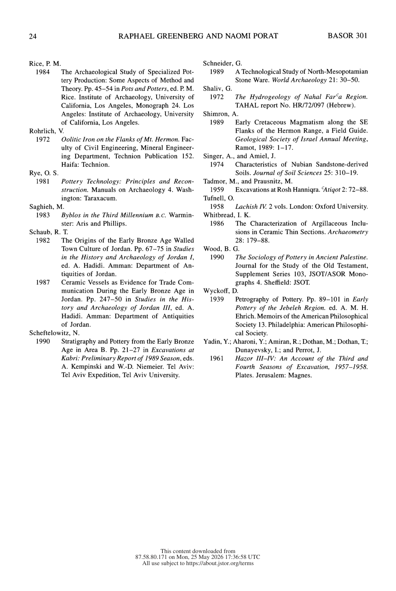

<!-- Start of picture text -->
 24 RAPHAEL GREENBERG AND NAOMI PORAT BASOR 301  Rice, P. M.  Schneider, G.  1984 The Archaeological Study of Specialized Pot- 1989 A Technological Study of North-Mesopotamian  tery Production: Some Aspects of Method and Stone Ware. World Archaeology 21: 30-50.  Theory. Pp. 45-54 in Pots and Potters, ed. P. M. Shaliv, G.  Rice. Institute of Archaeology, University of 1972 The Hydrogeology of Nahal Farca Region.  California, Los Angeles, Monograph 24. Los TAHAL report No. HR/72/097 (Hebrew).  Angeles: Institute of Archaeology, University Shimron, A.  of California, Los Angeles. 1989 Early Cretaceous Magmatism along the SE  Rohrlich, V.  Flanks of the Hermon Range, a Field Guide.  1972 Oolitic Iron on the Flanks of Mt. Hermon. Fac- Geological Society of Israel Annual Meeting,  ulty of Civil Engineering, Mineral Engineer- Ramot, 1989: 1-17.  ing Department, Technion Publication 152. Singer, A., and Amiel, J.  Haifa: Technion.  1974 Characteristics of Nubian Sandstone-derived  Rye, O. S.  Soils. Journal of Soil Sciences 25: 310-19.  1981 Pottery Technology: Principles and Recon-  Tadmor, M., and Prausnitz, M.  struction. Manuals on Archaeology 4. Wash-  1959 Excavations at Rosh Hanniqra. CAtiqot 2: 72-88.  ington: Taraxacum.  Tufnell, O.  Saghieh, M.  1958 Lachish IV 2 vols. London: Oxford University.  1983 Byblos in the Third Millennium B.C. Warmin-  Whitbread, I. K.  ster: Aris and Phillips.  1986 The Characterization of Argillaceous Inclu-  Schaub, R. T.  sions in Ceramic Thin Sections. Archaeometry  1982 The Origins of the Early Bronze Age Walled  28: 179-88.  Town Culture of Jordan. Pp. 67-75 in Studies  Wood, B. G.  in the History and Archaeology of Jordan I,  1990 The Sociology of Pottery in Ancient Palestine.  ed. A. Hadidi. Amman: Department of An-  Journal for the Study of the Old Testament,  tiquities of Jordan.  Supplement Series 103, JSOT/ASOR Mono-  1987 Ceramic Vessels as Evidence for Trade Com-  graphs 4. Sheffield: JSOT.  munication During the Early Bronze Age in Wyckoff, D.  Jordan. Pp. 247-50 in Studies in the His- 1939 Petrography of Pottery. Pp. 89-101 in Early  tory and Archaeology of Jordan III, ed. A. Pottery of the Jebeleh Region. ed. A. M. H.  Hadidi. Amman: Department of Antiquities Ehrich. Memoirs of the American Philosophical  of Jordan.  Society 13. Philadelphia: American Philosophi-  Scheftelowitz, N.  cal Society.  1990 Stratigraphy and Pottery from the Early Bronze Yadin, Y.; Aharoni, Y.; Amiran, R.; Dothan, M.; Dothan, T.;  Age in Area B. Pp. 21-27 in Excavations at  Dunayevsky, I.; and Perrot, J.  Kabri: Preliminary Report of 1989 Season, eds.  1961 Hazor III-IV: An Account of the Third and  A. Kempinski and W.-D. Niemeier. Tel Aviv:  Fourth Seasons of Excavation, 1957-1958.  Tel Aviv Expedition, Tel Aviv University.  Plates. Jerusalem: Magnes. This content downloaded from �������������87.58.80.171 on Mon, 25 May 2026 17:36:58 UTC�������������� All use subject to https://about.jstor.org/terms <!-- End of picture text -->

